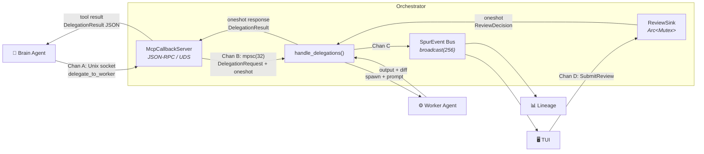
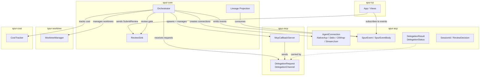
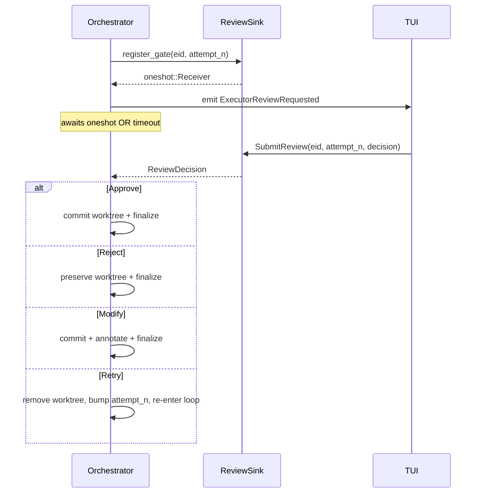
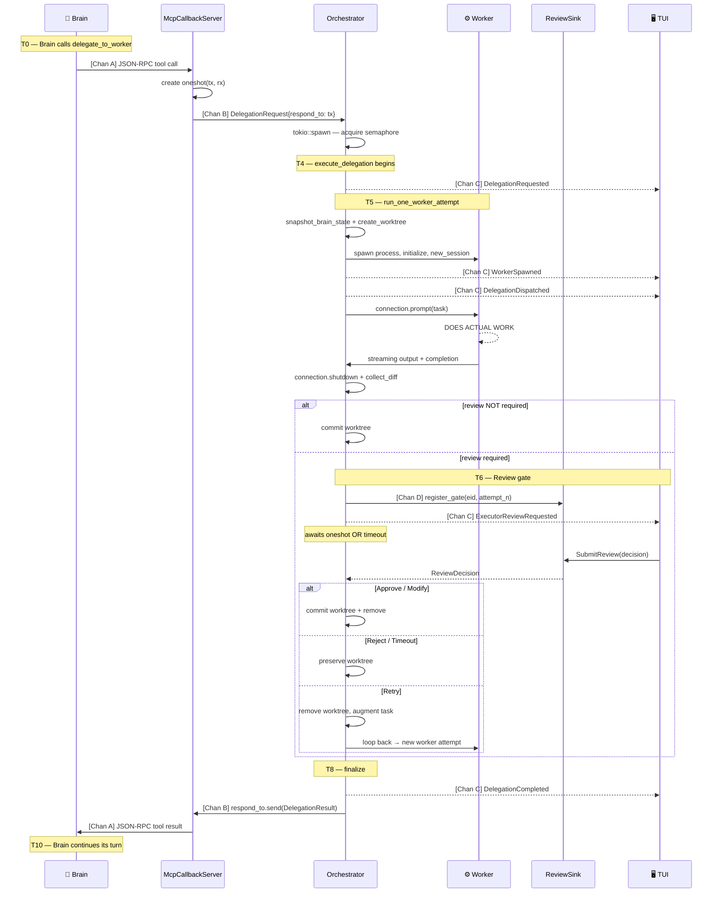
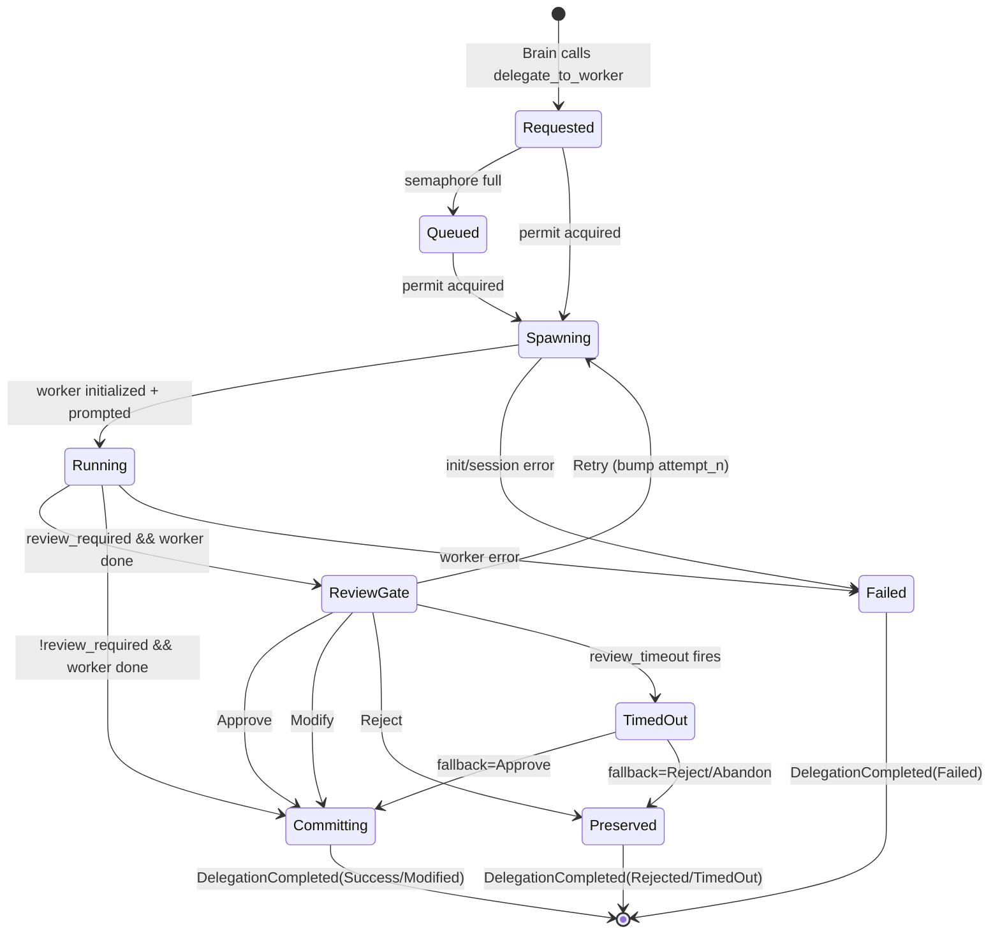
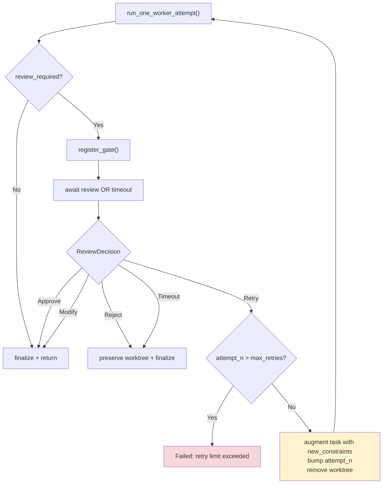
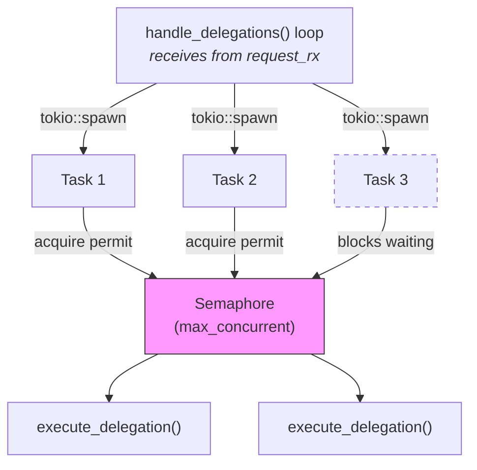
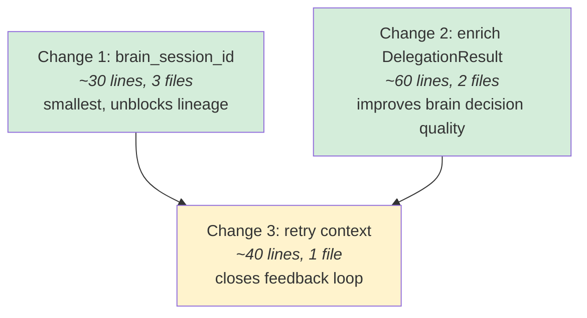

# Brain-Worker Communication Architecture

**Status:** Living document — describes current state + proposed changes  
**Last updated:** 2026-04-14 (Phase 1 shipped)  
**Owner:** Kevin  
**Crates:** `spur-core` (orchestrator), `spur-mcp` (MCP callback server), `spur-acp` (domain types)

---

## Implementation Status

| Phase | Status | Reference |
|---|---|---|
| **Phase 1 — Enrich the Pipe** (§4 below) | ✅ Shipped 2026-04-14 (commits `85415c3..edd94f3`, +658 / −25 across 8 files) | Spec: `docs/superpowers/specs/2026-04-14-brain-worker-refinement-design.md` · Plan: `docs/superpowers/plans/2026-04-14-brain-worker-phase1-refinement.md` |
| **Next — SpurEvent Stream Backbone** (proposed) | 🟡 Proposed for review — supersedes §5.3 ("Split Broadcast Bus") | Spec: `docs/superpowers/specs/2026-04-14-spurevent-stream-backbone-design.md` |
| **Phase 2** (§5 below) | ⚪ Remaining items: Executor abstraction (§5.2), Async delegation (§5.4), Structured error taxonomy (§5.5), Worker report file (§5.1) | — |

The narrative below preserves the pre-Phase-1 framing as design history. Sentences and diagrams describing the *pre-fix* state are retained so readers can follow the reasoning; past-tense annotations mark what has since shipped.

---

## Executive Summary

SPUR's orchestrator coordinates two independent agent processes — a long-lived
**brain** (e.g., Kiro, Claude Code) and ephemeral **workers** — through 4
internal communication channels. The architecture follows the industry-standard
**agents-as-tools** pattern: the brain calls `delegate_to_worker` as an MCP tool
and blocks until the worker completes.

**What works well:**
- Per-request oneshot channels (no shared response bus, no ID matching)
- Semaphore-bounded parallel execution via `delegate_parallel`
- Human-in-the-loop review gate with race-condition-safe `ReviewSink`
- Git worktree isolation per worker (same pattern as Claude Code)

**What Phase 1 addressed** (all three items now fixed as of 2026-04-14):
1. ~~**Brain gets impoverished feedback.**~~ Worker results were truncated to 500
   chars (byte-slice, latent UTF-8 panic). No structured diff stats. Errors were
   generic strings. → `DelegationResult.summary` now tail-weighted and
   UTF-8-safe via `truncate_summary_env_default` (4 KB default, env override);
   `DelegationResult.diff_summary` populated from `git diff --numstat`; the
   generic `"Worker reported errors"` literal replaced with a char-boundary-safe
   tail of the worker's actual output.
2. ~~**Brain session identity not threaded.**~~ `DelegationRequested.from` emitted
   the worker session instead of the brain session. Lineage couldn't build the
   brain-to-worker tree. → `brain_session_id` now threaded from
   `McpCallbackServer` through `DelegationRequest` → `handle_delegations` →
   `execute_delegation` → `run_one_worker_attempt`, and used in both
   `DelegationRequested.from` and `DelegationDispatched.from`.
3. ~~**Retry loop is open.**~~ Each retry worker was a blank slate — no access to
   previous attempts. Violated the Reflexion pattern. → `execute_delegation`
   now maintains a `Vec<RetryAttempt>` (summary + diff_summary + feedback per
   attempt, 2 KB total cap dropping oldest first), rendered into the next
   attempt's prompt via `render_retry_context`.

**Next proposed step — SpurEvent Stream Backbone.** Hardens Channel C (the event
bus) with strict monotonic `seq`, a durable JSONL sink for post-hoc replay, and
an initial `_spur/*` ACP ExtNotification vocabulary for worker-side side-channel
events (heartbeat, progress milestone, file touched). Includes the H1–H5
streaming pathology fixes diagnosed separately. Supersedes §5.3 below.
Spec: `docs/superpowers/specs/2026-04-14-spurevent-stream-backbone-design.md`.

---

## 1. Channel Architecture

Four distinct channels connect the brain, orchestrator, workers, and TUI:



### Crate Dependency Map



### 1.1 Channel A: MCP Bridge (Brain <-> McpCallbackServer)

| Property | Value |
|---|---|
| Transport | Unix domain socket `/tmp/spur-mcp-{session_id}.sock` |
| Protocol | JSON-RPC 2.0, newline-delimited |
| Direction | Bidirectional (request/response) |
| Lifetime | Per brain session |
| Source | `crates/spur-mcp/src/server.rs` |

The brain connects to the MCP callback server during ACP initialization.
Tools exposed:

| Tool | Behavior |
|---|---|
| `delegate_to_worker` | Blocks until worker completes. Returns `DelegationResult` as JSON. |
| `delegate_parallel` | Sends N requests, each with own oneshot. Blocks until all complete. |
| `list_available_workers` | Returns static worker list (name, description, cost_tier). |
| `report_progress` | Fire-and-forget. Sends to event bus. |
| `get_issue` / `update_issue` / `create_pr` | PM operations (not yet wired). |

Failure modes:
- Socket cleanup on crash: `start()` removes stale sockets. Handled.
- Brain disconnects mid-delegation: oneshot receiver dropped, worker continues
  but result discarded, `cleanup_cancelled_review` fires. Handled.
- Backpressure: `delegation_tx` is `mpsc(32)`. Brain can't exceed this because
  ACP tool calls are synchronous. Correct backpressure.

### 1.2 Channel B: Delegation Pipeline (mpsc + oneshot)

| Property | Value |
|---|---|
| Forward path | `mpsc::channel::<DelegationRequest>(32)` |
| Return path | `oneshot::Sender<DelegationResult>` per request |
| Direction | McpCallbackServer -> Orchestrator -> back |
| Source | `crates/spur-mcp/src/tools.rs`, `orchestrator.rs` |

```rust
// Forward: each request carries its own return channel
pub struct DelegationRequest {
    pub id: String,
    pub agent: String,
    pub task: String,
    pub context_files: Vec<String>,
    pub respond_to: oneshot::Sender<DelegationResult>,
}

// Return: structured result (shape AFTER Phase 1)
pub struct DelegationResult {
    pub status: DelegationStatus,
    pub diff: Option<String>,
    pub diff_summary: Option<DiffSummary>,  // Phase 1: git diff --numstat
    pub summary: Option<String>,            // Phase 1: tail-weighted UTF-8-safe
                                            //   up to 4 KB (env-tunable via
                                            //   SPUR_SUMMARY_MAX_BYTES)
    pub estimated_cost_usd: f64,
}
```

Design choice — per-request oneshot vs shared response channel:

| Aspect | Oneshot (current) | Shared response channel |
|---|---|---|
| Correlation | Implicit (type system) | Manual ID matching |
| Dropped response | Compile-time visible | Silent loss |
| Cancellation | Drop receiver = cancel | Need explicit cancel msg |

Oneshot wins on correctness guarantees. This is the right choice.

Failure modes:
- Orchestrator drops `request_rx`: `send()` returns `Err`, MCP server returns
  JSON-RPC error, brain sees tool failure. Propagated correctly.
- Oneshot sender dropped: `rx.await` returns `Err`, MCP server returns
  "Delegation cancelled". Handled.
- Already-spawned worker tasks continue after `delegation_handle.abort()`.
  Workers are never cancelled — results discarded via oneshot error path.

### 1.3 Channel C: Event Bus (broadcast)

| Property | Value |
|---|---|
| Type | `broadcast::channel::<SpurEvent>(256)` |
| Direction | Orchestrator -> TUI, Lineage, any subscriber |
| Source | `crates/spur-acp/src/domain/events.rs`, `orchestrator.rs` |

Emits `SpurEvent { occurred_at, body: SpurEventBody }` at every lifecycle
transition. ~25 event variants covering brain, worker, delegation, review,
and lineage concerns.

Failure modes:
- Buffer overflow risk: 256 buffer mixes high-frequency streaming chunks
  (`AgentNotification`) with critical lifecycle events (`DelegationCompleted`).
  During heavy parallel delegation, burst of `7 x max_concurrent` events
  approaches the limit. If TUI lags, it gets `RecvError::Lagged` and misses
  events. A missed `DelegationCompleted` means TUI shows worker as permanently
  "running". Addressed by the proposed SpurEvent Stream Backbone spec
  (buffer bumped to 4096 + monotonic `seq` + durable JSONL sink so lag is
  observable rather than silent); see `docs/superpowers/specs/2026-04-14-spurevent-stream-backbone-design.md`.
- No subscribers: `event_tx.send()` silently drops. Correct for headless mode.
- Event ordering: broadcast preserves send order. Critical for lineage.

### 1.4 Channel D: Review Gate (ReviewSink)

| Property | Value |
|---|---|
| Type | `Arc<Mutex<HashMap<ExecutorId, (u32, oneshot::Sender<ReviewDecision>)>>>` |
| Direction | TUI -> Orchestrator (via `review_dispatcher_loop` task) |
| Source | `crates/spur-core/src/review_sink.rs` |

Critical ordering invariant: `register_gate()` MUST be called BEFORE emitting
`ExecutorReviewRequested`. This guarantees the TUI's `SubmitReview` can always
find the matching sender.



Failure modes — all handled:
- Stale review for superseded attempt: `attempt_n` guard drops with warning.
- Double registration: returns `Err(AlreadyRegistered)`.
- Timeout: explicitly removes sink entry + emits `ExecutorReviewCancelled`.
- Review submitted after timeout: `submit()` finds no entry, returns `false`.

This is the best-designed channel in the system.

---

## 2. Delegation Lifecycle

Full trace of a single delegation from brain tool call to result:



### Delegation State Machine



### Await Point Analysis

| Point | What blocks | Typical duration | Risk |
|---|---|---|---|
| T1 | mpsc send | <1us (unless buffer full) | Low |
| T3 | Semaphore | 0 to minutes (workers busy) | Medium |
| T5a | Git operations | 10-500ms | Low |
| T5b | Process spawn + init | 1-3s (node/npx) | Medium |
| T5c | Worker doing work | Seconds to minutes | Expected |
| T5d | Git diff | 10-100ms | Low |
| T6 | Human review | 0 to 30 minutes | By design |

Total brain blocking time = worker execution + review time. This is correct —
the brain SHOULD block on `delegate_to_worker`. It's a synchronous tool call.

### Retry Sub-Loop



On `ReviewDecision::Retry { new_constraints }` (post-Phase 1 behavior):

1. Current worktree is removed (intermediate diff is moot)
2. Attempt's `(attempt_n, summary, diff_summary, feedback)` is pushed into a
   `Vec<RetryAttempt>` accumulator local to `execute_delegation`
3. `apply_bloat_cap(&mut retry_history, 2048)` drops oldest entries if the
   accumulated summary+feedback footprint exceeds 2 KB
4. Task is re-rendered via `render_retry_context(&retry_history, &original_task,
   &new_constraints)` — each retry sees ALL prior attempts' summaries, diff
   stats, and reviewer feedback, framed as "approaches NOT to repeat"
5. `attempt_n` bumps (bounded by `max_review_retries`)
6. Fresh `worker_session` is generated
7. `run_one_worker_attempt` is called again

Before Phase 1 (design history): constraints REPLACED rather than accumulated —
each retry saw only the latest `new_constraints` with no history. This violated
the Reflexion pattern. Fix shipped 2026-04-14 (commit `0684e80` + `edd94f3`).

### Concurrency Model



- Dispatcher spawns a new tokio task per request (unbounded task creation)
- Semaphore limits actual concurrent workers to `max_concurrent`
- Spawned tasks are fire-and-forget (JoinHandle dropped, no tracking)
- No mechanism to list, cancel, or wait-for-all in-flight delegations

---

## 3. Gap Analysis

### 3.1 Industry Reference

Seven sources surveyed (April 2026):

**Anthropic** — "How we built our multi-agent research system" (official eng blog)
- Orchestrator-worker with parallel subagents
- Key insight: "Subagent output to a filesystem to minimize the 'game of
  telephone'" — avoid information loss through intermediaries
- Key insight: "Allow the agent to introspect and improve. Run it in a loop,
  and let it critique itself; or, provide error messages and let it improve."

**Claude Code** — Multi-agent leader/worker architecture
- File mailbox protocol: "Structured messages, not vibes. The mailbox carries
  more than text — it carries permission requests, shutdown protocols, and
  status notifications."
- Worker prompts must be self-contained
- Worktree isolation via git worktrees (same pattern as spur)

**OpenAI Agents SDK** — Two orchestration patterns:
- "Agents as tools": manager agent calls specialists via `Agent.as_tool()` and
  keeps control. Specialist returns structured result. (This is spur's pattern.)
- "Handoffs": triage agent routes conversation to specialist who takes over.
- Recommendation: "Invest in good prompts. Have specialized agents that excel
  in one task."

**LangGraph** — Graph-based state machines:
- Explicit `StateGraph` with typed state, conditional edges, checkpointing
- Retry modeled as graph cycle: `verify -> fail -> re-research`
- State is a `TypedDict` — every field is typed and visible

**CrewAI** — Role-based crews:
- Every `Task` has `expected_output` and `context=[previous_tasks]`
- Explicit dependency passing between tasks
- `allow_delegation=True` enables agents to delegate to other agents

**Reflexion Pattern** (Stevens, VIGIL):
- Actor -> Evaluator/Critic -> Self-Reflection -> Retry
- "The agent generates a verbal critique of WHY it failed"
- "Systems using self-healing reduced premature success notifications from
  100% to 0% in complex tasks"

**Production Practitioners** (Fordel Studios):
- "Workers return structured results with a status field: success, failure,
  needs_human"
- "A structured error gives the LLM something to reason about; an exception
  gives it nothing"
- "Orchestrator never retries workers inline — failures go to a retry queue"
- "Workers are stateless — all state lives in the orchestrator's state object"

### 3.2 Consensus Principles

| # | Principle | Source |
|---|---|---|
| P1 | Structured results, not raw text | ALL frameworks |
| P2 | Rich feedback — structured errors with "why" | Fordel, Reflexion, Anthropic |
| P3 | Reflexion loop — retry conditioned on previous error + critique | Stevens, Anthropic, LangGraph |
| P4 | Explicit state machine | LangGraph, Fordel, Stevens |
| P5 | Orchestrator identity and full traceability | Anthropic, Fordel, OpenAI |
| P6 | Self-contained worker prompts | Claude Code, Fordel |
| P7 | Parallel execution with bounded concurrency | Anthropic, Stevens |

### 3.3 Spur Alignment Scorecard

Status column shows the pre-Phase-1 reading; the "Now" column reflects the
post-Phase-1 state (commits `85415c3..edd94f3`, shipped 2026-04-14).

| Principle | Pre-Phase-1 Status | Pre-Phase-1 Gap | Now (post-Phase-1) |
|---|---|---|---|
| P1 Structured results | 500-char truncated text + raw diff | **HIGH** | ✅ `DelegationResult.diff_summary` populated from `git diff --numstat`; summary widened to 4 KB with tail-weighted UTF-8-safe truncation |
| P2 Rich feedback | Generic `"Worker reported errors"` string | **HIGH** | ◐ Partial — error string now carries concrete tail of worker output. Structured `ErrorKind` enum still open (see §5.5) |
| P3 Reflexion loop | Open loop, no previous attempt context | **HIGH** | ✅ `Vec<RetryAttempt>` accumulator + 2 KB bloat cap + `render_retry_context` prompt |
| P4 Explicit state machine | Implicit in code, LifecycleState exists | LOW | (unchanged) |
| P5 Orchestrator identity | brain_session_id not threaded | **MEDIUM** | ✅ Threaded end-to-end through `DelegationRequest` → events |
| P6 Self-contained prompts | Worktree provides context | NONE | (unchanged) |
| P7 Bounded concurrency | Semaphore + oneshot per request | NONE | (unchanged) |

### 3.4 What the Brain Actually Sees

The brain receives `DelegationResult` serialized as pretty-printed JSON inside
an MCP tool response.

**Before Phase 1** (pre-2026-04-14, shown for design history):

```json
{
  "status": { "Failed": { "error": "Worker reported errors" } },
  "diff": null,
  "summary": "I added rate limiting middleware to the API routes. The impl uses a token bucket algorithm with configurable limits per endpoint. However, when running the test suite, several integration tests failed because they don't account for the new rate limiting headers. The failing tests are: test_api_create_user, test_api_list_ite...",
  "estimated_cost_usd": 0.35
}
```

Problems with the pre-Phase-1 shape:
- Summary truncated at 500 chars with a byte-slice (latent UTF-8 panic)
- Error is generic — brain can't distinguish actual failure modes
- No diff stats — brain doesn't know how many files changed
- No file list — brain can't assess scope of changes

**After Phase 1** (current shape, shipped 2026-04-14):

```json
{
  "status": { "Failed": { "error": "error[E0277]: the trait `From<String>` is not implemented for `RateLimitError`\n   --> src/middleware/rate_limit.rs:42:14\n    |\n42 |     Err(err)?;\n    |           ^ the trait `From<String>` is not implemented\n... test failures: test_api_create_user, test_api_list_items (headers/rate-limit-remaining)\n" } },
  "diff": "--- a/src/middleware/rate_limit.rs\n+++ b/src/middleware/rate_limit.rs\n@@ ...",
  "diff_summary": {
    "files_changed": 4,
    "insertions": 87,
    "deletions": 3,
    "files": ["src/middleware/rate_limit.rs", "src/routes/mod.rs", "src/routes/users.rs", "src/routes/items.rs"]
  },
  "summary": "I added rate limiting middleware... [up to 4 KB, head-and-tail preserved across char boundaries; configurable via SPUR_SUMMARY_MAX_BYTES] ... conclusion with test results and next-step notes.",
  "estimated_cost_usd": 0.35
}
```

The ACP protocol constrains the brain to see ONLY the final tool result (it
blocks on the synchronous tool call). Since we can't change the protocol,
maximizing the information density of `DelegationResult` was the single
highest-leverage fix — Phase 1.

---

## 4. Phase 1: Enrich the Pipe

**Status:** ✅ Shipped 2026-04-14 (commits `85415c3..edd94f3`, +658 / −25 across 8 files).
**Scope as shipped:** ~200 lines of production code + ~460 lines of tests (plan estimated ~130 LoC for production; additional surfaced during implementation — UTF-8 safety, rename-path handling, test helpers, integration test).
**Risk:** Low — additive changes, no architectural modifications.
**Industry justification:** Closes gaps P1, P3, P5 fully and P2 partially (ErrorKind taxonomy deferred — see §5.5).
**Refinement spec:** `docs/superpowers/specs/2026-04-14-brain-worker-refinement-design.md` refined the 3-change proposal below into 4 changes to fix a latent UTF-8 panic, correct the head:tail weighting, replace the regex diff parser with `git diff --numstat`, and add char-boundary-safe error tail capture. Implementation plan: `docs/superpowers/plans/2026-04-14-brain-worker-phase1-refinement.md`.

The three sub-sections below describe the original proposal. The actual shipped
change set matches intent (with the refinements noted above); sentences below
are retained in their original proposal form as design history.

### 4.1 Change 1: Thread brain_session_id (~30 lines, 3 files)

**Closes:** Gap P5 (Orchestrator identity)

The `McpCallbackServer` is created with the brain's `SessionId` but doesn't
store it. `DelegationRequest` doesn't carry it. Events emit `worker_session`
where they should emit `brain_session`.

Struct diff for `DelegationRequest` (`crates/spur-mcp/src/tools.rs`):

```rust
pub struct DelegationRequest {
    pub id: String,
    pub agent: String,
    pub task: String,
    pub context_files: Vec<String>,
    pub respond_to: oneshot::Sender<DelegationResult>,
+   pub brain_session_id: SessionId,
}
```

Struct diff for `McpCallbackServer` (`crates/spur-mcp/src/server.rs`):

```rust
pub struct McpCallbackServer {
    socket_path: PathBuf,
    delegation_tx: mpsc::Sender<DelegationRequest>,
    workers: Vec<WorkerInfo>,
+   brain_session_id: SessionId,
}
```

Propagation path:
1. `McpCallbackServer::new(&session_id)` stores `brain_session_id`
2. Every handler that creates `DelegationRequest` stamps it
3. `handle_delegations` destructures and passes to `execute_delegation`
4. `execute_delegation` uses it in event emissions:
   - `DelegationRequested.from` -> `brain_session_id` (was `worker_session`)
   - `DelegationDispatched.from` -> `brain_session_id` (was `worker_session`)

Files touched:
- `crates/spur-mcp/src/server.rs` — struct + handlers
- `crates/spur-mcp/src/tools.rs` — DelegationRequest struct
- `crates/spur-core/src/orchestrator.rs` — handle_delegations, execute_delegation

### 4.2 Change 2: Enrich DelegationResult (~60 lines, 2 files)

**Closes:** Gaps P1 (Structured results) and P2 (Rich feedback)

Struct diff for `DelegationResult` (`crates/spur-acp/src/domain/delegation.rs`):

```rust
pub struct DelegationResult {
    pub status: DelegationStatus,
    pub diff: Option<String>,
+   pub diff_summary: Option<DiffSummary>,  // reuse existing type from events.rs
    pub summary: Option<String>,             // CHANGED: 500 -> 4000 chars
    pub estimated_cost_usd: f64,
}
```

`DiffSummary` already exists in `crates/spur-acp/src/domain/events.rs`:

```rust
pub struct DiffSummary {
    pub files_changed: usize,
    pub insertions: usize,
    pub deletions: usize,
    pub files: Vec<PathBuf>,
}
```

**Smart truncation** replaces the hard 500-char limit. Preserves head (what the
worker did) and tail (the conclusion), drops the middle:

```
if text.len() <= 4000 { return text }
head = text[..2666]
tail = text[last 1333..]
return "{head}\n\n[... {omitted} chars omitted ...]\n\n{tail}"
```

Why 4000 chars: ~1000 tokens. With 5 parallel delegations, that's 5000 tokens
of summaries — 2.5-4% of a 128K-200K context window. Acceptable.

**Diff stats parser** — add a private helper in `orchestrator.rs` that extracts
`DiffSummary` from the raw unified diff string already in memory:

```
for each line in diff:
    "+++ b/{path}" -> add to files list
    starts with '+' (not '+++') -> insertions += 1
    starts with '-' (not '---') -> deletions += 1
```

~15 lines, no dependencies, deterministic, unit-testable.

**After this change**, the brain sees:

```json
{
  "status": { "Failed": { "error": "Worker reported errors" } },
  "diff": "--- a/src/middleware/rate_limit.rs\n+++ ...",
  "diff_summary": {
    "files_changed": 4,
    "insertions": 87,
    "deletions": 3,
    "files": ["src/middleware/rate_limit.rs", "src/routes/mod.rs", ...]
  },
  "summary": "I added rate limiting middleware... [full 4000-char explanation with head+tail preserved]",
  "estimated_cost_usd": 0.35
}
```

Files touched:
- `crates/spur-acp/src/domain/delegation.rs` — DelegationResult struct
- `crates/spur-core/src/orchestrator.rs` — run_one_worker_attempt (summary + diff_summary), finalize

### 4.3 Change 3: Close Retry Feedback Loop (~40 lines, 1 file)

**Closes:** Gap P3 (Reflexion loop)

Currently each retry is a blank slate. The new worker has zero context about
what was tried before. Fix: accumulate retry context across the loop.

Add a local accumulator in `execute_delegation`'s retry loop:

```rust
// Local to execute_delegation — not a new type in the public API
let mut retry_history: Vec<(u32, String, String)> = Vec::new();
// Each entry: (attempt_n, summary, reviewer_feedback)
```

On `ReviewDecision::Retry { new_constraints }`:

1. Push current attempt's context:
   `retry_history.push((attempt_n, outcome.summary, new_constraints))`

2. Build augmented task from ALL previous attempts:

```text
{original_task}

--- Previous attempt (attempt 1) ---
What was tried:
  {summary from attempt 1}
Reviewer feedback:
  {feedback from attempt 1}

--- Previous attempt (attempt 2) ---
What was tried:
  {summary from attempt 2}
Reviewer feedback:
  {feedback from attempt 2}

--- Your task ---
Address the reviewer's feedback above. Do NOT repeat approaches
that were already tried.
```

3. Bump `attempt_n`, generate new `worker_session`, loop back.

This closes the feedback loop: each retry worker knows the full history of
what was tried and why it was rejected. Implements the Reflexion pattern
(Actor -> Critic -> Self-Reflection -> Retry) where the "critic" is the
human reviewer and the "self-reflection" is the accumulated context block.

Size estimate: each retry context block is ~200-500 chars (summary is already
truncated by Change 2, feedback is human-written). With `max_review_retries=3`,
that's ~1.5KB of accumulated context. Acceptable.

Files touched:
- `crates/spur-core/src/orchestrator.rs` — execute_delegation retry loop

### 4.4 Implementation Order



Changes 1 and 2 are independent and can be done in parallel.
Change 3 benefits from Change 2 (richer summary = better retry context).

---

## 5. Phase 2: Operational Maturity (Future)

**Status:** Directional — §5.1, §5.2, §5.4, §5.5 not yet specified. §5.3 has been
superseded by a dedicated spec (see below). §5.6 tracks the current next step.

These changes address operational quality (cost, observability, UX) rather than
brain decision quality. They can be done independently after Phase 1.

### 5.0 Next proposed step: SpurEvent Stream Backbone

**Status:** 🟡 Proposed for review as of 2026-04-14.
**Spec:** `docs/superpowers/specs/2026-04-14-spurevent-stream-backbone-design.md`.

Hardens Channel C (the event bus) and extends the worker-side vocabulary,
without changing any of the four channels or `DelegationResult` / `ReviewSink`
/ MCP protocol. Five components:

| Component | What it does |
|---|---|
| **S1 — Streaming pathology fixes** | H1'–H5: dead-tx race, interleave split, drain-coalescing, broadcast lag visibility |
| **S2 — Unified emit funnel + monotonic seq** | Every event carries a strictly-ordered `seq: u64`; all 16 direct `event_tx.send` sites in `orchestrator.rs` migrate to the funnel |
| **S3 — JSONL durable sink** | `~/.spur/events/{pid}-{started_at}.ndjson` — enables replay, post-hoc debugging, external file-tail subscribers |
| **S5 — `_spur/*` ACP ExtNotification vocabulary** | `_spur/heartbeat`, `_spur/progress_milestone`, `_spur/file_touched` as side-channel worker events over the existing ACP extension surface |
| (S4 UDS push bridge) | Deferred — file-tail is sufficient until a concrete push-subscriber appears |

Relationship to Phase 1: the stream spec's author has confirmed the two specs
are non-overlapping. A cross-check of Phase 1's landed code identifies three
adjustments the stream spec should respect when implementing: (a) S2 must
preserve the new `brain_session_id: &SessionId` parameter on
`run_one_worker_attempt`; (b) keep the existing `self.emit(SpurEvent::now(body))`
pattern at the ~100 method-scope call sites and only migrate the 16
free-function call sites; (c) stamp `brain_session_id` on the new
`WorkerHeartbeat` / `WorkerProgress` / `WorkerFileTouched` variants so
stream queries become filter-not-join.

### 5.1 Worker Report File (from Anthropic's "output to filesystem" pattern)

Worker writes a detailed `WORKER_REPORT.md` to its worktree. `DelegationResult`
carries the file path. Brain reads it via its own filesystem tools if the
summary isn't enough. Eliminates the "game of telephone" — no truncation, no
information loss through intermediaries.

Requires: worktree preserved long enough for brain to read. Brain must know
about worktree paths. More complex than Phase 1's smart truncation.

### 5.2 Executor Abstraction (worker cancellation + tracking)

Introduce an `Executor` struct that encapsulates a worker's full lifecycle:

```rust
struct Executor {
    id: ExecutorId,
    brain_session_id: SessionId,
    cancel_token: CancellationToken,
    handle: JoinHandle<DelegationResult>,
}
```

Orchestrator holds `HashMap<ExecutorId, Executor>`. Enables:
- Cancel specific workers on brain teardown (saves money)
- List in-flight delegations
- Wait-for-all before shutdown

Currently workers are fire-and-forget tokio tasks. When the brain disconnects,
workers continue to completion and their results are silently discarded.

### 5.3 Split Broadcast Bus — ⚠️ SUPERSEDED

**Status:** Superseded by §5.0 (SpurEvent Stream Backbone spec, Non-goal 3).

The stream backbone spec chose a different direction: single
`broadcast::channel(4096)` + monotonic `seq` + durable JSONL sink. Rationale:
`seq` makes lag *observable* rather than silent, so a split only pays off if
measured lag under real workload warrants it. A split remains a Phase 3
contingency if seq-instrumented telemetry shows sustained lag on lifecycle
events during heavy streaming bursts.

Original proposal (retained for design history):
- Lifecycle channel (low-frequency): DelegationRequested, DelegationCompleted,
  ExecutorPhaseChanged, etc. Small buffer, critical — must not be missed.
- Streaming channel (high-frequency): AgentNotification text chunks. Large
  buffer, lossy — TUI can tolerate missed chunks.

### 5.4 Async Delegation Model

Replace synchronous `delegate_to_worker` (brain blocks) with:
- `start_delegation(agent, task)` -> returns delegation_id immediately
- `check_delegation_status(id)` -> returns progress/result
- `cancel_delegation(id)` -> cancels worker

Requires: new MCP tools, brain prompt changes, state management for in-flight
delegations. Blocked by ACP's synchronous tool-call model — the brain can't
receive progress mid-tool-call. Would require protocol-level changes.

### 5.5 Structured Error Taxonomy

Extend `DelegationStatus::Failed` with categorized errors:

```rust
Failed {
    error: String,
    error_kind: Option<ErrorKind>,  // Compilation, Runtime, Permission, Timeout, Unknown
}
```

Enables the brain to make informed retry decisions without parsing error text.

**Status after Phase 1:** Remaining open. Phase 1 refined the proposal and
concluded ErrorKind needs worker-side structured exit (the orchestrator has
only a `worker_success: bool` signal today; any classifier would be heuristic
text-matching). Partial improvement shipped as part of Phase 1: the generic
`"Worker reported errors"` string is now replaced with a char-boundary-safe
tail of the worker's output, which usually contains the concrete failure
(compiler error, test assertion, panic). The structured enum remains the
right endpoint when worker-side structured exit becomes available.

---

## 6. Appendix

### 6.1 SpurEventBody Variants (Reference)

Events emitted during the delegation lifecycle, in typical order:

| Event | Emitted at | Purpose |
|---|---|---|
| `BrainSpawned` | Brain session created | TUI shows brain status |
| `AgentSessionReady` | ACP session established | Persists spur_id -> acp_id mapping |
| `DelegationRequested` | Worker task begins | Lineage: records task spec |
| `WorkerSpawned` | Worker process started | TUI shows worker status |
| `DelegationDispatched` | Worker correlated with brain call | Brain session_detail inline card |
| `ExecutorPhaseChanged` | State transition | Lineage: tracks lifecycle |
| `ExecutorReviewRequested` | Review gate entered | TUI shows review card |
| `ExecutorReviewResolved` | Human decided | Lineage: records decision |
| `ExecutorReviewCancelled` | Timeout or brain cancel | Lineage: clears pending review |
| `ExecutorRetryStarted` | Retry loop re-enters | Lineage: new attempt node |
| `DelegationCompleted` | Terminal — always emitted | Lineage: closes executor node |
| `TurnComplete` | Brain turn finished | TUI: re-enables input |

Invariant: every delegation MUST emit exactly one `DelegationCompleted`.
Enforced by the `finalize()` helper — single call site per terminal arm.

### 6.2 DelegationStatus Variants (Reference)

| Variant | Meaning | Worktree action |
|---|---|---|
| `Success` | Worker completed, approved | Commit + remove |
| `Failed { error }` | Worker errored | Remove (no commit) |
| `Conflict { files }` | Git conflict detected | Remove |
| `Timeout` | Worker hung (hard deadline) | Remove |
| `Rejected { reason }` | Human rejected | Preserve for inspection |
| `Modified { reviewer_note }` | Human approved with note | Commit + remove |
| `TimedOut { waited_for, fallback }` | Review timeout | Depends on fallback |

`TimedOut` fallback behavior:
- `Approve` -> commit + remove (auto-approve)
- `Reject { reason }` -> preserve (auto-reject)
- `Abandon` -> preserve (headless/batch)

### 6.3 Key Files

| File | Role |
|---|---|
| `crates/spur-core/src/orchestrator.rs` | Central orchestrator — all 4 channels |
| `crates/spur-mcp/src/server.rs` | MCP callback server (Channel A) |
| `crates/spur-mcp/src/tools.rs` | DelegationRequest, tool definitions |
| `crates/spur-acp/src/domain/delegation.rs` | DelegationResult, DelegationStatus |
| `crates/spur-acp/src/domain/events.rs` | SpurEventBody, DiffSummary, ReviewDecision |
| `crates/spur-core/src/review_sink.rs` | ReviewSink (Channel D) |
| `crates/spur-core/src/lineage/` | Lineage projection + adapter |
