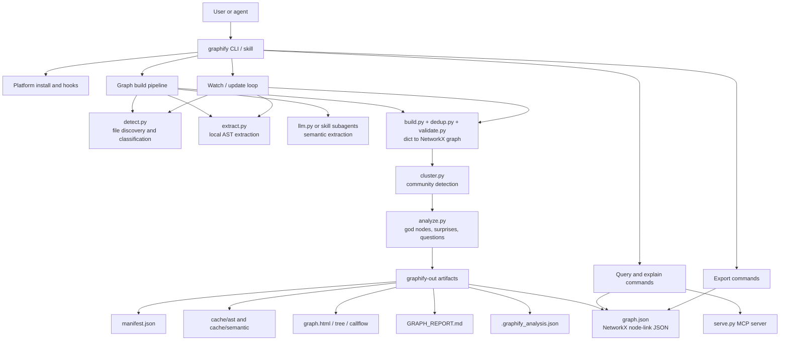
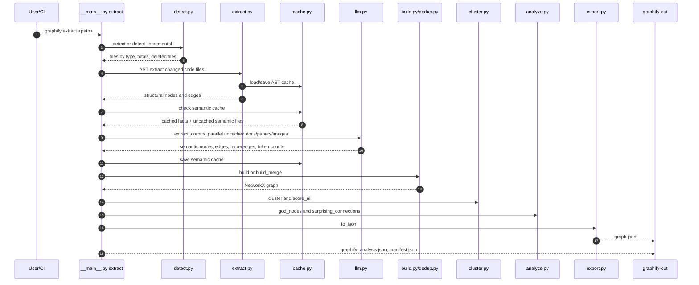
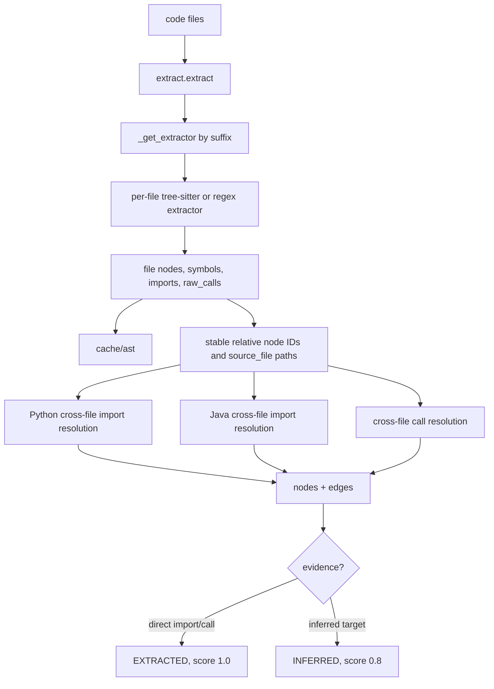
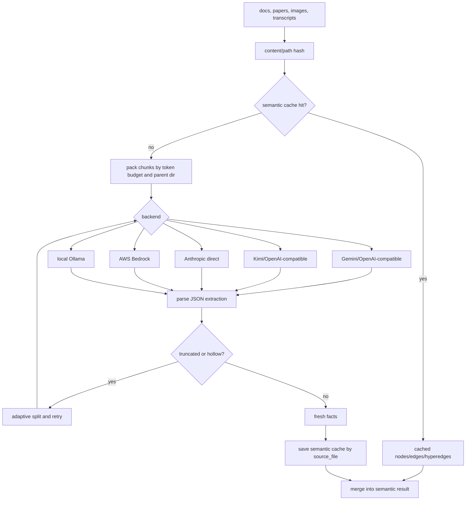
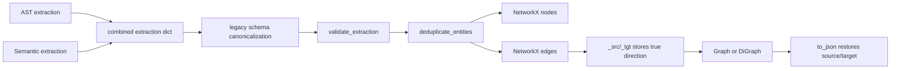
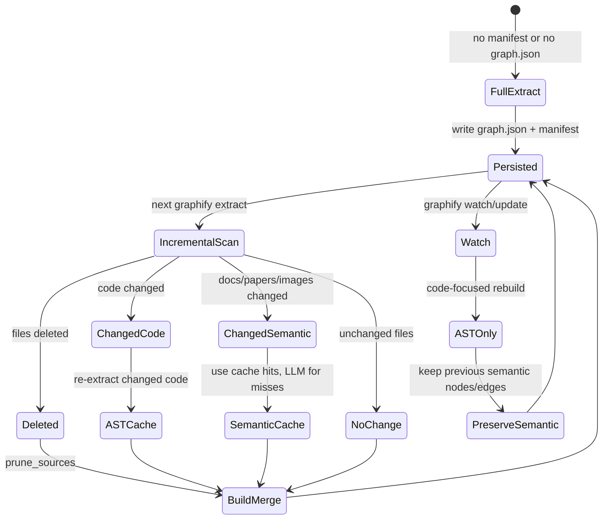
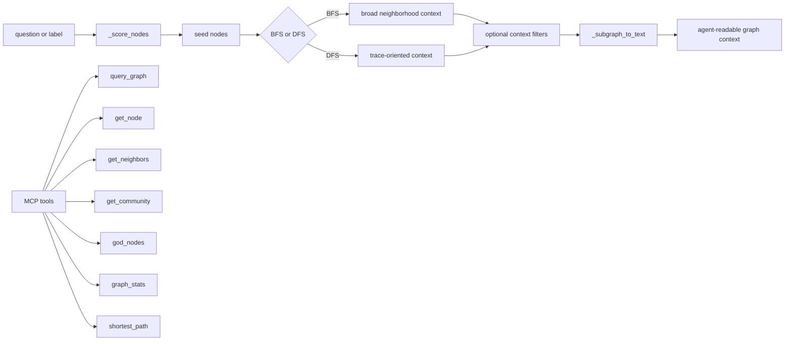
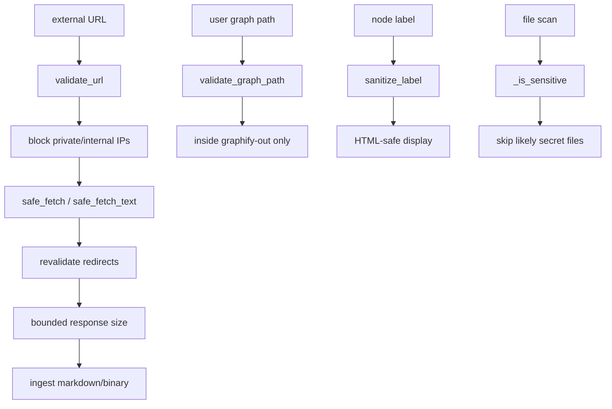
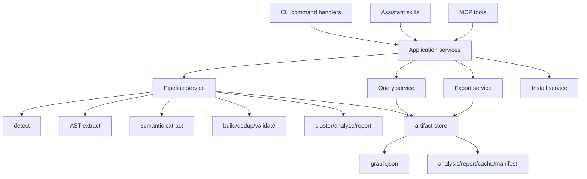

# Graphify Architecture and Data Flow Review

Date: 2026-05-11

Scope: `resource/graphify/graphify/`

This review treats Graphify from first principles: the system exists to turn a heterogeneous corpus into a smaller, queryable graph artifact that preserves enough provenance, confidence, and structure for an agent or human to navigate the corpus without rereading all raw files.

## Executive Summary

Graphify is a Python package plus assistant skills. Its core architecture is a batch graph compiler:

1. Discover supported files.
2. Extract structural facts from code locally.
3. Extract semantic facts from documents, papers, images, and transcripts through LLM calls or assistant subagents.
4. Normalize, validate, deduplicate, and build a NetworkX graph.
5. Cluster and analyze the graph.
6. Persist `graphify-out/graph.json`, analysis sidecars, reports, visualizations, and query surfaces.

The strongest architectural choice is that most stages communicate through plain dictionaries with `nodes`, `edges`, and optional `hyperedges`, then cross an explicit boundary into a NetworkX graph. That keeps extraction logic independent from clustering, reporting, export, and serving.

The weakest architectural pressure point is that orchestration is concentrated in `__main__.py` and the skill markdowns. The package has good stage modules, but the command router mixes install logic, platform integration, graph pipeline orchestration, export dispatch, global graph operations, and query utilities in one large file. The architecture would be easier to evolve if CLI commands became thin adapters over a stable application service layer.

## First-Principles Model

Graphify has four irreducible jobs:

| Job | First-principles requirement | Current implementation |
|---|---|---|
| Observe the corpus | Know what files are safe and useful to inspect | `detect.py`, `google_workspace.py`, `ingest.py`, `security.py` |
| Convert evidence into facts | Produce nodes and edges with provenance and confidence | `extract.py`, `llm.py`, transcribed media, assistant skill subagents |
| Compile facts into a graph | Normalize identities, remove duplicates, preserve direction where needed | `build.py`, `dedup.py`, `validate.py`, NetworkX |
| Make the graph usable | Summaries, communities, reports, HTML, GraphRAG, MCP, CLI query | `cluster.py`, `analyze.py`, `report.py`, `export.py`, `serve.py`, `tree_html.py`, `callflow_html.py`, `wiki.py` |

The important invariant is not "there is a graph". The invariant is "every graph edge has enough evidence metadata that downstream consumers can decide whether to trust it." The `confidence`, `confidence_score`, `source_file`, and `source_location` fields are therefore part of the architecture, not display details.

## High-Level Architecture



## Module Boundaries

| Module | Role | Architectural notes |
|---|---|---|
| `__main__.py` | CLI router, platform install, pipeline orchestration | Does too much. It is the main integration point but also the main coupling hotspot. |
| `detect.py` | File classification, ignore/include handling, conversion dispatch, manifest diff | Strong boundary. Owns "what is in the corpus". |
| `extract.py` | Deterministic structural extraction for code | Largest domain module. Handles many languages, caching, cross-file import/call resolution. |
| `llm.py` | Semantic extraction through provider backends | Encapsulates model/provider differences, chunking, concurrency, adaptive retry, token accounting. |
| `cache.py` | AST and semantic cache keyed by content hash plus relative path | Good separation. Cache identity is deliberately portable across checkouts. |
| `build.py` | Merge extraction dicts into NetworkX graph | Critical normalization and direction-preservation boundary. |
| `dedup.py` | Entity deduplication before graph construction | Keeps graph identity pressure out of extractors. |
| `cluster.py` | Community detection and cohesion scoring | Mostly pure graph analysis. |
| `analyze.py` | God nodes, surprising connections, suggested questions, diffs | Turns graph topology into agent/human guidance. |
| `report.py` | Human-readable audit trail | Important trust surface. Summarizes confidence, gaps, communities, stale commit. |
| `export.py` | JSON, HTML, Obsidian, Canvas, Cypher, Neo4j, GraphML, SVG | Broad but cohesive around outbound formats. |
| `serve.py` | MCP stdio server and graph query helpers | Runtime query surface over persisted graph. |
| `watch.py` | AST-only rebuilds after code changes | Preserves semantic facts while refreshing code facts. |
| `ingest.py` / `security.py` | URL ingestion and safety controls | Useful isolation for untrusted external input. |
| `global_graph.py` | Cross-repo graph accumulation | Prefixes repo-local node IDs to keep repos isolated. |
| `callflow_html.py`, `tree_html.py`, `wiki.py` | Specialized graph renderers | Output adapters over graph JSON and analysis sidecars. |

## Primary Data Model

Graphify uses an extraction envelope before it creates a graph:

```json
{
  "nodes": [
    {
      "id": "stable_id",
      "label": "Human label",
      "file_type": "code",
      "source_file": "path/from/root",
      "source_location": "L42"
    }
  ],
  "edges": [
    {
      "source": "node_a",
      "target": "node_b",
      "relation": "calls",
      "confidence": "EXTRACTED",
      "confidence_score": 1.0,
      "source_file": "path/from/root"
    }
  ],
  "hyperedges": [],
  "input_tokens": 0,
  "output_tokens": 0
}
```

After build, the authoritative persisted graph is NetworkX node-link JSON in `graphify-out/graph.json`. Node and edge fields are intentionally carried forward rather than collapsed, because exports, reports, query, and MCP tools all depend on source provenance and confidence metadata.

## Headless Extraction Data Flow

This is the `graphify extract <path>` flow in `__main__.py`.



Key behavior:

- The first run uses `detect`; later runs use `detect_incremental` when both `manifest.json` and `graph.json` exist.
- Code files go through `extract.extract`, which uses per-file AST cache and can run subprocess extraction for larger uncached sets.
- Semantic files go through `cache.check_semantic_cache`, then `llm.extract_corpus_parallel` only for misses.
- Incremental builds use `build_merge` to preserve old graph content, merge new chunks, and prune deleted source files.
- `--no-cluster` writes the raw merged extraction directly and skips NetworkX, clustering, and analysis.

## Assistant Skill Data Flow

The skill-based flow in `skill.md` is more agent-centric. It runs the same library stages but may use assistant subagents for semantic extraction instead of `llm.extract_corpus_parallel`.

```mermaid
flowchart LR
    Skill[/graphify skill] --> Ensure[ensure package and interpreter]
    Ensure --> Detect[detect.py writes .graphify_detect.json]
    Detect --> Media{video/audio?}
    Media -- yes --> Transcribe[transcribe.py writes transcripts]
    Media -- no --> Parallel
    Transcribe --> Parallel[parallel extraction]

    Parallel --> AST[AST extraction\nextract.py -> .graphify_ast.json]
    Parallel --> SemCache[semantic cache split\ncache.py]
    SemCache --> Cached[.graphify_cached.json]
    SemCache --> Agents[semantic subagents or Gemini backend]
    Agents --> SemJSON[semantic fragments]

    AST --> Merge[merge AST + cached + semantic]
    Cached --> Merge
    SemJSON --> Merge
    Merge --> Build[build.py]
    Build --> Cluster[cluster.py]
    Cluster --> Analyze[analyze.py]
    Analyze --> Outputs[graph.json\nGRAPH_REPORT.md\ngraph.html\noptional exports]
```

This path optimizes for agent productivity rather than CLI simplicity:

- It detects corpus size and asks the user to narrow scope when the corpus is too large.
- It can dispatch semantic extraction work in parallel subagents.
- It writes intermediate files under `graphify-out/` so a multi-step agent run can resume.
- It installs guidance into assistant-specific config files so future agents query the graph before raw files.

## Structural Extraction Flow



Important extraction design choices:

- Extractors emit a file node plus language-specific symbol nodes.
- Cross-file call resolution is a second pass over all per-file results, not a per-file responsibility.
- Ambiguous global symbol names are skipped rather than linked to every candidate. That protects god-node analysis from false centrality.
- Source paths are relativized for portability.
- Cache root can be passed explicitly so subdirectory scans still write to the intended `graphify-out/cache`.

## Semantic Extraction Flow



The semantic extractor treats provider variance as a first-class problem:

- Backends have default models and provider-specific API key lookup.
- OpenAI-compatible providers share most call logic.
- Local Ollama receives special context-window and concurrency handling.
- Truncated or hollow responses are converted into retry signals so dense chunks can be split recursively.
- Token counts flow back into reports and cost estimates.

## Build, Deduplication, and Direction Preservation



The build boundary does several non-obvious but important things:

- It accepts both `edges` and legacy NetworkX `links`.
- It rewrites legacy node `source` into `source_file`.
- It skips dangling edges to external or standard-library nodes.
- It normalizes LLM-generated endpoint IDs to rescue edges whose punctuation or casing differs from AST IDs.
- It stores `_src` and `_tgt` on undirected NetworkX edges so `to_json` can restore original direction. This matters for `calls`, `imports`, and other semantically directed relations.

One architecture caveat: using an undirected graph by default improves compatibility with community detection and shortest path queries, but it means direction is metadata rather than graph topology unless `directed=True` is used. Any new algorithm that depends on direction must opt into directed graphs or read `_src`/`_tgt` / persisted `source` and `target`.

## Incremental Update and Watch Flow



There are two incremental mechanisms:

- `graphify extract` uses `manifest.json` and content hashes to detect changed, unchanged, and deleted files across all corpus types.
- `graphify update` and `watch.py` perform AST-only rebuilds for code, preserving prior semantic facts and evicting nodes from changed/deleted source files.

This split is pragmatic: code changes are cheap and deterministic; non-code changes may require LLM cost and therefore get explicit treatment.

## Output and Consumption Surfaces

```mermaid
flowchart TB
    Graph[graphify-out/graph.json] --> CLIQuery[graphify query/path/explain]
    Graph --> MCP[serve.py MCP tools]
    Graph --> HTML[export.html graph.html]
    Graph --> Tree[tree_html.py GRAPH_TREE.html]
    Graph --> Callflow[callflow_html.py Mermaid HTML]
    Graph --> Obsidian[Obsidian vault + canvas]
    Graph --> Wiki[agent-crawlable wiki]
    Graph --> Neo4j[Cypher or direct push]
    Graph --> GraphML[GraphML]
    Graph --> SVG[SVG]
    Graph --> Global[global_graph.py]

    Analysis[.graphify_analysis.json] --> HTML
    Analysis --> Wiki
    Analysis --> Report[GRAPH_REPORT.md]
    Labels[.graphify_labels.json] --> HTML
    Labels --> Wiki
    Labels --> Callflow
```



The output architecture is deliberately many-readers, one-core-artifact. `graph.json` is the canonical graph, while `.graphify_analysis.json`, labels, report, and visualizations are derived products.

## Query and MCP Flow



The query layer is intentionally extractive. It does not answer with hidden model reasoning; it selects graph neighborhoods and emits compact text context. That matches Graphify's premise: spend tokens once on graph construction, then spend fewer tokens per future query.

## Security and Trust Boundaries



The current code has meaningful security controls for URL ingestion, graph path access, and label rendering. The most important operational rule is that untrusted external URLs enter through `ingest.py` and `security.py`, not through arbitrary fetch logic in renderers or CLI paths.

## Double-Loop Review

Single-loop question: "Does the implementation produce the intended graph artifacts?"

Answer: mostly yes. The stages exist, outputs are clear, cache and incremental modes are practical, and tests cover many modules.

Double-loop question: "Are the architecture assumptions still the right ones?"

### Assumption 1: Plain dicts are the right stage contract

This remains a good choice for interoperability with LLM output and NetworkX node-link JSON. The risk is schema drift: many modules assume optional fields and repair legacy formats locally. Long term, a typed internal schema would reduce scattered defensive code without sacrificing JSON compatibility.

### Assumption 2: NetworkX should be the center of the compiled graph

This is reasonable for local CLI scale, community detection, shortest path, and exports. The risk is large-corpus performance and direction semantics. If Graphify becomes a daemon or handles very large corpora, graph storage may need a database-backed or streaming layer, with NetworkX used only for analysis slices.

### Assumption 3: The assistant skill can be an orchestrator

This works for agent-native workflows, but it duplicates orchestration logic with the CLI. The package already has a headless `extract` command, which is the better long-term authoritative pipeline. The skill should ideally become a thin UX wrapper around library/CLI application services.

### Assumption 4: Incremental code updates can preserve semantic facts

This is a good cost-saving strategy. The risk is stale semantic relationships when code changes invalidate documentation-derived links or source file semantics. Current behavior is practical, but reports should make "semantic facts preserved from prior full extraction" highly visible when an AST-only rebuild occurred.

## Architecture Risks and Recommendations

### 1. CLI Orchestration Is Over-Centralized

`__main__.py` is the largest coupling point. It contains command parsing, install flows, exports, graph extraction, global graph operations, and query commands.

Recommendation: split command handlers into modules such as:

- `cli/install.py`
- `cli/extract.py`
- `cli/export.py`
- `cli/query.py`
- `cli/global_graph.py`

Then move pipeline operations into an application layer, for example `pipeline.py`, so skills, CLI, tests, and future MCP tools call the same orchestration functions.

### 2. Extraction Schema Is Implicit

`validate.py` exists, but most stage contracts are still implicit dictionaries. This makes it easy for semantic extraction, AST extraction, cache, and exports to drift.

Recommendation: add a small schema module with typed dataclasses or `TypedDict` definitions for `Node`, `Edge`, `Hyperedge`, and `ExtractionResult`. Keep JSON serialization as dictionaries at boundaries.

### 3. Direction Is Partly Hidden

The `_src` / `_tgt` design is a pragmatic fix for undirected NetworkX storage. It is also easy for future contributors to miss.

Recommendation: document this as a hard invariant in `build.py` and tests: persisted `source` and `target` must preserve extraction direction even when the in-memory graph is undirected.

### 4. Skill and CLI Pipelines Can Diverge

The skill markdown describes a multi-step orchestration that overlaps with `graphify extract`. Divergence can create subtle differences in cache use, output sidecars, LLM routing, and incremental behavior.

Recommendation: make `graphify extract` the canonical full pipeline and let skills call it whenever possible. Keep subagent semantic extraction only as an optional strategy behind the same merge/build/export function.

### 5. Watch Mode Preserves Semantic Facts Without Strong Freshness Signaling

AST-only rebuilds are useful, but they can leave semantic edges stale relative to changed code or docs.

Recommendation: persist rebuild mode and last semantic extraction timestamp in `graph.json` or `.graphify_analysis.json`, then show it in `GRAPH_REPORT.md`.

### 6. Output Modules Are Broad But Mostly Independent

`export.py` is large because it owns many formats. That is acceptable for now, but new formats will increase blast radius.

Recommendation: if another major export format is added, split existing exporters by target while keeping a stable public API.

## Suggested Target Architecture



The goal is not to rewrite Graphify. The goal is to preserve the existing stage modules and move orchestration out of ad hoc command branches.

## Bottom Line

Graphify's core pipeline is conceptually sound: it compiles heterogeneous corpus evidence into a provenance-rich graph, then builds multiple query and visualization surfaces from one canonical graph artifact. Its strongest boundaries are discovery, extraction, build, cluster/analyze, and export. Its main architectural debt is orchestration sprawl in the CLI and skill layer, plus an implicit schema that depends on convention rather than typed contracts.

The highest-value next refactor is to extract a canonical pipeline service from `__main__.py`. That would reduce drift between CLI, skills, tests, and future integrations while keeping the existing extraction, build, analysis, and export modules largely intact.
