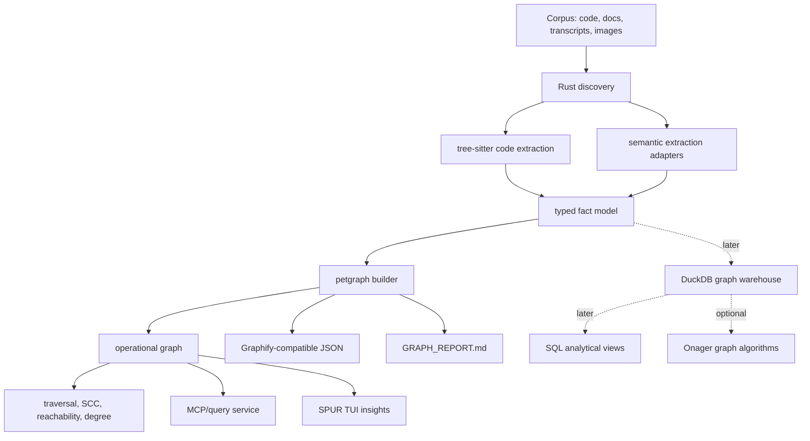
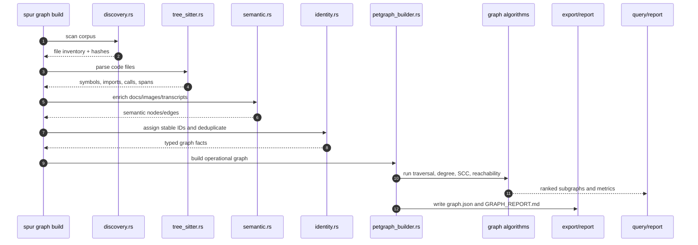
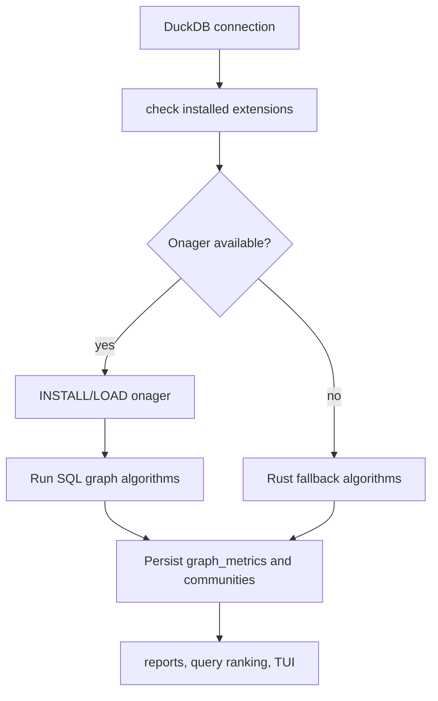
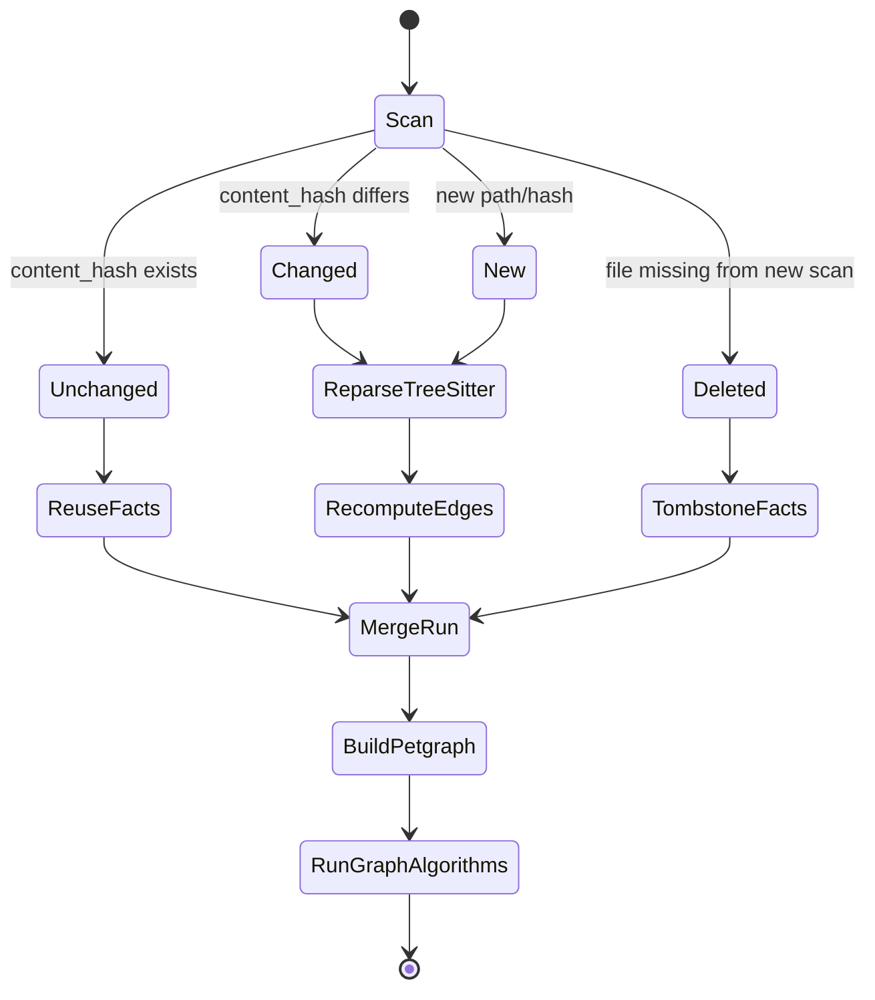
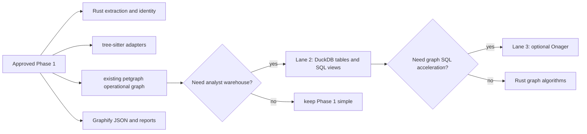

# Graphify Alternative: Rust, Tree-sitter, Petgraph, DuckDB, and Onager

Date: 2026-05-11

Status: Phase 1 approved for minimal operational graph

Related document: [Graphify Architecture and Data Flow Review](./graphify-architecture-data-flow-review.md)

## Executive Summary

The current Graphify architecture is a Python batch graph compiler centered on dictionaries and NetworkX. The approved SPUR-native Phase 1 should keep the same product goal but reduce the substrate to the smallest mature Rust path:

- Rust for ingestion, parsing, normalization, identity, and service boundaries.
- Tree-sitter for deterministic code structure extraction.
- Existing `petgraph` for operational traversal, components, degree, PageRank experiments, dependency walks, and review-risk queries.
- File-backed JSON or lightweight local storage for Graphify-compatible artifacts.

The key shift is from "build a NetworkX object in Python, then export artifacts" to "extract typed code facts in Rust, build an operational `petgraph` view, and export stable artifacts that SPUR can use immediately."

Recommended direction after review: approve Lane 1 first, a minimal operational graph using Rust + tree-sitter + existing `petgraph`. Do not add DuckDB, Arrow/Parquet, or Onager to the default graph path until Phase 1 has benchmark evidence and real analyst queries that justify the extra dependency surface.

## First-Principles Goal

The goal is not to port Graphify line-for-line. The goal is to preserve the useful invariant:

> A corpus becomes a durable, queryable, provenance-rich graph with confidence-tagged relationships.

From first principles, this needs these capabilities:

| Capability | Requirement | Best-fit substrate |
|---|---|---|
| Fast local extraction | Parse many source files without executing them | Rust + tree-sitter |
| Stable fact model | Keep nodes, edges, spans, confidence, provenance, versions | Rust typed structs |
| Operational graph queries | Answer local agent questions cheaply | `petgraph` plus indexed node/edge maps |
| Compatibility | Preserve existing Graphify consumers | JSON and report exports |
| Analyst querying | Ask aggregate and exploratory questions cheaply | Later DuckDB lane |
| Columnar interchange | Move batches between engines | Later Arrow/Parquet lane |
| Graph acceleration | Centrality, communities, shortest paths at larger scale | Optional Onager lane after benchmarks |

## Why This Stack Is Stronger

### Rust

Rust makes the extractor a production system rather than a scripting pipeline. It gives SPUR:

- predictable binaries and deployment inside the existing Rust workspace;
- typed contracts for nodes, edges, spans, and provenance;
- safe parallelism for file scanning and parsing;
- better integration with SPUR event, cost, TUI, and MCP crates;
- fewer runtime surprises than Python package environments.

### Tree-sitter

Tree-sitter is the right parsing substrate because it is fast, robust with syntax errors, supports incremental parsing, and already has broad language grammar coverage. For code intelligence, it should be the deterministic first pass. LLM extraction should enrich, not replace, tree-sitter facts.

### Petgraph

`petgraph` is already in the SPUR workspace and already powers `spur-pm` graph analysis. That matters more than adding another analytical engine in Phase 1. The first graph service should reuse this local maturity:

- no new graph algorithm dependency;
- direct Rust integration with existing SPUR graph-engine patterns;
- enough algorithms for traversal, dependency walks, strongly connected components, reachability, degree, and risk triage;
- predictable packaging inside the existing Rust workspace.

### DuckDB

DuckDB remains a strong fit for the later analyst lane, when the graph is represented as analytical tables:

- `nodes`
- `edges`
- `files`
- `symbols`
- `source_spans`
- `extraction_runs`
- `communities`
- `centrality_scores`
- `query_results`

It gives immediate SQL over graph facts without building a separate graph database. This also aligns with SPUR's current `spur-context` direction, where DuckDB is already used for analytics over agent JSONL and cost data. It should not be a Phase 1 requirement for the operational graph.

### Arrow and Parquet

Arrow gives a stable columnar memory format for batches of nodes, edges, spans, diagnostics, and embeddings. Parquet gives durable, compressed snapshots. This matters once the graph becomes a warehouse or interchange boundary:

- filter edges by relation/confidence/source;
- join nodes to files, commits, tasks, costs, and sessions;
- compute metrics over millions of facts;
- preserve versioned snapshots for comparison.

Arrow and Parquet are not necessary for the approved minimal operational graph. They should enter when DuckDB snapshots, external interchange, or large analytical scans become concrete requirements.

### Onager

Onager is a DuckDB community extension for graph data analytics. Its value is that graph algorithms become SQL table functions over edge tables. That is ideal for an analyst workflow:

```sql
SELECT *
FROM onager_ctr_pagerank('graph_edges');
```

Architectural stance: do not put Onager in the Phase 1 critical path. Use it later only when installed, compatible, and benchmarked against `petgraph`/Rust implementations on SPUR fixture graphs.

## Recommended Architecture



The approved Phase 1 architecture is graph-first and typed-fact-backed:

1. Extract facts in Rust.
2. Build a `petgraph` graph with stable node and edge identity.
3. Answer operational graph questions through Rust APIs.
4. Export Graphify-compatible artifacts.
5. Defer DuckDB, Arrow/Parquet, and Onager until analyst workloads require them.

## Component Design

### Crate Layout

```text
crates/spur-graph/
  src/
    lib.rs
    error.rs
    config.rs
    discovery.rs
    schema.rs
    identity.rs
    pipeline.rs
    extract/
      mod.rs
      tree_sitter.rs
      languages.rs
      markdown.rs
      semantic.rs
    store/
      mod.rs
      json.rs
      snapshot.rs
    graph/
      mod.rs
      algorithms.rs
      petgraph_builder.rs
    query/
      mod.rs
      subgraph.rs
      explain.rs
      search.rs
    export/
      graph_json.rs
      mermaid.rs
      report.rs
```

This keeps runtime responsibilities clean:

- `extract` converts source material into typed facts.
- `store` persists and retrieves Phase 1 snapshots and compatibility artifacts.
- `graph` builds `petgraph` views and computes operational analytics.
- `query` turns user questions into subgraph context.
- `export` emits compatibility artifacts.

### Typed Fact Model

```rust
pub struct GraphNode {
    pub node_id: NodeId,
    pub stable_key: String,
    pub label: String,
    pub kind: NodeKind,
    pub file_id: Option<FileId>,
    pub source_span_id: Option<SpanId>,
    pub first_seen_run_id: RunId,
}

pub struct GraphEdge {
    pub edge_id: EdgeId,
    pub source_node_id: NodeId,
    pub target_node_id: NodeId,
    pub relation: RelationKind,
    pub confidence: Confidence,
    pub confidence_score: f32,
    pub evidence_id: EvidenceId,
    pub directed: bool,
}

pub struct SourceSpan {
    pub span_id: SpanId,
    pub file_id: FileId,
    pub start_byte: u32,
    pub end_byte: u32,
    pub start_line: u32,
    pub end_line: u32,
}
```

The important change from Graphify is that node and edge shape becomes a Rust contract first. JSON becomes an export format, not the internal truth. DuckDB can later mirror these same contracts as tables if the analyst lane is approved.

## Future DuckDB Schema

```sql
CREATE TABLE extraction_runs (
    run_id UUID PRIMARY KEY,
    root_path TEXT NOT NULL,
    started_at TIMESTAMP NOT NULL,
    completed_at TIMESTAMP,
    git_commit TEXT,
    extractor_version TEXT NOT NULL,
    status TEXT NOT NULL
);

CREATE TABLE files (
    file_id UBIGINT PRIMARY KEY,
    run_id UUID NOT NULL,
    path TEXT NOT NULL,
    content_hash TEXT NOT NULL,
    file_kind TEXT NOT NULL,
    language TEXT,
    bytes UBIGINT,
    lines UBIGINT
);

CREATE TABLE source_spans (
    span_id UBIGINT PRIMARY KEY,
    file_id UBIGINT NOT NULL,
    start_byte UINTEGER NOT NULL,
    end_byte UINTEGER NOT NULL,
    start_line UINTEGER NOT NULL,
    end_line UINTEGER NOT NULL
);

CREATE TABLE nodes (
    node_id UBIGINT PRIMARY KEY,
    stable_key TEXT NOT NULL,
    label TEXT NOT NULL,
    kind TEXT NOT NULL,
    file_id UBIGINT,
    span_id UBIGINT,
    run_id UUID NOT NULL
);

CREATE TABLE edges (
    edge_id UBIGINT PRIMARY KEY,
    source_node_id UBIGINT NOT NULL,
    target_node_id UBIGINT NOT NULL,
    relation TEXT NOT NULL,
    confidence TEXT NOT NULL,
    confidence_score FLOAT NOT NULL,
    directed BOOLEAN NOT NULL,
    evidence_span_id UBIGINT,
    run_id UUID NOT NULL
);

CREATE TABLE graph_metrics (
    run_id UUID NOT NULL,
    metric_name TEXT NOT NULL,
    node_id UBIGINT,
    value DOUBLE NOT NULL
);

CREATE TABLE communities (
    run_id UUID NOT NULL,
    algorithm TEXT NOT NULL,
    node_id UBIGINT NOT NULL,
    community_id UBIGINT NOT NULL
);
```

Recommended views:

```sql
CREATE VIEW graph_edges AS
SELECT
    source_node_id AS src,
    target_node_id AS dst,
    confidence_score::DOUBLE AS weight,
    relation,
    directed
FROM edges;

CREATE VIEW code_call_edges AS
SELECT *
FROM graph_edges
WHERE relation = 'calls';

CREATE VIEW high_confidence_edges AS
SELECT *
FROM graph_edges
WHERE weight >= 0.85;
```

## Phase 1 Data Flow



## Later Analyst Workflow

When Lane 2 is approved, the same typed facts should support analyst-style questions directly in SQL:

```sql
-- Most connected code symbols.
SELECT n.label, COUNT(*) AS degree
FROM nodes n
JOIN edges e
  ON n.node_id = e.source_node_id OR n.node_id = e.target_node_id
WHERE n.kind IN ('function', 'class', 'module')
GROUP BY n.label
ORDER BY degree DESC
LIMIT 20;
```

```sql
-- Cross-file inferred edges that deserve review.
SELECT
    src.label AS source,
    dst.label AS target,
    e.relation,
    e.confidence_score,
    fs.path AS source_file,
    ft.path AS target_file
FROM edges e
JOIN nodes src ON src.node_id = e.source_node_id
JOIN nodes dst ON dst.node_id = e.target_node_id
LEFT JOIN files fs ON fs.file_id = src.file_id
LEFT JOIN files ft ON ft.file_id = dst.file_id
WHERE e.confidence = 'INFERRED'
  AND fs.path IS DISTINCT FROM ft.path
ORDER BY e.confidence_score ASC;
```

```sql
-- Onager centrality, when available.
SELECT *
FROM onager_ctr_pagerank(
    SELECT src, dst, weight
    FROM graph_edges
);
```

If Onager function signatures require a concrete edge table rather than a subquery, materialize `graph_edges_for_onager` first.

## Later Onager Integration Strategy



Use Onager for:

- PageRank and personalized PageRank;
- degree, betweenness, closeness, eigenvector, Katz, harmonic centrality;
- Louvain and connected components;
- BFS/DFS and shortest paths;
- graph density, transitivity, triangle counts, clustering coefficients;
- link-prediction scores for possible missing edges.

Do not use Onager for:

- canonical graph storage;
- extraction identity;
- provenance;
- source spans;
- cache invalidation;
- security or access control.

Onager should be a replaceable graph-compute adapter. If the extension is not installed, SPUR should still build, query, and report from the Phase 1 `petgraph` path, and from DuckDB tables only when Lane 2 exists.

## Incremental Build Model



The storage model should be append-friendly:

- each build gets an `extraction_runs` row;
- files are tracked by path plus content hash;
- unchanged file facts can be copied forward or referenced by `valid_from_run` / `valid_to_run`;
- deleted files get tombstoned rather than silently erased;
- report freshness can compare graph run commit to current git commit.

## Compatibility With Existing Graphify Outputs

The Rust alternative should still export Graphify-compatible artifacts:

| Existing artifact | Phase 1 equivalent |
|---|---|
| `graphify-out/graph.json` | Export from typed nodes/edges and `petgraph` indices to NetworkX node-link JSON |
| `GRAPH_REPORT.md` | Render from Rust graph metrics |
| `.graphify_analysis.json` | Export from Rust graph metrics and later optional analyst metrics |
| `graph.html` / callflow | Render from stable graph export data |
| MCP query server | Query the typed graph first; DuckDB only in Lane 2 |

This enables migration without breaking consumers that already expect Graphify outputs.

## Alternatives

### Lane 1: Minimal Operational Graph, Rust + Tree-sitter + Petgraph

This is the approved first step. Replace Python extraction and NetworkX graph construction with Rust, tree-sitter, and existing workspace `petgraph` usage. Keep JSON and reports as the primary artifacts until SPUR has enough graph volume and analyst demand to justify a warehouse.

Pros:

- simple;
- pure Rust;
- no new graph algorithm dependency;
- easy to embed in SPUR.
- matches the local `spur-pm` graph-engine direction;
- keeps packaging and CI risk low.

Cons:

- weak analyst workflow;
- harder ad hoc SQL;
- no direct table joins with SPUR costs, tasks, sessions, and events;
- large graph snapshots remain file-centric.

Use this when the goal is fast local code intelligence for agents, review-risk analysis, dependency walks, and Graphify-compatible exports.

### Lane 2: DuckDB-First Analyst Tables

This is the later analyst lane. Store graph facts in DuckDB and implement required algorithms in Rust where needed.

Pros:

- mature analytical core;
- SQL joins with SPUR context and cost data;
- portable without requiring community DuckDB extensions;
- good migration path.

Cons:

- requires designing schemas carefully;
- Rust graph algorithms must be maintained;
- less turnkey than Onager for centrality/community algorithms.

Use this when SPUR needs SQL joins across code graph facts, beads issues, plan tasks, sessions, costs, reviews, and outcomes.

### Lane 3: DuckDB + Onager Accelerator

This extends Lane 2 by using Onager when available.

Pros:

- fast graph analytics inside SQL;
- clean analyst experience;
- avoids maintaining many algorithms in SPUR;
- aligns with DuckDB as the analytical substrate.

Cons:

- Onager is a community extension, not a core DuckDB feature;
- extension availability, versioning, and platform support must be tested;
- SPUR needs fallback behavior for offline or locked-down environments.

Use this as an optional accelerator, not as the only path.

## Recommended Decision

Adopt Lane 1 as the approved Phase 1 architecture. Keep Lane 2 and Lane 3 as explicit later decisions, each gated by evidence:



This keeps the system mature and resilient while avoiding premature substrate cost:

- Rust and existing `petgraph` are already foundational in SPUR.
- Tree-sitter is the only new core dependency needed for Phase 1.
- DuckDB becomes a lane when analyst SQL workflows are proven, not before.
- Arrow/Parquet become a lane when columnar interchange or snapshot scale is proven.
- Onager remains optional and benchmark-gated.
- Graph facts remain portable and inspectable without graph extensions.

## Why Lane 1 Is Better Than Original Graphify First

Lane 1 is better than the original Python/NetworkX architecture for SPUR's immediate needs because it improves the system boundary without importing a warehouse:

| Dimension | Original Graphify | Approved Lane 1 |
|---|---|---|
| Runtime substrate | Python scripts and package environment | Rust workspace binary/library |
| Parser substrate | Python tree-sitter bindings | Rust tree-sitter runtime and grammar crates |
| Graph algorithms | NetworkX | existing `petgraph` dependency and local graph-engine patterns |
| Deployment | Python environment management | SPUR-native build and test path |
| Operational queries | artifact-driven | in-process graph APIs plus compatible exports |
| Analyst SQL | absent | intentionally deferred until needed |

The original Graphify remains better for rapid Python algorithm experiments and NetworkX breadth. Lane 1 is better for SPUR because it optimizes the first-order requirement: fast, local, typed, agent-consumable code graph facts.

## Maturity Assessment

| Technology | Role | Maturity read | Risk |
|---|---|---|---|
| Rust | core implementation | already SPUR's native stack | low |
| tree-sitter | parsing | mature parser runtime with broad grammar ecosystem | medium around per-language grammar quality |
| petgraph | operational graph algorithms | already a workspace dependency used by `spur-pm` | low |
| DuckDB | later embedded analytics lane | mature OLAP engine with Rust client | medium due to binary/extension packaging |
| Arrow Rust | later columnar batches and Parquet bridge | official Apache implementation | low-medium due to API/version churn |
| Onager | later graph algorithms in DuckDB | promising community extension | medium-high until platform and version support are proven |

## Implementation Phases

### Phase 1: Minimal Operational Graph

- Add `spur-graph` crate or `spur-pm` graphify module behind a feature flag.
- Define typed node, edge, file, span, and run structs.
- Add tree-sitter runtime and the first grammar crate.
- Ingest a small Rust-only corpus into typed facts.
- Build a `petgraph` graph from typed facts.
- Export Graphify-compatible `graph.json`.
- Generate a minimal `GRAPH_REPORT.md`.

### Phase 2: Tree-sitter Extraction

- Expand language adapters from Rust to Python, TypeScript, and Markdown.
- Extract file/module/function/class/import/call edges.
- Persist source spans and confidence metadata.
- Add incremental content-hash reuse.

### Phase 3: Operational Analysis and Query

- Add Rust graph analyses for degree, cross-file edges, inferred edges, god nodes, reachability, SCCs, and surprising connections.
- Add MCP/query service over the typed graph.
- Improve `GRAPH_REPORT.md` from Rust graph metrics.
- Add fixture-backed benchmarks for parse throughput and graph query latency.

### Phase 4: DuckDB Analyst Lane

- Add DuckDB tables only after operational graph facts stabilize.
- Add SQL views for graph facts, sessions, costs, tasks, reviews, and outcomes.
- Add Arrow/Parquet only if columnar snapshot or interchange needs are real.
- Keep `petgraph` as the operational graph path.

### Phase 5: Optional Onager Adapter

- Detect and load Onager when available.
- Run centrality and community algorithms through Onager.
- Persist results in `graph_metrics` and `communities`.
- Compare Onager output against Rust fallback on fixture graphs.

### Phase 6: SPUR Integration

- Join graph facts to beads issues, plan tasks, worker outcomes, files touched, cost, and review signals.
- Expose graph analytics in the TUI insights view.
- Use graph signals to help identify risky delegations, high-blast-radius files, and review hotspots.

## Verification Strategy

Required tests:

- tree-sitter fixture tests for the first grammar;
- stable ID tests across path changes and unchanged content;
- incremental rebuild tests for changed, unchanged, deleted, and renamed files;
- Graphify JSON export compatibility tests;
- Rust graph analysis golden tests;
- DuckDB SQL view golden tests when Lane 2 starts;
- Onager adapter tests that skip cleanly when Lane 3 starts and the extension is unavailable;
- performance tests on a medium corpus with cold and warm cache timings.

Required benchmarks:

- files per second parsed by tree-sitter;
- facts per second normalized into the graph builder;
- query latency for reachability, god nodes, and cross-file inferred edges;
- rows per second appended to DuckDB when Lane 2 starts;
- Onager vs fallback latency for PageRank and connected components when Lane 3 starts;
- graph export time and output size.

## Key Architecture Principles

1. Keep extraction deterministic where possible.
2. Store graph facts as typed records, not opaque JSON.
3. Make `petgraph` the Phase 1 operational graph.
4. Make SQL a later analyst interface.
5. Make Onager optional and benchmark-gated.
6. Preserve provenance on every node and edge.
7. Export compatibility artifacts, but do not make them the source of truth.
8. Treat semantic LLM extraction as enrichment over deterministic code facts.

## Source Notes

- DuckDB Rust client documentation: <https://duckdb.org/docs/current/clients/rust.html>
- Apache Arrow Rust documentation: <https://arrow.apache.org/rust/arrow/index.html>
- Apache Arrow project overview: <https://arrow.apache.org/docs/index.html>
- Tree-sitter project README: <https://github.com/tree-sitter/tree-sitter>
- Onager DuckDB community extension: <https://duckdb.org/community_extensions/extensions/onager.html>

## Bottom Line

The approved first alternative is not "Graphify in Rust with every analytical dependency". It is a SPUR-native operational graph substrate:

- tree-sitter creates trustworthy code facts;
- Rust gives typed contracts and fast orchestration;
- existing `petgraph` answers local graph questions immediately;
- Graphify-compatible exports preserve interoperability;
- DuckDB, Arrow/Parquet, and Onager remain later lanes for analyst and acceleration workloads.

This Phase 1 is better than the Python/NetworkX model for SPUR because it is smaller, native to the Rust workspace, easier to package, and strong enough for operational agent workflows. The heavier DuckDB/Arrow/Onager stack may still become better for analyst-scale graph warehousing, but it should earn that role through benchmarks and concrete queries.
