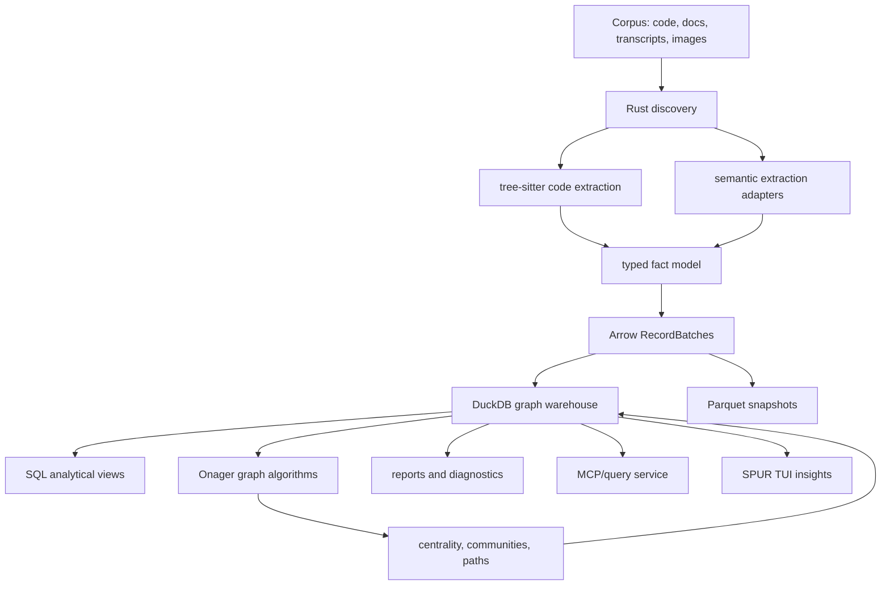
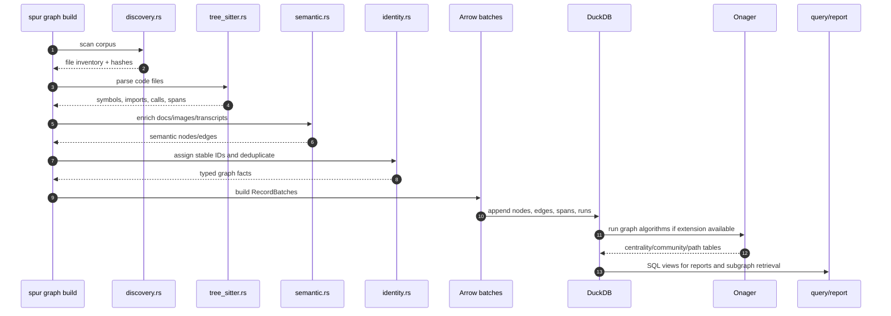
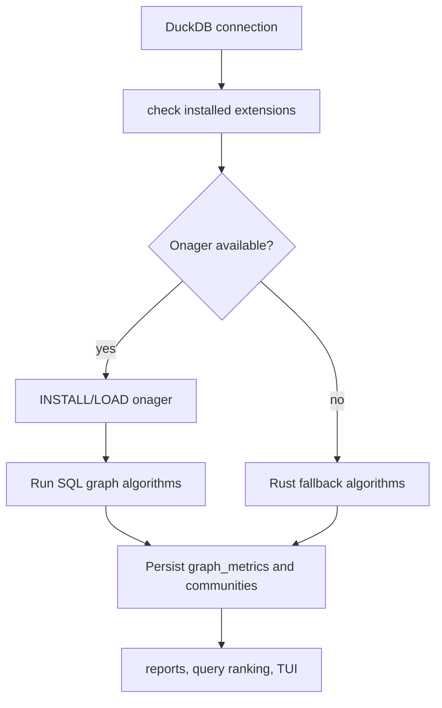
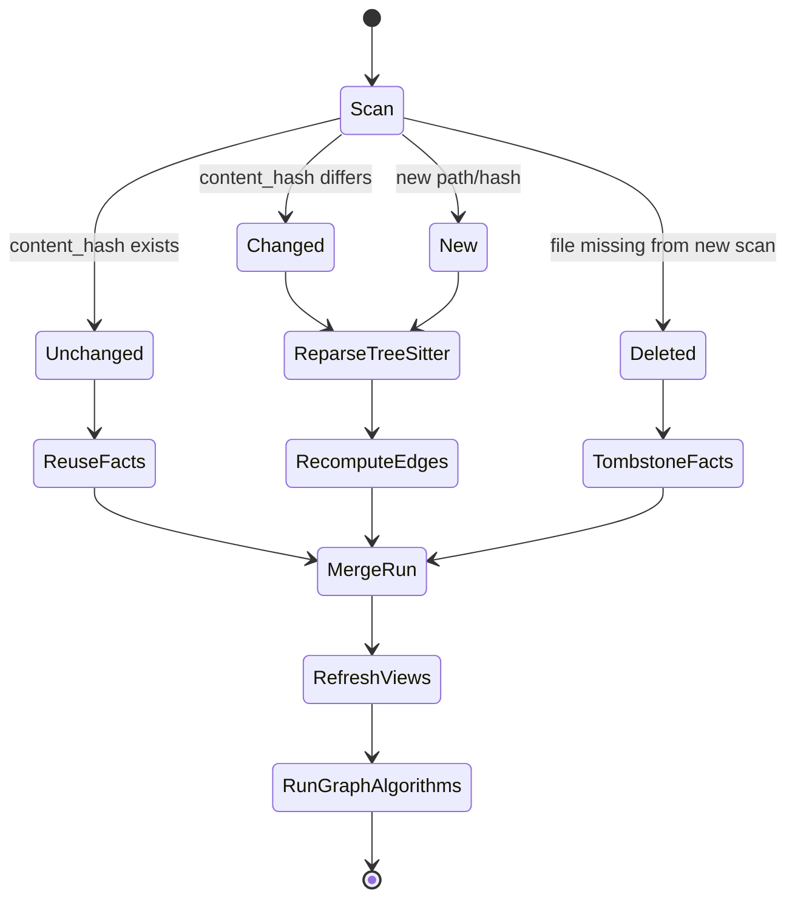
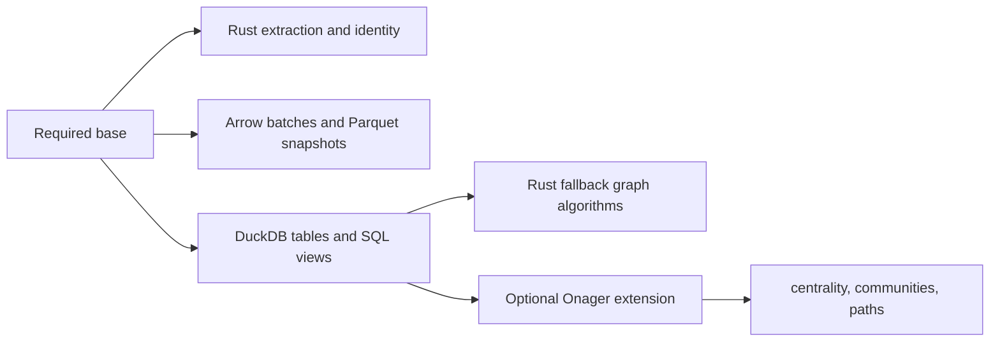

# Graphify Alternative: Rust, DuckDB, Arrow, Tree-sitter, and Onager

Date: 2026-05-11

Status: Architecture alternative for discussion

Related document: [Graphify Architecture and Data Flow Review](./graphify-architecture-data-flow-review.md)

## Executive Summary

The current Graphify architecture is a Python batch graph compiler centered on dictionaries and NetworkX. A stronger SPUR-native alternative would keep the same product goal but change the substrate:

- Rust for ingestion, parsing, normalization, identity, and service boundaries.
- Tree-sitter for deterministic code structure extraction.
- Apache Arrow Rust for in-memory columnar batches and Parquet interchange.
- DuckDB for embedded analytical storage, SQL, joins, aggregation, and ad hoc exploration.
- Onager as an optional DuckDB graph-analytics extension for PageRank, centrality, Louvain, shortest paths, connected components, and graph metrics.

The key shift is from "build a NetworkX object, then export artifacts" to "persist typed facts in analytical tables, then materialize graph views and graph algorithms from those tables."

Recommended direction: build a hybrid Rust-first analytical graph compiler. Do not make Onager the core storage layer. Treat Onager as an acceleration/plugin layer over stable `nodes` and `edges` tables in DuckDB.

## First-Principles Goal

The goal is not to port Graphify line-for-line. The goal is to preserve the useful invariant:

> A corpus becomes a durable, queryable, provenance-rich graph with confidence-tagged relationships.

From first principles, this needs five capabilities:

| Capability | Requirement | Best-fit substrate |
|---|---|---|
| Fast local extraction | Parse many source files without executing them | Rust + tree-sitter |
| Stable fact model | Keep nodes, edges, spans, confidence, provenance, versions | Rust typed structs + DuckDB tables |
| Analytical querying | Ask aggregate and exploratory questions cheaply | DuckDB SQL |
| Columnar interchange | Move batches between Rust, DuckDB, files, and future engines | Arrow + Parquet |
| Graph algorithms | Centrality, components, community detection, shortest paths | Onager where available; Rust fallback where not |

## Why This Stack Is Stronger

### Rust

Rust makes the extractor a production system rather than a scripting pipeline. It gives SPUR:

- predictable binaries and deployment inside the existing Rust workspace;
- typed contracts for nodes, edges, spans, and provenance;
- safe parallelism for file scanning and parsing;
- better integration with SPUR event, cost, TUI, and MCP crates;
- fewer runtime surprises than Python package environments.

### Tree-sitter

Tree-sitter is the right parsing substrate because it is fast, robust with syntax errors, supports incremental parsing, and already has broad language grammar coverage. For code intelligence, it should be the deterministic first pass. LLM extraction should enrich, not replace, tree-sitter facts.

### Arrow and Parquet

Arrow gives a stable columnar memory format for batches of nodes, edges, spans, diagnostics, and embeddings. Parquet gives durable, compressed snapshots. This matters because Graphify-style data is naturally analytical:

- filter edges by relation/confidence/source;
- join nodes to files, commits, tasks, costs, and sessions;
- compute metrics over millions of facts;
- preserve versioned snapshots for comparison.

### DuckDB

DuckDB is a strong fit when the graph is represented as analytical tables:

- `nodes`
- `edges`
- `files`
- `symbols`
- `source_spans`
- `extraction_runs`
- `communities`
- `centrality_scores`
- `query_results`

It gives immediate SQL over graph facts without building a separate graph database. This also aligns with SPUR's current `spur-context` direction, where DuckDB is already used for analytics over agent JSONL and cost data.

### Onager

Onager is a DuckDB community extension for graph data analytics. Its value is that graph algorithms become SQL table functions over edge tables. That is ideal for an analyst workflow:

```sql
SELECT *
FROM onager_ctr_pagerank('graph_edges');
```

Architectural stance: use Onager when installed and compatible. Keep the core graph facts portable and queryable without it.

## Recommended Architecture



The core architecture is table-first:

1. Extract facts in Rust.
2. Store facts in DuckDB.
3. Materialize graph views from tables.
4. Run graph algorithms through Onager or Rust fallback implementations.
5. Serve queries, reports, and diagrams from DuckDB views.

## Component Design

### Crate Layout

```text
crates/spur-graph/
  src/
    lib.rs
    error.rs
    config.rs
    discovery.rs
    schema.rs
    identity.rs
    pipeline.rs
    extract/
      mod.rs
      tree_sitter.rs
      languages.rs
      markdown.rs
      semantic.rs
    store/
      mod.rs
      duckdb.rs
      arrow.rs
      parquet.rs
    graph/
      mod.rs
      algorithms.rs
      onager.rs
      fallback.rs
    query/
      mod.rs
      subgraph.rs
      explain.rs
      search.rs
    export/
      graph_json.rs
      mermaid.rs
      report.rs
```

This keeps runtime responsibilities clean:

- `extract` converts source material into typed facts.
- `store` persists and retrieves facts.
- `graph` computes graph analytics.
- `query` turns user questions into subgraph context.
- `export` emits compatibility artifacts.

### Typed Fact Model

```rust
pub struct GraphNode {
    pub node_id: NodeId,
    pub stable_key: String,
    pub label: String,
    pub kind: NodeKind,
    pub file_id: Option<FileId>,
    pub source_span_id: Option<SpanId>,
    pub first_seen_run_id: RunId,
}

pub struct GraphEdge {
    pub edge_id: EdgeId,
    pub source_node_id: NodeId,
    pub target_node_id: NodeId,
    pub relation: RelationKind,
    pub confidence: Confidence,
    pub confidence_score: f32,
    pub evidence_id: EvidenceId,
    pub directed: bool,
}

pub struct SourceSpan {
    pub span_id: SpanId,
    pub file_id: FileId,
    pub start_byte: u32,
    pub end_byte: u32,
    pub start_line: u32,
    pub end_line: u32,
}
```

The important change from Graphify is that node and edge shape becomes a Rust contract first, then a DuckDB schema second. JSON becomes an export format, not the internal truth.

## DuckDB Schema

```sql
CREATE TABLE extraction_runs (
    run_id UUID PRIMARY KEY,
    root_path TEXT NOT NULL,
    started_at TIMESTAMP NOT NULL,
    completed_at TIMESTAMP,
    git_commit TEXT,
    extractor_version TEXT NOT NULL,
    status TEXT NOT NULL
);

CREATE TABLE files (
    file_id UBIGINT PRIMARY KEY,
    run_id UUID NOT NULL,
    path TEXT NOT NULL,
    content_hash TEXT NOT NULL,
    file_kind TEXT NOT NULL,
    language TEXT,
    bytes UBIGINT,
    lines UBIGINT
);

CREATE TABLE source_spans (
    span_id UBIGINT PRIMARY KEY,
    file_id UBIGINT NOT NULL,
    start_byte UINTEGER NOT NULL,
    end_byte UINTEGER NOT NULL,
    start_line UINTEGER NOT NULL,
    end_line UINTEGER NOT NULL
);

CREATE TABLE nodes (
    node_id UBIGINT PRIMARY KEY,
    stable_key TEXT NOT NULL,
    label TEXT NOT NULL,
    kind TEXT NOT NULL,
    file_id UBIGINT,
    span_id UBIGINT,
    run_id UUID NOT NULL
);

CREATE TABLE edges (
    edge_id UBIGINT PRIMARY KEY,
    source_node_id UBIGINT NOT NULL,
    target_node_id UBIGINT NOT NULL,
    relation TEXT NOT NULL,
    confidence TEXT NOT NULL,
    confidence_score FLOAT NOT NULL,
    directed BOOLEAN NOT NULL,
    evidence_span_id UBIGINT,
    run_id UUID NOT NULL
);

CREATE TABLE graph_metrics (
    run_id UUID NOT NULL,
    metric_name TEXT NOT NULL,
    node_id UBIGINT,
    value DOUBLE NOT NULL
);

CREATE TABLE communities (
    run_id UUID NOT NULL,
    algorithm TEXT NOT NULL,
    node_id UBIGINT NOT NULL,
    community_id UBIGINT NOT NULL
);
```

Recommended views:

```sql
CREATE VIEW graph_edges AS
SELECT
    source_node_id AS src,
    target_node_id AS dst,
    confidence_score::DOUBLE AS weight,
    relation,
    directed
FROM edges;

CREATE VIEW code_call_edges AS
SELECT *
FROM graph_edges
WHERE relation = 'calls';

CREATE VIEW high_confidence_edges AS
SELECT *
FROM graph_edges
WHERE weight >= 0.85;
```

## Data Flow



## Analyst Workflow

This stack should support analyst-style questions directly in SQL:

```sql
-- Most connected code symbols.
SELECT n.label, COUNT(*) AS degree
FROM nodes n
JOIN edges e
  ON n.node_id = e.source_node_id OR n.node_id = e.target_node_id
WHERE n.kind IN ('function', 'class', 'module')
GROUP BY n.label
ORDER BY degree DESC
LIMIT 20;
```

```sql
-- Cross-file inferred edges that deserve review.
SELECT
    src.label AS source,
    dst.label AS target,
    e.relation,
    e.confidence_score,
    fs.path AS source_file,
    ft.path AS target_file
FROM edges e
JOIN nodes src ON src.node_id = e.source_node_id
JOIN nodes dst ON dst.node_id = e.target_node_id
LEFT JOIN files fs ON fs.file_id = src.file_id
LEFT JOIN files ft ON ft.file_id = dst.file_id
WHERE e.confidence = 'INFERRED'
  AND fs.path IS DISTINCT FROM ft.path
ORDER BY e.confidence_score ASC;
```

```sql
-- Onager centrality, when available.
SELECT *
FROM onager_ctr_pagerank(
    SELECT src, dst, weight
    FROM graph_edges
);
```

If Onager function signatures require a concrete edge table rather than a subquery, materialize `graph_edges_for_onager` first.

## Onager Integration Strategy



Use Onager for:

- PageRank and personalized PageRank;
- degree, betweenness, closeness, eigenvector, Katz, harmonic centrality;
- Louvain and connected components;
- BFS/DFS and shortest paths;
- graph density, transitivity, triangle counts, clustering coefficients;
- link-prediction scores for possible missing edges.

Do not use Onager for:

- canonical graph storage;
- extraction identity;
- provenance;
- source spans;
- cache invalidation;
- security or access control.

Onager should be a replaceable graph-compute adapter. If the extension is not installed, SPUR should still build, query, and report from DuckDB tables.

## Incremental Build Model



The storage model should be append-friendly:

- each build gets an `extraction_runs` row;
- files are tracked by path plus content hash;
- unchanged file facts can be copied forward or referenced by `valid_from_run` / `valid_to_run`;
- deleted files get tombstoned rather than silently erased;
- report freshness can compare graph run commit to current git commit.

## Compatibility With Existing Graphify Outputs

The Rust alternative should still export Graphify-compatible artifacts:

| Existing artifact | Rust/DuckDB equivalent |
|---|---|
| `graphify-out/graph.json` | Export from `nodes` and `edges` view to NetworkX node-link JSON |
| `GRAPH_REPORT.md` | Render from DuckDB views and graph metrics |
| `.graphify_analysis.json` | Export from `communities`, `graph_metrics`, and report views |
| `graph.html` / callflow | Render from stable graph export views |
| MCP query server | Query DuckDB directly, return subgraph text |

This enables migration without breaking consumers that already expect Graphify outputs.

## Alternatives

### Alternative A: Rust + Petgraph Only

This is the smallest Rust port: replace NetworkX with `petgraph`, keep JSON files as the primary artifact.

Pros:

- simple;
- pure Rust;
- no DuckDB dependency;
- easy to embed in SPUR.

Cons:

- weak analyst workflow;
- harder ad hoc SQL;
- no direct table joins with SPUR costs, tasks, sessions, and events;
- large graph snapshots remain file-centric.

Use this only if the goal is a direct Graphify rewrite.

### Alternative B: DuckDB-First Tables With Rust Fallback Graph Algorithms

This is the strongest default. Store graph facts in DuckDB and implement required algorithms in Rust where needed.

Pros:

- mature analytical core;
- SQL joins with SPUR context and cost data;
- portable without requiring community DuckDB extensions;
- good migration path.

Cons:

- requires designing schemas carefully;
- Rust graph algorithms must be maintained;
- less turnkey than Onager for centrality/community algorithms.

This is the recommended base.

### Alternative C: DuckDB + Onager as First-Class Graph Algorithm Layer

This extends Alternative B by using Onager when available.

Pros:

- fast graph analytics inside SQL;
- clean analyst experience;
- avoids maintaining many algorithms in SPUR;
- aligns with DuckDB as the analytical substrate.

Cons:

- Onager is a community extension, not a core DuckDB feature;
- extension availability, versioning, and platform support must be tested;
- SPUR needs fallback behavior for offline or locked-down environments.

Use this as an optional accelerator, not as the only path.

## Recommended Decision

Adopt Alternative B as the base architecture and Alternative C as an optional acceleration layer:



This keeps the system mature and resilient:

- Rust, tree-sitter, Arrow, and DuckDB are foundational dependencies.
- Onager is powerful but optional.
- Graph facts remain portable and inspectable even without graph extensions.
- SPUR can join graph facts with tasks, beads issues, cost, sessions, reviews, and outcomes.

## Maturity Assessment

| Technology | Role | Maturity read | Risk |
|---|---|---|---|
| Rust | core implementation | already SPUR's native stack | low |
| tree-sitter | parsing | mature parser runtime with broad grammar ecosystem | medium around per-language grammar quality |
| Arrow Rust | columnar batches and Parquet bridge | official Apache implementation | low-medium due to API/version churn |
| DuckDB | embedded analytics | mature OLAP engine with Rust client | medium due to binary/extension packaging |
| Onager | graph algorithms in DuckDB | promising community extension | medium-high until platform and version support are proven |

## Implementation Phases

### Phase 1: Table-First Graph Store

- Add `spur-graph` crate behind a feature flag.
- Define typed node, edge, file, span, and run structs.
- Create DuckDB schema and migrations.
- Ingest a small Rust-only corpus into `nodes`, `edges`, `files`, and `source_spans`.
- Export Graphify-compatible `graph.json`.

### Phase 2: Tree-sitter Extraction

- Implement language adapters for Rust, Python, TypeScript, and Markdown first.
- Extract file/module/function/class/import/call edges.
- Persist source spans and confidence metadata.
- Add incremental content-hash reuse.

### Phase 3: Analysis and Query

- Add SQL views for degree, cross-file edges, inferred edges, god nodes, and surprising connections.
- Add MCP/query service over DuckDB.
- Generate `GRAPH_REPORT.md` from SQL views.
- Add Rust fallback algorithms for basic BFS, degree, connected components, and PageRank.

### Phase 4: Onager Adapter

- Detect and load Onager when available.
- Run centrality and community algorithms through Onager.
- Persist results in `graph_metrics` and `communities`.
- Compare Onager output against Rust fallback on fixture graphs.

### Phase 5: SPUR Integration

- Join graph facts to beads issues, plan tasks, worker outcomes, files touched, cost, and review signals.
- Expose graph analytics in the TUI insights view.
- Use graph signals to help identify risky delegations, high-blast-radius files, and review hotspots.

## Verification Strategy

Required tests:

- schema migration tests with in-memory DuckDB;
- tree-sitter fixture tests per language;
- stable ID tests across path changes and unchanged content;
- incremental rebuild tests for changed, unchanged, deleted, and renamed files;
- Graphify JSON export compatibility tests;
- SQL view golden tests;
- Onager adapter tests that skip cleanly when the extension is unavailable;
- performance tests on a medium corpus with cold and warm cache timings.

Required benchmarks:

- files per second parsed by tree-sitter;
- rows per second appended to DuckDB;
- query latency for god nodes and cross-file inferred edges;
- Onager vs fallback latency for PageRank and connected components;
- graph export time and output size.

## Key Architecture Principles

1. Keep extraction deterministic where possible.
2. Store graph facts as typed rows, not opaque JSON.
3. Make SQL the analyst interface.
4. Make Onager optional.
5. Preserve provenance on every node and edge.
6. Export compatibility artifacts, but do not make them the source of truth.
7. Treat semantic LLM extraction as enrichment over deterministic code facts.

## Source Notes

- DuckDB Rust client documentation: <https://duckdb.org/docs/current/clients/rust.html>
- Apache Arrow Rust documentation: <https://arrow.apache.org/rust/arrow/index.html>
- Apache Arrow project overview: <https://arrow.apache.org/docs/index.html>
- Tree-sitter project README: <https://github.com/tree-sitter/tree-sitter>
- Onager DuckDB community extension: <https://duckdb.org/community_extensions/extensions/onager.html>

## Bottom Line

The best alternative is not "Graphify in Rust". It is a SPUR-native analytical graph substrate:

- tree-sitter creates trustworthy code facts;
- Rust gives typed contracts and fast orchestration;
- Arrow and Parquet provide columnar movement and snapshots;
- DuckDB turns the graph into an analyst-friendly warehouse;
- Onager adds graph algorithms inside SQL when available.

This stack is faster, more analyzable, and more mature as a system boundary than the Python/NetworkX model, while still allowing Graphify-compatible exports for interoperability.
