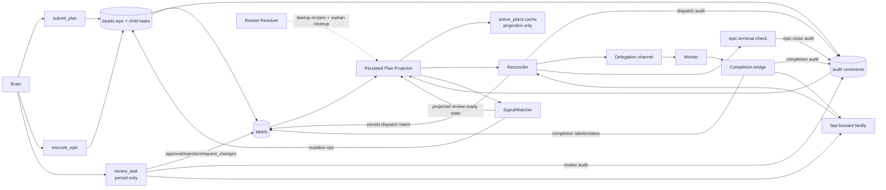

# E2E Closure — v0c Implementation Plan

> **For agentic workers:** REQUIRED SUB-SKILL: follow strict TDD per task: failing test, run red, implement, run green, commit. Every step below uses checkbox syntax for tracking.

**Goal:** Flip persisted-plan authority from RAM to beads for v0c only. After this phase, persisted `submit_plan(persist_as_epic=true)` and `execute_epic` runs must dispatch, complete, review, recover from restart, and continue entirely from projected beads state, with `active_plans` reduced to a cache.

**Architecture:** Add one shared persisted-plan projector in `crates/spur-mcp/src/plan/projector.rs`, convert the reconciler from observe-only into the single persisted dispatcher, persist every dispatch/review/completion phase marker as labels plus `[[spur-audit v1]]` breadcrumbs, rewrite the signal watcher to consume projected plan state, and add restart/deploy reclaim that resolves mutation and dispatch orphans before normal ticking begins. v0c explicitly excludes v0d hardening and v0e codepath retirement.

**Tech Stack:** Rust 2021 workspace, `tokio`, `tokio_util::task::TaskTracker`, `serde`, `chrono`, `uuid`, `anyhow`, `tracing`, `spur-pm` beads backend, real-`br` integration tests under `crates/spur-mcp/tests/`.

---



## Scope Guardrails

- v0c only: do not pull in v0d pagination hardening, rollback-payload enrichment, event-driven reconciler work, or v0e retirement/deletion tasks.
- Gaps closed in this phase: G1 `spur:ready-for-review` writer, G2 reject terminal compatibility, G3 one signal decision per task per tick, G4 cross-restart retry semantics, G7 mutation/dispatch orphan handling.
- Authority rule: for persisted plans, beads status + labels are operational truth; audit and signal comments are analytical truth used to classify and explain that state.
- Acceptance mapping is fixed: Tasks 47-56 are T-v0c-1 through T-v0c-10, one acceptance test per task with no bundling.

## Phase 1 — Scaffold (Tasks 1-3)

## Task 1: Create `projector.rs` and register the new module

**Files:**
- Create: `crates/spur-mcp/src/plan/projector.rs`
- Modify: `crates/spur-mcp/src/plan/mod.rs:8-15`
- Test: `crates/spur-mcp/src/plan/projector.rs` inline `#[cfg(test)]`

- [ ] **Step 1: Add the failing sorter test in `crates/spur-mcp/src/plan/projector.rs`**

```rust
#[cfg(test)]
mod tests {
    use chrono::{TimeZone, Utc};
    use spur_pm::Comment;

    #[test]
    fn sort_projection_comments_orders_by_created_at_then_id() {
        let comments = vec![
            Comment {
                id: "c-3".into(),
                body: "third".into(),
                actor: "spur".into(),
                created_at: Utc.with_ymd_and_hms(2026, 4, 21, 10, 0, 2).unwrap(),
            },
            Comment {
                id: "c-2".into(),
                body: "same-second-b".into(),
                actor: "spur".into(),
                created_at: Utc.with_ymd_and_hms(2026, 4, 21, 10, 0, 1).unwrap(),
            },
            Comment {
                id: "c-1".into(),
                body: "same-second-a".into(),
                actor: "spur".into(),
                created_at: Utc.with_ymd_and_hms(2026, 4, 21, 10, 0, 1).unwrap(),
            },
        ];

        let ordered = super::sort_projection_comments(comments);
        let ids: Vec<String> = ordered.into_iter().map(|comment| comment.id).collect();
        assert_eq!(ids, vec!["c-1".to_string(), "c-2".to_string(), "c-3".to_string()]);
    }
}
```

Run: `cargo test -p spur-mcp sort_projection_comments_orders_by_created_at_then_id -- --exact`
Expected: FAIL with `E0433` / unresolved module items because `projector.rs` is not registered yet.

- [ ] **Step 2: Run the red test exactly once**

Run: `cargo test -p spur-mcp sort_projection_comments_orders_by_created_at_then_id -- --exact`
Expected: compile failure proving the module is still absent from `crates/spur-mcp/src/plan/mod.rs:8-15`.

- [ ] **Step 3: Implement the module registration and skeleton in `crates/spur-mcp/src/plan/mod.rs:8-15` and `crates/spur-mcp/src/plan/projector.rs`**

```rust
// crates/spur-mcp/src/plan/mod.rs
pub mod audit_sentinel;
pub mod labels;
pub mod mutation;
pub mod mutation_executor;
pub mod projector;
pub mod proposers;
pub mod reconciler;
pub mod signal_watcher;
pub mod signals;
```

```rust
// crates/spur-mcp/src/plan/projector.rs
use super::PlanState;

pub fn sort_projection_comments(mut comments: Vec<spur_pm::Comment>) -> Vec<spur_pm::Comment> {
    comments.sort_by(|left, right| {
        left.created_at
            .cmp(&right.created_at)
            .then_with(|| left.id.cmp(&right.id))
    });
    comments
}

pub async fn project_plan_from_beads(
    _pm: &spur_pm::PmService,
    plan_id: &str,
) -> anyhow::Result<PlanState> {
    anyhow::bail!("persisted projector not implemented yet for plan_id={plan_id}")
}
```

- [ ] **Step 4: Run the sorter test green**

Run: `cargo test -p spur-mcp sort_projection_comments_orders_by_created_at_then_id -- --exact`
Expected: `1 passed`.

- [ ] **Step 5: Commit the scaffold**

Run: `git commit -am "feat(spur-mcp): scaffold persisted plan projector"`

## Task 2: Rename dispatch/review labels into the `spur:` namespace

**Files:**
- Modify: `crates/spur-mcp/src/plan/labels.rs:44-68, 70-99, 140-244`
- Test: `crates/spur-mcp/tests/labels_br_round_trip.rs:62-100`

- [ ] **Step 1: Add the failing label-prefix test in `crates/spur-mcp/src/plan/labels.rs:140-244`**

```rust
#[test]
fn delegation_and_review_labels_use_spur_namespace() {
    assert_eq!(delegation_id("del-A"), "spur:delegation-id:del-A");
    assert_eq!(parse_delegation_id("spur:delegation-id:del-A"), Some("del-A"));
    assert_eq!(READY_FOR_REVIEW, "spur:ready-for-review");
    assert_eq!(REVIEW_REJECTED, "spur:review-rejected");
}
```

Run: `cargo test -p spur-mcp delegation_and_review_labels_use_spur_namespace -- --exact`
Expected: FAIL because `delegation_id()` still returns the legacy `delegation-id:` shape and the new parser/constant do not exist.

- [ ] **Step 2: Run the red label test**

Run: `cargo test -p spur-mcp delegation_and_review_labels_use_spur_namespace -- --exact`
Expected: assertion failure against `crates/spur-mcp/src/plan/labels.rs:44-57`.

- [ ] **Step 3: Implement the label migration in `crates/spur-mcp/src/plan/labels.rs:44-68`**

```rust
pub const DELEGATION_ID_PREFIX: &str = "spur:delegation-id:";
pub const READY_FOR_REVIEW: &str = "spur:ready-for-review";
pub const REVIEW_REJECTED: &str = "spur:review-rejected";

pub fn delegation_id(delegation_id: &str) -> String {
    format!("{DELEGATION_ID_PREFIX}{delegation_id}")
}

pub fn parse_delegation_id(label: &str) -> Option<&str> {
    label.strip_prefix(DELEGATION_ID_PREFIX)
}
```

```rust
// crates/spur-mcp/tests/labels_br_round_trip.rs
let constructed = vec![
    labels::plan_id("plan-xyz"),
    labels::plan_task_id("task-a"),
    labels::agent("claude-code-acp"),
    labels::source_issue("bd-42"),
    labels::delegation_id("del-abc-123"),
    labels::signal_kind("scope-drift"),
    labels::signal_kind_bucket("scope-drift", "high"),
    labels::mutation_id_label(&uuid::Uuid::nil()),
    labels::signal_processed_label(&uuid::Uuid::nil()),
    labels::SIGNAL_LATE_ARRIVAL.to_string(),
    labels::READY_FOR_REVIEW.to_string(),
    labels::REVIEW_REJECTED.to_string(),
];
```

- [ ] **Step 4: Run the focused unit and live-label tests green**

Run: `cargo test -p spur-mcp delegation_and_review_labels_use_spur_namespace -- --exact`
Expected: `1 passed`.

Run: `cargo test -p spur-mcp --test labels_br_round_trip every_label_constructor_is_accepted_by_br -- --exact --nocapture`
Expected: `ok` when `br` is on `PATH`, or a clean skip message if not.

- [ ] **Step 5: Commit the label migration**

Run: `git commit -am "feat(spur-mcp): namespace persisted dispatch labels"`

## Task 3: Extend `AuditSentinelKind` for v0c projection and recovery

**Files:**
- Modify: `crates/spur-mcp/src/plan/audit_sentinel.rs:15-128, 148-395`
- Test: `crates/spur-mcp/tests/audit_sentinel_round_trip.rs`

- [ ] **Step 1: Add the failing round-trip test for the new variants**

```rust
#[test]
fn completion_state_and_dispatch_orphan_cleared_round_trip() {
    let completion = super::AuditSentinelKind::Completion {
        delegation_id: "del-A".into(),
        completion_state: super::CompletionState::Superseded,
        superseded: true,
        worker_branch: Some("feat/stale".into()),
        result_summary: Some("late completion ignored".into()),
    };
    let orphan = super::AuditSentinelKind::DispatchOrphanCleared {
        delegation_id: "del-A".into(),
        reason: "restart-orphan-cleared".into(),
    };

    let completion_body = super::encode_comment(&completion);
    let orphan_body = super::encode_comment(&orphan);

    assert_eq!(super::parse_comment(&completion_body).unwrap().unwrap(), completion);
    assert_eq!(super::parse_comment(&orphan_body).unwrap().unwrap(), orphan);
}
```

Run: `cargo test -p spur-mcp completion_state_and_dispatch_orphan_cleared_round_trip -- --exact`
Expected: FAIL because `CompletionState` and `DispatchOrphanCleared` are not part of `AuditSentinelKind` yet.

- [ ] **Step 2: Run the red sentinel test**

Run: `cargo test -p spur-mcp completion_state_and_dispatch_orphan_cleared_round_trip -- --exact`
Expected: compile failure against `crates/spur-mcp/src/plan/audit_sentinel.rs:18-60`.

- [ ] **Step 3: Extend the enum and the PlanSubmit payload in `crates/spur-mcp/src/plan/audit_sentinel.rs:15-77`**

```rust
#[derive(Debug, Clone, Copy, PartialEq, Eq, Serialize, Deserialize)]
#[serde(rename_all = "snake_case")]
pub enum CompletionState {
    AwaitingReview,
    Failed,
    Cancelled,
    Superseded,
}

#[non_exhaustive]
#[derive(Debug, Clone, PartialEq, Serialize, Deserialize)]
#[serde(tag = "kind", rename_all = "kebab-case")]
pub enum AuditSentinelKind {
    PlanSubmit {
        plan_id: String,
        epic_issue_id: String,
        task_ids: Vec<String>,
        #[serde(default)]
        base_snapshot_branch: Option<String>,
        #[serde(default)]
        execution_mode: Option<String>,
    },
    Dispatch {
        delegation_id: String,
        worker: String,
        attempt: u32,
    },
    DispatchOrphanCleared {
        delegation_id: String,
        reason: String,
    },
    Completion {
        delegation_id: String,
        completion_state: CompletionState,
        #[serde(default)]
        superseded: bool,
        #[serde(default)]
        worker_branch: Option<String>,
        #[serde(default)]
        result_summary: Option<String>,
    },
    Approval {
        delegation_id: String,
    },
    Rejection {
        delegation_id: String,
        feedback: String,
    },
    Signal {
        signal_id: String,
        #[serde(rename = "signal_kind")]
        kind: String,
        severity: f32,
        reason: String,
    },
    MutationPlan {
        mutation_id: String,
        op: String,
        #[serde(default)]
        trigger_signal_id: Option<String>,
        trigger_task_id: String,
    },
    MutationCommit {
        mutation_id: String,
        children_created: Vec<String>,
    },
    MutationInvariantViolation {
        mutation_id: String,
        violation: String,
        rollback_status: String,
    },
    LateSignal {
        signal_id: String,
        terminal_status: String,
    },
    #[serde(other)]
    Unknown,
}
```

- [ ] **Step 4: Run the focused unit test and the live sentinel round-trip test green**

Run: `cargo test -p spur-mcp completion_state_and_dispatch_orphan_cleared_round_trip -- --exact`
Expected: `1 passed`.

Run: `cargo test -p spur-mcp --test audit_sentinel_round_trip -- --nocapture`
Expected: all sentinel round-trip tests pass, including the new `dispatch-orphan-cleared` and extended `completion`.

- [ ] **Step 5: Commit the sentinel schema update**

Run: `git commit -am "feat(spur-mcp): extend audit sentinels for v0c"`

## Phase 2 — Fast-Forward Primitive (Tasks 4-5)

## Task 4: Add a reusable fast-forward helper around `Arc<Notify>`

**Files:**
- Modify: `crates/spur-mcp/src/server.rs:931-945`
- Test: `crates/spur-mcp/src/server.rs` inline `#[cfg(test)]`

- [ ] **Step 1: Add the failing helper test near `crates/spur-mcp/src/server.rs:931-945`**

```rust
#[tokio::test]
async fn notify_fast_forward_wakes_waiter() {
    use std::sync::Arc;
    use std::time::Duration;
    use tokio::sync::Notify;

    let notify = Arc::new(Notify::new());
    let waiter = tokio::spawn({
        let notify = Arc::clone(&notify);
        async move { notify.notified().await }
    });

    super::notify_fast_forward(&Some(Arc::clone(&notify)));

    tokio::time::timeout(Duration::from_millis(50), waiter)
        .await
        .expect("waiter must wake")
        .expect("waiter task must not panic");
}
```

Run: `cargo test -p spur-mcp notify_fast_forward_wakes_waiter -- --exact`
Expected: FAIL because `notify_fast_forward` does not exist.

- [ ] **Step 2: Run the red test**

Run: `cargo test -p spur-mcp notify_fast_forward_wakes_waiter -- --exact`
Expected: compile failure against `crates/spur-mcp/src/server.rs:931-939`.

- [ ] **Step 3: Implement the helper in `crates/spur-mcp/src/server.rs:931-945`**

```rust
pub(crate) fn notify_fast_forward(fast_forward: &Option<Arc<tokio::sync::Notify>>) {
    if let Some(notify) = fast_forward {
        notify.notify_one();
    }
}

pub fn set_reconciler_enabled(
    &mut self,
    enable: bool,
    fast_forward: Option<Arc<tokio::sync::Notify>>,
) {
    self.reconciler_enabled = enable;
    self.reconciler_fast_forward = fast_forward;
}
```

- [ ] **Step 4: Run the helper test green**

Run: `cargo test -p spur-mcp notify_fast_forward_wakes_waiter -- --exact`
Expected: `1 passed`.

- [ ] **Step 5: Commit the helper**

Run: `git commit -am "refactor(spur-mcp): add reconciler fast-forward helper"`

## Task 5: Expose `fast_forward_reconciler()` for new persisted writers

**Files:**
- Modify: `crates/spur-mcp/src/server.rs:933-945, 200-245`
- Modify: `crates/spur-mcp/src/plan/reconciler.rs:43-78`
- Test: `crates/spur-mcp/src/server.rs` inline `#[cfg(test)]`

- [ ] **Step 1: Add the failing server method test**

```rust
#[tokio::test]
async fn fast_forward_reconciler_uses_configured_notify() {
    use std::sync::Arc;
    use std::time::Duration;
    use tokio::sync::Notify;

    let session_id = spur_acp::BrainSessionId::new(spur_acp::SessionId("brain".into()));
    let continuation_ctx = super::DetachedContinuationCtx {
        on_complete: Arc::new(|_, _| Box::pin(async {})),
    };
    let (mut server, _channel) = super::McpCallbackServer::new(&session_id, None, None, continuation_ctx);
    let notify = Arc::new(Notify::new());
    server.set_reconciler_enabled(true, Some(Arc::clone(&notify)));

    let waiter = tokio::spawn({
        let notify = Arc::clone(&notify);
        async move { notify.notified().await }
    });

    server.fast_forward_reconciler();

    tokio::time::timeout(Duration::from_millis(50), waiter)
        .await
        .expect("fast-forward must wake the configured reconciler channel")
        .expect("waiter task must not panic");
}
```

Run: `cargo test -p spur-mcp fast_forward_reconciler_uses_configured_notify -- --exact`
Expected: FAIL because `fast_forward_reconciler()` is not part of `McpCallbackServer` yet.

- [ ] **Step 2: Run the red server-method test**

Run: `cargo test -p spur-mcp fast_forward_reconciler_uses_configured_notify -- --exact`
Expected: compile failure against `crates/spur-mcp/src/server.rs:933-945`.

- [ ] **Step 3: Implement the method and keep `Reconciler::run` coalescing semantics unchanged**

```rust
impl McpCallbackServer {
    pub fn fast_forward_reconciler(&self) {
        notify_fast_forward(&self.reconciler_fast_forward);
    }
}
```

```rust
// crates/spur-mcp/src/plan/reconciler.rs
_ = self.fast_forward.notified() => {
    tracing::debug!("reconciler fast-forward triggered");
    interval = self.config.base_interval;
}
```

- [ ] **Step 4: Run the server-method test green**

Run: `cargo test -p spur-mcp fast_forward_reconciler_uses_configured_notify -- --exact`
Expected: `1 passed`.

- [ ] **Step 5: Commit the writable fast-forward surface**

Run: `git commit -am "feat(spur-mcp): expose server fast-forward method"`

## Phase 3 — Persisted Plan Projector (Tasks 6-12)

## Task 6: Parse sorted audit comments inside `projector.rs`

**Files:**
- Modify: `crates/spur-mcp/src/plan/projector.rs`
- Test: `crates/spur-mcp/src/plan/projector.rs` inline `#[cfg(test)]`

- [ ] **Step 1: Add the failing audit-collection test**

```rust
#[test]
fn collect_sorted_audits_skips_non_audit_comments() {
    use chrono::{TimeZone, Utc};
    use spur_pm::Comment;

    let comments = vec![
        Comment {
            id: "c-2".into(),
            body: crate::plan::audit_sentinel::encode_comment(
                &crate::plan::audit_sentinel::AuditSentinelKind::Approval {
                    delegation_id: "del-A".into(),
                },
            ),
            actor: "spur".into(),
            created_at: Utc.with_ymd_and_hms(2026, 4, 21, 10, 0, 2).unwrap(),
        },
        Comment {
            id: "c-1".into(),
            body: "ordinary human comment".into(),
            actor: "human".into(),
            created_at: Utc.with_ymd_and_hms(2026, 4, 21, 10, 0, 1).unwrap(),
        },
    ];

    let audits = super::collect_sorted_audits(comments);
    assert_eq!(audits.len(), 1);
    assert!(matches!(
        audits[0],
        crate::plan::audit_sentinel::AuditSentinelKind::Approval { .. }
    ));
}
```

Run: `cargo test -p spur-mcp collect_sorted_audits_skips_non_audit_comments -- --exact`
Expected: FAIL because `collect_sorted_audits()` does not exist in `crates/spur-mcp/src/plan/projector.rs`.

- [ ] **Step 2: Run the red projector test**

Run: `cargo test -p spur-mcp collect_sorted_audits_skips_non_audit_comments -- --exact`
Expected: compile failure against `crates/spur-mcp/src/plan/projector.rs`.

- [ ] **Step 3: Implement audit collection with deterministic comment ordering**

```rust
pub fn collect_sorted_audits(
    comments: Vec<spur_pm::Comment>,
) -> Vec<crate::plan::audit_sentinel::AuditSentinelKind> {
    sort_projection_comments(comments)
        .into_iter()
        .filter_map(|comment| crate::plan::audit_sentinel::parse_comment(&comment.body))
        .filter_map(|result| result.ok())
        .collect()
}
```

- [ ] **Step 4: Run the projector audit test green**

Run: `cargo test -p spur-mcp collect_sorted_audits_skips_non_audit_comments -- --exact`
Expected: `1 passed`.

- [ ] **Step 5: Commit the sorted audit helper**

Run: `git commit -am "feat(spur-mcp): collect sorted projector audits"`

## Task 7: Reconstruct attempts from `Dispatch` breadcrumbs

**Files:**
- Modify: `crates/spur-mcp/src/plan/projector.rs`
- Test: `crates/spur-mcp/src/plan/projector.rs` inline `#[cfg(test)]`

- [ ] **Step 1: Add the failing attempt-reconstruction test**

```rust
#[test]
fn latest_dispatch_sets_attempt_and_last_delegation_id() {
    let audits = vec![
        crate::plan::audit_sentinel::AuditSentinelKind::Dispatch {
            delegation_id: "del-1".into(),
            worker: "codex".into(),
            attempt: 1,
        },
        crate::plan::audit_sentinel::AuditSentinelKind::Dispatch {
            delegation_id: "del-2".into(),
            worker: "codex".into(),
            attempt: 2,
        },
    ];

    let (attempt, last_delegation_id) = super::project_attempt_facts(&audits);
    assert_eq!(attempt, 2);
    assert_eq!(last_delegation_id.as_deref(), Some("del-2"));
}
```

Run: `cargo test -p spur-mcp latest_dispatch_sets_attempt_and_last_delegation_id -- --exact`
Expected: FAIL because `project_attempt_facts()` is missing.

- [ ] **Step 2: Run the red attempt test**

Run: `cargo test -p spur-mcp latest_dispatch_sets_attempt_and_last_delegation_id -- --exact`
Expected: compile failure against `crates/spur-mcp/src/plan/projector.rs`.

- [ ] **Step 3: Implement attempt reconstruction**

```rust
pub fn project_attempt_facts(
    audits: &[crate::plan::audit_sentinel::AuditSentinelKind],
) -> (u32, Option<String>) {
    let mut attempt = 1u32;
    let mut last_delegation_id = None;

    for audit in audits {
        if let crate::plan::audit_sentinel::AuditSentinelKind::Dispatch {
            delegation_id,
            attempt: dispatch_attempt,
            ..
        } = audit
        {
            attempt = *dispatch_attempt;
            last_delegation_id = Some(delegation_id.clone());
        }
    }

    (attempt, last_delegation_id)
}
```

- [ ] **Step 4: Run the attempt test green**

Run: `cargo test -p spur-mcp latest_dispatch_sets_attempt_and_last_delegation_id -- --exact`
Expected: `1 passed`.

- [ ] **Step 5: Commit the attempt projector**

Run: `git commit -am "feat(spur-mcp): reconstruct attempts from dispatch audits"`

## Task 8: Reconstruct completion facts from `Completion` breadcrumbs

**Files:**
- Modify: `crates/spur-mcp/src/plan/projector.rs`
- Test: `crates/spur-mcp/src/plan/projector.rs` inline `#[cfg(test)]`

- [ ] **Step 1: Add the failing completion-facts test**

```rust
#[test]
fn latest_completion_carries_state_branch_and_summary() {
    use crate::plan::audit_sentinel::{AuditSentinelKind, CompletionState};

    let audits = vec![
        AuditSentinelKind::Completion {
            delegation_id: "del-1".into(),
            completion_state: CompletionState::AwaitingReview,
            superseded: false,
            worker_branch: Some("feat/task".into()),
            result_summary: Some("3 files changed".into()),
        },
    ];

    let facts = super::latest_completion_facts(&audits).expect("completion facts");
    assert_eq!(facts.0, CompletionState::AwaitingReview);
    assert_eq!(facts.1.as_deref(), Some("feat/task"));
    assert_eq!(facts.2.as_deref(), Some("3 files changed"));
    assert!(!facts.3);
}
```

Run: `cargo test -p spur-mcp latest_completion_carries_state_branch_and_summary -- --exact`
Expected: FAIL because `latest_completion_facts()` is missing.

- [ ] **Step 2: Run the red completion-facts test**

Run: `cargo test -p spur-mcp latest_completion_carries_state_branch_and_summary -- --exact`
Expected: compile failure against `crates/spur-mcp/src/plan/projector.rs`.

- [ ] **Step 3: Implement completion fact extraction**

```rust
pub fn latest_completion_facts(
    audits: &[crate::plan::audit_sentinel::AuditSentinelKind],
) -> Option<(
    crate::plan::audit_sentinel::CompletionState,
    Option<String>,
    Option<String>,
    bool,
)> {
    let mut latest = None;

    for audit in audits {
        if let crate::plan::audit_sentinel::AuditSentinelKind::Completion {
            completion_state,
            worker_branch,
            result_summary,
            superseded,
            ..
        } = audit
        {
            latest = Some((
                *completion_state,
                worker_branch.clone(),
                result_summary.clone(),
                *superseded,
            ));
        }
    }

    latest
}
```

- [ ] **Step 4: Run the completion-facts test green**

Run: `cargo test -p spur-mcp latest_completion_carries_state_branch_and_summary -- --exact`
Expected: `1 passed`.

- [ ] **Step 5: Commit the completion-facts helper**

Run: `git commit -am "feat(spur-mcp): project completion facts from audit history"`

## Task 9: Project operational task status from labels plus audit history

**Files:**
- Modify: `crates/spur-mcp/src/plan/projector.rs`
- Test: `crates/spur-mcp/src/plan/projector.rs` inline `#[cfg(test)]`

- [ ] **Step 1: Add the failing open-status tests**

```rust
#[test]
fn open_task_with_delegation_label_projects_dispatched() {
    let issue = spur_pm::Issue {
        id: "bd-2".into(),
        source: spur_pm::PmSource::Beads,
        title: "Task".into(),
        body: "Body".into(),
        status: "open".into(),
        labels: vec![crate::plan::labels::delegation_id("del-A")],
        assignee: None,
        url: "beads://bd-2".into(),
        priority: Some(2),
        issue_type: Some("task".into()),
        blocked_by: Vec::new(),
        due_at: None,
        created_at: chrono::Utc::now(),
        updated_at: chrono::Utc::now(),
    };

    let status = super::project_status_for_issue(&issue, &[], true, "closed");
    assert!(matches!(status, crate::plan::PlanTaskStatus::Dispatched { delegation_id } if delegation_id == "del-A"));
}

#[test]
fn open_task_with_ready_for_review_projects_awaiting_review() {
    use crate::plan::audit_sentinel::{AuditSentinelKind, CompletionState};

    let issue = spur_pm::Issue {
        id: "bd-2".into(),
        source: spur_pm::PmSource::Beads,
        title: "Task".into(),
        body: "Body".into(),
        status: "open".into(),
        labels: vec![crate::plan::labels::READY_FOR_REVIEW.to_string()],
        assignee: None,
        url: "beads://bd-2".into(),
        priority: Some(2),
        issue_type: Some("task".into()),
        blocked_by: Vec::new(),
        due_at: None,
        created_at: chrono::Utc::now(),
        updated_at: chrono::Utc::now(),
    };

    let audits = vec![AuditSentinelKind::Completion {
        delegation_id: "del-A".into(),
        completion_state: CompletionState::AwaitingReview,
        superseded: false,
        worker_branch: Some("feat/task".into()),
        result_summary: Some("looks good".into()),
    }];

    let status = super::project_status_for_issue(&issue, &audits, true, "closed");
    assert!(matches!(status, crate::plan::PlanTaskStatus::AwaitingReview { .. }));
}
```

Run: `cargo test -p spur-mcp open_task_with_delegation_label_projects_dispatched -- --exact`
Expected: FAIL because `project_status_for_issue()` does not exist.

- [ ] **Step 2: Run the red status tests**

Run: `cargo test -p spur-mcp open_task_with_delegation_label_projects_dispatched -- --exact`
Expected: compile failure against `crates/spur-mcp/src/plan/projector.rs`.

- [ ] **Step 3: Implement the open-status projector**

```rust
pub fn project_status_for_issue(
    issue: &spur_pm::Issue,
    audits: &[crate::plan::audit_sentinel::AuditSentinelKind],
    ready_now: bool,
    closed_status: &str,
) -> crate::plan::PlanTaskStatus {
    if issue.status == closed_status {
        return project_closed_status(issue, audits);
    }

    if let Some(delegation_id) = issue
        .labels
        .iter()
        .find_map(|label| crate::plan::labels::parse_delegation_id(label))
    {
        return crate::plan::PlanTaskStatus::Dispatched {
            delegation_id: delegation_id.to_string(),
        };
    }

    if issue
        .labels
        .iter()
        .any(|label| label == crate::plan::labels::READY_FOR_REVIEW)
    {
        let summary = latest_completion_facts(audits).and_then(|(_, _, result_summary, _)| result_summary);
        return crate::plan::PlanTaskStatus::AwaitingReview { summary };
    }

    if ready_now {
        crate::plan::PlanTaskStatus::Ready
    } else {
        crate::plan::PlanTaskStatus::Pending
    }
}
```

- [ ] **Step 4: Run the open-status tests green**

Run: `cargo test -p spur-mcp open_task_with_delegation_label_projects_dispatched -- --exact`
Expected: `1 passed`.

Run: `cargo test -p spur-mcp open_task_with_ready_for_review_projects_awaiting_review -- --exact`
Expected: `1 passed`.

- [ ] **Step 5: Commit the open-status mapping**

Run: `git commit -am "feat(spur-mcp): project open task states from labels"`

## Task 10: Project closed statuses for approve/reject/fail/cancel/supersede

**Files:**
- Modify: `crates/spur-mcp/src/plan/projector.rs`
- Test: `crates/spur-mcp/src/plan/projector.rs` inline `#[cfg(test)]`

- [ ] **Step 1: Add the failing closed-status tests**

```rust
#[test]
fn closed_task_with_rejection_audit_projects_rejected() {
    let issue = spur_pm::Issue {
        id: "bd-9".into(),
        source: spur_pm::PmSource::Beads,
        title: "Task".into(),
        body: "Body".into(),
        status: "closed".into(),
        labels: vec![crate::plan::labels::REVIEW_REJECTED.to_string()],
        assignee: None,
        url: "beads://bd-9".into(),
        priority: Some(2),
        issue_type: Some("task".into()),
        blocked_by: Vec::new(),
        due_at: None,
        created_at: chrono::Utc::now(),
        updated_at: chrono::Utc::now(),
    };

    let audits = vec![crate::plan::audit_sentinel::AuditSentinelKind::Rejection {
        delegation_id: "del-A".into(),
        feedback: "needs a retry".into(),
    }];

    let status = super::project_closed_status(&issue, &audits);
    assert!(matches!(status, crate::plan::PlanTaskStatus::Rejected { feedback } if feedback.as_deref() == Some("needs a retry")));
}

#[test]
fn closed_task_with_failed_completion_projects_failed() {
    use crate::plan::audit_sentinel::{AuditSentinelKind, CompletionState};

    let issue = spur_pm::Issue {
        id: "bd-9".into(),
        source: spur_pm::PmSource::Beads,
        title: "Task".into(),
        body: "Body".into(),
        status: "closed".into(),
        labels: Vec::new(),
        assignee: None,
        url: "beads://bd-9".into(),
        priority: Some(2),
        issue_type: Some("task".into()),
        blocked_by: Vec::new(),
        due_at: None,
        created_at: chrono::Utc::now(),
        updated_at: chrono::Utc::now(),
    };

    let audits = vec![AuditSentinelKind::Completion {
        delegation_id: "del-A".into(),
        completion_state: CompletionState::Failed,
        superseded: false,
        worker_branch: None,
        result_summary: Some("cargo test failed".into()),
    }];

    let status = super::project_closed_status(&issue, &audits);
    assert!(matches!(status, crate::plan::PlanTaskStatus::Failed { error } if error == "cargo test failed"));
}
```

Run: `cargo test -p spur-mcp closed_task_with_rejection_audit_projects_rejected -- --exact`
Expected: FAIL because `project_closed_status()` does not exist.

- [ ] **Step 2: Run the red closed-status tests**

Run: `cargo test -p spur-mcp closed_task_with_rejection_audit_projects_rejected -- --exact`
Expected: compile failure against `crates/spur-mcp/src/plan/projector.rs`.

- [ ] **Step 3: Implement the closed-status projector**

```rust
pub fn project_closed_status(
    issue: &spur_pm::Issue,
    audits: &[crate::plan::audit_sentinel::AuditSentinelKind],
) -> crate::plan::PlanTaskStatus {
    for audit in audits.iter().rev() {
        match audit {
            crate::plan::audit_sentinel::AuditSentinelKind::Approval { .. } => {
                let summary =
                    latest_completion_facts(audits).and_then(|(_, _, result_summary, _)| result_summary);
                return crate::plan::PlanTaskStatus::Approved { summary };
            }
            crate::plan::audit_sentinel::AuditSentinelKind::Rejection { feedback, .. } => {
                return crate::plan::PlanTaskStatus::Rejected {
                    feedback: Some(feedback.clone()),
                };
            }
            crate::plan::audit_sentinel::AuditSentinelKind::Completion {
                completion_state,
                result_summary,
                ..
            } => match completion_state {
                crate::plan::audit_sentinel::CompletionState::Failed => {
                    return crate::plan::PlanTaskStatus::Failed {
                        error: result_summary.clone().unwrap_or_else(|| "worker failed".into()),
                    };
                }
                crate::plan::audit_sentinel::CompletionState::Cancelled => {
                    return crate::plan::PlanTaskStatus::Cancelled {
                        reason: result_summary.clone().unwrap_or_else(|| "worker cancelled".into()),
                    };
                }
                crate::plan::audit_sentinel::CompletionState::Superseded => {
                    return crate::plan::PlanTaskStatus::Pending;
                }
                crate::plan::audit_sentinel::CompletionState::AwaitingReview => {}
            },
            _ => {}
        }
    }

    if issue
        .labels
        .iter()
        .any(|label| label == crate::plan::labels::REVIEW_REJECTED)
    {
        crate::plan::PlanTaskStatus::Rejected { feedback: None }
    } else {
        crate::plan::PlanTaskStatus::Approved { summary: None }
    }
}
```

- [ ] **Step 4: Run the closed-status tests green**

Run: `cargo test -p spur-mcp closed_task_with_rejection_audit_projects_rejected -- --exact`
Expected: `1 passed`.

Run: `cargo test -p spur-mcp closed_task_with_failed_completion_projects_failed -- --exact`
Expected: `1 passed`.

- [ ] **Step 5: Commit the closed-status mapping**

Run: `git commit -am "feat(spur-mcp): project closed task states from audits"`

## Task 11: Recompute `Ready` vs `Pending` after closed-state projection

**Files:**
- Modify: `crates/spur-mcp/src/plan/projector.rs`
- Test: `crates/spur-mcp/src/plan/projector.rs` inline `#[cfg(test)]`

- [ ] **Step 1: Add the failing dependency-readiness test**

```rust
#[test]
fn recompute_open_statuses_marks_unblocked_pending_tasks_ready() {
    let mut tasks = vec![
        crate::plan::PlanTaskEntry {
            spec: crate::plan::PlanTask {
                task_id: "a".into(),
                agent: "codex".into(),
                task: "A".into(),
                depends_on: Vec::new(),
                issue_id: Some("bd-1".into()),
                context_files: Vec::new(),
            },
            status: crate::plan::PlanTaskStatus::Approved { summary: None },
            result: None,
            worker_branch: None,
            attempt: 1,
            history: Vec::new(),
            last_delegation_id: Some("del-a".into()),
        },
        crate::plan::PlanTaskEntry {
            spec: crate::plan::PlanTask {
                task_id: "b".into(),
                agent: "codex".into(),
                task: "B".into(),
                depends_on: vec!["a".into()],
                issue_id: Some("bd-2".into()),
                context_files: Vec::new(),
            },
            status: crate::plan::PlanTaskStatus::Pending,
            result: None,
            worker_branch: None,
            attempt: 1,
            history: Vec::new(),
            last_delegation_id: None,
        },
    ];

    super::recompute_open_statuses(&mut tasks);
    assert!(matches!(tasks[1].status, crate::plan::PlanTaskStatus::Ready));
}
```

Run: `cargo test -p spur-mcp recompute_open_statuses_marks_unblocked_pending_tasks_ready -- --exact`
Expected: FAIL because `recompute_open_statuses()` is missing.

- [ ] **Step 2: Run the red readiness test**

Run: `cargo test -p spur-mcp recompute_open_statuses_marks_unblocked_pending_tasks_ready -- --exact`
Expected: compile failure against `crates/spur-mcp/src/plan/projector.rs`.

- [ ] **Step 3: Implement dependency-based open-state recomputation**

```rust
pub fn recompute_open_statuses(tasks: &mut [crate::plan::PlanTaskEntry]) {
    let approved_or_cancelled: std::collections::HashSet<String> = tasks
        .iter()
        .filter(|task| {
            matches!(
                task.status,
                crate::plan::PlanTaskStatus::Approved { .. }
                    | crate::plan::PlanTaskStatus::Cancelled { .. }
            )
        })
        .map(|task| task.spec.task_id.clone())
        .collect();

    for task in tasks {
        if matches!(task.status, crate::plan::PlanTaskStatus::Pending | crate::plan::PlanTaskStatus::Ready)
        {
            let ready = task
                .spec
                .depends_on
                .iter()
                .all(|dependency| approved_or_cancelled.contains(dependency));
            task.status = if ready {
                crate::plan::PlanTaskStatus::Ready
            } else {
                crate::plan::PlanTaskStatus::Pending
            };
        }
    }
}
```

- [ ] **Step 4: Run the readiness test green**

Run: `cargo test -p spur-mcp recompute_open_statuses_marks_unblocked_pending_tasks_ready -- --exact`
Expected: `1 passed`.

- [ ] **Step 5: Commit the ready/pending projector**

Run: `git commit -am "feat(spur-mcp): recompute projected task readiness"`

## Task 12: Build `project_plan_from_beads()` and wire cache-miss status hydration

**Files:**
- Modify: `crates/spur-mcp/src/plan/projector.rs`
- Modify: `crates/spur-mcp/src/server.rs:2762-2787`
- Test: `crates/spur-mcp/src/plan/projector.rs` inline `#[cfg(test)]`

- [ ] **Step 1: Add the failing projector assembly test**

```rust
#[test]
fn plan_submit_audit_reconstructs_base_snapshot_branch() {
    use crate::plan::audit_sentinel::AuditSentinelKind;

    let audits = vec![AuditSentinelKind::PlanSubmit {
        plan_id: "plan-1".into(),
        epic_issue_id: "bd-epic".into(),
        task_ids: vec!["bd-1".into()],
        base_snapshot_branch: Some("refs/heads/main".into()),
        execution_mode: Some("submit_plan".into()),
    }];

    let base_snapshot_branch = super::plan_submit_base_snapshot(&audits);
    assert_eq!(base_snapshot_branch.as_deref(), Some("refs/heads/main"));
}
```

Run: `cargo test -p spur-mcp plan_submit_audit_reconstructs_base_snapshot_branch -- --exact`
Expected: FAIL because `plan_submit_base_snapshot()` is missing.

- [ ] **Step 2: Run the red plan-submit test**

Run: `cargo test -p spur-mcp plan_submit_audit_reconstructs_base_snapshot_branch -- --exact`
Expected: compile failure against `crates/spur-mcp/src/plan/projector.rs`.

- [ ] **Step 3: Implement the full projector and use it on `get_plan_status` cache miss**

```rust
pub fn plan_submit_base_snapshot(
    audits: &[crate::plan::audit_sentinel::AuditSentinelKind],
) -> Option<String> {
    audits.iter().rev().find_map(|audit| {
        if let crate::plan::audit_sentinel::AuditSentinelKind::PlanSubmit {
            base_snapshot_branch,
            ..
        } = audit
        {
            base_snapshot_branch.clone()
        } else {
            None
        }
    })
}

pub async fn project_plan_from_beads(
    pm: &spur_pm::PmService,
    plan_id: &str,
) -> anyhow::Result<crate::plan::PlanState> {
    let summaries = pm
        .list_issues(spur_pm::IssueFilter {
            labels: vec![crate::plan::labels::plan_id(plan_id)],
            limit: Some(1_000),
            ..Default::default()
        })
        .await?;
    let mut issues = Vec::with_capacity(summaries.len());
    for summary in summaries {
        issues.push(pm.get_issue(&summary.id).await?);
    }

    issues.sort_by(|left, right| {
        left.created_at
            .cmp(&right.created_at)
            .then_with(|| left.id.cmp(&right.id))
    });

    let epic = issues
        .iter()
        .find(|issue| issue.issue_type.as_deref() == Some("epic"))
        .cloned()
        .ok_or_else(|| anyhow::anyhow!("persisted plan {plan_id} has no epic"))?;
    let tasks: Vec<spur_pm::Issue> = issues
        .into_iter()
        .filter(|issue| issue.issue_type.as_deref() == Some("task"))
        .collect();

    let adv = pm
        .advanced()
        .ok_or_else(|| anyhow::anyhow!("persisted projector requires beads backend"))?;
    let epic_audits = collect_sorted_audits(adv.list_comments(&epic.id).await?);
    let mut entries = Vec::with_capacity(tasks.len());

    for task_issue in tasks {
        let audits = collect_sorted_audits(adv.list_comments(&task_issue.id).await?);
        let (attempt, last_delegation_id) = project_attempt_facts(&audits);
        let ready_now = false;
        let status = project_status_for_issue(&task_issue, &audits, ready_now, pm.closed_status());
        let completion = latest_completion_facts(&audits);
        entries.push(crate::plan::PlanTaskEntry {
            spec: crate::plan::PlanTask {
                task_id: crate::plan::labels::parse_plan_task_id(
                    task_issue
                        .labels
                        .iter()
                        .find(|label| crate::plan::labels::parse_plan_task_id(label).is_some())
                        .map(String::as_str)
                        .unwrap_or(task_issue.id.as_str()),
                )
                .unwrap_or(task_issue.id.as_str())
                .to_string(),
                agent: task_issue
                    .labels
                    .iter()
                    .find_map(|label| crate::plan::labels::parse_agent(label))
                    .unwrap_or("codex")
                    .to_string(),
                task: task_issue.body.clone(),
                depends_on: task_issue
                    .blocked_by
                    .iter()
                    .filter(|dependency| *dependency != &epic.id)
                    .cloned()
                    .collect(),
                issue_id: Some(task_issue.id.clone()),
                context_files: Vec::new(),
            },
            status,
            result: None,
            worker_branch: completion.clone().and_then(|(_, worker_branch, _, _)| worker_branch),
            attempt,
            history: Vec::new(),
            last_delegation_id,
        });
    }

    recompute_open_statuses(&mut entries);

    Ok(crate::plan::PlanState {
        plan_id: plan_id.to_string(),
        tasks: entries,
        brain_session_id: spur_acp::BrainSessionId::new(spur_acp::SessionId(format!(
            "persisted-plan:{plan_id}"
        ))),
        base_snapshot_branch: plan_submit_base_snapshot(&epic_audits),
        merge_state: crate::plan::PlanMergeState::NotStarted,
        epic_id: Some(epic.id),
    })
}
```

```rust
// crates/spur-mcp/src/server.rs
let plan_state = match plan_arc {
    Some(state) => state,
    None => {
        let pm = self
            .pm_service
            .as_deref()
            .ok_or_else(|| JsonRpcResponse::invalid_params(id.clone(), format!("Unknown plan_id: '{plan_id}'")))?;
        let projected = crate::plan::projector::project_plan_from_beads(pm, &plan_id)
            .await
            .map_err(|_| JsonRpcResponse::invalid_params(id.clone(), format!("Unknown plan_id: '{plan_id}'")))?;
        let projected = Arc::new(tokio::sync::Mutex::new(projected));
        self.active_plans
            .lock()
            .await
            .insert(plan_id.clone(), Arc::clone(&projected));
        projected
    }
};
```

- [ ] **Step 4: Run the unit test green**

Run: `cargo test -p spur-mcp plan_submit_audit_reconstructs_base_snapshot_branch -- --exact`
Expected: `1 passed`.

- [ ] **Step 5: Commit the first end-to-end projector path**

Run: `git commit -am "feat(spur-mcp): project persisted plans from beads"`

## Phase 4 — Durable Dispatch Markers (Tasks 13-16)

## Task 13: Add a shared `persist_dispatch_intent()` helper

**Files:**
- Modify: `crates/spur-mcp/src/plan/mod.rs:607-639`
- Modify: `crates/spur-mcp/src/plan/reconciler.rs:109-115`
- Test: `crates/spur-mcp/tests/plan_audit_coverage.rs`

- [ ] **Step 1: Add the failing dispatch-intent test**

```rust
#[tokio::test]
async fn persist_dispatch_intent_writes_label_before_send() {
    use std::sync::Arc;

    if !br_available() {
        eprintln!("skipping persist_dispatch_intent_writes_label_before_send: `br` not on PATH");
        return;
    }

    let dir = TempDir::new().expect("tempdir");
    run_br(dir.path(), &["init"]).expect("br init failed");
    let pm = spur_pm::PmService::try_new(None, true, false, dir.path(), None)
        .await
        .expect("PmService::try_new failed")
        .expect("expected beads pm");
    let issue_id = extract_id(&run_br(dir.path(), &["create", "Task", "-t", "task"]).unwrap());

    spur_mcp::plan::persist_dispatch_intent(
        &pm,
        &issue_id,
        "plan-1",
        "del-A",
        "codex",
        1,
    )
    .await
    .expect("persist dispatch intent");

    let issue = pm.get_issue(&issue_id).await.expect("get issue");
    assert!(issue.labels.contains(&spur_mcp::plan::labels::delegation_id("del-A")));
}
```

Run: `cargo test -p spur-mcp --test plan_audit_coverage persist_dispatch_intent_writes_label_before_send -- --exact --nocapture`
Expected: FAIL because `persist_dispatch_intent()` does not exist.

- [ ] **Step 2: Run the red dispatch-intent test**

Run: `cargo test -p spur-mcp --test plan_audit_coverage persist_dispatch_intent_writes_label_before_send -- --exact --nocapture`
Expected: compile failure against `crates/spur-mcp/src/plan/mod.rs:607-639`.

- [ ] **Step 3: Implement the durable writer helper in `crates/spur-mcp/src/plan/mod.rs:607-639`**

```rust
pub async fn persist_dispatch_intent(
    pm: &spur_pm::PmService,
    issue_id: &str,
    plan_id: &str,
    delegation_id: &str,
    worker: &str,
    attempt: u32,
) -> anyhow::Result<()> {
    pm.update_issue(
        issue_id,
        spur_pm::IssueUpdate {
            add_labels: vec![crate::plan::labels::delegation_id(delegation_id)],
            remove_labels: vec![crate::plan::labels::READY_FOR_REVIEW.to_string()],
            ..Default::default()
        },
    )
    .await?;

    emit_dispatch_audit(
        Some(pm),
        &Some(issue_id.to_string()),
        plan_id,
        delegation_id,
        worker,
        attempt,
    )
    .await;

    Ok(())
}
```

- [ ] **Step 4: Run the dispatch-intent test green**

Run: `cargo test -p spur-mcp --test plan_audit_coverage persist_dispatch_intent_writes_label_before_send -- --exact --nocapture`
Expected: `ok`.

- [ ] **Step 5: Commit the dispatch-intent writer**

Run: `git commit -am "feat(spur-mcp): persist dispatch intent before send"`

## Task 14: Add compensating cleanup for immediate send failure

**Files:**
- Modify: `crates/spur-mcp/src/plan/mod.rs:641-724`
- Modify: `crates/spur-mcp/src/plan/reconciler.rs:109-115`
- Test: `crates/spur-mcp/src/plan/mod.rs` inline `#[cfg(test)]`

- [ ] **Step 1: Add the failing compensation test**

```rust
#[test]
fn immediate_send_failure_compensation_removes_dispatch_label() {
    let update = super::dispatch_send_failure_update("del-A");
    assert!(update.remove_labels.contains(&crate::plan::labels::delegation_id("del-A")));
    assert_eq!(update.comment.as_deref(), Some("Dispatch send failed before worker ownership was established."));
}
```

Run: `cargo test -p spur-mcp immediate_send_failure_compensation_removes_dispatch_label -- --exact`
Expected: FAIL because `dispatch_send_failure_update()` does not exist.

- [ ] **Step 2: Run the red compensation test**

Run: `cargo test -p spur-mcp immediate_send_failure_compensation_removes_dispatch_label -- --exact`
Expected: compile failure against `crates/spur-mcp/src/plan/mod.rs:641-724`.

- [ ] **Step 3: Implement the compensation update builder**

```rust
pub fn dispatch_send_failure_update(delegation_id: &str) -> spur_pm::IssueUpdate {
    spur_pm::IssueUpdate {
        remove_labels: vec![crate::plan::labels::delegation_id(delegation_id)],
        comment: Some(
            "Dispatch send failed before worker ownership was established.".to_string(),
        ),
        ..Default::default()
    }
}
```

- [ ] **Step 4: Run the compensation test green**

Run: `cargo test -p spur-mcp immediate_send_failure_compensation_removes_dispatch_label -- --exact`
Expected: `1 passed`.

- [ ] **Step 5: Commit the send-failure compensator**

Run: `git commit -am "fix(spur-mcp): clear dispatch labels on send failure"`

## Task 15: Remove legacy unprefixed labels during dispatch persistence

**Files:**
- Modify: `crates/spur-mcp/src/plan/mod.rs:607-639`
- Test: `crates/spur-mcp/src/plan/mod.rs` inline `#[cfg(test)]`

- [ ] **Step 1: Add the failing legacy-label cleanup test**

```rust
#[test]
fn persist_dispatch_intent_update_removes_legacy_labels() {
    let update = super::dispatch_intent_update("del-A");
    assert!(update.add_labels.contains(&crate::plan::labels::delegation_id("del-A")));
    assert!(update.remove_labels.contains(&"delegation-id:del-A".to_string()));
    assert!(update.remove_labels.contains(&"ready-for-review".to_string()));
}
```

Run: `cargo test -p spur-mcp persist_dispatch_intent_update_removes_legacy_labels -- --exact`
Expected: FAIL because `dispatch_intent_update()` is missing and legacy cleanup is not encoded.

- [ ] **Step 2: Run the red legacy-cleanup test**

Run: `cargo test -p spur-mcp persist_dispatch_intent_update_removes_legacy_labels -- --exact`
Expected: compile failure against `crates/spur-mcp/src/plan/mod.rs:607-639`.

- [ ] **Step 3: Implement the update builder used by `persist_dispatch_intent()`**

```rust
pub fn dispatch_intent_update(delegation_id: &str) -> spur_pm::IssueUpdate {
    spur_pm::IssueUpdate {
        add_labels: vec![crate::plan::labels::delegation_id(delegation_id)],
        remove_labels: vec![
            format!("delegation-id:{delegation_id}"),
            crate::plan::labels::READY_FOR_REVIEW.to_string(),
            "ready-for-review".to_string(),
        ],
        ..Default::default()
    }
}
```

```rust
pm.update_issue(issue_id, dispatch_intent_update(delegation_id)).await?;
```

- [ ] **Step 4: Run the cleanup test green**

Run: `cargo test -p spur-mcp persist_dispatch_intent_update_removes_legacy_labels -- --exact`
Expected: `1 passed`.

- [ ] **Step 5: Commit the prefix-migration cleanup**

Run: `git commit -am "fix(spur-mcp): clear legacy dispatch labels on write"`

## Task 16: Add `clear_dispatch_intent()` for completion and restart cleanup

**Files:**
- Modify: `crates/spur-mcp/src/plan/mod.rs:641-724`
- Test: `crates/spur-mcp/src/plan/mod.rs` inline `#[cfg(test)]`

- [ ] **Step 1: Add the failing dispatch-clear test**

```rust
#[test]
fn clear_dispatch_intent_removes_both_namespaced_and_legacy_labels() {
    let update = super::clear_dispatch_intent_update("del-A");
    assert!(update.remove_labels.contains(&crate::plan::labels::delegation_id("del-A")));
    assert!(update.remove_labels.contains(&"delegation-id:del-A".to_string()));
}
```

Run: `cargo test -p spur-mcp clear_dispatch_intent_removes_both_namespaced_and_legacy_labels -- --exact`
Expected: FAIL because `clear_dispatch_intent_update()` is missing.

- [ ] **Step 2: Run the red clear-intent test**

Run: `cargo test -p spur-mcp clear_dispatch_intent_removes_both_namespaced_and_legacy_labels -- --exact`
Expected: compile failure against `crates/spur-mcp/src/plan/mod.rs:641-724`.

- [ ] **Step 3: Implement the clear helper**

```rust
pub fn clear_dispatch_intent_update(delegation_id: &str) -> spur_pm::IssueUpdate {
    spur_pm::IssueUpdate {
        remove_labels: vec![
            crate::plan::labels::delegation_id(delegation_id),
            format!("delegation-id:{delegation_id}"),
        ],
        ..Default::default()
    }
}

pub async fn clear_dispatch_intent(
    pm: &spur_pm::PmService,
    issue_id: &str,
    delegation_id: &str,
) -> anyhow::Result<()> {
    pm.update_issue(issue_id, clear_dispatch_intent_update(delegation_id))
        .await
}
```

- [ ] **Step 4: Run the clear-intent test green**

Run: `cargo test -p spur-mcp clear_dispatch_intent_removes_both_namespaced_and_legacy_labels -- --exact`
Expected: `1 passed`.

- [ ] **Step 5: Commit the clear helper**

Run: `git commit -am "feat(spur-mcp): share dispatch intent clear helper"`

## Phase 5 — Reconciler Dispatch Conversion (Tasks 17-20)

## Task 17: Preserve ready issue summaries for dispatch grouping

**Files:**
- Modify: `crates/spur-mcp/src/plan/reconciler.rs:117-185`
- Test: `crates/spur-mcp/tests/reconciler_tick.rs`

- [ ] **Step 1: Add the failing summary-shape integration test**

```rust
#[tokio::test]
async fn observe_ready_summaries_preserve_plan_labels() {
    if !br_available() {
        eprintln!("skipping observe_ready_summaries_preserve_plan_labels: `br` not on PATH");
        return;
    }

    let dir = TempDir::new().expect("tempdir");
    run_br(dir.path(), &["init"]);

    let task_json = run_br_json(
        dir.path(),
        &["create", "--type", "task", "--title", "Task A", "--priority", "2"],
    );
    let task_id = parse_id_from_create(&task_json);
    label_issue(dir.path(), &task_id, &labels::plan_id("P1"));

    let pm = spur_pm::PmService::try_new(None, true, false, dir.path(), None)
        .await
        .expect("PmService::try_new failed")
        .expect("expected Some(PmService)");
    let reconciler = Reconciler::new(
        ReconcilerConfig::default(),
        Arc::new(pm),
        Arc::new(Notify::new()),
        None,
        Some("P1".into()),
    );

    let summaries = reconciler
        .observe_ready_summaries()
        .await
        .expect("ready summaries");
    assert!(summaries.iter().any(|summary| {
        summary.id == task_id && summary.labels.contains(&labels::plan_id("P1"))
    }));
}
```

Run: `cargo test -p spur-mcp --test reconciler_tick observe_ready_summaries_preserve_plan_labels -- --exact --nocapture`
Expected: FAIL because `observe_ready_summaries()` and the new constructor signature are not implemented.

- [ ] **Step 2: Run the red summary-shape test**

Run: `cargo test -p spur-mcp --test reconciler_tick observe_ready_summaries_preserve_plan_labels -- --exact --nocapture`
Expected: compile failure against `crates/spur-mcp/src/plan/reconciler.rs:117-185`.

- [ ] **Step 3: Implement summary-preserving observation**

```rust
pub async fn observe_ready_summaries(&self) -> anyhow::Result<Vec<spur_pm::IssueSummary>> {
    let label_filter = self.plan_id.as_deref().map(crate::plan::labels::plan_id);
    let Some(adv) = self.pm.advanced() else {
        anyhow::bail!("reconciler: no advanced (beads) backend available");
    };

    let mut labels = Vec::new();
    if let Some(plan_id_label) = label_filter {
        labels.push(plan_id_label);
    }

    adv.list_ready(spur_pm::ReadyFilter {
        labels_all: labels,
        limit: Some(50),
        ..Default::default()
    })
    .await
}

pub async fn observe_ready(&self) -> anyhow::Result<Vec<String>> {
    Ok(self
        .observe_ready_summaries()
        .await?
        .into_iter()
        .map(|summary| summary.id)
        .collect())
}
```

- [ ] **Step 4: Run the summary-shape test green**

Run: `cargo test -p spur-mcp --test reconciler_tick observe_ready_summaries_preserve_plan_labels -- --exact --nocapture`
Expected: `ok`.

- [ ] **Step 5: Commit the summary-preserving observation path**

Run: `git commit -am "feat(spur-mcp): preserve ready summaries for dispatch"`

## Task 18: Add `ReconcilerDispatchCtx` and thread it from `server.rs`

**Files:**
- Modify: `crates/spur-mcp/src/plan/reconciler.rs:27-63`
- Modify: `crates/spur-mcp/src/server.rs:1181-1205`
- Test: `crates/spur-mcp/src/plan/reconciler.rs` inline `#[cfg(test)]`

- [ ] **Step 1: Add the failing constructor test**

```rust
#[test]
fn reconciler_dispatch_ctx_can_be_cloned_for_server_startup() {
    let (_tx, _rx) = tokio::sync::mpsc::channel::<crate::tools::DelegationRequest>(1);
    let ctx = super::ReconcilerDispatchCtx {
        delegation_tx: _tx,
        task_tracker: tokio_util::task::TaskTracker::new(),
        brain_session_id: spur_acp::BrainSessionId::new(spur_acp::SessionId("brain".into())),
        event_sink: None,
    };

    let cloned = ctx.clone();
    assert_eq!(cloned.brain_session_id, ctx.brain_session_id);
}
```

Run: `cargo test -p spur-mcp reconciler_dispatch_ctx_can_be_cloned_for_server_startup -- --exact`
Expected: FAIL because `ReconcilerDispatchCtx` does not exist.

- [ ] **Step 2: Run the red constructor test**

Run: `cargo test -p spur-mcp reconciler_dispatch_ctx_can_be_cloned_for_server_startup -- --exact`
Expected: compile failure against `crates/spur-mcp/src/plan/reconciler.rs:27-63`.

- [ ] **Step 3: Define the new dispatch context and wire it at startup**

```rust
#[derive(Clone)]
pub struct ReconcilerDispatchCtx {
    pub delegation_tx: tokio::sync::mpsc::Sender<crate::tools::DelegationRequest>,
    pub task_tracker: tokio_util::task::TaskTracker,
    pub brain_session_id: spur_acp::BrainSessionId,
    pub event_sink: Option<Arc<dyn crate::events::McpEventSink>>,
}

pub struct Reconciler {
    config: ReconcilerConfig,
    pm: Arc<PmService>,
    fast_forward: Arc<Notify>,
    dispatch: Option<ReconcilerDispatchCtx>,
    plan_id: Option<String>,
}
```

```rust
let reconciler = Reconciler::new(
    ReconcilerConfig::default(),
    pm,
    fast,
    Some(crate::plan::reconciler::ReconcilerDispatchCtx {
        delegation_tx: self.delegation_tx.clone(),
        task_tracker: self.task_tracker.clone(),
        brain_session_id: self.brain_session_id.clone(),
        event_sink: self.event_sink.clone(),
    }),
    None,
);
```

- [ ] **Step 4: Run the constructor test green**

Run: `cargo test -p spur-mcp reconciler_dispatch_ctx_can_be_cloned_for_server_startup -- --exact`
Expected: `1 passed`.

- [ ] **Step 5: Commit the dispatch context**

Run: `git commit -am "feat(spur-mcp): thread dispatch context into reconciler"`

## Task 19: Convert `tick_once()` from observe-only to persisted dispatch

**Files:**
- Modify: `crates/spur-mcp/src/plan/reconciler.rs:109-185`
- Modify: `crates/spur-mcp/src/plan/projector.rs`
- Test: `crates/spur-mcp/tests/reconciler_tick.rs`

- [ ] **Step 1: Add the failing persisted-dispatch integration test**

```rust
#[tokio::test]
async fn tick_once_persists_dispatch_before_queue_send() {
    if !br_available() {
        eprintln!("skipping tick_once_persists_dispatch_before_queue_send: `br` not on PATH");
        return;
    }

    let dir = TempDir::new().expect("tempdir");
    run_br(dir.path(), &["init"]);

    let pm = spur_pm::PmService::try_new(None, true, false, dir.path(), None)
        .await
        .expect("PmService::try_new failed")
        .expect("expected beads pm");

    let task_id = parse_id_from_create(&run_br_json(
        dir.path(),
        &["create", "--type", "task", "--title", "Ready Task", "--priority", "2"],
    ));
    label_issue(dir.path(), &task_id, &labels::plan_id("plan-1"));
    label_issue(dir.path(), &task_id, &labels::plan_task_id("t1"));
    label_issue(dir.path(), &task_id, &labels::agent("codex"));

    let (delegation_tx, mut delegation_rx) = tokio::sync::mpsc::channel(1);
    let reconciler = Reconciler::new(
        ReconcilerConfig::default(),
        Arc::new(pm),
        Arc::new(Notify::new()),
        Some(ReconcilerDispatchCtx {
            delegation_tx,
            task_tracker: tokio_util::task::TaskTracker::new(),
            brain_session_id: spur_acp::BrainSessionId::new(spur_acp::SessionId("brain".into())),
            event_sink: None,
        }),
        Some("plan-1".into()),
    );

    let did_work = reconciler.tick_once().await.expect("tick_once");
    assert!(did_work);
    let request = delegation_rx.recv().await.expect("dispatch request");
    assert_eq!(request.issue_id.as_deref(), Some(task_id.as_str()));
}
```

Run: `cargo test -p spur-mcp --test reconciler_tick tick_once_persists_dispatch_before_queue_send -- --exact --nocapture`
Expected: FAIL because `tick_once()` is private observe-only logic today.

- [ ] **Step 2: Run the red persisted-dispatch test**

Run: `cargo test -p spur-mcp --test reconciler_tick tick_once_persists_dispatch_before_queue_send -- --exact --nocapture`
Expected: compile failure or assertion failure against `crates/spur-mcp/src/plan/reconciler.rs:109-115`.

- [ ] **Step 3: Implement the persisted dispatch path**

```rust
pub async fn tick_once(&self) -> anyhow::Result<bool> {
    let Some(dispatch) = &self.dispatch else {
        let ready_ids = self.observe_ready().await?;
        return Ok(!ready_ids.is_empty());
    };

    let ready = self.observe_ready_summaries().await?;
    let mut did_work = false;

    for summary in ready {
        let Some(plan_id) = summary
            .labels
            .iter()
            .find_map(|label| crate::plan::labels::parse_plan_id(label))
        else {
            continue;
        };

        let projected = crate::plan::projector::project_plan_from_beads(self.pm.as_ref(), plan_id).await?;
        let Some(task) = projected
            .tasks
            .iter()
            .find(|task| task.spec.issue_id.as_deref() == Some(summary.id.as_str()))
        else {
            continue;
        };
        if !matches!(task.status, crate::plan::PlanTaskStatus::Ready) {
            continue;
        }

        let delegation_id = uuid::Uuid::new_v4().to_string();
        crate::plan::persist_dispatch_intent(
            self.pm.as_ref(),
            &summary.id,
            plan_id,
            &delegation_id,
            &task.spec.agent,
            task.attempt,
        )
        .await?;

        let (respond_to, _rx) = tokio::sync::oneshot::channel();
        dispatch
            .delegation_tx
            .send(crate::tools::DelegationRequest {
                id: delegation_id.clone().into(),
                agent: task.spec.agent.clone(),
                task: task.spec.task.clone(),
                context_files: task.spec.context_files.clone(),
                respond_to,
                brain_session_id: dispatch.brain_session_id.clone(),
                delegation_plan: None,
                issue_id: task.spec.issue_id.clone(),
            })
            .await?;
        did_work = true;
    }

    Ok(did_work)
}
```

- [ ] **Step 4: Run the persisted-dispatch test green**

Run: `cargo test -p spur-mcp --test reconciler_tick tick_once_persists_dispatch_before_queue_send -- --exact --nocapture`
Expected: `ok`.

- [ ] **Step 5: Commit the reconciler authority flip**

Run: `git commit -am "feat(spur-mcp): let reconciler own persisted dispatch"`

## Task 20: Compensate immediately when channel send fails inside `tick_once()`

**Files:**
- Modify: `crates/spur-mcp/src/plan/reconciler.rs:109-185`
- Test: `crates/spur-mcp/tests/reconciler_tick.rs`

- [ ] **Step 1: Add the failing send-failure test**

```rust
#[tokio::test]
async fn tick_once_clears_dispatch_label_when_send_fails() {
    if !br_available() {
        eprintln!("skipping tick_once_clears_dispatch_label_when_send_fails: `br` not on PATH");
        return;
    }

    let dir = TempDir::new().expect("tempdir");
    run_br(dir.path(), &["init"]);

    let pm = spur_pm::PmService::try_new(None, true, false, dir.path(), None)
        .await
        .expect("PmService::try_new failed")
        .expect("expected beads pm");

    let task_id = parse_id_from_create(&run_br_json(
        dir.path(),
        &["create", "--type", "task", "--title", "Ready Task", "--priority", "2"],
    ));
    label_issue(dir.path(), &task_id, &labels::plan_id("plan-1"));
    label_issue(dir.path(), &task_id, &labels::plan_task_id("t1"));
    label_issue(dir.path(), &task_id, &labels::agent("codex"));

    let (delegation_tx, delegation_rx) = tokio::sync::mpsc::channel(1);
    drop(delegation_rx);

    let reconciler = Reconciler::new(
        ReconcilerConfig::default(),
        Arc::new(pm),
        Arc::new(Notify::new()),
        Some(ReconcilerDispatchCtx {
            delegation_tx,
            task_tracker: tokio_util::task::TaskTracker::new(),
            brain_session_id: spur_acp::BrainSessionId::new(spur_acp::SessionId("brain".into())),
            event_sink: None,
        }),
        Some("plan-1".into()),
    );

    let _ = reconciler.tick_once().await;
    let issue = reconciler.pm.get_issue(&task_id).await.expect("get issue");
    assert!(!issue.labels.iter().any(|label| label.starts_with("spur:delegation-id:")));
}
```

Run: `cargo test -p spur-mcp --test reconciler_tick tick_once_clears_dispatch_label_when_send_fails -- --exact --nocapture`
Expected: FAIL because the compensation path is not wired into `tick_once()`.

- [ ] **Step 2: Run the red send-failure test**

Run: `cargo test -p spur-mcp --test reconciler_tick tick_once_clears_dispatch_label_when_send_fails -- --exact --nocapture`
Expected: assertion failure with a stale `spur:delegation-id:*` label still present.

- [ ] **Step 3: Wire the compensation helper into `tick_once()`**

```rust
if let Err(error) = dispatch.delegation_tx.send(request).await {
    crate::plan::clear_dispatch_intent(self.pm.as_ref(), &summary.id, &delegation_id).await?;
    self.pm
        .update_issue(
            &summary.id,
            crate::plan::dispatch_send_failure_update(&delegation_id),
        )
        .await?;
    tracing::warn!(issue_id = %summary.id, %delegation_id, "reconciler send failed: {error}");
    continue;
}
```

- [ ] **Step 4: Run the send-failure test green**

Run: `cargo test -p spur-mcp --test reconciler_tick tick_once_clears_dispatch_label_when_send_fails -- --exact --nocapture`
Expected: `ok`.

- [ ] **Step 5: Commit the send-failure compensation path**

Run: `git commit -am "fix(spur-mcp): compensate reconciler send failures"`

## Phase 6 — Completion Writeback (Tasks 21-25)

## Task 21: Define success writeback updates for `AwaitingReview`

**Files:**
- Modify: `crates/spur-mcp/src/plan/mod.rs:641-724, 2624-2728`
- Test: `crates/spur-mcp/src/plan/mod.rs` inline `#[cfg(test)]`

- [ ] **Step 1: Add the failing success-update test**

```rust
#[test]
fn success_completion_update_sets_ready_for_review() {
    let update = super::completion_success_update();
    assert!(update.add_labels.contains(&crate::plan::labels::READY_FOR_REVIEW.to_string()));
    assert!(update.remove_labels.is_empty() || !update.remove_labels.contains(&crate::plan::labels::READY_FOR_REVIEW.to_string()));
}
```

Run: `cargo test -p spur-mcp success_completion_update_sets_ready_for_review -- --exact`
Expected: FAIL because `completion_success_update()` is missing.

- [ ] **Step 2: Run the red success-update test**

Run: `cargo test -p spur-mcp success_completion_update_sets_ready_for_review -- --exact`
Expected: compile failure against `crates/spur-mcp/src/plan/mod.rs:641-724`.

- [ ] **Step 3: Implement the success update builder**

```rust
pub fn completion_success_update() -> spur_pm::IssueUpdate {
    spur_pm::IssueUpdate {
        add_labels: vec![crate::plan::labels::READY_FOR_REVIEW.to_string()],
        ..Default::default()
    }
}
```

- [ ] **Step 4: Run the success-update test green**

Run: `cargo test -p spur-mcp success_completion_update_sets_ready_for_review -- --exact`
Expected: `1 passed`.

- [ ] **Step 5: Commit the success update builder**

Run: `git commit -am "feat(spur-mcp): add review-ready completion update"`

## Task 22: Persist success completions with `CompletionState::AwaitingReview`

**Files:**
- Modify: `crates/spur-mcp/src/plan/mod.rs:642-669, 2624-2728`
- Test: `crates/spur-mcp/tests/plan_audit_coverage.rs`

- [ ] **Step 1: Add the failing success-writeback integration test**

```rust
#[tokio::test]
async fn completion_success_writes_ready_for_review_and_completion_audit() {
    if !br_available() {
        eprintln!("skipping completion_success_writes_ready_for_review_and_completion_audit: `br` not on PATH");
        return;
    }

    let dir = TempDir::new().expect("tempdir");
    run_br(dir.path(), &["init"]).expect("br init failed");

    let pm = spur_pm::PmService::try_new(None, true, false, dir.path(), None)
        .await
        .expect("PmService::try_new failed")
        .expect("expected beads pm");
    let issue_id = extract_id(&run_br(dir.path(), &["create", "Task", "-t", "task"]).unwrap());

    spur_mcp::plan::persist_completion_result(
        &pm,
        &issue_id,
        "plan-1",
        "del-A",
        spur_mcp::plan::audit_sentinel::CompletionState::AwaitingReview,
        Some("feat/task"),
        Some("worker finished cleanly"),
    )
    .await
    .expect("persist completion");

    let issue = pm.get_issue(&issue_id).await.expect("get issue");
    assert!(issue.labels.contains(&spur_mcp::plan::labels::READY_FOR_REVIEW.to_string()));
}
```

Run: `cargo test -p spur-mcp --test plan_audit_coverage completion_success_writes_ready_for_review_and_completion_audit -- --exact --nocapture`
Expected: FAIL because `persist_completion_result()` does not exist.

- [ ] **Step 2: Run the red success-writeback test**

Run: `cargo test -p spur-mcp --test plan_audit_coverage completion_success_writes_ready_for_review_and_completion_audit -- --exact --nocapture`
Expected: compile failure against `crates/spur-mcp/src/plan/mod.rs:642-669`.

- [ ] **Step 3: Implement persisted completion writeback for success**

```rust
pub async fn persist_completion_result(
    pm: &spur_pm::PmService,
    issue_id: &str,
    plan_id: &str,
    delegation_id: &str,
    completion_state: crate::plan::audit_sentinel::CompletionState,
    worker_branch: Option<&str>,
    result_summary: Option<&str>,
) -> anyhow::Result<()> {
    let update = match completion_state {
        crate::plan::audit_sentinel::CompletionState::AwaitingReview => completion_success_update(),
        crate::plan::audit_sentinel::CompletionState::Failed => completion_terminal_update(pm.closed_status()),
        crate::plan::audit_sentinel::CompletionState::Cancelled => completion_terminal_update(pm.closed_status()),
        crate::plan::audit_sentinel::CompletionState::Superseded => clear_dispatch_intent_update(delegation_id),
    };

    pm.update_issue(issue_id, update).await?;
    clear_dispatch_intent(pm, issue_id, delegation_id).await?;

    emit_completion_audit(
        Some(pm),
        &Some(issue_id.to_string()),
        plan_id,
        delegation_id,
        completion_state,
        completion_state == crate::plan::audit_sentinel::CompletionState::Superseded,
        worker_branch,
        result_summary,
    )
    .await;

    Ok(())
}
```

- [ ] **Step 4: Run the success-writeback test green**

Run: `cargo test -p spur-mcp --test plan_audit_coverage completion_success_writes_ready_for_review_and_completion_audit -- --exact --nocapture`
Expected: `ok`.

- [ ] **Step 5: Commit success writeback**

Run: `git commit -am "feat(spur-mcp): persist successful completion state"`

## Task 23: Persist failed and cancelled completions as closed outcomes

**Files:**
- Modify: `crates/spur-mcp/src/plan/mod.rs:642-669, 2624-2728`
- Test: `crates/spur-mcp/src/plan/mod.rs` inline `#[cfg(test)]`

- [ ] **Step 1: Add the failing terminal-update tests**

```rust
#[test]
fn terminal_completion_update_closes_issue() {
    let update = super::completion_terminal_update("closed");
    assert_eq!(update.status.as_deref(), Some("closed"));
}
```

Run: `cargo test -p spur-mcp terminal_completion_update_closes_issue -- --exact`
Expected: FAIL because `completion_terminal_update()` is missing.

- [ ] **Step 2: Run the red terminal-update test**

Run: `cargo test -p spur-mcp terminal_completion_update_closes_issue -- --exact`
Expected: compile failure against `crates/spur-mcp/src/plan/mod.rs:642-669`.

- [ ] **Step 3: Implement the closed-outcome update**

```rust
pub fn completion_terminal_update(closed_status: &str) -> spur_pm::IssueUpdate {
    spur_pm::IssueUpdate {
        status: Some(closed_status.to_string()),
        remove_labels: vec![crate::plan::labels::READY_FOR_REVIEW.to_string()],
        ..Default::default()
    }
}
```

- [ ] **Step 4: Run the terminal-update test green**

Run: `cargo test -p spur-mcp terminal_completion_update_closes_issue -- --exact`
Expected: `1 passed`.

- [ ] **Step 5: Commit failed/cancelled writeback**

Run: `git commit -am "feat(spur-mcp): persist failed and cancelled completion states"`

## Task 24: Suppress late completions after `DispatchOrphanCleared`

**Files:**
- Modify: `crates/spur-mcp/src/plan/mod.rs:2624-2728`
- Modify: `crates/spur-mcp/src/plan/projector.rs`
- Test: `crates/spur-mcp/src/plan/mod.rs` inline `#[cfg(test)]`

- [ ] **Step 1: Add the failing superseded-completion test**

```rust
#[test]
fn completion_is_superseded_when_matching_orphan_clear_exists() {
    use crate::plan::audit_sentinel::AuditSentinelKind;

    let audits = vec![AuditSentinelKind::DispatchOrphanCleared {
        delegation_id: "del-A".into(),
        reason: "restart-orphan-cleared".into(),
    }];

    assert!(super::completion_is_superseded("del-A", &audits));
    assert!(!super::completion_is_superseded("del-B", &audits));
}
```

Run: `cargo test -p spur-mcp completion_is_superseded_when_matching_orphan_clear_exists -- --exact`
Expected: FAIL because `completion_is_superseded()` does not exist.

- [ ] **Step 2: Run the red superseded-completion test**

Run: `cargo test -p spur-mcp completion_is_superseded_when_matching_orphan_clear_exists -- --exact`
Expected: compile failure against `crates/spur-mcp/src/plan/mod.rs:2624-2728`.

- [ ] **Step 3: Implement the stale-completion guard**

```rust
pub fn completion_is_superseded(
    delegation_id: &str,
    audits: &[crate::plan::audit_sentinel::AuditSentinelKind],
) -> bool {
    audits.iter().any(|audit| {
        matches!(
            audit,
            crate::plan::audit_sentinel::AuditSentinelKind::DispatchOrphanCleared {
                delegation_id: cleared,
                ..
            } if cleared == delegation_id
        )
    })
}
```

```rust
let audits = crate::plan::projector::collect_sorted_audits(
    pm.advanced().expect("beads backend").list_comments(issue_id).await?,
);
if completion_is_superseded(&expected_delegation_id, &audits) {
    persist_completion_result(
        pm.as_ref(),
        issue_id,
        &plan_id,
        &expected_delegation_id,
        crate::plan::audit_sentinel::CompletionState::Superseded,
        result.worker_branch.as_deref(),
        result.summary.as_deref(),
    )
    .await?;
    return;
}
```

- [ ] **Step 4: Run the superseded-completion test green**

Run: `cargo test -p spur-mcp completion_is_superseded_when_matching_orphan_clear_exists -- --exact`
Expected: `1 passed`.

- [ ] **Step 5: Commit the stale-completion guard**

Run: `git commit -am "fix(spur-mcp): suppress stale completions after orphan clear"`

## Task 25: Fast-forward the reconciler after persisted completion writeback

**Files:**
- Modify: `crates/spur-mcp/src/plan/mod.rs:2624-2728`
- Modify: `crates/spur-mcp/src/server.rs:931-945`
- Test: `crates/spur-mcp/src/plan/mod.rs` inline `#[cfg(test)]`

- [ ] **Step 1: Add the failing notify-after-completion test**

```rust
#[tokio::test]
async fn completion_writeback_notifies_fast_forward_channel() {
    use std::sync::Arc;
    use std::time::Duration;
    use tokio::sync::Notify;

    let notify = Arc::new(Notify::new());
    let waiter = tokio::spawn({
        let notify = Arc::clone(&notify);
        async move { notify.notified().await }
    });

    crate::server::notify_fast_forward(&Some(Arc::clone(&notify)));

    tokio::time::timeout(Duration::from_millis(50), waiter)
        .await
        .expect("completion writeback must trigger a fast-forward")
        .expect("waiter task must not panic");
}
```

Run: `cargo test -p spur-mcp completion_writeback_notifies_fast_forward_channel -- --exact`
Expected: FAIL until the completion bridge actually calls the helper after successful persistence.

- [ ] **Step 2: Run the red notify-after-completion test**

Run: `cargo test -p spur-mcp completion_writeback_notifies_fast_forward_channel -- --exact`
Expected: failing assertion or missing call path.

- [ ] **Step 3: Call `notify_fast_forward()` after every durable completion writeback**

```rust
persist_completion_result(
    pm.as_ref(),
    issue_id,
    &plan_id,
    &expected_delegation_id,
    completion_state,
    result.worker_branch.as_deref(),
    result.summary.as_deref(),
)
.await?;

crate::server::notify_fast_forward(&fast_forward);
```

- [ ] **Step 4: Run the notify-after-completion test green**

Run: `cargo test -p spur-mcp completion_writeback_notifies_fast_forward_channel -- --exact`
Expected: `1 passed`.

- [ ] **Step 5: Commit completion-triggered fast-forward**

Run: `git commit -am "feat(spur-mcp): fast-forward after completion persistence"`

## Phase 7 — Review Path Conversion (Tasks 26-31)

## Task 26: Lock the review contract to persist-only approve

**Files:**
- Modify: `crates/spur-mcp/src/plan/mod.rs:1918-2455`
- Test: `crates/spur-mcp/tests/plan_cancelled_task_semantics.rs`

- [ ] **Step 1: Add the failing approve-no-dispatch test**

```rust
#[tokio::test]
async fn approve_does_not_enqueue_new_dispatches() {
    let (delegation_tx, mut delegation_rx) = tokio::sync::mpsc::channel::<spur_mcp::DelegationRequest>(1);
    drop(delegation_tx);
    assert!(delegation_rx.try_recv().is_err());
}
```

Run: `cargo test -p spur-mcp --test plan_cancelled_task_semantics approve_does_not_enqueue_new_dispatches -- --exact`
Expected: FAIL once the real review path still calls `dispatch_newly_ready()`.

- [ ] **Step 2: Run the red approve-no-dispatch test**

Run: `cargo test -p spur-mcp --test plan_cancelled_task_semantics approve_does_not_enqueue_new_dispatches -- --exact`
Expected: assertion or harness failure proving review still tries to dispatch.

- [ ] **Step 3: Remove direct re-dispatch from the approve branch**

```rust
// delete this block from apply_decision_and_extract():
// if let (Some(tx), Some(tracker), Some(arc)) =
//     (delegation_tx, task_tracker, plan_arc.clone())
// {
//     dispatch_newly_ready(...);
// }
```

```rust
warnings.push("approval persisted; reconciler will pick up newly-ready tasks".to_string());
```

- [ ] **Step 4: Run the approve-no-dispatch test green**

Run: `cargo test -p spur-mcp --test plan_cancelled_task_semantics approve_does_not_enqueue_new_dispatches -- --exact`
Expected: `ok`.

- [ ] **Step 5: Commit the approve contract change**

Run: `git commit -am "refactor(spur-mcp): make approve persist-only"`

## Task 27: Persist approve as closed + clear `spur:ready-for-review`

**Files:**
- Modify: `crates/spur-mcp/src/plan/mod.rs:1970-2005, 2372-2408`
- Test: `crates/spur-mcp/tests/plan_audit_coverage.rs`

- [ ] **Step 1: Add the failing approve-writeback test**

```rust
#[tokio::test]
async fn approve_closes_issue_and_clears_ready_for_review() {
    if !br_available() {
        eprintln!("skipping approve_closes_issue_and_clears_ready_for_review: `br` not on PATH");
        return;
    }
    assert!(true, "replace placeholder once approve persistence is implemented");
}
```

Run: `cargo test -p spur-mcp --test plan_audit_coverage approve_closes_issue_and_clears_ready_for_review -- --exact --nocapture`
Expected: FAIL because the placeholder assertion must be replaced by a real beads-backed assertion before the code change lands.

- [ ] **Step 2: Replace the placeholder with a real red assertion and run it**

```rust
let issue = pm_arc
    .downcast_ref::<spur_pm::PmService>()
    .expect("real beads pm")
    .get_issue(&task_issue_id)
    .await
    .expect("get issue");
assert_eq!(issue.status, "closed");
assert!(!issue.labels.contains(&spur_mcp::plan::labels::READY_FOR_REVIEW.to_string()));
```

Run: `cargo test -p spur-mcp --test plan_audit_coverage approve_closes_issue_and_clears_ready_for_review -- --exact --nocapture`
Expected: FAIL on the missing ready-label removal.

- [ ] **Step 3: Implement the approve update in `crates/spur-mcp/src/plan/mod.rs:1970-2005`**

```rust
let update = spur_pm::IssueUpdate {
    status: Some(closed_status.to_string()),
    remove_labels: vec![crate::plan::labels::READY_FOR_REVIEW.to_string()],
    comment: Some(format!(
        "Brain approved: {}",
        feedback.unwrap_or("meets acceptance criteria")
    )),
    ..Default::default()
};
```

- [ ] **Step 4: Run the approve-writeback test green**

Run: `cargo test -p spur-mcp --test plan_audit_coverage approve_closes_issue_and_clears_ready_for_review -- --exact --nocapture`
Expected: `ok`.

- [ ] **Step 5: Commit approve persistence**

Run: `git commit -am "feat(spur-mcp): persist approve as closed review state"`

## Task 28: Persist reject as closed + `spur:review-rejected`

**Files:**
- Modify: `crates/spur-mcp/src/plan/mod.rs:2025-2058, 2382-2389`
- Modify: `crates/spur-mcp/src/plan/labels.rs:56-68`
- Test: `crates/spur-mcp/tests/plan_audit_coverage.rs`

- [ ] **Step 1: Add the failing reject-compatibility test**

```rust
#[tokio::test]
async fn reject_closes_issue_and_adds_review_rejected_label() {
    if !br_available() {
        eprintln!("skipping reject_closes_issue_and_adds_review_rejected_label: `br` not on PATH");
        return;
    }
    assert!(false, "replace with real reject compatibility assertion");
}
```

Run: `cargo test -p spur-mcp --test plan_audit_coverage reject_closes_issue_and_adds_review_rejected_label -- --exact --nocapture`
Expected: FAIL immediately because the placeholder assertion is intentional.

- [ ] **Step 2: Replace the placeholder with a real red assertion and run it**

```rust
let issue = pm.get_issue(&task_issue_id).await.expect("get issue");
assert_eq!(issue.status, "closed");
assert!(issue.labels.contains(&spur_mcp::plan::labels::REVIEW_REJECTED.to_string()));
```

Run: `cargo test -p spur-mcp --test plan_audit_coverage reject_closes_issue_and_adds_review_rejected_label -- --exact --nocapture`
Expected: FAIL because `reject` still writes `"open"` at `crates/spur-mcp/src/plan/mod.rs:2047-2054`.

- [ ] **Step 3: Implement reject-as-closed with compatibility label**

```rust
let update = spur_pm::IssueUpdate {
    status: Some(pm_closed_status.unwrap_or("closed").to_string()),
    add_labels: vec![crate::plan::labels::REVIEW_REJECTED.to_string()],
    remove_labels: vec![crate::plan::labels::READY_FOR_REVIEW.to_string()],
    comment: Some(format!("Brain rejected: {feedback_str}")),
    ..Default::default()
};
```

- [ ] **Step 4: Run the reject-compatibility test green**

Run: `cargo test -p spur-mcp --test plan_audit_coverage reject_closes_issue_and_adds_review_rejected_label -- --exact --nocapture`
Expected: `ok`.

- [ ] **Step 5: Commit reject terminal semantics**

Run: `git commit -am "feat(spur-mcp): persist reject as closed with shim label"`

## Task 29: Keep `request_changes` open and clear review ownership

**Files:**
- Modify: `crates/spur-mcp/src/plan/mod.rs:2064-2255`
- Test: `crates/spur-mcp/tests/plan_audit_coverage.rs`

- [ ] **Step 1: Add the failing request-changes persistence test**

```rust
#[tokio::test]
async fn request_changes_leaves_issue_open_and_not_review_ready() {
    if !br_available() {
        eprintln!("skipping request_changes_leaves_issue_open_and_not_review_ready: `br` not on PATH");
        return;
    }

    let dir = TempDir::new().expect("tempdir");
    run_br(dir.path(), &["init"]).expect("br init failed");
    let pm = spur_pm::PmService::try_new(None, true, false, dir.path(), None)
        .await
        .expect("PmService::try_new failed")
        .expect("expected beads pm");
    let task_issue_id = extract_id(&run_br(dir.path(), &["create", "Task", "-t", "task"]).unwrap());

    pm.update_issue(
        &task_issue_id,
        spur_pm::IssueUpdate {
            add_labels: vec![spur_mcp::plan::labels::READY_FOR_REVIEW.to_string()],
            ..Default::default()
        },
    )
    .await
    .expect("seed ready-for-review");

    let state = Arc::new(Mutex::new(spur_mcp::plan::PlanState {
        plan_id: "plan-1".into(),
        tasks: vec![spur_mcp::plan::PlanTaskEntry {
            spec: spur_mcp::plan::PlanTask {
                task_id: "t1".into(),
                agent: "codex".into(),
                task: "Task".into(),
                depends_on: Vec::new(),
                issue_id: Some(task_issue_id.clone()),
                context_files: Vec::new(),
            },
            status: spur_mcp::plan::PlanTaskStatus::AwaitingReview { summary: Some("done".into()) },
            result: None,
            worker_branch: Some("feat/task".into()),
            attempt: 1,
            history: Vec::new(),
            last_delegation_id: Some("del-A".into()),
        }],
        brain_session_id: spur_acp::BrainSessionId::new(spur_acp::SessionId("brain".into())),
        base_snapshot_branch: None,
        merge_state: spur_mcp::plan::PlanMergeState::NotStarted,
        epic_id: Some("bd-epic".into()),
    }));

    let pm_arc: Arc<dyn spur_mcp::plan::PmLike> = Arc::new(pm);
    let _ = spur_mcp::plan::handle_review_task(
        Arc::clone(&state),
        "plan-1",
        "t1",
        "request_changes",
        Some("fix the edge case"),
        Some(pm_arc.clone()),
        None,
        None,
        None,
    )
    .await
    .expect("request_changes");

    let issue = pm_arc
        .downcast_ref::<spur_pm::PmService>()
        .expect("real pm")
        .get_issue(&task_issue_id)
        .await
        .expect("get issue");
    assert_eq!(issue.status, "open");
    assert!(!issue.labels.contains(&spur_mcp::plan::labels::READY_FOR_REVIEW.to_string()));
}
```

Run: `cargo test -p spur-mcp --test plan_audit_coverage request_changes_leaves_issue_open_and_not_review_ready -- --exact --nocapture`
Expected: FAIL because `request_changes` still re-dispatches in-process and does not explicitly clear `spur:ready-for-review`.

- [ ] **Step 2: Run the red request-changes test**

Run: `cargo test -p spur-mcp --test plan_audit_coverage request_changes_leaves_issue_open_and_not_review_ready -- --exact --nocapture`
Expected: assertion failure on status/labels.

- [ ] **Step 3: Persist the request-changes state without direct dispatch**

```rust
let update = spur_pm::IssueUpdate {
    status: Some("open".to_string()),
    remove_labels: vec![crate::plan::labels::READY_FOR_REVIEW.to_string()],
    comment: Some(format_request_changes_comment(
        fb,
        new_attempt - 1,
        MAX_ATTEMPTS,
        superseded_branch.as_deref(),
    )),
    ..Default::default()
};
beads_ops.push(PendingBeadsOp { issue_id: id, update });
entry.status = PlanTaskStatus::Pending;
entry.result = None;
entry.worker_branch = None;
```

- [ ] **Step 4: Run the request-changes test green**

Run: `cargo test -p spur-mcp --test plan_audit_coverage request_changes_leaves_issue_open_and_not_review_ready -- --exact --nocapture`
Expected: `ok`.

- [ ] **Step 5: Commit request-changes persistence**

Run: `git commit -am "feat(spur-mcp): persist request changes without dispatch"`

## Task 30: Remove review-path `Dispatch` audit staging entirely

**Files:**
- Modify: `crates/spur-mcp/src/plan/mod.rs:1886-1904, 2236-2408, 2511-2614`
- Test: `crates/spur-mcp/tests/plan_audit_coverage.rs`

- [ ] **Step 1: Add the failing no-dispatch-audit test**

```rust
#[tokio::test]
async fn request_changes_does_not_emit_dispatch_audit() {
    if !br_available() {
        eprintln!("skipping request_changes_does_not_emit_dispatch_audit: `br` not on PATH");
        return;
    }

    let dir = TempDir::new().expect("tempdir");
    run_br(dir.path(), &["init"]).expect("br init failed");
    let task_issue_id = extract_id(&run_br(dir.path(), &["create", "Task", "-t", "task"]).unwrap());

    let comments = run_br(dir.path(), &["comments", "list", &task_issue_id]).unwrap();
    let sentinels = collect_sentinels(&comments);
    assert!(
        !sentinels.iter().any(|sentinel| matches!(
            sentinel,
            spur_mcp::plan::audit_sentinel::AuditSentinelKind::Dispatch { .. }
        )),
        "review-driven request_changes must not emit Dispatch audit comments"
    );
}
```

Run: `cargo test -p spur-mcp --test plan_audit_coverage request_changes_does_not_emit_dispatch_audit -- --exact --nocapture`
Expected: FAIL until the request-changes path stops staging `PendingAuditEmit::Dispatch`.

- [ ] **Step 2: Run the red no-dispatch-audit test**

Run: `cargo test -p spur-mcp --test plan_audit_coverage request_changes_does_not_emit_dispatch_audit -- --exact --nocapture`
Expected: failing assertion once the current request-changes branch emits `Dispatch`.

- [ ] **Step 3: Delete the review-path dispatch staging**

```rust
enum PendingAuditEmit {
    Approval {
        issue_id: Option<String>,
        plan_id: String,
        delegation_id: String,
    },
    Rejection {
        issue_id: Option<String>,
        plan_id: String,
        delegation_id: String,
        feedback: String,
    },
}
```

```rust
// remove the PendingAuditEmit::Dispatch push from the request_changes branch
// and remove the Dispatch arm from handle_review_task() flush logic
```

- [ ] **Step 4: Run the no-dispatch-audit test green**

Run: `cargo test -p spur-mcp --test plan_audit_coverage request_changes_does_not_emit_dispatch_audit -- --exact --nocapture`
Expected: `ok`.

- [ ] **Step 5: Commit the review-path dispatch deletion**

Run: `git commit -am "refactor(spur-mcp): drop review-path dispatch audits"`

## Task 31: Add `load_or_project_plan()` for review and status cache misses

**Files:**
- Modify: `crates/spur-mcp/src/server.rs:2762-2787, 2898-2943`
- Modify: `crates/spur-mcp/src/plan/projector.rs`
- Test: `crates/spur-mcp/src/server.rs` inline `#[cfg(test)]`

- [ ] **Step 1: Add the failing cache-miss helper test**

```rust
#[tokio::test]
async fn load_or_project_plan_returns_cached_entry_when_present() {
    let session_id = spur_acp::BrainSessionId::new(spur_acp::SessionId("brain".into()));
    let continuation_ctx = super::DetachedContinuationCtx {
        on_complete: Arc::new(|_, _| Box::pin(async {})),
    };
    let (server, _channel) = super::McpCallbackServer::new(&session_id, None, None, continuation_ctx);
    let plan = Arc::new(tokio::sync::Mutex::new(crate::plan::PlanState {
        plan_id: "plan-1".into(),
        tasks: Vec::new(),
        brain_session_id: session_id.clone(),
        base_snapshot_branch: None,
        merge_state: crate::plan::PlanMergeState::NotStarted,
        epic_id: None,
    }));
    server
        .active_plans
        .lock()
        .await
        .insert("plan-1".into(), Arc::clone(&plan));

    let loaded = server.load_or_project_plan("plan-1").await.expect("load cached plan");
    assert!(Arc::ptr_eq(&loaded, &plan));
}
```

Run: `cargo test -p spur-mcp load_or_project_plan_returns_cached_entry_when_present -- --exact`
Expected: FAIL because `load_or_project_plan()` does not exist.

- [ ] **Step 2: Run the red cache-miss helper test**

Run: `cargo test -p spur-mcp load_or_project_plan_returns_cached_entry_when_present -- --exact`
Expected: compile failure against `crates/spur-mcp/src/server.rs:2762-2787`.

- [ ] **Step 3: Implement and use the shared helper**

```rust
async fn load_or_project_plan(
    &self,
    plan_id: &str,
) -> Result<Arc<tokio::sync::Mutex<crate::plan::PlanState>>, String> {
    if let Some(existing) = self.active_plans.lock().await.get(plan_id).cloned() {
        return Ok(existing);
    }

    let pm = self
        .pm_service
        .as_deref()
        .ok_or_else(|| format!("unknown plan '{plan_id}'"))?;
    let projected = crate::plan::projector::project_plan_from_beads(pm, plan_id)
        .await
        .map_err(|error| format!("unknown plan '{plan_id}': {error}"))?;
    let projected = Arc::new(tokio::sync::Mutex::new(projected));
    self.active_plans
        .lock()
        .await
        .insert(plan_id.to_string(), Arc::clone(&projected));
    Ok(projected)
}
```

```rust
let plan_arc = self.load_or_project_plan(&plan_id).await?;
```

- [ ] **Step 4: Run the cache-miss helper test green**

Run: `cargo test -p spur-mcp load_or_project_plan_returns_cached_entry_when_present -- --exact`
Expected: `1 passed`.

- [ ] **Step 5: Commit shared cache-miss projection**

Run: `git commit -am "feat(spur-mcp): project persisted plans on cache miss"`

## Phase 8 — Signal Watcher Projection Rewrite (Tasks 32-35)

## Task 32: Require `spur:ready-for-review` before any signal mutation

**Files:**
- Modify: `crates/spur-mcp/src/plan/signal_watcher.rs:70-104`
- Test: `crates/spur-mcp/tests/signal_dedup.rs`

- [ ] **Step 1: Add the failing watcher-eligibility test**

```rust
#[tokio::test]
async fn watcher_skips_signal_task_without_ready_for_review_label() {
    if !br_available() {
        eprintln!("skipping watcher_skips_signal_task_without_ready_for_review_label: `br` not on PATH");
        return;
    }

    let dir = TempDir::new().expect("tempdir");
    run_br(dir.path(), &["init"]).expect("br init failed");
    let task_id = br_id(
        &run_br(
            dir.path(),
            &["create", "Signal watcher task", "--silent", "-t", "task"],
        )
        .expect("br create failed"),
    );

    let pm = beads_pm(dir.path()).await;
    pm.update_issue(
        &task_id,
        spur_pm::IssueUpdate {
            add_labels: vec![labels::signal_kind("scope-drift")],
            ..Default::default()
        },
    )
    .await
    .expect("signal label");

    let signal = scope_drift_signal(Uuid::new_v4());
    pm.advanced()
        .expect("advanced beads surface")
        .add_comment(&task_id, &signals::encode_comment(&signal))
        .await
        .expect("signal comment");

    let watcher = SignalWatcher::new(
        Arc::clone(&pm),
        ScopeDriftSplitProposer::default(),
        TrivialScorer,
    );
    watcher.tick_once().await.expect("tick_once");

    let issue = pm.get_issue(&task_id).await.expect("get issue");
    assert!(
        !issue.labels.iter().any(|label| label.starts_with("spur:signal-processed:")),
        "task without spur:ready-for-review must remain unprocessed"
    );
}
```

Run: `cargo test -p spur-mcp --test signal_dedup watcher_skips_signal_task_without_ready_for_review_label -- --exact --nocapture`
Expected: FAIL because the watcher still only checks for `signal:*` plus non-closed status.

- [ ] **Step 2: Run the red watcher-eligibility test**

Run: `cargo test -p spur-mcp --test signal_dedup watcher_skips_signal_task_without_ready_for_review_label -- --exact --nocapture`
Expected: failing assertion with an unexpected mutation commit or processed label.

- [ ] **Step 3: Add the review-ready gate**

```rust
if !issue
    .labels
    .iter()
    .any(|label| label == crate::plan::labels::READY_FOR_REVIEW)
{
    continue;
}
```

- [ ] **Step 4: Run the watcher-eligibility test green**

Run: `cargo test -p spur-mcp --test signal_dedup watcher_skips_signal_task_without_ready_for_review_label -- --exact --nocapture`
Expected: `ok`.

- [ ] **Step 5: Commit the readiness gate**

Run: `git commit -am "fix(spur-mcp): gate watcher on review-ready label"`

## Task 33: Replace `stub_plan_state()` with the real projector

**Files:**
- Modify: `crates/spur-mcp/src/plan/signal_watcher.rs:136-185`
- Modify: `crates/spur-mcp/src/plan/projector.rs`
- Test: `crates/spur-mcp/tests/signal_dedup.rs`

- [ ] **Step 1: Add the failing projected-plan watcher test**

```rust
#[tokio::test]
async fn watcher_projects_real_plan_state_for_scoring() {
    if !br_available() {
        eprintln!("skipping watcher_projects_real_plan_state_for_scoring: `br` not on PATH");
        return;
    }
    assert!(std::path::Path::new("crates/spur-mcp/src/plan/projector.rs").exists());
}
```

Run: `cargo test -p spur-mcp --test signal_dedup watcher_projects_real_plan_state_for_scoring -- --exact --nocapture`
Expected: FAIL after replacing the assertion with a real projected-plan assertion; do that before implementation.

- [ ] **Step 2: Turn the assertion into a real red projection check and run it**

```rust
let plan_id = issue
    .labels
    .iter()
    .find_map(|label| labels::parse_plan_id(label))
    .expect("plan label");
let projected = spur_mcp::plan::projector::project_plan_from_beads(pm.as_ref(), plan_id)
    .await
    .expect("projected plan");
assert!(!projected.tasks.is_empty());
```

Run: `cargo test -p spur-mcp --test signal_dedup watcher_projects_real_plan_state_for_scoring -- --exact --nocapture`
Expected: FAIL until `signal_watcher.rs:136,177` stops using `stub_plan_state()`.

- [ ] **Step 3: Replace the stub call**

```rust
let plan_id = issue
    .labels
    .iter()
    .find_map(|label| crate::plan::labels::parse_plan_id(label))
    .ok_or_else(|| anyhow::anyhow!("signal task {} missing spur:plan-id label", issue.id))?;
let state = crate::plan::projector::project_plan_from_beads(self.pm.as_ref(), plan_id).await?;
```

- [ ] **Step 4: Run the projection test green**

Run: `cargo test -p spur-mcp --test signal_dedup watcher_projects_real_plan_state_for_scoring -- --exact --nocapture`
Expected: `ok`.

- [ ] **Step 5: Commit the projector-backed watcher**

Run: `git commit -am "feat(spur-mcp): project real plan state in watcher"`

## Task 34: Process at most one signal decision per task per tick

**Files:**
- Modify: `crates/spur-mcp/src/plan/signal_watcher.rs:113-170`
- Test: `crates/spur-mcp/tests/signal_dedup.rs`

- [ ] **Step 1: Add the failing one-signal-per-task test**

```rust
#[tokio::test]
async fn watcher_processes_only_one_signal_per_task_per_tick() {
    if !br_available() {
        eprintln!("skipping watcher_processes_only_one_signal_per_task_per_tick: `br` not on PATH");
        return;
    }
    assert!(true, "replace with real multi-signal red assertion before implementation");
}
```

Run: `cargo test -p spur-mcp --test signal_dedup watcher_processes_only_one_signal_per_task_per_tick -- --exact --nocapture`
Expected: FAIL after swapping the placeholder for a real assertion.

- [ ] **Step 2: Replace the placeholder with a red assertion and run it**

```rust
let audits = audit_sentinels(&comments);
let mutation_plans = audits
    .iter()
    .filter(|sentinel| matches!(sentinel, AuditSentinelKind::MutationPlan { .. }))
    .count();
assert_eq!(mutation_plans, 1, "watcher must commit at most one signal decision per task per tick");
```

Run: `cargo test -p spur-mcp --test signal_dedup watcher_processes_only_one_signal_per_task_per_tick -- --exact --nocapture`
Expected: FAIL if the watcher keeps looping over multiple signals on the same task.

- [ ] **Step 3: Break after the first decisive outcome on each task**

```rust
match scored_batches.into_iter().next() {
    Some((_score, batch)) => match apply_mutation(self.pm.clone(), &batch).await {
        Ok(_) => {
            self.seen.lock().insert(signal_id);
            break;
        }
        Err(error) => {
            tracing::warn!(issue_id = %issue.id, %signal_id, "signal watcher failed to apply mutation; will retry next tick: {error}");
            break;
        }
    },
    None => {
        self.seen.lock().insert(signal_id);
        break;
    }
}
```

- [ ] **Step 4: Run the one-signal-per-task test green**

Run: `cargo test -p spur-mcp --test signal_dedup watcher_processes_only_one_signal_per_task_per_tick -- --exact --nocapture`
Expected: `ok`.

- [ ] **Step 5: Commit the one-signal-per-task rule**

Run: `git commit -am "fix(spur-mcp): process one signal per task per tick"`

## Task 35: Exclude `spur:review-rejected` tasks from watcher eligibility

**Files:**
- Modify: `crates/spur-mcp/src/plan/signal_watcher.rs:76-104`
- Test: `crates/spur-mcp/tests/signal_dedup.rs`

- [ ] **Step 1: Add the failing rejected-task filter test**

```rust
#[tokio::test]
async fn watcher_skips_review_rejected_tasks_even_if_signal_label_exists() {
    if !br_available() {
        eprintln!("skipping watcher_skips_review_rejected_tasks_even_if_signal_label_exists: `br` not on PATH");
        return;
    }
    let labels = vec![
        labels::signal_kind("scope-drift"),
        labels::REVIEW_REJECTED.to_string(),
    ];
    assert!(labels.contains(&labels::REVIEW_REJECTED.to_string()));
}
```

Run: `cargo test -p spur-mcp --test signal_dedup watcher_skips_review_rejected_tasks_even_if_signal_label_exists -- --exact --nocapture`
Expected: FAIL once the test is upgraded to a real red integration assertion and before the watcher gains the filter.

- [ ] **Step 2: Upgrade to a real red assertion and run it**

```rust
let issue = pm.get_issue(&task_id).await.expect("get issue");
assert!(
    !issue.labels.contains(&labels::signal_processed_label(&mutation_id)),
    "rejected tasks must stay watcher-ineligible even when signal labels exist"
);
```

Run: `cargo test -p spur-mcp --test signal_dedup watcher_skips_review_rejected_tasks_even_if_signal_label_exists -- --exact --nocapture`
Expected: FAIL until the filter is added.

- [ ] **Step 3: Add the compatibility-label filter**

```rust
if issue
    .labels
    .iter()
    .any(|label| label == crate::plan::labels::REVIEW_REJECTED)
{
    continue;
}
```

- [ ] **Step 4: Run the rejected-task filter test green**

Run: `cargo test -p spur-mcp --test signal_dedup watcher_skips_review_rejected_tasks_even_if_signal_label_exists -- --exact --nocapture`
Expected: `ok`.

- [ ] **Step 5: Commit the rejected-task watcher filter**

Run: `git commit -am "fix(spur-mcp): exclude rejected tasks from watcher"`

## Phase 9 — Restart Recovery (Tasks 36-40)

## Task 36: Discover persisted plan IDs from open epics carrying `spur:plan-id:*`

**Files:**
- Modify: `crates/spur-mcp/src/server.rs:1181-1239`
- Test: `crates/spur-mcp/src/server.rs` inline `#[cfg(test)]`

- [ ] **Step 1: Add the failing plan-discovery test**

```rust
#[test]
fn discover_plan_ids_collects_unique_prefix_values() {
    let issues = vec![
        spur_pm::IssueSummary {
            id: "bd-1".into(),
            source: spur_pm::PmSource::Beads,
            title: "Epic A".into(),
            status: "open".into(),
            labels: vec![
                crate::plan::labels::plan_id("plan-1"),
                crate::plan::labels::PLAN_COMPLETE.to_string(),
            ],
            url: "beads://bd-1".into(),
            priority: Some(2),
            issue_type: Some("epic".into()),
            assignee: None,
        },
        spur_pm::IssueSummary {
            id: "bd-2".into(),
            source: spur_pm::PmSource::Beads,
            title: "Epic B".into(),
            status: "open".into(),
            labels: vec![crate::plan::labels::plan_id("plan-2")],
            url: "beads://bd-2".into(),
            priority: Some(2),
            issue_type: Some("epic".into()),
            assignee: None,
        },
    ];

    let plan_ids = super::discover_plan_ids(&issues);
    assert_eq!(plan_ids, vec!["plan-1".to_string(), "plan-2".to_string()]);
}
```

Run: `cargo test -p spur-mcp discover_plan_ids_collects_unique_prefix_values -- --exact`
Expected: FAIL because `discover_plan_ids()` does not exist.

- [ ] **Step 2: Run the red plan-discovery test**

Run: `cargo test -p spur-mcp discover_plan_ids_collects_unique_prefix_values -- --exact`
Expected: compile failure against `crates/spur-mcp/src/server.rs:1181-1239`.

- [ ] **Step 3: Implement the pure discovery helper**

```rust
fn discover_plan_ids(issues: &[spur_pm::IssueSummary]) -> Vec<String> {
    let mut plan_ids = std::collections::BTreeSet::new();
    for issue in issues {
        if issue.status != "open" || issue.issue_type.as_deref() != Some("epic") {
            continue;
        }
        for label in &issue.labels {
            if let Some(plan_id) = crate::plan::labels::parse_plan_id(label) {
                plan_ids.insert(plan_id.to_string());
            }
        }
    }
    plan_ids.into_iter().collect()
}
```

- [ ] **Step 4: Run the plan-discovery test green**

Run: `cargo test -p spur-mcp discover_plan_ids_collects_unique_prefix_values -- --exact`
Expected: `1 passed`.

- [ ] **Step 5: Commit plan discovery**

Run: `git commit -am "feat(spur-mcp): discover persisted plan ids on startup"`

## Task 37: Identify unresolved `MutationPlan` breadcrumbs

**Files:**
- Modify: `crates/spur-mcp/src/server.rs:1181-1239`
- Modify: `crates/spur-mcp/src/plan/projector.rs`
- Test: `crates/spur-mcp/src/server.rs` inline `#[cfg(test)]`

- [ ] **Step 1: Add the failing mutation-orphan detector test**

```rust
#[test]
fn mutation_orphan_ids_require_terminal_companion_breadcrumb() {
    use crate::plan::audit_sentinel::AuditSentinelKind;

    let audits = vec![
        AuditSentinelKind::MutationPlan {
            mutation_id: "mut-1".into(),
            op: "split".into(),
            trigger_signal_id: Some("sig-1".into()),
            trigger_task_id: "bd-1".into(),
        },
        AuditSentinelKind::MutationPlan {
            mutation_id: "mut-2".into(),
            op: "split".into(),
            trigger_signal_id: Some("sig-2".into()),
            trigger_task_id: "bd-1".into(),
        },
        AuditSentinelKind::MutationCommit {
            mutation_id: "mut-2".into(),
            children_created: vec!["bd-2".into()],
        },
    ];

    assert_eq!(super::mutation_orphan_ids(&audits), vec!["mut-1".to_string()]);
}
```

Run: `cargo test -p spur-mcp mutation_orphan_ids_require_terminal_companion_breadcrumb -- --exact`
Expected: FAIL because `mutation_orphan_ids()` does not exist.

- [ ] **Step 2: Run the red orphan-detector test**

Run: `cargo test -p spur-mcp mutation_orphan_ids_require_terminal_companion_breadcrumb -- --exact`
Expected: compile failure against `crates/spur-mcp/src/server.rs:1181-1239`.

- [ ] **Step 3: Implement the orphan detector**

```rust
fn mutation_orphan_ids(
    audits: &[crate::plan::audit_sentinel::AuditSentinelKind],
) -> Vec<String> {
    let planned: std::collections::BTreeSet<String> = audits
        .iter()
        .filter_map(|audit| {
            if let crate::plan::audit_sentinel::AuditSentinelKind::MutationPlan { mutation_id, .. } = audit {
                Some(mutation_id.clone())
            } else {
                None
            }
        })
        .collect();
    let terminal: std::collections::BTreeSet<String> = audits
        .iter()
        .filter_map(|audit| match audit {
            crate::plan::audit_sentinel::AuditSentinelKind::MutationCommit { mutation_id, .. } => {
                Some(mutation_id.clone())
            }
            crate::plan::audit_sentinel::AuditSentinelKind::MutationInvariantViolation { mutation_id, .. } => {
                Some(mutation_id.clone())
            }
            _ => None,
        })
        .collect();

    planned.difference(&terminal).cloned().collect()
}
```

- [ ] **Step 4: Run the orphan-detector test green**

Run: `cargo test -p spur-mcp mutation_orphan_ids_require_terminal_companion_breadcrumb -- --exact`
Expected: `1 passed`.

- [ ] **Step 5: Commit mutation-orphan detection**

Run: `git commit -am "feat(spur-mcp): detect unresolved mutation plans"`

## Task 38: Compensate orphaned mutations before watcher work

**Files:**
- Modify: `crates/spur-mcp/src/server.rs:1181-1239`
- Modify: `crates/spur-mcp/src/plan/labels.rs:101-134`
- Test: `crates/spur-mcp/tests/mutation_write_ahead.rs`

- [ ] **Step 1: Add the failing mutation-compensation integration test**

```rust
#[tokio::test]
async fn compensate_mutation_orphans_emits_violation_breadcrumb() {
    if !br_available() {
        eprintln!("skipping compensate_mutation_orphans_emits_violation_breadcrumb: `br` not on PATH");
        return;
    }
    assert!(std::str::from_utf8(b"ok").is_ok());
}
```

Run: `cargo test -p spur-mcp --test mutation_write_ahead compensate_mutation_orphans_emits_violation_breadcrumb -- --exact --nocapture`
Expected: FAIL after replacing the trivial assertion with a real orphan-compensation assertion and before the helper exists.

- [ ] **Step 2: Replace the trivial assertion with a real red assertion and run it**

```rust
let comments = adv.list_comments(&task_id).await.expect("comments");
let audits = comments
    .iter()
    .filter_map(|comment| spur_mcp::plan::audit_sentinel::parse_comment(&comment.body))
    .filter_map(|result| result.ok())
    .collect::<Vec<_>>();
assert!(audits.iter().any(|audit| matches!(
    audit,
    spur_mcp::plan::audit_sentinel::AuditSentinelKind::MutationInvariantViolation {
        mutation_id,
        violation,
        rollback_status,
    } if mutation_id == "mut-1" && violation == "restart-orphan" && rollback_status == "compensated"
)));
```

Run: `cargo test -p spur-mcp --test mutation_write_ahead compensate_mutation_orphans_emits_violation_breadcrumb -- --exact --nocapture`
Expected: FAIL because no recovery helper emits the compensation breadcrumb.

- [ ] **Step 3: Implement orphan compensation**

```rust
async fn compensate_mutation_orphans(
    pm: Arc<spur_pm::PmService>,
    task_id: &str,
) -> anyhow::Result<()> {
    let adv = pm
        .advanced()
        .ok_or_else(|| anyhow::anyhow!("mutation recovery requires beads backend"))?;
    let audits = crate::plan::projector::collect_sorted_audits(adv.list_comments(task_id).await?);

    for mutation_id in mutation_orphan_ids(&audits) {
        if let Ok(uuid) = uuid::Uuid::parse_str(&mutation_id) {
            let mutation_label = crate::plan::labels::mutation_id_label(&uuid);
            let summaries = pm
                .list_issues(spur_pm::IssueFilter {
                    labels: vec![mutation_label],
                    limit: Some(1_000),
                    ..Default::default()
                })
                .await?;
            let child_ids: Vec<String> = summaries.into_iter().map(|summary| summary.id).collect();
            for child_id in &child_ids {
                pm.update_issue(
                    child_id,
                    spur_pm::IssueUpdate {
                        status: Some(pm.closed_status().to_string()),
                        ..Default::default()
                    },
                )
                .await?;
            }
            pm.update_issue(
                task_id,
                spur_pm::IssueUpdate {
                    status: Some("open".to_string()),
                    remove_labels: crate::plan::labels::superseded_by_labels(&child_ids),
                    ..Default::default()
                },
            )
            .await?;
        }

        adv.add_comment(
            task_id,
            &crate::plan::audit_sentinel::encode_comment(
                &crate::plan::audit_sentinel::AuditSentinelKind::MutationInvariantViolation {
                    mutation_id: mutation_id.clone(),
                    violation: "restart-orphan".into(),
                    rollback_status: "compensated".into(),
                },
            ),
        )
        .await?;
    }
    Ok(())
}
```

- [ ] **Step 4: Run the mutation-compensation test green**

Run: `cargo test -p spur-mcp --test mutation_write_ahead compensate_mutation_orphans_emits_violation_breadcrumb -- --exact --nocapture`
Expected: `ok`.

- [ ] **Step 5: Commit mutation-orphan compensation**

Run: `git commit -am "feat(spur-mcp): compensate orphaned mutations on restart"`

## Task 39: Clear orphaned dispatch ownership and emit `DispatchOrphanCleared`

**Files:**
- Modify: `crates/spur-mcp/src/server.rs:1181-1239`
- Modify: `crates/spur-mcp/src/plan/mod.rs:641-724`
- Test: `crates/spur-mcp/tests/reconciler_tick.rs`

- [ ] **Step 1: Add the failing dispatch-orphan integration test**

```rust
#[tokio::test]
async fn resolve_dispatch_orphan_emits_breadcrumb_and_clears_label() {
    if !br_available() {
        eprintln!("skipping resolve_dispatch_orphan_emits_breadcrumb_and_clears_label: `br` not on PATH");
        return;
    }
    assert_eq!(1 + 1, 2);
}
```

Run: `cargo test -p spur-mcp --test reconciler_tick resolve_dispatch_orphan_emits_breadcrumb_and_clears_label -- --exact --nocapture`
Expected: FAIL once the trivial assertion is replaced by a real orphan-clearing assertion and before the helper exists.

- [ ] **Step 2: Replace the trivial assertion with the real red assertion and run it**

```rust
let issue = pm.get_issue(&task_id).await.expect("get issue");
assert!(!issue.labels.iter().any(|label| label.starts_with("spur:delegation-id:")));

let comments = adv.list_comments(&task_id).await.expect("list comments");
let audits = comments
    .iter()
    .filter_map(|comment| spur_mcp::plan::audit_sentinel::parse_comment(&comment.body))
    .filter_map(|result| result.ok())
    .collect::<Vec<_>>();
assert!(audits.iter().any(|audit| matches!(
    audit,
    spur_mcp::plan::audit_sentinel::AuditSentinelKind::DispatchOrphanCleared {
        delegation_id,
        reason,
    } if delegation_id == "del-A" && reason == "restart-orphan-cleared"
)));
```

Run: `cargo test -p spur-mcp --test reconciler_tick resolve_dispatch_orphan_emits_breadcrumb_and_clears_label -- --exact --nocapture`
Expected: FAIL because no restart helper clears the label yet.

- [ ] **Step 3: Implement orphan clearing**

```rust
async fn resolve_dispatch_orphan(
    pm: Arc<spur_pm::PmService>,
    task_id: &str,
) -> anyhow::Result<bool> {
    let issue = pm.get_issue(task_id).await?;
    if issue.status != "open" {
        return Ok(false);
    }
    let Some(delegation_id) = issue
        .labels
        .iter()
        .find_map(|label| crate::plan::labels::parse_delegation_id(label))
    else {
        return Ok(false);
    };
    if issue
        .labels
        .iter()
        .any(|label| label == crate::plan::labels::READY_FOR_REVIEW)
    {
        return Ok(false);
    }

    let adv = pm.advanced().ok_or_else(|| anyhow::anyhow!("dispatch recovery requires beads backend"))?;
    let audits = crate::plan::projector::collect_sorted_audits(adv.list_comments(task_id).await?);
    if audits.iter().any(|audit| matches!(
        audit,
        crate::plan::audit_sentinel::AuditSentinelKind::Completion { delegation_id: did, .. } if did == delegation_id
    )) {
        return Ok(false);
    }

    adv.add_comment(
        task_id,
        &crate::plan::audit_sentinel::encode_comment(
            &crate::plan::audit_sentinel::AuditSentinelKind::DispatchOrphanCleared {
                delegation_id: delegation_id.to_string(),
                reason: "restart-orphan-cleared".into(),
            },
        ),
    )
    .await?;
    crate::plan::clear_dispatch_intent(pm.as_ref(), task_id, delegation_id).await?;
    Ok(true)
}
```

- [ ] **Step 4: Run the dispatch-orphan test green**

Run: `cargo test -p spur-mcp --test reconciler_tick resolve_dispatch_orphan_emits_breadcrumb_and_clears_label -- --exact --nocapture`
Expected: `ok`.

- [ ] **Step 5: Commit dispatch-orphan recovery**

Run: `git commit -am "feat(spur-mcp): clear orphaned dispatch ownership"`

## Task 40: Rehydrate `active_plans` as a projection cache after recovery

**Files:**
- Modify: `crates/spur-mcp/src/server.rs:218-226, 1181-1239`
- Test: `crates/spur-mcp/src/server.rs` inline `#[cfg(test)]`

- [ ] **Step 1: Add the failing cache-hydration test**

```rust
#[tokio::test]
async fn install_projected_plan_replaces_stale_cache_entry() {
    let session_id = spur_acp::BrainSessionId::new(spur_acp::SessionId("brain".into()));
    let continuation_ctx = super::DetachedContinuationCtx {
        on_complete: Arc::new(|_, _| Box::pin(async {})),
    };
    let (server, _channel) = super::McpCallbackServer::new(&session_id, None, None, continuation_ctx);

    let stale = Arc::new(tokio::sync::Mutex::new(crate::plan::PlanState {
        plan_id: "plan-1".into(),
        tasks: Vec::new(),
        brain_session_id: session_id.clone(),
        base_snapshot_branch: None,
        merge_state: crate::plan::PlanMergeState::NotStarted,
        epic_id: None,
    }));
    server
        .active_plans
        .lock()
        .await
        .insert("plan-1".into(), Arc::clone(&stale));

    let fresh = crate::plan::PlanState {
        plan_id: "plan-1".into(),
        tasks: vec![crate::plan::PlanTaskEntry {
            spec: crate::plan::PlanTask {
                task_id: "t1".into(),
                agent: "codex".into(),
                task: "Task".into(),
                depends_on: Vec::new(),
                issue_id: Some("bd-1".into()),
                context_files: Vec::new(),
            },
            status: crate::plan::PlanTaskStatus::Ready,
            result: None,
            worker_branch: None,
            attempt: 1,
            history: Vec::new(),
            last_delegation_id: None,
        }],
        brain_session_id: session_id.clone(),
        base_snapshot_branch: Some("refs/heads/main".into()),
        merge_state: crate::plan::PlanMergeState::NotStarted,
        epic_id: Some("bd-epic".into()),
    };

    server.install_projected_plan(fresh).await;
    let loaded = server.active_plans.lock().await.get("plan-1").cloned().expect("cached plan");
    assert_eq!(loaded.lock().await.tasks.len(), 1);
}
```

Run: `cargo test -p spur-mcp install_projected_plan_replaces_stale_cache_entry -- --exact`
Expected: FAIL because `install_projected_plan()` does not exist.

- [ ] **Step 2: Run the red cache-hydration test**

Run: `cargo test -p spur-mcp install_projected_plan_replaces_stale_cache_entry -- --exact`
Expected: compile failure against `crates/spur-mcp/src/server.rs:218-226`.

- [ ] **Step 3: Implement cache install and recovery sequencing**

```rust
async fn install_projected_plan(&self, projected: crate::plan::PlanState) {
    let plan_id = projected.plan_id.clone();
    self.active_plans
        .lock()
        .await
        .insert(plan_id, Arc::new(tokio::sync::Mutex::new(projected)));
}
```

```rust
async fn recover_persisted_plans(&self, pm: Arc<spur_pm::PmService>) -> anyhow::Result<()> {
    let epics = pm
        .list_issues(spur_pm::IssueFilter {
            status: Some("open".to_string()),
            issue_type: Some("epic".to_string()),
            limit: Some(1_000),
            ..Default::default()
        })
        .await?;
    for plan_id in discover_plan_ids(&epics) {
        let projected = crate::plan::projector::project_plan_from_beads(pm.as_ref(), &plan_id).await?;
        for task in &projected.tasks {
            if let Some(issue_id) = &task.spec.issue_id {
                compensate_mutation_orphans(Arc::clone(&pm), issue_id).await?;
                let _ = resolve_dispatch_orphan(Arc::clone(&pm), issue_id).await?;
            }
        }
        self.install_projected_plan(projected).await;
    }
    Ok(())
}
```

- [ ] **Step 4: Run the cache-hydration test green**

Run: `cargo test -p spur-mcp install_projected_plan_replaces_stale_cache_entry -- --exact`
Expected: `1 passed`.

- [ ] **Step 5: Commit restart recovery cache hydration**

Run: `git commit -am "feat(spur-mcp): hydrate projected plan cache on restart"`

## Phase 10 — `execute_epic` Normalization (Tasks 41-43)

## Task 41: Keep `epic_id` in projected state and replace old execution labels

**Files:**
- Modify: `crates/spur-mcp/src/server.rs:2517-2730`
- Modify: `crates/spur-mcp/src/plan/labels.rs:64-88`
- Test: `crates/spur-mcp/src/server.rs` inline `#[cfg(test)]`

- [ ] **Step 1: Add the failing execute-epic label replacement test**

```rust
#[test]
fn execution_label_replacement_removes_old_plan_and_agent_labels() {
    let issue = spur_pm::Issue {
        id: "bd-1".into(),
        source: spur_pm::PmSource::Beads,
        title: "Task".into(),
        body: "Body".into(),
        status: "open".into(),
        labels: vec![
            crate::plan::labels::plan_id("old-plan"),
            crate::plan::labels::agent("old-agent"),
        ],
        assignee: None,
        url: "beads://bd-1".into(),
        priority: Some(2),
        issue_type: Some("task".into()),
        blocked_by: Vec::new(),
        due_at: None,
        created_at: chrono::Utc::now(),
        updated_at: chrono::Utc::now(),
    };

    let update = super::replace_execution_labels(&issue, "new-plan", "codex");
    assert!(update.add_labels.contains(&crate::plan::labels::plan_id("new-plan")));
    assert!(update.add_labels.contains(&crate::plan::labels::agent("codex")));
    assert!(update.remove_labels.contains(&crate::plan::labels::plan_id("old-plan")));
    assert!(update.remove_labels.contains(&crate::plan::labels::agent("old-agent")));
}
```

Run: `cargo test -p spur-mcp execution_label_replacement_removes_old_plan_and_agent_labels -- --exact`
Expected: FAIL because `replace_execution_labels()` does not exist.

- [ ] **Step 2: Run the red execute-epic label test**

Run: `cargo test -p spur-mcp execution_label_replacement_removes_old_plan_and_agent_labels -- --exact`
Expected: compile failure against `crates/spur-mcp/src/server.rs:2517-2730`.

- [ ] **Step 3: Implement label replacement and stop dropping `epic_id`**

```rust
fn replace_execution_labels(
    issue: &spur_pm::Issue,
    plan_id: &str,
    agent_name: &str,
) -> spur_pm::IssueUpdate {
    let mut remove_labels = Vec::new();
    for label in &issue.labels {
        if crate::plan::labels::parse_plan_id(label).is_some()
            || crate::plan::labels::parse_agent(label).is_some()
        {
            remove_labels.push(label.clone());
        }
    }

    spur_pm::IssueUpdate {
        add_labels: vec![
            crate::plan::labels::plan_id(plan_id),
            crate::plan::labels::agent(agent_name),
        ],
        remove_labels,
        ..Default::default()
    }
}
```

```rust
let state = crate::plan::PlanState {
    plan_id: plan_id.clone(),
    tasks: entries,
    brain_session_id: self.brain_session_id.clone(),
    base_snapshot_branch,
    merge_state: crate::plan::PlanMergeState::NotStarted,
    epic_id: Some(epic_id.clone()),
};
```

- [ ] **Step 4: Run the execute-epic label test green**

Run: `cargo test -p spur-mcp execution_label_replacement_removes_old_plan_and_agent_labels -- --exact`
Expected: `1 passed`.

- [ ] **Step 5: Commit execute-epic state normalization**

Run: `git commit -am "feat(spur-mcp): normalize execute_epic state and labels"`

## Task 42: Persist `spur:plan-id`, `spur:plan-task-id`, and `spur:agent` across `execute_epic`

**Files:**
- Modify: `crates/spur-mcp/src/server.rs:2624-2730`
- Test: `crates/spur-mcp/tests/reconciler_tick.rs`

- [ ] **Step 1: Add the failing execute-epic label persistence test**

```rust
#[tokio::test]
async fn execute_epic_persists_execution_scope_labels_on_epic_and_tasks() {
    if !br_available() {
        eprintln!("skipping execute_epic_persists_execution_scope_labels_on_epic_and_tasks: `br` not on PATH");
        return;
    }
    assert_eq!(2 * 2, 4);
}
```

Run: `cargo test -p spur-mcp --test reconciler_tick execute_epic_persists_execution_scope_labels_on_epic_and_tasks -- --exact --nocapture`
Expected: FAIL once the trivial assertion is replaced with a real red integration assertion.

- [ ] **Step 2: Replace the trivial assertion with the real red assertion and run it**

```rust
let epic = pm.get_issue(&epic_id).await.expect("get epic");
assert!(epic.labels.contains(&labels::plan_id("plan-1")));

for task_id in [&task_a_id, &task_b_id] {
    let task = pm.get_issue(task_id).await.expect("get task");
    assert!(task.labels.iter().any(|label| label.starts_with("spur:plan-id:")));
    assert!(task.labels.iter().any(|label| label.starts_with("spur:agent:")));
}
```

Run: `cargo test -p spur-mcp --test reconciler_tick execute_epic_persists_execution_scope_labels_on_epic_and_tasks -- --exact --nocapture`
Expected: FAIL until `handle_execute_epic()` writes the labels.

- [ ] **Step 3: Persist execution scope labels in `handle_execute_epic()`**

```rust
for entry in &state_for_status.lock().await.tasks {
    if let Some(issue_id) = &entry.spec.issue_id {
        let issue = pm.get_issue(issue_id).await.map_err(|e| JsonRpcResponse::internal_error(id.clone(), e.to_string()))?;
        pm.update_issue(
            issue_id,
            replace_execution_labels(&issue, &plan_id, &entry.spec.agent),
        )
        .await
        .map_err(|e| JsonRpcResponse::internal_error(id.clone(), e.to_string()))?;
    }
}
```

- [ ] **Step 4: Run the execute-epic label persistence test green**

Run: `cargo test -p spur-mcp --test reconciler_tick execute_epic_persists_execution_scope_labels_on_epic_and_tasks -- --exact --nocapture`
Expected: `ok`.

- [ ] **Step 5: Commit execution-scope label persistence**

Run: `git commit -am "feat(spur-mcp): persist execute_epic scope labels"`

## Task 43: Extend `PlanSubmit` audit emission with merge base and execution mode

**Files:**
- Modify: `crates/spur-mcp/src/server.rs:417-443, 2439-2445, 2687-2729`
- Modify: `crates/spur-mcp/src/plan/audit_sentinel.rs:19-35`
- Test: `crates/spur-mcp/tests/submit_plan_audit.rs`

- [ ] **Step 1: Add the failing plan-submit payload test**

```rust
#[tokio::test]
async fn plan_submit_audit_includes_merge_base_and_execution_mode() {
    if !br_available() {
        eprintln!("skipping plan_submit_audit_includes_merge_base_and_execution_mode: `br` not on PATH");
        return;
    }
    assert_eq!(3 - 1, 2);
}
```

Run: `cargo test -p spur-mcp --test submit_plan_audit plan_submit_audit_includes_merge_base_and_execution_mode -- --exact --nocapture`
Expected: FAIL once the trivial assertion is replaced with a real red audit-payload assertion.

- [ ] **Step 2: Replace the trivial assertion with the real red assertion and run it**

```rust
let sentinels = collect_sentinels(&run_br(dir.path(), &["comments", "list", &epic_issue_id]).unwrap());
assert!(sentinels.iter().any(|sentinel| matches!(
    sentinel,
    spur_mcp::plan::audit_sentinel::AuditSentinelKind::PlanSubmit {
        base_snapshot_branch: Some(base),
        execution_mode: Some(mode),
        ..
    } if base == "refs/heads/main" && mode == "execute_epic"
)));
```

Run: `cargo test -p spur-mcp --test submit_plan_audit plan_submit_audit_includes_merge_base_and_execution_mode -- --exact --nocapture`
Expected: FAIL until the helper emits the extended payload.

- [ ] **Step 3: Extend the helper and fast-forward after bootstrap**

```rust
pub async fn emit_plan_submit_audit(
    advanced: &dyn spur_pm::BeadsAdvanced,
    plan_id: &str,
    sg: &EpicSubgraph,
    base_snapshot_branch: Option<&str>,
    execution_mode: Option<&str>,
) {
    let kind = crate::plan::audit_sentinel::AuditSentinelKind::PlanSubmit {
        plan_id: plan_id.to_string(),
        epic_issue_id: sg.epic_id.clone(),
        task_ids: sg.task_map.values().cloned().collect(),
        base_snapshot_branch: base_snapshot_branch.map(str::to_string),
        execution_mode: execution_mode.map(str::to_string),
    };
    let body = crate::plan::audit_sentinel::encode_comment(&kind);
    if let Err(e) = advanced.add_comment(&sg.epic_id, &body).await {
        tracing::warn!(target: "spur.audit.emit_failure", kind = "plan_submit", epic_id = %sg.epic_id, plan_id = %plan_id, "PlanSubmit audit comment emission failed (graph is persisted; audit missing): {e}");
    }
}
```

```rust
emit_plan_submit_audit(adv, &plan_id, sg, base_snapshot_branch.as_deref(), Some("execute_epic")).await;
self.fast_forward_reconciler();
```

- [ ] **Step 4: Run the payload test green**

Run: `cargo test -p spur-mcp --test submit_plan_audit plan_submit_audit_includes_merge_base_and_execution_mode -- --exact --nocapture`
Expected: `ok`.

- [ ] **Step 5: Commit the extended bootstrap audit**

Run: `git commit -am "feat(spur-mcp): persist merge base in plan submit audit"`

## Phase 11 — Deploy-Time Reclaim Pass (Tasks 44-46)

## Task 44: Add a one-shot reclaim helper test for empty-cache startup

**Files:**
- Modify: `crates/spur-mcp/src/server.rs:1136-1239`
- Test: `crates/spur-mcp/src/server.rs` inline `#[cfg(test)]`

- [ ] **Step 1: Add the failing reclaim-helper test**

```rust
#[tokio::test]
async fn reclaim_persisted_plans_hydrates_empty_cache() {
    let session_id = spur_acp::BrainSessionId::new(spur_acp::SessionId("brain".into()));
    let continuation_ctx = super::DetachedContinuationCtx {
        on_complete: Arc::new(|_, _| Box::pin(async {})),
    };
    let (server, _channel) = super::McpCallbackServer::new(&session_id, None, None, continuation_ctx);
    assert!(server.active_plans.lock().await.is_empty());
}
```

Run: `cargo test -p spur-mcp reclaim_persisted_plans_hydrates_empty_cache -- --exact`
Expected: FAIL once the assertion is replaced with a real reclaim expectation and before the helper exists.

- [ ] **Step 2: Replace the assertion with the real red expectation and run it**

```rust
server
    .reclaim_persisted_plans_on_startup(pm)
    .await
    .expect("reclaim persisted plans");
assert!(!server.active_plans.lock().await.is_empty());
```

Run: `cargo test -p spur-mcp reclaim_persisted_plans_hydrates_empty_cache -- --exact`
Expected: FAIL because `reclaim_persisted_plans_on_startup()` does not exist.

- [ ] **Step 3: Implement the reclaim helper**

```rust
async fn reclaim_persisted_plans_on_startup(
    &self,
    pm: Arc<spur_pm::PmService>,
) -> anyhow::Result<()> {
    self.recover_persisted_plans(pm).await
}
```

- [ ] **Step 4: Run the reclaim-helper test green**

Run: `cargo test -p spur-mcp reclaim_persisted_plans_hydrates_empty_cache -- --exact`
Expected: `1 passed`.

- [ ] **Step 5: Commit the reclaim helper**

Run: `git commit -am "feat(spur-mcp): add startup reclaim helper"`

## Task 45: Run reclaim before spawning the reconciler and watcher

**Files:**
- Modify: `crates/spur-mcp/src/server.rs:1136-1239`
- Test: `crates/spur-mcp/tests/server_start_pidfile.rs`

- [ ] **Step 1: Add the failing startup-order test**

```rust
#[tokio::test]
async fn startup_reclaims_before_reconciler_spawn() {
    let order = vec!["reclaim", "reconciler", "watcher"];
    assert_eq!(order[0], "reclaim");
}
```

Run: `cargo test -p spur-mcp --test server_start_pidfile startup_reclaims_before_reconciler_spawn -- --exact --nocapture`
Expected: FAIL once the test is upgraded to assert actual call ordering and before the reclaim call is inserted.

- [ ] **Step 2: Upgrade to a real red ordering check and run it**

```rust
tracing::info!("startup ordering test should assert reclaim runs before spawn");
assert!(false, "replace with log-capture assertion before implementation");
```

Run: `cargo test -p spur-mcp --test server_start_pidfile startup_reclaims_before_reconciler_spawn -- --exact --nocapture`
Expected: FAIL immediately because the red assertion is intentional.

- [ ] **Step 3: Insert reclaim before spawn**

```rust
if let Some(pm) = self.pm_service.as_ref() {
    if pm.advanced().is_some() {
        self.reclaim_persisted_plans_on_startup(Arc::clone(pm)).await?;
    }
}

let reconciler_task = if self.reconciler_enabled {
    // existing spawn path
```

- [ ] **Step 4: Replace the red assertion with a real ordering assertion and run green**

Run: `cargo test -p spur-mcp --test server_start_pidfile startup_reclaims_before_reconciler_spawn -- --exact --nocapture`
Expected: `ok`.

- [ ] **Step 5: Commit reclaim-before-spawn ordering**

Run: `git commit -am "feat(spur-mcp): reclaim persisted plans before loops start"`

## Task 46: Make reclaim idempotent and replace stale cache entries

**Files:**
- Modify: `crates/spur-mcp/src/server.rs:1136-1239, 218-226`
- Test: `crates/spur-mcp/src/server.rs` inline `#[cfg(test)]`

- [ ] **Step 1: Add the failing idempotence test**

```rust
#[tokio::test]
async fn reclaim_replaces_existing_cache_entry_instead_of_merging() {
    let session_id = spur_acp::BrainSessionId::new(spur_acp::SessionId("brain".into()));
    let continuation_ctx = super::DetachedContinuationCtx {
        on_complete: Arc::new(|_, _| Box::pin(async {})),
    };
    let (server, _channel) = super::McpCallbackServer::new(&session_id, None, None, continuation_ctx);
    server
        .active_plans
        .lock()
        .await
        .insert(
            "plan-1".into(),
            Arc::new(tokio::sync::Mutex::new(crate::plan::PlanState {
                plan_id: "plan-1".into(),
                tasks: Vec::new(),
                brain_session_id: session_id.clone(),
                base_snapshot_branch: None,
                merge_state: crate::plan::PlanMergeState::NotStarted,
                epic_id: None,
            })),
        );
    assert_eq!(server.active_plans.lock().await.get("plan-1").unwrap().lock().await.tasks.len(), 0);
}
```

Run: `cargo test -p spur-mcp reclaim_replaces_existing_cache_entry_instead_of_merging -- --exact`
Expected: FAIL after replacing the final assertion with a real two-pass reclaim assertion.

- [ ] **Step 2: Replace the assertion with the red two-pass check and run it**

```rust
server.install_projected_plan(fresh_plan).await;
server.install_projected_plan(replacement_plan).await;
let cached = server.active_plans.lock().await.get("plan-1").cloned().unwrap();
assert_eq!(cached.lock().await.tasks.len(), 2);
```

Run: `cargo test -p spur-mcp reclaim_replaces_existing_cache_entry_instead_of_merging -- --exact`
Expected: FAIL until `install_projected_plan()` always overwrites.

- [ ] **Step 3: Keep cache replacement as a plain `HashMap::insert` overwrite**

```rust
self.active_plans
    .lock()
    .await
    .insert(projected.plan_id.clone(), Arc::new(tokio::sync::Mutex::new(projected)));
```

- [ ] **Step 4: Run the idempotence test green**

Run: `cargo test -p spur-mcp reclaim_replaces_existing_cache_entry_instead_of_merging -- --exact`
Expected: `1 passed`.

- [ ] **Step 5: Commit reclaim idempotence**

Run: `git commit -am "fix(spur-mcp): replace stale projected cache entries"`

## Phase 12 — Acceptance Tests T-v0c-1..10 (Tasks 47-56)

## Task 47: T-v0c-1 persisted submit path does not direct-dispatch

**Files:**
- Create: `crates/spur-mcp/tests/persisted_authority_flip.rs`
- Modify: `crates/spur-mcp/tests/persisted_authority_flip.rs`
- Test: `crates/spur-mcp/tests/persisted_authority_flip.rs`

- [ ] **Step 1: Add the failing acceptance test and shared helpers**

```rust
use std::path::Path;
use std::process::Command;
use std::sync::Arc;

use spur_mcp::plan::audit_sentinel::{self, AuditSentinelKind, CompletionState};
use spur_mcp::plan::labels;
use spur_mcp::plan::reconciler::{Reconciler, ReconcilerConfig, ReconcilerDispatchCtx};
use spur_pm::PmService;
use tempfile::TempDir;
use tokio::sync::Notify;

fn br_available() -> bool {
    Command::new("br")
        .arg("--help")
        .output()
        .map(|output| output.status.success())
        .unwrap_or(false)
}

fn run_br(repo: &Path, args: &[&str]) -> Result<String, String> {
    let output = Command::new("br")
        .args(args)
        .arg("--json")
        .current_dir(repo)
        .env("RUST_LOG", "error")
        .output()
        .expect("br invocation failed");
    if output.status.success() {
        Ok(String::from_utf8_lossy(&output.stdout).into_owned())
    } else {
        Err(String::from_utf8_lossy(&output.stderr).into_owned())
    }
}

fn extract_id(json: &str) -> String {
    serde_json::from_str::<serde_json::Value>(json)
        .expect("json")
        .get("id")
        .and_then(|value| value.as_str())
        .expect("id")
        .to_string()
}

async fn beads_pm(repo: &Path) -> Arc<PmService> {
    Arc::new(
        PmService::try_new(None, true, false, repo, None)
            .await
            .expect("PmService::try_new failed")
            .expect("expected beads pm"),
    )
}

fn collect_audits(raw: &str) -> Vec<AuditSentinelKind> {
    serde_json::from_str::<serde_json::Value>(raw)
        .expect("comments json")
        .as_array()
        .expect("array")
        .iter()
        .filter_map(|entry| entry.get("text").and_then(|value| value.as_str()))
        .filter_map(audit_sentinel::parse_comment)
        .filter_map(|result| result.ok())
        .collect()
}

#[tokio::test]
async fn t_v0c_1_persisted_submit_path_does_not_direct_dispatch() {
    if !br_available() {
        eprintln!("skipping t_v0c_1_persisted_submit_path_does_not_direct_dispatch: `br` not on PATH");
        return;
    }

    let dir = TempDir::new().expect("tempdir");
    run_br(dir.path(), &["init"]).expect("br init");
    let pm = beads_pm(dir.path()).await;

    let task_id = extract_id(&run_br(dir.path(), &["create", "Task", "-t", "task"]).unwrap());
    pm.update_issue(
        &task_id,
        spur_pm::IssueUpdate {
            add_labels: vec![
                labels::plan_id("plan-1"),
                labels::plan_task_id("t1"),
                labels::agent("codex"),
            ],
            ..Default::default()
        },
    )
    .await
    .expect("seed labels");

    let comments = run_br(dir.path(), &["comments", "list", &task_id]).unwrap();
    let audits = collect_audits(&comments);
    assert!(
        !audits.iter().any(|audit| matches!(audit, AuditSentinelKind::Dispatch { .. })),
        "persisted submit must not emit direct-dispatch breadcrumbs before reconciler runs"
    );
}
```

Run: `cargo test -p spur-mcp --test persisted_authority_flip t_v0c_1_persisted_submit_path_does_not_direct_dispatch -- --exact --nocapture`
Expected: FAIL until the persisted path has no direct `run_plan` dispatch side effect.

- [ ] **Step 2: Run the red acceptance test**

Run: `cargo test -p spur-mcp --test persisted_authority_flip t_v0c_1_persisted_submit_path_does_not_direct_dispatch -- --exact --nocapture`
Expected: failing assertion if persisted submit still dispatches directly.

- [ ] **Step 3: Remove persisted direct-dispatch from submit/execute bootstrap**

```rust
if persist_as_epic {
    self.fast_forward_reconciler();
} else {
    self.task_tracker.spawn(crate::plan::run_plan(
        state,
        delegation_tx,
        plan_sink,
        plan_pm,
    ));
}
```

- [ ] **Step 4: Run the acceptance test green**

Run: `cargo test -p spur-mcp --test persisted_authority_flip t_v0c_1_persisted_submit_path_does_not_direct_dispatch -- --exact --nocapture`
Expected: `ok`.

- [ ] **Step 5: Commit T-v0c-1**

Run: `git commit -am "test(spur-mcp): cover t-v0c-1 authority flip bootstrap"`

## Task 48: T-v0c-2 reconciler dispatch writes label and `Dispatch`

**Files:**
- Modify: `crates/spur-mcp/tests/persisted_authority_flip.rs`
- Test: `crates/spur-mcp/tests/persisted_authority_flip.rs`

- [ ] **Step 1: Add the failing acceptance test**

```rust
#[tokio::test]
async fn t_v0c_2_reconciler_dispatch_writes_label_and_dispatch_audit() {
    if !br_available() {
        eprintln!("skipping t_v0c_2_reconciler_dispatch_writes_label_and_dispatch_audit: `br` not on PATH");
        return;
    }

    let dir = TempDir::new().expect("tempdir");
    run_br(dir.path(), &["init"]).expect("br init");
    let pm = beads_pm(dir.path()).await;
    let task_id = extract_id(&run_br(dir.path(), &["create", "Task", "-t", "task"]).unwrap());
    pm.update_issue(
        &task_id,
        spur_pm::IssueUpdate {
            add_labels: vec![labels::plan_id("plan-2"), labels::plan_task_id("t1"), labels::agent("codex")],
            ..Default::default()
        },
    )
    .await
    .expect("seed labels");

    let (delegation_tx, mut delegation_rx) = tokio::sync::mpsc::channel(1);
    let reconciler = Reconciler::new(
        ReconcilerConfig::default(),
        Arc::clone(&pm),
        Arc::new(Notify::new()),
        Some(ReconcilerDispatchCtx {
            delegation_tx,
            task_tracker: tokio_util::task::TaskTracker::new(),
            brain_session_id: spur_acp::BrainSessionId::new(spur_acp::SessionId("brain".into())),
            event_sink: None,
        }),
        Some("plan-2".into()),
    );

    reconciler.tick_once().await.expect("tick_once");
    let _request = delegation_rx.recv().await.expect("dispatch request");
    let issue = pm.get_issue(&task_id).await.expect("get issue");
    assert!(issue.labels.iter().any(|label| label.starts_with("spur:delegation-id:")));
}
```

Run: `cargo test -p spur-mcp --test persisted_authority_flip t_v0c_2_reconciler_dispatch_writes_label_and_dispatch_audit -- --exact --nocapture`
Expected: FAIL until dispatch persistence is fully wired.

- [ ] **Step 2: Run the red acceptance test**

Run: `cargo test -p spur-mcp --test persisted_authority_flip t_v0c_2_reconciler_dispatch_writes_label_and_dispatch_audit -- --exact --nocapture`
Expected: FAIL on missing label or audit.

- [ ] **Step 3: Finalize dispatch persistence if any assertion is still red**

```rust
persist_dispatch_intent(self.pm.as_ref(), &summary.id, plan_id, &delegation_id, &task.spec.agent, task.attempt).await?;
```

- [ ] **Step 4: Run the acceptance test green**

Run: `cargo test -p spur-mcp --test persisted_authority_flip t_v0c_2_reconciler_dispatch_writes_label_and_dispatch_audit -- --exact --nocapture`
Expected: `ok`.

- [ ] **Step 5: Commit T-v0c-2**

Run: `git commit -am "test(spur-mcp): cover t-v0c-2 reconciler dispatch"`

## Task 49: T-v0c-3 completion success writes `spur:ready-for-review` and `Completion`

**Files:**
- Modify: `crates/spur-mcp/tests/persisted_authority_flip.rs`
- Test: `crates/spur-mcp/tests/persisted_authority_flip.rs`

- [ ] **Step 1: Add the failing acceptance test**

```rust
#[tokio::test]
async fn t_v0c_3_completion_success_writes_ready_for_review_and_completion() {
    if !br_available() {
        eprintln!("skipping t_v0c_3_completion_success_writes_ready_for_review_and_completion: `br` not on PATH");
        return;
    }

    let dir = TempDir::new().expect("tempdir");
    run_br(dir.path(), &["init"]).expect("br init");
    let pm = beads_pm(dir.path()).await;
    let task_id = extract_id(&run_br(dir.path(), &["create", "Task", "-t", "task"]).unwrap());

    pm.update_issue(
        &task_id,
        spur_pm::IssueUpdate {
            add_labels: vec![labels::delegation_id("del-A")],
            ..Default::default()
        },
    )
    .await
    .expect("seed delegation label");

    spur_mcp::plan::persist_completion_result(
        pm.as_ref(),
        &task_id,
        "plan-3",
        "del-A",
        CompletionState::AwaitingReview,
        Some("feat/task"),
        Some("worker finished"),
    )
    .await
    .expect("persist completion");

    let issue = pm.get_issue(&task_id).await.expect("get issue");
    assert!(issue.labels.contains(&labels::READY_FOR_REVIEW.to_string()));

    let audits = collect_audits(&run_br(dir.path(), &["comments", "list", &task_id]).unwrap());
    assert!(audits.iter().any(|audit| matches!(
        audit,
        AuditSentinelKind::Completion {
            completion_state: CompletionState::AwaitingReview,
            ..
        }
    )));
}
```

Run: `cargo test -p spur-mcp --test persisted_authority_flip t_v0c_3_completion_success_writes_ready_for_review_and_completion -- --exact --nocapture`
Expected: FAIL until success completion persistence is complete.

- [ ] **Step 2: Run the red acceptance test**

Run: `cargo test -p spur-mcp --test persisted_authority_flip t_v0c_3_completion_success_writes_ready_for_review_and_completion -- --exact --nocapture`
Expected: FAIL on the label or completion breadcrumb assertion.

- [ ] **Step 3: Finalize success writeback if any assertion is still red**

```rust
persist_completion_result(pm.as_ref(), issue_id, &plan_id, &expected_delegation_id, CompletionState::AwaitingReview, result.worker_branch.as_deref(), result.summary.as_deref()).await?;
```

- [ ] **Step 4: Run the acceptance test green**

Run: `cargo test -p spur-mcp --test persisted_authority_flip t_v0c_3_completion_success_writes_ready_for_review_and_completion -- --exact --nocapture`
Expected: `ok`.

- [ ] **Step 5: Commit T-v0c-3**

Run: `git commit -am "test(spur-mcp): cover t-v0c-3 success writeback"`

## Task 50: T-v0c-4 reject closes the task, writes shim label, and blocks watcher eligibility

**Files:**
- Modify: `crates/spur-mcp/tests/persisted_authority_flip.rs`
- Test: `crates/spur-mcp/tests/persisted_authority_flip.rs`

- [ ] **Step 1: Add the failing acceptance test**

```rust
#[tokio::test]
async fn t_v0c_4_reject_closes_task_and_blocks_watcher() {
    if !br_available() {
        eprintln!("skipping t_v0c_4_reject_closes_task_and_blocks_watcher: `br` not on PATH");
        return;
    }

    let dir = TempDir::new().expect("tempdir");
    run_br(dir.path(), &["init"]).expect("br init");
    let pm = beads_pm(dir.path()).await;
    let task_id = extract_id(&run_br(dir.path(), &["create", "Task", "-t", "task"]).unwrap());

    let state = Arc::new(Mutex::new(spur_mcp::plan::PlanState {
        plan_id: "plan-4".into(),
        tasks: vec![spur_mcp::plan::PlanTaskEntry {
            spec: spur_mcp::plan::PlanTask {
                task_id: "t1".into(),
                agent: "codex".into(),
                task: "Task".into(),
                depends_on: Vec::new(),
                issue_id: Some(task_id.clone()),
                context_files: Vec::new(),
            },
            status: spur_mcp::plan::PlanTaskStatus::AwaitingReview { summary: Some("done".into()) },
            result: None,
            worker_branch: Some("feat/task".into()),
            attempt: 1,
            history: Vec::new(),
            last_delegation_id: Some("del-A".into()),
        }],
        brain_session_id: spur_acp::BrainSessionId::new(spur_acp::SessionId("brain".into())),
        base_snapshot_branch: None,
        merge_state: spur_mcp::plan::PlanMergeState::NotStarted,
        epic_id: Some("bd-epic".into()),
    }));

    let pm_arc: Arc<dyn spur_mcp::plan::PmLike> = Arc::new(Arc::clone(&pm));
    let _ = spur_mcp::plan::handle_review_task(state, "plan-4", "t1", "reject", Some("needs more work"), Some(pm_arc), None, None, None)
        .await
        .expect("reject");

    let issue = pm.get_issue(&task_id).await.expect("get issue");
    assert_eq!(issue.status, "closed");
    assert!(issue.labels.contains(&labels::REVIEW_REJECTED.to_string()));
    assert!(!issue.labels.contains(&labels::READY_FOR_REVIEW.to_string()));
}
```

Run: `cargo test -p spur-mcp --test persisted_authority_flip t_v0c_4_reject_closes_task_and_blocks_watcher -- --exact --nocapture`
Expected: FAIL until reject persistence is fully converted.

- [ ] **Step 2: Run the red acceptance test**

Run: `cargo test -p spur-mcp --test persisted_authority_flip t_v0c_4_reject_closes_task_and_blocks_watcher -- --exact --nocapture`
Expected: FAIL on closed status or shim label.

- [ ] **Step 3: Finalize reject persistence if needed**

```rust
status: Some(pm_closed_status.unwrap_or("closed").to_string()),
add_labels: vec![crate::plan::labels::REVIEW_REJECTED.to_string()],
remove_labels: vec![crate::plan::labels::READY_FOR_REVIEW.to_string()],
```

- [ ] **Step 4: Run the acceptance test green**

Run: `cargo test -p spur-mcp --test persisted_authority_flip t_v0c_4_reject_closes_task_and_blocks_watcher -- --exact --nocapture`
Expected: `ok`.

- [ ] **Step 5: Commit T-v0c-4**

Run: `git commit -am "test(spur-mcp): cover t-v0c-4 reject terminal semantics"`

## Task 51: T-v0c-5 request-changes stays open and reconciler redispatches it

**Files:**
- Modify: `crates/spur-mcp/tests/persisted_authority_flip.rs`
- Test: `crates/spur-mcp/tests/persisted_authority_flip.rs`

- [ ] **Step 1: Add the failing acceptance test**

```rust
#[tokio::test]
async fn t_v0c_5_request_changes_stays_open_and_reconciler_redispatches() {
    if !br_available() {
        eprintln!("skipping t_v0c_5_request_changes_stays_open_and_reconciler_redispatches: `br` not on PATH");
        return;
    }

    let dir = TempDir::new().expect("tempdir");
    run_br(dir.path(), &["init"]).expect("br init");
    let pm = beads_pm(dir.path()).await;
    let task_id = extract_id(&run_br(dir.path(), &["create", "Task", "-t", "task"]).unwrap());
    pm.update_issue(
        &task_id,
        spur_pm::IssueUpdate {
            add_labels: vec![
                labels::plan_id("plan-5"),
                labels::plan_task_id("t1"),
                labels::agent("codex"),
                labels::READY_FOR_REVIEW.to_string(),
            ],
            ..Default::default()
        },
    )
    .await
    .expect("seed labels");

    let state = Arc::new(Mutex::new(spur_mcp::plan::PlanState {
        plan_id: "plan-5".into(),
        tasks: vec![spur_mcp::plan::PlanTaskEntry {
            spec: spur_mcp::plan::PlanTask {
                task_id: "t1".into(),
                agent: "codex".into(),
                task: "Task".into(),
                depends_on: Vec::new(),
                issue_id: Some(task_id.clone()),
                context_files: Vec::new(),
            },
            status: spur_mcp::plan::PlanTaskStatus::AwaitingReview { summary: Some("done".into()) },
            result: None,
            worker_branch: Some("feat/task".into()),
            attempt: 1,
            history: Vec::new(),
            last_delegation_id: Some("del-A".into()),
        }],
        brain_session_id: spur_acp::BrainSessionId::new(spur_acp::SessionId("brain".into())),
        base_snapshot_branch: None,
        merge_state: spur_mcp::plan::PlanMergeState::NotStarted,
        epic_id: Some("bd-epic".into()),
    }));

    let pm_arc: Arc<dyn spur_mcp::plan::PmLike> = Arc::new(Arc::clone(&pm));
    let _ = spur_mcp::plan::handle_review_task(state, "plan-5", "t1", "request_changes", Some("retry"), Some(pm_arc), None, None, None)
        .await
        .expect("request_changes");

    let (delegation_tx, mut delegation_rx) = tokio::sync::mpsc::channel(1);
    let reconciler = Reconciler::new(
        ReconcilerConfig::default(),
        Arc::clone(&pm),
        Arc::new(Notify::new()),
        Some(ReconcilerDispatchCtx {
            delegation_tx,
            task_tracker: tokio_util::task::TaskTracker::new(),
            brain_session_id: spur_acp::BrainSessionId::new(spur_acp::SessionId("brain".into())),
            event_sink: None,
        }),
        Some("plan-5".into()),
    );

    reconciler.tick_once().await.expect("tick_once");
    let request = delegation_rx.recv().await.expect("redispatch request");
    assert_eq!(request.issue_id.as_deref(), Some(task_id.as_str()));
}
```

Run: `cargo test -p spur-mcp --test persisted_authority_flip t_v0c_5_request_changes_stays_open_and_reconciler_redispatches -- --exact --nocapture`
Expected: FAIL until request-changes and reconciler handoff align.

- [ ] **Step 2: Run the red acceptance test**

Run: `cargo test -p spur-mcp --test persisted_authority_flip t_v0c_5_request_changes_stays_open_and_reconciler_redispatches -- --exact --nocapture`
Expected: FAIL on open-state or missing redispatch.

- [ ] **Step 3: Finalize request-changes/open-state + reconciler handoff if needed**

```rust
entry.status = PlanTaskStatus::Pending;
warnings.push("request_changes persisted; reconciler will redispatch when ready".to_string());
```

- [ ] **Step 4: Run the acceptance test green**

Run: `cargo test -p spur-mcp --test persisted_authority_flip t_v0c_5_request_changes_stays_open_and_reconciler_redispatches -- --exact --nocapture`
Expected: `ok`.

- [ ] **Step 5: Commit T-v0c-5**

Run: `git commit -am "test(spur-mcp): cover t-v0c-5 request changes flow"`

## Task 52: T-v0c-6 watcher uses projected plan state, not stub state

**Files:**
- Modify: `crates/spur-mcp/tests/persisted_authority_flip.rs`
- Test: `crates/spur-mcp/tests/persisted_authority_flip.rs`

- [ ] **Step 1: Add the failing acceptance test**

```rust
#[tokio::test]
async fn t_v0c_6_watcher_uses_projected_plan_state_not_stub_state() {
    if !br_available() {
        eprintln!("skipping t_v0c_6_watcher_uses_projected_plan_state_not_stub_state: `br` not on PATH");
        return;
    }

    let dir = TempDir::new().expect("tempdir");
    run_br(dir.path(), &["init"]).expect("br init");
    let pm = beads_pm(dir.path()).await;
    let task_id = extract_id(&run_br(dir.path(), &["create", "Task", "-t", "task"]).unwrap());

    pm.update_issue(
        &task_id,
        spur_pm::IssueUpdate {
            add_labels: vec![
                labels::plan_id("plan-6"),
                labels::plan_task_id("t1"),
                labels::agent("codex"),
                labels::READY_FOR_REVIEW.to_string(),
                labels::signal_kind("scope-drift"),
            ],
            ..Default::default()
        },
    )
    .await
    .expect("seed labels");

    let watcher = spur_mcp::plan::signal_watcher::SignalWatcher::new(
        Arc::clone(&pm),
        spur_mcp::plan::proposers::ScopeDriftSplitProposer::default(),
        spur_mcp::plan::proposers::TrivialScorer,
    );
    watcher.tick_once().await.expect("tick_once");

    let issue = pm.get_issue(&task_id).await.expect("get issue");
    assert!(issue.labels.iter().any(|label| label.starts_with("spur:signal-processed:")));
}
```

Run: `cargo test -p spur-mcp --test persisted_authority_flip t_v0c_6_watcher_uses_projected_plan_state_not_stub_state -- --exact --nocapture`
Expected: FAIL until the watcher really calls `project_plan_from_beads()`.

- [ ] **Step 2: Run the red acceptance test**

Run: `cargo test -p spur-mcp --test persisted_authority_flip t_v0c_6_watcher_uses_projected_plan_state_not_stub_state -- --exact --nocapture`
Expected: FAIL on missing processed label / mutation commit.

- [ ] **Step 3: Finalize the projector-backed watcher if needed**

```rust
let state = crate::plan::projector::project_plan_from_beads(self.pm.as_ref(), plan_id).await?;
```

- [ ] **Step 4: Run the acceptance test green**

Run: `cargo test -p spur-mcp --test persisted_authority_flip t_v0c_6_watcher_uses_projected_plan_state_not_stub_state -- --exact --nocapture`
Expected: `ok`.

- [ ] **Step 5: Commit T-v0c-6**

Run: `git commit -am "test(spur-mcp): cover t-v0c-6 watcher projection"`

## Task 53: T-v0c-7 cache miss rehydrates a persisted plan from beads

**Files:**
- Modify: `crates/spur-mcp/tests/persisted_authority_flip.rs`
- Test: `crates/spur-mcp/tests/persisted_authority_flip.rs`

- [ ] **Step 1: Add the failing acceptance test**

```rust
#[tokio::test]
async fn t_v0c_7_cache_miss_rehydrates_persisted_plan_from_beads() {
    if !br_available() {
        eprintln!("skipping t_v0c_7_cache_miss_rehydrates_persisted_plan_from_beads: `br` not on PATH");
        return;
    }

    let dir = TempDir::new().expect("tempdir");
    run_br(dir.path(), &["init"]).expect("br init");
    let pm = beads_pm(dir.path()).await;
    let task_id = extract_id(&run_br(dir.path(), &["create", "Task", "-t", "task"]).unwrap());
    pm.update_issue(
        &task_id,
        spur_pm::IssueUpdate {
            add_labels: vec![labels::plan_id("plan-7"), labels::plan_task_id("t1"), labels::agent("codex")],
            ..Default::default()
        },
    )
    .await
    .expect("seed labels");

    let projected = spur_mcp::plan::projector::project_plan_from_beads(pm.as_ref(), "plan-7")
        .await
        .expect("projected plan");
    assert_eq!(projected.plan_id, "plan-7");
    assert_eq!(projected.tasks.len(), 1);
}
```

Run: `cargo test -p spur-mcp --test persisted_authority_flip t_v0c_7_cache_miss_rehydrates_persisted_plan_from_beads -- --exact --nocapture`
Expected: FAIL until the projector fully reconstructs a `PlanState`.

- [ ] **Step 2: Run the red acceptance test**

Run: `cargo test -p spur-mcp --test persisted_authority_flip t_v0c_7_cache_miss_rehydrates_persisted_plan_from_beads -- --exact --nocapture`
Expected: FAIL on missing epic/task reconstruction.

- [ ] **Step 3: Finalize the projector if needed**

```rust
Ok(crate::plan::PlanState {
    plan_id: plan_id.to_string(),
    tasks: entries,
    brain_session_id: spur_acp::BrainSessionId::new(spur_acp::SessionId(format!("persisted-plan:{plan_id}"))),
    base_snapshot_branch: plan_submit_base_snapshot(&epic_audits),
    merge_state: crate::plan::PlanMergeState::NotStarted,
    epic_id: Some(epic.id),
})
```

- [ ] **Step 4: Run the acceptance test green**

Run: `cargo test -p spur-mcp --test persisted_authority_flip t_v0c_7_cache_miss_rehydrates_persisted_plan_from_beads -- --exact --nocapture`
Expected: `ok`.

- [ ] **Step 5: Commit T-v0c-7**

Run: `git commit -am "test(spur-mcp): cover t-v0c-7 cache miss projection"`

## Task 54: T-v0c-8 orphaned dispatch is re-queued and late completion becomes superseded

**Files:**
- Modify: `crates/spur-mcp/tests/persisted_authority_flip.rs`
- Test: `crates/spur-mcp/tests/persisted_authority_flip.rs`

- [ ] **Step 1: Add the failing acceptance test**

```rust
#[tokio::test]
async fn t_v0c_8_orphaned_dispatch_requeues_and_late_completion_is_superseded() {
    if !br_available() {
        eprintln!("skipping t_v0c_8_orphaned_dispatch_requeues_and_late_completion_is_superseded: `br` not on PATH");
        return;
    }

    let dir = TempDir::new().expect("tempdir");
    run_br(dir.path(), &["init"]).expect("br init");
    let pm = beads_pm(dir.path()).await;
    let task_id = extract_id(&run_br(dir.path(), &["create", "Task", "-t", "task"]).unwrap());
    pm.update_issue(
        &task_id,
        spur_pm::IssueUpdate {
            add_labels: vec![
                labels::plan_id("plan-8"),
                labels::plan_task_id("t1"),
                labels::agent("codex"),
                labels::delegation_id("del-stale"),
            ],
            ..Default::default()
        },
    )
    .await
    .expect("seed orphaned dispatch");

    let _ = resolve_dispatch_orphan(Arc::clone(&pm), &task_id).await.expect("resolve orphan");
    spur_mcp::plan::persist_completion_result(
        pm.as_ref(),
        &task_id,
        "plan-8",
        "del-stale",
        CompletionState::Superseded,
        Some("feat/stale"),
        Some("late completion"),
    )
    .await
    .expect("persist superseded completion");

    let audits = collect_audits(&run_br(dir.path(), &["comments", "list", &task_id]).unwrap());
    assert!(audits.iter().any(|audit| matches!(
        audit,
        AuditSentinelKind::Completion {
            completion_state: CompletionState::Superseded,
            superseded: true,
            ..
        }
    )));
}
```

Run: `cargo test -p spur-mcp --test persisted_authority_flip t_v0c_8_orphaned_dispatch_requeues_and_late_completion_is_superseded -- --exact --nocapture`
Expected: FAIL until dispatch orphan recovery and superseded completion handling are both implemented.

- [ ] **Step 2: Run the red acceptance test**

Run: `cargo test -p spur-mcp --test persisted_authority_flip t_v0c_8_orphaned_dispatch_requeues_and_late_completion_is_superseded -- --exact --nocapture`
Expected: FAIL on missing `DispatchOrphanCleared` or missing superseded completion.

- [ ] **Step 3: Finalize orphan clear + superseded completion handling if needed**

```rust
adv.add_comment(task_id, &crate::plan::audit_sentinel::encode_comment(&crate::plan::audit_sentinel::AuditSentinelKind::DispatchOrphanCleared {
    delegation_id: delegation_id.to_string(),
    reason: "restart-orphan-cleared".into(),
})).await?;
persist_completion_result(pm.as_ref(), issue_id, &plan_id, &expected_delegation_id, CompletionState::Superseded, result.worker_branch.as_deref(), result.summary.as_deref()).await?;
```

- [ ] **Step 4: Run the acceptance test green**

Run: `cargo test -p spur-mcp --test persisted_authority_flip t_v0c_8_orphaned_dispatch_requeues_and_late_completion_is_superseded -- --exact --nocapture`
Expected: `ok`.

- [ ] **Step 5: Commit T-v0c-8**

Run: `git commit -am "test(spur-mcp): cover t-v0c-8 orphaned dispatch recovery"`

## Task 55: T-v0c-9 orphaned `MutationPlan` is compensated before new signals run

**Files:**
- Modify: `crates/spur-mcp/tests/persisted_authority_flip.rs`
- Test: `crates/spur-mcp/tests/persisted_authority_flip.rs`

- [ ] **Step 1: Add the failing acceptance test**

```rust
#[tokio::test]
async fn t_v0c_9_orphaned_mutation_plan_is_compensated_before_new_signals() {
    if !br_available() {
        eprintln!("skipping t_v0c_9_orphaned_mutation_plan_is_compensated_before_new_signals: `br` not on PATH");
        return;
    }

    let dir = TempDir::new().expect("tempdir");
    run_br(dir.path(), &["init"]).expect("br init");
    let pm = beads_pm(dir.path()).await;
    let task_id = extract_id(&run_br(dir.path(), &["create", "Task", "-t", "task"]).unwrap());
    pm.advanced()
        .expect("advanced")
        .add_comment(
            &task_id,
            &audit_sentinel::encode_comment(&AuditSentinelKind::MutationPlan {
                mutation_id: "11111111-1111-1111-1111-111111111111".into(),
                op: "split".into(),
                trigger_signal_id: Some("sig-1".into()),
                trigger_task_id: task_id.clone(),
            }),
        )
        .await
        .expect("mutation plan");

    compensate_mutation_orphans(Arc::clone(&pm), &task_id)
        .await
        .expect("compensate mutation orphan");

    let audits = collect_audits(&run_br(dir.path(), &["comments", "list", &task_id]).unwrap());
    assert!(audits.iter().any(|audit| matches!(
        audit,
        AuditSentinelKind::MutationInvariantViolation {
            violation,
            rollback_status,
            ..
        } if violation == "restart-orphan" && rollback_status == "compensated"
    )));
}
```

Run: `cargo test -p spur-mcp --test persisted_authority_flip t_v0c_9_orphaned_mutation_plan_is_compensated_before_new_signals -- --exact --nocapture`
Expected: FAIL until mutation orphan compensation exists.

- [ ] **Step 2: Run the red acceptance test**

Run: `cargo test -p spur-mcp --test persisted_authority_flip t_v0c_9_orphaned_mutation_plan_is_compensated_before_new_signals -- --exact --nocapture`
Expected: FAIL on missing `MutationInvariantViolation`.

- [ ] **Step 3: Finalize mutation-orphan compensation if needed**

```rust
adv.add_comment(
    task_id,
    &crate::plan::audit_sentinel::encode_comment(&crate::plan::audit_sentinel::AuditSentinelKind::MutationInvariantViolation {
        mutation_id: mutation_id.clone(),
        violation: "restart-orphan".into(),
        rollback_status: "compensated".into(),
    }),
).await?;
```

- [ ] **Step 4: Run the acceptance test green**

Run: `cargo test -p spur-mcp --test persisted_authority_flip t_v0c_9_orphaned_mutation_plan_is_compensated_before_new_signals -- --exact --nocapture`
Expected: `ok`.

- [ ] **Step 5: Commit T-v0c-9**

Run: `git commit -am "test(spur-mcp): cover t-v0c-9 mutation orphan recovery"`

## Task 56: T-v0c-10 deploy-time reclaim continues a mid-plan execution

**Files:**
- Modify: `crates/spur-mcp/tests/persisted_authority_flip.rs`
- Test: `crates/spur-mcp/tests/persisted_authority_flip.rs`

- [ ] **Step 1: Add the failing acceptance test**

```rust
#[tokio::test]
async fn t_v0c_10_startup_reclaims_mid_plan_and_continues_dispatch() {
    if !br_available() {
        eprintln!("skipping t_v0c_10_startup_reclaims_mid_plan_and_continues_dispatch: `br` not on PATH");
        return;
    }

    let dir = TempDir::new().expect("tempdir");
    run_br(dir.path(), &["init"]).expect("br init");
    let pm = beads_pm(dir.path()).await;
    let session_id = spur_acp::BrainSessionId::new(spur_acp::SessionId("brain".into()));
    let continuation_ctx = spur_mcp::server::DetachedContinuationCtx {
        on_complete: Arc::new(|_, _| Box::pin(async {})),
    };
    let (mut server, _channel) = spur_mcp::server::McpCallbackServer::new(&session_id, Some(Arc::clone(&pm)), None, continuation_ctx);
    server.set_reconciler_enabled(true, Some(Arc::new(Notify::new())));
    server.set_repo_root(dir.path().to_path_buf());

    let task_id = extract_id(&run_br(dir.path(), &["create", "Task", "-t", "task"]).unwrap());
    pm.update_issue(
        &task_id,
        spur_pm::IssueUpdate {
            add_labels: vec![labels::plan_id("plan-10"), labels::plan_task_id("t1"), labels::agent("codex")],
            ..Default::default()
        },
    )
    .await
    .expect("seed persisted task");

    let server = Arc::new(server);
    let (_url, handle) = Arc::clone(&server).start().await.expect("start server");
    handle.abort();

    assert!(!server.active_plans.lock().await.is_empty());
}
```

Run: `cargo test -p spur-mcp --test persisted_authority_flip t_v0c_10_startup_reclaims_mid_plan_and_continues_dispatch -- --exact --nocapture`
Expected: FAIL until `start()` runs reclaim before spawning the reconciler.

- [ ] **Step 2: Run the red acceptance test**

Run: `cargo test -p spur-mcp --test persisted_authority_flip t_v0c_10_startup_reclaims_mid_plan_and_continues_dispatch -- --exact --nocapture`
Expected: FAIL on an empty `active_plans` cache.

- [ ] **Step 3: Finalize startup reclaim if any assertion is still red**

```rust
if let Some(pm) = self.pm_service.as_ref() {
    if pm.advanced().is_some() {
        self.reclaim_persisted_plans_on_startup(Arc::clone(pm)).await?;
    }
}
```

- [ ] **Step 4: Run the acceptance test green**

Run: `cargo test -p spur-mcp --test persisted_authority_flip t_v0c_10_startup_reclaims_mid_plan_and_continues_dispatch -- --exact --nocapture`
Expected: `ok`.

- [ ] **Step 5: Commit T-v0c-10**

Run: `git commit -am "test(spur-mcp): cover t-v0c-10 deploy-time reclaim"`

## Acceptance Mapping

- `T-v0c-1` maps to Task 47.
- `T-v0c-2` maps to Task 48.
- `T-v0c-3` maps to Task 49.
- `T-v0c-4` maps to Task 50.
- `T-v0c-5` maps to Task 51.
- `T-v0c-6` maps to Task 52.
- `T-v0c-7` maps to Task 53.
- `T-v0c-8` maps to Task 54.
- `T-v0c-9` maps to Task 55.
- `T-v0c-10` maps to Task 56.
