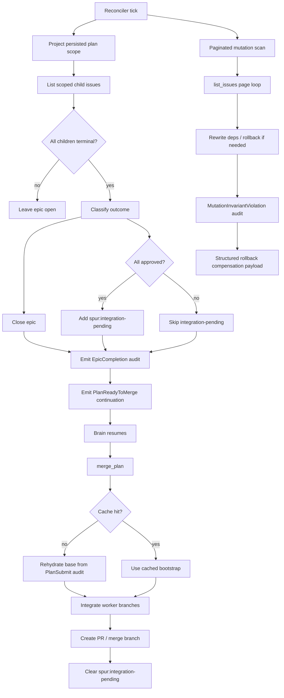

# E2E Closure Hardening — v0d Implementation Plan

> **For agentic workers:** REQUIRED SUB-SKILL: Use superpowers:subagent-driven-development (recommended) or superpowers:executing-plans to implement this plan task-by-task. Steps use checkbox (`- [ ]`) syntax for tracking.

**Goal:** Ship v0d only: durable epic closure, audit-backed merge/diff recovery, paginated mutation scans, structured rollback compensation audit, and cache-discipline hardening on top of the v0c authority flip. v0c is a prerequisite; v0e automation/retirement is explicitly out of scope.

**Architecture:** v0d layers on the persisted-plan projector, durable markers, and restart recovery that v0c owns. The reconciler becomes the durable closer of persisted epics, `PlanReadyToMerge` moves from `run_plan` lifecycle projection to durable projection, `merge_plan`/`get_task_diff` stop trusting RAM-only bootstrap fields, mutation scans stop truncating at `ISSUE_SCAN_LIMIT`, and rollback breadcrumbs gain enough structure to explain what compensation actually happened.

**Tech Stack:** Rust 2021, tokio, serde/serde_json, existing `git` CLI helpers in `crates/spur-mcp/src/server.rs`, beads `br`/`bv` via `spur-pm`, optional `sqlite3` in high-cardinality integration tests, no new transport and no full diff persistence in beads.

**Source spec:** `docs/superpowers/specs/2026-04-21-e2e-closure-design.md` rev 1 / commit `af0779a`. v0d scope is `930-958`. Supporting contracts: epic completion rule `614-635`, merge/diff recovery `637-656`, plan bootstrap contract `820-829`, phase-gap mapping `842-852`.


---

## Scope Guardrails

- v0d assumes v0c has already shipped persisted-plan projection, durable worker-state markers, and restart recovery. Do not re-open v0c authority-flip design in this plan.
- Do not pull v0e work forward. Auto-merge, PR retirement UX, and final legacy-path deletion stay with the sibling v0e delegation.
- Do not invent a second audit store. All new recovery data stays on the existing `[[spur-audit v1]]` surface.
- Do not persist full diff text in beads. Latest-attempt diff recovery is `git diff <base>..<worker_branch>` on cache miss; historical attempts remain summary-only exactly as the spec allows.
- Current line references below are pinned to the codebase at plan-writing time. Re-pin them after merging the sibling v0c work if that landing shifts the same files.

## Resolved Design Constraints

- `EpicCompletion` should be a first-class audit sentinel, not an overloaded `PlanCompleted` event, because it must survive restart and be queryable from beads comments.
- `spur:integration-pending` is an epic label, not a task label. It marks downstream integration work after the operational plan is already closed.
- Merge bootstrap prefers OID when present and falls back to the branch ref when the branch still exists; this satisfies the spec’s “OID preference” without losing human readability.
- Cache discipline is solved by refreshing persisted plans from durable state on read paths, not by trying to make `active_plans` perfectly immortal.
- Mutation scan correctness matters more than scan optimality. The v0d fix closes truncation first; adapter-level efficiency improvements can follow later without changing the public shape again.

## File Map

| File | Responsibility in v0d |
|---|---|
| `crates/spur-mcp/src/plan/audit_sentinel.rs` | Add `EpicCompletion`, base bootstrap fields, `OpDescription`, enriched rollback payload |
| `crates/spur-mcp/src/plan/labels.rs` | Add `INTEGRATION_PENDING` constant and parser coverage |
| `crates/spur-mcp/src/plan/reconciler.rs` | Detect terminal persisted plans, close epics, add label, emit audit + continuation |
| `crates/spur-mcp/src/plan/mod.rs` | Carry `base_snapshot_oid`, stop treating `run_plan` as the `PlanReadyToMerge` authority |
| `crates/spur-mcp/src/plan/mutation_executor.rs` | Replace truncating scans, collect rollback op results, keep retry-safe mutation failure semantics |
| `crates/spur-mcp/src/plan/signal_watcher.rs` | Keep retry eligibility tied to `signal_processed` rather than rollback-failure comments |
| `crates/spur-mcp/src/server.rs` | Snapshot branch+OID, emit richer `PlanSubmit`, rehydrate on cache miss, clear integration label, add test hook |
| `crates/spur-pm/src/types.rs` | Add `IssueFilter.offset` pagination field |
| `crates/spur-pm/src/adapter.rs` | Preserve pagination surface in the issue-tracker trait |
| `crates/spur-pm/src/service.rs` | Pass pagination through `PmService::list_issues` |
| `crates/spur-pm/src/beads.rs` | Implement offset-aware slicing for beads-backed list calls |
| `crates/spur-pm/src/github.rs` | Implement offset-aware slicing for GitHub-backed list calls |
| `crates/spur-mcp/tests/epic_completion.rs` | Acceptance tests `T-v0d-1` and `T-v0d-2` |
| `crates/spur-mcp/tests/merge_plan_restart_recovery.rs` | Acceptance test `T-v0d-3` |
| `crates/spur-mcp/tests/get_task_diff_restart_recovery.rs` | Acceptance test `T-v0d-4` |
| `crates/spur-mcp/tests/mutation_pagination.rs` | Acceptance test `T-v0d-5` |
| `crates/spur-mcp/tests/mutation_rollback_compensation.rs` | Acceptance test `T-v0d-6` |
| `crates/spur-mcp/tests/plan_cache_projection.rs` | Cache invalidation discipline harness |

## Acceptance Map

| Acceptance | Task | Test target | Notes |
|---|---|---|---|
| `T-v0d-1` epic closes when all child tasks are terminal | Task 30 | `crates/spur-mcp/tests/epic_completion.rs` | Covers close + `EpicCompletion` audit |
| `T-v0d-2` all-approved epic still yields `PlanReadyToMerge` | Task 31 | `crates/spur-mcp/tests/epic_completion.rs` | Covers continuation + `spur:integration-pending` |
| `T-v0d-3` `merge_plan` works after restart on a persisted plan | Task 32 | `crates/spur-mcp/tests/merge_plan_restart_recovery.rs` | Explicit cache miss path |
| `T-v0d-4` `get_task_diff` works after restart for the latest attempt | Task 33 | `crates/spur-mcp/tests/get_task_diff_restart_recovery.rs` | Uses `Completion.worker_branch` + persisted base |
| `T-v0d-5` mutation scans paginate past 10k issues | Task 34 | `crates/spur-mcp/tests/mutation_pagination.rs` | No `ISSUE_SCAN_LIMIT` truncation allowed |
| `T-v0d-6` rollback audit payload enumerates succeeded/failed compensations | Task 35 | `crates/spur-mcp/tests/mutation_rollback_compensation.rs` | Reads sentinel comments back through beads |

## Dependency Spine

- Tasks 1-2 are pure scaffolding and unblock every later audit/label task.
- Tasks 3-7 are the operational epic-closure track; Task 7 removes the old `PlanReadyToMerge` authority only after Task 6 re-emits it durably.
- Tasks 8-11 harden the bootstrap payload before any cache-miss recovery work.
- Tasks 12-17 consume the richer bootstrap and build cache-miss recovery for merge/diff reads.
- Tasks 18-22 are self-contained pagination work across `spur-pm` and `mutation_executor`.
- Tasks 23-26 extend rollback breadcrumbs and lock in retry-safe signal semantics.
- Tasks 27-29 harden server-side cache refresh and should land before the restart-oriented acceptance tests.
- Tasks 30-35 are the terminal proof layer and should be the last six commits in the implementation stack.

---
## Task 1: Scaffold `AuditSentinelKind::EpicCompletion`
**Files:**
- Modify: `crates/spur-mcp/src/plan/audit_sentinel.rs:15-95` (`AuditSentinelKind`, `kind_str`)
- Modify: `crates/spur-mcp/tests/audit_sentinel_round_trip.rs:45-71` (variant matrix)
- [ ] **Step 1: Add failing round-trip coverage for the new sentinel**

Append to `crates/spur-mcp/src/plan/audit_sentinel.rs` test module:
```rust
#[derive(Debug, Clone, Copy, PartialEq, Eq, Serialize, Deserialize)]
#[serde(rename_all = "snake_case")]
pub enum EpicCompletionOutcome {
    AllApproved,
    TerminalWithFailures,
}

#[test]
fn epic_completion_variant_round_trips() {
    let kind = AuditSentinelKind::EpicCompletion {
        outcome: EpicCompletionOutcome::AllApproved,
        plan_id: "P1".into(),
        epic_id: "bd-epic-1".into(),
    };
    let encoded = encode_comment(&kind);
    let parsed = parse_comment(&encoded).unwrap().unwrap();
    assert_eq!(parsed, kind);
    assert_eq!(parsed.kind_str(), "epic-completion");
}
```

Also extend `crates/spur-mcp/tests/audit_sentinel_round_trip.rs` `variants` with:
```rust
AuditSentinelKind::EpicCompletion {
    outcome: spur_mcp::plan::audit_sentinel::EpicCompletionOutcome::AllApproved,
    plan_id: "P1".into(),
    epic_id: id.clone(),
},
```
- [ ] **Step 2: Run the targeted tests and expect a compile failure**
Run: `cargo test -p spur-mcp --lib audit_sentinel::tests::epic_completion_variant_round_trips`
Run: `cargo test -p spur-mcp --test audit_sentinel_round_trip`
Expected: compile failure because `EpicCompletion` and `EpicCompletionOutcome` do not exist yet.
- [ ] **Step 3: Add the enum + serde tag**

In `crates/spur-mcp/src/plan/audit_sentinel.rs`, add `EpicCompletionOutcome` above `AuditSentinelKind`, then add:
```rust
EpicCompletion {
    outcome: EpicCompletionOutcome,
    plan_id: String,
    epic_id: String,
},
```

and extend `kind_str()` with:
```rust
Self::EpicCompletion { .. } => "epic-completion",
```
- [ ] **Step 4: Re-run the tests**
Run: `cargo test -p spur-mcp --lib audit_sentinel::tests::epic_completion_variant_round_trips`
Run: `cargo test -p spur-mcp --test audit_sentinel_round_trip`
Expected: both pass.
- [ ] **Step 5: Commit**

```bash
git add crates/spur-mcp/src/plan/audit_sentinel.rs crates/spur-mcp/tests/audit_sentinel_round_trip.rs
git commit -m "test(spur-mcp): v0d.1 cover epic-completion sentinel"
```
---
## Task 2: Add `spur:integration-pending` label scaffolding
**Files:**
- Modify: `crates/spur-mcp/src/plan/labels.rs:56-68` (label constants and prefix helpers)
- [ ] **Step 1: Add failing label coverage**

Append to `crates/spur-mcp/src/plan/labels.rs` tests:
```rust
#[test]
fn integration_pending_label_is_br_legal() {
    assert_eq!(INTEGRATION_PENDING, "spur:integration-pending");
    assert!(INTEGRATION_PENDING
        .chars()
        .all(|c| c.is_ascii_alphanumeric() || matches!(c, '-' | '_' | ':')));
}
```
- [ ] **Step 2: Run the label tests and expect failure**
Run: `cargo test -p spur-mcp --lib labels::tests::integration_pending_label_is_br_legal`
Expected: compile failure because `INTEGRATION_PENDING` is undefined.
- [ ] **Step 3: Add the constant**

Add this constant beside `PLAN_COMPLETE` in `crates/spur-mcp/src/plan/labels.rs`:
```rust
pub const INTEGRATION_PENDING: &str = "spur:integration-pending";
```

Update the constructor/parsers test list so this constant is validated with the rest of the vocabulary.
- [ ] **Step 4: Re-run the test**
Run: `cargo test -p spur-mcp --lib labels::tests::integration_pending_label_is_br_legal`
Expected: pass.
- [ ] **Step 5: Commit**

```bash
git add crates/spur-mcp/src/plan/labels.rs
git commit -m "feat(spur-mcp): v0d.2 add integration-pending label"
```
---
## Task 3: Add a pure epic-completion classifier for projected children
**Files:**
- Modify: `crates/spur-mcp/src/plan/reconciler.rs:109-185` (`tick_once`, helper region)
- Modify: `crates/spur-mcp/src/plan/reconciler.rs:188-250` (unit tests)
- [ ] **Step 1: Add failing unit tests for the projected decision**

Append to `crates/spur-mcp/src/plan/reconciler.rs` tests:
```rust
fn summary(id: &str, status: &str) -> spur_pm::IssueSummary {
    spur_pm::IssueSummary {
        id: id.into(),
        source: spur_pm::PmSource::Beads,
        title: id.into(),
        status: status.into(),
        labels: vec![],
        url: format!("https://example.invalid/{id}"),
        priority: None,
        issue_type: Some("task".into()),
        assignee: None,
    }
}

#[test]
fn classify_epic_completion_reports_all_approved() {
    let children = vec![summary("bd-1", "closed"), summary("bd-2", "closed")];
    let outcome = super::classify_epic_completion(&children, "closed").expect("terminal");
    assert_eq!(
        outcome.audit_outcome,
        crate::plan::audit_sentinel::EpicCompletionOutcome::AllApproved
    );
    assert!(outcome.add_integration_pending);
}

#[test]
fn classify_epic_completion_reports_terminal_failures() {
    let mut rejected = summary("bd-2", "closed");
    rejected.labels.push("rejected".into());
    let children = vec![summary("bd-1", "closed"), rejected];
    let outcome = super::classify_epic_completion(&children, "closed").expect("terminal");
    assert_eq!(
        outcome.audit_outcome,
        crate::plan::audit_sentinel::EpicCompletionOutcome::TerminalWithFailures
    );
    assert!(!outcome.add_integration_pending);
}
```
- [ ] **Step 2: Run the targeted unit tests**
Run: `cargo test -p spur-mcp --lib reconciler::tests::classify_epic_completion_reports_all_approved`
Expected: compile failure because the classifier helper does not exist.
- [ ] **Step 3: Add the pure helper**

In `crates/spur-mcp/src/plan/reconciler.rs`, add a small helper struct such as `ProjectedEpicCompletion` and a pure function that:

1. returns `None` if any scoped child is still non-terminal in beads
2. returns `AllApproved` only when every child is closed and none project to rejected/failed/cancelled
3. requests `spur:integration-pending` only for the all-approved case

Keep this helper pure so Task 5 can unit-test it independently of PM I/O.
- [ ] **Step 4: Re-run the unit tests**
Run: `cargo test -p spur-mcp --lib reconciler::tests::classify_epic_completion_reports_all_approved`
Run: `cargo test -p spur-mcp --lib reconciler::tests::classify_epic_completion_reports_terminal_failures`
Expected: both pass.
- [ ] **Step 5: Commit**

```bash
git add crates/spur-mcp/src/plan/reconciler.rs
git commit -m "test(spur-mcp): v0d.3 pin epic completion classification"
```
---
## Task 4: Add an `emit_epic_completion_audit` helper
**Files:**
- Modify: `crates/spur-mcp/src/plan/mod.rs:605-726` (audit emission helpers)
- Modify: `crates/spur-mcp/tests/plan_audit_coverage.rs:1-225` (coverage matrix)
- [ ] **Step 1: Add failing audit coverage**

Extend `crates/spur-mcp/tests/plan_audit_coverage.rs` with a new assertion path that writes an `EpicCompletion` sentinel on an epic and reads it back through `collect_sentinels`.
- [ ] **Step 2: Run the coverage test and expect failure**
Run: `cargo test -p spur-mcp --test plan_audit_coverage -- --nocapture`
Expected: failure because there is no helper for emitting `EpicCompletion`.
- [ ] **Step 3: Add the helper**

Append this helper beside the other audit emitters in `crates/spur-mcp/src/plan/mod.rs`:
```rust
pub async fn emit_epic_completion_audit(
    adv: &dyn spur_pm::BeadsAdvanced,
    epic_id: &str,
    plan_id: &str,
    outcome: crate::plan::audit_sentinel::EpicCompletionOutcome,
) {
    let kind = crate::plan::audit_sentinel::AuditSentinelKind::EpicCompletion {
        outcome,
        plan_id: plan_id.to_string(),
        epic_id: epic_id.to_string(),
    };
    let body = crate::plan::audit_sentinel::encode_comment(&kind);
    if let Err(error) = adv.add_comment(epic_id, &body).await {
        warn!(
            target: "spur.audit.emit_failure",
            kind = "epic_completion",
            epic_id = %epic_id,
            plan_id = %plan_id,
            "EpicCompletion audit comment emission failed: {error}"
        );
    }
}
```
- [ ] **Step 4: Re-run the coverage test**
Run: `cargo test -p spur-mcp --test plan_audit_coverage -- --nocapture`
Expected: pass with the new sentinel included.
- [ ] **Step 5: Commit**

```bash
git add crates/spur-mcp/src/plan/mod.rs crates/spur-mcp/tests/plan_audit_coverage.rs
git commit -m "feat(spur-mcp): v0d.4 add epic completion audit helper"
```
---
## Task 5: Auto-close persisted epics when every scoped child is terminal
**Files:**
- Modify: `crates/spur-mcp/src/plan/reconciler.rs:43-115` (`Reconciler`, `tick_once`)
- Modify: `crates/spur-mcp/tests/reconciler_tick.rs:1-220` (integration fixture)
- [ ] **Step 1: Add a failing integration test on the existing reconciler harness**

Create a new test in `crates/spur-mcp/tests/reconciler_tick.rs` that:

1. creates an epic plus two child tasks
2. labels the epic and children with the same `spur:plan-id:<id>`
3. marks the epic with `spur:plan-complete`
4. closes both children in beads
5. runs one `reconciler.tick_once()` equivalent
6. asserts the epic is now closed and the epic comment stream contains `EpicCompletion`

Use the existing `run_br`, `run_br_json`, `parse_id_from_create`, and `label_issue` helpers already in that file.
- [ ] **Step 2: Run the integration test and expect failure**
Run: `cargo test -p spur-mcp --test reconciler_tick epic_closes_when_scoped_children_terminal -- --nocapture`
Expected: failure because `tick_once()` currently only observes ready tasks.
- [ ] **Step 3: Extend `tick_once()`**

In `crates/spur-mcp/src/plan/reconciler.rs`, add an epic-reconciliation phase before the ready-task observation phase:

1. list open epics carrying `spur:plan-complete`
2. parse `spur:plan-id:<id>`
3. list scoped children via `IssueFilter { labels: vec![plan_id_label], .. }`
4. classify the projected outcome with the helper from Task 3
5. close the epic via `IssueUpdate { status: Some(pm.closed_status().to_string()), .. }`
6. add `spur:integration-pending` only on the all-approved path
7. emit `EpicCompletion` via the helper from Task 4

Keep the close path idempotent: if the epic is already closed and already bears the right label state, the reconciler should not churn comments or labels every tick.
- [ ] **Step 4: Re-run the new integration test**
Run: `cargo test -p spur-mcp --test reconciler_tick epic_closes_when_scoped_children_terminal -- --nocapture`
Expected: pass.
- [ ] **Step 5: Commit**

```bash
git add crates/spur-mcp/src/plan/reconciler.rs crates/spur-mcp/tests/reconciler_tick.rs
git commit -m "feat(spur-mcp): v0d.5 auto-close persisted epics"
```
---
## Task 6: Re-emit `PlanReadyToMerge` from durable projected state
**Files:**
- Modify: `crates/spur-mcp/src/plan/reconciler.rs:43-115` (`Reconciler` state)
- Modify: `crates/spur-mcp/src/server.rs:1181-1204` (reconciler spawn wiring)
- Modify: `crates/spur-mcp/tests/reconciler_tick.rs:1-220` (continuation assertion)
- [ ] **Step 1: Add a failing continuation test**

Extend `crates/spur-mcp/tests/reconciler_tick.rs` with a capture sink similar to `submit_plan_persist.rs` and assert that an all-approved projected close emits `SpurEventBody::PlanReadyToMerge { plan_id }`.
- [ ] **Step 2: Run the targeted integration test**
Run: `cargo test -p spur-mcp --test reconciler_tick all_approved_epic_emits_plan_ready_to_merge -- --nocapture`
Expected: failure because `Reconciler` has no event sink and emits no continuation today.
- [ ] **Step 3: Thread the event sink into the reconciler**

Update `Reconciler` to carry `event_sink: Option<Arc<dyn crate::events::McpEventSink>>` and wire it from `McpCallbackServer::start()`. The spawn site should become:
```rust
let event_sink = self.event_sink.clone();
let handle = AbortOnDropHandle::new(tokio::spawn(async move {
    let reconciler = Reconciler::new(
        ReconcilerConfig::default(),
        pm,
        fast,
        None,
        event_sink,
    );
    reconciler.run(cancel_rx).await;
}));
```

Inside the all-approved close path, emit `SpurEventBody::PlanReadyToMerge { plan_id }` after the epic update + audit write succeed.
- [ ] **Step 4: Re-run the continuation test**
Run: `cargo test -p spur-mcp --test reconciler_tick all_approved_epic_emits_plan_ready_to_merge -- --nocapture`
Expected: pass.
- [ ] **Step 5: Commit**

```bash
git add crates/spur-mcp/src/plan/reconciler.rs crates/spur-mcp/src/server.rs crates/spur-mcp/tests/reconciler_tick.rs
git commit -m "feat(spur-mcp): v0d.6 project plan-ready-to-merge"
```
---
## Task 7: Remove `run_plan` as the `PlanReadyToMerge` authority
**Files:**
- Modify: `crates/spur-mcp/src/plan/mod.rs:1012-1079` (terminal event emission)
- Modify: `crates/spur-mcp/tests/submit_plan_persist.rs:153-228`
- Modify: `crates/spur-mcp/tests/plan_cancelled_task_semantics.rs:221-301`
- [ ] **Step 1: Add failing tests that assert the new ownership split**

Adjust the current plan lifecycle tests so they still expect `PlanCompleted`, but only expect `PlanReadyToMerge` when driven through the durable reconciler projection path, not directly from `run_plan`.
- [ ] **Step 2: Run the narrow unit and integration tests**
Run: `cargo test -p spur-mcp --test submit_plan_persist run_plan_emits_plan_completed_on_terminal_state -- --nocapture`
Run: `cargo test -p spur-mcp --test plan_cancelled_task_semantics -- --nocapture`
Expected: failures because `run_plan` still emits `PlanReadyToMerge` directly.
- [ ] **Step 3: Drop the old event emission**

Reduce the `run_plan` tail block in `crates/spur-mcp/src/plan/mod.rs` to:
```rust
if let Some(sink) = &event_sink {
    sink.emit(spur_acp::SpurEventBody::PlanCompleted {
        plan_id: plan_id.clone(),
        approved: approved_count,
        rejected: rejected_count,
        failed: failed_count,
        cancelled: cancelled_count,
    });
}
```

`PlanReadyToMerge` is now emitted only from Task 6’s durable projection path.
- [ ] **Step 4: Re-run the tests**
Run: `cargo test -p spur-mcp --test submit_plan_persist run_plan_emits_plan_completed_on_terminal_state -- --nocapture`
Run: `cargo test -p spur-mcp --test plan_cancelled_task_semantics -- --nocapture`
Expected: pass with the updated expectations.
- [ ] **Step 5: Commit**

```bash
git add crates/spur-mcp/src/plan/mod.rs crates/spur-mcp/tests/submit_plan_persist.rs crates/spur-mcp/tests/plan_cancelled_task_semantics.rs
git commit -m "refactor(spur-mcp): v0d.7 stop run_plan owning ready-to-merge"
```
---
## Task 8: Extend `PlanSubmit` audit payload with base snapshot fields
**Files:**
- Modify: `crates/spur-mcp/src/plan/audit_sentinel.rs:19-23` (`PlanSubmit`)
- Modify: `crates/spur-mcp/tests/audit_sentinel_round_trip.rs:45-71`
- Modify: `crates/spur-mcp/tests/submit_plan_audit.rs:97-134`
- [ ] **Step 1: Add failing round-trip coverage for the bootstrap fields**

Update the `PlanSubmit` cases to include:
```rust
AuditSentinelKind::PlanSubmit {
    plan_id: "P1".into(),
    epic_issue_id: id.clone(),
    task_ids: vec!["bd-a".into(), "bd-b".into()],
    base_snapshot_branch: Some("spur/brain-snapshot-test".into()),
    base_snapshot_oid: Some("0123456789abcdef0123456789abcdef01234567".into()),
}
```

In `submit_plan_audit.rs`, assert the parsed `PlanSubmit` sentinel carries the same branch/OID pair.
- [ ] **Step 2: Run the tests and expect failure**
Run: `cargo test -p spur-mcp --test audit_sentinel_round_trip`
Run: `cargo test -p spur-mcp --test submit_plan_audit -- --nocapture`
Expected: compile failure because `PlanSubmit` does not carry these fields yet.
- [ ] **Step 3: Extend the variant**

Add these fields to `AuditSentinelKind::PlanSubmit` in `crates/spur-mcp/src/plan/audit_sentinel.rs`:
```rust
#[serde(default)]
base_snapshot_branch: Option<String>,
#[serde(default)]
base_snapshot_oid: Option<String>,
```

Keep both `#[serde(default)]` so older comments still parse.
- [ ] **Step 4: Re-run the tests**
Run: `cargo test -p spur-mcp --test audit_sentinel_round_trip`
Run: `cargo test -p spur-mcp --test submit_plan_audit -- --nocapture`
Expected: pass.
- [ ] **Step 5: Commit**

```bash
git add crates/spur-mcp/src/plan/audit_sentinel.rs crates/spur-mcp/tests/audit_sentinel_round_trip.rs crates/spur-mcp/tests/submit_plan_audit.rs
git commit -m "test(spur-mcp): v0d.8 pin bootstrap base snapshot fields"
```
---
## Task 9: Resolve the base snapshot branch to an OID at submit time
**Files:**
- Modify: `crates/spur-mcp/src/server.rs:690-702` (`snapshot_plan_base`)
- Modify: `crates/spur-mcp/src/server.rs:704-727` (`run_git_capture`)
- Modify: `crates/spur-mcp/src/server.rs:3079-3274` (`merge_plan_tests` repo helper)
- [ ] **Step 1: Add a failing unit test for snapshot OID capture**

Add a server-local test that seeds a repo, creates `spur/brain-snapshot-test`, calls `snapshot_plan_base(Some(&repo_root))`, and asserts the returned structure includes both the branch name and `git rev-parse --verify` OID.
- [ ] **Step 2: Run the server unit test**
Run: `cargo test -p spur-mcp --lib merge_plan_tests::snapshot_plan_base_captures_oid`
Expected: compile failure because `snapshot_plan_base()` still returns `Option<String>`.
- [ ] **Step 3: Introduce a small bootstrap type**

Near `snapshot_plan_base()` in `crates/spur-mcp/src/server.rs`, add:
```rust
#[derive(Debug, Clone, PartialEq, Eq, Default)]
struct PlanBaseSnapshot {
    branch: Option<String>,
    oid: Option<String>,
}
```

Then change `snapshot_plan_base()` to return `Result<PlanBaseSnapshot, String>` and resolve the OID with:
```rust
let oid = match branch.as_deref() {
    Some(branch) => Some(run_git_capture(&root, None, &["rev-parse", "--verify", branch]).await?),
    None => None,
};
```
- [ ] **Step 4: Re-run the test**
Run: `cargo test -p spur-mcp --lib merge_plan_tests::snapshot_plan_base_captures_oid`
Expected: pass.
- [ ] **Step 5: Commit**

```bash
git add crates/spur-mcp/src/server.rs
git commit -m "feat(spur-mcp): v0d.9 capture base snapshot oid"
```
---
## Task 10: Carry branch + OID in `PlanState` and `PlanSubmit` emission
**Files:**
- Modify: `crates/spur-mcp/src/plan/mod.rs:154-173` (`PlanState`)
- Modify: `crates/spur-mcp/src/server.rs:417-443` (`emit_plan_submit_audit`)
- Modify: `crates/spur-mcp/src/server.rs:2452-2464` (`handle_submit_plan`)
- Modify: `crates/spur-mcp/src/server.rs:2660-2675` (`handle_execute_epic`)
- [ ] **Step 1: Add a failing compile-only state threading test**

Update any direct `PlanState` constructors in `crates/spur-mcp/src/plan/mod.rs` tests and `crates/spur-mcp/tests/*.rs` to include a `base_snapshot_oid: None` field so the compiler points out every constructor that must be updated.
- [ ] **Step 2: Run the focused crate tests**
Run: `cargo test -p spur-mcp --lib build_plan_status_points_to_merge_plan_before_integration`
Expected: compile failure because `PlanState` is missing the new field.
- [ ] **Step 3: Add the field and thread it through**

In `crates/spur-mcp/src/plan/mod.rs`, add:
```rust
pub base_snapshot_oid: Option<String>,
```

beside `base_snapshot_branch`.

In `crates/spur-mcp/src/server.rs`, change `emit_plan_submit_audit()` to accept the richer snapshot and populate the new `PlanSubmit` fields. Thread `base_snapshot.branch.clone()` and `base_snapshot.oid.clone()` into both plan-creation paths when building `PlanState`.
- [ ] **Step 4: Re-run the focused tests**
Run: `cargo test -p spur-mcp --lib build_plan_status_points_to_merge_plan_before_integration`
Run: `cargo test -p spur-mcp --test submit_plan_audit -- --nocapture`
Expected: pass.
- [ ] **Step 5: Commit**

```bash
git add crates/spur-mcp/src/plan/mod.rs crates/spur-mcp/src/server.rs crates/spur-mcp/tests
git commit -m "feat(spur-mcp): v0d.10 persist base snapshot in bootstrap"
```
---
## Task 11: Lock in the richer bootstrap contract on the live beads path
**Files:**
- Modify: `crates/spur-mcp/tests/submit_plan_audit.rs:1-134`
- Modify: `crates/spur-mcp/tests/plan_audit_coverage.rs:1-225`
- [ ] **Step 1: Add an integration assertion for the new `PlanSubmit` payload**

Extend `submit_plan_audit.rs` so the found sentinel must match:

1. `plan_id`
2. `epic_issue_id`
3. `task_ids`
4. `base_snapshot_branch`
5. `base_snapshot_oid`

Reuse `audit_sentinel::parse_comment()` and compare all five values directly.
- [ ] **Step 2: Run the integration tests**
Run: `cargo test -p spur-mcp --test submit_plan_audit -- --nocapture`
Run: `cargo test -p spur-mcp --test plan_audit_coverage -- --nocapture`
Expected: pass and prove the live comments carry the richer bootstrap contract.
- [ ] **Step 3: Commit**

```bash
git add crates/spur-mcp/tests/submit_plan_audit.rs crates/spur-mcp/tests/plan_audit_coverage.rs
git commit -m "test(spur-mcp): v0d.11 verify bootstrap audit payload"
```
---
## Task 12: Add a failing `merge_plan` cache-miss recovery test
**Files:**
- Modify: `crates/spur-mcp/src/server.rs:3074-3274` (`merge_plan_tests`)
- [ ] **Step 1: Add a new restart-recovery test in `merge_plan_tests`**

Inside `crates/spur-mcp/src/server.rs` `mod merge_plan_tests`, create a test that:

1. seeds a repo and worker branches
2. writes a persisted epic + `PlanSubmit` sentinel containing base branch/OID
3. builds an approved plan once, then removes its `active_plans` entry
4. calls `handle_merge_plan(Value::Null, json!({ "plan_id": plan_id }))`
5. expects success using only durable recovery data
- [ ] **Step 2: Run the targeted unit test**
Run: `cargo test -p spur-mcp --lib merge_plan_tests::merge_plan_rehydrates_when_cache_missing -- --nocapture`
Expected: failure because `handle_merge_plan()` still rejects unknown cache entries.
- [ ] **Step 3: Commit the failing test**

```bash
git add crates/spur-mcp/src/server.rs
git commit -m "test(spur-mcp): v0d.12 pin merge_plan cache-miss recovery"
```
---
## Task 13: Rehydrate `merge_plan` from the persisted bootstrap on cache miss
**Files:**
- Modify: `crates/spur-mcp/src/server.rs:2106-2227` (`handle_merge_plan`)
- Modify: `crates/spur-mcp/src/server.rs:417-443` (`emit_plan_submit_audit` readers live nearby)
- [ ] **Step 1: Add a durable bootstrap reader**

Add a helper in `crates/spur-mcp/src/server.rs` that:

1. finds the epic for `plan_id` via the v0c persisted-plan projection
2. reads the epic comments through `PmService::advanced().list_comments(...)`
3. selects the latest matching `PlanSubmit` sentinel
4. prefers `base_snapshot_oid` when present, otherwise falls back to `base_snapshot_branch`

This helper must return a structured bootstrap object, not raw JSON.
- [ ] **Step 2: Remove the hard dependency on `active_plans`**

Replace the current early-exit path at `crates/spur-mcp/src/server.rs:2122-2128` with:

1. try cache
2. on cache miss, project/rebuild the persisted plan state from v0c durable sources
3. cache the rebuilt state
4. continue with the merge flow

The `plan '{plan_id}' has no captured base snapshot` error at `2160-2168` should now only fire when both audit fields are absent.
- [ ] **Step 3: Run the targeted test**
Run: `cargo test -p spur-mcp --lib merge_plan_tests::merge_plan_rehydrates_when_cache_missing -- --nocapture`
Expected: pass.
- [ ] **Step 4: Commit**

```bash
git add crates/spur-mcp/src/server.rs
git commit -m "feat(spur-mcp): v0d.13 rehydrate merge_plan from audit"
```
---
## Task 14: Clear `spur:integration-pending` after successful merge
**Files:**
- Modify: `crates/spur-mcp/src/server.rs:2209-2227` (`handle_merge_plan` tail)
- Modify: `crates/spur-mcp/src/plan/labels.rs:56-63`
- [ ] **Step 1: Add a failing merge-success label test**

Extend the `merge_plan` test harness so a successful merge against an epic carrying `spur:integration-pending` asserts that the label is removed after `handle_merge_plan()` returns success.
- [ ] **Step 2: Run the targeted test**
Run: `cargo test -p spur-mcp --lib merge_plan_tests::merge_plan_clears_integration_pending_on_success -- --nocapture`
Expected: failure because merge success leaves the label untouched today.
- [ ] **Step 3: Remove the label on success**

After a successful merge state is written, remove the epic label:
```rust
if let crate::plan::PlanMergeState::Succeeded { .. } = &state.merge_state {
    if let Some(epic_id) = state.epic_id.clone() {
        pm.update_issue(
            &epic_id,
            spur_pm::IssueUpdate {
                remove_labels: vec![crate::plan::labels::INTEGRATION_PENDING.to_string()],
                ..Default::default()
            },
        )
        .await
        .map_err(|e| format!("failed to clear integration-pending on epic '{epic_id}': {e}"))?;
    }
}
```
- [ ] **Step 4: Re-run the test**
Run: `cargo test -p spur-mcp --lib merge_plan_tests::merge_plan_clears_integration_pending_on_success -- --nocapture`
Expected: pass.
- [ ] **Step 5: Commit**

```bash
git add crates/spur-mcp/src/server.rs
git commit -m "feat(spur-mcp): v0d.14 clear integration-pending after merge"
```
---
## Task 15: Add a failing `get_task_diff` cache-miss recovery test
**Files:**
- Modify: `crates/spur-mcp/src/server.rs:2790-2895` (`handle_get_task_diff`)
- [ ] **Step 1: Add a restart-style test**

Create a server-local test that:

1. seeds a repo with a base branch and a worker branch
2. persists a `Completion` sentinel with `worker_branch` on the task issue
3. persists a `PlanSubmit` sentinel with the base branch/OID on the epic
4. clears `active_plans`
5. calls `handle_get_task_diff(&json!({ "plan_id": ..., "task_id": ... }))`
6. asserts the returned JSON includes `worker_branch`, `summary`, and a `diff` string
- [ ] **Step 2: Run the targeted unit test**
Run: `cargo test -p spur-mcp --lib get_task_diff_rehydrates_latest_attempt_when_cache_missing -- --nocapture`
Expected: failure because `handle_get_task_diff()` rejects unknown cached plans.
- [ ] **Step 3: Commit the failing test**

```bash
git add crates/spur-mcp/src/server.rs
git commit -m "test(spur-mcp): v0d.15 pin get_task_diff recovery"
```
---
## Task 16: Recompute the latest diff from `Completion.worker_branch` + persisted base
**Files:**
- Modify: `crates/spur-mcp/src/server.rs:2790-2895` (`handle_get_task_diff`)
- Modify: `crates/spur-mcp/src/server.rs:704-727` (`run_git_capture`)
- [ ] **Step 1: Add a focused helper for diff text**

In `crates/spur-mcp/src/server.rs`, add:
```rust
async fn diff_text_from_branches(
    repo_root: &std::path::Path,
    base_ref: &str,
    worker_branch: &str,
) -> Result<String, String> {
    let range = format!("{base_ref}..{worker_branch}");
    run_git_capture(repo_root, None, &["diff", range.as_str()]).await
}
```
- [ ] **Step 2: Teach `handle_get_task_diff()` the cache-miss path**

On cache miss for the latest attempt only:

1. rehydrate the plan bootstrap (base branch/OID)
2. rehydrate the current attempt branch + summary from the latest `Completion` audit on the task issue
3. run `diff_text_from_branches()`
4. populate the same response shape used for cached latest attempts

Do not synthesize historical attempts here; Task 17 keeps those summary-only.
- [ ] **Step 3: Re-run the failing test**
Run: `cargo test -p spur-mcp --lib get_task_diff_rehydrates_latest_attempt_when_cache_missing -- --nocapture`
Expected: pass.
- [ ] **Step 4: Commit**

```bash
git add crates/spur-mcp/src/server.rs
git commit -m "feat(spur-mcp): v0d.16 rebuild latest diff from audit"
```
---
## Task 17: Preserve summary-only semantics for historical attempts
**Files:**
- Modify: `crates/spur-mcp/src/server.rs:2828-2865` (historical attempt branch)
- [ ] **Step 1: Add a targeted regression test**

Extend the `get_task_diff` unit coverage so `attempt != current_attempt` on a cache miss still returns the existing summary/branch/note response and does not try to reconstruct full diff text.
- [ ] **Step 2: Run the targeted test**
Run: `cargo test -p spur-mcp --lib get_task_diff_historical_attempts_remain_summary_only -- --nocapture`
Expected: failure if the cache-miss branch tries to rebuild historical diffs.
- [ ] **Step 3: Guard the new logic**

Keep the current early historical-attempt branch exactly as the first branch after task lookup. Only the “latest attempt” path may fall through to git diff reconstruction.
- [ ] **Step 4: Re-run the targeted test**
Run: `cargo test -p spur-mcp --lib get_task_diff_historical_attempts_remain_summary_only -- --nocapture`
Expected: pass.
- [ ] **Step 5: Commit**

```bash
git add crates/spur-mcp/src/server.rs
git commit -m "refactor(spur-mcp): v0d.17 keep historical diff summary-only"
```
---
## Task 18: Add a pagination field to `IssueFilter`
**Files:**
- Modify: `crates/spur-pm/src/types.rs:63-75` (`IssueFilter`)
- Modify: `crates/spur-pm/src/adapter.rs:5-14` (trait contract)
- [ ] **Step 1: Add a failing type-level test**

Append to `crates/spur-pm/src/types.rs` tests:
```rust
#[test]
fn issue_filter_offset_defaults_to_none() {
    let filter = super::IssueFilter::default();
    assert_eq!(filter.offset, None);
    assert_eq!(filter.limit, None);
}
```
- [ ] **Step 2: Run the spur-pm unit test**
Run: `cargo test -p spur-pm --lib types::tests::issue_filter_offset_defaults_to_none`
Expected: compile failure because `IssueFilter` has no `offset`.
- [ ] **Step 3: Extend the type**

Add this field below `limit` in `crates/spur-pm/src/types.rs`:
```rust
/// Optional zero-based offset for paginated scans.
pub offset: Option<usize>,
```

No trait signature changes are needed in `adapter.rs` because `IssueFilter` is already passed by value.
- [ ] **Step 4: Re-run the unit test**
Run: `cargo test -p spur-pm --lib types::tests::issue_filter_offset_defaults_to_none`
Expected: pass.
- [ ] **Step 5: Commit**

```bash
git add crates/spur-pm/src/types.rs crates/spur-pm/src/adapter.rs
git commit -m "test(spur-pm): v0d.18 pin issue filter pagination"
```
---
## Task 19: Pass pagination through `PmService`
**Files:**
- Modify: `crates/spur-pm/src/service.rs:127-132` (`list_issues`)
- Modify: `crates/spur-pm/src/types.rs:63-75`
- [ ] **Step 1: Add a narrow service-level regression test**

Add a compile-only test in `crates/spur-pm/src/service.rs` that constructs an `IssueFilter { offset: Some(50), limit: Some(25), ..Default::default() }` and passes it through a helper typed as `fn accepts_filter(_: IssueFilter) {}`.
- [ ] **Step 2: Run the spur-pm unit tests**
Run: `cargo test -p spur-pm --lib`
Expected: pass once the new field is part of the default/filter surface.
- [ ] **Step 3: Commit**

```bash
git add crates/spur-pm/src/service.rs crates/spur-pm/src/types.rs
git commit -m "feat(spur-pm): v0d.19 add offset pagination surface"
```
---
## Task 20: Implement offset-aware slicing in the beads and GitHub adapters
**Files:**
- Modify: `crates/spur-pm/src/beads.rs:538-587` (`list_issues`)
- Modify: `crates/spur-pm/src/github.rs:236-291` (`list_issues`)
- [ ] **Step 1: Add adapter-level tests for slicing semantics**

Add narrow unit tests next to each adapter proving:

1. `offset = None` preserves current behavior
2. `offset = Some(n)` skips the first `n` items
3. `limit = Some(m)` still caps the returned page length

Use in-memory JSON fixtures or helper conversion code rather than calling the real CLI for these narrow tests.
- [ ] **Step 2: Run the spur-pm unit tests**
Run: `cargo test -p spur-pm --lib`
Expected: failures until both adapters honor `offset`.
- [ ] **Step 3: Implement the adapter logic**

For beads, use client-side slicing because `br list` has no native offset flag:
```rust
let requested_limit = filter.limit.unwrap_or(50);
let offset = filter.offset.unwrap_or(0);
let cli_limit = if offset == 0 { requested_limit } else { 0 };
args.push("--limit".into());
args.push(cli_limit.to_string());
```

Parse the full result set, then `skip(offset).take(requested_limit)`.

For GitHub, over-fetch with `offset + requested_limit`, then slice in Rust after the `since` filter. This is not optimal, but it is correct and removes the truncation bug without inventing a backend-specific paging API.
- [ ] **Step 4: Re-run the spur-pm tests**
Run: `cargo test -p spur-pm --lib`
Expected: pass.
- [ ] **Step 5: Commit**

```bash
git add crates/spur-pm/src/beads.rs crates/spur-pm/src/github.rs
git commit -m "feat(spur-pm): v0d.20 paginate list_issues adapters"
```
---
## Task 21: Replace `ISSUE_SCAN_LIMIT` truncation with a page loop
**Files:**
- Modify: `crates/spur-mcp/src/plan/mutation_executor.rs:16-17` (constant rename)
- Modify: `crates/spur-mcp/src/plan/mutation_executor.rs:365-385` (`list_all_issue_ids`)
- [ ] **Step 1: Add a failing unit test for the new helper shape**

Add a narrow test around a new page-loop helper signature so the code stops compiling until `ISSUE_SCAN_LIMIT` is removed from the implementation.
- [ ] **Step 2: Replace the truncating helper**

In `crates/spur-mcp/src/plan/mutation_executor.rs`, delete the saturation warning path and replace `list_all_issue_ids()` with:
```rust
const ISSUE_SCAN_PAGE_SIZE: usize = 500;

async fn list_all_issue_ids(pm: &PmService) -> Result<Vec<String>> {
    let mut out = Vec::new();
    let mut offset = 0usize;
    loop {
        let page = pm
            .list_issues(IssueFilter {
                limit: Some(ISSUE_SCAN_PAGE_SIZE),
                offset: Some(offset),
                ..Default::default()
            })
            .await
            .context("list issues for mutation scan page")?;
        let page_len = page.len();
        out.extend(page.into_iter().map(|issue| issue.id));
        if page_len < ISSUE_SCAN_PAGE_SIZE {
            break;
        }
        offset += page_len;
    }
    Ok(out)
}
```
- [ ] **Step 3: Re-run the mutation executor tests**
Run: `cargo test -p spur-mcp --test mutation_split -- --nocapture`
Run: `cargo test -p spur-mcp --test mutation_acyclicity -- --nocapture`
Expected: pass and no saturation warning remains in the code.
- [ ] **Step 4: Commit**

```bash
git add crates/spur-mcp/src/plan/mutation_executor.rs
git commit -m "feat(spur-mcp): v0d.21 page mutation scans"
```
---
## Task 22: Add narrow coverage for the paginated scan helper
**Files:**
- Modify: `crates/spur-mcp/src/plan/mutation_executor.rs:365-385`
- Modify: `crates/spur-pm/src/beads.rs:538-587`
- [ ] **Step 1: Add tests that cover page boundaries**

Add helper tests that simulate:

1. exactly one full page
2. one full page plus tail page
3. empty result set

Keep these narrow; the 10k acceptance proof lands in Task 34.
- [ ] **Step 2: Run the targeted tests**
Run: `cargo test -p spur-mcp --lib mutation_executor`
Run: `cargo test -p spur-pm --lib beads`
Expected: pass.
- [ ] **Step 3: Commit**

```bash
git add crates/spur-mcp/src/plan/mutation_executor.rs crates/spur-pm/src/beads.rs
git commit -m "test(spur-mcp): v0d.22 cover paged mutation scans"
```
---
## Task 23: Extend the rollback audit payload with structured operation data
**Files:**
- Modify: `crates/spur-mcp/src/plan/audit_sentinel.rs:61-69`
- Modify: `crates/spur-mcp/tests/mutation_acyclicity.rs:1-260`
- [ ] **Step 1: Add failing round-trip coverage for the enriched payload**

In `crates/spur-mcp/src/plan/audit_sentinel.rs`, add:
```rust
#[derive(Debug, Clone, PartialEq, Eq, Serialize, Deserialize)]
pub struct OpDescription {
    pub kind: String,
    pub issue_id: String,
    #[serde(default)]
    pub depends_on_id: Option<String>,
}
```

Then add a new round-trip test using:
```rust
AuditSentinelKind::MutationInvariantViolation {
    mutation_id: "mut-V".into(),
    violation: "cycle".into(),
    rollback_status: "partial".into(),
    rollback_ops_succeeded: vec![OpDescription {
        kind: "remove_dependency".into(),
        issue_id: "bd-2".into(),
        depends_on_id: Some("bd-1".into()),
    }],
    rollback_ops_failed: vec![(
        OpDescription {
            kind: "restore_parent_status".into(),
            issue_id: "bd-1".into(),
            depends_on_id: None,
        },
        "sqlite busy".into(),
    )],
},
```
- [ ] **Step 2: Run the targeted test**
Run: `cargo test -p spur-mcp --lib audit_sentinel::tests::invariant_violation_round_trips`
Expected: compile failure because the new fields do not exist.
- [ ] **Step 3: Extend the variant**

Add these fields to `MutationInvariantViolation`:
```rust
#[serde(default)]
rollback_ops_succeeded: Vec<OpDescription>,
#[serde(default)]
rollback_ops_failed: Vec<(OpDescription, String)>,
```

Update the existing tests to compare them.
- [ ] **Step 4: Re-run the targeted test**
Run: `cargo test -p spur-mcp --lib audit_sentinel::tests::invariant_violation_round_trips`
Expected: pass.
- [ ] **Step 5: Commit**

```bash
git add crates/spur-mcp/src/plan/audit_sentinel.rs
git commit -m "test(spur-mcp): v0d.23 pin rollback audit payload"
```
---
## Task 24: Collect rollback compensation results in `mutation_executor`
**Files:**
- Modify: `crates/spur-mcp/src/plan/mutation_executor.rs:138-170`
- Modify: `crates/spur-mcp/src/plan/mutation_executor.rs:268-345` (`rollback_mutation`, helpers)
- [ ] **Step 1: Add a structured rollback report type**

In `crates/spur-mcp/src/plan/mutation_executor.rs`, add:
```rust
#[derive(Debug, Default)]
struct RollbackReport {
    succeeded: Vec<crate::plan::audit_sentinel::OpDescription>,
    failed: Vec<(crate::plan::audit_sentinel::OpDescription, String)>,
}
```
- [ ] **Step 2: Refactor `rollback_mutation()` to return the report**

Every rollback action should append an `OpDescription` on success or `(OpDescription, error)` on failure:

1. delete child issue
2. remove inter-child/downstream dependency
3. restore parent status
4. clear `spur:superseded-by:*` labels

Keep the mutation failure itself unchanged: cycle detection still aborts the mutation.
- [ ] **Step 3: Run the mutation tests**
Run: `cargo test -p spur-mcp --test mutation_acyclicity -- --nocapture`
Run: `cargo test -p spur-mcp --test mutation_write_ahead -- --nocapture`
Expected: failures until the report is threaded through.
- [ ] **Step 4: Re-run after the refactor**
Run: `cargo test -p spur-mcp --test mutation_acyclicity -- --nocapture`
Run: `cargo test -p spur-mcp --test mutation_write_ahead -- --nocapture`
Expected: pass.
- [ ] **Step 5: Commit**

```bash
git add crates/spur-mcp/src/plan/mutation_executor.rs
git commit -m "feat(spur-mcp): v0d.24 collect rollback compensation ops"
```
---
## Task 25: Emit the enriched rollback audit on both full and partial compensation
**Files:**
- Modify: `crates/spur-mcp/src/plan/mutation_executor.rs:140-170`
- Modify: `crates/spur-mcp/tests/mutation_acyclicity.rs:240-260`
- [ ] **Step 1: Update the audit write sites**

Both `MutationInvariantViolation` emission sites in `crates/spur-mcp/src/plan/mutation_executor.rs` must carry:

1. `rollback_status`
2. `rollback_ops_succeeded`
3. `rollback_ops_failed`

When rollback itself fails, emit the partial report before bailing so the audit comment still explains what compensation did happen.
- [ ] **Step 2: Strengthen `mutation_acyclicity.rs`**

Change the existing assertion to read back the sentinel and verify that:

1. `rollback_ops_succeeded` is non-empty
2. `rollback_ops_failed` is empty for the full rollback path
3. the op kinds match the expected compensation sequence
- [ ] **Step 3: Run the integration test**
Run: `cargo test -p spur-mcp --test mutation_acyclicity -- --nocapture`
Expected: pass.
- [ ] **Step 4: Commit**

```bash
git add crates/spur-mcp/src/plan/mutation_executor.rs crates/spur-mcp/tests/mutation_acyclicity.rs
git commit -m "feat(spur-mcp): v0d.25 emit enriched rollback audit"
```
---
## Task 26: Keep failed rollback paths retry-safe for signal processing
**Files:**
- Modify: `crates/spur-mcp/src/plan/signal_watcher.rs:95-168`
- Modify: `crates/spur-mcp/tests/signal_dedup.rs:1-185`
- [ ] **Step 1: Add a regression test for retry eligibility**

Add a test proving that when `apply_mutation()` returns an invariant-violation error:

1. the task does **not** receive `spur:signal-processed:*`
2. the watcher does **not** suppress the signal permanently in RAM
3. a later tick retries the signal

Use the same comment/label inspection style already present in `signal_dedup.rs`.
- [ ] **Step 2: Run the signal watcher test**
Run: `cargo test -p spur-mcp --test signal_dedup -- --nocapture`
Expected: failure if rollback failure or invariant violation accidentally marks the signal terminal.
- [ ] **Step 3: Preserve the gate**

Keep watcher eligibility tied strictly to `spur:signal-processed:*` and successful mutation commit. Do not add a rollback-failure label that would block retries; the enriched `MutationInvariantViolation` audit comment is the analytical breadcrumb for failure.
- [ ] **Step 4: Re-run the test**
Run: `cargo test -p spur-mcp --test signal_dedup -- --nocapture`
Expected: pass.
- [ ] **Step 5: Commit**

```bash
git add crates/spur-mcp/src/plan/signal_watcher.rs crates/spur-mcp/tests/signal_dedup.rs
git commit -m "test(spur-mcp): v0d.26 retry signals after rollback failure"
```
---
## Task 27: Add a generic server tool-call test hook and corruption harness
**Files:**
- Modify: `crates/spur-mcp/src/server.rs:1058-1116` (test-only helpers)
- Create: `crates/spur-mcp/tests/plan_cache_projection.rs`
- [ ] **Step 1: Add a generic `__test_call_tool` helper**

Inside `impl McpCallbackServer` in `crates/spur-mcp/src/server.rs`, add:
```rust
#[doc(hidden)]
pub async fn __test_call_tool(&self, tool_name: &str, arguments: Value) -> Value {
    let response = self
        .handle_tool_call(
            Value::Null,
            json!({
                "name": tool_name,
                "arguments": arguments,
            }),
        )
        .await;
    serde_json::to_value(&response).expect("serialize JsonRpcResponse")
}
```
- [ ] **Step 2: Write the corruption harness**

Create `crates/spur-mcp/tests/plan_cache_projection.rs` with a test that:

1. persists a plan in beads
2. primes `active_plans`
3. mutates the in-memory entry to an impossible state (`task status = approved`, bogus `worker_branch`, bogus `base_snapshot_branch`)
4. calls `get_plan_status` through `__test_call_tool`
5. asserts the returned JSON reflects the durable projection instead
- [ ] **Step 3: Run the new integration test**
Run: `cargo test -p spur-mcp --test plan_cache_projection -- --nocapture`
Expected: failure because `get_plan_status` currently trusts the cached `PlanState` blindly.
- [ ] **Step 4: Commit the failing harness**

```bash
git add crates/spur-mcp/src/server.rs crates/spur-mcp/tests/plan_cache_projection.rs
git commit -m "test(spur-mcp): v0d.27 add cache corruption harness"
```
---
## Task 28: Add a durable refresh helper for persisted plan reads
**Files:**
- Modify: `crates/spur-mcp/src/server.rs:2762-2795` (`handle_get_plan_status`)
- Modify: `crates/spur-mcp/src/server.rs:2106-2227` (`handle_merge_plan`)
- Modify: `crates/spur-mcp/src/server.rs:2790-2895` (`handle_get_task_diff`)
- [ ] **Step 1: Introduce a single refresh path**

Add a private server helper that:

1. checks whether `plan_id` belongs to a persisted beads-backed plan
2. rebuilds the current `PlanState` from durable v0c projection + v0d bootstrap recovery
3. overwrites the `active_plans` entry with the rebuilt state
4. returns the fresh `Arc<Mutex<PlanState>>`

Use this helper from `get_plan_status`, and use it on cache miss from `merge_plan` and `get_task_diff`.
- [ ] **Step 2: Re-run the cache-corruption harness**
Run: `cargo test -p spur-mcp --test plan_cache_projection -- --nocapture`
Expected: pass once the helper overwrites the corrupted entry.
- [ ] **Step 3: Commit**

```bash
git add crates/spur-mcp/src/server.rs crates/spur-mcp/tests/plan_cache_projection.rs
git commit -m "feat(spur-mcp): v0d.28 refresh persisted plans durably"
```
---
## Task 29: Route read APIs through the durable refresh path
**Files:**
- Modify: `crates/spur-mcp/src/server.rs:2762-2795` (`handle_get_plan_status`)
- Modify: `crates/spur-mcp/src/server.rs:2106-2227` (`handle_merge_plan`)
- Modify: `crates/spur-mcp/src/server.rs:2790-2895` (`handle_get_task_diff`)
- [ ] **Step 1: Switch `get_plan_status` to refresh-first**

`get_plan_status` should always ask the durable refresh helper for persisted plans before calling `build_plan_status()`. This is the operational read path that proves `active_plans` is a cache, not an authority.
- [ ] **Step 2: Switch `merge_plan` and `get_task_diff` to use the same helper**

`merge_plan` and `get_task_diff` should no longer open-code their own `active_plans` lookups. Route them through the shared helper so all persisted-plan reads have identical cache semantics.
- [ ] **Step 3: Re-run the focused tests**
Run: `cargo test -p spur-mcp --test plan_cache_projection -- --nocapture`
Run: `cargo test -p spur-mcp --lib merge_plan_tests::merge_plan_rehydrates_when_cache_missing -- --nocapture`
Run: `cargo test -p spur-mcp --lib get_task_diff_rehydrates_latest_attempt_when_cache_missing -- --nocapture`
Expected: all pass.
- [ ] **Step 4: Commit**

```bash
git add crates/spur-mcp/src/server.rs crates/spur-mcp/tests/plan_cache_projection.rs
git commit -m "refactor(spur-mcp): v0d.29 route plan reads through projector"
```
---
## Task 30: Acceptance test `T-v0d-1` — epic closes when all scoped children are terminal
**Files:**
- Create: `crates/spur-mcp/tests/epic_completion.rs`
- [ ] **Step 1: Write the acceptance test**

Create `crates/spur-mcp/tests/epic_completion.rs` with `t_v0d_1_epic_closes_when_children_terminal`:

1. initialize temp beads repo
2. create epic + two child tasks labeled into one plan scope
3. mark the epic `spur:plan-complete`
4. close the children with mixed terminal outcomes allowed
5. run the reconciler once
6. assert the epic issue status is closed
7. assert the epic comments include one `EpicCompletion` sentinel for the same `plan_id`

Keep the fixture style aligned with `reconciler_tick.rs` and `submit_plan_audit.rs`.
- [ ] **Step 2: Run the acceptance test**
Run: `cargo test -p spur-mcp --test epic_completion t_v0d_1_epic_closes_when_children_terminal -- --nocapture`
Expected: pass.
- [ ] **Step 3: Commit**

```bash
git add crates/spur-mcp/tests/epic_completion.rs
git commit -m "test(spur-mcp): v0d.30 T-v0d-1 epic closes on terminal children"
```
---
## Task 31: Acceptance test `T-v0d-2` — all-approved epic still yields `PlanReadyToMerge`
**Files:**
- Modify: `crates/spur-mcp/tests/epic_completion.rs`
- [ ] **Step 1: Add the second acceptance test**

Append `t_v0d_2_all_approved_epic_still_yields_plan_ready_to_merge` to `crates/spur-mcp/tests/epic_completion.rs`:

1. same persisted-plan fixture as Task 30
2. all child tasks close in the approved path
3. capture emitted MCP events
4. assert the epic is closed
5. assert the epic now carries `spur:integration-pending`
6. assert one `PlanReadyToMerge { plan_id }` event was emitted
- [ ] **Step 2: Run the acceptance test**
Run: `cargo test -p spur-mcp --test epic_completion t_v0d_2_all_approved_epic_still_yields_plan_ready_to_merge -- --nocapture`
Expected: pass.
- [ ] **Step 3: Commit**

```bash
git add crates/spur-mcp/tests/epic_completion.rs
git commit -m "test(spur-mcp): v0d.31 T-v0d-2 durable ready-to-merge"
```
---
## Task 32: Acceptance test `T-v0d-3` — `merge_plan` works after restart
**Files:**
- Create: `crates/spur-mcp/tests/merge_plan_restart_recovery.rs`
- [ ] **Step 1: Write the restart-recovery acceptance test**

Create `t_v0d_3_merge_plan_works_after_restart_on_persisted_plan`:

1. seed repo + worker branches
2. persist a plan epic with `PlanSubmit` base branch/OID
3. make every task approved with worker branches recorded in `Completion` comments
4. drop the first server instance
5. construct a fresh server with an empty `active_plans`
6. call `merge_plan`
7. assert merge succeeds and `spur:integration-pending` is removed

Drive the tool through `__test_call_tool("merge_plan", json!(...))`.
- [ ] **Step 2: Run the acceptance test**
Run: `cargo test -p spur-mcp --test merge_plan_restart_recovery t_v0d_3_merge_plan_works_after_restart_on_persisted_plan -- --nocapture`
Expected: pass.
- [ ] **Step 3: Commit**

```bash
git add crates/spur-mcp/tests/merge_plan_restart_recovery.rs
git commit -m "test(spur-mcp): v0d.32 T-v0d-3 merge_plan recovery"
```
---
## Task 33: Acceptance test `T-v0d-4` — `get_task_diff` works after restart for the latest attempt
**Files:**
- Create: `crates/spur-mcp/tests/get_task_diff_restart_recovery.rs`
- [ ] **Step 1: Write the acceptance test**

Create `t_v0d_4_get_task_diff_works_after_restart_for_latest_attempt`:

1. seed base branch + worker branch with a real diff
2. persist `PlanSubmit` base data on the epic
3. persist latest `Completion` data with `worker_branch` and `result_summary`
4. restart the server with empty `active_plans`
5. call `get_task_diff`
6. assert the response includes `diff`, `worker_branch`, `summary`, and the correct `task_id`
- [ ] **Step 2: Run the acceptance test**
Run: `cargo test -p spur-mcp --test get_task_diff_restart_recovery t_v0d_4_get_task_diff_works_after_restart_for_latest_attempt -- --nocapture`
Expected: pass.
- [ ] **Step 3: Commit**

```bash
git add crates/spur-mcp/tests/get_task_diff_restart_recovery.rs
git commit -m "test(spur-mcp): v0d.33 T-v0d-4 get_task_diff recovery"
```
---
## Task 34: Acceptance test `T-v0d-5` — mutation scans paginate past 10k issues
**Files:**
- Create: `crates/spur-mcp/tests/mutation_pagination.rs`
- [ ] **Step 1: Write the high-cardinality acceptance test**

Create `t_v0d_5_mutation_scans_paginate_past_10k_issues`:

1. initialize temp beads repo
2. seed more than 10,000 issues quickly using `sqlite3` or batched `br create`
3. create one parent task plus downstreams that straddle the old truncation boundary
4. run `apply_mutation()` with a split that requires scanning every issue ID
5. assert downstream rewrites include issues beyond the former `ISSUE_SCAN_LIMIT`

Follow the `mutation_acyclicity.rs` pattern for `sqlite3` availability checks and direct DB seeding when needed.
- [ ] **Step 2: Run the acceptance test**
Run: `cargo test -p spur-mcp --test mutation_pagination t_v0d_5_mutation_scans_paginate_past_10k_issues -- --nocapture`
Expected: pass.
- [ ] **Step 3: Commit**

```bash
git add crates/spur-mcp/tests/mutation_pagination.rs
git commit -m "test(spur-mcp): v0d.34 T-v0d-5 mutation scan pagination"
```
---
## Task 35: Acceptance test `T-v0d-6` — rollback audit enumerates succeeded and failed compensations
**Files:**
- Create: `crates/spur-mcp/tests/mutation_rollback_compensation.rs`
- [ ] **Step 1: Write the acceptance test**

Create `t_v0d_6_rollback_audit_payload_enumerates_succeeded_and_failed_compensations`:

1. initialize temp beads repo
2. set up a mutation that will force rollback
3. intentionally make one rollback op fail after at least one succeeds
4. read back the `MutationInvariantViolation` sentinel
5. assert both `rollback_ops_succeeded` and `rollback_ops_failed` are populated and human-readable

This test is the end-to-end proof that the G6 audit contract is no longer a single opaque string.
- [ ] **Step 2: Run the acceptance test**
Run: `cargo test -p spur-mcp --test mutation_rollback_compensation t_v0d_6_rollback_audit_payload_enumerates_succeeded_and_failed_compensations -- --nocapture`
Expected: pass.
- [ ] **Step 3: Commit**

```bash
git add crates/spur-mcp/tests/mutation_rollback_compensation.rs
git commit -m "test(spur-mcp): v0d.35 T-v0d-6 rollback payload"
```
---
## Final Verification Pass
- [ ] Run the v0d-focused matrix before opening the PR:
```bash
cargo test -p spur-mcp --lib
cargo test -p spur-mcp --test audit_sentinel_round_trip -- --nocapture
cargo test -p spur-mcp --test submit_plan_audit -- --nocapture
cargo test -p spur-mcp --test plan_audit_coverage -- --nocapture
cargo test -p spur-mcp --test reconciler_tick -- --nocapture
cargo test -p spur-mcp --test signal_dedup -- --nocapture
cargo test -p spur-mcp --test mutation_split -- --nocapture
cargo test -p spur-mcp --test mutation_acyclicity -- --nocapture
cargo test -p spur-mcp --test plan_cache_projection -- --nocapture
cargo test -p spur-mcp --test epic_completion -- --nocapture
cargo test -p spur-mcp --test merge_plan_restart_recovery -- --nocapture
cargo test -p spur-mcp --test get_task_diff_restart_recovery -- --nocapture
cargo test -p spur-mcp --test mutation_pagination -- --nocapture
cargo test -p spur-mcp --test mutation_rollback_compensation -- --nocapture
cargo test -p spur-pm --lib
```
- [ ] Run formatting at the end of the stack:
```bash
cargo fmt --all
```
- [ ] PR notes must call out three user-visible behavioral changes:
1. persisted epics close before merge and may show `spur:integration-pending`
2. `merge_plan`/`get_task_diff` survive restart on persisted plans
3. mutation failure audits now enumerate what rollback did and did not repair
