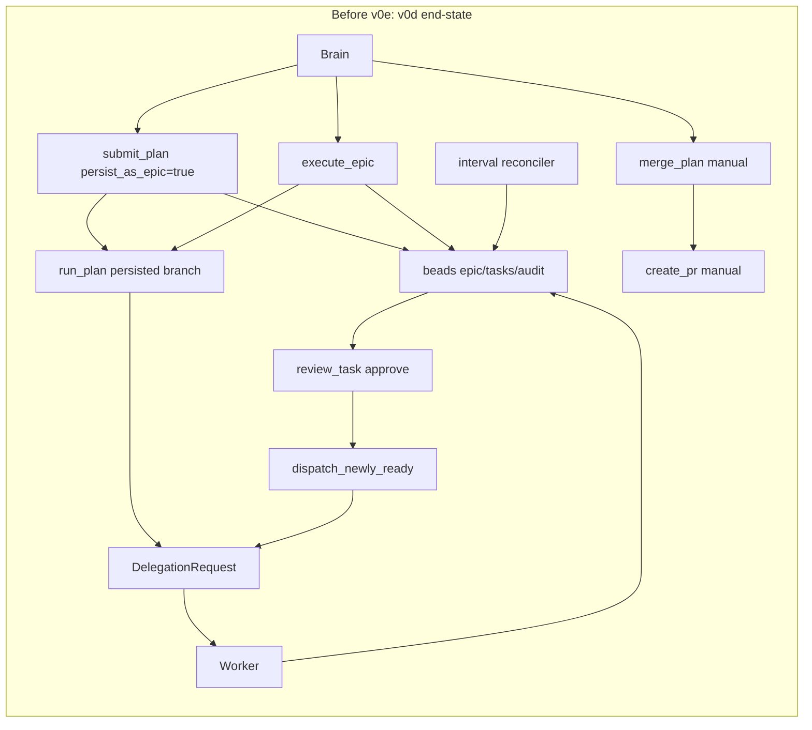
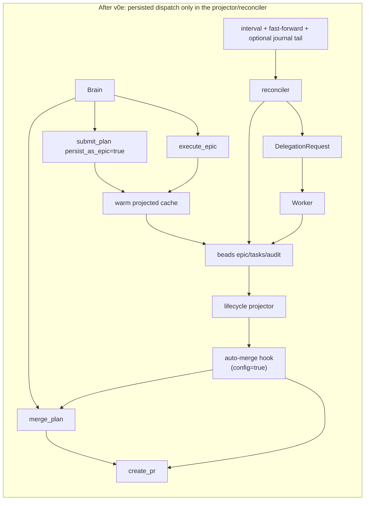

# E2E Closure v0e — Automation + Retirement Implementation Plan

> **For agentic workers:** REQUIRED SUB-SKILL: Use superpowers:subagent-driven-development (recommended) or superpowers:executing-plans to implement this plan task-by-task. Steps use checkbox (`- [ ]`) syntax for tracking.

**Goal:** Finish the persisted-plan closure story by removing the last direct-dispatch escape hatches, adding an opt-in auto-merge/PR bridge on top of the v0d lifecycle projector, and retiring the temporary migration compatibility path once no pre-v0c executions remain.

**Architecture:** v0e is deletion-heavy. Persisted plans stop entering `run_plan` entirely, review-time persisted approvals stop calling `dispatch_newly_ready`, and the reconciler/lifecycle projector becomes the only persisted dispatcher. Manual `merge_plan` → `create_pr` remains the default UX; optional automation is a thin hook layered on the v0d epic-terminal projection and gated behind `[spur] auto_merge_approved_plans = false` by default. The reconciler keeps interval polling as the correctness baseline, then adds fast-forward and capability-gated `.beads/journal` wakeups without changing the projected outcome.

**Tech Stack:** Rust 2021, tokio, serde/toml, existing `PmService` + `BeadsAdvanced`, existing `SpurEventBody::{PlanCompleted, PlanReadyToMerge}`, existing `TaskTracker`, existing `Notify`, optional `.beads/journal` tail if the beads checkout exposes it.

**Spec source:** `docs/superpowers/specs/2026-04-21-e2e-closure-design.md`

**Prerequisites:** v0c and v0d are already merged before Task 1 starts. This plan does not re-spec authority flip, epic auto-close, persisted merge-base bootstrap, or v0d lifecycle projection. It only deletes now-redundant branches and adds optional automation on top.

---

## File Structure

**Modify:**
- `crates/spur-acp/src/config/mod.rs:308-345, 650-750` — add `[spur] auto_merge_approved_plans`, default parsing tests, and default value coverage.
- `crates/spur-core/src/orchestrator.rs:711-724, 1949-1962` — pass the new config gate into the MCP server/reconciler wiring.
- `crates/spur-mcp/src/server.rs:238-245, 873-939, 1181-1225, 2068-2227, 2347-2759` — remove persisted `run_plan` spawn sites, expose internal merge/PR helpers, pass wakeup config into the reconciler, and retire the startup reclaim shim after the one-cycle guard.
- `crates/spur-mcp/src/plan/mod.rs:735-909, 1482-1529, 1970-2023, 2511-2614` — make `run_plan` ephemeral-only, stop persisted approve-path dispatch, and delete `dispatch_newly_ready`.
- `crates/spur-mcp/src/plan/reconciler.rs:1-186` — add hybrid wake sources, optional journal tail, and the opt-in auto-merge/PR hook.
- `crates/spur-cli/src/main.rs:724-739` — no logic change expected, but keep the parser/load path under test once `[spur]` exists.
- `crates/spur-cli/tests/init_ux.rs:1-145` — update config round-trip expectations only if the pretty-printed default output changes.
- `crates/spur-mcp/tests/submit_plan_persist.rs:1-393` — persisted submit/`run_plan` retirement regression coverage.
- `crates/spur-mcp/tests/plan_cancelled_task_semantics.rs:1-301` — persisted review approval no-dispatch coverage while preserving the ephemeral path.
- `crates/spur-mcp/tests/reconciler_tick.rs:1-374` — hybrid wakeup equivalence and capability-gated journal-tail coverage.

**Create:**
- `crates/spur-mcp/tests/e2e_closure_v0e.rs` — T-v0e-1, T-v0e-2, and T-v0e-3 acceptance tests.

**Delete in place (branch/code-range retirement, not file deletion):**
- `crates/spur-mcp/src/server.rs:2472-2484` — direct `run_plan` spawn block in `handle_submit_plan`.
- `crates/spur-mcp/src/server.rs:2696-2729` — direct `run_plan` spawn block in `handle_execute_epic`.
- `crates/spur-mcp/src/plan/mod.rs:735-909` — persisted dispatch path from `run_plan`.
- `crates/spur-mcp/src/plan/mod.rs:2007-2023` — persisted approve-path dispatch cascade.
- `crates/spur-mcp/src/plan/mod.rs:2511-2614` — `dispatch_newly_ready` helper once the ephemeral-only follow-on helper replaces it.
- `crates/spur-mcp/src/server.rs:1181-1205` — the v0c startup reclaim insertion point after the one-cycle compatibility path is retired.

**Line-anchor note:** the ranges above are from the current worktree. Re-run `nl -ba` before implementing if sibling v0c/v0d merges shift them.

---

## Control-Flow Snapshots

### BEFORE v0e (v0d end-state)


### AFTER v0e


---

## Phase 1 — Config Gate + Persisted `run_plan` Retirement (Tasks 1–5)

### Task 1: Add `[spur] auto_merge_approved_plans` with default `false`
**Files:**
- Modify: `crates/spur-acp/src/config/mod.rs:308-345`
- Modify: `crates/spur-acp/src/config/mod.rs:650-750` (append tests)
- Modify: `crates/spur-core/src/orchestrator.rs:711-724, 1949-1962`
- Modify: `crates/spur-mcp/src/server.rs:238-245, 933-939`
- [ ] **Step 1: Add a new nested `[spur]` config block**

Insert a small runtime config block directly alongside `delegation`:

```rust
#[derive(Debug, Clone, Default, Serialize, Deserialize)]
#[serde(default)]
pub struct SpurRuntimeConfig {
    pub auto_merge_approved_plans: bool,
}
```
Then extend `SpurConfig`:

```rust
#[derive(Debug, Clone, Default, Serialize, Deserialize)]
pub struct SpurConfig {
    #[serde(default)]
    pub brain: BrainConfig,
    #[serde(default)]
    pub agents: AgentsConfig,
    #[serde(default)]
    pub failover: FailoverConfig,
    #[serde(default)]
    pub worktree: WorktreeConfig,
    #[serde(default)]
    pub cost: CostConfig,
    #[serde(default)]
    pub pm: PmConfig,
    #[serde(default)]
    pub project: Option<ProjectConfig>,
    #[serde(default)]
    pub delegation: DelegationConfig,
    #[serde(default)]
    pub spur: SpurRuntimeConfig,
}
```
- [ ] **Step 2: Thread the flag into the server**

Add a setter on `McpCallbackServer` and wire it from `Orchestrator` next to `set_inline_wait(...)` / `set_reconciler_enabled(...)`:

```rust
pub fn set_auto_merge_approved_plans(&mut self, enabled: bool) {
    self.auto_merge_approved_plans = enabled;
}
```
The two current orchestrator startup sites that must pass `self.config.spur.auto_merge_approved_plans` are:

- `crates/spur-core/src/orchestrator.rs:711-724`
- `crates/spur-core/src/orchestrator.rs:1949-1962`
- [ ] **Step 3: Add config parse/default tests first**

Append to `crates/spur-acp/src/config/mod.rs`:

```rust
    #[test]
    fn spur_runtime_defaults_auto_merge_to_false() {
        let cfg: SpurConfig = toml::from_str("").unwrap();
        assert!(!cfg.spur.auto_merge_approved_plans);
    }

    #[test]
    fn spur_runtime_parses_auto_merge_true() {
        let cfg: SpurConfig = toml::from_str(
            r#"
                [spur]
                auto_merge_approved_plans = true
            "#,
        )
        .unwrap();
        assert!(cfg.spur.auto_merge_approved_plans);
    }
```
- [ ] **Step 4: Verify**
Run: `cargo test -p spur-acp spur_runtime_`
Expected: PASS.
- Commit: `feat(spur-acp): add auto-merge gate to spur runtime config`
---

### Task 2: Add failing tests proving persisted handlers still spawn `run_plan`
**Files:**
- Modify: `crates/spur-mcp/src/server.rs:3073-3275` (append unit tests below `merge_plan_tests`)
- Read for setup pattern: `crates/spur-mcp/tests/reconciler_tick.rs:1-185`
- [ ] **Step 1: Add two failing tests in `server.rs`**

Add:

- `persisted_submit_plan_does_not_enqueue_delegation_request`
- `execute_epic_does_not_enqueue_delegation_request_after_projection`

Both tests should:

1. `br init` a temp repo.
2. Create or derive a beads epic/task graph.
3. Build a real `PmService`.
4. Construct `McpCallbackServer::new(...)`.
5. Call the private handler directly.
6. Assert `tokio::time::timeout(Duration::from_millis(100), channel.request_rx.recv()).await.is_err()`.

The current code should fail because both handlers still hit the direct spawn blocks at:

- `crates/spur-mcp/src/server.rs:2472-2484`
- `crates/spur-mcp/src/server.rs:2696-2729`
- [ ] **Step 2: Run the failing tests**
Run: `cargo test -p spur-mcp enqueue_delegation_request -- --nocapture`
Expected: FAIL. At least one test should receive a `DelegationRequest`, proving the old inline executor path is still alive.
- Commit: `test(spur-mcp): pin persisted handlers against direct run_plan spawn`
---

### Task 3: Delete direct `run_plan` spawn blocks from `submit_plan` and `execute_epic`
**Files:**
- Modify: `crates/spur-mcp/src/server.rs:873-939`
- Modify/Delete: `crates/spur-mcp/src/server.rs:2472-2484`
- Modify/Delete: `crates/spur-mcp/src/server.rs:2696-2729`
- Modify: `crates/spur-mcp/src/server.rs:2347-2506`
- Modify: `crates/spur-mcp/src/server.rs:2517-2759`
- [ ] **Step 1: Extract one ephemeral-only spawn helper**

Add a private method so `server.rs` never calls `crate::plan::run_plan(...)` directly again:

```rust
fn spawn_ephemeral_plan_runner(
    &self,
    state: Arc<tokio::sync::Mutex<crate::plan::PlanState>>,
) {
    let delegation_tx = self.delegation_tx.clone();
    let plan_sink = self.event_sink.clone();
    let plan_pm = self
        .pm_service
        .clone()
        .map(|p| p as Arc<dyn crate::plan::PmLike>);
    self.task_tracker
        .spawn(crate::plan::run_plan(state, delegation_tx, plan_sink, plan_pm));
}
```
- [ ] **Step 2: Gate both handlers on ephemeral-only execution**

Use this exact control split in both handlers:

```rust
if persist_as_epic {
    if let Some(fast_forward) = &self.reconciler_fast_forward {
        fast_forward.notify_one();
    }
} else {
    self.spawn_ephemeral_plan_runner(Arc::clone(&state));
}
```
For `execute_epic`, the branch is unconditional because the entire surface is persisted; warm the cache/registry, then notify the reconciler instead of spawning `run_plan`.
- [ ] **Step 3: Proof-of-safety grep**
Run: `git grep -n "crate::plan::run_plan" -- crates/spur-mcp/src/server.rs`

Expected after deletion: no output.
- [ ] **Step 4: Re-run the Task 2 tests**
Run: `cargo test -p spur-mcp enqueue_delegation_request -- --nocapture`
Expected: PASS.
- Commit: `refactor(spur-mcp): route persisted handlers through reconciler only`
---

### Task 4: Add failing tests proving `run_plan` still dispatches persisted `PlanState`
**Files:**
- Modify: `crates/spur-mcp/tests/submit_plan_persist.rs:153-393`
- [ ] **Step 1: Append the defensive tests**

Add:

- `run_plan_with_epic_id_does_not_dispatch`
- `run_plan_without_epic_id_still_dispatches`

The persisted test should construct a `PlanState` with `epic_id: Some("bd-epic".into())`, one pending task, a live `mpsc` channel, then assert no `DelegationRequest` arrives within a short timeout.

The ephemeral control test should keep `epic_id: None` and assert the first request does arrive.
- [ ] **Step 2: Run just the new tests**
Run: `cargo test -p spur-mcp run_plan_with_epic_id_does_not_dispatch -- --nocapture`
Expected: FAIL. Current `run_plan` will still dispatch even when `epic_id` is present.
- Commit: `test(spur-mcp): make persisted run_plan dispatch impossible to miss`
---

### Task 5: Make `run_plan` explicitly ephemeral-only
**Files:**
- Modify/Delete: `crates/spur-mcp/src/plan/mod.rs:735-909`
- Modify: `crates/spur-mcp/tests/submit_plan_persist.rs:153-393`
- [ ] **Step 1: Split the body into an ephemeral helper**

Keep the public function name for the ephemeral surface, but move the loop body into an explicit helper:

```rust
async fn run_ephemeral_plan(
    plan: Arc<Mutex<PlanState>>,
    delegation_tx: mpsc::Sender<DelegationRequest>,
    event_sink: Option<Arc<dyn crate::events::McpEventSink>>,
    pm: Option<Arc<dyn PmLike>>,
) {
    let _ = event_sink;
    let _ = pm;
    let _ = delegation_tx;
    let _ = plan;
}

pub async fn run_plan(
    plan: Arc<Mutex<PlanState>>,
    delegation_tx: mpsc::Sender<DelegationRequest>,
    event_sink: Option<Arc<dyn crate::events::McpEventSink>>,
    pm: Option<Arc<dyn PmLike>>,
) {
    if plan.lock().await.epic_id.is_some() {
        tracing::warn!("run_plan is ephemeral-only in v0e; persisted plans must use the reconciler");
        return;
    }
    run_ephemeral_plan(plan, delegation_tx, event_sink, pm).await;
}
```
Replace the stubbed helper body with the existing executor loop. The only new persisted branch allowed in `run_plan` is the fast-fail/no-op guard above; all direct persisted dispatch logic is removed.
- [ ] **Step 2: Verify**
Run: `cargo test -p spur-mcp run_plan_ -- --nocapture`
Expected: PASS. The persisted test from Task 4 must now pass; the ephemeral control must continue to pass.
- [ ] **Step 3: Proof-of-safety grep**
Run: `git grep -n "crate::plan::run_plan" -- crates/spur-mcp/src/server.rs`

Expected after deletion: no output.
- Commit: `refactor(spur-mcp): make run_plan ephemeral-only`
---

## Phase 2 — Persisted Review Retirement + Auto-Merge Hook (Tasks 6–10)

### Task 6: Add failing tests proving persisted approve still dispatches through `dispatch_newly_ready`
**Files:**
- Modify: `crates/spur-mcp/tests/plan_cancelled_task_semantics.rs:1-301`
- [ ] **Step 1: Append one persisted-path failure test and one ephemeral control**

Add:

- `persisted_approve_does_not_dispatch_new_dependents`
- `ephemeral_approve_still_dispatches_new_dependents`

The persisted test should mirror the existing approval-cascade fixture but set `plan_state.epic_id = Some("bd-epic".into())`. Call `handle_review_task(...)` and assert the delegation receiver stays empty.
- [ ] **Step 2: Run the failing test**
Run: `cargo test -p spur-mcp persisted_approve_does_not_dispatch_new_dependents -- --nocapture`
Expected: FAIL. Current `apply_decision_and_extract(...)` still calls `dispatch_newly_ready(...)` from `crates/spur-mcp/src/plan/mod.rs:2007-2023`.
- Commit: `test(spur-mcp): expose persisted approve dispatch cascade`
---

### Task 7: Delete `dispatch_newly_ready` and keep follow-on dispatch ephemeral-only
**Files:**
- Modify/Delete: `crates/spur-mcp/src/plan/mod.rs:1482-1529`
- Modify/Delete: `crates/spur-mcp/src/plan/mod.rs:1970-2023`
- Delete: `crates/spur-mcp/src/plan/mod.rs:2511-2614`
- Modify: `crates/spur-mcp/tests/plan_cancelled_task_semantics.rs:1-301`
- Read: `crates/spur-mcp/tests/plan_audit_coverage.rs:501-760`
- [ ] **Step 1: Replace the shared helper with an explicit ephemeral helper**

Use an ephemeral-only helper name so the old symbol disappears completely:

```rust
fn enqueue_ephemeral_ready_tasks(
    plan_id: &str,
    state: &mut PlanState,
    delegation_tx: &tokio::sync::mpsc::Sender<crate::tools::DelegationRequest>,
    task_tracker: &tokio_util::task::TaskTracker,
    plan_arc: std::sync::Arc<tokio::sync::Mutex<PlanState>>,
    sink: Option<&dyn crate::events::McpEventSink>,
    warnings: &mut Vec<String>,
    new_dispatches: &mut Vec<(String, u32, String)>,
    audit_emits: &mut Vec<PendingAuditEmit>,
    pm_arc: Option<&Arc<dyn PmLike>>,
) {
    let _ = plan_id;
    let _ = state;
    let _ = delegation_tx;
    let _ = task_tracker;
    let _ = plan_arc;
    let _ = sink;
    let _ = warnings;
    let _ = new_dispatches;
    let _ = audit_emits;
    let _ = pm_arc;
}
```
Port the old `dispatch_newly_ready(...)` body into this helper, then call it only when `state.epic_id.is_none()`.
- [ ] **Step 2: Delete the old helper and both call sites**

The two direct call sites to remove are:

- `crates/spur-mcp/src/plan/mod.rs:1517-1528`
- `crates/spur-mcp/src/plan/mod.rs:2011-2022`

Persisted approve paths must now stop after beads/audit writeback and fast-forward notification; only ephemeral plans may enqueue immediate follow-ons.
- [ ] **Step 3: Proof-of-safety grep**
Run: `git grep -n "dispatch_newly_ready(" -- crates/spur-mcp/src/plan/mod.rs crates/spur-mcp/tests`

Expected after deletion: no output.
- [ ] **Step 4: Verify**
Run: `cargo test -p spur-mcp dispatch_new_dependents -- --nocapture`
Expected: PASS. The persisted test must stay quiet; the ephemeral control must still dispatch.
- Commit: `refactor(spur-mcp): delete dispatch_newly_ready in favor of ephemeral-only follow-ons`
---

### Task 8: Add failing tests for auto-PR title/body derivation and config gating
**Files:**
- Modify: `crates/spur-mcp/src/plan/reconciler.rs:188-251` (append unit tests)
- Modify: `crates/spur-pm/src/types.rs:115-122` (read only)
- [ ] **Step 1: Add pure tests for PR param derivation**

Append tests that pin two rules:

1. PR titles/bodies include the `plan_id`.
2. The summary text comes from the v0d `EpicCompletion` audit payload when present.

Drive a pure helper with string inputs so this task stays v0e-only:

```rust
fn build_auto_pr_params(
    plan_id: &str,
    epic_title: &str,
    outcome_summary: &str,
    merge_branch: &str,
) -> spur_pm::PrParams {
    spur_pm::PrParams {
        title: format!("[SPUR] {epic_title} ({plan_id})"),
        body: format!(
            "Auto-created for plan `{plan_id}`.\n\nOutcome: {outcome_summary}\nMerge branch: {merge_branch}"
        ),
        head_branch: merge_branch.to_string(),
        base_branch: None,
        repo: None,
    }
}
```
- [ ] **Step 2: Add a failing config-off test**

Add a unit test around the future hook boundary asserting `auto_merge_approved_plans = false` produces zero merge/PR actions even when the projected outcome is all-approved.
- [ ] **Step 3: Run the new tests**
Run: `cargo test -p spur-mcp auto_pr_ -- --nocapture`
Expected: FAIL or compile error until the helper/hook exists.
- Commit: `test(spur-mcp): pin auto-pr policy and config-off behavior`
---

### Task 9: Implement the opt-in auto-merge/PR hook on the all-approved terminal path
**Files:**
- Modify: `crates/spur-mcp/src/server.rs:2068-2227`
- Modify: `crates/spur-mcp/src/plan/reconciler.rs:43-115`
- Modify: `crates/spur-mcp/src/plan/reconciler.rs:117-186`
- [ ] **Step 1: Factor handler bodies into reusable private helpers**

The reconciler must not synthesize JSON-RPC just to call existing server logic. Extract the core bodies into helpers:

```rust
async fn merge_plan_impl(&self, plan_id: &str) -> anyhow::Result<crate::plan::PlanMergeState> {
    let _ = plan_id;
    anyhow::bail!("implement by moving the core of handle_merge_plan here")
}

async fn create_pr_impl(&self, params: spur_pm::PrParams) -> anyhow::Result<String> {
    let _ = params;
    anyhow::bail!("implement by moving the core of handle_create_pr here")
}
```
The public JSON-RPC handlers become thin argument/parsing wrappers around these helpers.
- [ ] **Step 2: Add the hook at the v0d epic-terminal check**

In the reconciler/lifecycle projector branch that already decides “all approved / ready to merge”, add:

```rust
if self.auto_merge_approved_plans {
    let merge_state = self.automation.merge_plan(plan_id).await?;
    if let crate::plan::PlanMergeState::Succeeded { merge_branch, .. } = merge_state {
        let params = build_auto_pr_params(plan_id, epic_title, outcome_summary, &merge_branch);
        let _ = self.automation.create_pr(params).await?;
    }
}
```
Requirements:

- Emit/retain `PlanReadyToMerge` exactly as v0d already does.
- Leave the default `next_action` text untouched when the flag is `false`.
- Derive `epic_title` and `outcome_summary` from the v0d `EpicCompletion` audit + `spur:plan-id:<id>` scope, not from RAM-only state.
- [ ] **Step 3: Verify**
Run: `cargo test -p spur-mcp auto_ -- --nocapture`
Expected: PASS.
- Commit: `feat(spur-mcp): add opt-in auto-merge and auto-pr hook`
---

### Task 10: Add T-v0e-2 integration coverage
**Files:**
- Create: `crates/spur-mcp/tests/e2e_closure_v0e.rs`
- [ ] **Step 1: Add `t_v0e_2_auto_merge_pr_is_opt_in`**

The acceptance test must exercise both settings:

1. `auto_merge_approved_plans = false` → no merge call, no PR call.
2. `auto_merge_approved_plans = true` → one merge call, one PR call, derived title/body include `plan_id` and the v0d epic-completion outcome summary.

Use a recording test double around the automation boundary extracted in Task 9 so the test does not require a real GitHub adapter.
- [ ] **Step 2: Verify**
Run: `cargo test -p spur-mcp --test e2e_closure_v0e t_v0e_2_auto_merge_pr_is_opt_in -- --nocapture`
Expected: PASS.
- Commit: `test(spur-mcp): add v0e auto-merge opt-in acceptance coverage`
---

## Phase 3 — Hybrid Wakeups + Compatibility Shim Retirement (Tasks 11–16)

### Task 11: Add failing tests for hybrid wakeup equivalence and journal-tail capability gating
**Files:**
- Modify: `crates/spur-mcp/tests/reconciler_tick.rs:1-374`
- Modify: `crates/spur-mcp/src/plan/reconciler.rs:188-251`
- [ ] **Step 1: Add two tests**

Add:

- `hybrid_fast_forward_matches_polling_projection`
- `hybrid_journal_tail_probe_disables_itself_when_missing`

The first test should compare the same ready-task progression under:

- timer-only wakes, and
- timer + `Notify` fast-forward wakes.

The second test should assert that when `.beads/journal` is absent, the reconciler does not fail startup and simply stays on interval + fast-forward mode.
- [ ] **Step 2: Run the tests**
Run: `cargo test -p spur-mcp hybrid_ -- --nocapture`
Expected: FAIL until the wake abstraction exists.
- Commit: `test(spur-mcp): pin hybrid reconciler wakeup behavior`
---

### Task 12: Replace interval-only reconciler startup with hybrid interval + fast-forward + optional journal tail
**Files:**
- Modify: `crates/spur-mcp/src/plan/reconciler.rs:1-186`
- Modify: `crates/spur-mcp/src/server.rs:1181-1205`
- Modify: `crates/spur-mcp/src/server.rs:242-245`
- [ ] **Step 1: Add a wake reason enum and journal path probe**

Keep the probe pure and explicit:

```rust
#[derive(Debug, Clone, Copy, PartialEq, Eq)]
enum WakeReason {
    Interval,
    FastForward,
    JournalAppend,
}

fn beads_journal_path(repo_root: &std::path::Path) -> std::path::PathBuf {
    repo_root.join(".beads").join("journal")
}
```
- [ ] **Step 2: Extend `Reconciler::new(...)` with repo-root-aware wake configuration**

Pass the repo root or resolved journal path from `server.rs` when spawning the reconciler so it can:

1. always keep interval polling,
2. always keep `Notify` fast-forward, and
3. optionally add a tail task if the journal file exists.

If the journal file is absent, log once and continue without error.
- [ ] **Step 3: Keep correctness baseline unchanged**

`tick_once()` remains the single source of truth. Wake sources only decide *when* it runs, never *what* it projects.
- [ ] **Step 4: Verify**
Run: `cargo test -p spur-mcp hybrid_ -- --nocapture`
Expected: PASS.
- Commit: `feat(spur-mcp): add hybrid reconciler wakeups with optional journal tail`
---

### Task 13: Add T-v0e-3 correctness-equivalence coverage
**Files:**
- Modify: `crates/spur-mcp/tests/e2e_closure_v0e.rs`
- [ ] **Step 1: Add `t_v0e_3_fast_forward_matches_polling`**

Acceptance criteria:

1. The ready-task sequence under hybrid wakeups matches timer-only polling.
2. The terminal outcome (including all-approved / has-failures split) matches timer-only polling.
3. If `.beads/journal` is missing in the temp repo, the test asserts capability-gated fallback and records that file-tail remains deferred to v1 for that environment.
- [ ] **Step 2: Verify**
Run: `cargo test -p spur-mcp --test e2e_closure_v0e t_v0e_3_fast_forward_matches_polling -- --nocapture`
Expected: PASS.
- Commit: `test(spur-mcp): add v0e wakeup equivalence acceptance coverage`
---

### Task 14: Introduce a short-lived legacy reclaim detector and mode switch
**Files:**
- Modify: `crates/spur-mcp/src/server.rs:1181-1225`
- Modify: the v0c reclaim helper landed under the startup hook above
- [ ] **Step 1: Name the compatibility switch explicitly**

Wrap the v0c startup reclaim branch in a short-lived local mode enum:

```rust
#[derive(Debug, Clone, Copy, PartialEq, Eq)]
enum LegacyReclaimMode {
    Skip,
    DetectAndRun,
}
```
This keeps the cleanup concrete instead of leaving an unnamed one-off branch in `start()`.
- [ ] **Step 2: Add the detector**

The detector rule is the spec rule verbatim:

- open epic with `spur:plan-id:<id>`,
- no `PlanSubmit` audit carrying rev-1 merge-base metadata,
- therefore treat as pre-v0c legacy execution that still needs the reclaim pass.

Prefer a pure classifier helper over embedding the logic directly in `start()`:

```rust
fn legacy_reclaim_needed(has_rev1_merge_base_metadata: bool) -> bool {
    !has_rev1_merge_base_metadata
}
```
- [ ] **Step 3: Add failing tests**

Add:

- `legacy_reclaim_needed_when_rev1_bootstrap_metadata_is_missing`
- `legacy_reclaim_skipped_when_rev1_bootstrap_metadata_exists`
Run: `cargo test -p spur-mcp legacy_reclaim_ -- --nocapture`
Expected: FAIL until the helper/mode exists.
- Commit: `test(spur-mcp): pin legacy reclaim detector before retirement`
---

### Task 15: Gate the v0c reclaim pass so it only runs when legacy epics still exist
**Files:**
- Modify: `crates/spur-mcp/src/server.rs:1181-1225`
- Modify: the v0c reclaim helper introduced beneath that startup hook
- [ ] **Step 1: Replace unconditional startup reclaim with detect-and-run**

The startup sequence becomes:

1. run the detector,
2. `LegacyReclaimMode::Skip` when zero legacy epics are found,
3. `LegacyReclaimMode::DetectAndRun` only when the detector finds at least one pre-v0c epic,
4. continue into normal reconciler startup either way.
- [ ] **Step 2: Add the integration test**

Add `legacy_reclaim_runs_only_when_detector_finds_pre_v0c_epics` and prove:

- legacy epic present → reclaim helper runs,
- no legacy epic present → reclaim helper is not called.
- [ ] **Step 3: Verify**
Run: `cargo test -p spur-mcp legacy_reclaim_runs_only_when_detector_finds_pre_v0c_epics -- --nocapture`
Expected: PASS.
- Commit: `feat(spur-mcp): gate legacy startup reclaim on rev1 bootstrap detection`
---

### Task 16: Delete the legacy reclaim compatibility shim after one deploy cycle
**Files:**
- Delete/Modify: `crates/spur-mcp/src/server.rs:1181-1225`
- Delete: the short-lived `LegacyReclaimMode` + `run_legacy_reclaim_startup_scan` helper added by Tasks 14–15
- [ ] **Step 1: Remove the temporary mode and helper**

Once one deploy cycle has passed and the detector has observed no remaining legacy epics in staging/prod, delete the temporary shim entirely. Leave only the steady-state v0d+ restart path.
- [ ] **Step 2: Proof-of-safety grep**
Run: `git grep -n "LegacyReclaimMode\\|run_legacy_reclaim_startup_scan" -- crates/spur-mcp/src/server.rs crates/spur-mcp/src/plan`

Expected after deletion: no output.
- [ ] **Step 3: Verify**
Run: `cargo test -p spur-mcp legacy_reclaim_ -- --nocapture`
Expected: PASS, with the steady-state tests asserting the normal restart path and the compatibility-only tests removed or flipped to “no legacy shim remains”.
- Commit: `refactor(spur-mcp): remove legacy startup reclaim compatibility shim`
---

## Phase 4 — Acceptance Tests + Exit Verification (Tasks 17–19)

### Task 17: Add T-v0e-1 acceptance coverage
**Files:**
- Modify: `crates/spur-mcp/tests/e2e_closure_v0e.rs`
- [ ] **Step 1: Add `t_v0e_1_no_persisted_direct_dispatch`**

This acceptance test must prove all three persisted entry points are clean:

1. `submit_plan(persist_as_epic=true)` does not enqueue a `DelegationRequest`.
2. `execute_epic` does not enqueue a `DelegationRequest`.
3. persisted `review_task(..., "approve")` does not dispatch directly.
- [ ] **Step 2: Verify the runtime behavior**
Run: `cargo test -p spur-mcp --test e2e_closure_v0e t_v0e_1_no_persisted_direct_dispatch -- --nocapture`
Expected: PASS.
- [ ] **Step 3: Verify the code deletions**
Run:
```bash
git grep -n "crate::plan::run_plan" -- crates/spur-mcp/src/server.rs
git grep -n "dispatch_newly_ready(" -- crates/spur-mcp/src/plan/mod.rs crates/spur-mcp/tests
```
Expected after deletion: no output from either command.
- Commit: `test(spur-mcp): add v0e persisted-dispatch retirement acceptance test`
---

### Task 18: Finalize T-v0e-2 acceptance coverage
**Files:**
- Modify: `crates/spur-mcp/tests/e2e_closure_v0e.rs`
- [ ] **Step 1: Keep the acceptance test narrow**

`t_v0e_2_auto_merge_pr_is_opt_in` is the acceptance test, not just a unit test. It must assert:

- config `false` preserves the v0d manual flow,
- config `true` invokes merge + PR exactly once,
- the derived PR title/body include the `plan_id` and the epic-terminal outcome summary.
- [ ] **Step 2: Verify**
Run: `cargo test -p spur-mcp --test e2e_closure_v0e t_v0e_2_auto_merge_pr_is_opt_in -- --nocapture`
Expected: PASS.
- Commit: `test(spur-mcp): finalize v0e auto-merge opt-in acceptance test`
---

### Task 19: Finalize T-v0e-3 and run the v0e exit suite
**Files:**
- Modify: `crates/spur-mcp/tests/e2e_closure_v0e.rs`
- [ ] **Step 1: Finish `t_v0e_3_fast_forward_matches_polling`**

This is the acceptance test for the wakeup exploration. If the temp beads repo exposes `.beads/journal`, exercise it. If it does not, assert the capability probe disables journal-tail cleanly and still prove timer + `Notify` fast-forward are correctness-equivalent to pure polling.
- [ ] **Step 2: Run the full v0e acceptance file**
Run: `cargo test -p spur-mcp --test e2e_closure_v0e -- --nocapture`
Expected: PASS.
- [ ] **Step 3: Run the targeted regression suite**
Run:
```bash
cargo test -p spur-mcp run_plan_ -- --nocapture
cargo test -p spur-mcp persisted_approve_does_not_dispatch_new_dependents -- --nocapture
cargo test -p spur-mcp hybrid_ -- --nocapture
cargo test -p spur-acp spur_runtime_ -- --nocapture
```
Expected: PASS.
- Commit: `test(spur-mcp): close v0e acceptance and retirement verification`
---

## Acceptance Mapping

- `T-v0e-1 no persisted path calls direct dispatcher helpers` → Tasks 2–7 build the regression/fix path; Task 17 is the acceptance test.
- `T-v0e-2 optional auto-merge/PR path stays behind configuration` → Tasks 1, 8, 9, and 10 build the surface; Task 18 is the acceptance test.
- `T-v0e-3 event-driven fast-forward does not change correctness relative to polling` → Tasks 11, 12, and 13 build the wake model; Task 19 is the acceptance test.

---

## Top 3 Risks

1. Auto-merge can accidentally turn a projected all-approved outcome into an integration-time surprise if the repo has no PR backend configured. Keep the path opt-in, derive params from durable audit data, and fail loudly without mutating the default manual flow.
2. Journal-tail wakeups can duplicate or reorder notifications relative to interval ticks. Keep `tick_once()` as the only projector and treat tail/fast-forward as latency optimizations, not state sources.
3. Deleting the v0c reclaim shim too early can strand the last pre-v0c persisted epic. Use the rev-1 merge-base metadata detector, gate the cleanup for one deploy cycle, and do not remove the shim until staging/prod observe zero legacy epics.
