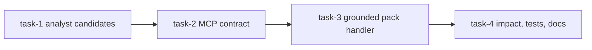

# Knowledge Context API Implementation Plan

> **For SPUR orchestrator:** This plan is designed for `submit_plan(persist_as_epic=true)`.
> Each task becomes a beads issue with `spur:plan-task-id` and `spur:plan-id` labels.

**Source spec:** `docs/superpowers/specs/2026-06-07-knowledge-context-api-design.ipynb`
**Design epic:** `bd-4rh7` (approved by user request to commit plan and submit implementation)

**Goal:** Add a one-shot MCP `knowledge_context_pack` tool that returns bounded, grounded evidence packs from the existing analyst DB and exact graph artifact.

**Architecture:** The MVP keeps Lance ANN out of the critical path. `spur-analyst` becomes the shared Rust query layer over `.spur/analyst.duckdb`; `spur-mcp` owns the worker-facing MCP tool and uses existing code graph backends for exact grounding and impact counts. The tool returns structured JSON with staleness metadata, ranked evidence, impact summaries, and recommended exact follow-up tool calls.

**Tech Stack:** Rust 2021, `serde`, `serde_json`, `duckdb` read-only analyst queries, existing `spur-graph` artifact readers, existing `spur-mcp` JSON-RPC tool registration.

---

## File Structure Mapping

- `crates/spur-context/poc/duckdb-analyst/init_search.sql`: add a stable-ID-preserving context candidate macro for the MCP packer.
- `crates/spur-cli/src/commands/analyst.rs`: add SQL contract tests for the new macro and ensure the freshness fingerprint changes when the macro changes.
- `crates/spur-analyst/src/lib.rs`: replace the current placeholder with the shared analyst query API.
- `crates/spur-analyst/Cargo.toml`: add runtime dependencies needed by the query API.
- `crates/spur-analyst/tests/context_candidates.rs`: test query API behavior against a small DuckDB fixture.
- `crates/spur-mcp/Cargo.toml`: add `spur-analyst` dependency.
- `crates/spur-mcp/src/tools.rs`: register `knowledge_context_pack` in full and worker tool lists.
- `crates/spur-mcp/src/server/handlers/mod.rs`: route the new MCP tool name.
- `crates/spur-mcp/src/server/handlers/knowledge_context.rs`: implement the handler.
- `crates/spur-mcp/src/server/handlers/code_graph.rs`: expose narrow helper functions only if needed for exact grounding; avoid broad refactors.

## Dependency DAG



---

### Task 1: Analyst Context Candidate Query Layer

**Task ID:** `t1-candidates`

**Files:**
- Modify: `crates/spur-context/poc/duckdb-analyst/init_search.sql`
- Modify: `crates/spur-cli/src/commands/analyst.rs`
- Modify: `crates/spur-analyst/Cargo.toml`
- Modify: `crates/spur-analyst/src/lib.rs`
- Create: `crates/spur-analyst/tests/context_candidates.rs`

**Depends on:** none

**Acceptance Criteria:**
- [ ] `init_search.sql` defines `CREATE OR REPLACE MACRO search_context_candidates(q, requested_scope) AS TABLE`.
- [ ] The macro returns stable IDs for code and docs: `kind`, `title`, `file_path`, `stable_symbol_id`, `symbol_kind`, `score`, `signal`, `neighbor_kind`, `edge_bind_method`, `grounding`.
- [ ] The macro supports `requested_scope` values `all`, `docs`, `code`, and `graph`; invalid scope handling is performed in Rust before SQL execution.
- [ ] `spur-analyst` exposes `KnowledgeSearchScope`, `KnowledgeCandidate`, `KnowledgeQueryOptions`, `KnowledgeQueryResult`, and `query_context_candidates`.
- [ ] Query API opens DuckDB read-only, best-effort loads `icu`, escapes the query string the same way current `code_semantic_search` does, and returns `_meta.graph_content_hash`.
- [ ] Fixture test proves docs and code rows are returned with stable IDs and score fields.

**Suggested Worker:** codex

**Scope Boundary:**
- IN scope: analyst SQL candidate projection and `spur-analyst` shared query API.
- OUT of scope: MCP registration, graph grounding, Lance ANN, notebook UI changes.
- If this task needs to touch `spur-mcp` files, emit `scope_drift`.

**Implementation:**
- [ ] **Step 1: Add SQL contract tests before changing SQL**

Add tests in `crates/spur-cli/src/commands/analyst.rs`:

```rust
#[test]
fn init_search_sql_context_candidates_macro_present() {
    assert!(
        INIT_SEARCH_SQL.contains("CREATE OR REPLACE MACRO search_context_candidates(q, requested_scope) AS TABLE"),
        "init_search.sql must define the context candidate macro"
    );
    for required in [
        "stable_symbol_id",
        "neighbor_kind",
        "edge_bind_method",
        "grounding",
        "requested_scope",
    ] {
        assert!(
            INIT_SEARCH_SQL.contains(required),
            "context candidate macro must project {required}"
        );
    }
}
```

Run:

```bash
scripts/spur-cargo test -p spur-cli init_search_sql_context_candidates_macro_present -- --nocapture
```

Expected: FAIL before SQL change.

- [ ] **Step 2: Add `search_context_candidates` to `init_search.sql`**

Implement the macro by composing existing materializations:

```sql
CREATE OR REPLACE MACRO search_context_candidates(q, requested_scope) AS TABLE
  SELECT kind, title, file_path, stable_symbol_id, symbol_kind, score, signal,
         neighbor_kind, edge_bind_method, grounding
  FROM (
    SELECT 'doc' AS kind,
           s.qualified_name AS title,
           s.file_path,
           s.stable_symbol_id,
           CAST('section' AS VARCHAR) AS symbol_kind,
           round(fts_main_sections_search.match_bm25(s.stable_symbol_id, q), 3) AS score,
           CAST(NULL AS VARCHAR) AS signal,
           CAST(NULL AS VARCHAR) AS neighbor_kind,
           CAST(NULL AS VARCHAR) AS edge_bind_method,
           'bm25-doc' AS grounding,
           fts_main_sections_search.match_bm25(s.stable_symbol_id, q) AS rank
    FROM sections_search s
    WHERE requested_scope IN ('all', 'docs')
      AND fts_main_sections_search.match_bm25(s.stable_symbol_id, q) IS NOT NULL
    UNION ALL
    SELECT 'code' AS kind,
           st.entity_name AS title,
           st.file_path,
           st.stable_symbol_id,
           st.symbol_kind,
           round(fts_main_symbol_text.match_bm25(st.stable_symbol_id, q), 3) AS score,
           sc.posture || ' · pr=' || round(sc.pagerank * 1e4, 1) || ' · churn=' || sc.churn_90d AS signal,
           'primary' AS neighbor_kind,
           CAST(NULL AS VARCHAR) AS edge_bind_method,
           'bm25-code' AS grounding,
           fts_main_symbol_text.match_bm25(st.stable_symbol_id, q)
             * CASE WHEN st.file_path LIKE '%/tests/%' THEN 0.6 ELSE 1.0 END
             * CASE WHEN st.symbol_kind IN ('function','method','struct','enum','trait') THEN 1.15
                    WHEN st.symbol_kind IN ('constant','static','field') THEN 0.85 ELSE 1.0 END
             * (1 + 0.15 * ln(1 + sc.pagerank * 1e4)) AS rank
    FROM symbol_text st
    JOIN v_symbol_scorecard sc USING (stable_symbol_id)
    WHERE requested_scope IN ('all', 'code', 'graph')
      AND fts_main_symbol_text.match_bm25(st.stable_symbol_id, q) IS NOT NULL
  )
  WHERE score IS NOT NULL
  QUALIFY row_number() OVER (PARTITION BY file_path ORDER BY rank DESC) <= 2
  ORDER BY rank DESC NULLS LAST
  LIMIT 40;
```

- [ ] **Step 3: Add `spur-analyst` query API**

Use these public shapes in `crates/spur-analyst/src/lib.rs`:

```rust
#[derive(Debug, Clone, Copy, PartialEq, Eq)]
pub enum KnowledgeSearchScope {
    All,
    Docs,
    Code,
    Graph,
}

#[derive(Debug, Clone)]
pub struct KnowledgeQueryOptions {
    pub limit: usize,
}

#[derive(Debug, Clone, serde::Serialize, serde::Deserialize)]
pub struct KnowledgeCandidate {
    pub kind: String,
    pub title: String,
    pub file_path: String,
    pub stable_symbol_id: Option<String>,
    pub symbol_kind: Option<String>,
    pub score: f64,
    pub signal: Option<String>,
    pub neighbor_kind: Option<String>,
    pub edge_bind_method: Option<String>,
    pub grounding: String,
}

#[derive(Debug, Clone, serde::Serialize, serde::Deserialize)]
pub struct KnowledgeQueryResult {
    pub db_path: String,
    pub graph_content_hash: Option<String>,
    pub candidates: Vec<KnowledgeCandidate>,
}
```

Add:

```rust
pub fn query_context_candidates(
    db_path: &std::path::Path,
    query: &str,
    scope: KnowledgeSearchScope,
    options: KnowledgeQueryOptions,
) -> anyhow::Result<KnowledgeQueryResult>
```

The function must clamp `limit` to `1..=40`, reject an empty trimmed query, and use `duckdb::Config::default().access_mode(duckdb::AccessMode::ReadOnly)`.

- [ ] **Step 4: Add fixture tests**

Create `crates/spur-analyst/tests/context_candidates.rs` with a minimal DuckDB fixture that creates `_meta`, `sections_search`, `symbol_text`, and `v_symbol_scorecard`, installs/loads FTS, defines the macro, then verifies:

```rust
#[test]
fn context_candidates_return_stable_ids_for_docs_and_code() {
    // Build fixture DB, call query_context_candidates(..., KnowledgeSearchScope::All, limit 10).
    // Assert one doc candidate has stable_symbol_id == Some("doc-1").
    // Assert one code candidate has stable_symbol_id == Some("sym-1").
    // Assert graph_content_hash == Some("fixture-hash").
}
```

- [ ] **Step 5: Verify**

Run:

```bash
scripts/spur-cargo test -p spur-cli init_search_sql_context_candidates_macro_present -- --nocapture
scripts/spur-cargo test -p spur-analyst context_candidates -- --nocapture
```

- [ ] **Step 6: Commit**

```bash
git add crates/spur-context/poc/duckdb-analyst/init_search.sql crates/spur-cli/src/commands/analyst.rs crates/spur-analyst/Cargo.toml crates/spur-analyst/src/lib.rs crates/spur-analyst/tests/context_candidates.rs
git commit -m "feat(spur-analyst): task-1 add context candidate query"
```

---

### Task 2: Register `knowledge_context_pack` MCP Contract

**Task ID:** `t2-contract`

**Files:**
- Modify: `crates/spur-mcp/Cargo.toml`
- Modify: `crates/spur-mcp/src/tools.rs`
- Modify: `crates/spur-mcp/src/server/handlers/mod.rs`
- Create: `crates/spur-mcp/src/server/handlers/knowledge_context.rs`

**Depends on:** `t1-candidates`

**Acceptance Criteria:**
- [ ] `knowledge_context_pack` appears in `tools_list()` and `worker_tools_list()`.
- [ ] Tool schema accepts `query`, `intent`, `scope`, `limit`, `include_tests`, and `max_symbol_bodies`.
- [ ] Handler route exists and returns a structured `not_implemented` response only until Task 3 completes.
- [ ] Existing worker tool list tests are updated intentionally.

**Suggested Worker:** codex

**Scope Boundary:**
- IN scope: MCP tool definition, route wiring, request/response structs, initial handler module.
- OUT of scope: analyst query execution, exact graph grounding, caller/callee impact.
- If this task needs to change SQL files, emit `scope_drift`.

**Implementation:**
- [ ] **Step 1: Add dependency**

Add to `crates/spur-mcp/Cargo.toml`:

```toml
spur-analyst = { workspace = true }
```

Add workspace dependency in root `Cargo.toml` if absent:

```toml
spur-analyst = { path = "crates/spur-analyst" }
```

- [ ] **Step 2: Add tool definition**

Add `knowledge_context_pack_def()` in `crates/spur-mcp/src/tools.rs` with this schema:

```json
{
  "type": "object",
  "required": ["query"],
  "properties": {
    "query": { "type": "string", "minLength": 1 },
    "intent": { "type": "string", "enum": ["explain", "change", "review", "debug", "plan"], "default": "explain" },
    "scope": { "type": "string", "enum": ["all", "docs", "code", "graph"], "default": "all" },
    "limit": { "type": "integer", "minimum": 1, "maximum": 20, "default": 8 },
    "include_tests": { "type": "boolean", "default": true },
    "max_symbol_bodies": { "type": "integer", "minimum": 0, "maximum": 5, "default": 3 }
  },
  "additionalProperties": false
}
```

Register it in both `tools_list()` and `worker_tools_list()`.

- [ ] **Step 3: Add handler route**

In `crates/spur-mcp/src/server/handlers/mod.rs`, route:

```rust
"knowledge_context_pack" => self.handle_knowledge_context_pack(id, arguments).await,
```

Create `crates/spur-mcp/src/server/handlers/knowledge_context.rs` with:

```rust
pub(crate) async fn handle_knowledge_context_pack(
    &self,
    id: serde_json::Value,
    args: serde_json::Value,
) -> JsonRpcResponse
```

The initial response must be valid structured JSON:

```json
{
  "query": "...",
  "answerable": false,
  "confidence": "low",
  "error": { "code": "not_implemented" }
}
```

- [ ] **Step 4: Add tests**

Update `crates/spur-mcp/src/tools.rs` tests:

```rust
#[test]
fn knowledge_context_pack_appears_in_worker_tools_list() {
    let actual: Vec<String> = worker_tools_list().iter().map(|tool| tool.name.clone()).collect();
    assert!(actual.contains(&"knowledge_context_pack".to_string()));
}
```

- [ ] **Step 5: Verify**

Run:

```bash
scripts/spur-cargo test -p spur-mcp knowledge_context_pack_appears_in_worker_tools_list -- --nocapture
scripts/spur-cargo test -p spur-mcp worker_tools_list_contains_exactly_the_curated_set -- --nocapture
```

- [ ] **Step 6: Commit**

```bash
git add Cargo.toml crates/spur-mcp/Cargo.toml crates/spur-mcp/src/tools.rs crates/spur-mcp/src/server/handlers/mod.rs crates/spur-mcp/src/server/handlers/knowledge_context.rs
git commit -m "feat(spur-mcp): task-2 register knowledge context tool"
```

---

### Task 3: Implement Grounded Context Pack Handler

**Task ID:** `t3-pack`

**Files:**
- Modify: `crates/spur-mcp/src/server/handlers/knowledge_context.rs`
- Modify: `crates/spur-mcp/src/server/handlers/code_graph.rs` only if narrow helper visibility is required
- Add tests in: `crates/spur-mcp/src/server/handlers/knowledge_context.rs`

**Depends on:** `t2-contract`

**Acceptance Criteria:**
- [ ] Handler resolves `.spur/analyst.duckdb` from the configured repository root.
- [ ] Handler calls `spur_analyst::query_context_candidates`.
- [ ] Response includes `query`, `intent`, `scope`, `answerable`, `confidence`, `graph_content_hash`, `staleness`, `primary_evidence`, `supporting_docs`, `impact`, and `recommended_next_tools`.
- [ ] Code candidates with stable symbol IDs include graph URI form `graph://symbol/<id>` and file references.
- [ ] If analyst DB is missing, response is successful JSON with `answerable=false`, `confidence=low`, and `error.code="analyst_unavailable"`.
- [ ] No Lance ANN is used in this task.

**Suggested Worker:** codex

**Scope Boundary:**
- IN scope: handler implementation, response packing, staleness/hash metadata, basic symbol reference grounding.
- OUT of scope: adding ANN, changing analyst SQL, changing notebook MCP.
- If exact grounding requires broad `code_graph.rs` refactoring beyond helper visibility, emit `scope_drift`.

**Implementation:**
- [ ] **Step 1: Add failing handler tests**

Add tests for:

```rust
#[tokio::test]
async fn knowledge_context_pack_missing_analyst_db_returns_structured_unavailable() {
    // Configure a temp repo root without .spur/analyst.duckdb.
    // Call handle_knowledge_context_pack with { "query": "semantic search" }.
    // Assert result.error is None at JSON-RPC level.
    // Assert structured payload has answerable=false and error.code=="analyst_unavailable".
}
```

and:

```rust
#[test]
fn knowledge_context_pack_rejects_empty_query() {
    // Route or request parser rejects whitespace-only query with invalid params.
}
```

- [ ] **Step 2: Implement request parsing**

Use internal enums:

```rust
enum KnowledgeIntent { Explain, Change, Review, Debug, Plan }
enum KnowledgeScope { All, Docs, Code, Graph }
```

Map `KnowledgeScope` to `spur_analyst::KnowledgeSearchScope`.

- [ ] **Step 3: Resolve analyst DB**

Default path:

```rust
repo_root.join(".spur/analyst.duckdb")
```

Support optional request field `db_path` only if adding it does not weaken schema validation; otherwise keep the MVP root-derived path.

- [ ] **Step 4: Pack evidence**

For each `KnowledgeCandidate`, emit:

```json
{
  "kind": "symbol|doc",
  "title": "...",
  "file": "...",
  "stable_symbol_id": "graph://symbol/<id>",
  "score": 1.23,
  "signal": "...",
  "grounding": "bm25-code",
  "why_relevant": "Matched analyst candidate for query",
  "next": ["code_read_symbol", "code_callers"]
}
```

For doc candidates, `next` should be `["code_semantic_search"]` or `["doc_navigate"]` when `doc_navigate` can use the artifact section IDs.

- [ ] **Step 5: Add recommended next tools**

For `intent=change`, include `code_callers` and `code_callees` for top symbol evidence.
For `intent=explain`, include `code_read_symbol` for top symbol evidence.

- [ ] **Step 6: Verify**

Run:

```bash
scripts/spur-cargo test -p spur-mcp knowledge_context_pack -- --nocapture
scripts/spur-cargo test -p spur-mcp code_search -- --nocapture
```

- [ ] **Step 7: Commit**

```bash
git add crates/spur-mcp/src/server/handlers/knowledge_context.rs crates/spur-mcp/src/server/handlers/code_graph.rs
git commit -m "feat(spur-mcp): task-3 implement grounded context pack"
```

---

### Task 4: Add Impact Summaries, Documentation, And Full Verification

**Task ID:** `t4-impact`

**Files:**
- Modify: `crates/spur-mcp/src/server/handlers/knowledge_context.rs`
- Modify: `crates/spur-mcp/src/tools.rs`
- Modify: `docs/superpowers/specs/2026-06-07-knowledge-context-api-design.ipynb` only to add a short implementation note if behavior differs from spec
- Modify: `docs/superpowers/plans/2026-06-07-knowledge-context-api.md` only if worker discovers the accepted plan needs a documented correction

**Depends on:** `t3-pack`

**Acceptance Criteria:**
- [ ] For top code evidence, response includes bounded impact counts: `callers_count`, `callees_count`, and `popular_sink`.
- [ ] Popular sink threshold is `callers_count > 30`; popular sinks are not expanded.
- [ ] `staleness` reports whether analyst `graph_content_hash` is present and whether the exact graph response hash matches when available.
- [ ] Tool description explains that Lance ANN is not part of the MVP and that exact graph tools remain source-of-truth follow-ups.
- [ ] Full package verification commands pass or failures are documented with exact failing output.

**Suggested Worker:** codex

**Scope Boundary:**
- IN scope: bounded impact metadata, final tests, docs/tool description alignment.
- OUT of scope: Lance ANN, notebook MCP migration, storage/dependency feature-gating.
- If adding impact counts requires reworking the graph backend API across more than `knowledge_context.rs` and one helper, emit `scope_drift`.

**Implementation:**
- [ ] **Step 1: Add impact tests**

Add test assertions that a synthetic pack for a code candidate includes:

```json
{
  "impact": {
    "callers_count": 4,
    "callees_count": 2,
    "popular_sink": false
  }
}
```

Add a second test where `callers_count` is `31` and `popular_sink` is `true`.

- [ ] **Step 2: Implement bounded impact**

Use exact graph caller/callee count paths. If the helper returns rows, only include counts plus up to three representative neighbors. Do not include unbounded lists.

- [ ] **Step 3: Update tool description**

Ensure `knowledge_context_pack_def()` states:

```text
Builds a bounded evidence pack by combining analyst BM25 candidates, scorecard signals, and exact graph grounding. Lance ANN is not used by this MVP; use code_read_symbol/code_callers/code_callees for exact follow-up.
```

- [ ] **Step 4: Verify focused tests**

Run:

```bash
scripts/spur-cargo test -p spur-analyst context_candidates -- --nocapture
scripts/spur-cargo test -p spur-mcp knowledge_context_pack -- --nocapture
scripts/spur-cargo test -p spur-mcp worker_tools_list -- --nocapture
```

- [ ] **Step 5: Run package checks**

Run:

```bash
scripts/spur-cargo check -p spur-analyst
scripts/spur-cargo check -p spur-mcp
```

If clippy is requested during review, run from sandbox with remote:

```bash
SPUR_REMOTE=1 scripts/spur-cargo clippy -p spur-analyst -- -D warnings
SPUR_REMOTE=1 scripts/spur-cargo clippy -p spur-mcp -- -D warnings
```

- [ ] **Step 6: Commit**

```bash
git add crates/spur-mcp/src/server/handlers/knowledge_context.rs crates/spur-mcp/src/tools.rs docs/superpowers/specs/2026-06-07-knowledge-context-api-design.ipynb docs/superpowers/plans/2026-06-07-knowledge-context-api.md
git commit -m "feat(spur-mcp): task-4 add context pack impact summaries"
```

---

## Self-Review

**Spec coverage:** The plan implements the MVP path from the design: BM25 candidates, exact graph grounding, staleness metadata, bounded context pack, worker-facing MCP tool. ANN and notebook migration are explicitly excluded from MVP.

**Placeholder scan:** No task contains open placeholders. The plan names concrete files, commands, response fields, and test expectations.

**Type consistency:** `KnowledgeSearchScope`, `KnowledgeCandidate`, and pack response fields are introduced in Task 1 and consumed by later tasks.

**DAG validation:** The DAG is a simple acyclic chain because each step depends on API surfaces introduced by the previous task. No independent implementation task can safely run before the shared query API and MCP contract exist.

**beads compatibility:** Every task has a unique task ID, dependency list, acceptance criteria, Codex routing, scope boundary, and signal guidance.

