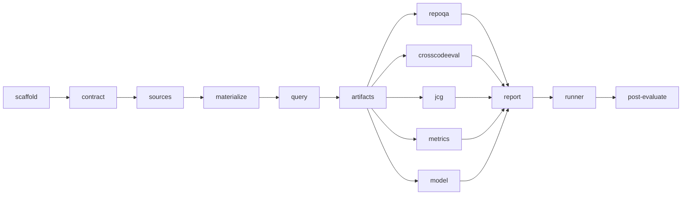

# Code Intelligence Industry Benchmark Implementation Plan

> **For SPUR orchestrator:** This plan is designed for `submit_plan(persist_as_epic=true)`.
> Each task becomes a beads issue with `spur:plan-task-id` and `spur:plan-id` labels.

**Source spec:** `docs/superpowers/specs/2026-08-27-code-intelligence-industry-benchmark-design.ipynb`
**Formal @spec cells:** `ce000003-2026-4a00-8b00-000000000003`, `ce000006-2026-4a00-8b00-000000000006`, `ce000008-2026-4a00-8b00-000000000008`, `ce000011-2026-4a00-8b00-000000000011`
**Design epic:** `bd-1atpy` (closed after user approval)
**Solver preflight:** `sol_fcb43e4969eb49ac` (`workflow@1`, bounded horizon 3, four rules passed)
**DAG optimization:** `sol_8363970d61c041f8` (Z3 Optimize, lexicographic minimum makespan 10 waves)
**Policy optimization:** `sol_ab7967975cd248d4`

**Goal:** Build a separate `spur-code-eval` crate that reproducibly evaluates RepoQA retrieval, CrossCodeEval evidence discovery, and JCG call-graph correctness through SPUR's public graph and analyst MCP modules.

**Architecture:** The crate normalizes pinned upstream items into one canonical contract, materializes each repository revision into an isolated root, invokes `GraphMcpModule` and `AnalystMcpModule` through their public `dispatch` seams, freezes content-addressed artifacts, and scores each suite independently. Deterministic publication is release-blocking; the model lane reads frozen contexts and remains advisory.

**Tech Stack:** Rust 2021, Tokio, Serde/JSON/TOML, Clap, SHA-256/BLAKE3, `spur-graph`, `spur-analyst`, `spur-mcp`, and repository-standard `scripts/spur-cargo` verification.

**Mandatory execution discipline:** Every behavioral task follows RED → observed expected failure → minimal GREEN → targeted suite. Constraint-shaped work additionally reloads the persisted pre-solve and performs a post-implementation solve. Never use bare `cargo`.

**Pre-change evidence:** `scripts/spur-cargo test -p spur-graph --test semantic_benchmark` passed on 2026-08-27 (`1 passed; 0 failed; 1 ignored`). The post-evaluation task reruns it unchanged.

---

### Task 1: Register the crate and prove the first public behavior

**Task ID:** `scaffold`

**Files:**
- Modify: `Cargo.toml`
- Modify: `Cargo.lock`
- Create: `crates/spur-code-eval/Cargo.toml`
- Create: `crates/spur-code-eval/src/lib.rs`
- Create: `crates/spur-code-eval/tests/scaffold.rs`

**Depends on:** none

**Acceptance Criteria:**
- [ ] `spur-code-eval` is a workspace member with workspace lints enabled and `dist = false`.
- [ ] The public `CONTRACT_VERSION` equals `"code-eval-v1"`.
- [ ] The scaffold test is observed failing before `CONTRACT_VERSION` exists and passing afterward.
- [ ] `scripts/spur-cargo test -p spur-code-eval --test scaffold` passes.

**Suggested Worker:** `codex` with profile `rust-engineer`, model `gpt-5.6-sol`, effort `xhigh` (explicit user selection).

**Scope Boundary:**
- IN scope: workspace registration, crate metadata, minimal library root, one smoke test.
- OUT of scope: adapters, source fetching, graph queries, metrics, CLI commands.
- If another workspace crate must change, emit `scope_drift` before editing.

**Implementation:**

1. RED: create `tests/scaffold.rs` first:

```rust
#[test]
fn exposes_versioned_contract_identity() {
    assert_eq!(spur_code_eval::CONTRACT_VERSION, "code-eval-v1");
}
```

2. Run `scripts/spur-cargo test -p spur-code-eval --test scaffold` and capture the expected missing-package or missing-symbol failure.
3. GREEN: register the package and add only `pub const CONTRACT_VERSION: &str = "code-eval-v1";` to `src/lib.rs`.
4. Rerun the targeted test, then `scripts/spur-cargo check -p spur-code-eval`.
5. Commit with `feat(spur-code-eval): <issue-id> scaffold benchmark crate`.

---

### Task 2: Define the canonical case contract

**Task ID:** `contract`

**Files:**
- Create: `crates/spur-code-eval/src/contract.rs`
- Modify: `crates/spur-code-eval/src/lib.rs`
- Create: `crates/spur-code-eval/tests/contract.rs`

**Depends on:** `scaffold`

**Acceptance Criteria:**
- [ ] `CodeEvalCase` records suite, case identity, language, contract version, dataset/repository pins, query policy, gold evidence, status, and raw upstream JSON.
- [ ] `CaseStatus` represents `eligible`, `unsupported`, and `invalid` with denominator-visible reasons.
- [ ] Canonical source identity is path plus byte span plus optional symbol ID and deduplicates deterministically.
- [ ] Serde round trips preserve unknown upstream fields inside `raw_upstream`.
- [ ] `scripts/spur-cargo test -p spur-code-eval --test contract` passes after an observed RED failure.

**Suggested Worker:** `codex` / `rust-engineer` / `gpt-5.6-sol` / `xhigh`.

**Scope Boundary:**
- IN scope: immutable domain types and validation local to one case.
- OUT of scope: filesystem access, network access, dataset-specific parsing, scoring.

**Implementation:**

1. RED: serialize and deserialize a case containing an unknown upstream field; assert equality and canonical evidence ordering.

```rust
#[test]
fn raw_provenance_and_status_survive_round_trip() {
    let case = eligible_fixture_with_raw_field("vendor_extension", 7);
    let encoded = serde_json::to_vec(&case).unwrap();
    let decoded: CodeEvalCase = serde_json::from_slice(&encoded).unwrap();
    assert_eq!(decoded, case);
    assert!(decoded.is_denominator_visible());
}
```

2. Observe the missing contract types fail.
3. GREEN: add `Suite`, `Language`, `ContentPin`, `RepositoryPin`, `QueryPolicy`, `SourceIdentity`, `GoldEvidence`, `CaseStatus`, and `CodeEvalCase`; reject empty IDs, mutable revisions, and invalid spans.
4. Run the contract test and crate check.
5. Commit with `feat(spur-code-eval): <issue-id> define canonical case contract`.

---

### Task 3: Validate pinned public-source manifests

**Task ID:** `sources`

**Files:**
- Create: `crates/spur-code-eval/src/sources.rs`
- Modify: `crates/spur-code-eval/src/lib.rs`
- Create: `crates/spur-code-eval/tests/validation.rs`
- Create: `crates/spur-code-eval/benchmarks/code_eval.toml`

**Depends on:** `contract`

**Acceptance Criteria:**
- [ ] The manifest contains real immutable revisions, hashes, licenses, expected record counts, language capabilities, and adapter contract versions for RepoQA, CrossCodeEval, and JCG.
- [ ] GitHub sources are indexed with `external_index_*` and inspected with `external_code_*` before their schema/parser assumptions are committed.
- [ ] Hash mismatch, count mismatch, missing license metadata, mutable revisions, and duplicate source identity are fatal validation errors.
- [ ] Unsupported languages remain explicit manifest capabilities rather than being removed.
- [ ] Tests are network-free and use local byte fixtures.

**Suggested Worker:** `codex` / `rust-engineer` / `gpt-5.6-sol` / `xhigh`.

**Scope Boundary:**
- IN scope: manifest schema, pin verification, license metadata, source byte validation.
- OUT of scope: repository checkout and adapter record translation.

**Implementation:**

1. RED: load a valid local manifest, then alter one byte and assert `SourceError::HashMismatch`; add count, license, and duplicate-identity failures.
2. Observe failures before `SourceManifest::validate_bytes` exists.
3. Use external indexing for each upstream GitHub revision, inspect the record-loading code/schema, and commit exact revisions and SHA-256 values in `code_eval.toml`.
4. GREEN: implement deterministic TOML parsing and `validate_bytes(&SourceSpec, &[u8]) -> Result<ValidatedSource, SourceError>`.
5. Run `scripts/spur-cargo test -p spur-code-eval --test validation`.
6. Commit with `feat(spur-code-eval): <issue-id> validate pinned benchmark sources`.

---

### Task 4: Materialize case-isolated repository revisions

**Task ID:** `materialize`

**Files:**
- Create: `crates/spur-code-eval/src/materialize.rs`
- Modify: `crates/spur-code-eval/src/lib.rs`
- Create: `crates/spur-code-eval/tests/materialize.rs`

**Depends on:** `sources`

**Acceptance Criteria:**
- [ ] Each case root is derived from dataset revision, repository commit, and subdirectory identity.
- [ ] Existing roots are accepted only when origin, HEAD, clean state, and materialization hash match.
- [ ] A root from another case or commit is rejected as `MixedRepositoryRoot`.
- [ ] Atomic temp-to-final promotion and recovery after an interrupted checkout are covered.
- [ ] Tests use temporary local git repositories and no network.

**Suggested Worker:** `codex` / `rust-engineer` / `gpt-5.6-sol` / `xhigh`.

**Scope Boundary:**
- IN scope: local git process wrapper, isolated root identity, atomic materialization.
- OUT of scope: remote dataset parsing and SPUR indexing.

**Implementation:**

1. RED: create two local repositories with different commits; assert that reusing case A's root for case B fails.

```rust
#[test]
fn rejects_cross_case_repository_root_reuse() {
    let err = materializer().verify_existing(&case_b_pin(), case_a_root()).unwrap_err();
    assert!(matches!(err, MaterializeError::MixedRepositoryRoot { .. }));
}
```

2. Observe the failure before the verifier exists.
3. GREEN: use non-interactive `git init/fetch/checkout/rev-parse/status` commands with explicit paths, hash tracked bytes, and rename the completed temp directory atomically.
4. Run `scripts/spur-cargo test -p spur-code-eval --test materialize`.
5. Commit with `feat(spur-code-eval): <issue-id> isolate repository materialization`.

---

### Task 5: Add the leakage-safe public SPUR query adapter

**Task ID:** `query`

**Files:**
- Create: `crates/spur-code-eval/src/query.rs`
- Modify: `crates/spur-code-eval/src/lib.rs`
- Create: `crates/spur-code-eval/tests/query.rs`

**Depends on:** `materialize`

**Acceptance Criteria:**
- [ ] `SpurQueryBackend` invokes `spur_graph::mcp::GraphMcpModule::dispatch` and `spur_analyst::mcp::AnalystMcpModule::dispatch` under `with_worktree_root_for_request`.
- [ ] Queries reject forbidden target names, hidden completions, and gold edge material before dispatch.
- [ ] Exact graph and semantic evidence responses normalize into stable `EvidenceHit` records with latency, bytes, estimated tokens, ambiguity, staleness, and answer status.
- [ ] Rankings deduplicate by `SourceIdentity` before deterministic tie-breaking and truncation.
- [ ] Fixture tests use a recording backend and prove forbidden fields never reach it.

**Suggested Worker:** `codex` / `rust-engineer` / `gpt-5.6-sol` / `xhigh`.

**Scope Boundary:**
- IN scope: query request construction, MCP module dispatch, response normalization, leakage guard.
- OUT of scope: suite-specific gold translation, metric calculation, model calls.

**Implementation:**

1. RED: pass a query containing the target symbol and assert `QueryError::ForbiddenLeakage` while the recording backend receives zero calls.
2. Observe RED, then define `QueryBackend`, `SpurQueryBackend`, `RetrievalRequest`, `EvidenceHit`, and `RetrievalResult`.
3. GREEN: dispatch `knowledge_context_pack_2`, `code_symbol_search`, and exact follow-ups with compact response format; scope every call to the materialized case root.
4. Sort by score descending, then canonical identity ascending; deduplicate before applying top-k.
5. Run `scripts/spur-cargo test -p spur-code-eval --test query`.
6. Commit with `feat(spur-code-eval): <issue-id> add leakage-safe SPUR query adapter`.

---

### Task 6: Freeze immutable run artifacts

**Task ID:** `artifacts`

**Files:**
- Create: `crates/spur-code-eval/src/artifacts.rs`
- Modify: `crates/spur-code-eval/src/lib.rs`
- Create: `crates/spur-code-eval/tests/lifecycle.rs`

**Depends on:** `query`

**Acceptance Criteria:**
- [ ] Run phases implement `Prepared → Frozen → DeterministicScored → ModelScored` and reject every out-of-order transition.
- [ ] `manifest.json`, `validation.json`, rankings, contexts, call graphs, metrics, optional model records, logs, and checksums have canonical paths.
- [ ] Frozen deterministic files are content-addressed, checksum-verified, and reopened read-only.
- [ ] Crash recovery accepts complete matching temp artifacts and rejects partial or mismatched artifacts.
- [ ] Implementation behavior corresponds to pre-solve `sol_fcb43e4969eb49ac`.

**Suggested Worker:** `codex` / `rust-engineer` / `gpt-5.6-sol` / `xhigh`.

**Scope Boundary:**
- IN scope: run directory layout, phase machine, atomic writes, freeze/read-only/checksum rules.
- OUT of scope: adapter parsing and scoring formulas.

**Implementation:**

1. Reload `sol_fcb43e4969eb49ac` and record its four workflow rules in the task audit.
2. RED: attempt deterministic scoring before freeze and mutation after freeze; assert typed transition/checksum errors.
3. Observe RED, then implement `RunPhase`, `RunManifest`, `ArtifactKind`, `ArtifactStore::write_atomic`, `freeze`, and `open_verified`.
4. GREEN: allow only the three solved transitions and make frozen writes fail before touching bytes.
5. Run `scripts/spur-cargo test -p spur-code-eval --test lifecycle`.
6. Commit with `feat(spur-code-eval): <issue-id> freeze immutable run artifacts`.

---

### Task 7: Implement the RepoQA adapter

**Task ID:** `repoqa`

**Files:**
- Create: `crates/spur-code-eval/src/repoqa.rs`
- Create: `crates/spur-code-eval/tests/repoqa.rs`
- Create: `crates/spur-code-eval/tests/fixtures/repoqa.json`

**Depends on:** `artifacts`

**Acceptance Criteria:**
- [ ] Natural-language descriptions become queries without target-name leakage.
- [ ] Pinned path/name/span gold resolves to a canonical SPUR symbol or makes the case invalid.
- [ ] Unsupported extractor languages remain denominator-visible.
- [ ] Best-target native model scoring inputs remain separate from retrieval scores.
- [ ] Target span resolution and leakage rejection tests pass.

**Suggested Worker:** `codex` / `rust-engineer` / `gpt-5.6-sol` / `xhigh`.

**Scope Boundary:** RepoQA parser and translation only; do not change shared query or artifact APIs.

**Implementation:**

1. RED: fixture description deliberately omits the target name; assert the built query omits it and the gold span resolves exactly.
2. Observe missing adapter failure.
3. GREEN: implement `RepoQaRecord`, `RepoQaAdapter::translate`, and `RepoQaModelScoreInput` using the canonical contract.
4. Run `scripts/spur-cargo test -p spur-code-eval --test repoqa`.
5. Commit with `feat(spur-code-eval): <issue-id> adapt RepoQA cases`.

---

### Task 8: Implement the CrossCodeEval evidence adapter

**Task ID:** `crosscodeeval`

**Files:**
- Create: `crates/spur-code-eval/src/crosscodeeval.rs`
- Create: `crates/spur-code-eval/tests/crosscodeeval.rs`
- Create: `crates/spur-code-eval/tests/fixtures/crosscodeeval.json`

**Depends on:** `artifacts`

**Acceptance Criteria:**
- [ ] Retrieval sees only current-file prefix/prompt and pinned repository state.
- [ ] `spur-derived-evidence-v1` resolves hidden-completion identifiers only after retrieval for scoring.
- [ ] The audit stores resolver version, positive spans, unresolved identifiers, and resolution trace.
- [ ] Missing derived evidence is `invalid`, never an empty positive set.
- [ ] Hidden-completion and target-identifier leakage tests prove zero backend calls.

**Suggested Worker:** `codex` / `rust-engineer` / `gpt-5.6-sol` / `xhigh`.

**Scope Boundary:** CrossCodeEval parser and evidence derivation only; do not alter shared query guard semantics.

**Implementation:**

1. RED: inject a hidden completion into retrieval input and assert rejection before dispatch; separately derive two cross-file definitions and one unresolved identifier.
2. Observe RED.
3. GREEN: implement `CrossCodeRecord`, `CrossCodeAdapter::retrieval_case`, and `derive_evidence_after_retrieval` with a versioned audit trace.
4. Run `scripts/spur-cargo test -p spur-code-eval --test crosscodeeval`.
5. Commit with `feat(spur-code-eval): <issue-id> derive CrossCodeEval evidence`.

---

### Task 9: Implement JCG normalization and expectation matching

**Task ID:** `jcg`

**Files:**
- Create: `crates/spur-code-eval/src/jcg.rs`
- Create: `crates/spur-code-eval/tests/jcg.rs`
- Create: `crates/spur-code-eval/tests/fixtures/jcg.json`

**Depends on:** `artifacts`

**Acceptance Criteria:**
- [ ] SPUR edges normalize to caller method, call-site line, declared target, and resolved targets.
- [ ] Direct expectations require direct edges; indirect expectations use pinned matcher semantics.
- [ ] Positive recall and forbidden-target diagnostics are emitted only when annotation semantics permit them.
- [ ] No global precision is computed for partial annotations.
- [ ] Python and JavaScript fixture expectations pass; unsupported Java remains visible.

**Suggested Worker:** `codex` / `rust-engineer` / `gpt-5.6-sol` / `xhigh`.

**Scope Boundary:** JCG translation and matching only; do not modify graph extraction.

**Implementation:**

1. RED: build one direct, one indirect, and one prohibited expectation; assert the exact three outcomes.
2. Observe missing matcher failure.
3. GREEN: implement `JcgRecord`, `NormalizedCallSite`, `ExpectationKind`, and `match_expectations` without treating partial annotations as exhaustive.
4. Run `scripts/spur-cargo test -p spur-code-eval --test jcg`.
5. Commit with `feat(spur-code-eval): <issue-id> normalize JCG expectations`.

---

### Task 10: Implement deterministic metrics and aggregation

**Task ID:** `metrics`

**Files:**
- Create: `crates/spur-code-eval/src/metrics.rs`
- Create: `crates/spur-code-eval/tests/metrics.rs`

**Depends on:** `artifacts`

**Acceptance Criteria:**
- [ ] Hit@1/5/10, Recall@1/5/10, MRR, context coverage, token-budget precision, answer rate, and exact denominators match hand-calculated fixtures.
- [ ] p50/p95 latency, evidence bytes/tokens, unsupported, invalid, unresolved, ambiguity, and staleness are reported.
- [ ] Ties are resolved using the frozen ranking order; metrics never reorder input.
- [ ] Aggregation publishes per case, language/repository, suite/slice, and non-blended dashboard summaries.
- [ ] Empty eligible denominator returns a typed error instead of NaN.

**Suggested Worker:** `codex` / `rust-engineer` / `gpt-5.6-sol` / `xhigh`.

**Scope Boundary:** Pure metric functions and aggregation types only; no filesystem or network access.

**Implementation:**

1. RED: add a three-case fixture with known ranks `[1, 3, missing]`; assert Hit@1 `1/3`, Hit@5 `2/3`, MRR `(1 + 1/3) / 3`, and denominator counters.
2. Observe RED.
3. GREEN: implement exact integer counters plus finite floating projections; use deterministic nearest-rank percentiles.
4. Run `scripts/spur-cargo test -p spur-code-eval --test metrics`.
5. Commit with `feat(spur-code-eval): <issue-id> compute deterministic benchmark metrics`.

---

### Task 11: Add the advisory model lane

**Task ID:** `model`

**Files:**
- Create: `crates/spur-code-eval/src/model.rs`
- Create: `crates/spur-code-eval/tests/model.rs`

**Depends on:** `artifacts`

**Acceptance Criteria:**
- [ ] `ModelBackend` consumes frozen contexts read-only and records provider/model/prompt/tokenizer/seed/budget/cache identity.
- [ ] Missing credentials, budget exhaustion, HTTP failure, and incomplete output become `model_pending` or `model_failed` without changing deterministic files.
- [ ] Resume skips checksum-matching completed records and retries only incomplete cases.
- [ ] No-context, lexical, SPUR, and oracle context variants remain distinct.
- [ ] Tests use a deterministic fake backend and prove deterministic checksum stability.

**Suggested Worker:** `codex` / `rust-engineer` / `gpt-5.6-sol` / `xhigh`.

**Scope Boundary:** Model request/cache state and native score record plumbing; no default live provider credential.

**Implementation:**

1. RED: make a fake backend fail halfway; assert deterministic checksums are unchanged and resume calls only the unfinished case.
2. Observe RED.
3. GREEN: implement `ModelBackend`, `ModelRunConfig`, `ContextVariant`, `ModelCaseStatus`, cache identity, and resume selection.
4. Run `scripts/spur-cargo test -p spur-code-eval --test model`.
5. Commit with `feat(spur-code-eval): <issue-id> add advisory model lane`.

---

### Task 12: Wire suite modules and render release reports

**Task ID:** `report`

**Files:**
- Modify: `crates/spur-code-eval/src/lib.rs`
- Create: `crates/spur-code-eval/src/report.rs`
- Create: `crates/spur-code-eval/tests/report.rs`

**Depends on:** `repoqa`, `crosscodeeval`, `jcg`, `metrics`, `model`

**Acceptance Criteria:**
- [ ] All suite, metric, and model modules are exported and compile together.
- [ ] Release policy yields reject, deterministic publication, or full publication exactly as the approved formal contract specifies.
- [ ] Reports verify every checksum and include SPUR revision/dirty state, platform, command, timings, peak RSS, index bytes, pins, query-policy hash, scorer versions, and exact denominators.
- [ ] Model absence cannot invalidate a passing deterministic report.
- [ ] Unlike suite-native metrics remain separate in JSON output.

**Suggested Worker:** `codex` / `rust-engineer` / `gpt-5.6-sol` / `xhigh`.

**Scope Boundary:** module wiring, release-status projection, and report serialization only.

**Implementation:**

1. RED: enumerate the release truth table from `CODE-EVAL-RELEASE-POLICY`, including deterministic pass plus absent model → `publish_deterministic`.
2. Observe RED.
3. GREEN: implement `ReleaseStatus`, `ReleaseInputs::status`, `BenchmarkReport`, and checksum-validated rendering.
4. Run `scripts/spur-cargo test -p spur-code-eval --test report` and the full crate test suite.
5. Commit with `feat(spur-code-eval): <issue-id> render checksum-verified reports`.

---

### Task 13: Implement the command surface and fixture runner

**Task ID:** `runner`

**Files:**
- Modify: `crates/spur-code-eval/src/lib.rs`
- Create: `crates/spur-code-eval/src/runner.rs`
- Create: `crates/spur-code-eval/src/main.rs`
- Create: `crates/spur-code-eval/tests/runner.rs`

**Depends on:** `report`

**Acceptance Criteria:**
- [ ] Clap exposes `validate`, `index`, `retrieve`, `score`, `model`, `resume`, and `report`.
- [ ] Fixture mode runs without network or model credentials through validate → index/query fixture backend → freeze → deterministic score → report.
- [ ] Commands refuse skipped phases and preserve existing frozen artifacts.
- [ ] A deterministic report exits successfully while model work is pending.
- [ ] Every command records reproducibility metadata and returns typed contextual errors.

**Suggested Worker:** `codex` / `rust-engineer` / `gpt-5.6-sol` / `xhigh`.

**Scope Boundary:** orchestration and CLI only; do not duplicate adapter, metric, or artifact logic.

**Implementation:**

1. RED: invoke the binary against fixture data, assert missing phase rejection, then assert the complete deterministic pipeline produces verified report files.
2. Observe RED.
3. GREEN: implement `Cli`, `Command`, `Runner`, and one method per phase; keep `main` limited to parse/run/error rendering.
4. Run `scripts/spur-cargo test -p spur-code-eval --test runner` and `scripts/spur-cargo run -p spur-code-eval -- --help`.
5. Commit with `feat(spur-code-eval): <issue-id> add benchmark command runner`.

---

### Task 14: Perform post-implementation solver and regression evaluation

**Task ID:** `post-evaluate`

**Files:**
- No planned writes.

**Depends on:** `runner`

**Acceptance Criteria:**
- [ ] Reload preflight `sol_fcb43e4969eb49ac` and verify its solver version, horizon, rules, and `sat/pass` result.
- [ ] Encode the shipped `RunPhase` transitions and release-policy behavior from source, run a persisted post-solve, and report its new `solve_id`.
- [ ] Post-solve passes the same four workflow rules; any `unknown`, `timeout`, or mismatch fails the task.
- [ ] All crate tests, clippy, formatting, the unchanged extractor semantic benchmark, and fixture end-to-end run pass.
- [ ] The four notebook proof reports remain `verified`, `proof_fresh = true`, and 28/28 matched.
- [ ] A `[[spur-audit v1]]` completion record contains pre/post solve IDs and exact command outputs.

**Suggested Worker:** `codex` / `rust-engineer` / `gpt-5.6-sol` / `xhigh`.

**Scope Boundary:** Evidence collection only. Do not edit source, tests, the notebook, manifests, or frozen artifacts. A failure returns the plan to the owning implementation task.

**Implementation:**

1. Load `sol_fcb43e4969eb49ac` with `get_solve_result`.
2. Read the shipped transition and release-policy source; call `solve_rule_spec` before `solve_rules` and persist the post result.
3. Run:

```bash
scripts/spur-cargo fmt --all -- --check
scripts/spur-cargo test -p spur-code-eval
SPUR_REMOTE=1 scripts/spur-cargo clippy -p spur-code-eval --all-targets -- -D warnings
scripts/spur-cargo test -p spur-graph --test semantic_benchmark
scripts/spur-cargo run -p spur-code-eval -- --help
```

4. Inspect the authoritative notebook proof reports without mutating cells.
5. Emit the completion audit with exact pass/fail evidence and the post-solve ID. No commit is required because this task declares no writes.

---

## Dependency DAG



The five implementation branches after `artifacts` have disjoint planned write sets. The report task is their explicit join, preventing concurrent edits to `lib.rs`.

Z3 Optimize validated every finish-to-start edge and produced the minimum 10-wave schedule under unit task durations: shared seam waves 0–5, the five independent modules at wave 6, report at 7, runner at 8, and post-evaluation at 9. Evidence is persisted as `sol_8363970d61c041f8`.

## Self-review

- Spec coverage: canonical contracts, source pins, isolated roots, public SPUR queries, all three adapters, metrics, immutable artifacts, advisory model lane, release reporting, CLI phases, and solver pre/post evidence each map to a task.
- Type consistency: adapter modules consume `contract`, `query`, and `artifacts`; report joins suite-native outputs without redefining them.
- DAG validity: acyclic, one serialized shared-seam chain, one five-way parallel wave, one report join, one terminal verification task.
- Collision check: only serialized tasks modify `src/lib.rs`; parallel tasks write distinct module/test/fixture files.
- Placeholder check: every task has concrete files, test-first behavior, commands, acceptance criteria, and a bounded scope.
