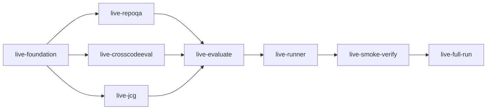

# Code Intelligence Live Benchmark Runner Implementation Plan

> **For SPUR orchestrator:** Submit this DAG through the plan engine. Workers must use
> `scripts/spur-cargo`, follow RED → GREEN, commit each completed task, and preserve
> unrelated worktree changes.

**Source design:** `docs/superpowers/specs/2026-08-27-code-intelligence-industry-benchmark-design.ipynb`
**Formal @spec cells:** `ce000003-2026-4a00-8b00-000000000003`, `ce000006-2026-4a00-8b00-000000000006`, `ce000008-2026-4a00-8b00-000000000008`, `ce000011-2026-4a00-8b00-000000000011`
**Original implementation plan:** `docs/superpowers/plans/2026-08-27-code-intelligence-industry-benchmark.md`
**Approved design epic:** `bd-1atpy` (closed)
**Live-run issue:** `bd-11qh`
**Source-readiness solve:** `sol_3e2e00203455443c` (`sat`)
**Premature-publication counterexample solve:** `sol_8fbd122964d94121` (`unsat`)

**Goal:** Replace the fixture-only command boundary with a resumable live runner that
normalizes the three pinned upstream datasets, materializes immutable repository
snapshots, exercises SPUR's public graph/analyst query modules, scores all eligible
cases, and emits a checksum-verified report whose release status cannot overstate a
partial run.

**Validated source evidence:**

| Suite | Total | Supported | SHA-256 |
|---|---:|---:|---|
| RepoQA | 600 | 500 | `c050a2ad90a7df89d9dc1f1c3b3b20683edd20a56293b35fcaae43dec115d681` |
| CrossCodeEval | 9,928 | 6,021 | `d65c0316f63df3434deac3b67ae95478cbe00c706c14ff1a91e1173619962b88` |
| JCG | 238 | 126 | `db109e8628f4279d2847d803c0c922a07d64b5c6c242cbe9f92c474555f4b4f8` |

CrossCodeEval contains 1,002 distinct repository revisions. Its archive README says
the repository metadata includes a commit hash; every observed repository token ends
in a seven-hex commit prefix. Removing that suffix maps every token uniquely to one
`owner/repository` entry in `LICENSES/project_license_map.txt`. The live lock stage
must resolve and persist the full object ID before a case becomes eligible.

**Scale decision:** Materialize and index once per exact `(repository URI, full commit,
subdirectory, materialization hash)` identity, keep that root read-only while cases are
evaluated, and isolate all per-case requests and artifacts. Never reuse a root across a
different immutable identity. This preserves the leakage boundary while avoiding one
clone/index per case.

**Publication invariant:** A user-supplied case filter or limit is allowed for smoke
testing, but the report must identify the run as partial and release policy must reject
`publish_deterministic`/`publish_full` until every manifest-eligible case has a terminal
deterministic result. Model absence remains advisory only after deterministic coverage
is complete.

---

### Task 1: Scaffold the live module and immutable run lock

**Task ID:** `live-foundation`
**Estimate:** 25 minutes

**Files:**
- Modify: `crates/spur-code-eval/Cargo.toml`
- Modify: `crates/spur-code-eval/src/lib.rs`
- Create: `crates/spur-code-eval/src/live/mod.rs`
- Create stubs: `crates/spur-code-eval/src/live/{repoqa,crosscodeeval,jcg,evaluate}.rs`
- Create: `crates/spur-code-eval/tests/live_foundation.rs`

**Depends on:** none

**Acceptance Criteria:**
- [ ] `LiveRunConfig` requires validated local source archives, a source-lock path, a repository cache root, and a run directory.
- [ ] `LiveSourceLock` stores dataset hashes plus full immutable repository object IDs, materialization hashes, licenses, and resolution provenance in canonical order.
- [ ] Duplicate repository identities, short/unresolved commits, hash drift, mutable URIs, and lock/source mismatch are typed fatal errors.
- [ ] An optional suite/case filter is explicitly represented as partial-run metadata; no implicit default cap exists.
- [ ] Tests first fail for absent lock validation, then pass network-free.

**Implementation:**
1. RED: add round-trip, short-commit rejection, duplicate identity, source-hash drift, and partial-run classification tests.
2. Run `scripts/spur-cargo test -p spur-code-eval --test live_foundation` and record the expected compile/test failure.
3. GREEN: implement the smallest canonical config/lock types and validators; create only compile-safe suite/evaluator stubs.
4. Run the targeted test and `scripts/spur-cargo check -p spur-code-eval`.
5. Commit `feat(spur-code-eval): <issue-id> define live benchmark lock`.

**Scope boundary:** Do not parse suite records, access the network, materialize repositories, or modify the existing fixture runner.

---

### Task 2: Normalize and materialize RepoQA source records

**Task ID:** `live-repoqa`
**Estimate:** 25 minutes

**Files:**
- Modify: `crates/spur-code-eval/src/live/repoqa.rs`
- Create: `crates/spur-code-eval/tests/live_repoqa.rs`

**Depends on:** `live-foundation`

**Acceptance Criteria:**
- [ ] The pinned gzip JSON is flattened deterministically across language, repository, and needle order without loading hidden target names into query text.
- [ ] Repository URI, complete commit, entrypoint/subdirectory, upstream source symbols, and unknown fields are retained.
- [ ] Embedded source content can be written to a safe snapshot root; absolute paths, traversal, duplicates, and content-hash mismatch are rejected.
- [ ] Exactly 600 records normalize and the capability policy marks exactly 500 eligible for the validated archive.
- [ ] Unit fixtures cover malformed records, unsupported languages, path safety, and deterministic ordering.

**Implementation:**
1. RED: assert flattening/counts on a miniature upstream-shaped gzip fixture and reject `../target.rs`.
2. Observe the failing targeted test.
3. GREEN: implement streaming archive decode, record normalization, safe snapshot write, symbol conversion, and immutable pin attachment.
4. Run `scripts/spur-cargo test -p spur-code-eval --test live_repoqa`.
5. Commit `feat(spur-code-eval): <issue-id> ingest live RepoQA data`.

**Scope boundary:** Use existing `RepoQaAdapter`; do not change shared query, report, or CLI code.

---

### Task 3: Normalize CrossCodeEval and resolve repository provenance

**Task ID:** `live-crosscodeeval`
**Estimate:** 30 minutes

**Files:**
- Modify: `crates/spur-code-eval/src/live/crosscodeeval.rs`
- Create: `crates/spur-code-eval/tests/live_crosscodeeval.rs`

**Depends on:** `live-foundation`

**Acceptance Criteria:**
- [ ] The tar.xz reader accepts only the four canonical `*/line_completion.jsonl` members plus the license map and ignores oracle/retrieval result members.
- [ ] Repository tokens split into normalized project identity plus seven-hex prefix; all project identities map uniquely to the license map.
- [ ] A resolver boundary turns each prefix into a full object ID and tree/materialization hash, records its provenance in `LiveSourceLock`, and is injectable for network-free tests.
- [ ] Existing complete lock entries resume without resolver calls; conflicting or ambiguous resolution is fatal.
- [ ] Exactly 9,928 records normalize and capability policy marks exactly 6,021 eligible for the validated archive.

**Implementation:**
1. RED: add miniature tar.xz fixtures covering a valid mapping, an ambiguous/missing project, conflicting full commits, and lock-resume with zero resolver calls.
2. Observe the failing targeted test.
3. GREEN: implement safe archive iteration, license-map parsing, raw JSONL normalization, deterministic project mapping, and resolver trait/process implementation.
4. Resolve full commits using non-interactive Git operations with explicit paths; never accept the seven-character prefix as a `RepositoryPin`.
5. Run `scripts/spur-cargo test -p spur-code-eval --test live_crosscodeeval`.
6. Commit `feat(spur-code-eval): <issue-id> ingest live CrossCodeEval data`.

**Scope boundary:** Do not use oracle retrieval files as SPUR results and do not change the existing CrossCode adapter.

---

### Task 4: Normalize JCG Markdown and pinned source roots

**Task ID:** `live-jcg`
**Estimate:** 25 minutes

**Files:**
- Modify: `crates/spur-code-eval/src/live/jcg.rs`
- Create: `crates/spur-code-eval/tests/live_jcg.rs`

**Depends on:** `live-foundation`

**Acceptance Criteria:**
- [ ] The pinned tar.gz is unpacked with traversal/link safety and one immutable JCG repository identity.
- [ ] Markdown `## case` sections, prose prompts, JSON direct/indirect links, language fences, and in-fence source paths normalize deterministically.
- [ ] Malformed JSON, missing/duplicate source paths, unknown fence languages, and out-of-root links remain denominator-visible invalid/unsupported cases.
- [ ] Exactly 238 records normalize and capability policy marks exactly 126 eligible for the validated archive.
- [ ] Tests cover multi-section parsing, link order normalization, safe paths, and unknown fields.

**Implementation:**
1. RED: add a two-case Markdown/archive fixture and malformed/path-traversal cases.
2. Observe the failing targeted test.
3. GREEN: implement safe extraction, section parsing, expectation translation, pin attachment, and stable ordering.
4. Run `scripts/spur-cargo test -p spur-code-eval --test live_jcg`.
5. Commit `feat(spur-code-eval): <issue-id> ingest live JCG data`.

**Scope boundary:** Use existing `JcgAdapter`; do not change report or CLI code.

---

### Task 5: Execute live cases through cached public SPUR indexes

**Task ID:** `live-evaluate`
**Estimate:** 30 minutes

**Files:**
- Modify: `crates/spur-code-eval/src/live/evaluate.rs`
- Create: `crates/spur-code-eval/tests/live_evaluate.rs`

**Depends on:** `live-repoqa`, `live-crosscodeeval`, `live-jcg`

**Acceptance Criteria:**
- [ ] Cases group only by exact immutable repository identity and share one read-only checkout/index within that group.
- [ ] A different commit, subdirectory, or materialization hash never reuses the same root/index.
- [ ] Supported records dispatch through `SpurQueryBackend` and the existing suite adapters; unsupported/invalid records never dispatch but remain denominator-visible.
- [ ] Per-case ranking/context/call-graph records are written atomically and can be resumed after interruption without re-querying verified cases.
- [ ] Backend failures record a typed case failure and do not silently remove a denominator member.

**Implementation:**
1. RED: use a recording backend and two same-revision plus one different-revision cases; assert two materializations/index preparations, three isolated case artifacts, and no hidden fields in requests.
2. Observe the failing test.
3. GREEN: implement deterministic grouping, materialization/index preparation, suite dispatch, per-case checkpointing, and resume verification.
4. Run `scripts/spur-cargo test -p spur-code-eval --test live_evaluate`.
5. Commit `feat(spur-code-eval): <issue-id> execute live benchmark cases`.

**Scope boundary:** Do not add concurrency constants or publication rules. Sequential execution is the correctness baseline; any later concurrency must be explicit and solved/measured separately.

---

### Task 6: Wire live commands, aggregation, and truthful publication

**Task ID:** `live-runner`
**Estimate:** 30 minutes

**Files:**
- Modify: `crates/spur-code-eval/src/runner.rs`
- Modify: `crates/spur-code-eval/src/report.rs`
- Modify: `crates/spur-code-eval/tests/runner.rs`
- Create: `crates/spur-code-eval/tests/live_runner.rs`

**Depends on:** `live-evaluate`

**Acceptance Criteria:**
- [ ] CLI accepts the three local source archives, lock/cache roots, and optional explicit filters without requiring `--fixture`.
- [ ] `validate` normalizes/counts sources; `index` prepares immutable roots/indexes; `retrieve`, `score`, `resume`, and `report` operate on verified checkpoints.
- [ ] Fixture behavior and artifact compatibility remain unchanged.
- [ ] Reports distinguish total, eligible, answered, failed, skipped, unsupported, invalid, pending, and filtered cases per suite.
- [ ] Any filter, missing eligible result, or failed deterministic case prevents publish status; a complete deterministic pass with absent model remains `publish_deterministic`.

**Implementation:**
1. RED: add CLI tests proving nonfixture input is accepted, partial runs cannot publish, incomplete denominators cannot publish, and fixture reports remain byte-stable where contractually expected.
2. Observe the failing targeted tests.
3. GREEN: extend `Cli`/`Runner` without duplicating suite logic; aggregate verified live checkpoints into existing metric/report types.
4. Run `scripts/spur-cargo test -p spur-code-eval --test runner --test live_runner` and `scripts/spur-cargo run -p spur-code-eval -- --help`.
5. Commit `feat(spur-code-eval): <issue-id> run live benchmark datasets`.

**Scope boundary:** No model provider integration and no automatic publication/upload.

---

### Task 7: Prove the live path with real source smoke and regression gates

**Task ID:** `live-smoke-verify`
**Estimate:** 25 minutes

**Files:**
- No planned source writes.
- Generated ignored evidence only under `.spur/bench-evidence/bd-11qh-live/`.

**Depends on:** `live-runner`

**Acceptance Criteria:**
- [ ] Validate the three already-pinned real archives and reproduce 600/500, 9,928/6,021, and 238/126 counts and hashes.
- [ ] Run at least one eligible real case from each suite through materialization, public SPUR query dispatch, deterministic scoring, resume, report generation, and checksum verification.
- [ ] The smoke report is explicitly partial and non-publishable.
- [ ] `fmt --check`, all 126 pre-existing tests plus new tests, Clippy, rustdoc, CLI help, and `spur-graph` semantic benchmark pass.
- [ ] Recheck the publication invariant with the solver; `unknown`/`timeout` is not success.

**Commands:**
```bash
scripts/spur-cargo fmt --all -- --check
scripts/spur-cargo test -p spur-code-eval
SPUR_REMOTE=1 scripts/spur-cargo clippy -p spur-code-eval --all-targets -- -D warnings
scripts/spur-cargo doc -p spur-code-eval --no-deps
scripts/spur-cargo test -p spur-graph --test semantic_benchmark
scripts/spur-cargo run -p spur-code-eval -- --help
```

**Scope boundary:** Evidence collection only. Do not edit production/test source to make a red command pass; route failures back to the owning task.

---

### Task 8: Run the complete deterministic benchmark and freeze evidence

**Task ID:** `live-full-run`
**Estimate:** 30 minutes to launch/audit; runtime is data-dependent and resumable

**Files:**
- No planned source writes.
- Generated ignored evidence only under `.spur/bench-evidence/bd-11qh-live-full/` and the configured repository cache.

**Depends on:** `live-smoke-verify`

**Acceptance Criteria:**
- [ ] Resolve and lock every repository needed by all eligible records; every full commit and materialization hash verifies on resume.
- [ ] Execute all 500 RepoQA, 6,021 CrossCodeEval, and 126 JCG eligible deterministic cases, with every other source record represented by a terminal denominator status.
- [ ] Zero eligible cases remain pending or filtered; failures remain explicit and make publication reject.
- [ ] Generate stable JSON report, frozen deterministic artifacts, SHA-256 checksum file, and independent checksum verification output.
- [ ] Record exact elapsed time, peak RSS, cache/index bytes, SPUR revision/dirty state, source pins, counts, suite-native metrics, and release decision on `bd-11qh`.
- [ ] Emit the completion audit only after review and verification; do not call the result an industry benchmark if completeness or integrity fails.

**Scope boundary:** Run/evidence only. Network or upstream removals are recorded as explicit external blockers; never substitute fixture/oracle results.

---

## Dependency DAG



The three normalization tasks modify disjoint suite modules after the foundation
creates compile-safe stubs. Shared orchestration is serialized after their join. The
two evidence tasks declare no source writes.

## Self-review

- Spec coverage: immutable pins, safe materialization, public SPUR queries, all three
  adapters, suite-native metrics, immutable artifacts, truthful release policy, CLI
  phases, resume, and solver evidence are represented.
- Dataset fidelity: no oracle retrieval output is accepted as SPUR output; CrossCode
  short hashes are resolved to full object IDs; raw unknown fields are retained.
- Scale: repository roots/indexes reuse only exact immutable identities; no guessed
  concurrency or case cap is introduced.
- DAG validity: acyclic, three independent suite branches, one shared evaluator join,
  one runner integration, then smoke and full evidence.
- Collision check: parallel tasks have disjoint write files; shared runner/report work
  is serialized.
- Completion truth: smoke is necessarily partial and cannot publish; only the complete
  terminal task may produce a publishable deterministic report.
