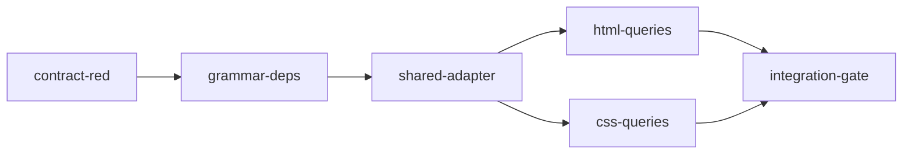

# HTML and CSS Extraction Implementation Plan

> **For SPUR orchestrator:** This plan is designed for `submit_plan(persist_as_epic=true)`.
> Each task becomes a beads issue with `spur:plan-task-id` and `spur:plan-id` labels.

**Source spec:** `docs/superpowers/specs/2026-08-30-html-css-extraction-design.ipynb`
**Formal @spec cells:** `HTML-CSS-ROUTING`, `HTML-CSS-RELEASE`
**Design epic:** `bd-rnwv` (closed)

**Goal:** Add standalone, low-noise HTML and CSS extraction to `spur-graph` for `.html`, `.htm`, and `.css` files.

**Architecture:** Extend the existing registry-driven tree-sitter pipeline with two grammar-backed `Language` variants and SPUR-owned query sets. Add one generic `@link` capture channel beside the existing `@import` channel so a language can emit both `Imports` and `Links` without a specialized extractor; all definitions, containment, stable IDs, pending-edge resolution, and batch failure behavior remain shared.

**Tech Stack:** Rust 2021, `tree-sitter 0.25`, `tree-sitter-html 0.23.2`, `tree-sitter-css 0.25.0`, tree-sitter query files, existing `spur-graph` test helpers, `scripts/spur-cargo`.

---

## File structure map

| File | Responsibility |
|---|---|
| `crates/spur-graph/Cargo.toml` | Declare the two exact grammar dependencies. |
| `Cargo.lock` | Lock compatible transitive versions. |
| `crates/spur-graph/src/extract/languages.rs` | Add language variants, grammar/config routing, registry rows, definition/relation contracts, the generic `@link` adapter, and focused tests. |
| `crates/spur-graph/src/extract/tree_sitter.rs` | Extend the exhaustive symbol-query policy and add end-to-end extraction fixtures. |
| `crates/spur-graph/queries/html/tags.scm` | Capture ID-bearing HTML regions as sections. |
| `crates/spur-graph/queries/html/spur-edges.scm` | Capture HTML imports and links. |
| `crates/spur-graph/queries/css/tags.scm` | Capture CSS rule sets, keyframes, and custom properties. |
| `crates/spur-graph/queries/css/spur-edges.scm` | Capture CSS `@import` and `url(...)` targets. |
| `crates/spur-graph/queries/README.md` | Synchronize human-readable definition/relation coverage and scope notes. |

The two language query tasks deliberately modify disjoint files and may run in parallel after the shared adapter task. The final integration task is the first point at which the full crate suite is expected to be green; earlier tasks have explicitly named targeted tests and known-red downstream contracts.

---

### Task 1: Add executable RED contracts

**Task ID:** `contract-red`

**Files:**
- Modify: `crates/spur-graph/src/extract/languages.rs:2238-2887`
- Modify: `crates/spur-graph/src/extract/tree_sitter.rs:4064-end`

**Depends on:** none

**Acceptance Criteria:**
- [ ] Tests use only existing public/crate-local APIs and compile before any HTML/CSS production variant exists.
- [ ] HTML and CSS routing tests fail because `Language::from_path` returns `None`.
- [ ] HTML and CSS extraction tests fail because the expected nodes/edges are absent, not because of a typo or fixture-read error.
- [ ] Negative assertions cover ordinary tags/classes/declarations and excluded extensions.
- [ ] Malformed fixtures demand a file node so unsupported-file skipping cannot make the tolerance test pass vacuously.
- [ ] The intentional RED commit contains no production changes.

**Suggested Worker:** codex

**Scope Boundary:**
- IN scope: test modules in the two listed files.
- OUT of scope: dependencies, enum variants, registry/config code, query files, README.
- If a test cannot be written against the current API without production edits, emit `scope_drift` before changing scope.

**Implementation:**

- [ ] **Step 1: Add path and query-contract tests that avoid referencing missing variants**

```rust
#[test]
fn html_paths_route_to_html_language() {
    for path in ["index.html", "fragment.htm", "UPPER.HTML"] {
        let language = Language::from_path(Path::new(path));
        assert_eq!(language.map(Language::label), Some("html"), "{path}");
    }
    for path in ["theme.scss", "theme.less", "view.vue", "view.svelte"] {
        assert_eq!(Language::from_path(Path::new(path)), None, "{path}");
    }
}

#[test]
fn css_paths_route_to_css_language() {
    for path in ["site.css", "UPPER.CSS"] {
        let language = Language::from_path(Path::new(path));
        assert_eq!(language.map(Language::label), Some("css"), "{path}");
    }
}

fn assert_path_query_contract(
    path: &str,
    expected_definitions: &[&str],
    expected_relations: &[&str],
) {
    let language = Language::from_path(Path::new(path)).expect("language must be registered");
    let config = language.config();
    assert_eq!(
        compiled_definition_captures(language.label(), &config),
        expected_definitions.iter().map(|value| (*value).to_owned()).collect()
    );
    assert_eq!(
        compiled_relation_predicates(language, language.label(), &config),
        relation_set(expected_relations)
    );
}

#[test]
fn html_query_contract_is_complete() {
    assert_path_query_contract(
        "index.html",
        &["definition.section"],
        &["contains", "defines", "imports", "links"],
    );
}

#[test]
fn css_query_contract_is_complete() {
    assert_path_query_contract(
        "site.css",
        &["definition.constant", "definition.function", "definition.section"],
        &["contains", "defines", "imports", "links"],
    );
}
```

- [ ] **Step 2: Add end-to-end HTML and CSS fixtures through `build_facts`**

```rust
#[test]
fn html_extraction_emits_low_noise_symbols_and_relations() {
    let dir = tempfile::tempdir().expect("tempdir");
    fs::write(dir.path().join("index.html"), r#"
<main id="app">
  <script src="app.js"></script>
  <link href="theme.css" rel="stylesheet">
  <a href="/docs/start.html">Docs</a>
  
  <div class="not-a-symbol">content</div>
  <style>.embedded { color: red; }</style>
</main>
"#).expect("write HTML fixture");

    let (facts, _) = build_facts(dir.path(), None).expect("extract HTML");
    assert!(facts.nodes.iter().any(|node| node.kind == NodeKind::Section && node.label == "app"));
    assert!(!facts.nodes.iter().any(|node| node.label == "hero" || node.label == "not-a-symbol"));
    for (relation, target) in [
        (RelationKind::Imports, "app.js"),
        (RelationKind::Imports, "theme.css"),
        (RelationKind::Links, "/docs/start.html"),
        (RelationKind::Links, "hero.png"),
    ] {
        assert!(facts.edges.iter().any(|edge| {
            edge.relation == relation && edge.target_label.as_deref() == Some(target)
        }), "missing {relation:?} edge to {target}");
    }
}

#[test]
fn css_extraction_emits_low_noise_symbols_and_relations() {
    let dir = tempfile::tempdir().expect("tempdir");
    fs::write(dir.path().join("site.css"), r#"
@import "base.css";
@keyframes fade { from { opacity: 0; } to { opacity: 1; } }
:root { --brand: #f00; color: red; }
.card > img { background-image: url("../img/card.png"); }
"#).expect("write CSS fixture");

    let (facts, _) = build_facts(dir.path(), None).expect("extract CSS");
    for (kind, label) in [
        (NodeKind::Function, "fade"),
        (NodeKind::Constant, "--brand"),
        (NodeKind::Section, ":root"),
        (NodeKind::Section, ".card > img"),
    ] {
        assert!(facts.nodes.iter().any(|node| node.kind == kind && node.label == label));
    }
    assert!(!facts.nodes.iter().any(|node| node.label == "color"));
    assert!(facts.edges.iter().any(|edge| edge.relation == RelationKind::Imports
        && edge.target_label.as_deref() == Some("base.css")));
    assert!(facts.edges.iter().any(|edge| edge.relation == RelationKind::Links
        && edge.target_label.as_deref() == Some("../img/card.png")));
}
```

Add companion assertions for source spans, `Contains`/`Defines`, nearest-containing-symbol edge origins, stylesheet attribute order, unquoted HTML attributes, CSS unquoted `url(...)`, empty/data URL rejection, fragment preservation, and malformed HTML/CSS file-node retention. Keep HTML and CSS as separately filterable test names.

- [ ] **Step 3: Run the tests and record the expected RED failures**

```bash
scripts/spur-cargo test -p spur-graph html_paths_route_to_html_language -- --nocapture
scripts/spur-cargo test -p spur-graph css_paths_route_to_css_language -- --nocapture
scripts/spur-cargo test -p spur-graph html_extraction_emits_low_noise_symbols_and_relations -- --nocapture
scripts/spur-cargo test -p spur-graph css_extraction_emits_low_noise_symbols_and_relations -- --nocapture
```

Expected: each named feature test fails for missing routing or missing facts. Existing tests outside these new names remain unchanged.

- [ ] **Step 4: Commit the intentional RED contracts**

```bash
git add crates/spur-graph/src/extract/languages.rs crates/spur-graph/src/extract/tree_sitter.rs
git commit -m "test(spur-graph): contract-red specify HTML CSS extraction"
```

---

### Task 2: Add exact grammar dependencies

**Task ID:** `grammar-deps`

**Files:**
- Modify: `crates/spur-graph/Cargo.toml:56-72`
- Modify: `Cargo.lock`

**Depends on:** `contract-red`

**Acceptance Criteria:**
- [ ] `tree-sitter-html = "0.23.2"` and `tree-sitter-css = "0.25.0"` are declared exactly.
- [ ] The lockfile is generated by `scripts/spur-cargo`, not edited manually.
- [ ] Both crates coexist with the workspace's `tree-sitter 0.25` API.
- [ ] `scripts/spur-cargo check -p spur-graph` exits successfully.

**Suggested Worker:** codex

**Scope Boundary:**
- IN scope: dependency declarations and resulting lockfile rows.
- OUT of scope: extractor Rust code, queries, tests, README, dependency upgrades unrelated to these two crates.
- Any unrelated lockfile churn must be reverted or reported as `scope_drift`.

**Implementation:**

- [ ] **Step 1: Confirm the RED contracts remain the only expected feature failures**

```bash
scripts/spur-cargo test -p spur-graph html_paths_route_to_html_language -- --nocapture
```

Expected: FAIL because HTML is not registered.

- [ ] **Step 2: Add exact compatible grammar declarations**

```toml
tree-sitter-css = "0.25.0"
tree-sitter-html = "0.23.2"
```

Keep the dependency list alphabetized with the existing tree-sitter grammar declarations.

- [ ] **Step 3: Let the repository wrapper update and check the lockfile**

```bash
scripts/spur-cargo check -p spur-graph
```

Expected: PASS. Do not run bare `cargo`.

- [ ] **Step 4: Commit**

```bash
git add crates/spur-graph/Cargo.toml Cargo.lock
git commit -m "feat(spur-graph): grammar-deps add HTML CSS parsers"
```

---

### Task 3: Wire shared registry and generic link capture support

**Task ID:** `shared-adapter`

**Files:**
- Modify: `crates/spur-graph/src/extract/languages.rs:10-1727,2238-2887`
- Modify: `crates/spur-graph/src/extract/tree_sitter.rs:104-128`
- Create: `crates/spur-graph/queries/html/tags.scm`
- Create: `crates/spur-graph/queries/html/spur-edges.scm`
- Create: `crates/spur-graph/queries/css/tags.scm`
- Create: `crates/spur-graph/queries/css/spur-edges.scm`

**Depends on:** `grammar-deps`

**Acceptance Criteria:**
- [ ] `Language::Html` and `Language::Css` cover grammar selection, config selection, labels, empty builtin lists, registry rows, and case-insensitive extension matching.
- [ ] HTML owns `html`/`htm`; CSS owns `css`; existing registry uniqueness remains intact.
- [ ] Configs use `LANGUAGE.into()`, declare both `tags` and `spur-edges`, and map only the approved existing node kinds.
- [ ] `symbol_query_policy` exhaustively reuses tags for both languages.
- [ ] The generic adapter recognizes parent capture `@link` with child `@link.name` and emits `RelationKind::Links` from the nearest extracted definition or file node.
- [ ] Gate helpers recognize the `link` channel and expect HTML/CSS definition and relation rows.
- [ ] Routing tests pass; semantic/query tests remain intentionally RED until their language query task lands.

**Suggested Worker:** claude-code-acp

**Scope Boundary:**
- IN scope: shared registry/config/adapter code and compile-safe query stubs consumed by the two downstream query tasks.
- OUT of scope: final HTML/CSS query patterns, README narrative, ontology variants, specialized HTML/CSS Rust extraction branches.
- The four query stubs may contain only comments explaining their downstream owner; they must not pretend to satisfy semantic coverage.

**Scope Drift Checkpoint:**
- If emitting links requires a new `NodeKind`, `RelationKind`, graph schema field, or specialized extractor, emit `risk` and stop.
- If a second shared capture channel beyond `link` is needed, emit `scope_drift` before adding it.

**Implementation:**

- [ ] **Step 1: Re-run routing RED**

```bash
scripts/spur-cargo test -p spur-graph html_paths_route_to_html_language -- --nocapture
scripts/spur-cargo test -p spur-graph css_paths_route_to_css_language -- --nocapture
```

Expected: FAIL because both extensions are still unregistered.

- [ ] **Step 2: Add variants, configs, matchers, and registry descriptors**

```rust
pub enum Language {
    // existing variants
    Html,
    Css,
}

const HTML_DEFINITION_KIND_MAP: &[(&str, NodeKind)] =
    &[("definition.section", NodeKind::Section)];
const CSS_DEFINITION_KIND_MAP: &[(&str, NodeKind)] = &[
    ("definition.section", NodeKind::Section),
    ("definition.function", NodeKind::Function),
    ("definition.constant", NodeKind::Constant),
];

fn html_config() -> LanguageConfig {
    LanguageConfig {
        language: tree_sitter_html::LANGUAGE.into(),
        inline_language: None,
        queries: &[
            ("tags", include_str!("../../queries/html/tags.scm")),
            ("spur-edges", include_str!("../../queries/html/spur-edges.scm")),
        ],
        definition_kind_map: HTML_DEFINITION_KIND_MAP,
        relation_kind_map: None,
        preserve_bare_import_path: true,
        is_method: None,
    }
}

fn css_config() -> LanguageConfig {
    LanguageConfig {
        language: tree_sitter_css::LANGUAGE.into(),
        inline_language: None,
        queries: &[
            ("tags", include_str!("../../queries/css/tags.scm")),
            ("spur-edges", include_str!("../../queries/css/spur-edges.scm")),
        ],
        definition_kind_map: CSS_DEFINITION_KIND_MAP,
        relation_kind_map: None,
        preserve_bare_import_path: true,
        is_method: None,
    }
}
```

Use the existing matcher/descriptor pattern. Extend `tree_sitter_language`, `config`, `builtin_method_names`, `label`, `expected_definition_captures`, `expected_relation_predicates`, and `symbol_query_policy` exhaustively.

- [ ] **Step 3: Add a generic `link` edge channel**

```rust
"link" => {
    let source_id = nearest_parent(file_node_id, definitions, capture.node).node_id;
    for target in contained_capture_text(capture, source, captures, "link.name") {
        if target.is_empty() || target.starts_with("data:") {
            continue;
        }
        builder.pending_edges.push(PendingEdge {
            source: source_id,
            target_name: target,
            import_path: None,
            relation: RelationKind::Links,
            edge_kind: None,
            origin: crate::extract::tree_sitter::CallOrigin::Expression,
            receiver_text: None,
            scope_text: None,
        });
    }
}
```

Add `"link" => Some(RelationKind::Links)` to the gate's capture-to-relation mirror. Do not overload `@reexport`: that path records re-export bookkeeping and is not a link.

- [ ] **Step 4: Verify routing GREEN and semantic contracts still RED for the expected reason**

```bash
scripts/spur-cargo test -p spur-graph html_paths_route_to_html_language -- --nocapture
scripts/spur-cargo test -p spur-graph css_paths_route_to_css_language -- --nocapture
scripts/spur-cargo test -p spur-graph html_query_contract_is_complete -- --nocapture
scripts/spur-cargo test -p spur-graph css_query_contract_is_complete -- --nocapture
```

Expected: routing PASS; query-contract tests FAIL because the downstream query stubs do not yet expose captures.

- [ ] **Step 5: Format and commit**

```bash
scripts/spur-cargo fmt --all
git add crates/spur-graph/src/extract/languages.rs crates/spur-graph/src/extract/tree_sitter.rs crates/spur-graph/queries/html crates/spur-graph/queries/css
git commit -m "feat(spur-graph): shared-adapter register HTML CSS languages"
```

---

### Task 4: Implement HTML semantic queries

**Task ID:** `html-queries`

**Files:**
- Modify: `crates/spur-graph/queries/html/tags.scm`
- Modify: `crates/spur-graph/queries/html/spur-edges.scm`

**Depends on:** `shared-adapter`

**Acceptance Criteria:**
- [ ] ID-bearing normal, self-closing, script, and style elements emit `definition.section` with the quote-free ID value.
- [ ] `<script src>` and `<link rel="stylesheet" href>` emit `@import`; both stylesheet attribute orders work.
- [ ] `<a href>`, `img/src`, `source/src`, `audio/src`, `video/src`, and `video/poster` emit `@link`.
- [ ] Quoted and unquoted attribute values produce quote-free target labels.
- [ ] Ordinary tags, class attributes, inline styles, and embedded raw text do not emit definitions.
- [ ] HTML query-contract, extraction, range/containment, negative, and malformed tests pass in isolation.

**Suggested Worker:** codex

**Scope Boundary:**
- IN scope: the two HTML query files only.
- OUT of scope: Rust adapter/config code, CSS queries, dependencies, README.
- If the grammar cannot express a required distinction with queries and predicates, emit `scope_drift`; do not add a specialized extractor.

**Implementation:**

- [ ] **Step 1: Confirm HTML tests are RED on the query stubs**

```bash
scripts/spur-cargo test -p spur-graph html_query_contract_is_complete -- --nocapture
scripts/spur-cargo test -p spur-graph html_extraction_ -- --nocapture
```

Expected: FAIL due missing HTML captures/facts.

- [ ] **Step 2: Implement the ID-bearing section patterns**

Use tree-sitter-html's `element`, `script_element`, `style_element`, `start_tag`, `self_closing_tag`, `attribute`, `attribute_name`, `attribute_value`, and nested `quoted_attribute_value/attribute_value` nodes. The essential capture contract is:

```scheme
; Repeat this shape for normal/self-closing/script/style start-tag containers.
((element
   (start_tag
     (attribute
       (attribute_name) @_attribute
       [(attribute_value) @name
        (quoted_attribute_value (attribute_value) @name)]))) @definition.section
 (#eq? @_attribute "id"))
```

Ensure `@definition.section` spans the whole HTML element while `@name` captures only the inner attribute value.

- [ ] **Step 3: Implement import and link patterns**

```scheme
; Parent captures drive edge emission; child `.name` captures hold quote-free values.
((script_element
   (start_tag
     (attribute
       (attribute_name) @_src
       [(attribute_value) @import.name @import.path
        (quoted_attribute_value (attribute_value) @import.name @import.path)]))) @import
 (#eq? @_src "src"))

((element
   (start_tag
     (tag_name) @_anchor
     (attribute
       (attribute_name) @_href
       [(attribute_value) @link.name
        (quoted_attribute_value (attribute_value) @link.name)]))) @link
 (#eq? @_anchor "a")
 (#eq? @_href "href"))
```

Add equivalent tested patterns for stylesheet links and asset attributes. Use anchored `#eq?`/`#match?` predicates so `data-src`, `href-lang`, and unrelated `rel` values cannot over-capture.

- [ ] **Step 4: Verify HTML GREEN**

```bash
scripts/spur-cargo test -p spur-graph html_query_contract_is_complete -- --nocapture
scripts/spur-cargo test -p spur-graph html_extraction_ -- --nocapture
```

Expected: PASS. CSS query tests may remain RED on this branch and are not part of this task's acceptance.

- [ ] **Step 5: Commit**

```bash
git add crates/spur-graph/queries/html/tags.scm crates/spur-graph/queries/html/spur-edges.scm
git commit -m "feat(spur-graph): html-queries extract sections imports links"
```

---

### Task 5: Implement CSS semantic queries

**Task ID:** `css-queries`

**Files:**
- Modify: `crates/spur-graph/queries/css/tags.scm`
- Modify: `crates/spur-graph/queries/css/spur-edges.scm`

**Depends on:** `shared-adapter`

**Acceptance Criteria:**
- [ ] Every `rule_set` emits `definition.section` named by its full `selectors` source, with boundary trimming only.
- [ ] `keyframes_statement/keyframes_name` emits `definition.function`.
- [ ] `declaration` and `last_declaration` property names beginning `--` emit `definition.constant`; ordinary properties do not.
- [ ] `import_statement` supports quoted strings and `url(...)` targets as `@import`.
- [ ] Other `url(...)` calls emit `@link`; quoted and unquoted targets are quote-free.
- [ ] Empty/data URLs are rejected by the shared adapter and fragment targets are preserved as evidence.
- [ ] CSS query-contract, extraction, range/containment, negative, and malformed tests pass in isolation.

**Suggested Worker:** codex

**Scope Boundary:**
- IN scope: the two CSS query files only.
- OUT of scope: Rust adapter/config code, HTML queries, dependencies, README, selector canonicalization.
- If selector trimming requires a semantic canonicalizer rather than existing boundary trimming, emit `risk`; do not add one.

**Implementation:**

- [ ] **Step 1: Confirm CSS tests are RED on the query stubs**

```bash
scripts/spur-cargo test -p spur-graph css_query_contract_is_complete -- --nocapture
scripts/spur-cargo test -p spur-graph css_extraction_ -- --nocapture
```

Expected: FAIL due missing CSS captures/facts.

- [ ] **Step 2: Implement definition patterns**

```scheme
(rule_set
  (selectors) @name) @definition.section

(keyframes_statement
  (keyframes_name) @name) @definition.function

((declaration
   (property_name) @name) @definition.constant
 (#match? @name "^--"))

((last_declaration
   (property_name) @name) @definition.constant
 (#match? @name "^--"))
```

Do not capture individual class/id selector fragments or ordinary property names.

- [ ] **Step 3: Implement import and URL patterns**

Use `import_statement`, `string_value/string_content`, `call_expression/function_name`, and `arguments`. Capture `@import.name @import.path` for import targets and `@link.name` for URL targets. Constrain URL calls with `(#eq? @_function "url")`, and ensure URL calls nested in `@import` do not produce a duplicate Links edge.

```scheme
((call_expression
   (function_name) @_function
   (arguments
     [(plain_value) @link.name
      (string_value (string_content) @link.name)])) @link
 (#eq? @_function "url"))
```

Adapt the unquoted argument node to the exact grammar node exposed by the fixture; keep the capture contract unchanged.

- [ ] **Step 4: Verify CSS GREEN**

```bash
scripts/spur-cargo test -p spur-graph css_query_contract_is_complete -- --nocapture
scripts/spur-cargo test -p spur-graph css_extraction_ -- --nocapture
```

Expected: PASS. HTML query tests may remain RED on this branch and are not part of this task's acceptance.

- [ ] **Step 5: Commit**

```bash
git add crates/spur-graph/queries/css/tags.scm crates/spur-graph/queries/css/spur-edges.scm
git commit -m "feat(spur-graph): css-queries extract rules imports links"
```

---

### Task 6: Synchronize coverage and run the release gate

**Task ID:** `integration-gate`

**Files:**
- Modify: `crates/spur-graph/queries/README.md:1-190`

**Depends on:** `html-queries`, `css-queries`

**Acceptance Criteria:**
- [ ] Definition matrix adds HTML (`section`) and CSS (`section`, `function`, `constant`) without any unreviewed gap.
- [ ] Relation matrix adds HTML/CSS `imports`, `links`, `contains`, and `defines` exactly as enforced by executable gates.
- [ ] Notes document standalone parsing, opaque HTML script/style raw text, no preprocessor/template extensions, selector whitespace behavior, and asset/link scope.
- [ ] `scripts/spur-cargo fmt --all -- --check` exits successfully.
- [ ] `scripts/spur-cargo test -p spur-graph` exits successfully with zero failures.
- [ ] The final diff contains no changes outside `spur-graph`, `Cargo.lock`, this plan, and the approved design notebook.

**Suggested Worker:** claude-code-acp

**Scope Boundary:**
- IN scope: coverage README and read-only full-suite verification.
- OUT of scope: changing Rust/query behavior to make a failing test green.
- If the merged implementation fails, emit `risk` with the exact command/output and leave the README change uncommitted until the brain re-plans the owning task.

**Implementation:**

- [ ] **Step 1: Confirm both language contracts are present before editing docs**

```bash
scripts/spur-cargo test -p spur-graph html_query_contract_is_complete -- --nocapture
scripts/spur-cargo test -p spur-graph css_query_contract_is_complete -- --nocapture
```

Expected: PASS for both.

- [ ] **Step 2: Add the coverage rows and explanatory notes**

```markdown
| Html | - | - | - | - | - | - | - | - | - | - | - | - | Y | - | - | - |
| Css | - | Y | - | - | - | - | - | - | - | - | - | - | Y | Y | - | - |
```

Extend the relation matrix with Html/Css columns or rows, preserving its existing orientation, and mark only the four realized predicates (`imports`, `contains`, `defines`, `links`) as `Y` for each language.

- [ ] **Step 3: Run formatting and the full crate gate**

```bash
scripts/spur-cargo fmt --all -- --check
scripts/spur-cargo test -p spur-graph
```

Expected: PASS with zero failures. A remote failure is authoritative; do not rerun locally to mask it.

- [ ] **Step 4: Inspect scoped diff and commit**

```bash
git diff --check
git status --short
git add crates/spur-graph/queries/README.md
git commit -m "docs(spur-graph): integration-gate document HTML CSS coverage"
```

---

## Dependency DAG



The only parallel write phase is `html-queries` + `css-queries`, whose file scopes are disjoint. All shared Rust edits happen before that fork, and the documentation/release gate happens after both branches converge.
