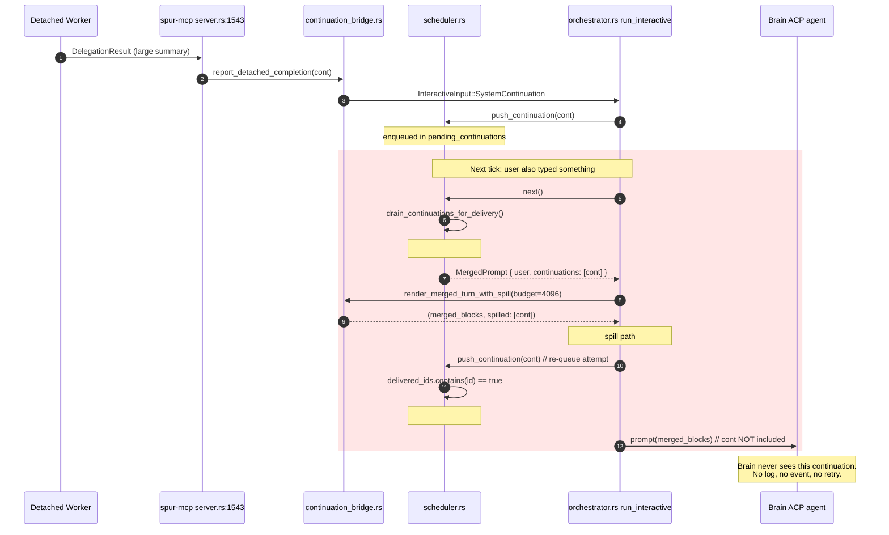
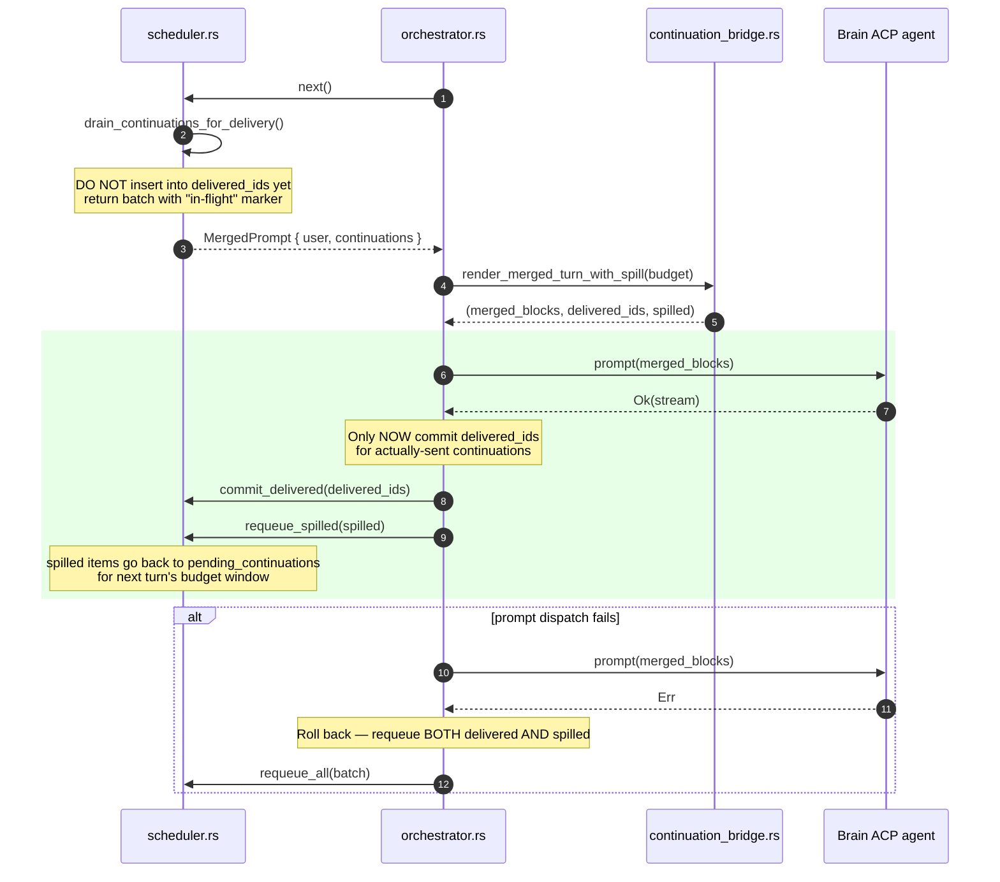
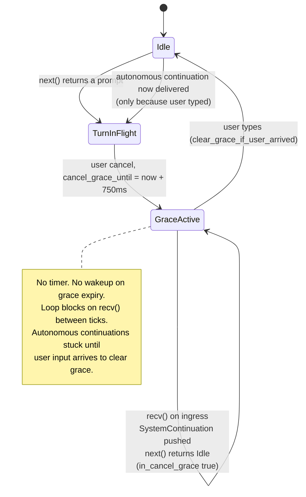
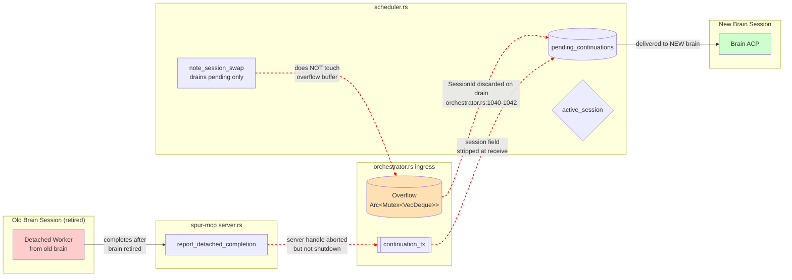

# Brain-Continuation Subsystem — RCA

- **Date:** 2026-04-24
- **Subsystem:** `spur-core` orchestrator → scheduler → continuation bridge → brain ACP agent
- **Review mode:** 3-POV review — primary reviewer + `worker:kimi` (security / data-integrity / serialization) + `worker:codex` (concurrency / retry / observability)
- **Files under review:**
  - `crates/spur-core/src/orchestrator.rs` (5985 lines)
  - `crates/spur-core/src/scheduler.rs`
  - `crates/spur-core/src/continuation_bridge.rs`
  - `crates/spur-mcp/src/server.rs` (detached-completion producer)
  - `docs/superpowers/specs/2026-04-19-brain-async-continuation-design.md`

## TL;DR

Four independently-confirmed HIGH-or-above defects in the brain-continuation delivery path. Two are **silent data-loss bugs** — the merged-turn spill and the prompt-dispatch failure path both route continuations into a code region where `delivered_ids` has already been written, so any attempt to re-queue them is dropped by dedup. A third is a **liveness hole** in the cancel-grace window. A fourth is a **session-scoping escape** where `SessionId` is carried on the wire but never enforced at ingress.

The design spec's stated invariants (INV-C1…C7) hold at the level they are expressed. All four defects live *below* that level — in the handshake between scheduler bookkeeping and dispatcher behavior, and in the gap between what `SessionId` *conveys* and what code *checks*.

---

## Findings overview

| # | Finding | Severity | Confirmed by |
|---|---|---|---|
| A | Merged-turn spill silently deletes continuations | **CRITICAL** | kimi + codex + code verification |
| B | Prompt-dispatch failure silently deletes continuations | **CRITICAL** | codex + code verification |
| C | Cancel-grace has no wakeup path (liveness hole) | **HIGH** | codex + code verification |
| D | Session scoping advertised but not enforced at ingress | **HIGH** | kimi + codex |
| E | `payload.artifact` declared but never serialized | **HIGH** | primary + kimi |
| F | `source` emitted as Rust `Debug` repr; mixed serialization contract | **HIGH** | primary + kimi |
| G | Autonomous turn has no count cap, no byte budget, no producer-side length limit | **HIGH** | primary + kimi |
| H | Retry loop reuses `delegation_id` → silent drop on retry-after-detach | **MEDIUM** | primary, codex-confirmed at lines 3220-3225, 3307-3317, 4236-4240 |
| I | `[SPUR:background]` marker is forgeable — no per-block ACP provenance | **MEDIUM (security)** | primary + kimi |
| J | No `SpurEvent` on spill / overflow / channel-closed loss | **MEDIUM (ops)** | codex |

---

## RCA — Finding A: Merged-turn spill silently deletes continuations

### Observed behaviour

A detached worker finishes with a `summary` / `diff_summary` whose total JSON size exceeds `MERGE_BUDGET_DEFAULT_BYTES = 4096`. The brain never sees that completion in any subsequent turn. There is no log, no event, no visible error — the continuation vanishes.

### Trigger conditions

- Detached worker completes while a user message is queued (produces a `MergedPrompt`).
- The worker's serialized continuation JSON (`delegation_id` + `source` + `status` + `summary` + `diff_summary` + `worker_branch`) exceeds 4 KB in its own right, OR the cumulative size of pending continuations plus the separator marker exceeds 4 KB.

### Causal chain



### Root cause

Two contract surfaces disagree about whose responsibility recovery is.

- `scheduler.rs:161-167` documents the `delivered_ids`-on-drain policy explicitly: "failure recovery is the dispatcher's responsibility, not the scheduler's."
- `orchestrator.rs:1495-1497` attempts recovery the only way it knows: by calling `scheduler.push_continuation(spilled)`.
- `scheduler.rs:87-95` enforces dedup against `delivered_ids` unconditionally, so the dispatcher's recovery attempt is structurally guaranteed to fail.

The scheduler offers no alternative re-queue path that bypasses dedup. The dispatcher uses the only path available. The result is deletion by design-seam.

### Contributing factors

- `MERGE_BUDGET_DEFAULT_BYTES = 4096` is small enough that a realistic worker result easily exceeds it in a single continuation, so the bug is not rare.
- Producer-side has no length cap on `summary` / `diff_summary` (`server.rs:1562-1564`), so worker output size is unbounded at the source.
- Spill produces no `SpurEvent` — only a tracing debug on the eventual dedup drop. Ops cannot detect this.
- Test coverage: `continuation_bridge.rs:366-394` asserts spill ordering but **does not assert round-trip delivery across two turns.** The tests verify the buggy behavior.

### Expected behaviour (after)



The shape of the fix is:
- Scheduler emits a batch of "checked-out" continuations without committing `delivered_ids`.
- Dispatcher splits them into "actually sent" and "spilled" after `render_merged_turn_with_spill`.
- Dispatcher commits `delivered_ids` *only* for actually-sent items, *only* after `prompt()` succeeds.
- Failed / spilled items return to `pending_continuations` via a path that bypasses dedup.

This rolls findings A, B, and the fix for #5 (spill ordering) into a single handshake redesign.

---

## RCA — Finding B: Prompt-dispatch failure silently deletes continuations

### Observed behaviour

If `connection.prompt()` errors, or brain spawn fails, continuations returned by `scheduler.next()` in that turn are never delivered and are never retried.

### Causal chain

Identical root cause to Finding A: `delivered_ids` is written at drain time (`scheduler.rs:247-253`), *before* `render_merged_turn_with_spill` or `connection.prompt()` has been attempted. The orchestrator's error paths at `orchestrator.rs:1516-1558` and `1594-1643` do not call back into any re-queue path. The continuations are already marked delivered in the scheduler's bookkeeping, so they are invisible to every future `push_continuation`.

### Expected behaviour

Same fix as Finding A. The "commit on success, roll back on failure" handshake pictured in the diagram above covers both paths.

---

## RCA — Finding C: Cancel-grace window has no wakeup path

### Observed behaviour

After the user cancels a brain turn, a 750 ms grace window suppresses autonomous continuations (per spec INV-C4/C6 — user intent takes priority). During that window, if a detached worker's completion arrives and no user input follows, the continuation sits in `pending_continuations` indefinitely. It delivers only after the next user message arrives.

### State diagram — before (current)



### Root cause

`scheduler.rs:223-231` returns `Idle` during grace. The orchestrator loop at `orchestrator.rs:1051-1055` then awaits `recv()` on the ingress channel. Nothing schedules a `tokio::time::sleep_until(cancel_grace_until)` to wake the loop when grace expires. `clear_grace_if_user_arrived` (`scheduler.rs:145-149`) is the only way out of grace state.

### State diagram — after (expected)

```mermaid
stateDiagram-v2
    [*] --> Idle
    Idle --> TurnInFlight: next() returns a prompt
    TurnInFlight --> GraceActive: user cancel,<br/>cancel_grace_until = now + 750ms,<br/>spawn grace_expiry_wakeup(cancel_grace_until)

    GraceActive --> GraceActive: SystemContinuation arrives<br/>enqueued, no delivery yet
    GraceActive --> Idle: grace_expiry_wakeup fires<br/>(tokio::time::sleep_until)
    GraceActive --> Idle: user typed<br/>(clear_grace_if_user_arrived)

    Idle --> TurnInFlight: next() returns<br/>ContinuationPrompt or UserPrompt

    note right of GraceActive
      EITHER path out — user input OR
      timer — wakes the outer loop.
      Liveness guaranteed.
    end note
```

Shape of the fix: the orchestrator's `select!` on the ingress channel gains a third arm — `tokio::time::sleep_until(cancel_grace_until)` — that fires a synthetic "tick" when grace expires. The scheduler itself stays pure sync.

---

## RCA — Finding D: Session scoping unenforced at ingress

### Observed behaviour

`InteractiveInput::SystemContinuation` carries a `session: SessionId` on the wire, but the orchestrator does not verify that the session matches the currently-active brain. Combined with the overflow buffer not being evicted on session swap, and MCP server not being shut down on brain retirement, continuations from a prior brain can leak into a new brain's context.

### Leak surfaces — before



Three independent leak paths, each confirmed at the cited lines:

1. **Ingress strips `session`.** `orchestrator.rs:1100-1102` and `1725-1726` destructure `SystemContinuation { continuation, .. }` — the session is literally ignored.
2. **Overflow drains without session check.** `orchestrator.rs:1040-1042` uses `let Some((_sid, c))` and pushes into the scheduler unconditionally.
3. **MCP server not shutdown on retirement.** `orchestrator.rs:159-162` and `1980-1982` abort the server task handle but do not call `server.shutdown()` which would drain the `TaskTracker` (`spur-mcp/src/server.rs:1489-1498, 1585-1587`). Worker result collectors from retired brains keep firing into `continuation_tx`.

### Expected behaviour — after

```mermaid
flowchart LR
    subgraph Producer["spur-mcp server.rs"]
        P[report_detached_completion<br/>tags cont with brain_session_id]
    end

    subgraph Ingress["orchestrator.rs ingress"]
        Ch[[continuation_tx]]
        OB[(Overflow<br/>SessionId, cont]
    end

    subgraph Sched["scheduler.rs"]
        PC[(pending_continuations)]
        AS{active_session}
        NSW[note_session_swap<br/>drains pending AND overflow]
        Drop[emit ContinuationDropped<br/>reason=StaleSession]
    end

    subgraph Retire["Brain retirement"]
        R[server.shutdown<br/>awaits TaskTracker]
    end

    subgraph New["New Brain Session"]
        NB[Brain ACP]
    end

    Ch -->|match session == active_session| AS
    OB -->|match session == active_session| AS
    AS -->|match| PC
    AS -->|mismatch| Drop
    NSW -->|evicts from both<br/>pending AND overflow| Drop
    R -->|blocks retirement until<br/>in-flight workers drained| NB
    PC --> NB

    style NB fill:#ccffcc
    style Drop fill:#ffe0b3
```

Three corresponding shape-of-fix points:

1. Ingress sites match `session == scheduler.active_session`; mismatch → drop + emit `ContinuationDropped { reason: StaleSession }`.
2. `note_session_swap` takes the overflow buffer handle and drains it alongside `pending_continuations`.
3. Brain retirement calls `server.shutdown()` and awaits the `TaskTracker` before transitioning.

---

## RCA — Finding E: `payload.artifact` declared but never serialized

### Observed

`BrainContinuation.payload.artifact: Option<WorkerArtifact>` is constructed at the producer and survives transport through the channel and scheduler. The wire-serialization at `continuation_bridge.rs:123-131` omits the field entirely.

### Root cause

The JSON builder was authored before `WorkerArtifact` was added, and was not updated when the field was added to the struct. Tests at `continuation_bridge.rs:252, 305` construct with `artifact: None`, so no test ever sees the omission.

### Expected

Either the field is serialized alongside `summary` / `diff_summary`, or the field is deleted. The current state — carried in memory, dropped at the wire — is dead weight that will mislead every future reader.

---

## RCA — Finding F: `source` emitted as Rust `Debug` repr; mixed serialization contract

### Observed

At `continuation_bridge.rs:125`: `"source": format!("{:?}", c.source)`. Meanwhile `"status"` on the adjacent line uses `serde_json::to_value(&c.payload.status)`. Same JSON body, two serialization disciplines.

### Root cause

Expedient implementation. `ContinuationSource` is currently a simple C-style enum where `Debug` happens to produce the variant name, so the wire string looks stable. The risk is latent: the moment someone adds data to a variant (e.g. `Cancelled { reason: String }`), the wire string silently becomes `Cancelled { reason: "timeout" }` with no compile error at any call site, breaking any brain prompt-matching on the string.

### Expected

`ContinuationSource` derives `Serialize` with `#[serde(rename_all = "snake_case")]`, and the bridge uses `serde_json::to_value(&c.source)` consistently with `status`. Contract uniform across the body.

---

## RCA — Finding G: Autonomous turn has no caps

Three independent unboundedness layers:

1. **`scheduler.rs:247-248`** — `drain_continuations_for_delivery` uses `.drain(..)`, returning every pending item regardless of count.
2. **`continuation_bridge.rs:146`** — `render_autonomous_continuation_turn` has no byte-budget parameter; merged-turn budget does not apply.
3. **`server.rs:1562-1564`** — producer clones `result.summary` / `result.diff_summary` into the continuation with no length cap.

A worker fleet that completes 50 tasks while the brain is idle produces a single autonomous prompt with 50 resource blocks, each potentially megabyte-scale. The brain's context window is the only remaining limit.

### Expected

Autonomous turns gain the same byte budget as merged turns (or a higher one, tuned to the context window). Producer-side clips `summary` / `diff_summary` to a reasonable ceiling (e.g. 8 KB) with an ellipsis marker. Both clips emit events so ops can see truncation happening.

---

## RCA — Finding H: Retry loop reuses `delegation_id`

### Observed

`execute_delegation`'s retry loop keeps the same `request_id` across attempts (`orchestrator.rs:3220-3225`), threads it unchanged into every `WorkerAttemptCtx` (`3307-3317`), and emits it on every attempt (`4236-4240`). Only the worker `SessionId` is reallocated per attempt (`3659-3665, 3683-3685`).

### Consequence

Attempt 1 detaches, completes, emits a continuation, `delivered_ids` records the ID. Attempt 2 runs (detached or not) and emits a continuation with the same `delegation_id`. `push_continuation` dedups and drops it silently.

The brain sees *only* attempt 1's result, even if attempt 2 was the one the retry was supposed to use.

### Expected

Either:
- `delegation_id` increments per attempt (e.g. `{request_id}-a{n}`) so each attempt's continuation is visible.
- Or the producer tags continuations with an `attempt_number` and the scheduler treats `(delegation_id, attempt_number)` as the dedup key.

The current single-ID dedup is semantically wrong once retries enter the picture.

---

## RCA — Finding I: `[SPUR:background]` marker is forgeable

### Observed

The brain distinguishes SPUR-injected content from user content only by the literal text `[SPUR:background]` and the URI prefix `spur://continuation/`. A user pasting either string produces ContentBlocks structurally indistinguishable from real SPUR injections.

### Root cause

ACP has no per-block provenance metadata. The spec at line 455 acknowledges: "every block in a single `session/prompt` call is 'the client's prompt' from the agent's perspective." The marker convention is the best the design can do without a protocol-level channel separation.

### Mitigation shape

A per-session random nonce embedded in the marker (`[SPUR:background:${nonce}]`) where the nonce rotates on every brain session start closes the copy-paste injection footgun. The brain is prompted/trained to recognize only its own session's nonce. This is mitigation, not prevention — the ceiling is ACP itself.

---

## RCA — Finding J: No observability on loss paths

### Observed

- Spill → tracing debug only, no `SpurEvent`.
- Overflow push → tracing debug only, no counter.
- `TrySendError::Closed` → tracing warn only, no counter.
- `delivered_ids`-dedup drop on re-push (Finding A) → tracing debug only.

The *rare* failure mode (session-swap eviction) is the *best* instrumented — it emits `ContinuationDropped { reason: SessionSwap }`. The *common* failure modes that this RCA documents are the *worst* instrumented.

### Expected

Every loss path emits `SpurEvent::ContinuationDropped { reason }` where `reason` enumerates: `BudgetSpill`, `PromptDispatchFailure`, `OverflowClosed`, `StaleSession`, `RetryDedupCollision`. Ops dashboard can then track loss rate by cause.

---

## Cross-cutting contributing factors

- **`delivered_ids` write-time is the common root of findings A, B, and H.** The scheduler writes dedup state at drain time, but three different code paths can fail *after* drain without a matching "un-deliver" affordance. One handshake redesign addresses all three.
- **Session scoping is advertised by the type system (the `session: SessionId` field exists) but not checked anywhere.** Finding D is structurally inevitable once `session` is on the struct but match-destructured out of existence.
- **Test coverage exercises each piece in isolation but not the round-trip.** Spill tests don't verify next-turn delivery. Retry tests don't verify the continuation path. Session-swap tests don't exercise the overflow buffer.
- **Tracing-only observability** means every single one of findings A, B, C, D, G, H, I, J could be actively happening in production with zero signal to ops.

---

## Recommended remediation order

Not implementation — ordering of where to start.

1. **Fix findings A + B together.** Single handshake redesign: commit `delivered_ids` on success, roll back or re-queue on failure / spill. Add a round-trip test that asserts a spilled continuation is visible in the following turn.
2. **Fix finding C.** Add grace-expiry wakeup arm to the orchestrator `select!`. Cheap and local.
3. **Fix finding D.** Enforce session match at all three ingress sites; extend `note_session_swap` to drain the overflow buffer; wire `server.shutdown()` into brain retirement.
4. **Fix findings E + F + J.** Serialization cleanups and event emission. Low risk, high observability yield.
5. **Fix finding G.** Producer-side summary cap + autonomous-turn budget.
6. **Fix finding H.** Change `delegation_id` allocation or extend dedup key. Requires coordinating scheduler and producer; hold until 1-5 land.
7. **Fix finding I.** Nonce-ized marker. Mitigation, not blocking.

---

## Review method notes

- Primary reviewer produced a 10-item ranked list; missed findings A, B, C, D at critical severity.
- `worker:kimi` produced the spill-deletion finding (A) independently via wire-contract analysis.
- `worker:codex` produced findings B, C, D and the retry-ID confirmation (H) independently via concurrency / state-machine analysis.
- Code verification against `scheduler.rs:86-95, 161-167, 247-253` confirmed both workers' claims.

The delegation prompt structure — giving each worker the same 8 flagged issues + different deep-dive angles — produced uncorrelated findings that overlapped only on the most severe bug. That is the strongest possible signal the finding is real.
