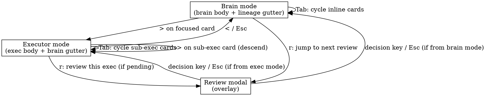

# Close Brain↔Executor Feedback Loop UI — Design

**Date:** 2026-04-13
**Status:** Proposed for review
**Owner:** spur-tui (with small dependencies on spur-acp events + spur-core orchestrator)
**Follows:** `2026-04-13-orchestrator-review-loopback-design.md`,
`2026-04-13-review-loopback-integration-audit.md`

## Goal

Make the brain↔executor close feedback loop legible in one screen.
When the brain calls `delegate_to_worker`, the operator sees what was
delegated, watches the executor work live in context, reviews with full
diff information, and follows the brain's continued reasoning — without
mental cross-referencing between two unlinked views.

## Non-goals

- Multi-executor side-by-side comparison view (one-screen split into
  two executors). Defer until real demand.
- Cross-session timeline (interleaving N brain sessions). The Loop
  view is per-brain-session.
- Replace the `dashboard` cross-session monitor — it stays as a
  global overview; this design adds a new per-session Loop view.
- Crash durability of mode/focus state across TUI restarts. Lossy is
  acceptable.
- Brain-facing tool-result framing (F12 from the audit). Tracked as a
  parallel spur-mcp spec; no dependency.

## Motivation

Two shipping defects make today's brain↔executor loop opaque:

1. **No view shows both sides.** `session_detail` shows brain
   conversation; `dashboard` shows executor tree. They're unlinked.
   Following one delegation requires switching views and visually
   correlating — a stance-transition that costs 5–15 seconds and
   compounds across the dozens of transitions per session.
2. **Even the brain-side view degrades.** `session_detail.rs:743`
   cannot mutate the existing `Delegate` trace entry on completion;
   it appends a separate `Think` "Delegation completed: done." The
   original entry stays frozen as "delegated" forever, masking truth.

Plus three audit-found data gaps that prevent any close-loop UI from
being meaningful:

- Brain-side has no link to the spawned `executor_id` (only knows
  `to_agent` + `task`).
- Review payload drops `outcome.diff` (operator approves blind).
- TUI has no path to type free-text alongside hotkey decisions
  (Reject/Modify/Retry carry placeholder strings).

## Industry grounding

Surveyed: Claude Desktop, Cursor Agent Mode, OpenAI Agents SDK
debugger, LangSmith, Devin, Argo Workflows UI.

**Pattern for hierarchical request/response work**: requester is
primary; subsidiary work renders inline at the call site, expandable
to detail. Claude Desktop / Cursor / OpenAI Agents debugger all use
this. The brain↔executor relationship is exactly hierarchical
request/response (brain calls `delegate_to_worker`, blocks on a tool
result), so this pattern fits.

**Pattern for co-equal parallel agents**: spatial split-screen (Devin)
or DAG navigation (Argo). Spur's relationship is not co-equal — these
patterns would over-weight the executor and break with parallel-N (3+
delegations).

**Spur-specific addition**: stance is task-determined (operator wants
brain-primary during reasoning, executor-primary during work, both
during review). So we add **focus-followed view inversion**: pressing
`>` on a focused inline executor card swaps the screen so the executor
becomes the body and the brain compresses to a thin gutter. `<`
ascends back. Industry precedent: vim's `:tab`/`:tabp`, tmux pane
zoom, Emacs window-balance — focus follows attention.

## Architecture: View inversion

Single screen at any moment. Two interchangeable modes per brain
session.

### Brain mode (default)

```
┌─[ brain: <agent> · <session_id> · turn N ]──────[ Tab=focus | >=descend ]─┐
│  body: brain ReactTrace                                                   │
│        - User messages                                                    │
│        - Brain reasoning blocks                                           │
│        - delegate_to_worker call sites with INLINE EXECUTOR CARDS         │
│        - Tool results inline                                              │
├───────────────────────────────────────────────────────────────────────────┤
│ gutter: lineage one-liner (brain · exec/<id> phase · exec/<id> phase …)   │
└───────────────────────────────────────────────────────────────────────────┘
 InputBar: [user messages, slash-commands, review free-text when modal up]
```

### Executor mode (after `>` on focused inline card)

```
┌─[ exec: <agent> · <id> · attempt n/max ]─────────[ <=ascend | r=review ]─┐
│  ⤴ brain context (gutter, dim):                                          │
│      last brain reasoning block before this delegation                   │
│      delegate_to_worker(...) call args                                   │
│      next brain reasoning block after resume (if delegation completed)   │
│  ▼ executor body                                                         │
│      Task: <task>                                                        │
│      Spawned … · worktree=…                                              │
│      Stream of executor events (read/edit/bash/think/sub-delegate)       │
│      Inline cards for sub-executors (recurses)                           │
├──────────────────────────────────────────────────────────────────────────┤
│ lineage: brain > exec/<id> [you are here] · exec/<sibling_id> phase …    │
└──────────────────────────────────────────────────────────────────────────┘
```

**Brain context bounds:** exactly one brain reasoning block before
the delegate call, the call's args (agent + task), and — once the
delegation completes — the next brain reasoning block after the
brain resumes. Any longer brain history is reachable by ascending
to brain mode (`<`). Bounding here prevents the gutter from growing
unboundedly when the brain has long pre-context.

### Review modal (overlays current mode)

```
┌─[ Review: exec/<id> · attempt n/max ]──────────────┐
│  Agent: <agent>                                    │
│  Task:  <task> (truncated to 80 chars)             │
│  Diff:  <files> files, +<ins> / -<del>             │
│  Files: <per-file file_changed | +ins -del> …      │
│  Summary (worker): <summary>                       │
│                                                    │
│  [a] approve  [d] deny  [m] modify  [R] retry      │
│  [v] view full diff in pager                       │
│  reason/note/constraints: ____________________     │
│  (typed text attaches to next d/m/R press;         │
│   'a' Approve does not require text)               │
└────────────────────────────────────────────────────┘
```

### Mode transitions

- **Brain → Executor**: from brain mode, Tab cycles inline executor
  cards (focus indicator: ▶ becomes ▶▶ on the focused card). `>` or
  Enter on focused card → executor mode for that exec.
- **Executor → Brain**: `<` or Esc in executor mode → brain mode,
  scroll to the originating delegate site, re-focus that card.
- **Either → Review**: `r` (existing JumpToReview hotkey) opens the
  review modal for the next pending review. If that review's
  executor isn't the current focus, mode-swap to executor mode for
  it, then overlay modal.
- **Review → previous mode**: any decision key (a/d/m/R) or Esc closes
  modal; mode beneath is preserved.

### Dashboard's role refactor

Dashboard stays as the **cross-session executors monitor + session
picker**. It loses its role as the per-session executor inspector
because the Loop view subsumes that. Its detail-pane simplifies to:
list of recent terminal events plus an "open in Loop view" action
on the focused session/executor.

The agents-tree pane on dashboard remains useful for global awareness
when N brain sessions are running.

The dashboard's **Review tab is removed** — the ReviewModal in the
Loop view replaces it. `r` (JumpToReview) on the dashboard
auto-navigates to the Loop view of the brain session owning the
next pending review and overlays the modal there.

## Components

### `InlineExecutorCard`

New component at `crates/spur-tui/src/components/inline_executor_card.rs`.

- Input: `executor_id`, reference to `ExecutorLineage`.
- Output: `Vec<Line<'static>>` rendering the live card.
- Renders: phase glyph (▶ Running / ⏸ Queued / ✓ Done / ✗ Failed /
  ⚠ AwaitingReview), agent name, truncated task, elapsed, tool-call
  count, latest tool, files-touched count, current diff size.
- Live: queries lineage on every paint; no internal state. The
  component is pure render; reactivity comes from the projection.
- Focus-aware: takes a `focused: bool` flag, renders distinct border
  when focused.

### `ExecutorDetailView`

New view at `crates/spur-tui/src/views/executor_detail.rs`. Mirrors
the structure of `session_detail.rs` but scoped to a single executor.

- Owns: `executor_id`, `body_trace: ReactTrace` (executor's events),
  `gutter_brain_context: Vec<TraceEntry>` (brain's surrounding
  context, derived from parent brain's session_detail trace).
- Implements `View` trait. Handles its own scrolling, focus on
  inline sub-executor cards (for nested case), and key dispatch.
- Shares the `ReactTrace` infrastructure with session_detail; reuse,
  don't fork.

### `ReviewModal` (replaces inline review-card rendering in Review tab)

New component at `crates/spur-tui/src/components/review_modal.rs`.
Pattern: same overlay strategy as `quit_confirm.rs`.

- Shows: agent + task (fixes F8), diff stats + per-file breakdown
  (depends on F6 fix), attempt counter (fixes F4), free-text input
  field, decision hotkey legend.
- Two-mode input flow: while modal is open, the InputBar's
  text-buffer is bound to the modal's "reason/note/constraints"
  field. Pressing d/m/R consumes the buffered text as
  `prompt_answer` and dispatches `Action::SubmitReview` (fixes F1).
  Pressing 'a' dispatches Approve regardless of buffered text.
- 'v' opens the full unified diff in a pager (existing pager
  infrastructure or shell out to `$PAGER`).

### Gutter+body layout abstraction

Add a thin layout helper at
`crates/spur-tui/src/components/loop_layout.rs`.

- Takes: `body: impl FnOnce(Rect) -> ()`, `gutter: impl FnOnce(Rect)
  -> ()`, `gutter_position: Top|Bottom|Left|Right`.
- Computes split rects (gutter ~3 lines or ~30 cols depending on
  position).
- Both Brain mode and Executor mode use this layout — only their
  body+gutter functions differ.

## Data correlation (Gap 1)

The brain conversation needs to know the `executor_id` for each
`delegate_to_worker` call so `InlineExecutorCard` has an anchor.

**New event variant** in `crates/spur-acp/src/domain/events.rs`:

```rust
SpurEventBody::DelegationDispatched {
    /// Brain session that issued the delegate_to_worker call.
    from: SessionId,
    /// Matches the request_id newly added to DelegationRequested
    /// and DelegationRequest (sourced from spur-mcp's UUID).
    request_id: String,
    /// The executor node now spawned for this delegation.
    executor_id: String,
},
```

**Emit site:** in `orchestrator.rs::execute_delegation`, immediately
after the executor_id is computed (before `ExecutorSpawned` emit, so
the brain's session_detail can update its `Delegate` trace entry to
hold `executor_id` before the inline card needs to render).

**Threading the request_id:** the `DelegationRequest` already carries
an `id: String` (uuid, from `spur-mcp/src/server.rs:323`). We surface
that into the `DelegationRequested` event (currently it doesn't have
one; add `request_id: String` field) and re-use it in
`DelegationDispatched`.

**Backward compatibility:** `SpurEventBody` is `#[serde(...)]` enum;
adding a variant is backward-compatible for serde defaults but a
breaking change for any consumer's exhaustive match. Run a search for
exhaustive matches and add `_ =>` arms (or `#[non_exhaustive]` the
enum if not already).

**Session_detail consumption:** when `DelegationDispatched` arrives,
locate the most recent `TraceKind::Delegate` entry where
`request_id` matches and attach `executor_id`. The render path uses
`executor_id` to embed the inline card.

## Bundled prerequisites

E delivers structural value only with these three. Land them in the
build sequence below; no parallel side-quests.

### F6 — review payload carries diff stats

`crates/spur-core/src/orchestrator.rs:1713-1718`. Replace
`diff_summary: None` with a computed `DiffSummary { files_changed,
insertions, deletions }` derived from `outcome.diff`.

Implementation: parse the unified diff using a small helper
(`crates/spur-acp/src/domain/diff_stats.rs`, new) — count `diff
--git` headers for `files_changed`, count `^+`/`^-` lines (excluding
`+++`/`---` headers) for ins/del. No new dependency; ~30-line
function with unit tests.

Stretch: also include per-file breakdown
(`Vec<DiffSummaryFile { path, insertions, deletions }>`) so the
review modal can show the per-file table from the mockup. Trivial
extension of the same parser.

### F1 — TUI two-mode review-input flow

Today `decision_for_key(ch, None)` always passes None. With the
review modal, the InputBar's text buffer is bound to the modal's
"reason/note/constraints" field. On d/m/R press,
`decision_for_key(ch, Some(buffered_text))` is called, then the
buffer clears.

Affects: `dashboard.rs::handle_key_inner` (the `'d'/'m'/'R'` arms at
~344) — change `decision_for_key(ch, None)` to
`decision_for_key(ch, Some(self.input_bar.text().to_string()))` and
clear input_bar after. Plus a focus-routing rule: when
`ReviewModal` is open, all character keys go to its input field
(not navigation hotkeys).

### Gap 1 — DelegationDispatched event (above)

## UX details (refinements from journey-walk MCTS)

These are baked into the components, not optional polish.

### Header system (unified mode indicator)

Every mode shows a `[ MODE · context ]` header with CAPS mode word
and context-specific next-step hints on the right (no hint overload).

| State | Header |
|---|---|
| Brain mode, no card focused | `[ BRAIN · sess-7f3a · turn 3 ]──[ Tab cards \| / type \| r review ]` |
| Brain mode, card focused | `[ BRAIN · sess-7f3a · turn 3 ]──[ Tab next \| Enter open \| r review ]` |
| Executor mode | `[ EXEC · 8a2c · attempt 1/3 · running ]──[ < back \| Tab events \| r review ]` |
| Executor mode, sub-card focused | `[ EXEC · 8a2c ]──[ Tab next \| Enter descend \| < back ]` |
| Review modal, decision mode | `[ REVIEW · 8a2c · attempt 1/3 ]──[ a/d/m/R decide \| i edit reason ]` |
| Review modal, edit mode | `[ REVIEW · 8a2c ]──[ Esc done \| Enter newline ]` |

### Color palette

| Use | Color | Fallback (16-color) |
|---|---|---|
| BRAIN header | purple | magenta |
| EXEC header | blue | blue |
| REVIEW header | yellow | yellow |
| ▶ Running | green | green |
| ⏸ Queued | gray | white |
| ⚠ AwaitingReview | yellow | yellow |
| ✓ Done | cyan | cyan |
| ✗ Failed/Conflict | red | red |
| 💀 Cancelled | dark red | red |
| Focus left-bar `┃` | bright cyan | bright white |
| Stale 30s | yellow | yellow |
| Stale 5min | red | red |
| Update-flash | white border (1 frame) | (skip in 16-color) |

### R1. Focus indicator

The focused inline card gets a bright-cyan left bar (`┃`) and a hint
line at the bottom of the card (only on focus, not always).

```
│ ┃┌────────────────────────────────────────────────────────────────────┐  │
│ ┃│ ▶▶ exec/8a2c · claude-coder · "refactor the auth module"          │  │
│ ┃│    Running · 0m04s · 1 call · last: Read(auth/src/lib.rs) · 2s    │  │
│ ┃│    [ Enter / > to open executor view ]                            │  │
│ ┃└────────────────────────────────────────────────────────────────────┘  │
```

Unfocused cards have no bar and no hint line — purely informational.

### R2. First-use banner

When a brain session shows its first inline executor card AND the
user has not yet completed an Enter/`>` interaction, render a banner
above it explaining the interaction. Suppressed permanently after
first dismissal or first successful descend. Persisted in
`~/.spur/ux-state.json` (new tiny infra, `serde_json` map of seen
flags).

```
│  ┌─ tip (shown once) ─────────────────────────────────────────────────┐  │
│  │ This is an executor card. Press Tab to focus, Enter (or >) to step │  │
│  │ inside and watch live. Press < to come back. [Esc to dismiss]      │  │
│  └────────────────────────────────────────────────────────────────────┘  │
```

### R3. Liveness signals (stale indicators)

Each inline card carries `last: <tool_call> · <Ns ago>` where the
"ago" timestamp is computed at paint. Color rules:
- 0–30s: normal.
- 30s–5min: yellow.
- >5min: red, prefix `STALE`.

Plus a tiny spinner glyph (`⠋⠙⠹⠸⠼⠴⠦⠧⠇⠏`, 80ms cycle) next to "ago"
while the executor's last event is recent (<10s) — visual confirmation
that events are flowing.

### R5. Update-flash

When an `ExecutorPhaseChanged`, `ExecutorArtifact`, or any
sub-event arrives for an executor whose card is currently rendered,
flash the card border white for one paint frame (~16ms). Catches the
operator's peripheral vision.

Skipped if user pref `reduced_motion = true` (added to ux-state.json).

### R6d. Vim-modal review input

Two states inside the review modal:
- **Decision state** (default): bare a/d/m/R fire decisions. 'i'
  enters edit state. 'v' opens diff in pager. Esc closes modal.
- **Edit state**: all printable chars buffer into the reason field.
  Enter inserts newline. Esc returns to decision state. Decision
  keys (a/d/m/R) here type as literal characters.

The header right-side hint reflects current state (`a/d/m/R decide |
i edit reason` vs `Esc done | Enter newline`). The reason field
shows `_` cursor only in edit state.

Supersedes the simpler "buffered text + decision keys" originally
specified (which had a fatal collision with reasons containing
'a'/'d'/'m'/'R' characters).

### R7. Attention-state taller cards

Cards in `AwaitingReview`, `Failed`, or `Conflict` states render with
extra height + an attention header line. Cards in `Running`, `Queued`,
or `Done` states stay compact. Visual hierarchy makes attention-needing
cards pop without the operator scanning every card.

```
┌─ ⚠ ATTENTION ──────────────────────────────────────────────────────┐
│ exec/3f1d · claude-coder · "update callsites to new auth API"      │
│   AwaitingReview · 4m02s · diff: 7 files, +120/-45                 │
│   Worker summary: "Updated 7 callsites; cargo check passes"        │
│   ▶ Press 'r' to review (this delegation is blocking the brain)    │
└────────────────────────────────────────────────────────────────────┘
```

### R8. Tab cycles in priority order

Tab order across inline cards:
1. AwaitingReview (most urgent)
2. Failed / Conflict
3. Running
4. Queued
5. Done (least urgent)

Within a state class, insertion order. First Tab from no-focus lands
on the most-urgent card. Operator who hits Tab once gets the right
card.

### R9. Single-level ascent

`<` (or Esc) ascends EXACTLY ONE level:
- Sub-executor mode → parent executor mode
- Executor mode → brain mode
- Review modal → previous mode (whichever it was)

`Ctrl+<` (or `<<` chord, TBD) ascends to root brain mode regardless
of depth. Without this, operators 3+ levels deep face N keystrokes
to escape.

### R10. Interactive breadcrumb gutter

The lineage gutter renders as a horizontal breadcrumb:
`brain > exec/8a2c > exec/8a2c-sub-1 [you are here]`

When the breadcrumb is focused (Shift+Tab to focus gutter), Left/Right
arrow keys jump to that ancestor. Clears focus on Esc back to body.

### R11. Reject countdown when reason empty

When operator presses 'd' in review modal AND the reason field is
empty, show a 3-second countdown overlay before dispatching the
Reject. Esc cancels.

When reason field is non-empty, dispatch immediately (operator
clearly meant it).

Approve, Modify, Retry: dispatch immediately regardless. Only Reject
gets the countdown.

```
            ┌─[ Review: exec/8a2c ]────────────────────┐
            │  ...                                     │
            │  reason: (empty)                         │
            │                                          │
            │  ⏳ REJECTING in 2s (Esc to cancel)      │
            └──────────────────────────────────────────┘
```

### R12. Peek banner for new content

When new content appears below the viewport AND the operator is not
scrolled to bottom, show a 1-line peek at the bottom of the body:
`↓ N new lines · <last event description> ─── G to jump`.

Pattern from Slack/Discord. Avoids missed delegations when operator
is reviewing scrollback.

### R13. Auto-follow-bottom

Default ON. Disables when operator scrolls up. Re-enables when
operator hits G or scrolls back to bottom. Standard log-viewer
pattern.

### R14. Per-state card density

| State | Lines |
|---|---|
| Queued | 2 |
| Running | 3 |
| Done | 2 (or 1 if collapsed) |
| AwaitingReview | 5 (R7) |
| Failed/Conflict | 4 (R7) |
| Cancelled | 2 |

Density is intrinsic to the renderer, not a runtime flag. Only
collapse-Done (operator hits 'c' on a focused Done card) is
operator-toggleable in v1.

## Mockups

(See "Architecture" section above for brain mode, executor mode, and
review modal mockups; reproduced from the brainstorm.)

### Inline executor card states

```
▶ exec/8a2c · claude-coder · "refactor auth.rs to use new session…"
  ● Running · 2m14s · 12 tool calls · last: Edit(auth/src/lib.rs)
  files touched: 4 · diff: +84/-31 (so far)

⏸ exec/3f1d · claude-coder · "update callsites to new auth API"
  ○ Queued (waiting for exec/8a2c)

⚠ exec/9b4e · claude-coder · "add tests for session refactor"
  ● AwaitingReview · 4m02s · press 'r' to review

✓ exec/2c1a · claude-coder · "fix lint warnings"
  ✓ Done (Approved) · 1m48s · diff: +12/-4

✗ exec/5d7f · claude-coder · "migrate database schema"
  ✗ Failed · timeout · diff preserved at /var/spur/wt/5d7f
```

### Lineage gutter

```
brain · exec/8a2c (running 2m) · exec/3f1d (queued) · exec/2c1a (done)
```

In executor mode the gutter shows breadcrumbs:

```
brain > exec/8a2c [you are here] · exec/3f1d (sibling, queued)
```

Sub-executor case:

```
brain > exec/8a2c > exec/9b4e [you are here]
```

## State transitions



## Error handling

- **Inline card has no executor_id** (DelegationDispatched arrived
  late or was dropped): card renders in a degraded "spawning..." state
  showing `to_agent` + truncated task. When the event eventually
  arrives, the card upgrades.
- **Operator presses `>` on a card in degraded state** (no
  executor_id yet): no-op + activity-log entry "executor not yet
  spawned." Do not error.
- **Brain session has many delegations causing scroll length blow-up**:
  inline cards collapse to one-line summaries when out of viewport;
  expand to full card when scrolled into view. Memory bounded by
  ReactTrace's existing scrollback cap.
- **Executor mode for a despawned executor** (operator focused it,
  then brain cancelled, exec gone): show a tombstone view with last
  known events; `<` to ascend to brain mode.
- **Review modal opened for an attempt that gets superseded by Retry
  before the operator submits**: detected via `attempt_n` mismatch
  in `ReviewSink::submit` — the dispatcher logs warn and drops the
  decision; modal closes with a brief activity-log message
  "decision dropped — attempt was superseded."
- **InputBar conflicts** (operator types in input bar, hits 'r' to
  jump to review while text is buffered): if review modal opens, the
  buffered text becomes the modal's reason/note input. Operator can
  edit before pressing d/m/R. Not a conflict — natural carryover.

## Testing strategy

**Unit (spur-tui)**
- `InlineExecutorCard::render` table-driven tests for each phase
  (Spawning/Running/AwaitingReview/Succeeded/Failed/Cancelled).
- `ReviewModal` two-mode input: verify d/m/R consume buffered text
  and clear; verify 'a' Approve ignores buffered text.
- Mode-transition routing in app.rs: synthetic Action sequences
  verify Brain → Executor → Review → Brain returns to original
  scroll position.
- `loop_layout` rect computation tests for each gutter position.

**Unit (spur-acp)**
- `DiffSummary` parser: feed sample unified diffs (single-file,
  multi-file, binary, deletion-only, addition-only, empty),
  verify counts.

**Integration (spur-core)**
- `DelegationDispatched` event emit test: spawn worker, assert
  event arrives between `DelegationRequested` and `ExecutorSpawned`
  with correct correlation.

**Snapshot (spur-tui)**
- Brain mode rendering with 0 / 1 / 3 inline cards.
- Executor mode rendering with 0 / 1 / 3 sub-executor cards.
- Review modal rendering for each `DelegationStatus` candidate.

**Manual / smoke**
- Configure a test agent with `review_required = true`; run a real
  brain session that issues sequential + parallel delegations;
  verify mode transitions, inline card live-updates, review modal
  with diff stats, two-mode input flow.

## Build stages

Each stage compiles + tests independently.

1. **DiffSummary parser.** New module
   `crates/spur-acp/src/domain/diff_stats.rs`. Pure function +
   unit tests.
2. **F6 fix.** Wire the parser into `orchestrator.rs:1713-1718` so
   `ReviewPayload.diff_summary` is populated. Existing review_card
   immediately starts rendering diff stats. (No behavior change for
   E yet — but fixes audit P0.)
3. **DelegationDispatched event + correlation.** Add variant to
   `SpurEventBody`; thread `request_id` through
   `DelegationRequested` and `DelegationRequest`; emit
   `DelegationDispatched` from orchestrator at executor-id
   computation site. Update exhaustive matches.
4. **Session_detail consumes correlation.** `Delegate` TraceEntry
   gains `executor_id: Option<String>`; `DelegationDispatched`
   handler updates the matching entry.
5. **InlineExecutorCard component.** New file; pure render against
   `ExecutorLineage`. Implements R1 focus indicator, R3 stale
   indicators + spinner, R5 update-flash, R7 attention-state taller
   layouts, R14 per-state density, plus the unified color palette.
   Snapshot tests for each state + focus combination.

5b. **First-use banner + ux-state.json infra (R2).** Tiny
    persistence module reading/writing `~/.spur/ux-state.json`
    (serde_json map). Banner component shown above first inline
    card when `seen_loop_view: false`. Dismissed on first descend
    or explicit Esc on banner.
6. **Embed inline cards in session_detail's render.** When rendering
   a `Delegate` entry with `executor_id: Some`, splice in the card.
   Add Tab focus cycling within the entry list.
7. **loop_layout helper.** Tiny abstraction; refactor session_detail
   to use it (gutter = lineage one-liner). No behavior change yet.
8. **ExecutorDetailView (new view).** Mirrors session_detail
   structure; `View` trait impl; routes its own keys.
9. **Mode-swap routing in app.rs.** Add `Action::DescendIntoExecutor
   { executor_id }` and `Action::AscendFromExecutor`; bind `>`/`<`/
   Enter/Esc; preserve scroll position on ascend. Implements R8 Tab
   priority order (urgency-sorted), R9 single-level ascent + Ctrl+<
   to root, R10 interactive breadcrumb (Shift+Tab focuses gutter,
   Left/Right navigates ancestors), R12 peek banner, R13
   auto-follow-bottom. Unified header system with mode CAPS +
   context-specific hints.
10. **ReviewModal component + R6d vim-modal input (F1 fix).** Add
    the modal overlay component. Two states: decision (default,
    bare a/d/m/R fire decisions; 'i' enters edit; 'v' opens pager)
    and edit (printable chars buffer; Enter newline; Esc returns to
    decision). Header right-side hint reflects current state.
    Implements R11 Reject countdown when reason field empty (Esc
    cancels). Wire as canonical review surface in Loop view. Remove
    dashboard's Review tab + its review_card render path (dead code
    post-modal).
11. **`r` JumpToReview reroutes through Loop view.** When a pending
    review exists for a non-focused executor, mode-swap into
    executor mode for it, then overlay modal.
12. **Dashboard role refactor.** Simplify dashboard's detail pane
    (sparkline + recent terminals + "open in Loop view" links).
    Agents tree retained for cross-session awareness.
13. **`v` open-in-pager from review modal.** Shells out to `$PAGER`
    (fallback `less`) with `outcome.diff` written to a temp file.
    No internal pager — defer to OS until real demand.
14. **End-to-end smoke.** Real brain session with sequential +
    parallel delegations + review-required; walk all mode
    transitions; verify bundled fixes (diff stats visible; reason
    text reaches the brain via Reject/Modify/Retry).

## Open questions

None blocking.

- **Split-screen for compare-two-executors (the Devin window
  pattern).** Deferred. Add only if real demand emerges.
- **Brain-facing prose framing (F12 from audit).** Parallel spur-mcp
  spec; not blocking. Once shipped, the brain reads "Human reviewer
  REJECTED with reason: …" instead of a JSON dump, completing the
  loop's semantic adequacy.
- **Per-file diff display in pager vs. inline in modal.** Mockup
  shows per-file table inline; if it grows too tall for small
  terminals, fall back to "files: 4 (press v for breakdown)" with
  pager invocation. Decide during build stage 10.
- **InputBar ownership when both ReviewModal and a slash-command
  popup are open simultaneously.** Probably never happens (modal
  blocks slash commands), but call out: modal owns InputBar
  exclusively while open.
