# Session Detail — Markdown Streaming + Mermaid Rendering

**Status:** Proposed
**Date:** 2026-04-13
**Scope:** `crates/spur-tui/src/views/session_detail.rs`, `crates/spur-tui/src/components/react_trace.rs`, related components.
**Objective:** Render streaming markdown for assistant messages inline in the ReAct trace, and render Mermaid diagrams from ```` ```mermaid ```` fences using `mermaid-rs-renderer` (`mmdr`), displayed in a full-screen overlay viewer.

---

## 1. Motivation

Today the ReAct trace renders `AgentMessage` text as flat styled spans: each line wrapped in a single `Span` with one foreground color per `TraceKind`. Markdown syntax (`**bold**`, `# headings`, fenced code) appears raw. Assistant responses rich with formatting read as noisy plain text. Mermaid diagrams — increasingly common in LLM output — are invisible as diagrams.

Two goals:

1. Stream markdown into the trace with live styling as chunks arrive.
2. When a ```` ```mermaid ```` fence closes, render the diagram and surface it to the user without blocking the render thread or disturbing the current scroll model.

## 2. Non-goals (v1)

- Markdown rendering for `Think`, `Observe`, `UserMessage`, `Act`, `Delegate`, `Plan`, or `Permission` entries. Those kinds continue to render exactly as they do today.
- Tables, links, and images inside markdown. Accepted coverage gap; tables and images are rare in LLM chat output and links remain readable as plain URLs.
- Inline image embedding inside the scrolling trace. Mermaid diagrams are viewed in an overlay; the trace shows a one-line placeholder.
- Syntax highlighting of code blocks beyond what `tui-markdown` provides out of the box.
- Per-terminal graphics-protocol negotiation beyond what `ratatui-image`'s `Picker` does automatically.

## 3. Industry evidence reference

Research conducted 2026-04-13 across the Rust TUI ecosystem. Key findings that shaped the design:

| Concern | Finding | Source |
|---|---|---|
| Ratatui markdown widget | `tui-markdown` v0.3.7 (234k downloads) is the dominant ratatui-native markdown → `Text` widget. Uses pulldown-cmark 0.13 + syntect via ansi-to-tui. Known gaps: no tables/links/images. | joshka/tui-markdown |
| LLM streaming pattern | `aichat` uses a 50ms coalesce window + full-buffer reparse. Neither pulldown-cmark nor comrak offers a resumable parser. | sigoden/aichat `src/render/stream.rs` |
| Terminal image standard | `ratatui-image` v10 (330k downloads, official ratatui org) is the unambiguous choice. Supports Kitty / iTerm2 / Sixel / half-block, plus `chafa-dyn` feature for high-quality Unicode fallback. `ThreadProtocol` moves resize/encode off the render thread. | ratatui/ratatui-image |
| Mermaid-in-TUI reference | `Epistates/treemd` `src/tui/mermaid.rs` embeds `mmdr` as a library: SVG → font-family fix-up → resvg raster → `DynamicImage`. `paulrobello/par-term` uses the same pipeline with image-protocol display. | Epistates/treemd |
| `mmdr` library API | `render(&str) -> Result<String>` for SVG, `png` feature enables raster output via resvg/usvg. Sync, ~3ms warm. `default-features = false` strips CLI/clap. | 1jehuang/mermaid-rs-renderer `src/lib.rs` |

**Decision influence:** the streaming-parse discipline, the markdown widget choice, the mermaid pipeline, and the image display crate all correspond to an established production tool. The design below is structurally identical to the `tui-markdown` + `ratatui-image` + `treemd`-style `mmdr` pipeline, integrated into the spur-tui react-trace model.

## 4. Decisions

### 4.1 Architectural

- **Markdown renders inline in the trace; mermaid renders in an overlay.** Keeping the mermaid raster out of the main trace preserves `react_trace.rs`'s row-exact `Paragraph` + `wrap_line_to_width` + scroll-offset model. The mermaid overlay gets the full screen — diagrams deserve the space.
- **Scope limited to `AgentMessage` trace kind** for v1. Think/Observe/etc. keep their current rendering verbatim.
- **Placeholder line for mermaid fences:** `[📊 mermaid · press v to view]` appears in the trace in place of the fenced code. Single line, participates in normal scroll math.

### 4.2 Streaming parse strategy

- **No incremental parser.** Every chunk that arrives appends to the entry's raw text buffer. A debounce timer (50 ms) coalesces rapid chunks. On timer fire OR `TurnComplete`, re-parse the buffer end-to-end via `tui-markdown` and replace the entry's cached `Vec<Line<'static>>`.
- Rationale: matches aichat, mdcat, tui-markdown, tenere — the full-reparse idiom is the Rust ecosystem default. pulldown-cmark re-parses a 5 KB message in sub-millisecond time; incremental anchoring is needless complexity with no production precedent.

### 4.3 Crate stack

| Purpose | Crate | Version pin target | Features |
|---|---|---|---|
| Markdown → `ratatui::text::Text` | `tui-markdown` | `^0.3` | default |
| Mermaid render | `mermaid-rs-renderer` | `^0.2` | `default-features = false`, features = `["png"]` |
| PNG → RGBA | `image` | `^0.25` | default |
| Terminal image display | `ratatui-image` | `^10` | `["tokio", "chafa-dyn"]` |

All new deps are scoped to `crates/spur-tui/Cargo.toml`. No workspace dependency additions.

### 4.4 MSRV

Workspace Rust version bumps **1.75 → 1.88**. Although `mermaid-rs-renderer` (edition-2024) requires 1.85, transitive dependencies impose a higher floor: `image` v0.25.10 requires MSRV 1.88, `ratatui-image` v10.0.6 requires MSRV 1.86, and `tui-markdown` v0.3.7 requires MSRV 1.86. Setting workspace MSRV to 1.88 reflects the actual minimum Rust version needed to build and prevents contributor build failures. Rust 1.88 is 14 months old as of 2026-04-13; the bump is routine. Alternative shell-out path (invoking `mmdr` as a subprocess) was evaluated and rejected — it trades a trivial build-time policy change for perpetual operational cost (PATH dependency, subprocess plumbing, CLI-contract coupling).

### 4.5 Cargo feature gate

- `markdown` feature in `spur-tui`, **default-on**. Everything added by this design — the new components, the new view, the new deps — compiles out cleanly under `--no-default-features`. This provides (a) a fallback exit if the MSRV bump becomes contentious, and (b) a clean CI axis to keep the non-markdown path green.

## 5. Architecture

### 5.1 Components

```dot
digraph arch {
  rankdir=LR;
  "AgentMessageChunk"        [shape=cylinder];
  "SessionDetailView"        [shape=box];
  "MarkdownStream\n(per AgentMessage entry)" [shape=box];
  "ReactTrace"               [shape=box];
  "tui-markdown"             [shape=box, style=dashed];
  "Mermaid fence detector"   [shape=box];
  "MermaidRenderRequest"     [shape=ellipse];
  "spawn_blocking worker"    [shape=box, style=dashed];
  "mmdr + resvg"             [shape=box, style=dashed];
  "MermaidRenderCompleted"   [shape=ellipse];
  "MermaidRegistry\n(per session)" [shape=box];
  "MermaidViewerView\n(overlay)" [shape=box];
  "ratatui-image"            [shape=box, style=dashed];

  "AgentMessageChunk" -> "SessionDetailView" -> "MarkdownStream\n(per AgentMessage entry)";
  "MarkdownStream\n(per AgentMessage entry)" -> "tui-markdown" -> "ReactTrace";
  "MarkdownStream\n(per AgentMessage entry)" -> "Mermaid fence detector" -> "MermaidRenderRequest";
  "MermaidRenderRequest" -> "spawn_blocking worker" -> "mmdr + resvg" -> "MermaidRenderCompleted";
  "MermaidRenderCompleted" -> "MermaidRegistry\n(per session)";
  "MermaidRegistry\n(per session)" -> "MermaidViewerView\n(overlay)" -> "ratatui-image";
}
```



### 5.2 Module layout

| Path | Role |
|---|---|
| `crates/spur-tui/src/components/markdown_stream.rs` (new) | Holds per-entry `raw_text`, debounce timestamp, cached `Vec<Line<'static>>`, list of detected mermaid fence references. Thin wrapper around `tui_markdown::from_str` with the coalesce policy and fence detection. |
| `crates/spur-tui/src/components/mermaid.rs` (new) | Types: `MermaidId`, `MermaidState { Pending { code }, Rendering, Ready { image: DynamicImage }, Error { message } }`. Synchronous function `render_mermaid(code: &str) -> Result<DynamicImage>`. Models treemd's font-family SVG post-fix. |
| `crates/spur-tui/src/views/mermaid_viewer.rs` (new) | Overlay view. Holds a reference to a `StatefulProtocol`. Renders `StatefulImage::default()` inside a bordered block with title showing the diagram's source-message context. Handles `v/[/]/q/Esc` bindings. |
| `crates/spur-tui/src/components/react_trace.rs` (modify) | `TraceEntry` for `AgentMessage` kind gains `markdown: Option<MarkdownStream>`. `append_message` feeds the stream. `render` uses `stream.current_lines()` when present, else the current plain-text path. |
| `crates/spur-tui/src/views/session_detail.rs` (modify) | `mermaid_registry: HashMap<MermaidId, MermaidSlot>`; key bindings `v/[/]` to push the overlay; handle `Action::MermaidRenderCompleted`; `tick()` drives the 50ms markdown debounce. |
| `crates/spur-tui/src/app.rs` (modify) | On `MermaidRenderRequest`: spawn `tokio::task::spawn_blocking`, route result back as `Action::MermaidRenderCompleted`. |
| `crates/spur-tui/src/components/help_overlay.rs` (modify) | Document `v`, `[`, `]` bindings. |
| `crates/spur-tui/Cargo.toml` (modify) | Add `tui-markdown`, `mermaid-rs-renderer` (no-default-features, features=["png"]), `image`, `ratatui-image` (features=["tokio","chafa-dyn"]); declare `markdown` feature default-on. |
| `Cargo.toml` (workspace, modify) | `rust-version = "1.88"`. |

### 5.3 Data flow

1. **Chunk arrives.** `SpurEvent::AgentNotification` → `SessionUpdate::AgentMessageChunk` → `ReactTrace::append_message(text, agent, ts)`.
2. **Append path.** If the last entry is an `AgentMessage` with the same agent, append `text` to `entry.raw_text`, mark `dirty = true`, set `dirty_since = Instant::now()`. Otherwise push a new entry with a fresh `MarkdownStream`.
3. **Debounce tick.** `ReactTrace::tick()` (called once per UI tick) checks if `Instant::now() - dirty_since > 50ms` OR `TurnComplete` is being handled. If so, run `stream.rebuild()` (steps 3a–3d below). `raw_text` is never mutated by rebuild — it is the append-only source of truth.
   - **3a — Fence pre-scan.** Run a pulldown-cmark event scan over `&raw_text`. Collect all closed ```` ```mermaid ```` fences. Assign a `MermaidId` to any fence whose byte range is new since the previous rebuild (tracked in `stream.known_fences: Vec<(byte_range, MermaidId)>`). For each new fence, emit `Action::MermaidRenderRequest { session, entry_id, ref_id: MermaidId, code: <fence body> }`.
   - **3b — Transformed input.** Build a transient `String` from `raw_text` where every closed-mermaid fence is replaced by a single-line sentinel `\x00MERMAID:{id}\x00`. Unclosed/open fences pass through unchanged (they'll render as in-progress code blocks until the fence closes in a later chunk).
   - **3c — Parse.** `tui_markdown::from_str(&transformed)` → `Text<'static>`.
   - **3d — Post-process.** Walk the `Text`'s Lines. Replace any Line whose sole content matches the sentinel pattern with a styled placeholder Line `[📊 mermaid #{n} · press v to view]` (or `[⚠ mermaid #{n} error · press v to view]` if the registry slot already holds an error). Store the result as `cached_lines`. Clear `dirty`.
4. **Worker.** `app.rs` receives the action, `tokio::task::spawn_blocking(move || render_mermaid(&code))` → on completion emit `Action::MermaidRenderCompleted { session, ref_id, result: Result<DynamicImage, String> }`.
5. **Completion.** `SessionDetailView::handle_action` stores the result in `mermaid_registry[ref_id] = MermaidSlot { image, protocol: None }`. The `StatefulProtocol` is allocated lazily on first overlay open (since it needs a `Picker` obtained via `Picker::from_query_stdio` done once at app startup).
6. **Overlay.** User presses `v` → the view picks the most-recent `ref_id` in the current session and pushes a `MermaidViewerView { ref_id }` onto the app's view stack. The overlay locates the image via the registry and renders via `StatefulImage::default()` using `Resize::Fit`.

### 5.4 Error handling

- **Renderer error** (`mmdr` returns `Err`): `MermaidSlot` is stored with `image = Err(msg)`. Placeholder updates to `[⚠ mermaid error · press v to view]`; overlay shows the raw fenced code plus the error message.
- **Image decode error**: same as renderer error.
- **Picker unavailable** (no graphics protocol and chafa fallback unavailable): overlay renders the raw fenced code as a code block (the `mmdr`-produced SVG is also exposed for manual copy).
- **MSRV absent** (build-time): gate the whole stack behind `--features markdown` (default-on). `--no-default-features --features ""` compiles on older toolchains with no markdown/mermaid support — trace falls back to today's plain rendering. Note: effective MSRV is 1.88 due to transitive deps; contributors with Rust 1.88+ can always build.

### 5.5 Invariants preserved

- `ReactTrace::render` still produces a `Vec<Line<'static>>`, wraps via `wrap_line_to_width`, caches `last_total_lines` / `last_visible_height`, and renders one `Paragraph` with a scroll offset. No change to scroll math.
- Non-AgentMessage trace kinds render exactly as today.
- `MAX_LOG_ENTRIES` eviction continues to apply; evicted entries invalidate their mermaid registry slots.
- Render thread never blocks on `mmdr` (always `spawn_blocking`) or on `ratatui-image` encode (always `ThreadProtocol`).

## 6. Testing

- **Unit (markdown_stream)**
  - `append` then `rebuild` produces the same `Vec<Line>` as calling `tui_markdown::from_str` on the full buffer.
  - Debounce: multiple rapid `append`s don't trigger rebuild until 50 ms of quiet OR `flush_now()` is called.
  - Fence detection: closed ```` ```mermaid ```` fence yields exactly one `MermaidId` emission; reopened fence does not re-emit.
  - Sentinel rewrite survives `tui_markdown::from_str` intact and is replaced correctly after.
- **Unit (mermaid)**
  - `render_mermaid(valid_flowchart)` returns `Ok(DynamicImage)` with non-zero dimensions.
  - `render_mermaid(malformed)` returns `Err` with a non-empty message.
  - `catch_unwind` guard around the renderer call (mirroring treemd) — panics surface as errors, not process aborts.
- **Integration (session_detail)**
  - Dispatch a stub `MermaidRenderRequest`, simulate completion, assert registry state and placeholder-line update.
  - `v` keybind with empty registry is a no-op.
  - `v` with one diagram opens overlay; `[` / `]` cycles if more than one; `q` dismisses.
- **No tests of `ratatui-image`'s actual terminal output.** Protocol-dependent; out of scope. Verify only that the widget is constructed from valid RGBA data.

## 7. Open risks

- **`tui-markdown` coverage gaps (tables, links).** If usage reveals link-heavy LLM output, add a custom pulldown-cmark event → Line mapper as an optional fallback renderer. The `markdown_stream.rs` interface accommodates swapping renderers without touching callers.
- **`Picker::from_query_stdio` timing.** The picker queries the terminal synchronously at startup; must run once, early, before the alternate screen is committed to avoid flicker. Place the call next to the existing terminal-init code.
- **MSRV bump downstream.** If a contributor's toolchain is pinned below 1.88 the build fails (due to transitive deps `image`, `ratatui-image`, `tui-markdown`). Mitigated by `markdown` Cargo feature (default-on; can disable for slim builds).
- **mmdr panics on edge-case diagrams.** Treemd explicitly guards with `catch_unwind`. We will do the same, attributing the defensive pattern to treemd in a code comment.

## 8. Out-of-scope follow-ups (v2+)

- Custom pulldown-cmark → Line renderer with table / link / OSC-8 support. Trigger: link-heavy LLM content observed in real use.
- `mmdflux` Unicode-art fallback for environments where neither a graphics protocol nor chafa is available.
- Syntax highlighting theme integration — plumb the user's preferred theme into `tui-markdown` / syntect.
- Markdown rendering for `Think` entries (some users may want chain-of-thought prose styled too).
- Cycle-through list of all mermaid diagrams in the session with thumbnail previews.

## 9. Appendix — MCTS evaluation trace

Brainstorming evaluated seven branches across 17 rounds of sequential thinking, with industry-evidence cross-check between rounds 13 and 14. Final branch selection is **Branch E (inline markdown + overlay mermaid)** with revisions from evidence:

| Round | Material outcome |
|---|---|
| 1–4 | Branches A (parse every frame), B (incremental), C (deferred), D (detail overlay), E (hybrid) enumerated. |
| 5 | Inline-image feasibility analysis: would require block-based trace rewrite. Weighed against overlay. |
| 6 | Markdown parser choice analysis: pulldown-cmark vs comrak. Initial lean toward custom event renderer. |
| 7 | Proto-design built around incremental block-anchored reparse + custom renderer. |
| 8 | Unknowns enumerated; three clarifying questions identified. |
| 9 | Commit to Branch E pending user input. |
| 10–13 | Adversarial stress-tests: MSRV gap discovered, ratatui-image overlay confirmed clean, fence-detection edge cases resolved. Candidate branches F (ASCII-only), G (external viewer), H (use mmdr PNG feature directly) evaluated and rejected or folded in. |
| 14 | **Industry evidence round.** Three production tools (`tui-markdown`, `aichat`, `Epistates/treemd`) cross-referenced. Three revisions: drop incremental parser (use aichat 50ms coalesce), drop custom renderer (use tui-markdown), confirm mmdr pipeline against treemd reference. |
| 15 | Final converged design. |
| 16–17 | Policy commits: MSRV bump over shell-out; tui-markdown over custom renderer. |

---

## 10. Transition

On approval of this spec, proceed to `superpowers:writing-plans` to produce the implementation plan.
