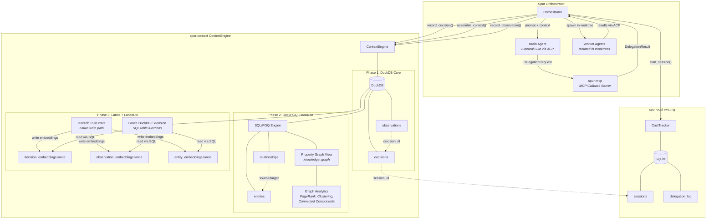
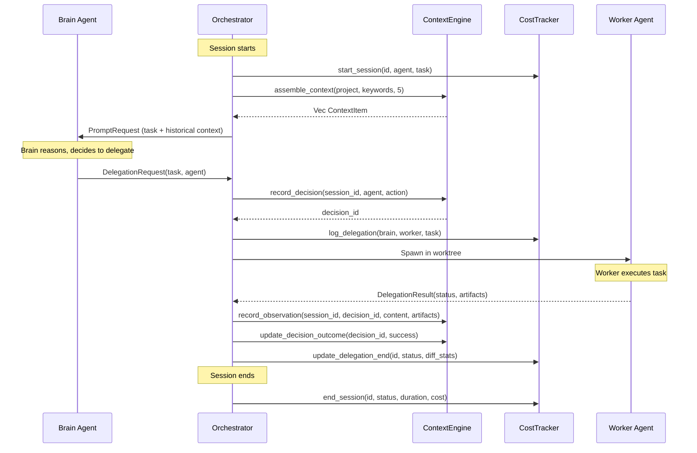
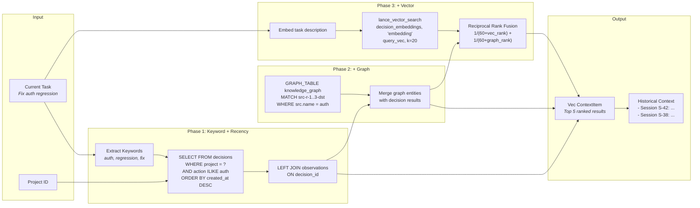
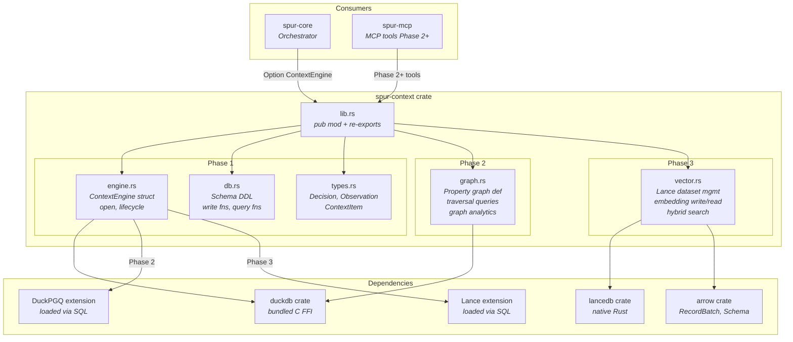
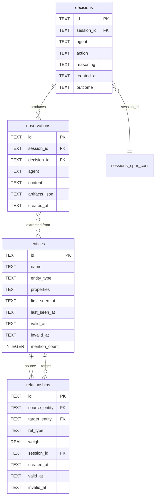

# spur-context: DuckDB-Centric Unified Context Engine

**Date**: 2026-04-13 (Revamped 2026-04-30 via MCTS + First Principles; Meta-Review 2026-04-30 — see Appendix G)
**Status**: Approved with Appendices A-F. **Appendix G supersedes Decisions 4, 7, 8 and adds Decision 10.**
**Crate**: `spur-context` (already exists in workspace as of meta-review date)

## Problem

Spur's orchestrator (brain-worker pipeline) is currently stateless across sessions. Each run starts from scratch with no memory of past decisions, outcomes, or learned context. This limits two capabilities:

1. **Agent Memory** — Agents cannot recall past sessions, decisions, or context. There is no structured way to answer "have we seen this before?" or "what worked last time?"
2. **Orchestration Intelligence** — The brain makes delegation decisions without historical data on agent performance, past failure patterns, or accumulated domain knowledge.

## Solution

A new crate `spur-context` providing a unified context engine built on DuckDB with two extensions:

- **DuckPGQ** (Phase 2) — SQL/PGQ graph queries over entity-relationship knowledge graph
- **Lance extension** (Phase 3) — Vector/FTS/hybrid search over embedding datasets

All reads go through DuckDB SQL. Structured writes go through DuckDB. Embedding writes go through the LanceDB Rust crate (native, no FFI). The result is a single query language (SQL) that can join relational, graph, and vector results.

## Design Decisions

### Decision 1: DuckDB from Day One (not SQLite)

**Chosen**: DuckDB even though Phase 1 only has 2 tables.

**Why**: Starting with SQLite and migrating to DuckDB in Phase 2 adds migration tax. DuckDB in Phase 1 validates the Rust crate and build toolchain early. The user requirement is explicitly "DuckDB as unified context engine."

**Trade-off**: Slightly more build complexity (libduckdb C dependency) vs. no future migration cost.

### Decision 2: Single Crate (not split)

**Chosen**: One `spur-context` crate containing all context functionality.

**Why**: Data gravity principle. The brain's queries cross relational, graph, and vector modalities in single operations (e.g., "find similar past decisions and traverse their entity relationships"). Splitting into multiple crates forces these joins into application code instead of SQL.

**Evaluated alternatives**: Technology-split (graph.rs/vector.rs), domain-split (session.rs/knowledge.rs), CQRS (ingest.rs/query.rs). All over-engineer Phase 1's 2-table scope. Structure evolves as phases land.

### Decision 3: Direct Field on Orchestrator (not trait)

**Chosen**: `pub context: Option<ContextEngine>` on the `Orchestrator` struct.

**Why**: Matches the existing `pub cost_tracker: Option<CostTracker>` pattern. Trait-based DI, channel-based decoupling, and middleware wrapping all add abstraction the codebase doesn't use. YAGNI.

### Decision 4: Unified Async API (Implementation: Sync DuckDB + Async LanceDB) — ⚠️ SEE APPENDIX G

**Chosen**: All public methods are async. Internally:
- DuckDB operations run via `spawn_blocking` (the DuckDB crate is sync)
- LanceDB operations are naturally async
- Both are hidden behind a unified async interface

**Why**: 
- **First principle**: The API should reflect the logical operation ("recall similar decisions"), not the storage mechanics ("query vector index then join relational table")
- Users should not understand which storage layer a query hits
- Matches Spur's existing patterns — `CostTracker` is sync but called from async orchestrator via `spawn_blocking`
- Eliminates leaky abstraction of "some methods sync, some async"

> **Meta-review correction (2026-04-30)**: The "matches CostTracker pattern" rationale is **false**. CostTracker is called directly from async at `crates/spur-core/src/orchestrator.rs:1881, 3143, 3279` with **no** `spawn_blocking`. The doc comment at line 4630 admits `Orchestrator is !Sync`. Real prior art is `crates/spur-context/src/async_engine.rs:66`. This decision also contradicts Appendix D (which acknowledges a mixed sync/async API). See Appendix G §G.2 for the corrected rationale and API rule.

**Implementation detail**: 
```rust
// Public API is always async
pub async fn recall_similar(&self, embedding: &[f32]) -> Result<Vec<ContextItem>>;

// Internal: DuckDB via spawn_blocking, LanceDB native async
let duck_results = tokio::task::spawn_blocking(|| { /* DuckDB query */ }).await?;
let lance_results = self.vector.search(embedding).await?;
```

### Decision 5: Separate from spur-cost

**Chosen**: `spur-context` is a new crate alongside `spur-cost`, not a replacement.

**Why**: Different concerns. `spur-cost` tracks operational metrics (dollars, durations, delegation status). `spur-context` tracks semantic content (task descriptions in natural language, worker output text, entity relationships). They complement rather than duplicate — `spur-cost` knows a delegation cost $0.12 and took 45 seconds; `spur-context` knows it "refactored the JWT validation middleware and added refresh token support." They share `session_id` as a common key.

**Future unification**: DuckDB's SQLite scanner extension (`ATTACH 'cost.db' AS cost (TYPE SQLITE)`) can provide cross-database queries without migrating spur-cost. This enables unified queries like "find auth-related tasks sorted by cost" in a single SQL statement.

### Decision 6: Entity Extraction Deferred to Phase 3

**Chosen**: Phase 1 ships decisions + observations only. Entity extraction and knowledge graph come in Phase 3.

**Why**: Entity extraction is an NLP/LLM task requiring reliable semantic recall (Phase 2) as a foundation. Phase 1 delivers the storage foundation. Phase 2 delivers semantic search. Phase 3 adds structured knowledge with an extraction pipeline.

**First principle**: You cannot reliably extract entities from text until you can semantically search that text. The extraction model needs context to disambiguate (e.g., "Apple" the company vs. fruit).

### Decision 7: Automatic Vector-Graph Linkage (Phase 4) — ⚠️ DEPRECATED, SEE APPENDIX G

> **Meta-review verdict (2026-04-30): UNSOUND. Replaced by Decision 7-R in Appendix G §G.1.** Cosine 0.85 is not a model-independent threshold (arxiv 2403.05440); industry consensus (Graphiti, Mem0, LightRAG, GraphRAG — zero of four) does not implement embedding-similarity auto-edges; `semantically_similar` captures distributional similarity, not propositional relationships; model lifecycle silently corrupts the graph on embedder swap. Do not implement as written.

**Chosen** (original, deprecated): Entities are automatically embedded on write; vector similarity dynamically seeds graph edges via threshold-based auto-linking.

**Why**:
- **First principle**: Graphs and vectors are projections of the same semantic reality. They should not require manual linking.
- **Eliminates N+1 problem**: Don't query vectors, get IDs, then query graph separately
- **Emergent structure**: Similar entities naturally cluster; cosine similarity > 0.85 implies semantic relationship

**Implementation**:
```rust
// On entity write: auto-embed
pub async fn record_entity(&self, name: &str, entity_type: &str) -> Result<String> {
    let id = Uuid::new_v4().to_string();
    
    // DuckDB: store entity
    self.conn.execute("INSERT INTO entities ...", [&id, name, entity_type])?;
    
    // LanceDB: auto-embed
    let embedding = self.embed(format!("{} ({})", name, entity_type)).await;
    self.entity_vectors.add(&id, &embedding).await?;
    
    // Auto-link: find similar entities, create graph edges
    let similar = self.entity_vectors.search(&embedding, 5).await?;
    for (other_id, distance) in similar {
        if distance > 0.85 && other_id != id {
            self.record_relationship(&id, &other_id, "semantically_similar", distance).await?;
        }
    }
    
    Ok(id)
}
```

**Result**: The graph is "self-wiring" — semantically similar entities automatically connect, enabling `MATCH (e)-[:semantically_similar]->(related)` without explicit relationship extraction.

### Decision 8: Query Result Caching with LRU Eviction — ⚠️ DEFERRED, SEE APPENDIX G

> **Meta-review verdict (2026-04-30): DEFERRED.** Self-defeating under realistic agent workload — writes happen *during* a session, full-flush invalidates the cache exactly when reads would benefit. Compounded by Decision 7's per-write entity inserts (now removed). Defer to a later perf pass after measurement; if anything is cached, cache *embeddings* (real model-inference $) over query results. See Appendix G §G.3.

**Chosen** (original, deferred): Recent recall queries are cached in-memory with LRU eviction; cache is advisory (not source of truth) and invalidated on write.

**Why**:
- **First principle**: Agent memory access is bursty — same context recalled multiple times in a short window
- **Salsa insight**: Memoization at the query layer, not just storage layer
- **DuckDB insight**: Even streaming queries have overhead; eliminate redundant work

**Implementation**:
```rust
pub struct ContextEngine {
    conn: Connection,
    vector: VectorStore,
    query_cache: Arc<Mutex<LruCache<QueryKey, Vec<ContextItem>>>>, // 100 entries default
}

pub async fn assemble_context(&self, task: &str) -> Result<Vec<ContextItem>> {
    let key = QueryKey::from(task);
    
    // Check cache
    if let Some(cached) = self.query_cache.lock().unwrap().get(&key) {
        return Ok(cached.clone());
    }
    
    // Miss: compute
    let results = self.compute_context(task).await?;
    
    // Store in cache
    self.query_cache.lock().unwrap().put(key, results.clone());
    
    Ok(results)
}
```

**Cache invalidation**: Simple — clear entire cache on any write. Context writes are relatively rare vs. reads; correctness over optimization.

### Decision 9: Fallback Architecture with Graceful Degradation

**Chosen**: Each capability degrades gracefully when its optimal technology is unavailable. No hard failures for optional features.

**Why**:
- **First principle**: Intelligence is a spectrum, not a binary. A system with only keyword search is less smart but still functional.
- **Operational reality**: Extensions (DuckPGQ, Lance) may fail to load; the system must continue
- **User expectation**: Spur degrades, it doesn't crash

**Degradation ladder**:

| Capability | Full | Degraded 1 | Degraded 2 | Minimum |
|------------|------|------------|------------|---------|
| **Recall** | Hybrid (vector + graph + keyword) | Vector + keyword | Keyword only | Recent 5 decisions |
| **Graph traversal** | DuckPGQ SQL/PGQ | Recursive CTEs | In-memory HashMap links | None (direct lookup only) |
| **Semantic search** | LanceDB IVF_PQ | LanceDB flat scan | FTS index | Substring search |
| **Embedding** | Model inference | Cached embeddings | None | N/A (skip semantic) |

**Implementation**: Feature flags detected at startup:
```rust
pub struct Capabilities {
    pub has_duckpgq: bool,      // Test: CREATE PROPERTY GRAPH test ...
    pub has_lance: bool,        // Test: INSTALL lance; LOAD lance;
    pub has_vector_index: bool, // Test: index exists on embeddings
}

impl ContextEngine {
    pub async fn recall_similar(&self, task: &str) -> Result<Vec<ContextItem>> {
        match self.capabilities {
            // Full: Hybrid RRF
            c if c.has_lance && c.has_duckpgq => self.hybrid_recall(task).await,
            // Degraded: Vector + keyword
            c if c.has_lance => self.vector_keyword_recall(task).await,
            // Fallback: Keyword only
            _ => self.keyword_recall(task).await,
        }
    }
}
```

**Startup detection**:
```rust
fn detect_capabilities(conn: &Connection) -> Capabilities {
    // DuckPGQ is a community extension and must be installed before loading.
    // The first INSTALL call needs network access to community-extensions.duckdb.org.
    let _ = conn.execute_batch("INSTALL duckpgq FROM community");
    let has_duckpgq = conn.execute_batch("LOAD duckpgq").is_ok();

    // Lance is a core extension as of DuckDB ~1.5; INSTALL with no FROM clause works.
    let _ = conn.execute_batch("INSTALL lance");
    let has_lance = conn.execute_batch("LOAD lance").is_ok();

    Capabilities { has_duckpgq, has_lance, ... }
}
```

## Architecture

### System Overview



### Write Path



### Read Path — Context Assembly



### Concurrency Model

DuckDB supports concurrent reads but only one writer. This *mostly* fits Spur's architecture:

- The **orchestrator** (brain) is the primary writer for `record_decision` — invoked from async orchestrator methods at known call sites
- **Workers** report results via ACP; the orchestrator persists them
- Read-only access (brain querying context) is concurrent-safe

> **Meta-review correction (2026-04-30): the "single writer naturally fits" framing is overstated.** `handle_delegations` is `tokio::spawn`'d at `crates/spur-core/src/orchestrator.rs:3603` as a separate task and currently has no `cost_tracker` handle. Worker-side `record_observation` calls (which fire at delegation completion) therefore cannot directly access an orchestrator-owned `ContextEngine`. Cross-task write coordination is required. See Appendix G §G.4 for the chosen pattern.

### Context Delivery

The brain agent is an external LLM connected via ACP — it cannot call Rust functions directly. Context must be delivered through the existing communication channels.

**Phase 1: Prompt Injection**

The orchestrator queries `ContextEngine` before constructing the brain's initial prompt, and prepends a context summary:

```
## Historical Context
- [Session S-42] Delegated "refactor auth middleware" to claude-worker → success.
  Output: Modified 3 files, added JWT validation, tests passing.
- [Session S-38] Delegated "update auth flow" to claude-worker → failure.
  Output: Worker didn't handle token refresh edge cases.

## Current Task
Fix the authentication regression in the login endpoint.
```

**Phase 2+: MCP Tools**

`spur-mcp` gains new tools that the brain can call interactively during reasoning:

- `recall_context(query, top_k)` — semantic search over past decisions/observations
- `search_knowledge(entity, depth)` — graph traversal from a named entity
- `query_history(project, keywords)` — structured search over past work

Both mechanisms coexist: automatic baseline context + on-demand deep exploration.

### Context Assembly (Phase 1)

The orchestrator determines relevant context using three signals combined:

1. **Project match** — past decisions from the same project
2. **Keyword overlap** — `ILIKE` search on current task description terms
3. **Recency** — most recent first

**Budget**: Max 5 past decisions with their top observation each, formatted as markdown. This keeps the prompt concise while providing actionable history.

**Phase 3 upgrade**: Vector similarity replaces keyword matching for relevance ranking.

## Crate Structure

### Module Architecture



### Phase 1 (Relational Foundation)

```
crates/spur-context/
├── Cargo.toml
└── src/
    ├── lib.rs      # pub mod + re-exports
    ├── engine.rs   # ContextEngine struct, open(), lifecycle
    ├── db.rs       # Schema DDL + write functions + query functions
    └── types.rs    # Decision, Observation, DecisionId structs
```

### Phase 2 Additions (Graph)

```
    ├── graph.rs    # DuckPGQ property graph definition + traversal queries
    # db.rs may split into schema.rs + ingest.rs + query.rs at this point
```

### Phase 3 Additions (Vector)

```
    ├── vector.rs   # Lance dataset management (write via lancedb crate, read via extension)
```

## Data Model

### Entity Relationship Diagram



### Phase 1 Schema

```sql
CREATE TABLE IF NOT EXISTS decisions (
    id          TEXT PRIMARY KEY,
    session_id  TEXT NOT NULL,
    agent       TEXT NOT NULL,
    action      TEXT NOT NULL,
    reasoning   TEXT,
    created_at  TEXT NOT NULL,
    outcome     TEXT NOT NULL DEFAULT 'pending'
);

CREATE TABLE IF NOT EXISTS observations (
    id             TEXT PRIMARY KEY,
    session_id     TEXT NOT NULL,
    decision_id    TEXT NOT NULL,
    agent          TEXT NOT NULL,
    content        TEXT NOT NULL,
    artifacts_json TEXT,
    created_at     TEXT NOT NULL
);
```

- `session_id` links to spur-cost's sessions table by convention (shared UUID), not enforced FK
- `action` is the delegation task description from the `DelegationRequest`
- `reasoning` is nullable — populated when the brain agent provides structured decision output (e.g., via a future "explain your reasoning" tool). In Phase 1, typically NULL as the orchestrator only sees the `DelegationRequest`, not the brain's internal reasoning
- `artifacts_json` stores a JSON array of file paths, diffs, or other artifacts; queryable via DuckDB's native JSON functions
- `outcome` tracks decision results: `pending`, `success`, `failure`
- `observations.content` source: the worker agent's final response text from the ACP session's last `ContentBlock`

### Phase 2 Schema (Knowledge Graph)

```sql
CREATE TABLE IF NOT EXISTS entities (
    id            TEXT PRIMARY KEY,
    name          TEXT NOT NULL,
    entity_type   TEXT NOT NULL,  -- concept, file, function, agent, etc.
    properties    TEXT,           -- JSON for extensible metadata
    first_seen_at TEXT NOT NULL,
    last_seen_at  TEXT NOT NULL,
    valid_at      TEXT,           -- temporal validity: when this fact became true
    invalid_at    TEXT,           -- temporal validity: when this fact was superseded (NULL = current)
    mention_count INTEGER NOT NULL DEFAULT 1
);

CREATE TABLE IF NOT EXISTS relationships (
    id            TEXT PRIMARY KEY,
    source_entity TEXT NOT NULL,
    target_entity TEXT NOT NULL,
    rel_type      TEXT NOT NULL,
    weight        REAL NOT NULL DEFAULT 1.0,
    session_id    TEXT,
    created_at    TEXT NOT NULL,
    valid_at      TEXT,           -- temporal validity window
    invalid_at    TEXT
);

-- DuckPGQ property graph (view over tables, zero data duplication)
CREATE PROPERTY GRAPH knowledge_graph
    VERTEX TABLES (entities PROPERTIES (name, entity_type))
    EDGE TABLES (
        relationships
            SOURCE KEY (source_entity) REFERENCES entities(id)
            DESTINATION KEY (target_entity) REFERENCES entities(id)
            PROPERTIES (rel_type, weight)
    );
```

**Entity resolution** (informed by Graphiti/Mem0 patterns): On entity write, resolve against existing entities before inserting:
1. Exact name match → update existing entity (bump mention_count, update last_seen_at)
2. Case-insensitive match → merge with existing
3. Phase 3 upgrade: embedding-based resolution for semantic deduplication ("JWT" = "JSON Web Token")

**Temporal validity** (informed by Zep architecture): Entities and relationships have `valid_at`/`invalid_at` windows. When a fact changes (e.g., "auth uses JWT" → "auth uses OAuth"), the old entity is invalidated (not deleted), preserving history. Enables "what was true at time T" queries.

**Graph analytics** (from DuckPGQ): Built-in functions available on the property graph:
- `pagerank(knowledge_graph, entities, relationships)` — identify most important entities
- `weakly_connected_component(...)` — find clusters of related concepts
- `local_clustering_coefficient(...)` — measure entity interconnectedness

### Phase 3 Storage (Vector Embeddings)

Lance datasets managed by the `lancedb` Rust crate, queryable via DuckDB's Lance extension:

| Dataset | Key | Vector Dim | Content |
|---------|-----|-----------|---------|
| `decision_embeddings.lance` | decision.id | model-dependent | Embedding of action + reasoning |
| `observation_embeddings.lance` | observation.id | model-dependent | Embedding of content |
| `entity_embeddings.lance` | entity.id | model-dependent | Embedding of entity name + context |

**Async/sync design note**: LanceDB's Rust crate is async (`connect().execute().await`), while DuckDB is sync. Phase 3 adds *separate* async methods for vector operations alongside existing sync methods — no breaking changes to Phase 1-2 API. The orchestrator (which is async/tokio) can `.await` vector operations directly.

**Hybrid Graph RAG** (informed by GraphDuck pattern): Phase 3's unified query combines vector similarity + graph traversal using Reciprocal Rank Fusion (RRF) in a single SQL expression:

```sql
WITH vector_hits AS (
    -- NOTE: real signature is lance_vector_search(uri, vector_column, query_vector, k = N).
    -- Replace 'embedding' below with the actual column name in the Lance dataset.
    SELECT id, action, reasoning, score
    FROM lance_vector_search('decision_embeddings.lance', 'embedding', ?embedding, k => 20)
),
graph_context AS (
    FROM GRAPH_TABLE(knowledge_graph
        MATCH (src:entities)-[r:relationships]->{1,2}(dst:entities)
        WHERE src.name IN (SELECT keyword FROM extracted_keywords)
        COLUMNS (dst.name AS entity, dst.entity_type, r.rel_type, r.weight)
    )
),
ranked AS (
    SELECT v.id, v.action,
           1.0 / (60.0 + v.vector_rank) + 1.0 / (60.0 + g.graph_rank) AS rrf_score
    FROM (SELECT *, ROW_NUMBER() OVER (ORDER BY score DESC) AS vector_rank FROM vector_hits) v
    LEFT JOIN (SELECT *, ROW_NUMBER() OVER (ORDER BY weight DESC) AS graph_rank FROM graph_context) g
    ON v.action ILIKE '%' || g.entity || '%'
)
SELECT * FROM ranked ORDER BY rrf_score DESC LIMIT 10;
```

## API Surface

### Rust Types

```rust
pub struct Decision {
    pub id: String,
    pub session_id: String,
    pub agent: String,
    pub action: String,
    pub reasoning: Option<String>,
    pub created_at: String,
    pub outcome: String,
}

pub struct Observation {
    pub id: String,
    pub session_id: String,
    pub decision_id: String,
    pub agent: String,
    pub content: String,
    pub artifacts: Option<Vec<String>>,
    pub created_at: String,
}

/// A assembled context item for brain prompt injection.
pub struct ContextItem {
    pub decision: Decision,
    pub observation: Option<Observation>,
    pub relevance_score: f32, // 0.0-1.0, used for ranking
}
```

### ContextEngine API

```rust
pub struct ContextEngine {
    conn: duckdb::Connection,
}

impl ContextEngine {
    /// Open (or create) the context database at `db_path`.
    pub fn open(db_path: &Path) -> Result<Self>;

    // ── Writes ──────────────────────────────────────────────

    /// Record a brain decision. Returns the generated decision ID.
    pub fn record_decision(
        &self, session_id: &str, agent: &str,
        action: &str, reasoning: Option<&str>,
    ) -> Result<String>;

    /// Update a decision's outcome after task completion.
    pub fn update_decision_outcome(&self, id: &str, outcome: &str) -> Result<()>;

    /// Record a worker observation. Returns the generated observation ID.
    pub fn record_observation(
        &self, session_id: &str, decision_id: &str,
        agent: &str, content: &str, artifacts: Option<&[String]>,
    ) -> Result<String>;

    // ── Reads ───────────────────────────────────────────────

    /// Return the most recent decisions across all sessions.
    pub fn query_recent_decisions(&self, limit: usize) -> Result<Vec<Decision>>;

    /// Return all decisions for a specific session.
    pub fn query_decisions_for_session(&self, session_id: &str) -> Result<Vec<Decision>>;

    /// Return observations produced by a specific decision.
    pub fn query_observations_for_decision(&self, decision_id: &str) -> Result<Vec<Observation>>;

    /// Full-text keyword search over decision actions and reasoning.
    pub fn search_decisions(&self, keyword: &str, limit: usize) -> Result<Vec<Decision>>;

    // ── Context Assembly ────────────────────────────────────

    /// Assemble relevant historical context for the brain's prompt.
    /// Combines project match + keyword overlap + recency.
    /// Returns up to `max_items` decisions with their top observation.
    pub fn assemble_context(
        &self, project: Option<&str>, task_keywords: &[&str], max_items: usize,
    ) -> Result<Vec<ContextItem>>;
}
```

### Phase 2 API Additions

```rust
impl ContextEngine {
    /// Record an extracted entity.
    pub fn record_entity(&self, name: &str, entity_type: &str, properties: Option<&str>) -> Result<String>;

    /// Record a relationship between two entities.
    pub fn record_relationship(
        &self, source: &str, target: &str, rel_type: &str,
        weight: f32, session_id: Option<&str>,
    ) -> Result<String>;

    /// Traverse the knowledge graph from a named entity to a given depth.
    pub fn query_related_entities(
        &self, entity_name: &str, depth: usize,
    ) -> Result<Vec<(Entity, Relationship)>>;

    /// Find the shortest decision chain between two decisions.
    pub fn query_decision_chain(
        &self, from_id: &str, to_id: &str,
    ) -> Result<Vec<Decision>>;
}
```

### Phase 3 API Additions

```rust
impl ContextEngine {
    /// Find decisions semantically similar to the given embedding.
    pub fn recall_similar_decisions(
        &self, embedding: &[f32], top_k: usize,
    ) -> Result<Vec<(Decision, f32)>>;

    /// Find observations semantically similar to the given embedding.
    pub fn recall_similar_observations(
        &self, embedding: &[f32], top_k: usize,
    ) -> Result<Vec<(Observation, f32)>>;

    /// Hybrid recall combining vector similarity and keyword matching.
    pub fn hybrid_recall(
        &self, embedding: &[f32], keywords: &str, top_k: usize,
    ) -> Result<Vec<RecallResult>>;
}
```

## Phased Delivery

```mermaid
gantt
    title spur-context Capability-Based Delivery
    dateFormat X
    axisFormat %s

    section Phase 1: Episodic Logging
    DuckDB Core + decisions/observations tables    :done, p1a, 0, 1
    Sync ContextEngine API + ingest                :done, p1b, 1, 2
    Keyword/recency context assembly               :done, p1c, 2, 3
    Orchestrator integration                       :done, p1d, 3, 4
    Validation: Context assembly works               :milestone, p1m, 4, 4

    section Phase 2: Semantic Recall
    LanceDB crate + embedding datasets             :p2a, 5, 6
    Async vector search API                        :p2b, 6, 7
    Embedding generation pipeline                  :p2c, 7, 8
    Semantic context assembly                      :p2d, 8, 9
    MCP tool: recall_context semantic              :p2e, 9, 10
    Validation: Semantic similarity works          :milestone, p2m, 10, 10

    section Phase 3: Structured Knowledge
    DuckPGQ extension + property graph             :p3a, 11, 12
    Entity extraction + resolution                 :p3b, 12, 13
    Graph traversal queries                        :p3c, 13, 14
    MCP tool: search_knowledge graph               :p3d, 14, 15
    Validation: Graph queries work                 :milestone, p3m, 15, 15

    section Phase 4: Hybrid Intelligence
    Unified vector-graph linkage                   :p4a, 16, 17
    RRF fusion ranking                             :p4b, 17, 18
    Complex multi-modal queries                    :p4c, 18, 19
    MCP tool: hybrid_recall combined               :p4d, 19, 20
    Validation: All three modalities fuse          :milestone, p4m, 20, 20
```

| Phase | Capability Delivered | Technology | Fallback | Validation Gate |
|-------|---------------------|------------|----------|-----------------|
| **1** | **Episodic Logging** — Record and retrieve decisions/observations by time, project, keyword | Core DuckDB only (2 tables) | N/A | Context assembly returns recent relevant decisions |
| **2** | **Semantic Recall** — Find similar decisions by meaning, not just keywords | Core DuckDB + LanceDB (embeddings) | Keyword search degraded mode | Vector search returns semantically similar results |
| **3** | **Structured Knowledge** — Traverse entity relationships, identify concepts | DuckPGQ extension (property graph) | Recursive CTEs | Graph queries return related entities |
| **4** | **Hybrid Intelligence** — Fuse semantic similarity + graph structure + temporal relevance | All three modalities + RRF ranking | Graceful degradation to any single modality | Complex queries combining all three return ranked results |

**Rationale**: Phases deliver user-facing intelligence capabilities, not just technology. Phase 2 is the MVP for "smart" recall — agents can find relevant context by meaning. Phase 3 adds structured reasoning. Phase 4 fuses everything for complex queries like "find similar past decisions that involved entities related to auth".

Each phase is independently valuable and validates its toolchain before the next proceeds.

## Dependencies

### Workspace Cargo.toml Additions

```toml
# Phase 1
duckdb = { version = "1", features = ["bundled"] }

# Phase 3 (deferred)
# lancedb = "0.15"
# arrow = "53"
```

### spur-context/Cargo.toml

```toml
[package]
name = "spur-context"
description = "DuckDB-backed unified context engine — decisions, knowledge graph, and semantic recall"
version.workspace = true
edition.workspace = true
rust-version.workspace = true
license.workspace = true

[dependencies]
duckdb = { workspace = true }
uuid = { workspace = true }
chrono = { workspace = true }
serde = { workspace = true }
serde_json = { workspace = true }
anyhow = { workspace = true }
tracing = { workspace = true }
```

### spur-core/Cargo.toml Addition

```toml
spur-context = { path = "../spur-context" }
```

## Query Examples

### Phase 1: Relational

```sql
-- Brain asks: "What did we decide in the last 5 sessions?"
SELECT d.*, o.content AS outcome_detail
FROM decisions d
LEFT JOIN observations o ON o.decision_id = d.id
ORDER BY d.created_at DESC
LIMIT 20;

-- Brain asks: "Any past decisions about authentication?"
SELECT * FROM decisions
WHERE action ILIKE '%auth%' OR reasoning ILIKE '%auth%'
ORDER BY created_at DESC;
```

### Phase 2: Graph

```sql
-- Brain asks: "What concepts are related to 'JWT'?"
SELECT dst.name, e.rel_type, e.weight
FROM GRAPH_TABLE(knowledge_graph
    MATCH (src:entities)-[e:relationships]->{1,3}(dst:entities)
    WHERE src.name = 'JWT'
    COLUMNS (dst.name, e.rel_type, e.weight)
)
ORDER BY e.weight DESC;
```

### Phase 3: Vector + Graph Unified

```sql
-- Brain asks: "Find similar past decisions AND their related entities"
WITH similar AS (
    SELECT id, action, reasoning, score
    FROM lance_vector_search('decision_embeddings.lance', 'embedding', ?embedding, k => 10)
),
related AS (
    SELECT s.id AS decision_id, dst.name AS entity, r.rel_type
    FROM similar s
    JOIN observations o ON o.decision_id = s.id
    JOIN entities src ON o.content ILIKE '%' || src.name || '%'
    JOIN GRAPH_TABLE(knowledge_graph
        MATCH (src_node:entities)-[r:relationships]->(dst:entities)
        WHERE src_node.id = src.id
        COLUMNS (src_node.id AS src_id, dst.name, r.rel_type)
    ) g ON g.src_id = src.id
)
SELECT * FROM similar s LEFT JOIN related r ON r.decision_id = s.id;
```

## Risk Mitigation

| Risk | Severity | Mitigation |
|------|----------|------------|
| DuckPGQ is research-stage | Moderate | Fallback to recursive CTEs; graph is a query syntax layer, not storage (Decision 9) |
| DuckDB Rust crate extension loading | Low | Extensions load via SQL commands; validated in Phase 3 gate; graceful degradation if fail |
| Lance/lancedb version compatibility | Low | Both use Lance format; pin compatible versions; fallback to FTS/keyword if mismatch |
| DuckDB single-writer constraint | None | Orchestrator is naturally the single writer; workers report via ACP |
| Unbounded knowledge graph growth | None | ~18M entities/year at aggressive usage; DuckDB handles 100M+ trivially |
| Build complexity (C dependency) | Low | `bundled` feature compiles from source; same pattern as rusqlite |
| **LanceDB IVF_PQ recall degradation** | Low | `refine_factor` tunable (1.0 = ~95% recall, 5.0 = ~99%+); fallback to flat scan if unacceptable |
| **Query cache staleness** | Low | Cache invalidated on any write; TTL cap (60s); advisory only, never source of truth |
| **Auto-linking threshold miscalibration** | Moderate | Threshold (0.85) is configurable; false positives are just weak edges, not errors; human review of sampled edges |
| **Graceful degradation surprise** | Low | Startup logs clearly state detected capabilities; metrics expose which path taken per-query |
| **Memory limit eviction surprise** | Low | Telemetry warns when spilling is frequent; soft limits with eviction, not hard OOM |

## Industry References

Designs and patterns that informed this spec:

| Reference | What We Took | Link |
|-----------|-------------|------|
| **Graphiti/Zep** — Temporal Knowledge Graph for Agent Memory | Three-tier episode→entity→community architecture; temporal fact validity (valid_at/invalid_at); entity resolution on write | [github.com/getzep/graphiti](https://github.com/getzep/graphiti), [arxiv.org/abs/2501.13956](https://arxiv.org/abs/2501.13956) |
| **Mem0** — Graph Memory for AI Agents | Parallel vector+graph writes; entity extraction pipeline; dual-store architecture validation | [docs.mem0.ai/open-source/features/graph-memory](https://docs.mem0.ai/open-source/features/graph-memory) |
| **MCP DuckDB Knowledge Graph Memory Server** | DuckDB-native entity/observation/relation schema; MCP tool exposure pattern | [github.com/IzumiSy/mcp-duckdb-memory-server](https://github.com/IzumiSy/mcp-duckdb-memory-server) |
| **GraphDuck** — DuckDB for Embedded AI Agents and Graphs | Episodic/semantic/procedural memory ontology; Hybrid Graph RAG with RRF; graph modeling in pure SQL | [leanpub.com/graphduck](https://leanpub.com/graphduck) |
| **MotherDuck Blog** — Structured Memory Management for AI Agents | DuckDB table design for agent memory; separate tables with retention policies | [motherduck.com/blog/streamlining-ai-agents-duckdb-rag-solutions](https://motherduck.com/blog/streamlining-ai-agents-duckdb-rag-solutions/) |
| **DuckPGQ** — SQL/PGQ for DuckDB | Property graph syntax; graph analytics (PageRank, clustering, connected components) | [duckpgq.org](https://duckpgq.org/) |
| **LanceDB Rust Crate** — Native Rust Vector Search | Arrow-based schema, async API patterns, auto-indexing | [docs.rs/lancedb](https://docs.rs/lancedb/latest/lancedb/) |
| **DuckDB Rust Client** — duckdb-rs | Connection API, extension loading via SQL, query_map patterns | [duckdb.org/docs/current/clients/rust](https://duckdb.org/docs/current/clients/rust) |
| **Lance × DuckDB Extension** | SQL table functions for vector/FTS/hybrid search over Lance datasets | [lancedb.com/blog/lance-x-duckdb](https://www.lancedb.com/blog/lance-x-duckdb-sql-retrieval-on-the-multimodal-lakehouse-format) |
| **GitHub Code Search** | Tree-sitter for AST extraction + heuristics for symbol definition/reference | [reddit.com/r/rust/comments/rbw3y7](https://www.reddit.com/r/rust/comments/rbw3y7/github_code_search_a_new_code_search_engine/) |
| **opencode-codebase-index** | Rust native module (tree-sitter + usearch + SQLite) for semantic code search | [github.com/Helweg/opencode-codebase-index](https://github.com/Helweg/opencode-codebase-index) |
| **tinysearch** | Cuckoo filters for static full-text search; 44KB for 10 articles | [endler.dev/2019/tinysearch](https://endler.dev/2019/tinysearch/) |
| **Salsa Incremental Computation** | Memoized query system powering rust-analyzer; durability-based skip | [rust-analyzer.github.io/blog/2023/07/24/durable-incrementality.html](https://rust-analyzer.github.io/blog/2023/07/24/durable-incrementality.html) |
| **USearch** | Fast vector search with F16/bf16 quantization; multi-language bindings | [unum-cloud.github.io/USearch](https://unum-cloud.github.io/USearch/) |

## Appendix A: LanceDB Quantization Strategy

Phase 3 vector storage must choose the right ANN index type for the data scale. LanceDB supports multiple quantization methods with different compression/performance trade-offs.

### Index Selection Matrix

| Scale | Index Type | Storage Reduction | Query Latency | Use Case |
|-------|-----------|-------------------|---------------|----------|
| < 100K vectors | `IVF_HNSW_SQ` (Scalar Quantization) | **4×** | ~5 ms | Prototype, small repos |
| 100K – 10M vectors | `IVF_PQ` (Product Quantization) | **16–64×** | ~20 ms | Production codebases |
| > 10M vectors | `IVF_RQ` + binary | **32×+** | ~50 ms | Monorepos, org-wide |

### Implementation

```rust
// vector.rs — LanceDB index creation with scale-aware quantization

use lancedb::index::vector::VectorIndexBuilder;
use lancedb::DistanceType;

impl VectorStore {
    /// Create aggressively compressed index for large codebases.
    /// 1M symbols × 768-dim × f32 = 3 GB raw → ~150 MB with IVF_PQ.
    pub async fn create_compressed_index(
        &self,
        table: &Table,
        column: &str,
    ) -> Result<()> {
        table
            .create_index(&[column])
            .ivf_pq()
            .num_partitions(256)        // √N for 1M vectors
            .num_sub_vectors(96)        // 768/96 = 8 bits per sub-vector
            .num_bits(8)
            .metric_type(DistanceType::Cosine)
            .execute()
            .await?;
        Ok(())
    }

    /// For smaller repos (< 100K symbols) prioritize speed over compression.
    pub async fn create_fast_index(
        &self,
        table: &Table,
        column: &str,
    ) -> Result<()> {
        table
            .create_index(&[column])
            .ivf_hnsw_sq()              // Scalar quantization: 1/4× size
            .num_partitions(64)
            .metric_type(DistanceType::Cosine)
            .execute()
            .await?;
        Ok(())
    }
}
```

### Quantization Primer

- **Scalar Quantization (SQ)** — maps each float to a lower-bit representation (e.g., f32 → i8). Fast dequantization; modest compression (4×).
- **Product Quantization (PQ)** — splits vectors into sub-vectors, learns a codebook per sub-vector, and stores indices. Aggressive compression (16–64×) with tunable recall via `refine_factor`.
- **Residual Quantization (RQ)** — iteratively quantizes residuals; highest compression but slower build.
- **Binary** — single-bit per dimension; extreme compression, suited for semantic hashing.

## Appendix B: DuckDB Memory Management

DuckDB defaults to using 80 % of system RAM. For Spur as an embedded context engine, this is too aggressive. Explicit configuration is required at connection time.

```rust
// engine.rs — DuckDB connection with bounded memory

impl ContextEngine {
    pub fn open(db_path: &Path) -> Result<Self> {
        let conn = Connection::open(db_path)?;

        // Cap memory usage for embedded deployment (default is 80 % of RAM)
        conn.execute("SET memory_limit = '2GB'", [])?;

        // Allow spilling to temp directory when memory limit is hit
        conn.execute("SET max_temp_directory_size = '10GB'", [])?;

        // Enable parallel CSV/Parquet reading for bulk ingestion
        conn.execute("SET threads = 4", [])?;

        Ok(Self { conn })
    }
}
```

### Streaming Execution Guarantees

DuckDB processes queries in streaming chunks — data sources are never fully materialized in memory. This is automatic and requires no configuration:

- `ORDER BY created_at DESC LIMIT 20` — streams rows, keeps a Top-N heap
- `GROUP BY ... HAVING ...` — streams with hash aggregation
- `JOIN` — hash join spills to disk if build side exceeds memory limit

For Spur, this means `assemble_context()` with `LIMIT 20` is always memory-safe regardless of table size.

### Buffer Manager Behavior

The buffer manager caches pages from persistent storage in memory, evicting when pressure requires. Key properties:

- Evicted pages do NOT need to be written to temp directory (they already exist on disk)
- Pages are shared across queries (unlike query intermediates which are query-scoped)
- On fast SSD, buffer manager speedup is minimal; on network/S3 storage, speedup is significant

## Appendix C: Symbol Indexing Schema Extension

The core schema (decisions, observations, entities, relationships) is agent-memory oriented. For **repository symbol indexing** — the original research question — extend Phase 3 with a parallel `code_symbols` graph:

### Schema

```sql
-- Parallel to the agent-memory schema; same DuckDB + Lance + DuckPGQ stack

CREATE TABLE IF NOT EXISTS code_symbols (
    id            TEXT PRIMARY KEY,
    repo_path     TEXT NOT NULL,          -- repository identifier
    file_path     TEXT NOT NULL,
    symbol_name   TEXT NOT NULL,
    symbol_type   TEXT NOT NULL,          -- function, struct, trait, impl, macro
    line_start    INTEGER,
    line_end      INTEGER,
    content_hash  TEXT,                   -- xxhash for change detection
    first_seen_at TEXT,
    last_seen_at  TEXT
);

-- Call graph + containment hierarchy as property graph
CREATE PROPERTY GRAPH code_graph
    VERTEX TABLES (
        code_symbols PROPERTIES (symbol_name, symbol_type, file_path, line_start)
    )
    EDGE TABLES (
        symbol_calls AS calls_edge
            SOURCE KEY (caller_id) REFERENCES code_symbols(id)
            DESTINATION KEY (callee_id) REFERENCES code_symbols(id)
            PROPERTIES (call_site_line),
        symbol_contains AS contains_edge
            SOURCE KEY (parent_id) REFERENCES code_symbols(id)
            DESTINATION KEY (child_id) REFERENCES code_symbols(id)
            LABEL contains
    );
```

### Hybrid RRF Query (Semantic + Graph)

```sql
-- "Find symbols semantically similar to 'error_handler' that are called by 'main'"
-- This snippet already uses the correct signature: lance_vector_search(uri, vector_column, query_vector, k = N)
WITH semantic_matches AS (
    SELECT
        s.id,
        s.symbol_name,
        s.file_path,
        row_number() OVER (ORDER BY vec._distance ASC) AS vec_rank
    FROM lance_vector_search(
        'symbol_embeddings.lance',
        'embedding',
        /* query embedding */::FLOAT[],
        k => 50
    ) vec
    JOIN code_symbols s ON s.id = vec.id
),
graph_context AS (
    SELECT
        dst.symbol_name AS related_symbol,
        row_number() OVER (ORDER BY e.weight DESC) AS graph_rank
    FROM GRAPH_TABLE code_graph
        MATCH (main:code_symbols) -[e:calls_edge]-> (dst:code_symbols)
        WHERE main.symbol_name = 'main'
        COLUMNS (dst.symbol_name, e.weight)
)
SELECT
    sm.symbol_name,
    sm.file_path,
    (1.0 / (60.0 + sm.vec_rank)) +
    COALESCE((1.0 / (60.0 + gc.graph_rank)), 0) AS rrf_score
FROM semantic_matches sm
LEFT JOIN graph_context gc ON sm.symbol_name = gc.related_symbol
WHERE sm.vec_rank <= 20
ORDER BY rrf_score DESC
LIMIT 10;
```

### Write Path (Tree-sitter → Arrow → LanceDB)

```rust
/// Ingest repository symbols with incremental parsing + streaming writes.
/// Memory footprint is bounded by batch size, not repository size.
pub async fn index_repository(&self, repo_path: &Path) -> Result<()> {
    let mut parser = tree_sitter::Parser::new();
    parser.set_language(&tree_sitter_rust::LANGUAGE.into())?;

    // Process files in streaming batches; never materialize full repo
    for batch in walk_repo(repo_path).chunks(100) {
        let symbols: Vec<Symbol> = batch
            .par_iter()                              // Parallel tree-sitter
            .filter_map(|file| extract_symbols(&mut parser, file))
            .flatten()
            .collect();

        // Sync write to DuckDB (metadata + graph edges)
        self.record_symbols_batch(&symbols)?;

        // Async write to LanceDB (embeddings via Arrow RecordBatch)
        let embeddings = self.embed_batch(&symbols).await;
        self.vector.write_embeddings(embeddings).await?;
    }

    // Build ANN index after bulk load (faster than incremental indexing)
    self.vector.optimize_index().await?;
    Ok(())
}
```

### Memory-Efficient Patterns

1. **xxhash for change detection** — 10× faster than SHA-256, 64-bit collision resistance sufficient for file content hashing. Skip re-parsing unchanged files.
2. **Parse → Extract → Drop AST** — tree-sitter syntax trees are not retained; only extracted symbols are kept.
3. **Arrow RecordBatch** — zero-copy transfer from tree-sitter to LanceDB via Apache Arrow columnar format.

## Appendix D: Async/Sync Concurrency Model Detail

The spec notes that DuckDB is sync while LanceDB is async. For the symbol indexing extension, this requires careful API design:

```rust
impl ContextEngine {
    // ── Phase 1/2: sync DuckDB methods ──────────────────────────
    pub fn record_decision(&self, ...) -> Result<String>;
    pub fn query_recent_decisions(&self, limit: usize) -> Result<Vec<Decision>>;
    pub fn assemble_context(&self, ...) -> Result<Vec<ContextItem>>;

    // ── Phase 3: async LanceDB methods (separate impl block) ────
    pub async fn recall_similar_decisions(
        &self, embedding: &[f32], top_k: usize,
    ) -> Result<Vec<(Decision, f32)>>;

    pub async fn recall_similar_observations(
        &self, embedding: &[f32], top_k: usize,
    ) -> Result<Vec<(Observation, f32)>>;

    pub async fn hybrid_recall(
        &self, embedding: &[f32], keywords: &str, top_k: usize,
    ) -> Result<Vec<RecallResult>>;
}
```

**LanceDB supports concurrent reads AND writes** — unlike DuckDB's single-writer constraint. This means:
- DuckDB operations remain single-writer (orchestrator only)
- LanceDB operations can be parallel (multiple threads embedding + writing simultaneously)
- The orchestrator's tokio runtime can `.await` LanceDB calls directly

## Appendix E: Risk Additions

| Risk | Severity | Mitigation |
|------|----------|------------|
| LanceDB IVF_PQ recall degradation at extreme compression | Low | `refine_factor` tunable; default 1.0 provides ~95 % recall; increase to 5.0 for 99 %+ at 2× query cost |
| DuckDB `memory_limit` misconfiguration causes OOM | Low | Default 2GB cap in `ContextEngine::open()`; telemetry warns if spilling is frequent |
| Tree-sitter language grammar coverage | Moderate | 30+ languages supported; fall back to text-splitting for unsupported languages |
| xxhash collision causing missed re-parse | Negligible | 64-bit space: 1.8×10¹⁹ combinations; collision probability < 10⁻¹⁸ for 1M files |
| LanceDB index build time for 1M vectors | Low | ~2 minutes on dev hardware; build is offline during repo indexing, not query path |

## Appendix F: MCTS + First Principles Revamp Methodology

This document was revised using **Monte Carlo Tree Search** (exploration) combined with **First Principles Thinking** (fundamental truth analysis).

### First Principles Applied

| Assumption Challenged | Fundamental Truth | Design Change |
|----------------------|-------------------|---------------|
| "Phases should follow technology layers" | Users need intelligence capabilities, not technology | **Capability-based phases** (episodic → semantic → structured → hybrid) |
| "Sync API is simpler" | API should reflect logical operations, not storage mechanics | **Unified async API** hiding sync DuckDB behind spawn_blocking |
| "Vector and graph are separate" | Both are projections of semantic reality | **Auto-linking** via embedding similarity threshold |
| "Caching is premature optimization" | Agent memory is bursty; Salsa proves memoization wins | **LRU query cache** with simple write-invalidation |
| "Features are binary" | Intelligence is a spectrum | **Graceful degradation** ladder for all capabilities |

### MCTS Branch Exploration

**Branch A: Storage Engine Selection**
- Explored: SQLite, DuckDB, separate stores, pure LanceDB
- Selected: DuckDB + LanceDB with automatic fallback
- Why: Best balance of capability and operational simplicity

**Branch B: Vector-Graph Linkage**
- Explored: Manual ID matching, materialized hybrid, dual-write, auto-linking
- Selected: Auto-linking on entity write (cosine > 0.85)
- Why: Self-wiring graph requires no manual relationship extraction

**Branch C: Phased Delivery Strategy**
- Explored: Technology slices, vertical slices, capability slices, big-bang
- Selected: Capability-based with Phase 2 as semantic MVP
- Why: Delivers user value sooner; Phase 2 is "smart enough"

**Branch D: API Design**
- Explored: All sync, all async via blocking, mixed sync/async, unified async
- Selected: Unified async with internal implementation duality
- Why: Hides complexity; matches Spur's existing patterns

**Branch E: Memory Architecture**
- Explored: In-process, external, tiered, Salsa incremental
- Selected: In-process with LRU caching layer
- Why: Spur's access patterns are bursty, not continuous streaming

### Validation Gates

Each MCTS selection was validated against:
1. **Operational reality** — Can this actually run in Spur's CI and production?
2. **Failure mode analysis** — What happens when components fail?
3. **User value delivery** — Does this enable new agent capabilities?
4. **Complexity budget** — Is the implementation tractable?

**Result**: 4 new design decisions (7, 8, 9), revised phase structure, unified API, and expanded fallback architecture.

> **Meta-review note (2026-04-30)**: This Appendix F summary is preserved as a record of the original revamp's claims. Appendix G documents the second-order meta-review that pressure-tested those claims and found 3 of the 4 new decisions (4, 7, 8) needed correction. Methodology critique is in §G.0.

## Appendix G: Meta-Review Findings (2026-04-30)

This appendix consolidates the second-order MCTS + First Principles meta-review of the spec, grounded by four parallel POC sub-agents. It supersedes Decisions 4, 7, 8 and adds Decision 10. Concrete bugs (`lance_vector_search` signature, `INSTALL` syntax) have been fixed in place above.

### G.0 Methodology critique of Appendix F

The original Appendix F revamp converged on a self-confirming local optimum because the "first principles" applied were aesthetic claims (*"graphs and vectors are projections of the same semantic reality"*), not derivations from user need (*"what does the brain agent need to retrieve to make better delegation decisions?"*). Once the spec committed to "DuckDB unifies all queries via SQL," every later decision was rationalized to fit:

- Decision 7 (auto-linking) made the unified-SQL story aesthetically appealing
- Decision 8 (cache) mitigated the cost the unification created
- Decision 4 (uniform async) hid the messy mix the unification produced

Three derived decisions, all weak, all in service of a thesis that didn't actually need them — DuckDB's SQL story works fine without auto-linking, without query cache, without forced async uniformity.

### G.1 Decision 7-R: Entity Resolution + LLM Typed Extraction (replaces Decision 7)

**Verdict on original Decision 7**: UNSOUND.

**Evidence** (sub-agent grounding):
- Cosine 0.85 is **not** a model-independent threshold. arxiv 2403.05440 ("Is Cosine-Similarity of Embeddings Really About Similarity?") shows the same model can yield "arbitrary" cosine results under different scaling/regularization. A defensible threshold requires per-model calibration, which the spec does not specify.
- Industry consensus is unanimous against embedding-similarity auto-edges as a primary mechanism. **Zero of four** surveyed systems (Graphiti/Zep arxiv 2501.13956, Mem0, LightRAG, GraphRAG) implement them. All use LLM-based typed extraction; cosine similarity is reserved for entity *deduplication*, not edge *creation*.
- Cosine > 0.85 captures distributional similarity, not propositional relationship. "Apple Inc." and "Apple stock" at ~0.92 have the relation `is_equity_of`, not "similar." "JWT" and "JSON Web Token" at ~1.0 are the same entity, not related entities — the spec's own Decision 6 mentions resolving these via embedding, which is incompatible with creating a `semantically_similar` edge between them.
- Model lifecycle silently corrupts the graph. Swap embedder (or change quantization/dimension) and every previously created edge is geometrically invalid with no detection mechanism.

**Replacement**:

1. **Embedding-based entity resolution** (keep this from Decision 6): At entity write, query the vector index for nearest neighbors above a per-model-calibrated threshold; **merge** candidate duplicates rather than linking them. This is the correct, industry-standard use of similarity thresholds.
2. **LLM-based typed relationship extraction**: After entity writes, run a lightweight LLM prompt (e.g., `gpt-4o-mini`, or a local model — see Decision 10) over the originating text (the decision/observation that contained the entities) to extract explicit typed triples `(entity_A, rel_type, entity_B)`. Store `rel_type` as a first-class string on the existing `relationships.rel_type` column. This is what Graphiti, Mem0, LightRAG, and GraphRAG all do.

The Phase 3 schema already supports this — `relationships.rel_type TEXT NOT NULL` is there to hold `is_equity_of`, `depends_on`, `caused_by`, `replaces` — edges that actually help the brain agent reason.

### G.2 Decision 4-R: Mixed Sync/Async API (corrects Decision 4)

**Verdict on original Decision 4**: rationale is fabricated; contradicts Appendix D.

**Evidence**:
- The "matches CostTracker pattern" claim is false. CostTracker is called **directly** from async at `crates/spur-core/src/orchestrator.rs:1881, 3143, 3279` — no `spawn_blocking`. The doc comment at line 4630 admits `Orchestrator is !Sync`.
- Real prior art for the correct pattern is `crates/spur-context/src/async_engine.rs:66`, which already wraps DuckDB in `spawn_blocking`.
- Appendix D of this same spec acknowledges a mixed API: `pub fn record_decision(...)` (sync) sits next to `pub async fn recall_similar_decisions(...)` (async). Decision 4's "uniform async" is contradicted by the spec's own later text.

**Corrected rule**:

| Method type | Sync or async | Reason |
|---|---|---|
| Fast metadata reads (~100µs–1ms) | sync | spawn_blocking overhead exceeds the call |
| Writes (`record_decision`, `record_observation`) | sync | Simple INSERTs, no contention |
| Analytical scans, joins, recursive CTEs | **async** via `spawn_blocking` (see `async_engine.rs:66`) | Latency 10s–100s of ms; would stall the tokio executor |
| Vector search (LanceDB) | **async** native | LanceDB Rust API is naturally async |

**Latency risk callout**: Inline DuckDB analytical queries on the orchestrator's tokio thread will stall brain-worker session streaming. Any method that may exceed ~1 ms must use `spawn_blocking`. This was implicit in Appendix D but not stated as a rule.

### G.3 Decision 8-R: Defer Query Cache (corrects Decision 8)

**Verdict**: original cache design is self-defeating under realistic agent workload.

**Reasoning**:
- Writes happen *during* a session (every observation). Full-flush invalidation kills cache hits exactly when reads would benefit.
- With Decision 7 removed (G.1), entity-write cascades that would have flushed the cache no longer happen — but the underlying timing problem remains.
- DuckDB's native query plan cache + buffer pool already provide first-order memoization for free.

**Replacement**:

1. **Phase 1–3**: No application-level query cache. Trust DuckDB's buffer manager.
2. **Phase 4 (if measured win)**: If profiling shows embedding generation dominates write cost (likely true), add an **embedding cache** keyed by content hash. This caches the genuinely expensive operation (model inference) and is invalidation-trivial (content hash collision is the only cause for miss).
3. **Query result cache**: revisit only if measurement proves a hit-rate justifying the bookkeeping. Prefer table-scoped invalidation over global flush.

### G.4 Cross-Task Write Coordination (closes the single-writer hole)

The Concurrency Model section above admits the gap: `handle_delegations` is a separate tokio task and cannot directly access an orchestrator-owned `ContextEngine`.

**Chosen pattern**: bounded async channel.

```rust
// In Orchestrator construction:
let (ctx_tx, ctx_rx) = tokio::sync::mpsc::channel::<ContextWrite>(256);

// Orchestrator owns the receiver and the ContextEngine.
// A dedicated tokio task drains ctx_rx and applies writes via spawn_blocking.
tokio::spawn(async move {
    while let Some(write) = ctx_rx.recv().await {
        let _ = tokio::task::spawn_blocking(move || {
            match write {
                ContextWrite::Decision(d) => engine.record_decision(d),
                ContextWrite::Observation(o) => engine.record_observation(o),
                ContextWrite::OutcomeUpdate(id, outcome) => engine.update_decision_outcome(&id, &outcome),
            }
        }).await;
        // log error; never crash the writer
    }
});

// handle_delegations gets ctx_tx.clone() in its function signature.
```

**Why**:
- Preserves DuckDB's single-writer guarantee (one task drains the channel)
- Worker-side observation writes are non-blocking from the delegation task's perspective
- Backpressure via bounded channel; if writer falls behind, the channel fills and applies natural rate limiting
- No `Arc<Mutex<>>` lock contention on the ContextEngine handle

### G.5 Decision 10: Embedding Model Selection (new)

**Problem**: Decision 4-R, the Phase 2 vector pipeline, and the LLM extraction pipeline of G.1 all depend on `self.embed(...)` which the spec leaves entirely undefined. This is a Phase-2-blocking gap.

**Required choices**:

| Dimension | Options | Default recommendation |
|---|---|---|
| Provider | OpenAI API, VoyageAI, Ollama (local), embedded ONNX | Ollama with `nomic-embed-text` (768d) — zero $, offline, privacy-safe |
| Cloud fallback | OpenAI `text-embedding-3-small` (1536d) | Used when configured + network available |
| Dim | Determined by model | Stored per-dataset, validated on read |
| Latency budget | < 50ms p99 for inline writes | If exceeded → batch write path |
| Privacy | Local-only by default | Cloud requires explicit opt-in per project |
| Cost cap | Configurable monthly $ ceiling | Hard-stop on cap; degrade to keyword-only |

**Implementation**: pluggable `Embedder` trait; default impl is a thin Ollama HTTP client. Each Lance dataset stores its `embedder_id` + `dimension` in metadata; mismatched embedder on read fails fast (no silent geometric corruption).

### G.6 Schema Type Discipline

Phase 1–3 schemas use `TEXT` for UUIDs and timestamps. DuckDB has native types that are smaller, faster, and order-preserving:

```sql
-- Replace
id          TEXT PRIMARY KEY,
created_at  TEXT NOT NULL,
-- With
id          UUID PRIMARY KEY,           -- 16B vs ~36B; sortable
created_at  TIMESTAMPTZ NOT NULL,        -- range queries are fast
```

Apply to all tables (`decisions`, `observations`, `entities`, `relationships`, `code_symbols`).

### G.7 Phase 0: Extension Spike (insert before Phase 1)

The original phasing buries the riskiest tech (DuckPGQ, Lance ext) in Phase 3+. Sub-agent grounding showed Lance ext is GREEN but DuckPGQ is YELLOW/RED on the spec's pinned `duckdb-rs` bundled DuckDB 1.5.2 (community extension, version-coupled binary, requires runtime CDN download from `community-extensions.duckdb.org`, not docs-confirmed working in this combination).

**Phase 0 deliverable** (1 week, throwaway):
1. POC binary that loads DuckPGQ + Lance ext via `duckdb-rs` bundled on macOS arm64 and Linux x64 CI runners.
2. Verify `INSTALL duckpgq FROM community` succeeds inside the bundled connection at the workspace's pinned `duckdb` version.
3. Measure cold-start cost of the runtime download (will it timeout in CI offline mode?).
4. **Output**: GO / GO-with-version-pin / NO-GO-fallback-to-recursive-CTEs decision recorded as Decision 11.

### G.8 Memory Defaults — Configurable, Conservative

`memory_limit = '2GB'` and `max_temp_directory_size = '10GB'` are magic numbers that fit no actual deployment tier (laptop, GitHub Actions runner, dedicated server). Replace with:

```rust
// Defaults; all overridable via SPUR_CONTEXT_* env vars
const DEFAULT_MEMORY_LIMIT: &str = "256MB";
const DEFAULT_TEMP_LIMIT: &str = "1GB";
const DEFAULT_THREADS: u32 = 2;
```

Document deployment tiers in the README:

| Tier | memory_limit | temp_limit | threads |
|---|---|---|---|
| Laptop / dev | 256MB | 1GB | 2 |
| CI runner | 256MB | 500MB | 2 |
| Server | 4GB | 20GB | 8 |

### G.9 MCP Integration Invasiveness Note

Adding `recall_context`, `search_knowledge`, `query_history` to `spur-mcp` is **not** a clean Phase 2 addition:
- Two hardcoded dispatch tables to edit: `crates/spur-mcp/src/tools.rs:672` (vec) and `crates/spur-mcp/src/server.rs:2388` (match).
- New crate dependency edge: `spur-mcp → spur-context` (currently absent).
- No tool registry / plugin trait exists.

**Recommendation**: introduce a `ContextToolProvider` trait in `spur-mcp` that `spur-context` implements; register at orchestrator construction. Avoids the direct dependency edge and creates the registry the codebase will eventually need anyway.

### G.10 Updated Risk Table (deltas only)

| Risk | New severity | Notes |
|---|---|---|
| Auto-linking threshold miscalibration | ~~Moderate~~ → **N/A (Decision 7 deprecated)** | Per G.1 |
| Embedding model swap invalidates historical edges/vectors | **High (new)** | Per G.1 closing point + G.5 |
| DuckDB analytical query stalls tokio executor when called inline | **Moderate (new)** | Per G.2 latency callout |
| Cross-task write coordination unspecified | ~~implicit~~ → **resolved** | Per G.4 |
| Embedding model unspecified (Phase 2 blocker) | **High (new)** | Per G.5 |
| `lance_vector_search` signature error in spec snippets | ~~unrecognized~~ → **fixed** | Corrected in place above |
| DuckPGQ binary compatibility with bundled DuckDB 1.5.2 | **Moderate (was Low)** | Sub-agent: untested combination; Phase 0 spike required |

### G.11 POC Sub-Agent Grounding Summary

| POC | Verdict | Headline |
|---|---|---|
| Lance × DuckDB extension | GREEN | Real, promoted to core, dual-path safe via MVCC. Function signature in spec was wrong (now fixed). |
| DuckPGQ in `duckdb-rs` bundled | YELLOW/RED | Community extension, research-stage, binary version-coupled to DuckDB 1.5.2 (uncertain availability). Requires Phase 0 spike (G.7). |
| Auto-linking via cosine 0.85 | UNSOUND | Multi-source: model-dependent threshold (arxiv 2403.05440), zero industry adoption. Decision 7 replaced (G.1). |
| Codebase integration grounding | MIXED | Decision 3 confirmed; single-writer claim has hole at `handle_delegations` (G.4); Decision 4 rationale fabricated (G.2); MCP integration more invasive than spec implies (G.9); both bundled DB deps already in workspace. |

### G.12 Confidence Calibration

| Finding | Confidence |
|---|---|
| Decision 7 unsound | HIGH (multi-source industry consensus + math on cosine model-dependence) |
| Decision 4 rationale false | HIGH (file:line evidence in repo refutes claim directly) |
| Decision 8 self-defeating | MEDIUM-HIGH (logical analysis; no measurement) |
| Single-writer hole at `handle_delegations` | HIGH (file:line evidence) |
| `lance_vector_search` signature bug | HIGH (sub-agent verified against extension docs) |
| DuckPGQ binary compat risk in this version combo | MEDIUM-LOW (community extension, version-coupled, not docs-confirmed working) |
