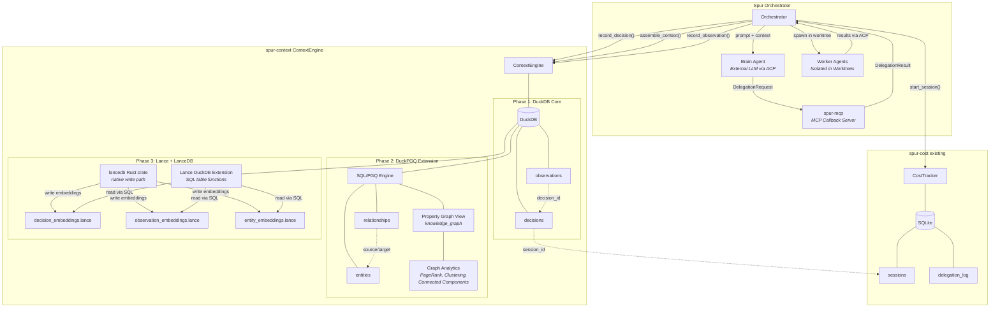
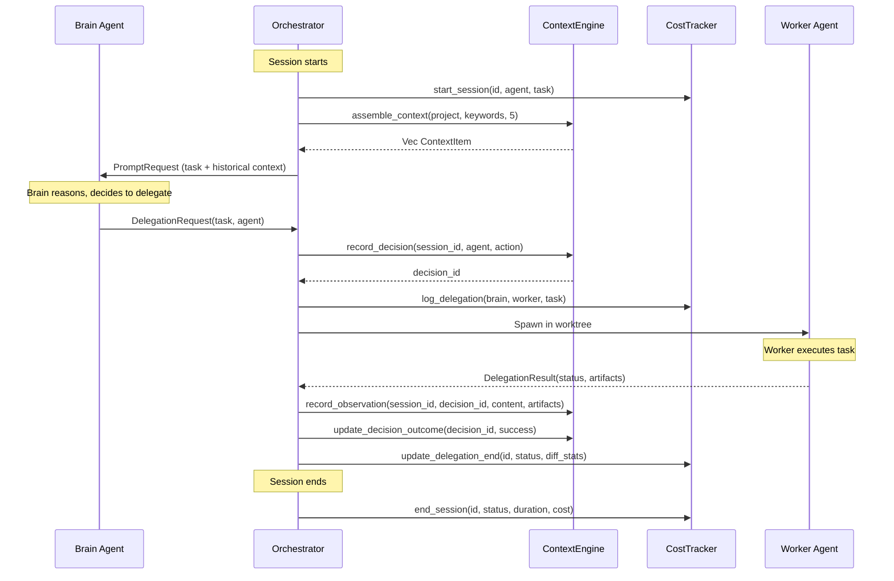
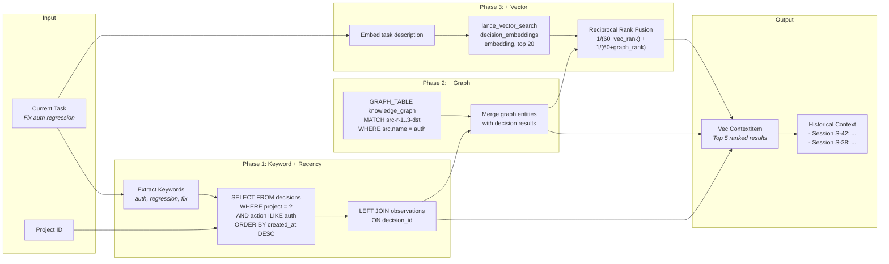
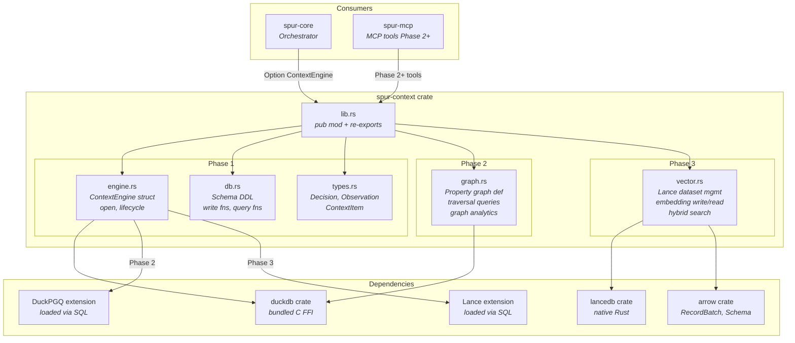
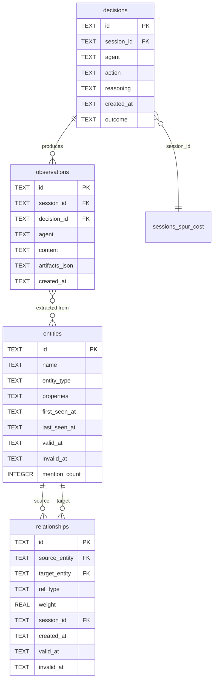

# spur-context: DuckDB-Centric Unified Context Engine

**Date**: 2026-04-13
**Status**: Approved
**Crate**: `spur-context`

## Problem

Spur's orchestrator (brain-worker pipeline) is currently stateless across sessions. Each run starts from scratch with no memory of past decisions, outcomes, or learned context. This limits two capabilities:

1. **Agent Memory** — Agents cannot recall past sessions, decisions, or context. There is no structured way to answer "have we seen this before?" or "what worked last time?"
2. **Orchestration Intelligence** — The brain makes delegation decisions without historical data on agent performance, past failure patterns, or accumulated domain knowledge.

## Solution

A new crate `spur-context` providing a unified context engine built on DuckDB with two extensions:

- **DuckPGQ** (Phase 2) — SQL/PGQ graph queries over entity-relationship knowledge graph
- **Lance extension** (Phase 3) — Vector/FTS/hybrid search over embedding datasets

All reads go through DuckDB SQL. Structured writes go through DuckDB. Embedding writes go through the LanceDB Rust crate (native, no FFI). The result is a single query language (SQL) that can join relational, graph, and vector results.

## Design Decisions

### Decision 1: DuckDB from Day One (not SQLite)

**Chosen**: DuckDB even though Phase 1 only has 2 tables.

**Why**: Starting with SQLite and migrating to DuckDB in Phase 2 adds migration tax. DuckDB in Phase 1 validates the Rust crate and build toolchain early. The user requirement is explicitly "DuckDB as unified context engine."

**Trade-off**: Slightly more build complexity (libduckdb C dependency) vs. no future migration cost.

### Decision 2: Single Crate (not split)

**Chosen**: One `spur-context` crate containing all context functionality.

**Why**: Data gravity principle. The brain's queries cross relational, graph, and vector modalities in single operations (e.g., "find similar past decisions and traverse their entity relationships"). Splitting into multiple crates forces these joins into application code instead of SQL.

**Evaluated alternatives**: Technology-split (graph.rs/vector.rs), domain-split (session.rs/knowledge.rs), CQRS (ingest.rs/query.rs). All over-engineer Phase 1's 2-table scope. Structure evolves as phases land.

### Decision 3: Direct Field on Orchestrator (not trait)

**Chosen**: `pub context: Option<ContextEngine>` on the `Orchestrator` struct.

**Why**: Matches the existing `pub cost_tracker: Option<CostTracker>` pattern. Trait-based DI, channel-based decoupling, and middleware wrapping all add abstraction the codebase doesn't use. YAGNI.

### Decision 4: Sync API

**Chosen**: Synchronous methods on `ContextEngine`, caller wraps in `spawn_blocking`.

**Why**: Matches `CostTracker` (sync rusqlite). The DuckDB Rust crate is synchronous. The orchestrator already handles async wrapping for cost tracker calls.

### Decision 5: Separate from spur-cost

**Chosen**: `spur-context` is a new crate alongside `spur-cost`, not a replacement.

**Why**: Different concerns. `spur-cost` tracks operational metrics (dollars, durations, delegation status). `spur-context` tracks semantic content (task descriptions in natural language, worker output text, entity relationships). They complement rather than duplicate — `spur-cost` knows a delegation cost $0.12 and took 45 seconds; `spur-context` knows it "refactored the JWT validation middleware and added refresh token support." They share `session_id` as a common key.

**Future unification**: DuckDB's SQLite scanner extension (`ATTACH 'cost.db' AS cost (TYPE SQLITE)`) can provide cross-database queries without migrating spur-cost. This enables unified queries like "find auth-related tasks sorted by cost" in a single SQL statement.

### Decision 6: Entity Extraction Deferred to Phase 2

**Chosen**: Phase 1 ships decisions + observations only. Entities and relationships come in Phase 2.

**Why**: Entity extraction is an NLP/LLM task — it's a feature on top of the storage layer, not part of it. Phase 1 delivers the storage foundation. Phase 2 adds the knowledge graph with an extraction pipeline.

## Architecture

### System Overview



### Write Path



### Read Path — Context Assembly



### Concurrency Model

DuckDB supports concurrent reads but only one writer. This naturally fits Spur's architecture:

- The **orchestrator** (brain) is the single writer — it records decisions and observations after events
- **Workers** report results via ACP; the orchestrator persists them
- Read-only access (brain querying context) is concurrent-safe

No additional concurrency primitives needed.

### Context Delivery

The brain agent is an external LLM connected via ACP — it cannot call Rust functions directly. Context must be delivered through the existing communication channels.

**Phase 1: Prompt Injection**

The orchestrator queries `ContextEngine` before constructing the brain's initial prompt, and prepends a context summary:

```
## Historical Context
- [Session S-42] Delegated "refactor auth middleware" to claude-worker → success.
  Output: Modified 3 files, added JWT validation, tests passing.
- [Session S-38] Delegated "update auth flow" to claude-worker → failure.
  Output: Worker didn't handle token refresh edge cases.

## Current Task
Fix the authentication regression in the login endpoint.
```

**Phase 2+: MCP Tools**

`spur-mcp` gains new tools that the brain can call interactively during reasoning:

- `recall_context(query, top_k)` — semantic search over past decisions/observations
- `search_knowledge(entity, depth)` — graph traversal from a named entity
- `query_history(project, keywords)` — structured search over past work

Both mechanisms coexist: automatic baseline context + on-demand deep exploration.

### Context Assembly (Phase 1)

The orchestrator determines relevant context using three signals combined:

1. **Project match** — past decisions from the same project
2. **Keyword overlap** — `ILIKE` search on current task description terms
3. **Recency** — most recent first

**Budget**: Max 5 past decisions with their top observation each, formatted as markdown. This keeps the prompt concise while providing actionable history.

**Phase 3 upgrade**: Vector similarity replaces keyword matching for relevance ranking.

## Crate Structure

### Module Architecture



### Phase 1 (Relational Foundation)

```
crates/spur-context/
├── Cargo.toml
└── src/
    ├── lib.rs      # pub mod + re-exports
    ├── engine.rs   # ContextEngine struct, open(), lifecycle
    ├── db.rs       # Schema DDL + write functions + query functions
    └── types.rs    # Decision, Observation, DecisionId structs
```

### Phase 2 Additions (Graph)

```
    ├── graph.rs    # DuckPGQ property graph definition + traversal queries
    # db.rs may split into schema.rs + ingest.rs + query.rs at this point
```

### Phase 3 Additions (Vector)

```
    ├── vector.rs   # Lance dataset management (write via lancedb crate, read via extension)
```

## Data Model

### Entity Relationship Diagram



### Phase 1 Schema

```sql
CREATE TABLE IF NOT EXISTS decisions (
    id          TEXT PRIMARY KEY,
    session_id  TEXT NOT NULL,
    agent       TEXT NOT NULL,
    action      TEXT NOT NULL,
    reasoning   TEXT,
    created_at  TEXT NOT NULL,
    outcome     TEXT NOT NULL DEFAULT 'pending'
);

CREATE TABLE IF NOT EXISTS observations (
    id             TEXT PRIMARY KEY,
    session_id     TEXT NOT NULL,
    decision_id    TEXT NOT NULL,
    agent          TEXT NOT NULL,
    content        TEXT NOT NULL,
    artifacts_json TEXT,
    created_at     TEXT NOT NULL
);
```

- `session_id` links to spur-cost's sessions table by convention (shared UUID), not enforced FK
- `action` is the delegation task description from the `DelegationRequest`
- `reasoning` is nullable — populated when the brain agent provides structured decision output (e.g., via a future "explain your reasoning" tool). In Phase 1, typically NULL as the orchestrator only sees the `DelegationRequest`, not the brain's internal reasoning
- `artifacts_json` stores a JSON array of file paths, diffs, or other artifacts; queryable via DuckDB's native JSON functions
- `outcome` tracks decision results: `pending`, `success`, `failure`
- `observations.content` source: the worker agent's final response text from the ACP session's last `ContentBlock`

### Phase 2 Schema (Knowledge Graph)

```sql
CREATE TABLE IF NOT EXISTS entities (
    id            TEXT PRIMARY KEY,
    name          TEXT NOT NULL,
    entity_type   TEXT NOT NULL,  -- concept, file, function, agent, etc.
    properties    TEXT,           -- JSON for extensible metadata
    first_seen_at TEXT NOT NULL,
    last_seen_at  TEXT NOT NULL,
    valid_at      TEXT,           -- temporal validity: when this fact became true
    invalid_at    TEXT,           -- temporal validity: when this fact was superseded (NULL = current)
    mention_count INTEGER NOT NULL DEFAULT 1
);

CREATE TABLE IF NOT EXISTS relationships (
    id            TEXT PRIMARY KEY,
    source_entity TEXT NOT NULL,
    target_entity TEXT NOT NULL,
    rel_type      TEXT NOT NULL,
    weight        REAL NOT NULL DEFAULT 1.0,
    session_id    TEXT,
    created_at    TEXT NOT NULL,
    valid_at      TEXT,           -- temporal validity window
    invalid_at    TEXT
);

-- DuckPGQ property graph (view over tables, zero data duplication)
CREATE PROPERTY GRAPH knowledge_graph
    VERTEX TABLES (entities PROPERTIES (name, entity_type))
    EDGE TABLES (
        relationships
            SOURCE KEY (source_entity) REFERENCES entities(id)
            DESTINATION KEY (target_entity) REFERENCES entities(id)
            PROPERTIES (rel_type, weight)
    );
```

**Entity resolution** (informed by Graphiti/Mem0 patterns): On entity write, resolve against existing entities before inserting:
1. Exact name match → update existing entity (bump mention_count, update last_seen_at)
2. Case-insensitive match → merge with existing
3. Phase 3 upgrade: embedding-based resolution for semantic deduplication ("JWT" = "JSON Web Token")

**Temporal validity** (informed by Zep architecture): Entities and relationships have `valid_at`/`invalid_at` windows. When a fact changes (e.g., "auth uses JWT" → "auth uses OAuth"), the old entity is invalidated (not deleted), preserving history. Enables "what was true at time T" queries.

**Graph analytics** (from DuckPGQ): Built-in functions available on the property graph:
- `pagerank(knowledge_graph, entities, relationships)` — identify most important entities
- `weakly_connected_component(...)` — find clusters of related concepts
- `local_clustering_coefficient(...)` — measure entity interconnectedness

### Phase 3 Storage (Vector Embeddings)

Lance datasets managed by the `lancedb` Rust crate, queryable via DuckDB's Lance extension:

| Dataset | Key | Vector Dim | Content |
|---------|-----|-----------|---------|
| `decision_embeddings.lance` | decision.id | model-dependent | Embedding of action + reasoning |
| `observation_embeddings.lance` | observation.id | model-dependent | Embedding of content |
| `entity_embeddings.lance` | entity.id | model-dependent | Embedding of entity name + context |

**Async/sync design note**: LanceDB's Rust crate is async (`connect().execute().await`), while DuckDB is sync. Phase 3 adds *separate* async methods for vector operations alongside existing sync methods — no breaking changes to Phase 1-2 API. The orchestrator (which is async/tokio) can `.await` vector operations directly.

**Hybrid Graph RAG** (informed by GraphDuck pattern): Phase 3's unified query combines vector similarity + graph traversal using Reciprocal Rank Fusion (RRF) in a single SQL expression:

```sql
WITH vector_hits AS (
    SELECT id, action, reasoning, score
    FROM lance_vector_search('decision_embeddings.lance', ?embedding, 20)
),
graph_context AS (
    FROM GRAPH_TABLE(knowledge_graph
        MATCH (src:entities)-[r:relationships]->{1,2}(dst:entities)
        WHERE src.name IN (SELECT keyword FROM extracted_keywords)
        COLUMNS (dst.name AS entity, dst.entity_type, r.rel_type, r.weight)
    )
),
ranked AS (
    SELECT v.id, v.action,
           1.0 / (60.0 + v.vector_rank) + 1.0 / (60.0 + g.graph_rank) AS rrf_score
    FROM (SELECT *, ROW_NUMBER() OVER (ORDER BY score DESC) AS vector_rank FROM vector_hits) v
    LEFT JOIN (SELECT *, ROW_NUMBER() OVER (ORDER BY weight DESC) AS graph_rank FROM graph_context) g
    ON v.action ILIKE '%' || g.entity || '%'
)
SELECT * FROM ranked ORDER BY rrf_score DESC LIMIT 10;
```

## API Surface

### Rust Types

```rust
pub struct Decision {
    pub id: String,
    pub session_id: String,
    pub agent: String,
    pub action: String,
    pub reasoning: Option<String>,
    pub created_at: String,
    pub outcome: String,
}

pub struct Observation {
    pub id: String,
    pub session_id: String,
    pub decision_id: String,
    pub agent: String,
    pub content: String,
    pub artifacts: Option<Vec<String>>,
    pub created_at: String,
}

/// A assembled context item for brain prompt injection.
pub struct ContextItem {
    pub decision: Decision,
    pub observation: Option<Observation>,
    pub relevance_score: f32, // 0.0-1.0, used for ranking
}
```

### ContextEngine API

```rust
pub struct ContextEngine {
    conn: duckdb::Connection,
}

impl ContextEngine {
    /// Open (or create) the context database at `db_path`.
    pub fn open(db_path: &Path) -> Result<Self>;

    // ── Writes ──────────────────────────────────────────────

    /// Record a brain decision. Returns the generated decision ID.
    pub fn record_decision(
        &self, session_id: &str, agent: &str,
        action: &str, reasoning: Option<&str>,
    ) -> Result<String>;

    /// Update a decision's outcome after task completion.
    pub fn update_decision_outcome(&self, id: &str, outcome: &str) -> Result<()>;

    /// Record a worker observation. Returns the generated observation ID.
    pub fn record_observation(
        &self, session_id: &str, decision_id: &str,
        agent: &str, content: &str, artifacts: Option<&[String]>,
    ) -> Result<String>;

    // ── Reads ───────────────────────────────────────────────

    /// Return the most recent decisions across all sessions.
    pub fn query_recent_decisions(&self, limit: usize) -> Result<Vec<Decision>>;

    /// Return all decisions for a specific session.
    pub fn query_decisions_for_session(&self, session_id: &str) -> Result<Vec<Decision>>;

    /// Return observations produced by a specific decision.
    pub fn query_observations_for_decision(&self, decision_id: &str) -> Result<Vec<Observation>>;

    /// Full-text keyword search over decision actions and reasoning.
    pub fn search_decisions(&self, keyword: &str, limit: usize) -> Result<Vec<Decision>>;

    // ── Context Assembly ────────────────────────────────────

    /// Assemble relevant historical context for the brain's prompt.
    /// Combines project match + keyword overlap + recency.
    /// Returns up to `max_items` decisions with their top observation.
    pub fn assemble_context(
        &self, project: Option<&str>, task_keywords: &[&str], max_items: usize,
    ) -> Result<Vec<ContextItem>>;
}
```

### Phase 2 API Additions

```rust
impl ContextEngine {
    /// Record an extracted entity.
    pub fn record_entity(&self, name: &str, entity_type: &str, properties: Option<&str>) -> Result<String>;

    /// Record a relationship between two entities.
    pub fn record_relationship(
        &self, source: &str, target: &str, rel_type: &str,
        weight: f32, session_id: Option<&str>,
    ) -> Result<String>;

    /// Traverse the knowledge graph from a named entity to a given depth.
    pub fn query_related_entities(
        &self, entity_name: &str, depth: usize,
    ) -> Result<Vec<(Entity, Relationship)>>;

    /// Find the shortest decision chain between two decisions.
    pub fn query_decision_chain(
        &self, from_id: &str, to_id: &str,
    ) -> Result<Vec<Decision>>;
}
```

### Phase 3 API Additions

```rust
impl ContextEngine {
    /// Find decisions semantically similar to the given embedding.
    pub fn recall_similar_decisions(
        &self, embedding: &[f32], top_k: usize,
    ) -> Result<Vec<(Decision, f32)>>;

    /// Find observations semantically similar to the given embedding.
    pub fn recall_similar_observations(
        &self, embedding: &[f32], top_k: usize,
    ) -> Result<Vec<(Observation, f32)>>;

    /// Hybrid recall combining vector similarity and keyword matching.
    pub fn hybrid_recall(
        &self, embedding: &[f32], keywords: &str, top_k: usize,
    ) -> Result<Vec<RecallResult>>;
}
```

## Phased Delivery

```mermaid
gantt
    title spur-context Phased Delivery
    dateFormat X
    axisFormat %s

    section Phase 1 Relational
    DuckDB Core + decisions/observations tables    :done, p1a, 0, 1
    ContextEngine API CRUD + search                :done, p1b, 1, 2
    Context Assembly keyword + recency             :done, p1c, 2, 3
    Orchestrator integration                       :done, p1d, 3, 4
    Validation DuckDB Rust crate in CI             :milestone, p1m, 4, 4

    section Phase 2 Graph
    entities + relationships tables                :p2a, 5, 6
    DuckPGQ extension + property graph             :p2b, 6, 7
    Entity extraction pipeline                     :p2c, 7, 8
    Entity resolution exact + fuzzy                :p2d, 8, 9
    Graph traversal queries                        :p2e, 9, 10
    MCP tools recall_context search_knowledge      :p2f, 10, 11
    Validation extension loads graphs persist      :milestone, p2m, 11, 11

    section Phase 3 Vector
    lancedb crate + Lance datasets                 :p3a, 12, 13
    Embedding write path async                     :p3b, 13, 14
    Lance DuckDB extension + SQL search            :p3c, 14, 15
    Hybrid Graph RAG with RRF                      :p3d, 15, 16
    Embedding-based entity resolution              :p3e, 16, 17
    Validation cross-format read write             :milestone, p3m, 17, 17
```



| Phase | Scope | DuckDB Feature | Fallback | Validation Gate |
|-------|-------|----------------|----------|-----------------|
| **1** | decisions + observations tables, basic CRUD + search | Core DuckDB only | N/A | DuckDB Rust crate builds and runs in Spur's CI |
| **2** | entities + relationships, DuckPGQ property graph, graph traversal | DuckPGQ community extension | Recursive CTEs with `USING KEY` | Extension loads from Rust, property graphs persist |
| **3** | Lance datasets, embedding storage, vector/FTS/hybrid search | Lance core extension + lancedb Rust crate | lancedb crate directly (join in app code) | Lance files written by lancedb are readable by DuckDB extension |

Each phase is independently valuable and validates its toolchain before the next proceeds.

## Dependencies

### Workspace Cargo.toml Additions

```toml
# Phase 1
duckdb = { version = "1", features = ["bundled"] }

# Phase 3 (deferred)
# lancedb = "0.15"
# arrow = "53"
```

### spur-context/Cargo.toml

```toml
[package]
name = "spur-context"
description = "DuckDB-backed unified context engine — decisions, knowledge graph, and semantic recall"
version.workspace = true
edition.workspace = true
rust-version.workspace = true
license.workspace = true

[dependencies]
duckdb = { workspace = true }
uuid = { workspace = true }
chrono = { workspace = true }
serde = { workspace = true }
serde_json = { workspace = true }
anyhow = { workspace = true }
tracing = { workspace = true }
```

### spur-core/Cargo.toml Addition

```toml
spur-context = { path = "../spur-context" }
```

## Query Examples

### Phase 1: Relational

```sql
-- Brain asks: "What did we decide in the last 5 sessions?"
SELECT d.*, o.content AS outcome_detail
FROM decisions d
LEFT JOIN observations o ON o.decision_id = d.id
ORDER BY d.created_at DESC
LIMIT 20;

-- Brain asks: "Any past decisions about authentication?"
SELECT * FROM decisions
WHERE action ILIKE '%auth%' OR reasoning ILIKE '%auth%'
ORDER BY created_at DESC;
```

### Phase 2: Graph

```sql
-- Brain asks: "What concepts are related to 'JWT'?"
SELECT dst.name, e.rel_type, e.weight
FROM GRAPH_TABLE(knowledge_graph
    MATCH (src:entities)-[e:relationships]->{1,3}(dst:entities)
    WHERE src.name = 'JWT'
    COLUMNS (dst.name, e.rel_type, e.weight)
)
ORDER BY e.weight DESC;
```

### Phase 3: Vector + Graph Unified

```sql
-- Brain asks: "Find similar past decisions AND their related entities"
WITH similar AS (
    SELECT id, action, reasoning, score
    FROM lance_vector_search('decision_embeddings.lance', ?embedding, 10)
),
related AS (
    SELECT s.id AS decision_id, dst.name AS entity, r.rel_type
    FROM similar s
    JOIN observations o ON o.decision_id = s.id
    JOIN entities src ON o.content ILIKE '%' || src.name || '%'
    JOIN GRAPH_TABLE(knowledge_graph
        MATCH (src_node:entities)-[r:relationships]->(dst:entities)
        WHERE src_node.id = src.id
        COLUMNS (src_node.id AS src_id, dst.name, r.rel_type)
    ) g ON g.src_id = src.id
)
SELECT * FROM similar s LEFT JOIN related r ON r.decision_id = s.id;
```

## Risk Mitigation

| Risk | Severity | Mitigation |
|------|----------|------------|
| DuckPGQ is research-stage | Moderate | Fallback to recursive CTEs; graph is a query syntax layer, not storage |
| DuckDB Rust crate extension loading | Low | Extensions load via SQL commands; validated in Phase 2 gate |
| Lance/lancedb version compatibility | Low | Both use Lance format; pin compatible versions |
| DuckDB single-writer constraint | None | Orchestrator is naturally the single writer; workers report via ACP |
| Unbounded knowledge graph growth | None | ~18M entities/year at aggressive usage; DuckDB handles 100M+ trivially |
| Build complexity (C dependency) | Low | `bundled` feature compiles from source; same pattern as rusqlite |
| LanceDB async vs DuckDB sync | Low | Separate async methods for vector ops in Phase 3; no breaking changes |

## Industry References

Designs and patterns that informed this spec:

| Reference | What We Took | Link |
|-----------|-------------|------|
| **Graphiti/Zep** — Temporal Knowledge Graph for Agent Memory | Three-tier episode→entity→community architecture; temporal fact validity (valid_at/invalid_at); entity resolution on write | [github.com/getzep/graphiti](https://github.com/getzep/graphiti), [arxiv.org/abs/2501.13956](https://arxiv.org/abs/2501.13956) |
| **Mem0** — Graph Memory for AI Agents | Parallel vector+graph writes; entity extraction pipeline; dual-store architecture validation | [docs.mem0.ai/open-source/features/graph-memory](https://docs.mem0.ai/open-source/features/graph-memory) |
| **MCP DuckDB Knowledge Graph Memory Server** | DuckDB-native entity/observation/relation schema; MCP tool exposure pattern | [github.com/IzumiSy/mcp-duckdb-memory-server](https://github.com/IzumiSy/mcp-duckdb-memory-server) |
| **GraphDuck** — DuckDB for Embedded AI Agents and Graphs | Episodic/semantic/procedural memory ontology; Hybrid Graph RAG with RRF; graph modeling in pure SQL | [leanpub.com/graphduck](https://leanpub.com/graphduck) |
| **MotherDuck Blog** — Structured Memory Management for AI Agents | DuckDB table design for agent memory; separate tables with retention policies | [motherduck.com/blog/streamlining-ai-agents-duckdb-rag-solutions](https://motherduck.com/blog/streamlining-ai-agents-duckdb-rag-solutions/) |
| **DuckPGQ** — SQL/PGQ for DuckDB | Property graph syntax; graph analytics (PageRank, clustering, connected components) | [duckpgq.org](https://duckpgq.org/) |
| **LanceDB Rust Crate** — Native Rust Vector Search | Arrow-based schema, async API patterns, auto-indexing | [docs.rs/lancedb](https://docs.rs/lancedb/latest/lancedb/) |
| **DuckDB Rust Client** — duckdb-rs | Connection API, extension loading via SQL, query_map patterns | [duckdb.org/docs/current/clients/rust](https://duckdb.org/docs/current/clients/rust) |
