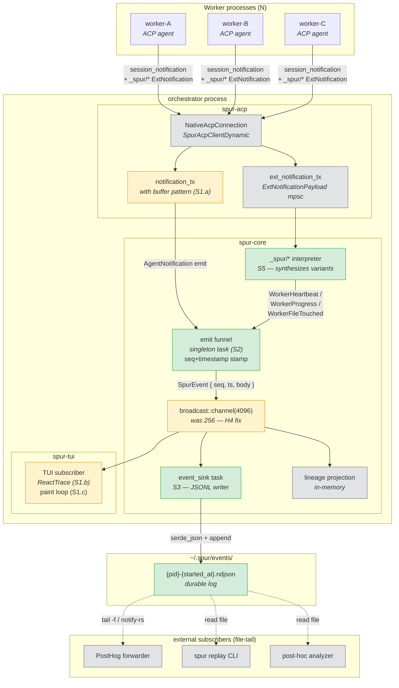
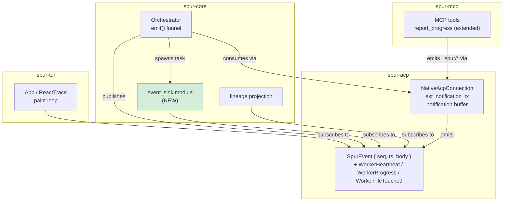
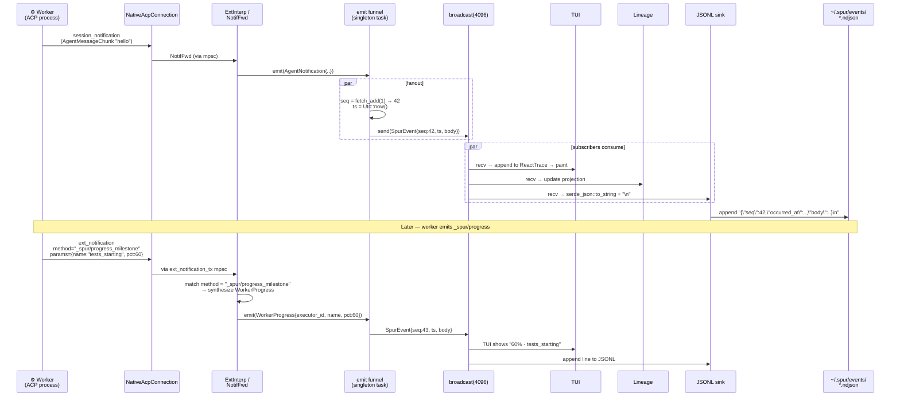
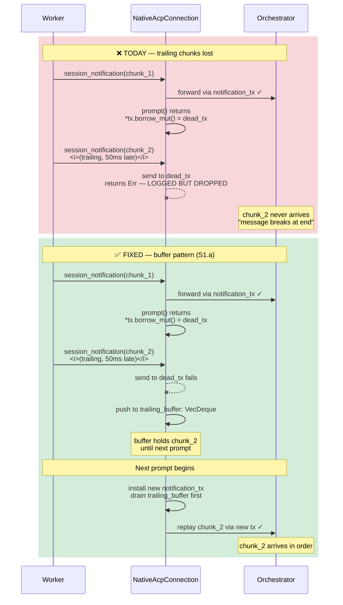
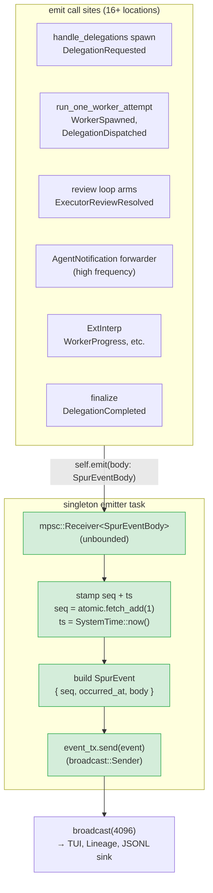
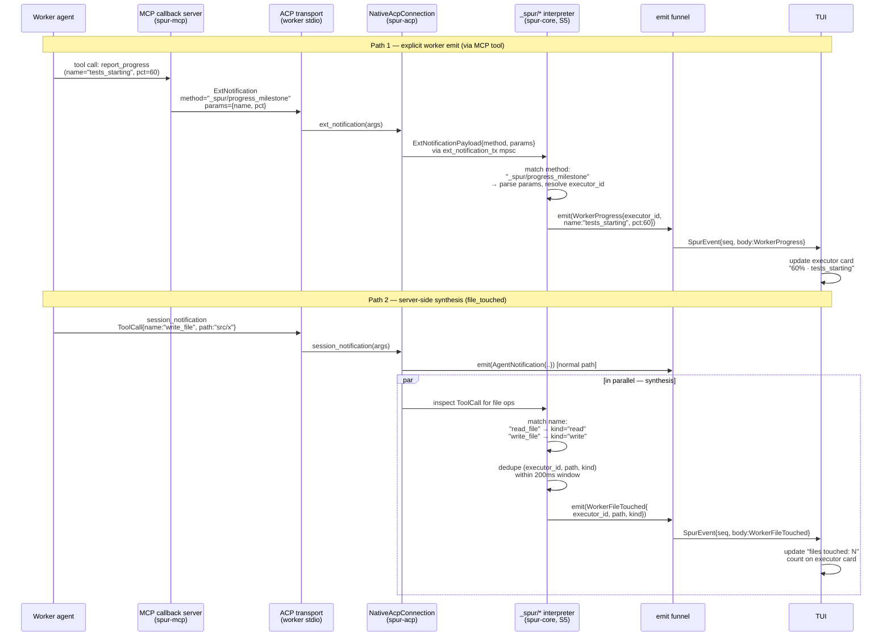
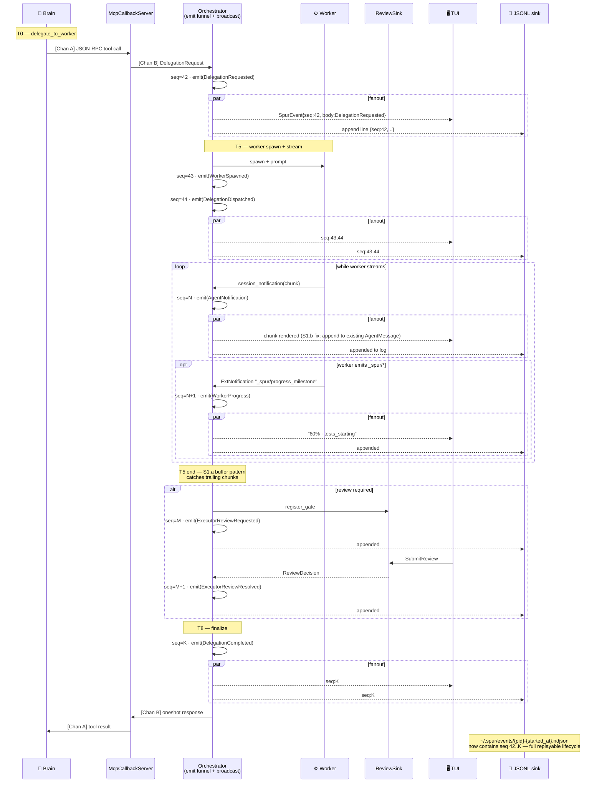

# SpurEvent Stream Backbone — Design

**Date:** 2026-04-14
**Status:** Proposed for review
**Owner:** spur-core (primary) · spur-acp · spur-tui
**Reference architecture:** `docs/spur/brain-worker-architecture.md`
**Related specs (compatible, non-overlapping):**
- `2026-04-14-brain-worker-refinement-design.md` — enriches `DelegationResult` (ships first, independent)
- `2026-04-13-realtime-streaming-diagnosis-design.md` — streaming instrumentation (**run first** to confirm H1–H5)
- `2026-04-13-close-feedback-loop-ui-design.md` — Loop view UI (**consumes** the stream this spec hardens)

## Problem

Section 2 of the brain-worker architecture doc describes the delegation lifecycle with four in-process channels. The live feedback path (worker ACP → orchestrator → broadcast bus → TUI) has four shipping defects and two missing capabilities that together prevent the TUI from being a faithful window into worker activity:

**Shipping defects (enumerated as H1–H5 in the diagnosis spec):**

1. **H5 dead-tx race** — in `crates/spur-acp/src/connection/native.rs` the per-prompt `notification_tx` is swapped for a throwaway `dead_tx` when `prompt()` returns (lines 902–903, 997–998). If the ACP runtime schedules trailing `session_notification` callbacks after the swap, those chunks land on `dead_tx`. The send error is logged (line 1143) but still dropped. User-visible symptom: the end of a worker's output appears truncated.
2. **H2 interleave split** — when a `ToolCall` / `ToolCallUpdate` / `Plan` event arrives between two `AgentMessageChunk` events, `ReactTrace` creates a new `AgentMessage` entry instead of appending. User-visible symptom: one logical reply visually splits into fragments.
3. **H1' drain-coalescing** — the TUI main loop drains ALL pending events before each render. A burst of N chunks collapses into a single paint frame. User-visible symptom: output "appears all at once" rather than streaming.
4. **H4 broadcast lag** — the event bus is `broadcast::channel(256)` (`orchestrator.rs:139`) shared by high-frequency streaming chunks and low-frequency lifecycle events. Under parallel delegation bursts, slow subscribers get `RecvError::Lagged` and some call sites silently swallow the lag (`{}` arm per diagnosis spec line 99). Lost lifecycle events manifest as workers "stuck running" in the TUI.

**Missing capabilities:**

5. **No durable event record.** If the TUI crashes, or the operator wants to debug yesterday's session, there is nothing to replay. Lineage projection is in-memory only.
6. **No side-channel vocabulary from workers.** Workers communicate only via ACP `session_notification` (AgentMessageChunk, ToolCall, etc.). They cannot emit structured progress milestones, file-touch events, or heartbeats without abusing the text channel. The ACP spec DOES define a standard extension mechanism (`ExtNotification` with custom methods namespaced by leading `_`) — and `crates/spur-acp/src/connection/native.rs:1157-1174` already plumbs an `ext_notification` receiver — but no SPUR-specific vocabulary exists on top of it.

## Goals

1. **Make the live feedback loop honest:** every byte a worker emits reaches the TUI in order, rendered progressively, with no silent loss at prompt boundaries.
2. **Make the stream observable in time:** every event carries a monotonic sequence number and wall-clock timestamp, so subscribers can detect gaps, order chronologically, and replay from an offset.
3. **Make the stream durable:** every event lands on disk as newline-delimited JSON, enabling post-hoc debugging, cross-process observers via standard file-tail pattern (Fluent Bit / Vector / Filebeat), and deterministic replay.
4. **Make worker-emitted events richer:** define an initial `_spur/*` ACP `ExtNotification` vocabulary (heartbeat, progress milestone, file touch) that workers can emit over the existing stdio channel without a new transport.

## Non-goals

These MCTS-evaluated rejections are called out explicitly so future contributors don't reopen them without new evidence:

1. **No worker↔worker messaging.** ACP has no mechanism to deliver an inbound message to an agent mid-turn (`session_notification` flows agent→client, not client→agent). Worktree isolation also eliminates the filesystem-conflict coordination use case. Industry survey (Anthropic multi-agent research system, CrewAI, LangGraph, Swarm, Letta) does not use inter-agent pub-sub; only AutoGen does, for type-routed messaging (different problem). Reopen only if ACP gains inbound messaging OR SPUR adds a worker-cancel-reprompt primitive AND a concrete inter-worker decision is named.
2. **No embedded NATS / Redis / ZeroMQ / iceoryx2.** Research (2026-04-14 report): NATS embedded mode is Go-only; Redis requires a daemon; `async_zmq` last release July 2023 and `zmq.rs` has 34 open issues (both stale); iceoryx2 lists macOS as tier-2 (SPUR is darwin-first).
3. **No bus split into lifecycle + streaming channels.** Single `broadcast::channel(4096)` + monotonic seq is sufficient. Split remains Phase 3 contingency if measured lag warrants — the seq numbers make it observable.
4. **No UDS push bridge in v1.** File-tail of the durable JSONL sink serves external subscribers for the expected near-term scale (PostHog forwarders, post-hoc analyzers). A push bridge (`spur-bridge` crate) is deferred until a concrete push-subscriber appears that tail cannot serve.
5. **No change to `DelegationResult` / `DelegationStatus` / `ReviewSink` / MCP bridge protocol.** All four channels from architecture doc §1 remain. This spec hardens Channel C (the event bus) and adds a worker-side vocabulary on Channel A's existing ACP extension surface.

## Architecture

Single-publisher / many-subscriber fanout. Orchestrator is the sole publisher. No broker, no daemon, no new crate.

### Component architecture



Legend: 🟢 new in this spec · 🟡 modified in this spec · ⬜ existing unchanged.

### Crate dependency map



### End-to-end event flow



## S1 — Streaming pathology fixes

Prerequisite: run the instrumentation from `2026-04-13-realtime-streaming-diagnosis-design.md` on a real kiro streaming session and read the log. Apply the fixes for whichever of H1–H5 the log confirms. The diagnosis spec's priority order (**H5 > H2 > H1' > H4 > H1**) reflects severity (silent data loss first, perceived smoothness last).

### S1.a — H5 dead-tx race (crates/spur-acp/src/connection/native.rs)

**Evidence site:** lines 902-903 and 997-998 — `*notification_tx.borrow_mut() = dead_tx;` replaces the live sender with a throwaway when `prompt()` returns.

**Fix (preferred — buffer pattern):** Don't discard the trailing notifications. Attach a bounded `VecDeque<SessionNotification>` to the connection. When `session_notification()` is called and the current `notification_tx` send fails (dead_tx path), push into the buffer instead of dropping. When a new `notification_tx` is installed for the next prompt, drain the buffer into the new sender BEFORE accepting new notifications. Buffer size cap (e.g., 1024) with WARN-and-drop on overflow — but overflow would indicate a much larger problem (worker misbehavior, not timing).

Rationale: deterministic regardless of ACP runtime scheduling. No timer to tune. Correct for both "trailing chunks arrive 50ms after prompt returns" and "arrive 5 seconds later if the ACP implementation is laggy."

**Before / after comparison:**



**Alternative (if the buffer pattern has unforeseen issues):** post-prompt grace window of 250ms of idle before swapping. Only fall back if buffer-drain ordering against a new prompt proves problematic during implementation.

**Estimate:** ~50 LoC. Unit test: mock ACP client emits a trailing `AgentMessageChunk` 100ms after `prompt()` returns; assert chunk is received by orchestrator.

### S1.b — H2 interleave split (crates/spur-tui/.../react_trace.rs)

**Evidence site:** `append_message` creates a new `AgentMessage` entry whenever the last trace entry is not itself `AgentMessage`.

**Fix:** Walk backwards past non-message entries to find the last `AgentMessage` from the same agent within the current turn. Append there. If none found, create a new entry.

**Estimate:** ~30 LoC. Table-driven test: interleaved sequence `[Chunk, ToolCall, ToolCallUpdate, Chunk, Chunk]` produces exactly one `AgentMessage` with 3 chunks.

### S1.c — H1' drain-coalescing (crates/spur-tui/src/app.rs)

**Evidence site:** main loop at ~lines 521-573 drains all pending events before `terminal.draw()`.

**Fix:** Cap per-iteration drain at 8 events. Yield to the render immediately after the cap. This gives typewriter feel because rapid chunk bursts paint across multiple frames instead of one.

**Estimate:** ~20 LoC. Manual smoke test with a sustained stream is the truest verification — we accept this is a perceived-smoothness fix.

### S1.d — H4 broadcast lag (crates/spur-core/src/orchestrator.rs:139)

**Evidence site:** `let (event_tx, _) = broadcast::channel(256);`

**Fix:** Bump to 4096. Convert every `Err(RecvError::Lagged(n)) => {}` arm (the diagnosis spec flagged at least `crates/spur-tui/src/app.rs:532` and `docs/superpowers/specs/2026-04-12-tui-scroll-hang-fix-design.md` mentions another) to log at WARN level with `lagged_n = n`. This makes lag observable rather than silent.

**Estimate:** ~10 LoC total.

## S2 — Unified emit funnel + monotonic sequence

### Problem being solved

Today `crates/spur-core/src/orchestrator.rs:1510-1512` defines `self.emit()` but 16+ direct `event_tx.send(...)` call sites bypass it (grep confirmed: lines 1113, 1258, 1821, 1832, 1852, 1884, 1913, 1942, 2028, 2084, 2133, 2242, 2409, 2444, 2451). Without a single funnel, we can't stamp monotonic seq values consistently, and we can't guarantee that seq values match the order subscribers observe (Pitfall P1 from MCTS round 17).

### Design

**Step 1 — Wrap the event envelope.**

`crates/spur-acp/src/domain/events.rs` currently has:

```rust
pub struct SpurEvent {
    pub occurred_at: SystemTime,
    pub body: SpurEventBody,
}
```

Extend additively:

```rust
pub struct SpurEvent {
    pub occurred_at: SystemTime,
    pub seq: u64,                    // NEW: monotonic, set at emit funnel
    pub body: SpurEventBody,
}

impl SpurEvent {
    /// Construct without seq. Emit funnel sets it.
    pub fn now(body: SpurEventBody) -> Self {
        Self { occurred_at: SystemTime::now(), seq: 0, body }
    }
}
```

Alternative considered (and rejected): a separate `StampedEvent { seq, event: SpurEvent }` wrapper. Rejected because most code already threads `SpurEvent` and the wrapper would require renames across the tree. The flat addition is cleaner.

**Step 2 — Route all emits through a single funnel.**

Introduce `Orchestrator::emit(body: SpurEventBody)` (note: takes the body, not the pre-constructed event). Inside:

```rust
fn emit(&self, body: SpurEventBody) {
    let seq = self.event_seq.fetch_add(1, Ordering::Relaxed);
    let event = SpurEvent {
        occurred_at: SystemTime::now(),
        seq,
        body,
    };
    let _ = self.event_tx.send(event);
}
```

Where `event_seq: Arc<AtomicU64>` is a new field on `Orchestrator`, initialized to 0.

**Step 3 — Refactor every direct `event_tx.send(SpurEvent::now(body))` to `emit(body)`.**

Fifteen-plus call sites, mostly in `orchestrator.rs`. Compile-enforced once the `event_tx.send` helper is removed from the public surface of those free functions (several are in `handle_delegations` helpers — those take an `emit: impl Fn(SpurEventBody)` closure parameter instead of a raw `event_tx`).

**Pitfall P1 mitigation — seq order vs send order.**

`AtomicU64::fetch_add` gives unique values, but thread A could get seq=5, yield, thread B get seq=6 and send first. Subscribers see out-of-order seq values.

Two options:

- **Option A (simple):** accept non-strict ordering. Document that "seq is unique and monotonic within a single emitter task; across tasks it may transiently invert by a few ticks." Subscribers that need strict order (JSONL sink, for example) serialize on their own using a sort-by-seq buffer with a 100ms watermark.
- **Option B (strict):** funnel emits through an mpsc channel → singleton emitter task that does `fetch_add(1) → broadcast.send` in one atomic sequence. Guarantees seq order == observed order.

**Decision: Option B.** The cost is ~20 LoC and an extra channel hop (<10μs). In return, every subscriber gets strict ordering for free. Since the JSONL sink is durable and replay uses seq-ordered iteration, strict order matters.

### Emit funnel logic



**Why this shape solves P1:** all emits serialize through the mpsc → singleton task → `fetch_add → send` is atomic-ordered per task step. Every subscriber observes events in exactly the order the funnel stamped them.

### Estimate

~50 LoC in `orchestrator.rs` + events.rs. Unit tests: verify seq monotonicity under concurrent emits from N tasks; verify lineage projection still works with seq-stamped events.

## S3 — JSONL durable sink

### Design

New module `crates/spur-core/src/event_sink.rs`. A task that:

1. Subscribes to the broadcast channel via `event_tx.subscribe()`.
2. Opens `~/.spur/events/{pid}-{started_at_unix_ms}.ndjson` for append.
3. For each received event: `serde_json::to_string(&event)` + `\n` + write.
4. Flushes every 100ms or every 64KB, whichever comes first.
5. Rotates when file exceeds `SPUR_EVENT_LOG_MAX_BYTES` (default 128MB).
6. On write error: logs at WARN, drops event, keeps running. Disk-full does not crash the orchestrator.

The `.spur/events/` directory is created on first write (alongside existing `.spur/logs/` and `.spur/worktrees/`).

### Schema

Each line is a JSON object:

```json
{
  "occurred_at": {"secs_since_epoch": 1776123456, "nanos_since_epoch": 789000000},
  "seq": 12345,
  "body": {
    "AgentNotification": {
      "session": "...",
      "notification": { "...": "..." }
    }
  }
}
```

The body discriminator is the existing `#[serde(...)]` tagging on `SpurEventBody` (externally tagged today). No schema change needed for v1.

**Forward compatibility:** when new `SpurEventBody` variants are added, readers using `#[serde(other)]` fallbacks keep parsing old events. This spec does not add `#[serde(other)]` — that's a follow-up if/when external consumers exist.

### Durability vs. lag

The sink's broadcast receiver can lag too. Mitigation:

- The sink runs in its own tokio task with an unbounded mpsc bridge (not a direct broadcast subscription). A small "hot path" task subscribes to broadcast and pushes into the sink's unbounded mpsc. If the mpsc grows beyond a threshold (e.g., 10,000 events), log WARN and **block the emit funnel** momentarily — correctness over throughput for durability. This is the only place in the system where blocking the publisher is acceptable; everywhere else (TUI, lineage) uses broadcast semantics (drop-oldest on lag).

### Sink task state machine

```mermaid
stateDiagram-v2
    [*] --> OpeningFile: orchestrator startup

    OpeningFile --> Idle: mkdir .spur/events/<br/>open {pid}-{started_at}.ndjson (append mode)<br/>subscribe to broadcast

    Idle --> Buffering: recv SpurEvent

    Buffering --> Buffering: accumulate in write-buffer<br/>(until 64KB OR 100ms)

    Buffering --> Writing: flush trigger<br/>(size OR timer)

    Writing --> CheckRotation: write returned Ok
    Writing --> ErrorLog: write returned Err<br/>(disk full, permission)

    ErrorLog --> Idle: log WARN, drop buffered,<br/>keep task alive

    CheckRotation --> Idle: file_size < 128MB
    CheckRotation --> Rotating: file_size >= SPUR_EVENT_LOG_MAX_BYTES

    Rotating --> Idle: close current file<br/>open new {pid}-{seq_at_rotate}.ndjson

    Idle --> Lagged: broadcast RecvError::Lagged(n)
    Lagged --> Idle: log WARN with n,<br/>continue from next event

    Idle --> Shutdown: orchestrator dropping
    Shutdown --> [*]: flush buffer,<br/>close file
```

### Estimate

~100 LoC. Integration test: spawn a mock brain, emit N events, shut down, read file, deserialize each line, assert seq values are a consecutive range 0..N.

## S5 — `_spur/*` ACP ExtNotification vocabulary

### Infrastructure (already in place)

`crates/spur-acp/src/connection/native.rs:1157-1174` handles `ext_notification` calls, extracts the method (with leading `_` preserved), parses params as JSON, and forwards via `ext_notification_tx: mpsc::UnboundedSender<ExtNotificationPayload>`. The orchestrator can `take_ext_notification_rx()` to consume.

**We do not need to add a transport.** We need to:

1. Define the initial `_spur/*` vocabulary.
2. Add orchestrator-side interpretation: receive `ExtNotificationPayload` with `method.starts_with("_spur/")`, synthesize the matching `SpurEventBody` variant, route through the emit funnel.
3. Document how workers emit. For agents we control (seed agents with SPUR tooling), provide MCP tools that emit these. For agents we don't (a user brings their own), document the wire format.

### Initial vocabulary

Three events. Each has a stable JSON param shape.

**`_spur/heartbeat`** — periodic alive signal.

```json
{"ts": "2026-04-14T20:15:01Z"}
```

Synthesizes `SpurEventBody::WorkerHeartbeat { executor_id, ts }`. TUI uses to detect stalled workers (no heartbeat for >30s → stale indicator).

**`_spur/progress_milestone`** — named checkpoint + optional percent.

```json
{"name": "tests_starting", "pct": 60}
```

Synthesizes `SpurEventBody::WorkerProgress { executor_id, name, pct: Option<u8> }`. TUI shows in executor card ("60% · tests_starting").

**`_spur/file_touched`** — worker announces a read or write.

```json
{"path": "src/auth/mod.rs", "kind": "write"}
```

Synthesizes `SpurEventBody::WorkerFileTouched { executor_id, path, kind: "read"|"write" }`. Useful for operator awareness and future inter-worker conflict detection (though coordination remains out of scope per non-goal 1).

### Correlation with executor_id

The ACP session id on the connection is the worker's ACP id. The orchestrator already maintains the mapping from ACP session id to `ExecutorId` (used for `AgentNotification` correlation). Reuse the same mapping.

### `_spur/*` flow — worker to TUI



### Emitter (worker side)

The architecture doc §1.1 already lists a `report_progress` MCP tool (fire-and-forget, sends to event bus). Extend its parameters to accept `{name, pct}` optionally, and internally emit the `_spur/progress_milestone` ExtNotification. Similarly for `_spur/heartbeat` (callable by worker OR automatically emitted by a sidecar timer in the MCP callback server).

For `_spur/file_touched`: option 1 — worker prompt instructs to call a `report_file_touch` MCP tool. Option 2 — orchestrator derives from ACP `ToolCall` events with `name == "read_file" | "write_file"` and emits synthesized `WorkerFileTouched` events server-side. Option 2 is zero-effort for worker prompts; Option 1 gives workers explicit control. **Decision: Option 2 for v1** (zero prompt change); workers may additionally emit via Option 1 if they have semantic context the orchestrator lacks.

### Estimate

- New `SpurEventBody` variants (3): ~20 LoC.
- Orchestrator-side `_spur/*` interpreter task: ~60 LoC.
- MCP tool extension for `report_progress`: ~20 LoC.
- Server-side `file_touched` synthesis from `ToolCall` events: ~20 LoC.
- Total: ~120 LoC (revised up from the 100 LoC MCTS estimate after grounding).

## File touch summary

| File | Changes |
|---|---|
| `crates/spur-acp/src/domain/events.rs` | Add `seq: u64` to `SpurEvent`; add `WorkerHeartbeat` / `WorkerProgress` / `WorkerFileTouched` variants (S2, S5) |
| `crates/spur-acp/src/connection/native.rs` | S1.a dead-tx race fix (buffer OR grace window) |
| `crates/spur-core/src/orchestrator.rs` | S2 emit funnel refactor; S1.d buffer size bump; S5 ExtNotification interpreter |
| `crates/spur-core/src/event_sink.rs` | **NEW** — S3 JSONL sink task |
| `crates/spur-core/src/lib.rs` | Register `event_sink` module |
| `crates/spur-mcp/src/tools.rs` | S5 — extend `report_progress` params (name, pct) |
| `crates/spur-tui/src/.../react_trace.rs` | S1.b interleave split fix |
| `crates/spur-tui/src/app.rs` | S1.c drain cap; S1.d `Lagged` WARN log |

Total estimate: ~430 LoC across 8 files + 1 new module. Zero new dependencies.

## Testing strategy

**Unit (spur-acp):**
- `SpurEvent` serde round-trip with seq field.
- `_spur/*` method parsing: valid params → correct variant; malformed params → logged, no crash.

**Unit (spur-core):**
- Emit funnel seq monotonicity: spawn 8 tokio tasks, emit 1000 events each, assert seq values are exactly 0..8000 in observed order on the receiving side.
- `event_sink` round-trip: emit N events, flush, read file, deserialize, assert exact match (seq, occurred_at, body).
- `event_sink` rotation: emit events until file exceeds threshold, assert new file opens and old file closes cleanly.
- `_spur/*` interpreter: inject fake ExtNotificationPayload for each method, assert correct synthesized SpurEventBody hits the broadcast.

**Unit (spur-tui):**
- `react_trace::append_message` interleave test: `[Chunk, ToolCall, Chunk, Chunk]` → one AgentMessage entry with 3 chunks.
- App main loop drain cap: feed 50 pending events, assert paint fires before all are drained.

**Integration (spur-core):**
- Full delegation lifecycle with seq-stamped events: spawn brain, delegate, collect events to the end of the turn, assert seq values are a consecutive range and all expected lifecycle events are present.
- H5 regression test: mock ACP client emits a trailing chunk 100ms after `prompt()` returns, assert chunk reaches orchestrator (fails today, passes after S1.a).

**Manual smoke:**
- Run the instrumentation from the diagnosis spec (`SPUR_LOG=debug`), trigger a sustained streaming turn from kiro, inspect log to confirm which of H1–H5 fire. Apply S1 fixes for confirmed hypotheses.
- After S3 lands: tail `~/.spur/events/*.ndjson` in a second terminal during a real session; verify every TUI-visible event is in the file.

## Risks and mitigations

| Risk | Mitigation |
|---|---|
| S2 refactor touches 16+ call sites; easy to miss one | Grep audit after refactor: `rg 'event_tx\.send' crates/spur-core/` should return zero results outside `emit()`. |
| JSONL sink disk-full crashes orchestrator | Log + drop on write error; default 128MB rotation threshold. |
| Strict seq ordering (Option B) adds latency | mpsc hop adds <10μs per emit; 1600 evt/s × 10μs = 16ms CPU overhead per second — negligible. |
| `_spur/*` namespace collides with another tool's extension | ACP spec reserves `_<namespace>/` pattern; `_spur/*` is ours by convention. Document in `docs/spur/`. |
| File-tail subscribers need push semantics later | Deferred S4 UDS bridge bolts onto the existing broadcast + seq foundation. No retrofit needed. |
| Server-side `file_touched` synthesis double-counts if worker also emits explicitly | Deduplicate by (executor_id, path, kind, 200ms window) in orchestrator. |

## What this does NOT change

- All four channels from architecture doc §1 remain.
- `DelegationResult` / `DelegationStatus` / MCP bridge protocol unchanged.
- `ReviewSink` unchanged.
- Worker spawning, worktree management, semaphore concurrency model unchanged.
- Existing `SpurEventBody` variants — all additive changes only.
- The TUI's in-process subscription model — TUI still subscribes to the same `broadcast::Receiver`.
- Agent prompt contracts — workers emit `_spur/*` opportunistically; existing behavior is unchanged if they don't.

## Sequencing within existing roadmap

```
Phase 1 refinement (in-flight)            ← ships first, independent
        │
        ▼
Diagnosis instrumentation run             ← confirms which H1-H5 fire
        │
        ▼
S1 streaming pathology fixes              ← live stream honest
        │
        ▼
Close feedback loop UI (separate spec)    ← can start in parallel with S2
        │
        ▼
S2 unified emit + seq                     ← foundation
        │
        ▼
S3 JSONL durable sink                     ← replay + external tailers
        │
        ▼
S5 _spur/* vocabulary                     ← rich worker events
        │
        ▼
[deferred S4]                              ← UDS bridge iff file-tail inadequate
```

## Delegation lifecycle — updated view (§2 of architecture doc)

The original delegation lifecycle sequence (architecture doc §2) is preserved verbatim. This spec adds two things: every emission carries a monotonic `seq`, and every emission ALSO lands on the JSONL sink. Annotated version:



Key additions vs. architecture doc §2:
- **Every `emit(...)` passes through the singleton funnel** (S2), stamping `seq` and `ts` atomically.
- **Every subscriber fans out in parallel** (broadcast semantics) — TUI, Lineage, JSONL sink.
- **JSONL sink persists every event**, enabling: late-joining subscribers via file-tail, `spur replay` of failed sessions, per-session audit trails.
- **S1.a buffer** (not shown explicitly — it's inside the worker→orchestrator edge) ensures no chunk is lost at the prompt boundary.
- **Optional `_spur/*` events** inject at any point during the `session_notification` stream.

## Open questions

None blocking. Implementation-time questions:

- **Server-side `file_touched` deduplication window**: 200ms default may need tuning after we see real ToolCall patterns from claude-code / kiro / codex.
- **JSONL rotation threshold**: 128MB is a guess; may lower to 32MB if session files grow uncomfortably fast.
- **`_spur/heartbeat` frequency**: MCP callback server emitting one per 10s is my current intuition; configurable via env var, defaulted in code.
- **Replay tool (`spur replay <file.ndjson>`)**: not in this spec's scope; list for Phase 2 once S3 proves the JSONL format is stable.
