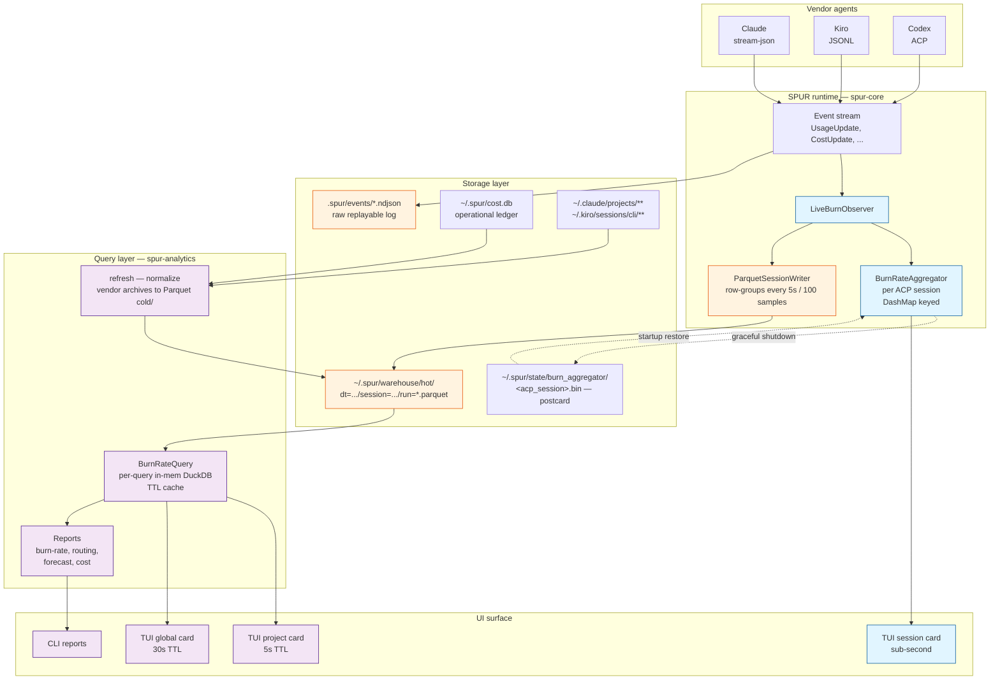
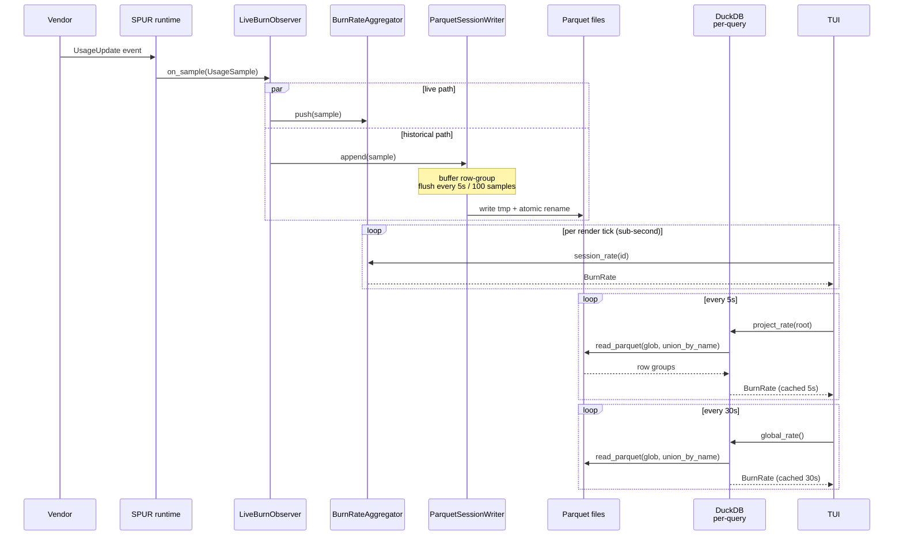
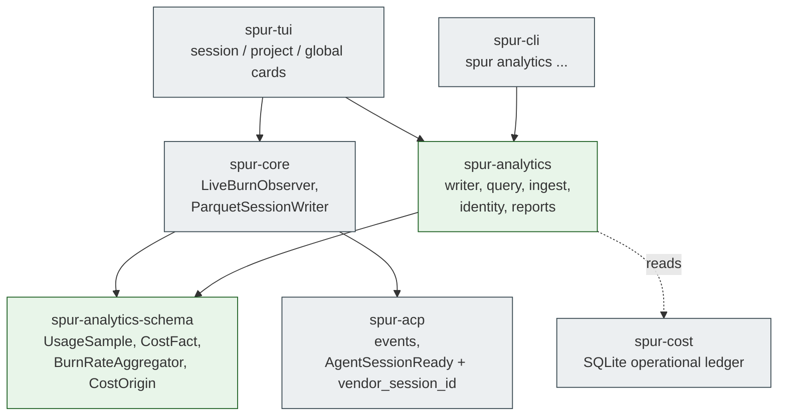
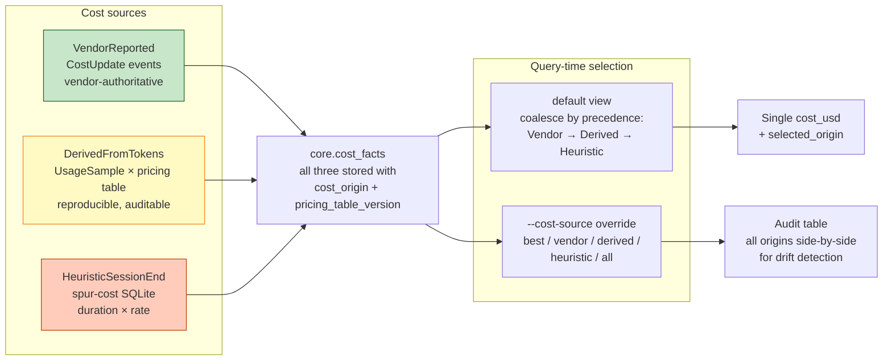
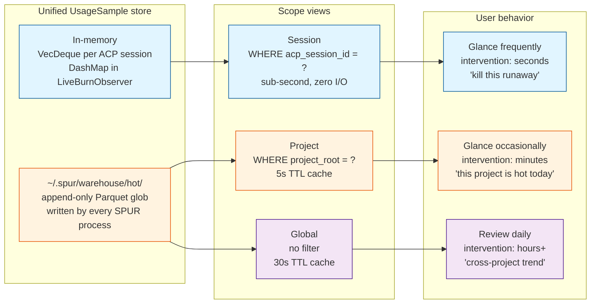

# DuckDB Analytics — Design Spec (Revised)

**Status:** Brainstorming output, pending user review before plan
**Date:** 2026-04-18
**Owner:** Kevin
**Supersedes sections of:** `docs/spur/duckdb-analytics-architecture.md`
**New crates:** `spur-analytics-schema`, `spur-analytics`

---

## Executive Summary

SPUR needs an analytics subsystem that answers three questions at three latency budgets:

| Scope   | Example question                              | Latency budget | Reader           |
|---------|-----------------------------------------------|----------------|------------------|
| Session | "Am I burning too fast right now?"            | sub-second     | in-memory        |
| Project | "How much is this project costing today?"     | ~5 s           | DuckDB, cached   |
| Global  | "Cross-project usage across worktrees?"       | ~30 s          | DuckDB, cached   |

The architecture is a **hybrid**: a live in-process aggregator for the session view, an append-only Parquet hot-landing for durable facts, and DuckDB as a read-only query engine over those Parquet files. DuckDB is never written. Multiple SPUR processes (worktrees) coexist safely because each writes its own Parquet files; readers see everyone's output via glob.

This replaces the batch-refresh posture of the prior design: live burn-rate was approved as a product requirement, which made the "one writer at a time" model insufficient.

---

## Design Principles

1. **Store dimensions, derive answers.** When a choice looks like a trade-off between correctness and simplicity, the correctness-preserving path is usually *also* simpler — fewer stored structures, more query-time reduction.
2. **Preserve evidence.** Never destroy provenance at ingest. If three cost sources exist, store all three and pick at query time.
3. **Fix data at the source.** Runtime instrumentation that eliminates downstream heuristic stitching is always cheaper than the heuristic.
4. **Decouple failure domains.** The TUI live path must not depend on the warehouse's file format, schema, or availability.
5. **Multi-process safe by construction.** Every writer owns its own files. DuckDB is read-only.

---

## Phase-0 Prerequisite — Runtime Instrumentation

Must land **before** warehouse work begins. Without these changes, Phase-1 marts will embed unrecoverable heuristic-join errors.

### P0.1 — Thread `vendor_session_id` through `AgentSessionReady`

Extend the event in `crates/spur-acp/src/domain/events.rs`:

```rust
AgentSessionReady {
    session: SessionId,
    acp_session_id: String,
    brain: String,
    resumed: bool,
    cancel_mode: CancelMode,
    vendor_session_id: Option<String>,  // NEW
}
```

Each adapter populates it from its native source, no protocol changes required:
- Claude stream-json: first system message's `session_id` field.
- Kiro JSONL: session filename stem.
- Codex ACP: existing ACP session identifier field.

`Option<String>` because resumption and legacy event logs may lack it. A missing value falls back to heuristic stitching with `confidence < 1.0`.

### P0.2 — Emit `CostUpdate` from the runtime

`SpurEventBody::CostUpdate` is defined (`events.rs:278`) but not emitted. Wire it into whatever code path already observes vendor cost data so vendor-reported costs become historically recoverable.

### P0.3 — Canonicalize event path

Pick one: repo-local `.spur/events` (present in this repo, matches current code behavior). Update any docs that say `~/.spur/events` to match.

---

## Architecture

### System architecture



Color legend: blue = sub-second live path; orange = write path (WAL + Parquet landing); purple = read/query path (read-only DuckDB over Parquet glob).

### Sample lifecycle



Vendor archive ingest (Claude `~/.claude/projects/**/*.jsonl`, Kiro `~/.kiro/sessions/cli/*.jsonl`) reuses the same Parquet landing: `spur analytics refresh` normalizes vendor JSONL into the same `UsageSample` layout and writes into a `cold/` partition.

### Crate layout

```text
crates/
  spur-analytics-schema/          # NEW — shared contract
    src/
      lib.rs                      # UsageSample, CostFact, BurnRate, CostOrigin
      aggregator.rs               # BurnRateAggregator (pure, deterministic)

  spur-analytics/                 # NEW — warehouse query + ingest
    src/
      lib.rs
      writer/
        parquet_session.rs        # append-only per-session Parquet writer
        compaction.rs             # merge small files into dt=YYYY-MM-DD partitions
      query/
        burn_rate.rs              # BurnRateQuery with TTL cache
        cost.rs                   # cost precedence view
      ingest/
        spur_events.rs            # NDJSON event log → UsageSample
        spur_cost.rs              # SQLite cost DB → CostFact (heuristic origin)
        claude_jsonl.rs
        kiro_jsonl.rs
      identity/
        edges.rs                  # session_identity_edges table + query helpers
      reports/
        burn_rate.rs
        routing.rs
        user_patterns.rs

  spur-core/                      # EXISTING — add:
    src/analytics/
      live_burn_observer.rs       # wires event stream → aggregator map + parquet writer
```

`spur-cost` stays SQLite-backed as the operational ledger — no change to its responsibilities.

### Crate dependencies



Green = new crates in this design; grey = existing crates modified or unchanged. `spur-analytics` does not depend on `spur-cost` directly — it reads the SQLite file via DuckDB's `sqlite_scanner` during `refresh` ingest, keeping crate boundaries clean.

---

## Canonical Data Model

### `UsageSample` (live + historical)

```rust
#[derive(Serialize, Deserialize, Clone)]
pub struct UsageSample {
    pub schema_version: u16,            // 1
    pub occurred_at: SystemTime,
    pub acp_session_id: String,
    pub spur_session_id: String,
    pub vendor_session_id: Option<String>,
    pub project_root: String,           // day-one dimension
    pub vendor: String,
    pub agent: String,
    pub model: String,
    pub input_tokens: u64,
    pub output_tokens: u64,
    pub cache_creation_input_tokens: u64,
    pub cache_read_input_tokens: u64,
    pub context_used: Option<u64>,
    pub context_size: Option<u64>,
}
```

`project_root` is populated at emit time via `git -C <cwd> rev-parse --show-toplevel` (fall back to `cwd` if not a git repo). Submodules resolve to the submodule's toplevel by default.

### `CostFact` (preserve all origins)

```rust
pub enum CostOrigin {
    HeuristicSessionEnd,   // from spur-cost, end-of-session × rate
    VendorReported,        // from CostUpdate events
    DerivedFromTokens,     // UsageSample × pricing table
}

pub struct CostFact {
    pub schema_version: u16,
    pub canonical_session_id: SessionId,
    pub occurred_at: SystemTime,
    pub cost_usd: f64,
    pub cost_origin: CostOrigin,
    pub pricing_table_version: Option<String>, // reproducibility for DerivedFromTokens
}
```

All three origins for a session are stored side-by-side. Query-time precedence: `VendorReported > DerivedFromTokens > HeuristicSessionEnd`. Overridable via CLI flag `--cost-source={best,vendor,derived,heuristic,all}`.



### Session identity edges

```sql
CREATE TABLE core.session_identity_edges (
  left_id TEXT NOT NULL,
  right_id TEXT NOT NULL,
  edge_kind TEXT NOT NULL,        -- 'spur_to_acp', 'acp_to_vendor', ...
  confidence REAL NOT NULL,        -- 1.0 runtime-logged; 0.5–0.8 heuristic
  match_reason TEXT NOT NULL       -- 'runtime_logged', 'filename_match',
                                   -- 'heuristic_cwd_time'
);
```

Query layer always prefers `confidence = 1.0` edges. Heuristic edges fire only when no runtime-logged edge exists for a pair. Heuristics are **quarantined** — they run, they are clearly labelled, they never silently win.

```mermaid
flowchart LR
  subgraph p0["Phase-0 runtime (primary)"]
    SPUR["spur_session_id"]
    ACP_ID["acp_session_id"]
    VENDOR["vendor_session_id"]
    EVT["AgentSessionReady event<br/>carries all three"]
  end

  subgraph p1["Phase-1 heuristic (fallback, quarantined)"]
    HEUR["Heuristic stitcher<br/>cwd + time window + agent<br/>runs only on vendor archives<br/>with no runtime edge"]
  end

  subgraph edges["core.session_identity_edges"]
    E_RT["runtime_logged<br/>confidence 1.0"]
    E_FN["filename_match<br/>confidence 0.9<br/>e.g. Kiro filename = vendor id"]
    E_HR["heuristic_cwd_time<br/>confidence 0.5 – 0.8"]
  end

  SPUR --> EVT
  ACP_ID --> EVT
  VENDOR --> EVT
  EVT --> E_RT

  HEUR -. only when no 1.0 edge exists .-> E_HR
  HEUR --> E_FN

  Q["Query layer resolution<br/>prefer highest-confidence edge;<br/>heuristics never silently win"]

  E_RT ==> Q
  E_FN --> Q
  E_HR -. last resort .-> Q

  classDef solid fill:#c8e6c9,stroke:#1b5e20
  classDef moderate fill:#fff9c4,stroke:#f57f17
  classDef risky fill:#ffccbc,stroke:#bf360c
  class E_RT solid
  class E_FN moderate
  class E_HR risky
```

Reading the graph: solid thick arrow = primary resolution path; dashed arrows = fallbacks. The worktree workflow (concurrent same-repo, same-agent sessions) breaks cwd+time heuristics — this is why Phase-0 exists at all.

---

## Live Burn-Rate Subsystem

### `BurnRateAggregator`

One per active ACP session. Pure, deterministic, no I/O.

```rust
pub struct BurnRateAggregator {
    window: Duration,
    samples: VecDeque<UsageSample>,  // time-bounded
}

impl BurnRateAggregator {
    pub fn push(&mut self, s: UsageSample);
    pub fn rate(&self, now: Instant) -> BurnRate;                           // default card
    pub fn rate_by_model(&self, now: Instant) -> BTreeMap<String, BurnRate>; // on-expand
    pub fn snapshot(&self) -> Vec<u8>;                                      // postcard
    pub fn restore(bytes: &[u8], max_age: Duration) -> Option<Self>;
}
```

Single `VecDeque`. Per-model breakdown is a derivation over in-window samples — O(n), negligible. No `HashMap<Model, VecDeque>`.

### `LiveBurnObserver` (in `spur-core`)

```rust
pub struct LiveBurnObserver {
    aggregators: DashMap<AcpSessionId, BurnRateAggregator>,
    parquet: Arc<ParquetSessionWriter>,
}

impl LiveBurnObserver {
    pub fn on_sample(&self, s: UsageSample) {
        self.aggregators.entry(s.acp_session_id.clone())
            .or_default().push(s.clone());
        self.parquet.append(s); // async append, does not block live path
    }
    pub fn session_rate(&self, id: &AcpSessionId) -> Option<BurnRate>;
    pub fn project_rate_local(&self, project_root: &str) -> BurnRate;
}
```

Writes are side-effect: session view reads the in-memory aggregator, never Parquet.

### Graceful restart

On clean shutdown, each aggregator serializes via `postcard` to `~/.spur/state/burn_aggregator/<acp_session_id>.bin`. On startup, `restore(bytes, Duration::from_secs(60))` rehydrates if fresh; missing/stale/malformed → cold start with no error surfaced.

The snapshot schema is independent of the warehouse Parquet schema. Warehouse evolution cannot break TUI boot.

### Parquet writer

- One logical file per `acp_session_id`, row-groups flushed every 5 s or every 100 samples (whichever first).
- Atomic tmp+rename per row-group.
- Written to `~/.spur/warehouse/hot/dt=YYYY-MM-DD/session=<acp>/run=<ts>.parquet`.
- Date partitioning is present from day one (cheap), enabling partition pruning when file counts grow.
- Crashed writers leave `*.tmp` files; startup sweeper deletes any `*.tmp` older than N minutes.

---

## Scope Hierarchy (Session / Project / Global)

| Scope   | Source                          | Cadence      | Implementation                          |
|---------|---------------------------------|--------------|-----------------------------------------|
| Session | in-memory `BurnRateAggregator`  | per-sample   | `LiveBurnObserver::session_rate`        |
| Project | DuckDB over Parquet glob        | 5 s TTL      | `BurnRateQuery::project_rate(root)`     |
| Global  | DuckDB over Parquet glob        | 30 s TTL     | `BurnRateQuery::global_rate()`          |

Different refresh rates are intentional: a project-level number flickering per-sample is visual noise, not signal.

Cross-process visibility comes for free: every SPUR process appends to the same hot-path tree, so any `BurnRateQuery` sees every process's output. No cross-process rendezvous, no heartbeat files.



Three latency budgets, three matched readers, one canonical sample schema — the refresh-rate asymmetry is intentional. A project-level number flickering per-sample would be visual noise; a global number refreshing every 5 s would waste I/O without informing any user decision.

---

## CLI Surface

```text
spur analytics refresh                 # normalize vendor archives into Parquet cold/
spur analytics compact                 # merge small files into daily partitions
spur analytics status                  # file count, hot/cold sizes, compaction state
spur analytics query "<sql>"           # ad-hoc DuckDB over hot+cold
spur analytics report burn-rate [--scope session|project|global]
spur analytics report forecast
spur analytics report routing
spur analytics report user-patterns
spur analytics report cost [--cost-source best|vendor|derived|heuristic|all]
```

Phase-1 output: terminal tables + CSV. No HTML/dashboard.

---

## Rollout

### Phase 0 (prerequisite — runtime only)

- Add `vendor_session_id: Option<String>` to `AgentSessionReady`; wire the three adapters.
- Emit `CostUpdate` from wherever vendor cost is observed.
- Canonicalize event path to repo-local `.spur/events`.

### Phase 1 (foundation + live path)

- Create `spur-analytics-schema` with `UsageSample`, `CostFact`, `BurnRateAggregator`, `BurnRate`, `CostOrigin`.
- Create `spur-analytics` with `ParquetSessionWriter`, `BurnRateQuery`, ingest adapters for SPUR events + SPUR cost SQLite + Claude JSONL + Kiro JSONL, identity-edge writer.
- Add `LiveBurnObserver` to `spur-core`, wire into event stream.
- TUI session card reads `LiveBurnObserver`; project + global cards read `BurnRateQuery` with distinct tickers.
- CLI commands: `refresh`, `status`, `query`, `report burn-rate`, `report cost`.

### Phase 2 (marts + routing)

- `report routing`, `report user-patterns`, `report forecast`.
- Cost-disagreement drift monitor.
- Compaction into daily partitions (triggered manually or by `status` threshold).

### Phase 3 (scale + extensions)

- Always-on compaction daemon (only if file counts justify it).
- Parquet export / snapshotting for external consumers.
- Optional FTS over prompts and tool output.
- Feed future `spur-context` memory features from the same warehouse.

---

## Validation Strategy

### Invariants

1. **Idempotent ingest.** Re-running `refresh` over the same source files does not duplicate rows. Watermark key: `(source_path, byte_offset, seq)` per source file.
2. **Traceability.** Every `core.*` record resolves to one or more `raw.*` records; every mart row explains from `core.*`.
3. **Identity edges labelled.** Every edge has `match_reason` and `confidence`; `confidence = 1.0` reserved for `runtime_logged`.
4. **Fact schema versioned.** `UsageSample` and `CostFact` carry `schema_version`. Decoders reject unknown versions explicitly.

### Tests

1. Replay a SPUR event file twice; assert `core.*` counts unchanged.
2. Claude fixture: parse → canonical → sum tokens equals fixture's declared totals.
3. Kiro fixture: parse → canonical → prompt/tool/result counts match source file.
4. Known session joined from SQLite cost DB + event log via runtime-logged edges produces one canonical session row.
5. `seq` monotonic within each SPUR event file.
6. `UsageSample` token totals non-decreasing within a session **except** after an explicit context-reset marker.
7. **Burn-rate agreement.** For the same in-window samples, `BurnRateAggregator::rate()` and DuckDB SQL burn-rate agree to machine precision.
8. **Cost drift monitor.** For sessions with both `VendorReported` and `DerivedFromTokens`, `|vendor − derived| / vendor < 0.05` on average; violations surface in `status` as a pricing-table-drift signal.
9. **Graceful restart.** Snapshot → restore within 60 s preserves aggregator state to byte equality; stale/malformed snapshot → clean cold start, no error logged.
10. **Worktree concurrency.** Two SPUR processes writing to `~/.spur/warehouse/hot/` simultaneously produce disjoint files; a third reader sees both sets via glob.

---

## Non-Goals

1. Replacing SQLite for `spur-cost`'s operational writes.
2. **DuckDB writes of any kind.** Every writer produces Parquet; DuckDB is always read-only.
3. A hosted dashboard in Phase 1–2.
4. Cross-submodule project rollup by default (`project_root` is the nearest git toplevel, which for a submodule is the submodule root — not the parent repo).
5. Live global view with sub-5 s latency across SPUR processes. Cross-process live-ness is inherently bounded by row-group flush cadence.
6. Real-time burn-rate continuity across SPUR process *crashes*. Graceful restart is covered; crashed-mid-window is cold-start by design (cannot truthfully claim state we didn't observe).

---

## Deferred / Open Questions

1. **Pricing table source of truth.** Where does `DerivedFromTokens` read per-model rates? Options: static table in `spur-analytics`, vendor-specific config file, or remote fetch. Default for Phase 1: static table in-crate, version pinned.
2. **Compaction trigger.** Manual-only (Phase 1), threshold-based (Phase 2), or daemon (Phase 3). File-count threshold to watch: ~10k before `read_parquet(glob)` pays measurable cost.
3. **Snapshot cleanup.** `~/.spur/state/burn_aggregator/*.bin` should be garbage-collected on session end. Simple: delete on graceful shutdown of the owning session; sweeper for leaked files on startup.
4. **Future `spur-context` relationship.** If a semantic-memory crate materializes, does it share this warehouse or fork? Design guidance: share the Parquet hot path, add a separate `mart.*` namespace.

---

## Traceability to Brainstorming Rounds

| Decision                                    | Origin                             |
|---------------------------------------------|-----------------------------------|
| Live burn-rate is a product requirement     | Round 1→2 (user chose B)          |
| Hybrid live + Parquet + DuckDB architecture | Round 2 (B3-live + B2-historical) |
| Cold start + graceful snapshot              | Round 3 (Node D)                  |
| Scope hierarchy via unified sample store    | Round 4 (Node D)                  |
| `project_root` = git toplevel               | User choice after Round 4         |
| Single `VecDeque`, derived per-model split  | Round 5 Fork #1                   |
| Runtime-threaded identity, quarantined heuristic | Round 5 Fork #2              |
| Store all cost origins, precedence at query | Round 5 Fork #3                   |
