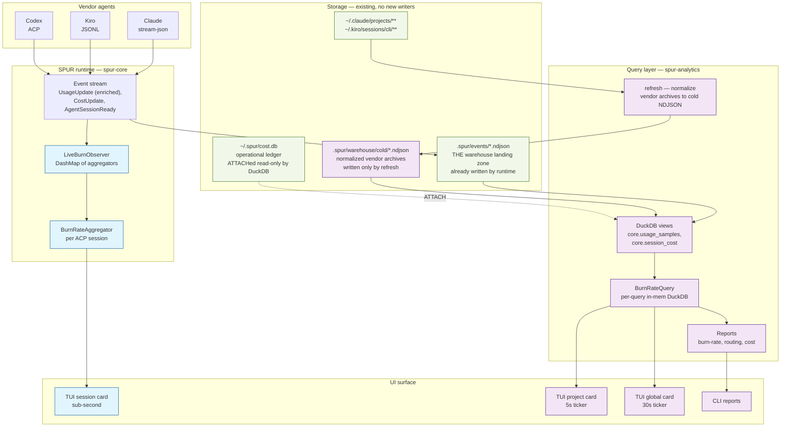
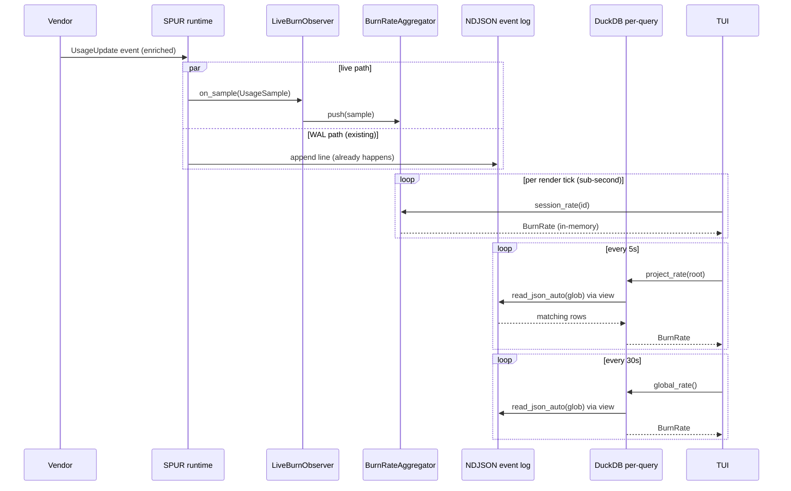
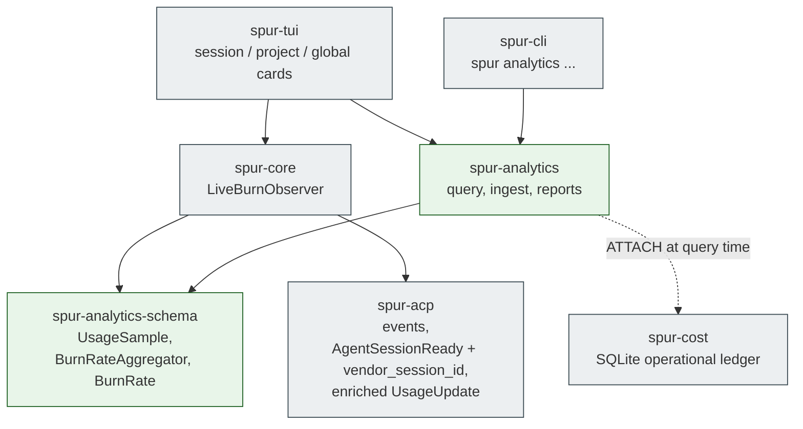
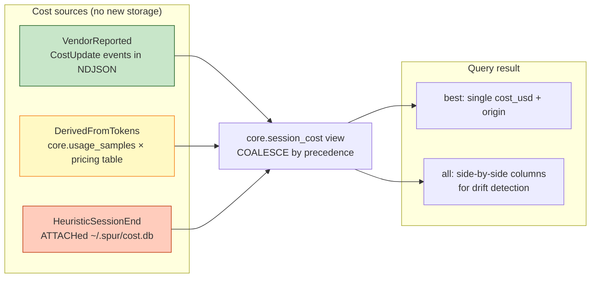
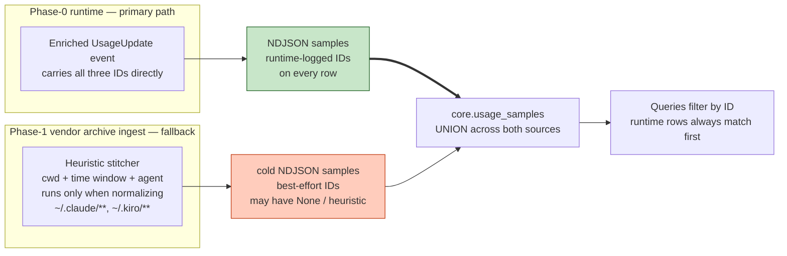
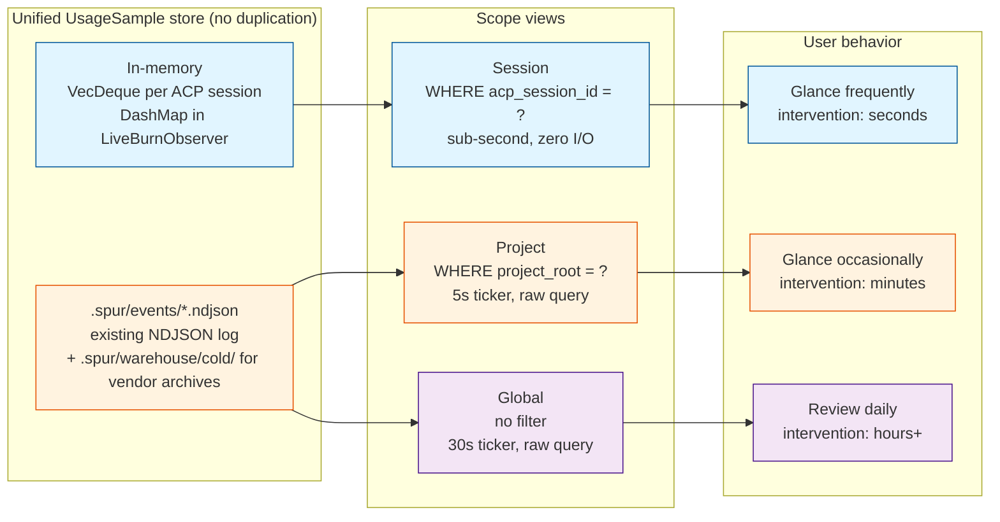

# DuckDB Analytics — Design Spec (Revised)

**Status:** Brainstorming output, pending user review before plan
**Date:** 2026-04-18
**Owner:** Kevin
**Supersedes sections of:** `docs/spur/duckdb-analytics-architecture.md`
**New crates:** `spur-analytics-schema`, `spur-analytics`

---

## Executive Summary

SPUR needs an analytics subsystem that answers three questions at three latency budgets:

| Scope   | Example question                              | Latency budget | Reader           |
|---------|-----------------------------------------------|----------------|------------------|
| Session | "Am I burning too fast right now?"            | sub-second     | in-memory        |
| Project | "How much is this project costing today?"     | ~5 s           | DuckDB on NDJSON |
| Global  | "Cross-project usage across worktrees?"       | ~30 s          | DuckDB on NDJSON |

The architecture is deliberately **minimal**: a live in-process aggregator for the session view, and **DuckDB as a read-only query engine over the existing `.spur/events/*.ndjson` log** for project and global views. No separate warehouse write path. No Parquet. No compactor. The NDJSON event log SPUR already writes *is* the warehouse landing zone.

Parquet, a hot-landing directory, TTL caches, compaction, and graceful-restart snapshots are all deferred to Phase-2 and gated on **measured** query latency. At projected SPUR scale (~20k samples/day/user, ~2 MB/day NDJSON, ~700 MB/year), DuckDB scans a year of JSON logs in ~1–2 s cold — 5–150× headroom against our TTL budgets. Paying Parquet's complexity tax today buys speedup that nobody can observe.

Multiple SPUR processes (worktrees) coexist safely because each writes its own NDJSON file and DuckDB readers see everyone's output via glob — identical multi-process safety to the Parquet design, fewer moving parts.

---

## Design Principles

1. **Store dimensions, derive answers.** When a choice looks like a trade-off between correctness and simplicity, the correctness-preserving path is usually *also* simpler — fewer stored structures, more query-time reduction.
2. **Preserve evidence.** Never destroy provenance at ingest. If three cost sources exist, query all three and pick at query time — but don't materialize new storage for evidence that already exists upstream.
3. **Fix data at the source.** Runtime instrumentation that eliminates downstream heuristic stitching is always cheaper than the heuristic.
4. **Decouple failure domains.** The TUI live path must not depend on the warehouse's file format, schema, or availability.
5. **Multi-process safe by construction.** Every writer owns its own files. DuckDB is read-only.
6. **Earn complexity with measurement.** Complexity cost is paid day one; benefit is paid at scale. If the scale isn't here, the complexity isn't earned. Ship minimum viable; instrument the trigger for next tier.

---

## Phase-0 Prerequisite — Runtime Instrumentation

Must land **before** analytics work begins. Without these changes, Phase-1 reports will embed unrecoverable heuristic-join errors. With them, the NDJSON event log is rich enough that no separate write path is needed.

### P0.1 — Thread `vendor_session_id` through `AgentSessionReady`

Extend the event in `crates/spur-acp/src/domain/events.rs`:

```rust
AgentSessionReady {
    session: SessionId,
    acp_session_id: String,
    brain: String,
    resumed: bool,
    cancel_mode: CancelMode,
    vendor_session_id: Option<String>,  // NEW
}
```

Each adapter populates it from its native source, no protocol changes required:
- Claude stream-json: first system message's `session_id` field.
- Kiro JSONL: session filename stem.
- Codex ACP: existing ACP session identifier field.

`Option<String>` because resumption and legacy event logs may lack it. A missing value falls back to heuristic stitching with `confidence < 1.0`.

### P0.2 — Emit `CostUpdate` from the runtime

`SpurEventBody::CostUpdate` is defined (`events.rs:278`) but not emitted. Wire it into whatever code path already observes vendor cost data so vendor-reported costs become historically recoverable — directly from the NDJSON log, no separate storage.

### P0.3 — Enrich `UsageUpdate` with analytics dimensions

The existing `UsageUpdate` event body carries token counts but not the full `UsageSample` shape. Add (or thread) the dimensions we need for project/global rollup at emit time, so DuckDB queries don't require join gymnastics:

- `project_root` — computed via `git -C <cwd> rev-parse --show-toplevel`, fallback to `cwd`.
- `vendor`, `agent`, `model` — already available at session-start; thread onto every sample.
- `spur_session_id`, `acp_session_id`, `vendor_session_id` — denormalized onto every sample so identity stitching is a non-problem for runtime-logged data.

This is the keystone of the simplification: the event log becomes self-describing.

### P0.4 — Canonicalize event path

Pick one: repo-local `.spur/events` (present in this repo, matches current code behavior). Update any docs that say `~/.spur/events` to match. Phase-1 analytics discovers via configurable list of event roots (default: repo-local plus any in `~/.spur/events-archive/`).

---

## Architecture

### System architecture



Color legend: blue = sub-second live path; green = existing storage reused, no new writers; purple = new query layer. **No orange "write path" box exists** — the simplification's signature.

### Sample lifecycle



The "WAL path" isn't new — it's the NDJSON write the runtime already performs. The analytics subsystem simply reads it. No second writer exists in Phase-1.

### Crate layout

```text
crates/
  spur-analytics-schema/          # NEW — tiny shared contract (no DuckDB dep)
    src/
      lib.rs                      # UsageSample, BurnRate, BurnRateAggregator
      aggregator.rs               # BurnRateAggregator (pure, deterministic)

  spur-analytics/                 # NEW — query + ingest (DuckDB-heavy)
    src/
      lib.rs
      query/
        views.rs                  # DuckDB view DDL: core.usage_samples,
                                  # core.session_cost
        burn_rate.rs              # BurnRateQuery (per-query in-mem DuckDB)
        cost.rs                   # cost precedence query helpers
      ingest/
        vendor_archive.rs         # Claude/Kiro JSONL → cold NDJSON
        identity_heuristic.rs     # vendor-archive-only stitcher, quarantined
      reports/
        burn_rate.rs
        cost.rs

  spur-core/                      # EXISTING — add:
    src/analytics/
      live_burn_observer.rs       # DashMap<AcpSessionId, BurnRateAggregator>
```

`spur-cost` stays SQLite-backed as the operational ledger — no change to its responsibilities.

**What's absent from Phase-1:** `writer/parquet_session.rs`, `writer/compaction.rs`, `ingest/spur_events.rs` (we query the NDJSON directly via a view, no normalization write), `ingest/spur_cost.rs` (we `ATTACH` the SQLite file), `identity/edges.rs` (IDs are denormalized on each sample). All deferred to Phase-2 and gated on measurement.

### Crate dependencies



`spur-core` depends only on the tiny schema crate — it does **not** pull in DuckDB. `spur-analytics` reads the SQLite cost DB via DuckDB's `sqlite_scanner` extension at query time, keeping crate boundaries clean.

---

## Canonical Data Model

### `UsageSample` (live struct + event payload shape)

```rust
#[derive(Serialize, Deserialize, Clone)]
pub struct UsageSample {
    pub schema_version: u16,            // 1
    pub occurred_at: SystemTime,
    // identity denormalized — no edges table needed for runtime-logged data
    pub spur_session_id: String,
    pub acp_session_id: String,
    pub vendor_session_id: Option<String>,
    // dimensions
    pub project_root: String,           // git toplevel of cwd, fallback cwd
    pub vendor: String,
    pub agent: String,
    pub model: String,
    // measures
    pub input_tokens: u64,
    pub output_tokens: u64,
    pub cache_creation_input_tokens: u64,
    pub cache_read_input_tokens: u64,
    pub context_used: Option<u64>,
    pub context_size: Option<u64>,
}
```

This is both the in-process struct held by `BurnRateAggregator` **and** the payload shape of the enriched `UsageUpdate` event on the NDJSON log. One schema, one serialization, zero translation layers.

Token field names match OTEL GenAI (`gen_ai.usage.input_tokens`, `gen_ai.usage.cache_read.input_tokens`, etc.) so a future OTEL export is a straight projection.

### `core.usage_samples` (DuckDB view, not a table)

The NDJSON event log uses an externally-tagged enum: `{occurred_at:{secs,nanos}, seq, body:{UsageUpdate:{...}}}`. A DuckDB view unpacks this once:

```sql
CREATE VIEW core.usage_samples AS
SELECT
  to_timestamp(occurred_at.secs_since_epoch)
    + (occurred_at.nanos_since_epoch * INTERVAL 1 MICROSECOND / 1000) AS occurred_at,
  seq,
  body.UsageUpdate.spur_session_id     AS spur_session_id,
  body.UsageUpdate.acp_session_id      AS acp_session_id,
  body.UsageUpdate.vendor_session_id   AS vendor_session_id,
  body.UsageUpdate.project_root        AS project_root,
  body.UsageUpdate.vendor              AS vendor,
  body.UsageUpdate.agent               AS agent,
  body.UsageUpdate.model               AS model,
  body.UsageUpdate.input_tokens        AS input_tokens,
  body.UsageUpdate.output_tokens       AS output_tokens,
  body.UsageUpdate.cache_read_input_tokens AS cache_read_input_tokens,
  body.UsageUpdate.cache_creation_input_tokens AS cache_creation_input_tokens
FROM read_json_auto(
  '.spur/events/*.ndjson',
  '.spur/warehouse/cold/*.ndjson',
  maximum_object_size => 67108864
)
WHERE body.UsageUpdate IS NOT NULL;
```

All downstream queries read `core.usage_samples`. The ugliness of enum unpacking and `{secs, nanos}` timestamp reshape is bounded to ~30 lines of view DDL, written once.

### Cost — three sources coalesced at query time, no new table

Three cost origins exist; all are reachable without new storage:

- **VendorReported** — `CostUpdate` events on the NDJSON log (after Phase-0 P0.2 lands).
- **DerivedFromTokens** — computed at query time: `core.usage_samples` × static pricing table in `spur-analytics`.
- **HeuristicSessionEnd** — already in `~/.spur/cost.db`; DuckDB `ATTACH` reads it.

A view coalesces them with precedence:

```sql
CREATE VIEW core.session_cost AS
WITH
  vendor AS (
    SELECT
      body.CostUpdate.session AS canonical_session_id,
      MAX(body.CostUpdate.estimated_cost_usd) AS cost_usd,
      'VendorReported' AS origin
    FROM read_json_auto('.spur/events/*.ndjson')
    WHERE body.CostUpdate IS NOT NULL
    GROUP BY 1
  ),
  derived AS (
    SELECT
      acp_session_id AS canonical_session_id,
      SUM(input_tokens * p.input_rate + output_tokens * p.output_rate) AS cost_usd,
      'DerivedFromTokens' AS origin
    FROM core.usage_samples u
    JOIN pricing_table p ON (u.vendor = p.vendor AND u.model = p.model)
    GROUP BY 1
  ),
  heuristic AS (
    SELECT id AS canonical_session_id,
           estimated_cost_usd AS cost_usd,
           'HeuristicSessionEnd' AS origin
    FROM sqlite_scan('~/.spur/cost.db', 'sessions')
    WHERE estimated_cost_usd IS NOT NULL
  )
SELECT
  canonical_session_id,
  COALESCE(v.cost_usd, d.cost_usd, h.cost_usd) AS cost_usd,
  CASE
    WHEN v.cost_usd IS NOT NULL THEN 'VendorReported'
    WHEN d.cost_usd IS NOT NULL THEN 'DerivedFromTokens'
    ELSE 'HeuristicSessionEnd'
  END AS selected_origin,
  v.cost_usd AS vendor_cost_usd,
  d.cost_usd AS derived_cost_usd,
  h.cost_usd AS heuristic_cost_usd
FROM vendor v
FULL OUTER JOIN derived d USING (canonical_session_id)
FULL OUTER JOIN heuristic h USING (canonical_session_id);
```

`spur analytics report cost --cost-source={best,vendor,derived,heuristic,all}` maps to choosing which column to project. Zero new write path; the view IS the precedence logic.



### Session identity — denormalized, no edges table Phase-1

For runtime-logged data, every `UsageSample` and every `CostUpdate` carries `spur_session_id`, `acp_session_id`, and `vendor_session_id` on the payload directly. Identity stitching is a primary-key join, not a heuristic.

For vendor archive normalization (`spur analytics refresh`), the heuristic stitcher remains — but writes **into the `UsageSample` struct as it normalizes the JSONL**, setting `spur_session_id`/`acp_session_id` to `None` or best-effort matches and flagging the row as `from_vendor_archive=true`. Query-time, anything with runtime-logged IDs wins by construction.



No `session_identity_edges` table exists in Phase-1. If Phase-2 introduces cross-source reconciliation that the denormalized columns can't handle, we add one then with evidence.

---

## Live Burn-Rate Subsystem

### `BurnRateAggregator`

One per active ACP session. Pure, deterministic, no I/O.

```rust
pub struct BurnRateAggregator {
    window: Duration,
    samples: VecDeque<UsageSample>,  // time-bounded
}

impl BurnRateAggregator {
    pub fn push(&mut self, s: UsageSample);
    pub fn rate(&self, now: Instant) -> BurnRate;                           // default card
    pub fn rate_by_model(&self, now: Instant) -> BTreeMap<String, BurnRate>; // on-expand
    // Phase-2 additions:
    // pub fn snapshot(&self) -> Vec<u8>;
    // pub fn restore(bytes: &[u8], max_age: Duration) -> Option<Self>;
}
```

Single `VecDeque`. Per-model breakdown is a derivation over in-window samples — O(n), negligible. No `HashMap<Model, VecDeque>`.

### `LiveBurnObserver` (in `spur-core`)

```rust
pub struct LiveBurnObserver {
    aggregators: DashMap<AcpSessionId, BurnRateAggregator>,
}

impl LiveBurnObserver {
    pub fn on_sample(&self, s: UsageSample) {
        self.aggregators.entry(s.acp_session_id.clone())
            .or_default().push(s);
    }
    pub fn session_rate(&self, id: &AcpSessionId) -> Option<BurnRate>;
    pub fn project_rate_local(&self, project_root: &str) -> BurnRate;
}
```

No Parquet writer field. No secondary write path. The NDJSON log is already written by the runtime before `on_sample` is called; `LiveBurnObserver` only feeds the in-memory aggregator.

### `BurnRateQuery` (per-query in-memory DuckDB)

```rust
pub struct BurnRateQuery {
    event_roots: Vec<PathBuf>,        // configured list, default .spur/events
    cold_root: PathBuf,                // .spur/warehouse/cold
    cost_db: PathBuf,                  // ~/.spur/cost.db
}

impl BurnRateQuery {
    pub fn project_rate(&self, project_root: &str) -> Result<BurnRate> {
        let conn = duckdb::Connection::open_in_memory()?;
        self.install_views(&conn)?;
        // parameterized SQL over core.usage_samples
        // ...
    }
    pub fn global_rate(&self) -> Result<BurnRate> { /* ... */ }
}
```

`!Send` on `Connection` is sidestepped: each query opens its own in-memory DuckDB, installs the views, runs the query, drops. Zero cross-thread contention, zero lock. DuckDB's in-memory instantiation is ~10 ms; view installation is another ~5 ms. With `read_json_auto` over ~2 MB/day, total query latency is well under the 5 s project / 30 s global TTL budgets without caching.

**TTL caching deferred to Phase-2** — add only if measurement shows raw query latency approaching budget.

---

## Scope Hierarchy (Session / Project / Global)

| Scope   | Source                                 | Cadence      | Implementation                        |
|---------|----------------------------------------|--------------|---------------------------------------|
| Session | in-memory `BurnRateAggregator`         | per-sample   | `LiveBurnObserver::session_rate`      |
| Project | DuckDB view over NDJSON glob            | 5 s ticker  | `BurnRateQuery::project_rate(root)`   |
| Global  | DuckDB view over NDJSON glob            | 30 s ticker | `BurnRateQuery::global_rate()`        |

Different refresh rates are intentional: a project-level number flickering per-sample is visual noise, not signal.

Cross-process visibility: every SPUR process appends to its own NDJSON file under `.spur/events/`; `BurnRateQuery` globs the entire tree. No cross-process rendezvous, no heartbeat files, no shared write target.



Three latency budgets, three matched readers, one canonical sample schema. The refresh-rate asymmetry is intentional: a project-level number flickering per-sample would be visual noise; a global number refreshing every 5 s would waste I/O without informing any user decision.

---

## CLI Surface

```text
spur analytics refresh                 # normalize vendor archives into cold NDJSON
spur analytics status                  # event file count, total bytes, query scan latency
spur analytics query "<sql>"           # ad-hoc DuckDB over views
spur analytics report burn-rate [--scope session|project|global]
spur analytics report cost [--cost-source best|vendor|derived|heuristic|all]
spur analytics report routing                   # Phase-2
spur analytics report forecast                  # Phase-2
spur analytics report user-patterns             # Phase-2
```

Phase-1 output: terminal tables + CSV. No HTML/dashboard.

`spur analytics status` specifically reports scan latency for a canonical "last-5-min project rate" query — this is the **measurement-driven trigger for Phase-2 Parquet migration**. When median scan latency exceeds 1 s, it's time to add Parquet.

---

## Rollout

### Phase 0 (prerequisite — runtime only)

- Add `vendor_session_id: Option<String>` to `AgentSessionReady`; wire the three adapters.
- Enrich `UsageUpdate` with `project_root`, `vendor`, `agent`, `model`, and all three session IDs.
- Emit `CostUpdate` from wherever vendor cost is observed.
- Canonicalize event path to repo-local `.spur/events`.

### Phase 1 (live path + query layer, measurement-gated)

- Create `spur-analytics-schema` with `UsageSample`, `BurnRate`, `BurnRateAggregator`.
- Create `spur-analytics` with:
  - `query/views.rs` — DuckDB view DDL (`core.usage_samples`, `core.session_cost`).
  - `query/burn_rate.rs` — per-query in-memory DuckDB, no cache.
  - `ingest/vendor_archive.rs` — Claude/Kiro JSONL → cold NDJSON.
  - `ingest/identity_heuristic.rs` — quarantined stitcher for vendor archives only.
  - `reports/burn_rate.rs`, `reports/cost.rs`.
- Add `LiveBurnObserver` to `spur-core` (just the DashMap + aggregator; no Parquet writer).
- TUI session card reads `LiveBurnObserver`; project + global cards read `BurnRateQuery` on their own tickers.
- CLI: `refresh`, `status` (with scan-latency metric), `query`, `report burn-rate`, `report cost`.

### Phase 2 (measurement-gated additions)

Triggered by `spur analytics status` scan-latency metric exceeding 1 s, or by product requirements surfacing a gap:

- Parquet writer + compactor (when NDJSON scan latency degrades).
- TTL cache on `BurnRateQuery` (when raw query latency approaches budget).
- Graceful-restart postcard snapshot (when "warming up" UX is reported as painful).
- `report routing`, `report user-patterns`, `report forecast`.
- Cost-disagreement drift monitor (surfaces on `status`).
- `session_identity_edges` table (only if cross-source reconciliation beyond denormalized IDs becomes necessary).

### Phase 3 (scale + extensions)

- Always-on compaction daemon if file counts justify.
- Parquet export / snapshotting for external consumers.
- DuckLake catalog migration (when it has >6 months of production history elsewhere).
- Optional FTS over prompts and tool output.
- Feed future `spur-context` memory features from the same query layer.

---

## Validation Strategy

### Invariants

1. **Idempotent vendor-archive ingest.** Re-running `refresh` over the same source files does not duplicate rows in cold NDJSON. Watermark: `(source_path, byte_offset)` per source file.
2. **Traceability.** Every row returned by `core.*` views resolves to a specific NDJSON line via `occurred_at` + `seq`.
3. **Fact schema versioned.** `UsageSample` carries `schema_version`; decoders reject unknown versions explicitly.
4. **Scan-latency instrumentation.** `status` reports p50/p95 scan latency for the canonical "last-5-min project rate" query. This is the Phase-2 migration trigger.

### Tests

1. Replay an NDJSON event file as input to a fresh DuckDB instance twice; assert `core.usage_samples` row count is stable.
2. Claude fixture: parse → cold NDJSON → `core.usage_samples` → sum tokens equals fixture's declared totals.
3. Kiro fixture: parse → cold NDJSON → prompt/tool/result counts match source file.
4. Known session joined across event-log `UsageUpdate` + `ATTACH`ed SQLite `sessions` row via runtime-logged `acp_session_id` produces one `core.session_cost` row.
5. `seq` monotonic within each SPUR event file.
6. `UsageSample` token totals non-decreasing within a session **except** after an explicit context-reset marker.
7. **Burn-rate agreement.** For the same in-window samples, `BurnRateAggregator::rate()` and DuckDB SQL burn-rate agree to machine precision.
8. **Cost drift.** For sessions with both vendor and derived cost, `|vendor − derived| / vendor < 0.05` on average. Violations surface in `status` as a pricing-table-drift signal.
9. **Worktree concurrency.** Two SPUR processes writing to their own `.spur/events/*.ndjson` produce disjoint files; a third reader sees both sets via glob.
10. **Scan-latency budget.** On a fixture representing 30 days of typical usage, `status` reports median scan latency below 500 ms. (Regression test for Phase-2 trigger.)

---

## Non-Goals

1. Replacing SQLite for `spur-cost`'s operational writes.
2. **Any new write path in Phase-1.** The runtime already writes NDJSON; the warehouse reuses it. Parquet writer, compactor, cost_facts table, session_identity_edges table all deferred.
3. **TTL caching in Phase-1.** Raw query latency is under budget by 5–150×; caching without measurement is premature.
4. **Graceful-restart snapshot in Phase-1.** Cold-start after restart with a 2-minute window is acceptable UX; snapshot is polish, not correctness.
5. A hosted dashboard in Phase 1–2.
6. Cross-submodule project rollup by default (`project_root` is the nearest git toplevel, which for a submodule is the submodule root — not the parent repo).
7. Real-time burn-rate continuity across SPUR process *crashes*. Crashed-mid-window is cold-start by design (cannot truthfully claim state we didn't observe).

---

## Deferred / Open Questions

1. **Pricing table source of truth.** Where does `DerivedFromTokens` read per-model rates? Default Phase-1: static table in `spur-analytics`, version pinned. Exposed to DuckDB as a CTE or a registered table function.
2. **Phase-2 Parquet migration trigger threshold.** Currently proposed: median scan latency > 1 s on canonical project-rate query. Refinement when we see real measurements.
3. **NDJSON log rotation.** Existing runtime behavior — spec continues to reuse it. If the log ever needs coordinated rotation for analytics (e.g., separate analytics from replay), handle it then.
4. **Future `spur-context` relationship.** If a semantic-memory crate materializes, does it share the NDJSON read path or fork? Design guidance: share, add a separate schema namespace in its own views.

---

## Traceability to Brainstorming Rounds

| Decision                                    | Origin                             |
|---------------------------------------------|-----------------------------------|
| Live burn-rate is a product requirement     | Round 1→2 (user chose B)          |
| Hybrid live + historical architecture       | Round 2 (B3-live + B2-historical) |
| Cold start + graceful snapshot (deferred)   | Round 3 (Node D); deferred in Round 6 |
| Scope hierarchy via unified sample store    | Round 4 (Node D)                  |
| `project_root` = git toplevel               | User choice after Round 4         |
| Single `VecDeque`, derived per-model split  | Round 5 Fork #1                   |
| Runtime-threaded identity, denormalized     | Round 5 Fork #2; simplified in Round 6 |
| Cost origins as a view, not a table         | Round 5 Fork #3; simplified in Round 6 |
| **NDJSON-over-DuckDB Phase-1, Parquet deferred** | **Round 6 (simplicity pass, S1a)** |
