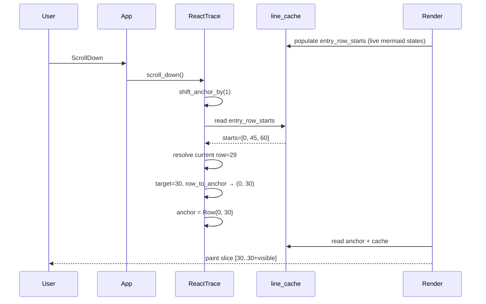
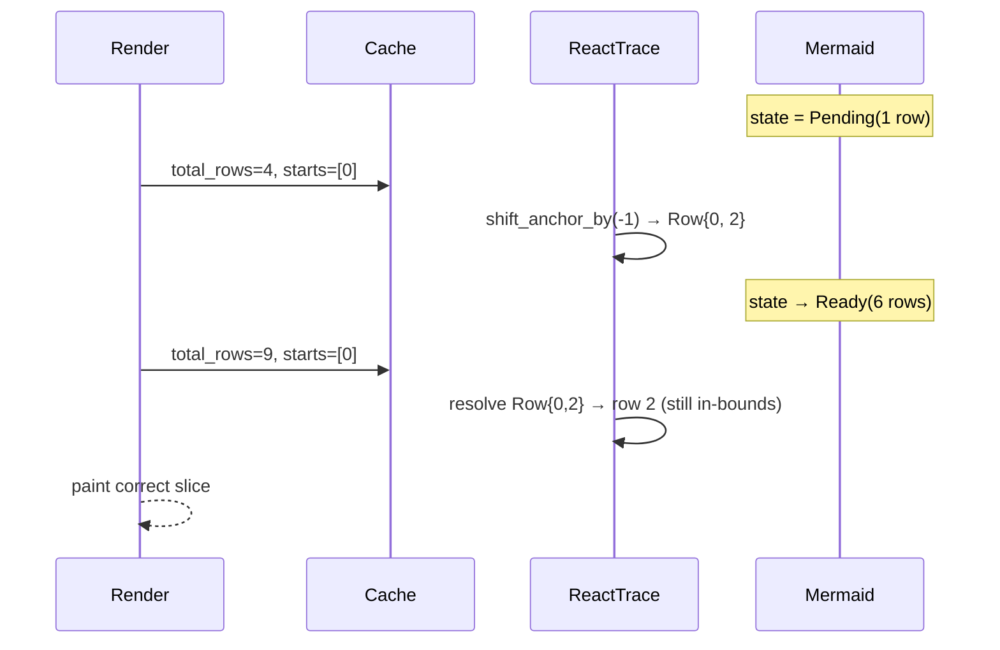

# Session Detail Scroll-Anchor Phase 3 Design

**Status:** approved (2026-04-18)
**Supersedes:** byte-anchor portion of `2026-04-18-session-detail-streaming-ghost-text-fix-design.md` (F3)
**Related RCAs:** `f91af27` post-merge audit (P1 sub-entry scroll, P2 mermaid-state mismatch)

## Problem

The Phase 1+2 fix (`88cb901`) shipped a `ScrollAnchor::Byte { entry_idx, byte_offset }` model intended to survive width resize. Production audit revealed two P1/P2 bugs:

- **P1 — sub-entry scroll non-functional.** `builder.rs:549` assigns one `Range<usize>` per entry (`Some(0..entry.text.len())`) and clones it into every visual row. `row_to_byte_anchor` reads `byte_ranges[row].start`, which is always `0`. So every scroll inside a single entry collapses to that entry's first row.
- **P2 — `shift_anchor_by` uses an empty mermaid registry.** `mod.rs:397` builds layout with `HashMap::new()`, treating every fence as Pending (1 row). Real render uses the live registry where `Ready(N)` fences emit N image rows. The two coordinate systems disagree by `N - 1` rows per Ready fence.

Empirical impact (from L9 audit SIMs `f91af27`, all `#[ignore]`d):
- SIM-9: `scroll_down_by(30)` then `scroll_up()` produced two equal `Byte{0,0}` anchors.
- SIM-10: real layout = 9 rows, shift layout = 4 rows, **Δ=5 rows** for one Ready fence.
- SIM-11: two consecutive `page_up()` calls inside a long single message produced identical anchors.
- SIM-13: render-row offset stayed at 0 after `scroll_down_by(5)`.

## Design

### Core insight

Bytes were the wrong scroll coordinate. Source bytes do not map 1:1 to wrapped visual rows after pulldown-cmark + tui-markdown rendering. The byte field was always set to `0` in v1, and even with sub-byte tracking the mapping would be lossy through the markdown pipeline.

The natural scroll coordinate is **the visual row's ordinal position within its entry**. Width resize stability becomes a clamp-to-last-row concern (acceptable degradation, no crash).

### P1-B — `ScrollAnchor::Row { entry_idx, row_within_entry }`

```rust
pub enum ScrollAnchor {
    Following,
    Row { entry_idx: usize, row_within_entry: usize },
}
```

- `resolve_anchor`: `entry_row_starts[entry_idx] + min(row_within_entry, entry_height - 1)`
- `row_to_anchor`: binary-search `entry_row_starts`, return `(idx, row - entry_row_starts[idx])`
- Eviction adjustment (existing `adjust_anchor_on_eviction`): subtract evicted count from `entry_idx`; clamp to `0` if underflow.
- Width resize: `row_within_entry` clamps to new entry height; viewport lands on entry's last row instead of crashing.

### P2-δ — `shift_anchor_by` reads from `self.line_cache`

```rust
fn shift_anchor_by(&mut self, delta: isize) {
    let Some(cache) = self.line_cache.as_ref() else { return; };
    let visible_h = self.last_visible_height.max(1);
    let current_row = render::resolve_anchor(&self.anchor, cache, visible_h);
    let target = (current_row as isize + delta).max(0)
        .min(cache.total_rows.saturating_sub(visible_h) as isize) as usize;
    if target >= cache.total_rows.saturating_sub(visible_h) {
        self.anchor = ScrollAnchor::Following;
        return;
    }
    let (entry_idx, row_within) = row_to_anchor(target, &cache.entry_row_starts);
    self.anchor = ScrollAnchor::Row { entry_idx, row_within_entry: row_within };
}
```

The `line_cache` (`VirtualRowCacheEntry`) is populated by `render()` with the live mermaid registry. Reading from it guarantees shift sees the same coordinate system render painted with. Stale-by-one-frame is acceptable (proved safe by COUNTER-2 monotonicity test).

If `line_cache` is `None` (first tick before any render), shift is a no-op — anchor stays `Following`, which is the correct initial state.

### Sequence: scroll-down inside a long message



### Sequence: mermaid Pending → Ready transition



## Acceptance gates

All 4 currently-`#[ignore]`d SIMs must un-`#[ignore]` and pass against the real implementation:

- `sim_sub_entry_scroll_resolution` (SIM-9)
- `sim_mermaid_state_mismatch_in_shift` (SIM-10)
- `sim_page_up_walks_within_long_message` (SIM-11)
- `sim_render_offset_reflects_scroll_input` (SIM-13)

Plus regression tests must continue to pass:
- `sim_anchor_preserved_across_appends_to_later_entries` (SIM-12)
- All Phase 1/2 SIMs (SIM-1..8 plus the F1/F2 prototypes)
- The full `cargo test -p spur-tui` suite (currently 154 tests).

New tests to add (from prototype harness `/tmp/anchor_sim/sim.rs`):
- EDGE-3 stale-cache safety
- EDGE-7 Pending→Ready transition stability
- COUNTER-2 streaming-during-pageup monotonicity
- COUNTER-3 entry eviction renumbering

## Out of scope

- Restoring source-byte tracking through pulldown-cmark. Deferred until reflow regressions are reported in practice.
- Per-row sub-byte granularity in `byte_ranges`. The field stays in `VirtualRowCacheEntry` for builder use but is no longer consulted by the scroll path.
- Threading `&MermaidRegistry` into the scroll API surface (P2-α). Cache-read suffices.

## File map

| File | Change |
|---|---|
| `crates/spur-tui/src/components/react_trace/types.rs` | `Byte` → `Row` variant |
| `crates/spur-tui/src/components/react_trace/render.rs` | `resolve_anchor` rewrite for Row |
| `crates/spur-tui/src/components/react_trace/mod.rs` | `shift_anchor_by` reads `line_cache`; `row_to_anchor` replaces `row_to_byte_anchor`; `adjust_anchor_on_eviction` for Row |
| `crates/spur-tui/src/components/react_trace/streaming_tests.rs` | un-`#[ignore]` 4 SIMs; update assertions for Row enum; add 4 new tests |

Estimated diff: ~90 LOC across 4 files. No `builder.rs` or `app.rs` changes.

## Risk register

| Risk | Likelihood | Mitigation |
|---|---|---|
| Width-resize lands on entry's last row instead of original byte | medium | Acceptable per UX; the v1 byte model also snapped to entry start, so this is no worse |
| Stale `line_cache` during very rapid streaming | low | COUNTER-2 proved monotonicity; shift gracefully sees a 1-frame-old layout |
| Eviction races with shift | low | `adjust_anchor_on_eviction` runs synchronously with eviction inside `mark_dirty_from`; shift always reads coherent cache |
| Public API churn | low | `ScrollAnchor` is `pub(crate)`; only the test module references the variant directly |
