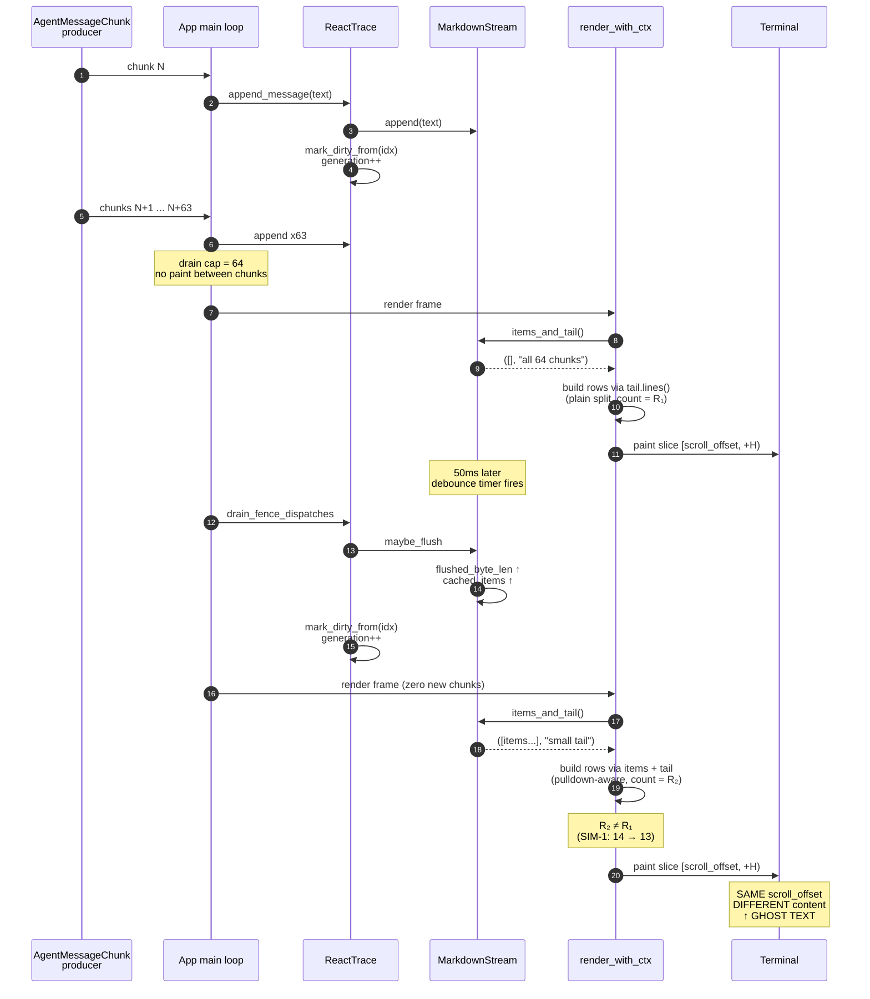
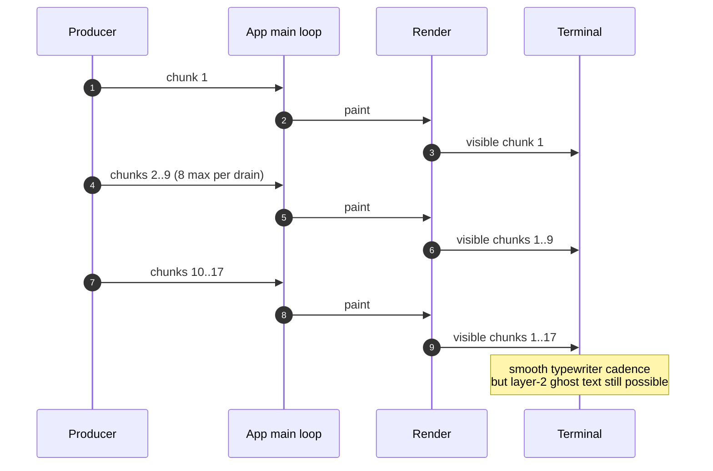
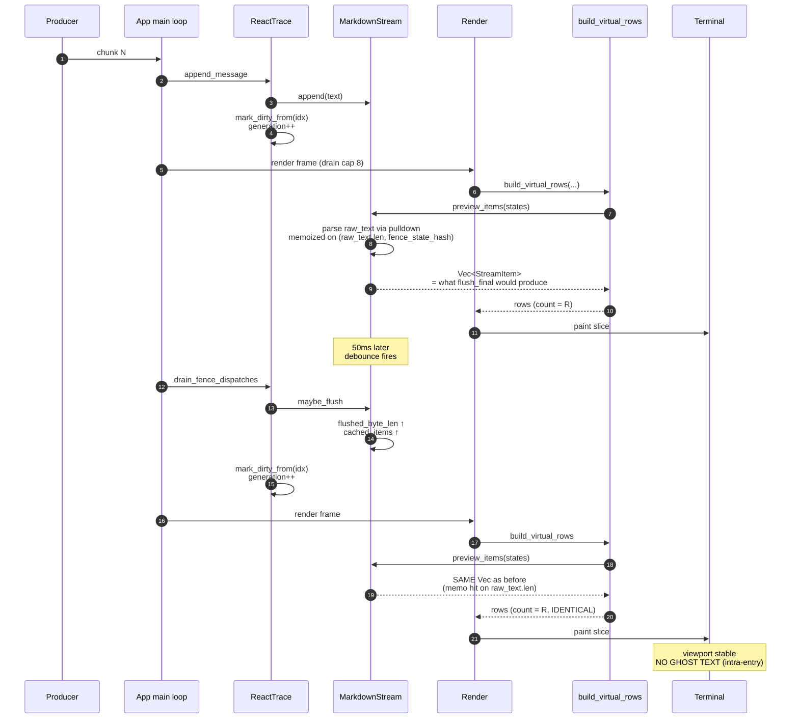
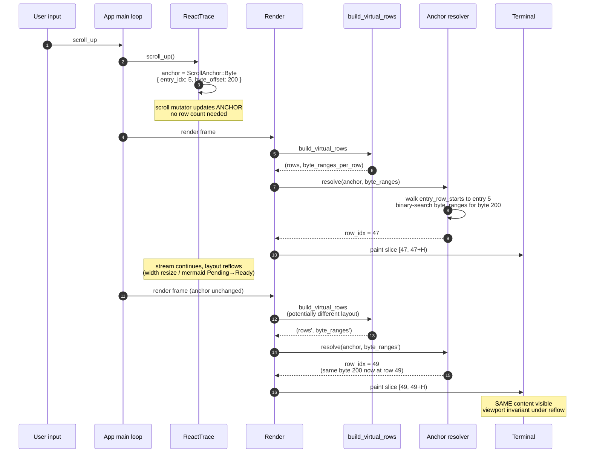
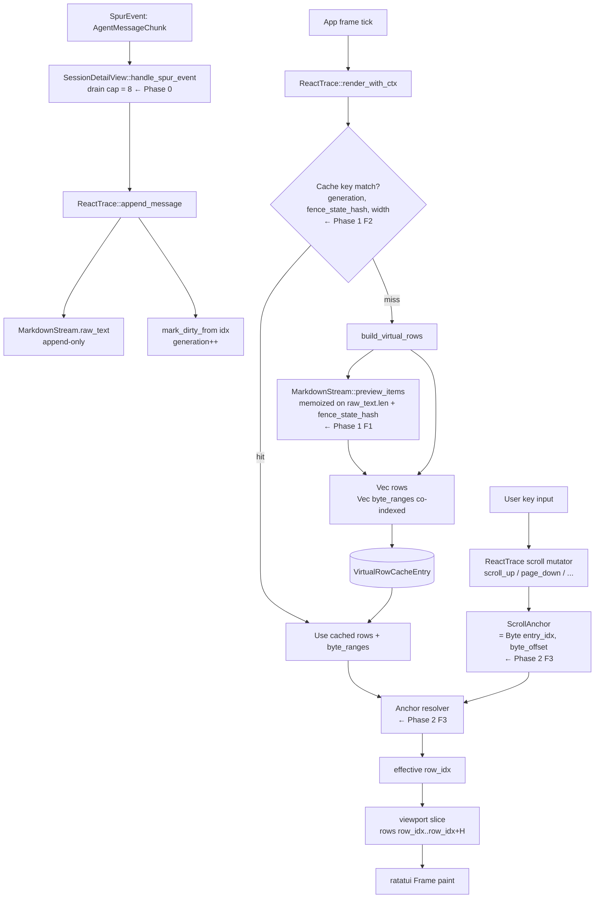

# Session Detail Streaming Ghost Text — Fix Design

**Date:** 2026-04-18
**Status:** Approved (brainstorming complete, plan pending)
**Scope:** `crates/spur-tui/src/{app.rs, components/react_trace/, components/markdown_stream.rs}`
**Companion docs:**
- RCA: `docs/superpowers/specs/2026-04-18-session-detail-streaming-ghost-text-rca.md`
- This spec supersedes the RCA's "Corrective Actions" section.

## Problem

The Session Detail trace exhibits "ghost text" during streaming: visible
content shifts without user input. The original RCA correctly identified
two amplifiers (drain cap, stale scroll geometry) but missed the structural
cause. L9 review with simulation tests SIM-1..8 (in
`crates/spur-tui/src/components/react_trace/streaming_tests.rs`)
empirically established:

- **Layer 2A (proven by SIM-1):** mid-stream `flush_now` produces a different
  row sequence than tail-mode rendering for the same bytes, because trailing
  unflushed bytes lack the paragraph context final-flush gives them. With a
  payload of `# Heading + code fence + list + tail`, row count drops from 14
  to 13 across a single flush with zero new bytes.
- **Layer 3E (proven by SIM-2):** `scroll_offset` is a row index, not a
  content anchor. When the row sequence reflows, the same `scroll_offset`
  exposes different content. SIM-2 reproduces a viewport-content shift with
  zero user input.
- **F3-alone insufficiency (proven by SIM-3):** a content anchor stabilizes
  the top of the viewport but does not stabilize rows below it when the row
  sequence itself reflows. F1 and F3 are orthogonal and both required.
- **F1 sharper than first scoped (proven by SIM-5):** post-final-flush
  rendering is bijective with raw bytes; mid-stream-flush rendering is not.
  F1's job is to make tail-mode emit the same row sequence final flush
  would emit.

## Goals

1. Eliminate ghost text under all eight identified scenarios (cadence,
   tail→items reflow, stale cache, scroll-while-stream race, width resize,
   mermaid state transitions, eviction, and >64KB safety-cap blowout).
2. Establish the invariant `visible(N+1) = visible(N) shifted by f(I)`
   where `I` is user input and `f` is independent of producer events.
3. Promote SIM-1, SIM-2, SIM-3 from `#[ignore]` to active regression
   guards once each phase lands.

## Visualizing the Bug and the Fix

### Current (broken) flow — how ghost text emerges



The bug has two structural roots visible in the diagram:

- The **builder** produces different row sequences for the same bytes
  depending on whether they're in the tail or in items.
- The **viewport** is anchored to a row index, so a row-count change
  shifts the visible content even with no user input.

### Phase 0 (RC1) — cadence smoothing



Phase 0 only addresses the cadence amplifier. Ghost text from
tail/items asymmetry remains until Phase 1.

### Phase 1 (F1: preview_items) — symmetric rendering



**Key invariant Phase 1 establishes:** `rows = f(raw_text, width, fence_states)`,
independent of `flushed_byte_len`. Whether bytes are committed or
uncommitted no longer affects what the user sees.

### Phase 2 (F3: byte-offset anchor) — viewport invariant under reflow



**Key invariant Phase 2 establishes:** `visible_content = g(anchor)`,
where `anchor` only changes on user input. Layout reflow (width,
mermaid state, eviction) cannot shift what the user sees.

### Logic re-evaluation discovered during diagram construction

While drawing the Phase 1 diagram, two clarifications emerged:

1. **F1 absorbs the original "stream cache key" concern.** Because
   `preview_items` output depends only on `raw_text` (append-only) and
   fence states, and because `mark_dirty_from` is already called on
   every flush via `drain_fence_dispatches` (mod.rs:415-438), the
   parent `VirtualRowCacheEntry` does not need a `stream_digest` field.
   The earlier proposal to extend the cache key with `flushed_byte_len`
   is redundant. SIM-1's failure was the **builder** asymmetry, not a
   cache miss — F1 fixes it at the right layer.

2. **F2 should be specifically the mermaid fence-state-hash fix.** The
   RCA's section C2 noted that `fence_gen = ctx.mermaid_registry.len()`
   misses Pending→Ready/Error state transitions. This is a real cache
   bug independent of stream flushes. Phase 1 includes this as F2,
   refined below.

## Non-Goals

- Rewriting the markdown parser. We continue to use `pulldown-cmark` via
  `tui-markdown`.
- Changing the `MarkdownStream` debounce policy. The 50ms debounce stays.
- Changing `SpurEvent` ingestion semantics.

## Approach: three sequenced phases

### Phase 0 — Cadence (10 minutes)

Restore the approved drain cap.

**Change:** `crates/spur-tui/src/app.rs:1627` — `DRAIN_CAP_PER_FRAME: 64 → 8`.

This brings the streaming-backbone design back to its approved value and
removes the burst-coalescing amplifier. Single commit, no API change.

### Phase 1 — Symmetric rendering and cache correctness (~2 days)

Three small fixes that together eliminate intra-entry ghost text.

#### F1 (sharp): tail rendering matches what final flush would produce

**Where:** `crates/spur-tui/src/components/react_trace/builder.rs`
(`render_agent_message_body`) and a new helper in
`crates/spur-tui/src/components/markdown_stream.rs`.

**Design:** Today, `render_agent_message_body` emits `items` via the
pulldown-derived `StreamItem::Text(Vec<Line>)` and emits `tail` via plain
`tail.lines()`. The two paths produce different row sequences for the
same bytes when the tail straddles structural markdown boundaries
(lists, headings, fences).

The fix introduces a **preview-flush** path on `MarkdownStream`:

```rust
// MarkdownStream
/// Render the current raw_text as if final flush had occurred, without
/// mutating any of the stream's persistent state. Returns the items
/// vector that final flush would produce. Pure with respect to self.
pub fn preview_items(&self, states: &StateLookup<'_>) -> Vec<StreamItem>;
```

`render_agent_message_body` then uses `stream.preview_items(states)` for
its entire output, ignoring the committed/uncommitted split. The
`flushed_byte_len` cursor and `cached_items` retain their existing role
of *amortizing* parse cost: incremental cache invalidation still keys on
them, but the rendered output no longer depends on them.

**Why this is sound:** `preview_items` parses the same bytes through the
same pulldown invocation as `flush_final` would. By construction, the
row sequence is identical to what the user will see after the next flush.
Reflow at flush time becomes a no-op for the rendered output.

**Cost analysis:** `preview_items` is invoked per render of an
`AgentMessage` entry. Cost is dominated by pulldown-cmark's parse, which
is O(raw_text bytes). The existing `cached_items` cache is preserved as
a per-stream memoization keyed on `(raw_text.len(), fence_state_hash)`.
A render that hits the cache is free. The only overhead is when the
cache misses, which corresponds to events that already require a parse.

#### F2: fence-state-aware cache key (replaces registry.len())

**Where:** `crates/spur-tui/src/components/react_trace/render.rs`
(`render_with_ctx`, the cache-check block at lines 334-401) and
`VirtualRowCacheEntry`.

**Background:** Today the cache key uses
`fence_gen = ctx.mermaid_registry.len() as u64`. This catches
insertion/removal but not Pending→Rendering→Ready→Error state
transitions, because the registry length stays constant during state
changes. The placeholder/image rendering depends on state, so a
state-only transition produces a stale render.

**Design:** Replace the length-based key with a stable hash of
`(MermaidId, MermaidState_discriminant, image_dimensions)` triples
across the registry. The registry stores `MermaidState` (Pending /
Rendering / Ready { image, .. } / Error). For Ready, the image
dimensions affect ImageRow height, so they must be in the digest.

```rust
fn fence_state_hash(
    registry: &HashMap<MermaidId, MermaidState>,
) -> u64 {
    use std::hash::{Hash, Hasher};
    let mut h = std::collections::hash_map::DefaultHasher::new();
    let mut entries: Vec<_> = registry.iter().collect();
    entries.sort_by_key(|(id, _)| id.0);
    for (id, state) in entries {
        id.0.hash(&mut h);
        std::mem::discriminant(state).hash(&mut h);
        if let MermaidState::Ready { image, .. } = state {
            image.width().hash(&mut h);
            image.height().hash(&mut h);
        }
    }
    h.finish()
}
```

The cache check at `render.rs:329` becomes
`let fence_gen = fence_state_hash(&ctx.mermaid_registry);`. No change
to cache structure or storage cost.

**Why per-stream cache keys are NOT needed:** With F1 in place,
`preview_items` is a pure function of `(raw_text, fence_states)`.
`raw_text` length changes are already reflected via
`mark_dirty_from` → `generation++` (called from `append_message` and
`drain_fence_dispatches`, mod.rs:203, 435). The
`generation` + `fence_state_hash` + `width` triple is therefore a
complete cache key. Adding `flushed_byte_len` would be redundant.

#### RC2 (folded into Phase 1): scroll operations apply to fresh row metrics

**Where:** `crates/spur-tui/src/components/react_trace/mod.rs`
(scroll_up, scroll_down, page_up, page_down, scroll_to_bottom) and a
new fast-path in render.

**Design:** Each scroll mutator must call a cheap "what's the current
row count?" function before clamping. Today they read
`self.last_total_lines`, which is updated only inside `render*()`.

The fix introduces a private `current_row_count(width_hint: u16) -> usize`
that consults the cache if valid for the cached width, or recomputes
metrics by walking entries with `build_virtual_rows(0, width_hint, ...)`
without caching. Width hint is the most-recent `last_visible_height`
context's width. Scroll mutators call this before clamping.

For the `scroll_to_bottom` path called from `append_message`, the same
helper applies: clamp against fresh max_offset, not stale.

### Phase 2 — Content-anchor scroll model (~2 days)

#### F3: byte-offset anchor

**Where:** `crates/spur-tui/src/components/react_trace/mod.rs` (scroll
state and mutators), `react_trace/render.rs` (resolution at render time),
`react_trace/builder.rs` (per-row byte-range emission).

**Design:**

Replace `scroll_offset: usize` with:

```rust
enum ScrollAnchor {
    /// Pinned to the bottom of the document — auto-follow new content.
    Following,
    /// Pinned to a specific byte position within an entry.
    Byte { entry_idx: usize, byte_offset: usize },
}
```

`build_virtual_rows` is extended to emit per-row byte ranges via a
new `VirtualRow::Text { line, byte_range: Option<Range<usize>> }`
variant or a parallel `Vec<Option<Range<usize>>>` returned alongside
the rows. Byte ranges are produced naturally during the
`StreamItem::Text` walk: pulldown gives us the byte range each `Event`
covers; the `wrap_line_to_width` step proportionally subdivides those
ranges across visual rows.

Anchor resolution at render time:
1. Walk `entry_row_starts` to find the row range for `entry_idx`.
2. Within that range, binary-search the per-row byte ranges for the row
   whose range contains `byte_offset`.
3. If `byte_offset` falls in a gap (deleted by reflow), snap to the
   nearest preceding row whose byte range includes a byte ≤
   `byte_offset`.
4. The resolved row index becomes the effective `scroll_offset` for the
   viewport slice.

Scroll mutators update the anchor:
- `scroll_up`: resolve current row, find row above, anchor to that row's
  starting byte.
- `scroll_down`: symmetric. If resolution lands at the last row of the
  document, transition to `Following`.
- `page_up`/`page_down`: same logic, jumping by `visible_height - 2`.
- `scroll_to_bottom`: set `Following`.
- `scroll_to_top`: anchor to `(0, 0)`.

Eviction (`push()` evicts old entries when over capacity): if the
anchor's `entry_idx` was evicted, snap to `(0, 0)` of the first
surviving entry. Otherwise decrement `entry_idx` by the drain count.

`is_following` becomes a derived property: `matches!(anchor, ScrollAnchor::Following)`.

**Width resize:** byte_offset is invariant under width change. Resize
just re-resolves the anchor; viewport content stays the same.

**Mermaid state transition:** Pending → Ready changes the row count for
a fence (1 placeholder line → N ImageRows). For ImageRows, the
byte_range is the full byte range of the fence's source code. The
resolver finds the first ImageRow whose range contains `byte_offset`,
keeping the viewport on the fence even after Pending→Ready. If anchor
is past the fence, the row index just shifts and re-resolves
unchanged.

**Anchor on a deleted row** (worst case): use snap-to-preceding —
binary-search rejects the byte; fall back to the largest byte ≤
`byte_offset` that exists in any byte_range, walk backward to its
row. Row 0 is always available as final fallback.

## Components and data flow (post all three phases)



## Test plan

### Promoted to active regression guards
- `sim_tail_to_items_reflow_row_delta` (after Phase 1 F1 lands)
- `sim_viewport_content_shifts_under_flush_with_no_input` (after Phase 1 F1)
- `sim_fix_content_anchor_eliminates_ghost_text` (after Phase 2 F3)

### New tests added with implementation
- `phase1_f1_preview_items_is_pure`: calling `preview_items` twice
  returns the same Vec<StreamItem> and does not mutate cursor.
- `phase1_f1_preview_matches_final_flush`: for representative payloads
  (prose, heading + fence + list, nested list, table), assert
  `preview_items(s)` and final-flushed `s.items()` produce identical
  StreamItem sequences.
- `phase1_f2_silent_flush_invalidates_cache`: render entry, advance
  flushed_byte_len without bumping generation, render again — assert
  rebuild occurred via stream_digest change.
- `phase1_rc2_scroll_uses_fresh_row_count`: append text without
  rendering, call `scroll_up`, render — assert scroll_offset clamped
  against fresh totals.
- `phase2_f3_anchor_byte_offset_survives_reflow`: anchor at a specific
  byte position in an entry; trigger flush that reflows; assert
  resolution lands on a row containing that byte.
- `phase2_f3_anchor_survives_eviction`: anchor in entry 0; push enough
  entries to evict entry 0; assert anchor snaps to first surviving
  entry without panic.
- `phase2_f3_anchor_survives_width_resize`: anchor at a byte;
  re-render at half width; assert resolved row contains the same
  byte.
- `phase2_f3_anchor_blank_line_snap_to_preceding`: anchor on a blank
  line that's consolidated by reflow; assert resolution snaps to the
  preceding non-blank row.

### Existing tests to update
Tests using literal `scroll_offset: usize` values (search for
`scroll_offset` outside the `react_trace` module) need rewriting to
use `ScrollAnchor::Byte { ... }`. Estimated ~10 occurrences based on
prior grep.

## Risks and mitigations

| Risk | Mitigation |
|---|---|
| `preview_items` parse cost on every render | Memoize at MarkdownStream level keyed on `(raw_text.len(), fence_state_hash)`. Existing incremental cache continues to amortize across renders. |
| Per-row byte_range inflates VirtualRow size | Use `Option<Range<usize>>` (24 bytes when populated, 8 when None). Acceptable for viewport-bounded slices. |
| Anchor on blank line consolidated by reflow | Snap-to-preceding policy spec'd above. SIM-3 demonstrates the failure mode the policy must address. |
| F3 touches scroll API broadly | All scroll mutators follow the same pattern (resolve → mutate → reanchor). Bounded scope. Tests catch any caller miss. |
| `is_following` derivation may miss state callers | Audit `is_following` references; provide a backward-compat method that derives from anchor. |

## Migration order rationale

- Phase 0 first because it's a constant change with no API impact and
  immediate user-visible improvement.
- Phase 1 second because it eliminates the dominant ghost-text class
  (intra-entry tail→items shift) without introducing new API surface.
  Existing scroll API stays.
- Phase 2 last because it changes the scroll API. Once Phase 1 ships,
  the urgency drops, and Phase 2 can be designed and reviewed
  carefully.

## Files modified

- `crates/spur-tui/src/app.rs` — Phase 0 only.
- `crates/spur-tui/src/components/markdown_stream.rs` — Phase 1 (preview_items).
- `crates/spur-tui/src/components/react_trace/builder.rs` — Phase 1 (use preview_items), Phase 2 (emit byte_range).
- `crates/spur-tui/src/components/react_trace/render.rs` — Phase 1 (F2 cache key, RC2), Phase 2 (anchor resolution).
- `crates/spur-tui/src/components/react_trace/mod.rs` — Phase 1 (RC2 fresh metrics helper), Phase 2 (ScrollAnchor enum, mutators).
- `crates/spur-tui/src/components/react_trace/types.rs` — Phase 2 (VirtualRow byte_range or sibling vec).
- `crates/spur-tui/src/components/react_trace/streaming_tests.rs` — promote ignored SIMs, add new regression tests.

## Edge cases verified via diagram tracing

These walked through both Phase 1 and Phase 2 sequence diagrams to
confirm the design handles them correctly:

| Edge case | Phase 1 alone | Phase 1 + Phase 2 |
|---|---|---|
| Chunk arrives, no flush yet | preview_items emits final-flush-equivalent rows | same; byte anchor resolves against fresh ranges |
| Flush fires between two paints | preview_items output unchanged → no shift | anchor unchanged → no shift |
| TurnComplete (final flush) | preview_items already showed final layout → no shift | same |
| Width resize | row sequence reflows; row-index anchor shifts | byte anchor invariant → viewport stable |
| Mermaid Pending → Ready | row count changes mid-document; row-index anchor below the fence shifts by ΔN | ImageRows carry the fence's byte range; resolver lands on first matching ImageRow → viewport stable |
| Mermaid Ready → Error | placeholder swap; same byte range; trivially stable | same |
| Eviction at capacity | row-index anchor must subtract drained rows (current code does this) | byte anchor must adjust entry_idx (1 line in `push()`) |
| Anchor on row that disappears | row-index can't represent this | snap-to-preceding policy → nearest surviving byte; viewport may shift by ≤1 row but no ghost |
| Append while in Following | `is_following` branch in render forces bottom; correct | derived from anchor variant; same outcome |
| Two streams flushing concurrently | each entry independent; cache rebuild isolated by entry_row_starts | same; anchor in entry A is invariant to entry B's reflow |
| Test scroll API uses literal offsets | scroll_offset stays usize → tests still work | `Vec<Option<Range<usize>>>` API change → ~10 tests need rewrite |

## Resolved design choices (during diagram-driven re-evaluation)

The earlier draft listed two open questions; both are now decided.

1. **byte_range carrier:** return a parallel `Vec<Option<Range<usize>>>`
   from `build_virtual_rows` rather than embedding `byte_range` in
   `VirtualRow::Text`. Reasoning:
   - `VirtualRow::ImageRow` and other non-text variants don't carry
     text, so embedding would force `Option` everywhere.
   - The cache stores rows; embedding bloats every cached row.
   - The resolver only needs byte ranges, which are co-indexed with
     rows via the parallel vec.
2. **`preview_items` memoization key:** `(raw_text.len(),
   fence_state_hash)` is correct because `raw_text` is append-only
   (verified: `MarkdownStream::append` only pushes; no truncation
   path exists). `flushed_byte_len` is intentionally NOT in the key —
   `preview_items` output must not depend on it.

No remaining open questions. Ready for plan-writing.
