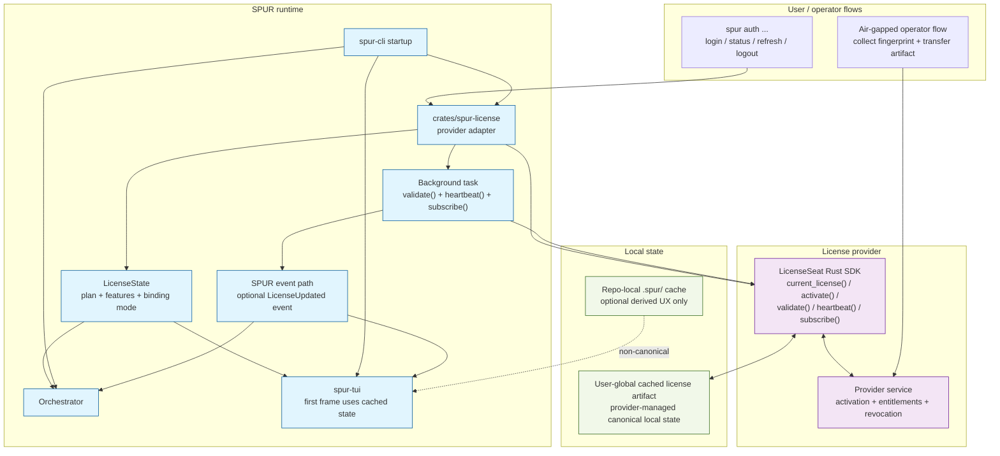

# Spur Commercial Licensing Architecture & Strategy

## Status
Grounded against the public LicenseSeat Rust references on 2026-04-18.
First implementation should pin `licenseseat = "=0.5.3"` and compile against
that exact SDK surface before broader rollout.

## Objective
Establish a rigorous, performant, and secure commercial licensing architecture
for the `spur` Rust TUI/CLI application. The system must preserve instant TUI
startup, support offline operation for remote and air-gapped environments, and
fit SPUR's product roadmap: LTD launch first, then per-user Pro, Team, and
Enterprise offerings.

## Grounded External Findings
The public LicenseSeat Rust references currently support the following claims:

1. There is an official Rust SDK (`licenseseat`), with a documented surface
   that includes activation, validation, deactivation, entitlements,
   background validation, heartbeat, and event subscription.
2. Client applications are expected to use a publishable `pk_*` API key, not a
   server-side secret key.
3. The SDK exposes cached local license state (`current_license()` or
   equivalent documented accessor), which is the correct seam for zero-latency
   startup.
4. The documented runtime primitives are `validate()`, `heartbeat()`, and
   `subscribe()`. This design must not depend on an invented `ping()` API.
5. The public docs are internally inconsistent on one point:
   - the site SDK page still describes signed offline tokens as the active Rust
     story;
   - the versioned `0.5.3` docs.rs summary describes the SDK as
     machine-file-first, with legacy offline tokens retained as compatibility.
   Implementation must therefore pin the crate version and compile against the
   exact API surface before finalizing the rollout plan.
6. The public offline guidance supports manual / air-gapped workflows using a
   fingerprint plus machine-file transfer. The public docs do not currently
   document a built-in QR challenge-response or a special offline activation
   endpoint for Rust clients.

## Product Alignment
SPUR's product docs already commit to:

- Community / free
- LTD launch
- Pro subscription
- Team subscription
- Enterprise / self-hosted

Therefore the root abstraction must not be "machine-locked desktop key." The
root abstraction must be "signed entitlement state," where device binding is
only one possible claim mode.

## First Principles Constraints
1. Zero-latency startup: `spur watch` must render without waiting on network.
2. Offline viability: a previously activated installation must continue to boot
   and enforce feature gates while offline, within its documented lease /
   expiration policy.
3. Cryptographic trust: local state must be signed and verified by the vendor
   or provider runtime; no trust is placed in unsigned local JSON.
4. Provider isolation: SPUR's internal licensing contract must remain stable if
   the backing provider changes from LicenseSeat to another vendor or an
   in-house service.
5. Future-proof claims: the model must support user, org, and CI subjects, not
   only node-locked desktop installs.

## Non-Goals
- Blocking the main thread on network validation.
- Embedding a server-side secret API key in the client binary.
- Storing the primary license secret in repo-local `.spur/` state.
- Hard-coding CI behavior as "normal desktop key, but skip fingerprinting."

## Selection
### V1 Provider Choice
For v1, LicenseSeat remains the best fit because it has an official Rust SDK
and public documentation for activation, offline state, background validation,
entitlements, and air-gapped machine-file workflows.

### Architecture Choice
The main architecture decision is not "pick LicenseSeat." The main decision is:

**SPUR will define a provider-agnostic licensing contract around cached,
signed entitlement state, and LicenseSeat will be the first provider behind
that contract.**

If the provider changes later, SPUR should replace the adapter, not redesign
its startup and feature-gating model.

## Internal Contract
Create `crates/spur-license` as the stable internal boundary.

Responsibilities:

1. Construct and own the provider SDK client.
2. Read cached local license state synchronously at startup.
3. Map provider-specific state into a SPUR-native `LicenseState`.
4. Expose async activation / validation / heartbeat operations.
5. Bridge provider events into SPUR's runtime state updates.

Suggested SPUR-facing contract:

```rust
pub struct LicenseState {
    pub active: bool,
    pub subject_kind: SubjectKind,
    pub plan: Plan,
    pub features: BTreeSet<FeatureFlag>,
    pub expires_at: Option<DateTime<Utc>>,
    pub binding_mode: BindingMode,
    pub offline_ok: bool,
    pub status_text: String,
}

pub enum SubjectKind {
    User,
    Organization,
    Ci,
    Unknown,
}

pub enum BindingMode {
    NodeLocked,
    FloatingCi,
    Organization,
    Unknown,
}
```

The provider adapter should expose operations equivalent to:

- `current_state()` from cached local state
- `activate(key)`
- `validate()`
- `heartbeat()`
- `deactivate()`
- `subscribe()`
- `has_entitlement(feature)`

For LicenseSeat specifically, the first implementation should use the SDK's
documented `current_license()`, `activate()`, `validate()`, `heartbeat()`,
`subscribe()`, and entitlement helpers rather than inventing custom wire
protocols.

## Entitlement Model
SPUR's internal claim model should be richer than a single `"tier": "pro"`
string. At minimum, `LicenseState` should be able to represent:

- `subject_kind`: `user`, `organization`, or `ci`
- `subject_id`: stable identifier when available
- `plan`: `community`, `starter_ltd`, `builder_ltd`, `founder_ltd`, `pro`,
  `team`, `enterprise`
- `features`: granular gates such as unlimited agents, PM integrations,
  auto-failover, shared dashboards, SSO, audit logs
- `expires_at`: optional expiry or lease end
- `binding_mode`: node-locked, floating CI, or org-bound
- `machine_binding`: optional fingerprint / machine identity for node-locked
  installs
- `concurrency_limit`: optional seat or floating limit
- `revocation_generation`: optional provider generation / lease version to
  support downgrade after refresh

This is a SPUR-side model. The provider may represent these fields differently;
the adapter is responsible for mapping them.

## State Taxonomy
SPUR already mixes repo-local and user-global state:

- repo-local: `.spur/logs`, `.spur/events`, `.spur/session_metadata.json`
- user-global: `~/.spur/config.toml` fallback, `~/.spur/cost.db`

Licensing should follow the same discipline:

1. Primary license cache and provider activation artifacts are user-global.
2. Repo-local `.spur/` state may cache derived feature state for UX if needed,
   but must not become the canonical source of truth for the license.
3. Feature gating must not depend on the current working directory.

This keeps one user's activation portable across repos and worktrees while
avoiding accidental repo-scoped licensing behavior.

## SPUR Integration Architecture


### 1. Startup Hydration
The correct startup seam is the existing synchronous load path in `spur-cli`
and `spur-tui`, not a late command-only integration.

Startup flow:

1. `spur-cli` constructs `spur-license` before `Orchestrator` startup and
   before `run_tui_with_config(...)`.
2. `spur-license` reads cached provider state synchronously via
   `current_license()` or equivalent documented SDK accessor.
3. `spur-license` maps that cached state into `LicenseState`.
4. `LicenseState` is passed to:
   - CLI command routing for feature gating
   - TUI app initialization for instant status / feature hydration
5. The TUI renders immediately with cached state; no network is required to
   paint the first frame.

### 2. Background Refresh
After startup, a background Tokio task should:

1. Run provider `validate()` on an interval.
2. Run provider `heartbeat()` when the chosen license mode requires it.
3. Listen to provider `subscribe()` events when available.
4. Convert provider changes into SPUR runtime updates.

For SPUR, the preferred propagation path is the existing event-driven runtime:

- bridge updates into the existing event / broadcast model, or
- add a dedicated `LicenseUpdated` event variant if needed.

Avoid one-off hidden channels when the rest of the application already uses an
event funnel plus TUI receiver model.

### 3. Failure Semantics
Validation and heartbeat failures should be classified:

- transient network failure: keep cached state, mark status as degraded
- hard revocation / invalid license: downgrade features after confirmed refresh
- expired lease with no offline allowance: downgrade features

The application should fail closed only after the provider's documented cached
state and lease semantics say it is no longer valid.

## CLI UX
Add an `auth` command family:

- `spur auth login --key XXXX-XXXX-XXXX`
- `spur auth status`
- `spur auth logout`
- `spur auth refresh`

Optional:

- `spur auth trial`

`trial` should only exist if the provider / policy model can support it without
inventing a second activation system. If trials are just another provider-side
policy, that is acceptable. If they require unsupported SDK behavior, defer
them until the operator flow is proven.

## Offline and Air-Gapped Operation
### Normal Offline
For normal offline use, SPUR should rely on the SDK's cached local state and
documented offline / lease semantics. Startup remains local-only.

### Air-Gapped
For air-gapped environments, the grounded public operator flow is:

1. Collect the target machine fingerprint.
2. On an online operator machine, perform the provider-side activation /
   machine-file issuance.
3. Transfer the resulting provider artifact to the offline machine.
4. Let the SDK load and enforce that artifact locally.

This spec does **not** assume a QR code flow, dedicated offline activation
endpoint, or challenge-response ceremony unless those are later confirmed in
provider docs.

## CI / Automation
The earlier draft proposed:

- `SPUR_LICENSE_KEY=...`
- skip fingerprinting
- validate signature directly

That path is rejected in this revision because it is not grounded in the public
LicenseSeat Rust docs and creates bearer-token semantics.

For CI, SPUR should support one of these grounded models instead:

1. A provider-supported CI / floating entitlement class with its own claims and
   concurrency rules.
2. A short-lived leased artifact issued to CI and refreshed by policy.
3. A documented offline artifact flow for ephemeral runners if the provider
   supports it operationally.

The key point is that CI must be a distinct subject / binding mode, not a
special case that weakens normal desktop validation.

## Marketing and Promotion Strategy
The hard boundary between billing and licensing remains correct.

- Billing / merchant of record: coupons, tax, discounts, recurring billing
- Licensing provider: activation, entitlements, revocation, offline state

### Giveaways
Grounded approach: create provider-side policies / keys and distribute them.
The provider remains payment-agnostic.

### Discounts
Grounded approach: discounts live in Stripe / Lemon Squeezy; the licensing
provider receives only the post-purchase fulfillment signal.

### Trials
Grounded approach: if the provider supports a trial policy that activates into
normal cached offline state, SPUR can expose `spur auth trial`. Do not assume a
special client-side cryptographic flow beyond the provider's documented policy
model.

## Implementation Notes
1. Pin `licenseseat = "=0.5.3"` for the first compile spike.
2. Use a publishable `pk_*` key only.
3. Default telemetry to off unless SPUR explicitly chooses an opt-in path.
4. Build the provider adapter so the rest of SPUR never depends directly on
   LicenseSeat types.
5. Ground the exact storage-path behavior during the compile spike rather than
   assuming a specific `~/.spur/license.key` layout.
6. Use the SDK's documented methods (`current_license`, `validate`,
   `heartbeat`, `subscribe`) rather than undocumented assumptions.

## Open Risks
1. Public docs inconsistency: signed offline tokens vs machine-file-first in
   Rust references.
2. Exact SDK storage-path customization needs verification in code.
3. Team / org / enterprise claims may require a richer adapter mapping than the
   first LTD-focused rollout.
4. Trial UX may need an operator-side policy decision before the CLI shape is
   final.

## Recommended Next Step
Before implementation planning, run a small compile spike in `crates/spur-license`
that proves these exact points against `licenseseat = "=0.5.3"`:

1. Construct the SDK with a `pk_*` key.
2. Read cached state via `current_license()`.
3. Call `activate()`, `validate()`, and `heartbeat()`.
4. Inspect event subscription behavior via `subscribe()`.
5. Confirm the SDK's local storage behavior and any customization hooks.

Only after that spike should the implementation plan lock in exact types,
method signatures, and storage conventions.

## References
- LicenseSeat Rust SDK docs: https://licenseseat.com/docs/sdks-rust/
- LicenseSeat offline licensing guide:
  https://licenseseat.com/docs/guides-offline-licensing/
- `licenseseat` crate `0.5.3`: https://docs.rs/crate/licenseseat/0.5.3
- `licenseseat` crate features: https://docs.rs/crate/licenseseat/0.5.3/features
