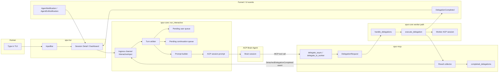

# Brain Async Continuation Scheduling — Design

**Status:** design
**Date:** 2026-04-19
**Reference specs:**
- `docs/superpowers/specs/2026-04-19-brain-worker-integration-invariants.md`
- `docs/superpowers/specs/2026-04-15-brain-delegation-framework-design.md`
- `docs/superpowers/specs/2026-04-14-brain-worker-refinement-design.md`
- ACP Prompt Turn: <https://agentclientprotocol.com/protocol/prompt-turn>
- ACP Content: <https://agentclientprotocol.com/protocol/content>
- ACP Extensibility: <https://agentclientprotocol.com/protocol/extensibility>

**Area:** `spur-core` orchestrator scheduler · `spur-mcp` detached delegation completion · `spur-acp` ACP prompt integration · `spur-tui` event visibility
**Anchor files:** `crates/spur-core/src/orchestrator.rs`, `crates/spur-mcp/src/server.rs`, `crates/spur-acp/src/connection/mod.rs`, `crates/spur-acp/src/connection/native.rs`, `crates/spur-tui/src/components/input_bar.rs`

## Problem

SPUR now has two materially different delegation outcomes:

1. **Inline delegation completion** where the worker finishes before the MCP block timeout and the brain receives the `DelegationResult` inside the same ACP prompt turn.
2. **Detached async completion** where the worker outlives the MCP block timeout or the brain intentionally uses `delegate_async`, and the result lands later in `completed_delegations`.

The inline case is semantically clean: the worker result is a tool result inside the current brain turn.

The detached case is not. Once the original tool call already returned a `delegation_id`, the worker completion is no longer part of the original ACP turn. It becomes a **new external event**. Today SPUR exposes that event honestly for polling, but it has no principled design for how that event should become visible to the brain again when autonomous progress is desired.

The tempting shortcut is wrong:

- do **not** route detached worker completion through `input_bar.rs`
- do **not** enqueue it as a fake `InteractiveInput::Message`
- do **not** let `spur-mcp` call `prompt()` directly on the brain connection

Those shortcuts collapse three distinct semantics into one path:

1. human foreground input
2. ACP tool/result flow
3. orchestrator-owned continuation events

That collapse creates ambiguity in transcript semantics, priority handling, cancellation, future message-id support, and turn ordering.

## Goals

1. **Preserve ACP truthfulness.** Detached worker completion must not masquerade as user input.
2. **Keep one turn arbiter.** A single orchestrator owner must decide when the brain may receive a new `session/prompt`.
3. **Prioritize the human.** User input must outrank background continuation work.
4. **Allow auto-resume when safe.** If the brain is idle and no human prompt is queued, SPUR may create a continuation turn automatically.
5. **Keep UI and model context separate.** Funnel/TUI events should update immediately even when no new brain prompt is issued.
6. **Fit current layering.** `spur-mcp` reports completion, `spur-core` schedules turns, `spur-acp` carries ACP traffic.

## Non-goals

- Rewriting ACP semantics so detached completion looks like continuation inside the original prompt turn.
- Using ACP vendor extensions as the only model-visible resume mechanism.
- Changing `delegate_async` to block.
- Implementing message editing or full provenance-aware transcript rendering in this spec.
- Worker-to-worker nested continuation logic.
- Replacing `wait_delegation` / `check_delegation_status`; polling remains valid and honest.

## Executive Summary

The correct model is a **three-lane architecture**:

1. **User lane**: TUI input becomes `InteractiveInput::Message` and eventually ACP `session/prompt`.
2. **Tool lane**: inline worker completion stays inside the original MCP tool/result path.
3. **Continuation lane**: detached completion becomes an orchestrator-owned `SystemContinuation` event, buffered until the scheduler decides it can safely materialize into a new ACP prompt turn.

The scheduler must live in `run_interactive`, because that loop already owns:

- the active brain session
- the only call site for `connection.prompt(...)`
- prompt-turn serialization
- cancellation behavior
- the current `pending_messages` queue

The MCP layer should **report** detached completion upward, not **schedule** it.

## Decision Table

| Option | Verdict | Why |
|---|---|---|
| Fake `InteractiveInput::Message` | Reject | Reclassifies system events as user messages |
| ACP ext notification only | Reject | Useful side channel, but not standard model-visible context |
| Poll-only forever | Acceptable fallback, not ideal | Honest but no autonomous liveness |
| Orchestrator-owned continuation queue + idle-only prompt scheduling | **Chosen** | Matches ACP, preserves priority, keeps layering clean |

## Current Grounding

### Current upstream brain prompt path

- `run_interactive` owns `pending_messages` and pops the next input before deciding whether to call `prompt()`.
- `InteractiveInput::Message` is flattened into `PromptRequest::new(...)`.
- While a turn is streaming, newly received messages are queued for later.

This means SPUR already has an implicit single-turn scheduler. The design in this doc makes that scheduler explicit rather than introducing a second competing owner.

### Current downstream detached completion path

- `delegate_to_worker` either returns inline worker results or, after timeout, returns text instructing the brain to poll with `delegation_id`.
- `delegate_async` immediately returns `delegation_id`.
- The detached result eventually reaches `completed_delegations`.

That is the right data boundary for async completion, but not the right scheduling boundary for brain resumption.

## Proposed Architecture

### High-level shape



### Key idea

The result collector pushes a **typed internal event** back to the orchestrator ingress, not a raw prompt. The orchestrator then decides:

1. emit UI/state events immediately
2. buffer model-visible continuation context
3. create a new ACP prompt turn only when safe

## Control Planes

### Upstream: ACP brain integration

The upstream contract is strict:

- ACP `session/prompt` is the standard way to send model-visible context.
- Detached worker completion is not part of the already-finished ACP turn.
- Therefore detached completion becomes model-visible only by:
  - a new prompt turn, or
  - explicit user-triggered polling inside a later turn

ACP custom `_vendor/...` notifications remain optional. They may be used for agent-side hooks or telemetry, but they do not replace the prompt turn for language-model reasoning.

### Downstream: worker completion integration

The downstream contract is:

- worker execution still ends in `DelegationResult`
- `DelegationCompleted` still hits the Funnel immediately for TUI/lineage visibility
- detached completion additionally emits an orchestrator-internal continuation event
- that event is brain-session-scoped and replay-safe

This keeps UI liveness separate from brain re-entry.

## Core Design

### 1. Add a typed continuation input

Add a new orchestrator-only input variant:

```rust
InteractiveInput::SystemContinuation {
    session: SessionId,
    continuation: BrainContinuation,
}
```

Example shape:

```rust
struct BrainContinuation {
    delegation_id: String,
    source: ContinuationSource, // delegate_async | timed_out_delegate
    result: DelegationResult,
    created_at: Instant,
}
```

This is intentionally **not** `InteractiveInput::Message`.

### 2. Keep one scheduler owner

`run_interactive` remains the sole owner of:

- active brain session
- whether a turn is in flight
- whether cancellation is in progress
- prompt-turn serialization
- continuation materialization

No background task should call `brain.connection.prompt(...)` directly.

### 3. Distinguish ingress from storage

The ingress channel may stay unified, but the scheduler should maintain separate internal storage:

- `pending_user_messages`
- `pending_continuations`

That allows different policies:

- FIFO within each lane
- human priority over background continuations
- coalescing of multiple detached completions

### 4. Materialize continuation only when idle

The scheduler may issue an autonomous continuation prompt only if:

1. the brain session exists
2. no prompt turn is currently streaming
3. no cancel is draining
4. no queued user message predates the continuation

If any of those conditions fail, buffer the continuation.

### 5. Merge with the next user turn when appropriate

If a user prompt arrives before the continuation fires, do not create a separate autonomous turn. Instead:

- preserve the user's blocks as the foreground request
- attach continuation context as structured background blocks
- send one ACP prompt turn

This preserves user priority while avoiding starvation of async completion context.

## Sequence: Worker Completes While Brain Is Busy

```mermaid
sequenceDiagram
    participant User
    participant TUI
    participant Orch as Orchestrator Scheduler
    participant Brain as ACP Brain
    participant MCP as spur-mcp
    participant Worker as Worker

    User->>TUI: Send prompt A
    TUI->>Orch: InteractiveInput::Message
    Orch->>Brain: session/prompt(prompt A)
    Note over Orch,Brain: Turn A is in flight

    Brain->>MCP: delegate_async(...)
    MCP->>Worker: DelegationRequest
    MCP-->>Brain: delegation_id

    User->>TUI: Send prompt B
    TUI->>Orch: InteractiveInput::Message
    Note over Orch: Queue prompt B behind active turn

    Worker-->>MCP: DelegationResult
    MCP->>Orch: InteractiveInput::SystemContinuation
    Note over Orch: Queue continuation; do not preempt active turn

    Brain-->>Orch: Turn A completes
    Note over Orch: User queue is non-empty, so user wins
    Orch->>Brain: session/prompt(prompt B + continuation context)
```

## Prompt Construction Rules

### Continuation-only autonomous turn

When the scheduler decides to fire an autonomous continuation turn, the prompt should contain:

1. a short text block summarizing why SPUR is re-entering the brain
2. one or more `ContentBlock::Resource` blocks carrying structured continuation data
3. optional compact text summary for models that underperform on resource-only context

Example logical payload:

```text
Background SPUR continuation:
The detached delegation below completed after the original tool call returned.
Review the result and decide the next action.
```

Resource payload candidates:

- `delegation_id`
- `source`
- `status`
- `summary`
- `diff_summary`
- `worker_branch`

### User-turn merge

When merging into a user turn:

- keep user text intact
- prepend or append machine context blocks in a consistent format
- never rewrite the user-authored text block
- use `_meta` only for correlation, not as the primary context carrier

ACP content guidance makes `resource` blocks the preferred structured context vehicle.

## Priority and Fairness Rules

1. **User messages outrank continuations.**
2. **Continuation events never interrupt an active turn.**
3. **`CancelStream` outranks both user messages and continuations while a turn is active.**
4. **Multiple continuations may be coalesced into one prompt if no user work is waiting.**
5. **A continuation must be idempotent by `delegation_id`; duplicate enqueue must not cause duplicate brain turns.**

## Invariants

### INV-C1 — Only one code path may call `prompt()` for the brain

`run_interactive` remains the only place that initiates an ACP prompt turn for the active brain session.

### INV-C2 — Detached completion never enters the user lane as `Message`

System continuation must remain typed as system-owned input for transcript and policy correctness.

### INV-C3 — UI visibility is immediate, model visibility is scheduled

`DelegationCompleted` and related funnel events emit as soon as the worker finishes. Brain re-entry may happen later.

### INV-C4 — Human intent dominates autonomous progress

If a user prompt is already queued, continuations must merge or wait; they may not leapfrog the user.

### INV-C5 — MCP reports, orchestrator decides

`spur-mcp` owns completion detection and persistence, not ACP prompt scheduling.

## Layering Changes

### `spur-mcp`

Responsibilities:

- continue storing detached results in `completed_delegations`
- emit an orchestrator-facing completion signal for detached completions
- remain agnostic about ACP prompt scheduling

Should not:

- own idle detection
- inspect TUI state
- call `prompt()` on the brain

### `spur-core`

Responsibilities:

- define `BrainContinuation`
- add `InteractiveInput::SystemContinuation`
- own scheduling policy
- build continuation prompt blocks
- coalesce or merge continuations with user input

### `spur-acp`

Responsibilities:

- continue using `PromptRequest` for model-visible continuation turns
- optionally add a client -> agent ext-notification helper for `_spur/...` notifications

The ext-notification helper is optional because ACP ext notifications are not the primary reasoning channel.

### `spur-tui`

Responsibilities:

- no fake typing path for continuation
- continue rendering Funnel events immediately
- optionally show pending-background-continuation status in the future

This spec does not require new TUI controls.

## Optional ACP Extension Hook

An optional refinement is to add:

```rust
AgentConnection::notify_ext(method, params)
```

to expose ACP client -> agent extension notifications. This can support agent-specific hooks such as:

- `_spur/delegation_finished`
- `_spur/background_context_available`

But the hook is additive only. The canonical model-visible path remains `session/prompt`.

## Failure Cases

### Brain disconnected before continuation fires

- drop or persist continuation according to session-retirement policy
- never replay it blindly into a fresh unrelated brain session

### User sends multiple prompts while many workers complete

- user queue drains first
- continuations may be coalesced into the next user turn
- if coalescing budget is exceeded, keep oldest-first or newest-first explicitly; do not leave it accidental

### Duplicate completion event

- de-duplicate by `delegation_id`

### Completion arrives during cancel drain

- buffer until cancel completes
- do not mix cancellation teardown with autonomous prompt creation

## Implementation Sketch

1. Add `InteractiveInput::SystemContinuation`.
2. Add a brain-session-scoped continuation payload type.
3. Add an orchestrator-facing sender for detached completions.
4. Route detached completion from the MCP result-collector boundary into the orchestrator ingress.
5. Split scheduler storage into user and continuation deques.
6. Add a prompt-builder helper for continuation-only and merged turns.
7. Keep Funnel emission unchanged for immediate UI visibility.

## Testing

### Unit

- continuation enqueue/dequeue policy
- de-dup by `delegation_id`
- merge policy when user input arrives before idle continuation fires
- coalescing logic for multiple completions

### Integration

- `delegate_async` completion while idle triggers exactly one new prompt turn
- `delegate_async` completion while the brain is streaming does not preempt the active turn
- queued user prompt outranks queued continuation
- `DelegationCompleted` remains visible immediately even when no prompt is sent yet
- duplicate detached result does not produce duplicate continuation turns

## Why This Design Is Better Than the Shortcut

Because it respects the actual boundaries:

- ACP turn boundaries
- human-vs-system provenance
- MCP callback server layering
- orchestrator queue ownership
- immediate UI state vs deferred model context

It is slightly more machinery than pushing fake text through the input bar, but that shortcut is a semantic footgun. This design keeps the system explainable under concurrency, cancellation, and future transcript features.
