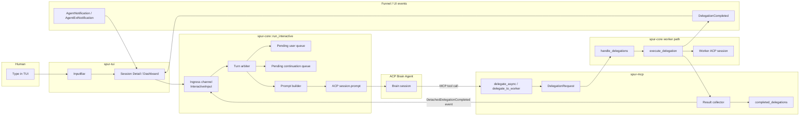

# Brain Async Continuation Scheduling — Design

**Status:** design (rev 2, 2026-04-19 L9 code-grounded review applied)
**Date:** 2026-04-19
**Reference specs:**
- `docs/superpowers/specs/2026-04-19-brain-worker-integration-invariants.md`
- `docs/superpowers/specs/2026-04-15-brain-delegation-framework-design.md`
- `docs/superpowers/specs/2026-04-14-brain-worker-refinement-design.md`
- ACP Prompt Turn: <https://agentclientprotocol.com/protocol/prompt-turn>
- ACP Content: <https://agentclientprotocol.com/protocol/content>
- ACP Extensibility: <https://agentclientprotocol.com/protocol/extensibility>

**Area:** `spur-core` orchestrator scheduler · `spur-mcp` detached delegation completion · `spur-acp` ACP prompt integration · `spur-tui` event visibility
**Anchor files:** `crates/spur-core/src/orchestrator.rs`, `crates/spur-mcp/src/server.rs`, `crates/spur-acp/src/connection/mod.rs`, `crates/spur-acp/src/connection/native.rs`, `crates/spur-tui/src/components/input_bar.rs`

## Grounding (rev 2)

Verified against current code:

| Claim | Evidence |
|---|---|
| `run_interactive` owns `pending_messages` as `VecDeque<InteractiveInput>` | `orchestrator.rs:748` |
| Sole `prompt()` call site for the active brain | `orchestrator.rs:1156` |
| Ingress is `mpsc::channel::<InteractiveInput>(32)` | `spur-cli/main.rs:466` |
| MCP has no path into `user_input_rx` today | `spur-mcp/src/server.rs` writes only `delegation_tx` + `completed_delegations` |
| Turn serialization is implicit via sequential `await` | inner `select!` at `orchestrator.rs:1212` runs until `stream.next() → None` at `:1253` |
| `AgentConnection::notify_ext` **does not exist** — optional refinement is net-new trait method | `spur-acp/src/connection/mod.rs:68–227` (has `call_ext` + `take_ext_notification_rx`, no outbound notify) |
| `InteractiveInput` has 11 existing variants | `orchestrator.rs:134–193` |

Verified against ACP spec:

- Turn ends at `stopReason`; model-visible continuation requires a **new** `session/prompt`. Fully supported.
- `ContentBlock::Resource` is the canonical structured-context carrier. Fully supported.
- `_meta` is a type-level metadata slot; `_vendor` is **not** an ACP term (only `_meta` + underscore-prefixed methods/notifications are defined). Partially supported — this spec avoids `_vendor/...` outside the optional notification section.
- Client→agent custom notifications are additive; agents `SHOULD ignore unrecognized notifications` — they cannot be the reasoning path.
- ACP is **silent** on intra-session prompt concurrency. SPUR must enforce serialization itself (see INV-C6).

## Problem

SPUR now has two materially different delegation outcomes:

1. **Inline delegation completion** where the worker finishes before the MCP block timeout and the brain receives the `DelegationResult` inside the same ACP prompt turn.
2. **Detached async completion** where the worker outlives the MCP block timeout or the brain intentionally uses `delegate_async`, and the result lands later in `completed_delegations`.

The inline case is semantically clean: the worker result is a tool result inside the current brain turn.

The detached case is not. Once the original tool call already returned a `delegation_id`, the worker completion is no longer part of the original ACP turn. It becomes a **new external event**. Today SPUR exposes that event honestly for polling, but it has no principled design for how that event should become visible to the brain again when autonomous progress is desired.

The tempting shortcut is wrong:

- do **not** route detached worker completion through `input_bar.rs`
- do **not** enqueue it as a fake `InteractiveInput::Message`
- do **not** let `spur-mcp` call `prompt()` directly on the brain connection

Those shortcuts collapse three distinct semantics into one path:

1. human foreground input
2. ACP tool/result flow
3. orchestrator-owned continuation events

That collapse creates ambiguity in transcript semantics, priority handling, cancellation, future message-id support, and turn ordering.

## Goals

1. **Preserve ACP truthfulness.** Detached worker completion must not masquerade as user input.
2. **Keep one turn arbiter.** A single orchestrator owner must decide when the brain may receive a new `session/prompt`.
3. **Prioritize the human.** User input must outrank background continuation work.
4. **Allow auto-resume when safe.** If the brain is idle and no human prompt is queued, SPUR may create a continuation turn automatically.
5. **Keep UI and model context separate.** Funnel/TUI events should update immediately even when no new brain prompt is issued.
6. **Fit current layering.** `spur-mcp` reports completion, `spur-core` schedules turns, `spur-acp` carries ACP traffic.

## Non-goals

- Rewriting ACP semantics so detached completion looks like continuation inside the original prompt turn.
- Using ACP vendor extensions as the only model-visible resume mechanism.
- Changing `delegate_async` to block.
- Implementing message editing or full provenance-aware transcript rendering in this spec.
- Worker-to-worker nested continuation logic.
- Replacing `wait_delegation` / `check_delegation_status`; polling remains valid and honest.

## Executive Summary

The correct model is a **three-lane architecture**:

1. **User lane**: TUI input becomes `InteractiveInput::Message` and eventually ACP `session/prompt`.
2. **Tool lane**: inline worker completion stays inside the original MCP tool/result path.
3. **Continuation lane**: detached completion becomes an orchestrator-owned `SystemContinuation` event, buffered until the scheduler decides it can safely materialize into a new ACP prompt turn.

The scheduler must live in `run_interactive`, because that loop already owns:

- the active brain session
- the only call site for `connection.prompt(...)`
- prompt-turn serialization
- cancellation behavior
- the current `pending_messages` queue

The MCP layer should **report** detached completion upward, not **schedule** it.

## Decision Table

| Option | Verdict | Why |
|---|---|---|
| Fake `InteractiveInput::Message` | Reject | Reclassifies system events as user messages |
| ACP ext notification only | Reject | Useful side channel, but not standard model-visible context |
| Poll-only forever | Acceptable fallback, not ideal | Honest but no autonomous liveness |
| Orchestrator-owned continuation queue + idle-only prompt scheduling | **Chosen** | Matches ACP, preserves priority, keeps layering clean |

## Current Grounding

### Current upstream brain prompt path

- `run_interactive` owns `pending_messages` and pops the next input before deciding whether to call `prompt()`.
- `InteractiveInput::Message` is flattened into `PromptRequest::new(...)`.
- While a turn is streaming, newly received messages are queued for later.

This means SPUR already has an implicit single-turn scheduler. The design in this doc makes that scheduler explicit rather than introducing a second competing owner.

### Current downstream detached completion path

- `delegate_to_worker` either returns inline worker results or, after timeout, returns text instructing the brain to poll with `delegation_id`.
- `delegate_async` immediately returns `delegation_id`.
- The detached result eventually reaches `completed_delegations`.

That is the right data boundary for async completion, but not the right scheduling boundary for brain resumption.

## Proposed Architecture

### High-level shape



### Key idea

The result collector pushes a **typed internal event** back to the orchestrator ingress, not a raw prompt. The orchestrator then decides:

1. emit UI/state events immediately
2. buffer model-visible continuation context
3. create a new ACP prompt turn only when safe

## Control Planes

### Upstream: ACP brain integration

The upstream contract is strict:

- ACP `session/prompt` is the standard way to send model-visible context.
- Detached worker completion is not part of the already-finished ACP turn.
- Therefore detached completion becomes model-visible only by:
  - a new prompt turn, or
  - explicit user-triggered polling inside a later turn

ACP custom `_vendor/...` notifications remain optional. They may be used for agent-side hooks or telemetry, but they do not replace the prompt turn for language-model reasoning.

### Downstream: worker completion integration

The downstream contract is:

- worker execution still ends in `DelegationResult`
- `DelegationCompleted` still hits the Funnel immediately for TUI/lineage visibility
- detached completion additionally emits an orchestrator-internal continuation event
- that event is brain-session-scoped and replay-safe

This keeps UI liveness separate from brain re-entry.

## Core Design

### 1. Add a typed continuation input

Add a new orchestrator-only input variant:

```rust
InteractiveInput::SystemContinuation {
    session: BrainSessionId,           // typed newtype from INV-2 fix
    continuation: BrainContinuation,
}
```

`BrainContinuation` holds a **projection** of the worker outcome, not the full
`DelegationResult`. This decouples the scheduler from `DelegationResult`
evolution and avoids re-allocating large diffs through the ingress channel.

```rust
pub struct DelegationId(pub Uuid);    // aligns with INV-1 typed correlation

pub enum ContinuationSource {
    AsyncRequested,    // originating call was delegate_async
    BlockTimeout,      // delegate_to_worker exceeded MCP block window
    Cancelled,         // post-INV-6: worker reached Cancelled terminal state
    PlanCompleted,     // post-INV-7: PlanCompleted event
    PlanReadyToMerge,  // post-INV-7: PlanReadyToMerge event
}

pub struct BrainContinuation {
    pub delegation_id: DelegationId,
    pub source:        ContinuationSource,
    pub payload:       ContinuationPayload,
    pub created_at:    Instant,        // monotonic; not persisted across restart
}

pub struct ContinuationPayload {
    pub status:        DelegationStatus,
    pub summary:       Option<String>,
    pub diff_summary:  Option<DiffSummary>,
    pub worker_branch: Option<String>,
}
```

This is intentionally **not** `InteractiveInput::Message`. Field shape is
narrow by design — scheduler code never needs a full `DelegationResult`.

Persistence-across-restart is **out of scope** for v1 (see Failure Cases);
`Instant` is correct for in-process lifetime only. If cross-restart
persistence is ever added, migrate `created_at` to `SystemTime` at that
point rather than pre-baking it now.

### 2. Keep one scheduler owner — extract `BrainScheduler`

`run_interactive` remains the only code path that calls
`brain.connection.prompt(...)` — but the scheduling policy is extracted
into a dedicated `BrainScheduler` struct. This keeps the 2000-line
`run_interactive` from absorbing continuation policy inline, and lets
the policy be unit- and property-tested without a tokio runtime.

```rust
pub struct BrainScheduler {
    pending_user:          VecDeque<InteractiveInput>,
    pending_continuations: VecDeque<BrainContinuation>,
    delivered_ids:         HashSet<DelegationId>,   // dedup (INV-C idempotency)
    active_session:        Option<BrainSessionId>,  // G2: session-swap guard
    turn_in_flight:        bool,
    cancel_grace_until:    Option<Instant>,         // G5: post-cancel grace
}

pub enum ScheduledAction {
    UserPrompt(InteractiveInput),
    ContinuationPrompt(Vec<BrainContinuation>),         // autonomous turn
    MergedPrompt { user: InteractiveInput,
                   continuations: Vec<BrainContinuation> },
    Idle,
}

impl BrainScheduler {
    pub fn push_user(&mut self, input: InteractiveInput) { ... }
    pub fn push_continuation(&mut self, c: BrainContinuation) { ... } // idempotent on delivered_ids
    pub fn note_turn_started(&mut self) { ... }
    pub fn note_turn_finished(&mut self) { ... }
    pub fn note_cancel_started(&mut self, now: Instant) { ... }       // sets cancel_grace_until
    pub fn note_session_swap(&mut self, new_sid: Option<BrainSessionId>) -> Vec<BrainContinuation> {
        // G2: drop continuations tagged for the prior session, return them for audit emission
    }
    pub fn next(&mut self, now: Instant) -> ScheduledAction { ... }   // pure sync, property-testable
}
```

`run_interactive` owns exactly one `BrainScheduler`. All prior `pending_messages`
uses migrate onto `BrainScheduler::push_user`. No background task may call
`prompt()` directly.

### 3. Distinguish ingress from storage + handle backpressure

The ingress channel stays unified as a **single** `mpsc::Receiver<InteractiveInput>` —
one instrumentation point, single drop-in test fixture, preserves observable
FIFO ordering for auditing. The scheduler's internal storage is split
(`pending_user` / `pending_continuations`) so policy can diverge at
dequeue time:

- FIFO within each lane
- human priority over background continuations
- coalescing of multiple detached completions

#### G3 — Backpressure on the unified `mpsc(32)` ingress

The current ingress is bounded at 32 (`spur-cli/main.rs:466`). If 33+
detached results land concurrently (e.g. `delegate_parallel` of 40 items
finishing during a disconnect), `continuation_tx.send(...).await` from
the MCP result-collector task would block, which in turn delays inserts
into `completed_delegations` — polling brains then observe a ghost stall.

**Rule:** the MCP result collector MUST use `try_send` for
`SystemContinuation`. On `Err(TrySendError::Full)`, the collector
publishes the continuation to an orchestrator-owned overflow deque
(`overflow_continuations: Arc<Mutex<VecDeque<BrainContinuation>>>`)
drained on the scheduler's next tick via a `tokio::time::interval` or
drained opportunistically after each turn completion. The user lane
keeps `send().await` semantics unchanged — human input still applies
natural backpressure.

This keeps the "single ingress" aesthetic while preventing the
MCP→orchestrator hand-off from ever being the blocking party for
`completed_delegations` consistency.

### 4. Materialize continuation only when idle

The scheduler may issue an autonomous continuation prompt only if:

1. the brain session exists
2. no prompt turn is currently streaming
3. no cancel is draining
4. no queued user message predates the continuation
5. **G5**: `cancel_grace_until` has elapsed (`now >= cancel_grace_until`)

If any of those conditions fail, buffer the continuation.

#### G5 — Post-cancel grace window

When `CancelStream` resolves, the scheduler sets
`cancel_grace_until = now + CANCEL_GRACE` (default **750 ms**, tunable
via `SPUR_CANCEL_GRACE_MS`). During the grace window:

- continuation-only autonomous turns do NOT fire
- a user prompt arriving during the grace window fires immediately and
  CLEARS the grace (user intent trumps grace)
- continuations already queued accumulate; they materialize after grace
  (autonomous) or merge (next user turn), whichever happens first

Rationale: without a grace window, a user who cancels typically wants
to type a replacement prompt; firing an autonomous continuation in the
sub-hundred-millisecond gap between cancel resolution and the user's
first keystroke races the human and feels hostile.

### 5. Merge with the next user turn when appropriate

If a user prompt arrives before the continuation fires, do not create
a separate autonomous turn. Instead:

- preserve the user's blocks as the foreground request, **unmodified**
- attach continuation context as structured background blocks that are
  **self-describing** (see INV-C7 / G1)
- respect a **per-turn merge byte budget** (G10, default 4 KB, tunable
  via `SPUR_MERGE_BUDGET_BYTES`); oldest continuations deliver first,
  overflow spills to the next turn
- send one ACP prompt turn

This preserves user priority, makes SPUR-injected content recognizable
on the ACP wire, and avoids starvation of async completion context.

#### Continuation terminal states (G11)

```
Queued ──(materialized as autonomous turn)──► Delivered ─► evicted
   │
   ├───(merged into a user turn up to budget)──► Delivered ─► evicted
   │
   ├───(session swap / disconnect / shutdown)──► Dropped  ─► ContinuationDropped event
   │
   └───(duplicate push by delegation_id)──────► NoOp      (idempotent)
```

Any `Delivered` or `Dropped` transition removes the continuation from
`pending_continuations` and records `delivered_ids.insert(delegation_id)`
so late duplicates are no-ops (INV-C5).

## Sequence: Worker Completes While Brain Is Busy

```mermaid
sequenceDiagram
    participant User
    participant TUI
    participant Orch as Orchestrator Scheduler
    participant Brain as ACP Brain
    participant MCP as spur-mcp
    participant Worker as Worker

    User->>TUI: Send prompt A
    TUI->>Orch: InteractiveInput::Message
    Orch->>Brain: session/prompt(prompt A)
    Note over Orch,Brain: Turn A is in flight

    Brain->>MCP: delegate_async(...)
    MCP->>Worker: DelegationRequest
    MCP-->>Brain: delegation_id

    User->>TUI: Send prompt B
    TUI->>Orch: InteractiveInput::Message
    Note over Orch: Queue prompt B behind active turn

    Worker-->>MCP: DelegationResult
    MCP->>Orch: InteractiveInput::SystemContinuation
    Note over Orch: Queue continuation; do not preempt active turn

    Brain-->>Orch: Turn A completes
    Note over Orch: User queue is non-empty, so user wins
    Orch->>Brain: session/prompt(prompt B + continuation context)
```

## Prompt Construction Rules

All prompt construction must satisfy INV-C7 (self-describing merged turns):
any SPUR-injected block must be recognizable as SPUR-injected from its
content alone, because ACP carries no provenance metadata per block — every
block in a single `session/prompt` call is "the client's prompt" from the
agent's perspective. Omitting self-description recreates the "fake
Message" footgun on the ACP wire after avoiding it in Rust.

### Continuation-only autonomous turn

When the scheduler fires an autonomous continuation turn, the prompt
contains, in order:

1. a leading `ContentBlock::Text` **marker block** (one line):
   `[SPUR:background] Detached delegation completed after tool call returned.`
2. one or more `ContentBlock::Resource` blocks with URI
   `spur://continuation/{delegation_id}` carrying structured continuation
   data (see candidates below)
3. a trailing `ContentBlock::Text` action hint:
   `Review the result and decide the next action.`

Example logical payload:

```text
[SPUR:background] Detached delegation completed after tool call returned.
<resource spur://continuation/01HW.../ ...>
Review the result and decide the next action.
```

Resource payload candidates (stored inside the resource block body,
typically as JSON with a well-known MIME type):

- `delegation_id`
- `source`
- `status`
- `summary`
- `diff_summary`
- `worker_branch`

### User-turn merge

When merging into a user turn the wire order is fixed:

1. **User-authored blocks first, byte-exact** — never modified, never
   re-ordered, never wrapped.
2. One `ContentBlock::Text` separator:
   `[SPUR:background] The following blocks were injected by SPUR, not authored by the user.`
3. One or more self-describing `ContentBlock::Resource` blocks with URI
   `spur://continuation/{delegation_id}` (same shape as the
   autonomous-turn case).

Total injected bytes (including the separator) MUST respect the
per-turn merge budget from §5.

Do **not** use `_meta` as the primary context carrier. `_meta` is a
type-level metadata slot in ACP; content for model reasoning belongs
in blocks. `_meta` may be used for out-of-band correlation (e.g.
tagging a prompt turn with a `spur_continuation_count`) but never
replaces the in-content marker.

ACP content guidance makes `resource` blocks the preferred structured
context vehicle.

## Priority and Fairness Rules

1. **User messages outrank continuations.**
2. **Continuation events never interrupt an active turn.**
3. **`CancelStream` outranks both user messages and continuations while a turn is active.**
4. **Multiple continuations may be coalesced into one prompt if no user work is waiting.**
5. **A continuation must be idempotent by `delegation_id`; duplicate enqueue must not cause duplicate brain turns.**
6. **Post-cancel grace (G5)**: autonomous continuation turns do NOT fire within the `cancel_grace_until` window. A user prompt arriving during grace fires immediately and clears grace.
7. **Merge budget (G10)**: per-user-turn injection is bounded (default 4 KB). Excess continuations spill to the next scheduling decision.
8. **Terminal delivery (G11)**: a continuation is evicted on `Delivered` (autonomous or merged) or `Dropped`. No continuation is ever delivered twice.
9. **Session-scoped (G2)**: a continuation tagged for `BrainSessionId` A is never materialized against session B; on session swap it transitions to `Dropped` and emits `ContinuationDropped { reason: SessionSwap }`.

## Invariants

### INV-C1 — Only one code path may call `prompt()` for the brain

`run_interactive` remains the only place that initiates an ACP prompt
turn for the active brain session. Currently upheld by accident of
topology (single call site at `orchestrator.rs:1156`); v1 keeps this
textual with a CI grep-lint (forbid `\.prompt\(` outside
`orchestrator.rs`'s `run_interactive`). Follow-up: wrap the brain's
`AgentConnection` in a `PromptGate` typestate owned only by
`BrainScheduler` so the invariant becomes compile-time.

### INV-C2 — Detached completion never enters the user lane as `Message`

System continuation must remain typed as system-owned input for
transcript and policy correctness. CI grep-lint: only
`spur-tui/src/components/input_bar.rs` and the TUI→core translation
task in `spur-cli/main.rs` may construct `InteractiveInput::Message`.

### INV-C3 — UI visibility is immediate, model visibility is scheduled

`DelegationCompleted` and related funnel events emit as soon as the
worker finishes. Brain re-entry may happen later.

**Enforcement (G6):** every detached-completion hand-off routes
through a single helper:

```rust
async fn report_detached_completion(
    funnel: &FunnelHandle,
    continuation_tx: &mpsc::Sender<InteractiveInput>,
    overflow: &Arc<Mutex<VecDeque<BrainContinuation>>>,
    session: BrainSessionId,
    cont: BrainContinuation,
) {
    // 1) UI-visible event FIRST — synchronous funnel emit
    funnel.emit(SpurEventBody::DelegationCompleted { /* ... */ });
    // 2) model-visible continuation SECOND — try_send, overflow fallback (G3)
    let input = InteractiveInput::SystemContinuation { session, continuation: cont.clone() };
    if let Err(TrySendError::Full(_)) = continuation_tx.try_send(input) {
        overflow.lock().await.push_back(cont);
    }
}
```

No other code path may send a `SystemContinuation`. The MCP result
collector calls this helper exactly once per detached completion.

### INV-C4 — Human intent dominates autonomous progress

If a user prompt is already queued, continuations must merge or wait;
they may not leapfrog the user.

### INV-C5 — MCP reports, orchestrator decides

`spur-mcp` owns completion detection and persistence, not ACP prompt
scheduling.

### INV-C6 — At most one `session/prompt` in flight per brain session

ACP is silent on intra-session prompt concurrency. SPUR enforces
strict serialization: `BrainScheduler.turn_in_flight` is set via
`note_turn_started()` before `connection.prompt(...)` is called and
cleared via `note_turn_finished()` only after the stream fully drains
(or is cancelled). `next()` returns `Idle` whenever `turn_in_flight`
is true.

### INV-C7 — Merged turns are self-describing on the ACP wire

Any continuation block injected into a user-originating turn carries
an in-content marker (`[SPUR:background]` text block separator +
`spur://continuation/{id}` resource URI) so the brain cannot confuse
SPUR-injected context with user-authored input. Enforcement is at
the prompt-builder helper — a single construction site, unit-tested
with snapshot tests against fixture inputs.

## Layering Changes

### `spur-mcp`

Responsibilities:

- continue storing detached results in `completed_delegations`
- emit an orchestrator-facing completion signal for detached completions
- remain agnostic about ACP prompt scheduling

Should not:

- own idle detection
- inspect TUI state
- call `prompt()` on the brain

### `spur-core`

Responsibilities:

- define `BrainContinuation`
- add `InteractiveInput::SystemContinuation`
- own scheduling policy
- build continuation prompt blocks
- coalesce or merge continuations with user input

### `spur-acp`

Responsibilities:

- continue using `PromptRequest` for model-visible continuation turns
- optionally add a client -> agent ext-notification helper for `_spur/...` notifications

The ext-notification helper is optional because ACP ext notifications are not the primary reasoning channel.

### `spur-tui`

Responsibilities:

- no fake typing path for continuation
- continue rendering Funnel events immediately
- optionally show pending-background-continuation status in the future

This spec does not require new TUI controls.

## Optional ACP Extension Hook

An optional refinement is to add:

```rust
AgentConnection::notify_ext(method, params)
```

to expose ACP client -> agent extension notifications. This can support agent-specific hooks such as:

- `_spur/delegation_finished`
- `_spur/background_context_available`

But the hook is additive only. The canonical model-visible path remains `session/prompt`.

## Failure Cases

### Brain disconnected before continuation fires

- transition continuation to `Dropped` and emit
  `SpurEventBody::ContinuationDropped { delegation_id, reason: BrainDisconnected }`
- v1: do NOT persist across restart — the `delegation_id` result
  remains in `completed_delegations` (TTL-evicted) and the brain can
  recover via `wait_delegation` / `check_delegation_status` on resume
- never replay blindly into a fresh unrelated brain session

### Brain session swap (G2)

When `NewSessionWithMessage` / `ResumeSession` (see
`orchestrator.rs:1305–1321`) tears down brain A and constructs brain
B, `BrainScheduler::note_session_swap(Some(B_id))` is invoked:

- all continuations with `session != B_id` transition to `Dropped`
- each drop emits `ContinuationDropped { reason: SessionSwap }`
- `active_session` is updated to `Some(B_id)`

This is the sole mechanism preventing a cross-brain provenance
violation. It is **not** optional — every session swap site must
invoke it.

### User sends multiple prompts while many workers complete

- user queue drains first (INV-C4)
- continuations coalesce into the next user turn respecting the
  merge budget (G10, §5 + Priority rule 7)
- budget overflow: oldest-first delivery; remainder stays queued
  (explicit, documented, stable ordering — not accidental)

### Duplicate completion event

- de-duplicate by `delegation_id` via `delivered_ids: HashSet<DelegationId>`
- duplicate `push_continuation` call is a no-op; no funnel event

### Completion arrives during cancel drain

- buffer until cancel completes (INV-C4 + Priority rule 2)
- scheduler sets `cancel_grace_until` after cancel resolution
  (Priority rule 6 / G5)
- do not mix cancellation teardown with autonomous prompt creation

### Completion for a worker that was itself cancelled (INV-6 interaction)

Once INV-6 lands (honest `cancel_delegation`), cancelled workers
produce `DelegationStatus::Cancelled` terminals. These are still
valid continuation sources (`ContinuationSource::Cancelled`) — the
brain may want to know "the worker I asked you to cancel is now
actually cancelled, decide next action". Scheduler treats them
identically to any other continuation.

## Implementation Sketch

1. Add `DelegationId`, `BrainSessionId` newtypes (land via INV-2 fix first).
2. Add `BrainContinuation`, `ContinuationPayload`, `ContinuationSource` types in `spur-acp` domain.
3. Add `InteractiveInput::SystemContinuation { session, continuation }` variant.
4. Extract `BrainScheduler` struct with pure-sync `next()`.
5. Add `report_detached_completion` helper (INV-C3 enforcement).
6. Route detached completion from the MCP result-collector boundary through the helper.
7. Wire overflow deque for `try_send` backpressure (G3).
8. Add prompt-builder helpers `render_autonomous_continuation_turn(...)` and `render_merged_turn(...)`, both producing self-describing block sequences (INV-C7).
9. Wire `BrainScheduler::note_session_swap` into every session-swap site (G2).
10. Keep Funnel emission unchanged for immediate UI visibility.
11. Add `SpurEventBody::ContinuationDropped { delegation_id, reason }` variant.
12. Add CI grep-lints for INV-C1 / INV-C2 site restrictions.

## Cross-spec Dependency Ordering

Implement this spec **after** the following sibling-spec fixes land, in
order:

1. **INV-2 (typed `BrainSessionId`)** — `BrainContinuation.session` uses it from day 1.
2. **INV-1 (typed `DelegationId` correlation)** — in parallel with INV-2; `BrainContinuation.delegation_id` uses it.
3. **INV-6 (honest `cancel_delegation`)** — the scheduler's `ContinuationSource::Cancelled` variant requires a real Cancelled terminal status.

INV-7 (push terminal states) composes with this spec: once landed,
`PlanCompleted` / `PlanReadyToMerge` feed into
`ContinuationSource::PlanCompleted` / `PlanReadyToMerge`. No hard
ordering dependency — additive.

## Testing

`BrainScheduler::next()` is pure sync. Unit and property tests run
with a hand-supplied `now: Instant` — no tokio runtime required.

### Unit

- continuation enqueue/dequeue policy (FIFO within each lane)
- de-dup by `delegation_id` — second `push_continuation` for same id is no-op
- merge policy when user input arrives before idle continuation fires
- coalescing logic for multiple completions
- merge byte budget (G10) — excess spills to next turn, oldest-first
- post-cancel grace window (G5) — autonomous turn suppressed during grace
- grace cleared when user prompt arrives during window
- session swap (G2) — continuations for prior `BrainSessionId` evicted, `Dropped` emitted
- `ContinuationSource` variants exhaustive (compile-time via `#[deny(non_exhaustive_omitted_patterns)]`)
- `render_autonomous_continuation_turn` snapshot — fixed payload → byte-identical block sequence with marker + resource URI
- `render_merged_turn` snapshot — user blocks byte-exact first, separator, resource blocks
- `report_detached_completion` ordering — funnel emit precedes `continuation_tx.send`

### Property

`proptest` harness over arbitrary interleavings of `(PushUser, PushContinuation, TurnStart, TurnEnd, CancelStart, CancelResolve, SessionSwap)` events against `BrainScheduler::next()`:

- INV-C4: for every sequence, if a user input is pending at scheduling time, the next action is `UserPrompt` or `MergedPrompt`, never `ContinuationPrompt`.
- INV-C5: a `delegation_id` never appears in two scheduled actions.
- INV-C6: `turn_in_flight == true` ⇒ `next()` returns `Idle`.
- Terminal delivery: every pushed continuation reaches `Delivered` or `Dropped` eventually (modulo shutdown).

### Integration

- `delegate_async` completion while idle triggers exactly one new prompt turn (via `report_detached_completion`).
- `delegate_async` completion while the brain is streaming does not preempt the active turn.
- queued user prompt outranks queued continuation.
- `DelegationCompleted` visible immediately even when no prompt is sent yet.
- duplicate detached result does not produce duplicate continuation turns.
- **Ordering (INV-C3)**: integration harness subscribes to the funnel before sending a completion; asserts `DelegationCompleted` is observed BEFORE the brain receives any `session/prompt` containing the continuation marker.
- **Backpressure (G3)**: flood 100 concurrent completions; assert `completed_delegations` inserts are not stalled by a full ingress channel; overflow deque drains on next tick.
- **Session swap (G2)**: push continuation tagged for session A, swap to session B, assert B never receives A's continuation and `ContinuationDropped { reason: SessionSwap }` is emitted.
- **Self-describing merged turn (INV-C7)**: user prompt + pending continuation → the `session/prompt` payload contains the user's text block byte-exact at position 0, a `[SPUR:background]` separator, and a `spur://continuation/{id}` resource URI.

## Why This Design Is Better Than the Shortcut

Because it respects the actual boundaries:

- ACP turn boundaries (new `session/prompt` per continuation)
- human-vs-system provenance (typed `SystemContinuation`, self-describing
  blocks on the ACP wire per INV-C7)
- MCP callback server layering (reports, does not schedule)
- orchestrator queue ownership (`BrainScheduler` as single policy owner)
- immediate UI state vs deferred model context (INV-C3 ordering
  enforced by a single helper)
- bounded-channel backpressure (G3 overflow deque — MCP never blocks
  `completed_delegations` hygiene on ingress capacity)
- cross-brain-session safety (G2 session-swap eviction)
- human friendliness after cancel (G5 grace window)

It is slightly more machinery than pushing fake text through the input
bar, but that shortcut is a semantic footgun both in Rust (via
`InteractiveInput::Message` misuse) AND on the ACP wire (blocks the
agent cannot distinguish from user input). This design closes both
footguns. The scheduler extraction (`BrainScheduler` with pure-sync
`next()`) also keeps the 2000-line `run_interactive` from absorbing
policy inline and makes the whole thing property-testable.

## Changelog

**rev 2 (2026-04-19)** — L9 code-grounded review applied:
- Added Grounding table (code + ACP citations).
- Added INV-C6 (single prompt in flight) and INV-C7 (self-describing merged turns).
- Split `BrainContinuation` into narrow `ContinuationPayload` projection; typed `DelegationId` + `BrainSessionId`.
- Expanded `ContinuationSource` (`AsyncRequested`, `BlockTimeout`, `Cancelled`, `PlanCompleted`, `PlanReadyToMerge`).
- Added `BrainScheduler` struct with pure-sync `next()` + `ScheduledAction` enum.
- Specified `report_detached_completion` helper as the sole continuation hand-off site (enforces INV-C3).
- Added G3 backpressure design (`try_send` + overflow deque).
- Added G5 post-cancel grace window.
- Added G10 per-turn merge byte budget.
- Added G11 explicit continuation terminal states.
- Added G2 session-swap eviction (`note_session_swap` / `ContinuationDropped`).
- Made prompt construction rules self-describing (INV-C7) with `[SPUR:background]` marker + `spur://continuation/{id}` URI.
- Added property-test harness for scheduler invariants.
- Added cross-spec dependency ordering (INV-1/2/6 before this spec).
