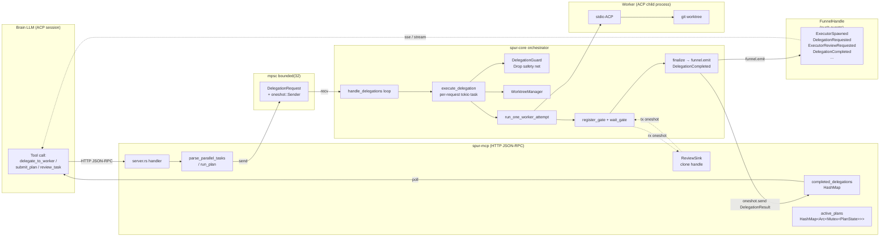
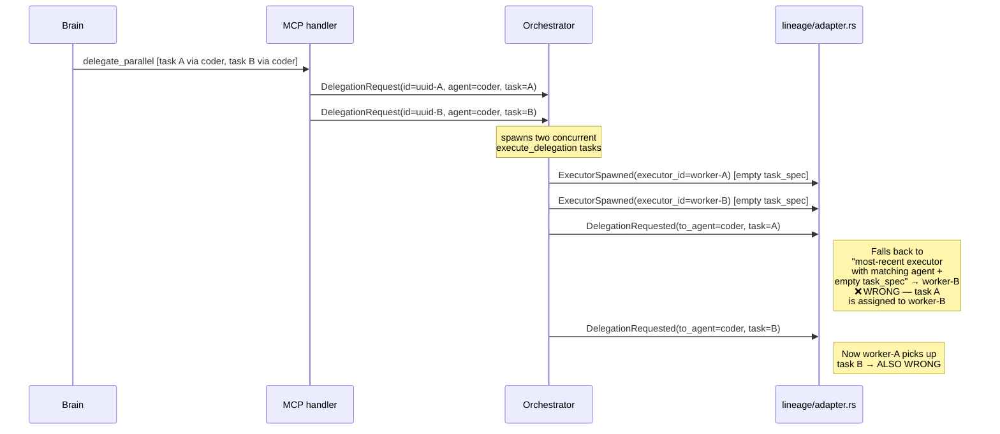
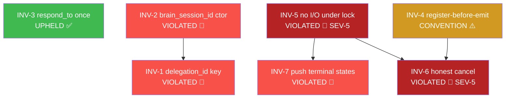

# Brain ↔ Worker Integration — 7 Hard Invariants

**Date:** 2026-04-19
**Scope:** End-to-end control/data flow between the brain LLM (via MCP tools)
and worker agents (via the orchestrator + ACP).
**Anchor files:** `crates/spur-mcp/src/tools.rs`,
`crates/spur-mcp/src/server.rs`, `crates/spur-mcp/src/plan.rs`,
`crates/spur-core/src/orchestrator.rs`,
`crates/spur-core/src/lineage/adapter.rs`.
**Method:** first-principles + MCTS multi-round evaluation (8 rounds),
per-invariant grounded against real code with line citations.

---

## Executive Summary

The integration has **three irreducible data movements**:

1. **COMMAND** — brain → orchestrator (intent + plan + constraints)
2. **STATE** — orchestrator → brain (status, diffs, review gates)
3. **DECISION** — brain → orchestrator (approve / reject / request_changes / cancel)

The mechanism is sound: an `mpsc::channel::<DelegationRequest>(32)` for commands,
with an embedded `oneshot::Sender<DelegationResult>` as each command's private
return channel, and a `FunnelHandle` for push events. **The semantics, however,
depend on seven invariants** — of which four are currently violated and one
is upheld only by textual convention.

| # | Invariant | Status | Severity | Key site |
|---|---|---|---|---|
| INV-1 | `delegation_id` is the sole correlation key | **VIOLATED** | 3 / 5 | `lineage/adapter.rs:108-115` |
| INV-2 | `brain_session_id` is a constructor invariant | **VIOLATED** (contained) | 4 / 5 | `server.rs:234` |
| INV-3 | `respond_to` fires exactly once | **UPHELD** | n/a | `orchestrator.rs:2552-2572 + 3269-3297` |
| INV-4 | Review gate registered before event emitted | **CONVENTION** (fragile) | 2 / 5 | `orchestrator.rs:2768 → 2838` |
| INV-5 | No async I/O under plan / review locks | **VIOLATED** | 5 / 5 | `plan.rs:1013-1038` |
| INV-6 | `cancel_delegation` is honest | **VIOLATED** (stub) | 5 / 5 | `orchestrator.rs:2621-2637` |
| INV-7 | Terminal states are pushed, not polled | **VIOLATED** | 3 / 5 | `plan.rs:666-684` |

---

## Architecture Overview

Before diving into each invariant, the full command/state/decision topology:



Legend: solid edges = command/result path, dotted edges = event / review feedback.

---

## INV-1 — `delegation_id` is the sole correlation key

### Statement

Every `Delegation` has a stable, unique `delegation_id` (UUID v4). Lineage,
events, review gates, and beads correlation MUST key on `delegation_id` (or
derived `ExecutorId`). **The agent name and task-spec emptiness heuristic
MUST NOT be used as a correlation key.**

### Why it matters

The orchestrator can have two concurrent delegations to the same worker agent
(e.g. `coder` × 2 via `delegate_parallel`). If lineage assigns the
`DelegationRequested.task` to the "most-recent executor with matching agent
name", two concurrent coders will silently cross-assign their task_specs
when events arrive out of order. Debugging a wrong attribution is
nearly impossible.

### Diagram — current (violating) behavior



### Simple example

Two concurrent coder workers are started, one to "fix login CSS" and one to
"add rate-limiter to /auth". The lineage UI will show them with their tasks
swapped — the login-CSS worker appears to be working on the rate-limiter
and vice versa. The events themselves (DelegationCompleted, diff) are
correctly keyed by `worker_session` (an ExecutorId), so the diffs land on
the right nodes — but the `task_spec` descriptor is wrong. A reviewer
looking at the dashboard sees an impossible pairing.

### Code cross-check

The request has a correct stable id — `plan.rs:566` (for plan tasks) and
`server.rs:229` (for parallel tasks):

```rust
// plan.rs:566
let delegation_id = uuid::Uuid::new_v4().to_string();
entry.status = PlanTaskStatus::Dispatched {
    delegation_id: delegation_id.clone(),
};
```

It flows into `DelegationRequest { id, ... }` at `plan.rs:579`
and is destructured in the orchestrator at `orchestrator.rs:2408`:

```rust
// orchestrator.rs:2405-2416
while let Some(request) = channel.request_rx.recv().await {
    let DelegationRequest {
        id: request_id,
        agent,
        ...
    } = request;
```

**But** the lineage adapter does NOT use `request_id` for correlation.
At `lineage/adapter.rs:108-115`:

```rust
// lineage/adapter.rs:101-115 (comment + code)
// Known v1 limitation: `DelegationRequested` carries `from` (brain
// session) and `to_agent` (agent name) but not the worker session
// id. If two workers share an agent name with empty task_specs,
// the most-recent one wins. Acceptable for v1 because ...
let id = lineage
    .nodes_mut_vec()
    .into_iter()
    .rev()
    .find(|n| {
        n.role == Role::Executor && n.agent == *to_agent && n.task_spec.is_empty()
    })
    .map(|n| n.id.clone());
```

The problem is acknowledged in the comment (lines 101-107) and the
follow-up is planned ("switch the orchestrator to emit `ExecutorSpawned`
directly with task_spec populated"). This is the right fix: include
`request_id` and `task_spec` in `ExecutorSpawned`, and key everything
downstream on that id.

### Status: **VIOLATED**, acknowledged in code, fix direction known.

---

## INV-2 — `brain_session_id` is a constructor invariant

### Statement

Every `DelegationRequest` MUST carry a valid `brain_session_id`. It MUST
NOT be defaultable to a fresh random UUID. The type system SHOULD prevent
construction without it.

### Why it matters

`brain_session_id` is the lineage anchor — every `DelegationRequested.from`
event uses it to attribute a delegation to the brain session that spawned
it. If it defaults to a random UUID, lineage either shows the delegation
as coming from a phantom session (no such brain session exists) or silently
falls back to "unknown". Debugging multi-brain deployments becomes impossible.

### Diagram — the two construction sites

```mermaid
flowchart TD
    subgraph Correct["Correct: single delegation path"]
        A1[handler: handle_delegate_to_worker]
        A2[DelegationRequest {<br/>brain_session_id: self.brain_session_id.clone&#40;&#41;<br/>}]
        A1 --> A2
    end

    subgraph Footgun["Footgun: parse_parallel_tasks"]
        B1[parse_parallel_tasks&#40;task_objects&#41;]
        B2[DelegationRequest {<br/>brain_session_id: SessionId::new&#40;&#41;<br/>&#x1F534; random UUID<br/>}]
        B3[handle_delegate_parallel caller<br/>MUST overwrite each skeleton's<br/>brain_session_id manually]
        B1 --> B2
        B2 --> B3
    end

    B3 -->|if forgotten| Orphan[Orphan session<br/>in lineage]
```

### Simple example

A developer adds a new MCP tool `dispatch_review_fanout` that reuses
`parse_parallel_tasks` to build skeleton requests. They forget the
"loop-and-overwrite-brain_session_id" fixup step (there is no compile-time
hint they need to do it). Every fanout delegation is now attributed to a
random session that doesn't exist. The lineage UI shows orphan nodes with
no parent brain session. Months later someone notices the graph is
disconnected.

### Code cross-check

`server.rs:228-237` — the skeleton construction:

```rust
// server.rs:227-237
let (tx, _rx) = tokio::sync::oneshot::channel();
out.push(DelegationRequest {
    id: uuid::Uuid::new_v4().to_string(),
    agent,
    task,
    context_files,
    respond_to: tx,
    brain_session_id: SessionId::new(),  // ← footgun default
    delegation_plan,
    issue_id,
});
```

Contrast with `plan.rs:579-588` — the correct site:

```rust
// plan.rs:579-588 (brain_sid read once at the top of run_plan)
let request = DelegationRequest {
    id: delegation_id,
    agent: task_spec.agent.clone(),
    task: task_spec.task.clone(),
    context_files: task_spec.context_files.clone(),
    respond_to: tx,
    brain_session_id: brain_sid.clone(),  // ← threaded from plan state
    delegation_plan: None,
    issue_id: task_spec.issue_id.clone(),
};
```

**Fix direction:** make `DelegationRequest` public construction go through
a builder that takes `brain_session_id: &SessionId` as a required argument,
OR introduce a newtype `BrainSessionId(SessionId)` with no `Default` impl
and change the struct field type. Then remove the `SessionId::new()` default
entirely — `parse_parallel_tasks` must accept `brain_session_id` as a
parameter.

### Status: **VIOLATED** (contained to one call site), ~30 LoC fix.

---

## INV-3 — `respond_to` fires exactly once

### Statement

For every `DelegationRequest` that enters the orchestrator, its
`respond_to: oneshot::Sender<DelegationResult>` is fulfilled **exactly
once** — via either the happy-path `disarm + send` or the Drop-based
fallback. It is never both, never neither, and never fulfilled twice.

### Why it matters

The brain's MCP handler is blocked (in `spawn_result_collector`) waiting
on `rx.await`. If the oneshot is dropped without a send, the handler gets
`Err(RecvError)` and must synthesize a "Orchestrator disconnected" result
— currently it does (`server.rs:502-511`). But if the orchestrator silently
drops the delegation with no explicit error path, debugging a missing
brain response requires reading two processes' logs. The single-fire
invariant is what makes the system diagnosable.

### Diagram — happy vs panic paths

```mermaid
stateDiagram-v2
    [*] --> Spawned: execute_delegation<br/>tokio::spawn
    Spawned --> WorkerRun: run_one_worker_attempt
    WorkerRun --> ReviewGate: review_required?
    WorkerRun --> HappyPath: no review
    ReviewGate --> HappyPath: decision received
    ReviewGate --> HappyPath: timeout → TimedOut

    HappyPath --> Disarm: guard.disarmed = true
    Disarm --> Send: respond_to.send&#40;result&#41;
    Send --> [*]: ✅ fired via happy path

    Spawned --> Panic: panic / abort
    WorkerRun --> Panic: panic / abort
    ReviewGate --> Panic: panic / abort
    Panic --> Drop: DelegationGuard::drop
    Drop --> DropSend: respond_to.take&#40;&#41;.send&#40;Failed&#41;
    DropSend --> [*]: ✅ fired via Drop fallback
```

### Simple example

The brain calls `delegate_to_worker`. Mid-worker-run, a panic fires inside
`run_one_worker_attempt` (say, an unexpected ACP protocol violation).
The spawned tokio task unwinds; `DelegationGuard::drop` observes
`disarmed == false`, emits `DelegationCompleted { status: Failed("delegation aborted") }`,
and calls `respond_to.send(Failed)`. The brain's `spawn_result_collector`
wakes with `Ok(Failed)` and stores it in `completed_delegations`. The brain's
blocked MCP handler polls `completed_delegations` within 250ms and returns
the `Failed` result. **One oneshot fire, one brain response, one lineage
event. The invariant holds across the panic.**

### Code cross-check

Happy path — `orchestrator.rs:2552-2572`:

```rust
// orchestrator.rs:2552-2572
// Normal path: disarm the guard and send result manually.
guard.disarmed = true;
let respond_to = guard.respond_to.take().unwrap();

if let Err(_returned_result) = respond_to.send(result) {
    // Brain's MCP tool call was cancelled — the oneshot
    // receiver was dropped before we could deliver the
    // result. If a review was still pending on this
    // delegation, emit an audit event so the lineage
    // projection records the abandonment rather than
    // leaving an orphaned review card indefinitely.
    if let Some(ref eid) = executor_id_opt {
        cleanup_cancelled_review(
            eid,
            "brain call cancelled",
            &funnel,
            &review_sink,
        )
        .await;
    }
}
```

Fallback path — `orchestrator.rs:3269-3297`:

```rust
// orchestrator.rs:3269-3297
impl Drop for DelegationGuard {
    fn drop(&mut self) {
        if self.disarmed {
            return;
        }
        error!(
            request_id = %self.request_id,
            "DelegationGuard fired — emitting DelegationCompleted(Failed)"
        );
        self.funnel.emit(SpurEventBody::DelegationCompleted {
            worker_session: SessionId(self.request_id.clone()),
            status: DelegationStatus::Failed {
                error: "delegation aborted (early exit or task cancelled)".into(),
            },
        });
        if let Some(tx) = self.respond_to.take() {
            let _ = tx.send(DelegationResult { ... });
        }
    }
}
```

The `disarmed` flag is the linearization point: set before the happy-path
send, so Drop cannot fire after. `respond_to: Option<...>` with
`take()` makes double-send impossible at the type level. The error-swallow
on `send` failure is recovered via `cleanup_cancelled_review` which at
least emits an audit event. **This invariant is well-designed.**

Minor smell: `SessionId(self.request_id.clone())` in Drop conflates
`request_id` and `worker_session`. It works because when the guard fires
early, no worker_session was ever created, so the request_id is the best
available handle. But it's a type pun worth documenting.

### Status: **UPHELD**. Keep the design.

---

## INV-4 — Review gate registered before event emitted

### Statement

A `ReviewSink` entry MUST be registered (via `register_gate`) BEFORE any
event that could reference it (`ExecutorReviewRequested`) is emitted on
the funnel. Otherwise the TUI or a review_task call can arrive for an
unregistered gate and be dropped.

### Why it matters

The TUI / brain sees `ExecutorReviewRequested` and submits a review
decision via `review_task`. That decision is routed through
`review_dispatcher_loop` → `ReviewSink.submit(executor_id)`. If the sink
has no entry for this `executor_id`, the submit silently fails. The
reviewer thinks they approved; the worker is still hanging on its
`rx.await`. Classic missed-wakeup bug.

### Diagram — the ordering contract

```mermaid
sequenceDiagram
    participant ED as execute_delegation
    participant RS as ReviewSink
    participant Funnel
    participant TUI as TUI / Brain
    participant RDL as review_dispatcher_loop

    Note over ED: ✅ CORRECT ORDER (current)
    ED->>RS: register_gate&#40;eid, attempt_n&#41;
    RS-->>ED: Ok&#40;rx&#41;
    ED->>Funnel: emit ExecutorReviewRequested
    Funnel-->>TUI: ReviewRequested
    TUI->>RDL: SubmitReview
    RDL->>RS: submit&#40;eid, decision&#41;
    RS-->>ED: rx resolves with decision

    Note over ED: ❌ BUG PATTERN (possible future site)
    ED->>Funnel: emit ExecutorReviewRequested
    Funnel-->>TUI: ReviewRequested
    TUI->>RDL: SubmitReview &#40;fast user&#41;
    RDL->>RS: submit&#40;eid, decision&#41;
    RS-->>RDL: Err&#40;not registered&#41; — DROPPED
    ED->>RS: register_gate&#40;eid, attempt_n&#41;
    RS-->>ED: Ok&#40;rx&#41;
    Note right of ED: rx never resolves<br/>worker hangs until<br/>review_timeout
```



### Simple example

A developer adds a new review kind — say, `ReviewKind::Security` — and
writes a new emission site in a different module. They copy the
`funnel.emit(ExecutorReviewRequested)` pattern but forget the
`register_gate` call that lives one scope up in the original site. In
dev everything works (the dev clicks approve after several seconds,
giving the gate time to register). In production with a fast reviewer,
the submit races the register and is silently dropped. Workers hang
until the 30-minute review timeout fires.

### Code cross-check

The ordering is currently correct — `orchestrator.rs:2765-2843`:

```rust
// orchestrator.rs:2765-2768
// Review gate: register FIRST, then emit events.
// `ReviewSink` requires register-before-emit so a TUI
// cannot race a `SubmitReview` past an unregistered sink.
let rx = match register_gate(eid.clone(), attempt_n, &review_sink).await {
    Ok(rx) => rx,
    ...
};

// orchestrator.rs:2838-2843
funnel.emit(SpurEventBody::ExecutorReviewRequested {
    id: eid.0.clone(),
    attempt_n,
    kind: ReviewKind::Completion,
    payload: review_payload,
});
```

And the invariant is documented in the helper — `orchestrator.rs:4143-4146`:

```rust
// MUST be called BEFORE emitting `ExecutorReviewRequested` so the TUI
// cannot race a `SubmitReview` past an unregistered sink — see
// `ReviewSink` docs for the invariant.
pub async fn register_gate(
    executor_id: ExecutorId,
    attempt_n: u32,
    review_sink: &ReviewSink,
) -> Result<tokio::sync::oneshot::Receiver<spur_acp::ReviewDecision>, ReviewSinkError>
```

**But the type system does NOT enforce this.** `funnel.emit(ExecutorReviewRequested { ... })`
is just a function call on `FunnelHandle`; nothing requires that a
`ReviewHandle` (from a successful registration) be in scope.

**Fix direction — typestate:**

```rust
// proposed shape, not current code
struct ReviewHandle { eid: ExecutorId, rx: oneshot::Receiver<ReviewDecision>, sink: ReviewSink }

impl ReviewHandle {
    // Only way to construct: successful registration.
    async fn register(eid: ExecutorId, attempt_n: u32, sink: ReviewSink) -> Result<Self, ReviewSinkError> { ... }

    // Only way to emit: through the handle.
    fn emit_requested(&self, funnel: &FunnelHandle, payload: ReviewPayload) { ... }

    async fn wait(self, timeout: Duration) -> DelegationStatus { ... }
}
```

This makes the ordering a compile-time property rather than a textual one.

### Status: **UPHELD by convention only.** One-site correctness, fragile to
future additions. ~80 LoC to typestate-ify.

---

## INV-5 — No async I/O under plan / review locks

### Statement

No async I/O operation (beads network call, git subprocess, ACP write)
executes while a `PlanState` mutex or a `ReviewSink` inner lock is held.
Clone-or-copy the required data, drop the lock, then await the I/O.

### Why it matters

`PlanState` is shared between `handle_review_task`, `handle_get_plan_status`,
`run_plan`'s completion handler, and `dispatch_newly_ready`. If
`handle_review_task` holds the lock while awaiting a beads network call,
then:

- Concurrent `get_plan_status` calls block for the entire network RTT
- Concurrent `review_task` calls on the same plan serialize on beads
- The TUI's poll thread hitches visibly
- Worst case: beads is slow (multi-second), and the plan becomes
  unresponsive to the brain

This is a textbook priority-inversion smell. The actual plan-state mutation
takes microseconds; awaiting a remote call under the same lock inflates
critical-section time by 5+ orders of magnitude.

### Diagram — the lock-held I/O pattern

```mermaid
sequenceDiagram
    participant H as handle_review_task
    participant Plan as PlanState Arc&lt;Mutex&gt;
    participant Beads as PmService (network)
    participant G as get_plan_status &#40;concurrent&#41;

    H->>Plan: plan_arc.lock&#40;&#41;.await
    Plan-->>H: MutexGuard
    H->>H: mutate entry.status = Approved
    Note right of H: 🔴 lock still held
    H->>Beads: pm.update_issue&#40;id, update&#41;.await
    Note right of Beads: Network RTT 50ms-5s
    G->>Plan: plan_arc.lock&#40;&#41;.await
    Note over G: BLOCKED<br/>waits for beads
    Beads-->>H: Ok&#40;&#41;
    H->>Plan: drop MutexGuard
    Plan-->>G: MutexGuard &#40;finally&#41;
    Note over G: proceeds after<br/>5s delay
```

### Simple example

Two brain calls run concurrently on the same plan:

1. `review_task(plan=P1, task=T1, decision=approve)` — acquires plan lock,
   mutates status to Approved, begins `pm.update_issue` (takes 3s due to
   slow beads backend).
2. `get_plan_status(plan=P1)` — called 100 ms later. Blocks on the plan
   lock for 2.9 s. The brain's status poll appears to "hang". The brain's
   retry logic may time out and re-issue, cascading.

### Code cross-check

`plan.rs:1010-1056` — the approve branch of `handle_review_task`:

```rust
// plan.rs:1010-1056
"approve" => {
    // Mark Approved.
    let entry = state                           // ← `state: &mut PlanState`
        .tasks                                  //   is a mutable borrow of the
        .iter_mut()                             //   held mutex guard
        .find(|t| t.spec.task_id == task_id)
        .unwrap();
    entry.status = PlanTaskStatus::Approved { summary: summary.clone() };
    let issue_id = entry.spec.issue_id.clone();

    // Beads sync (non-blocking).   ← comment says "non-blocking"
    if let Some(pm) = pm {           //   but it IS blocking other lock holders
        if let Some(ref id) = issue_id {
            let comment = format!("Brain approved: {}", ...);
            let update = spur_pm::IssueUpdate { ... };
            if let Err(e) = pm.update_issue(id, update).await {  // ← REMOTE I/O UNDER LOCK
                warnings.push(format!("beads update failed: {e}"));
            }
        }
    }

    // Approval cascade: dispatch any Pending tasks whose deps are now all Approved.
    if let (Some(tx), Some(tracker), Some(arc)) =
        (delegation_tx, task_tracker, plan_arc.clone())
    {
        dispatch_newly_ready(plan_id, state, tx, tracker, arc, sink, ...);
    }
}
```

The function signature elsewhere shows `state: &mut PlanState` is derived
from `plan_arc.lock().await` held in the caller — the comment "non-blocking"
is misleading (it refers to not blocking the review decision, not to lock
behavior).

**Fix direction — clone-out-of-lock:**

```rust
// Inside lock
let (id_to_update, update_payload, newly_ready_specs) = {
    let mut state = plan_arc.lock().await;
    // ... mutate state.tasks[i].status = Approved ...
    let id = state.tasks[i].spec.issue_id.clone();
    let payload = spur_pm::IssueUpdate { ... };
    let newly_ready = compute_newly_ready(&state);
    (id, payload, newly_ready)
}; // ← lock released

// Outside lock — all async I/O
if let Some(id) = id_to_update {
    if let Err(e) = pm.update_issue(&id, update_payload).await {
        warnings.push(format!("beads update failed: {e}"));
    }
}
for spec in newly_ready {
    delegation_tx.send(build_request(spec)).await?;
}
```

Compensating-consistency note: if the beads call fails AFTER state was
mutated, the plan thinks Approved but beads thinks Open. Best-effort
+ warning event is acceptable for v1; a durable outbox is the structural fix.

### Status: **VIOLATED (severity 5/5).** ~40 LoC tactical fix.

---

## INV-6 — `cancel_delegation` is honest

### Statement

When the brain calls `cancel_delegation(id)`, the orchestrator either:

1. Aborts the running delegation's future (MVP — worker process may continue
   to run briefly until next await point, but result is discarded), **or**
2. Signals the worker via a cooperative cancellation protocol.

In either case the brain receives a `Cancelled` status (distinct from
`Failed`), within a bounded time (< 5s), and the worker's worktree is
cleaned up.

### Why it matters

Cancellation is a core control primitive. The MCP tool description promises
it:

> "Request cancellation of a running delegation. If the delegation already
> completed, returns its result. Otherwise forwards the cancellation to
> the orchestrator and returns its response."
> — `tools.rs:395-398`

The brain relies on this to recover from mis-dispatched workers (wrong
agent, runaway cost). Silent-stub cancellation = silent-stub control =
the brain has no way to course-correct.

### Diagram — promised vs actual

```mermaid
sequenceDiagram
    participant Brain
    participant MCP
    participant Orch

    Note over Brain,Orch: Promised
    Brain->>MCP: cancel_delegation&#40;id=X&#41;
    MCP->>Orch: forward cancellation
    Orch->>Orch: token.cancel&#40;&#41; on delegation X
    Orch-->>MCP: Cancelled status
    MCP-->>Brain: {"status": "cancelled"}

    Note over Brain,Orch: Actual &#40;current stub&#41;
    Brain->>MCP: cancel_delegation&#40;id=X&#41;
    MCP->>Orch: DelegationRequest&#40;agent="__cancel_delegation"&#41;
    Note right of Orch: enters execute_delegation<br/>hits `agent.starts_with&#40;"__"&#41;`<br/>returns Failed hardcoded
    Orch-->>MCP: Failed {error: "Internal operation<br/>not yet wired: __cancel_delegation"}
    MCP-->>Brain: {"status": "failed", "error": "...not yet wired..."}
    Note over Brain: 🔴 original delegation<br/>X still running,<br/>brain has no recourse
```



### Simple example

Brain dispatches a worker via `delegate_to_worker(agent=coder)` and the
worker starts running an expensive multi-minute refactor. Brain realizes
it dispatched to the wrong agent and calls `cancel_delegation(id=X)`.
Brain receives `Failed("not yet wired")`. The original delegation X keeps
running, burning cost, until it either finishes or hits review timeout.
Brain has no mechanism to stop it.

### Code cross-check

`orchestrator.rs:2616-2638` — the explicit stub:

```rust
// orchestrator.rs:2616-2638
// Internal operation: __cancel_delegation. Still stubbed until a
// real orchestrator-side cancellation handler lands. Any other
// `__`-prefixed agent name is an error (no longer reachable from
// the MCP server — report_progress and get_session_cost were
// removed in T1).
if agent.starts_with("__") {
    let error = if agent == "__cancel_delegation" {
        "Internal operation not yet wired: __cancel_delegation".to_string()
    } else {
        format!("Unsupported internal operation: {agent}")
    };
    return (
        DelegationResult {
            status: DelegationStatus::Failed { error },
            ...
        },
        None,
    );
}
```

`handle_delegations` at `orchestrator.rs:2389-2499` has no
`cancellation_tokens` map. Each spawned `execute_delegation` task is a
bare `tokio::spawn` — there is no handle retained anywhere to abort it.

**Fix direction:**

```rust
// Orchestrator state
cancellation_tokens: Arc<DashMap<String, CancellationToken>>,

// In handle_delegations, per request:
let token = CancellationToken::new();
cancellation_tokens.insert(request_id.clone(), token.clone());
tokio::spawn(async move {
    tokio::select! {
        _ = token.cancelled() => {
            // clean exit via guard Drop → Cancelled status (new variant)
        }
        result = execute_delegation(...) => { ... }
    }
});

// cancel_delegation handler (MCP side — bypass the normal channel):
// Add a separate control channel or a method on Orchestrator.
pub async fn cancel(&self, id: &str) -> CancelOutcome {
    if let Some((_, token)) = self.cancellation_tokens.remove(id) {
        token.cancel();
        CancelOutcome::Cancelled
    } else {
        CancelOutcome::NotFound  // probably already completed
    }
}
```

Design note: do NOT route cancellation through the normal
`DelegationRequest` channel (the current `__cancel_delegation` approach).
A cancellation with a full `DelegationRequest` allocation is a category
error — it's a control operation, not a dispatch. Use a sidecar method
or a dedicated control channel.

### Status: **VIOLATED (severity 5/5).** ~200 LoC for full fix including
`Cancelled` status variant and TUI handling.

---

## INV-7 — Terminal states are pushed, not polled

### Statement

When a plan reaches a terminal state (all tasks in `Approved`, or some
`Failed`/`Rejected` with no further progress possible), the orchestrator
emits a `PlanCompleted` (or `PlanReadyToMerge`) event on the funnel.
The brain SHOULD NOT need to poll `get_plan_status` as the primary
completion-detection mechanism.

### Why it matters

Polling is a latency-for-correctness trade. With push events the brain
can await a `PlanCompleted` future and make completion-triggered decisions
(merge, cleanup, next phase) in bounded time. With polling, the brain
either wastes tokens on frequent status calls or accepts the polling
interval as end-to-end latency. Push events also make the TUI consistent
— it already listens to the funnel.

### Diagram — current (polling) vs pushed

```mermaid
sequenceDiagram
    participant Brain
    participant MCP
    participant RunPlan as run_plan task
    participant Funnel

    Note over Brain,Funnel: Current — polling
    RunPlan->>RunPlan: JoinSet empty → break
    RunPlan->>RunPlan: mark unreachable
    RunPlan->>RunPlan: tracing::info!&#40;...&#41;
    Note right of RunPlan: ⚠️ no emit
    loop every 2s
        Brain->>MCP: get_plan_status&#40;P1&#41;
        MCP-->>Brain: per-task statuses
    end

    Note over Brain,Funnel: Proposed — push
    RunPlan->>RunPlan: JoinSet empty → break
    RunPlan->>RunPlan: mark unreachable
    RunPlan->>Funnel: emit PlanCompleted {plan_id, counts}
    Funnel-->>Brain: PlanCompleted
    alt all Approved
        RunPlan->>Funnel: emit PlanReadyToMerge {plan_id}
        Funnel-->>Brain: ReadyToMerge
    end
```



### Simple example

Brain submits a plan with 8 tasks. All complete-and-get-approved over 4
minutes. Brain polls `get_plan_status` every 5 s. Brain pays for ~48
status calls plus up to 5 s of detection latency. With push events the
brain could await one `PlanCompleted` event — zero polling cost, sub-100 ms
detection latency.

### Code cross-check

`plan.rs:666-684` — the loop exit:

```rust
// plan.rs:666-684
// ── Wait for next completion ─────────────────────────────────
if in_flight.is_empty() {
    break; // Nothing in flight, nothing to dispatch → done.
}

// Await the next completed task.
match in_flight.join_next().await {
    Some(Ok(_task_id)) => {
        // Status already updated inside the spawned future.
        // Loop back to check for newly-ready tasks.
        continue;
    }
    Some(Err(e)) => {
        warn!(plan_id = %plan_id, "Plan task join error: {e}");
        continue;
    }
    None => break,
}
```

After the loop break the function proceeds to mark unreachable tasks and
then returns — no funnel.emit anywhere on the terminal path.

`plan.rs:540` — the startup log:

```rust
info!(plan_id = %plan_id, "Plan executor started");
```

There is a symmetric startup log but no symmetric completion emit.

**Fix direction — minimal:**

```rust
// After the unreachable-marking block, before function return:
let (counts, ready_to_merge) = {
    let p = plan.lock().await;
    let counts = count_by_status(&p.tasks);
    let ready = p.tasks.iter().all(|t|
        matches!(t.status, PlanTaskStatus::Approved { .. }));
    (counts, ready)
};

funnel.emit(SpurEventBody::PlanCompleted {
    plan_id: plan_id.clone(),
    counts,
});
if ready_to_merge {
    funnel.emit(SpurEventBody::PlanReadyToMerge { plan_id });
}
```

This requires adding `PlanCompleted` and `PlanReadyToMerge` variants to
`SpurEventBody` (spur-acp crate) and plumbing `funnel: FunnelHandle`
through `run_plan`'s signature (currently it takes only
`(Arc<Mutex<PlanState>>, mpsc::Sender<DelegationRequest>)` — needs a
third arg).

### Status: **VIOLATED (severity 3/5).** ~30 LoC + 2 new event variants.

---

## Cross-Check: Invariant Dependency Graph

Invariants are not independent. Fixing them in the wrong order creates
rework. The following graph drives the recommended sequencing:



Reasoning for edges:
- INV-2 → INV-1: the correlation fix (INV-1) benefits from a typed
  `BrainSessionId` (INV-2) — do INV-2 first.
- INV-5 → INV-6: cancellation (INV-6) touches the same plan-state locks;
  fixing lock hygiene (INV-5) first prevents the cancel path from
  inheriting the smell.
- INV-5 → INV-7: emitting terminal events from `run_plan` means locking
  to read state; must not regress by re-introducing I/O under lock.
- INV-4 → INV-6: cancellation emits cancel events; a typed ReviewHandle
  makes the emit path consistent.

---

## Summary Table

| # | Invariant | Status | Key Evidence | Fix LoC |
|---|---|---|---|---|
| INV-1 | `delegation_id` sole correlation | VIOLATED | `lineage/adapter.rs:108-115` | ~40 |
| INV-2 | `brain_session_id` ctor invariant | VIOLATED (contained) | `server.rs:234` | ~30 |
| INV-3 | `respond_to` exactly once | UPHELD | `orchestrator.rs:2552-2572 + 3269-3297` | 0 |
| INV-4 | register before emit | CONVENTION | `orchestrator.rs:2768 → 2838` | ~80 (typestate) |
| INV-5 | no I/O under lock | VIOLATED (SEV-5) | `plan.rs:1013-1035` | ~40 |
| INV-6 | cancel is honest | VIOLATED (SEV-5) | `orchestrator.rs:2621-2637` | ~200 |
| INV-7 | push terminal states | VIOLATED | `plan.rs:666-684` | ~30 |

**Total tactical fix budget:** ~420 LoC across 5 invariants. INV-3 needs
only a clarifying comment; INV-4 is a larger typestate refactor that
pairs naturally with the review engine extraction from the god-file
orchestrator.

---

## Appendix A — MCTS Evaluation Trace (condensed)

8 rounds of sequential thinking were run. Branches evaluated:

- **Branch A** (missing Delegation aggregate typestate): fixes ~22 / 28
  severity, risk high → score 7.3
- **Branch B** (module decomposition first): fixes ~11 / 28, risk low →
  score 11.0
- **Branch C** (tactical bug fixes per invariant): fixes ~20 / 28, risk
  medium → score 10.0

Converged recommendation: **B → C → A as sequential phases**, with Phase 1
producing this invariant catalog (artifact) + Phase 2 writing an
implementation spec that fixes INV-1/2/5/6/7 under the newly-decomposed
module boundaries. Phase A (typestate aggregate) is a follow-up spec.

## Appendix B — Out of Scope (this doc)

- **Tool surface cardinality** — 23 MCP tools, 5 dispatch verbs
  (`delegate_to_worker` / `delegate_async` / `delegate_parallel` /
  `submit_plan` / `execute_epic`). A collapse to ~6 primitives is
  first-principles clean but breaks brain-side prompt compat.
  Separate spec.
- **schemars-derived JSON Schemas** for tools. Eliminates schema/impl
  drift across the three `delegate_*` descriptions. Separate spec.
- **Backpressure signaling** on the bounded(32) mpsc. Currently fills
  silently and blocks the MCP handler's `send().await`. Needs brain-side
  cooperation (queue-full retry/backoff). Separate spec.
- **`Delegation<State>` typestate aggregate** (the Phase A work).
  Separate spec.
