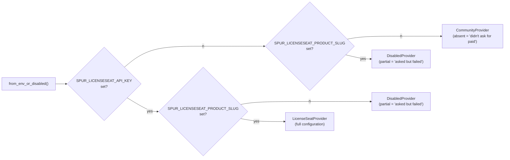
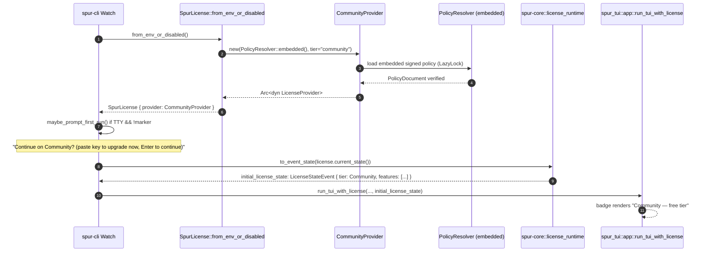

# SPUR Community-Default Onboarding — Design Spec

> **Posture:** sibling to the in-flight licensing hardening spec ([`2026-04-19-licensing-hardening-design.md`](/Volumes/Projects/spur/docs/superpowers/specs/2026-04-19-licensing-hardening-design.md:1)). Hardening is a **verify-then-harden** effort that *closes* scope around the existing single-provider seam. This spec is a **smallest-viable onboarding fix** that *adds* a Community-tier provider without touching any of the primitives the hardening spec is freezing. The two specs land in parallel; their files do not overlap except for a 5-line change in [`crates/spur-license/src/licenseseat.rs:31-46`](/Volumes/Projects/spur/crates/spur-license/src/licenseseat.rs:31).

**Source of truth for licensing primitives:** [`crates/spur-license/src/lib.rs`](/Volumes/Projects/spur/crates/spur-license/src/lib.rs:1), [`crates/spur-license/src/provider.rs`](/Volumes/Projects/spur/crates/spur-license/src/provider.rs:1), [`crates/spur-license/src/licenseseat.rs`](/Volumes/Projects/spur/crates/spur-license/src/licenseseat.rs:1).

---

## Goals

- Replace the silent `ConfigError` dead-end on a fresh install with a working **Community** tier so first-run users get a tool that does something useful before they're asked to authenticate.
- Collapse the activation flow from three distinct verbs (set env vars + `spur auth login` + `spur watch`) to **one** verb (`spur watch`, with an inline paste prompt on first run).
- Establish a **typed, signed, embedded `PolicyDocument`** as the source of truth for what each tier (`community`, `pro`, `team`, `enterprise`) includes, so the Community feature list can change per release without touching call sites.
- Give prospective Pro evaluators a frictionless taste path via a **public, rate-limited, server-issued demo key** — no per-user trial enrollment, no email collection, no anti-abuse infrastructure.
- Replace the verbose 5-line `spur auth status` output with a single-line summary appropriate for first-time users; preserve the `--format json` schema unchanged.

## Non-goals

- 7-day per-user trial. Deferred with explicit revisit trigger (see Deferred section).
- Remote signed policy refresh from a CDN. Deferred (V2 in the V1/V2/V3 roadmap below).
- Quota / rate-limit primitive (counters, windows). Deferred (V3).
- OpenFeature / Flipt / Unleash adoption for runtime feature toggles (the G2 problem, distinct from G1 entitlements addressed here). Deferred.
- Conversion telemetry. Deferred to its own spec; opt-in design.
- Multi-provider rollout (self-hosted, enterprise tenants). Already deferred by the hardening spec.
- Typed-state-machine refactor of `LicenseState`. Already deferred by the hardening spec.

---

## Architecture (with real-code mapping)

### Diagram 1 — Component layers (deltas highlighted)

```mermaid
flowchart TB
  subgraph spur_license["spur-license crate"]
    SL["SpurLicense<br/>(facade, Clone — unchanged)"]
    LP["LicenseProvider trait<br/>(unchanged)"]

    subgraph existing_providers["existing providers"]
      LSP["LicenseSeatProvider<br/>(real adapter)"]
      DP["DisabledProvider<br/>(reused for partial-env case only)"]
    end

    subgraph new_providers["NEW"]
      CP["CommunityProvider<br/>(NEW; uses PolicyResolver pinned to 'community')"]
    end

    subgraph new_policy["NEW policy module"]
      PD["PolicyDocument<br/>(SignedPolicy wrapper)"]
      PR["PolicyResolver<br/>(embedded baseline only in V1)"]
      FK["FeatureKey newtype<br/>(typed const registry)"]
      PD --owned by--> PR
    end

    SL --Arc<dyn>--> LP
    LP --impl--> LSP
    LP --impl--> DP
    LP --impl--> CP
    CP --consults--> PR
    LSP --consults as fallback--> PR
  end

  EmbeddedJSON["resources/default_policy.json<br/>(signed, include_bytes!, build.rs verified)"]
  EmbeddedJSON --LazyLock--> PR

  Cargo["spur-license/Cargo.toml<br/>+ ed25519-dalek = '2'"]
```

**Double-evaluation — Diagram 1 → code mapping**

| Node | Real-code citation (existing or target) | Status |
|---|---|---|
| `SpurLicense` facade | [`crates/spur-license/src/lib.rs:180-240`](/Volumes/Projects/spur/crates/spur-license/src/lib.rs:180) | unchanged |
| `LicenseProvider` trait | [`crates/spur-license/src/provider.rs:22-41`](/Volumes/Projects/spur/crates/spur-license/src/provider.rs:22) | unchanged |
| `LicenseSeatProvider` | [`crates/spur-license/src/licenseseat.rs:48-286`](/Volumes/Projects/spur/crates/spur-license/src/licenseseat.rs:48) | +20 LoC (resolver fallback in `has_entitlement`) |
| `DisabledProvider` | [`crates/spur-license/src/licenseseat.rs:288-344`](/Volumes/Projects/spur/crates/spur-license/src/licenseseat.rs:288) | unchanged; reused only for partial-env case |
| `CommunityProvider` | new file `crates/spur-license/src/community.rs` | NEW |
| `PolicyDocument` / `PolicyResolver` / `FeatureKey` | new module `crates/spur-license/src/policy/` (`mod.rs`, `feature_key.rs`) | NEW |
| `default_policy.json` | new file `crates/spur-license/resources/default_policy.json` | NEW |
| `build.rs` policy-signature compile-time check | new file `crates/spur-license/build.rs` | NEW |
| `from_env_or_disabled` dispatch update | [`crates/spur-license/src/licenseseat.rs:31-46`](/Volumes/Projects/spur/crates/spur-license/src/licenseseat.rs:31) | 5-LoC match-arm change |

### Diagram 2 — Provider dispatch (Community vs Disabled vs Seat)



**Rule: absence of BOTH env vars = Community (silent, no error). Presence of ONE = ConfigError (loud, diagnostic).** This preserves the existing "your CI is misconfigured" diagnostic for users who *intended* to use a paid license, while removing the friction for users who never asked.

### Diagram 3 — Cold-start sequence with Community default (TUI path)



**Verification finding for hardening invariant #1 (single emission seam):** `CommunityProvider` constructs an unused `tokio::sync::broadcast::Sender` only to satisfy the `subscribe()` trait method; it never sends. The funnel sees exactly one initial snapshot via the same `to_event_state` path used by every other provider. **No new emission seam introduced.**

---

## The PolicyDocument schema (irreversible-by-design — must be right in V1)

### Why this section is non-negotiable

Once published binaries deserialize a particular schema, every future binary must continue to accept it. The hardening spec exists to *protect* primitives; this schema is itself a new primitive. Forward-compat patterns are not optional polish — they are the only mitigation for the otherwise-permanent commitment.

### Schema (Rust types)

```rust
// crates/spur-license/src/policy/mod.rs

use chrono::{DateTime, Utc};
use serde::{Deserialize, Serialize};
use std::collections::{BTreeMap, BTreeSet};

/// The wire format. Always wrapped in SignedPolicy on disk and over the wire.
#[derive(Serialize, Deserialize, Clone, Debug)]
pub struct PolicyDocument {
    /// Major schema version. Code refuses load if `schema_version > CODE_SUPPORTED_MAJOR`.
    pub schema_version: u32,

    /// Monotonic; newer issued_at wins when comparing embedded vs cached (V2).
    pub issued_at: DateTime<Utc>,

    /// Optional expiry. Embedded baseline has None; remote overlays (V2) have Some.
    #[serde(default)]
    pub expires_at: Option<DateTime<Utc>>,

    /// Per-tier policy. Tier names: "community", "pro", "team", "enterprise".
    /// Unknown tiers in the document are ignored at lookup time (fail-closed).
    pub tier_policies: BTreeMap<String, TierPolicy>,
}

#[derive(Serialize, Deserialize, Clone, Debug, Default)]
pub struct TierPolicy {
    /// Canonical entitlement set for this tier.
    pub features: BTreeSet<String>,

    /// Quotas — empty in V1; reserved for V3.
    #[serde(default)]
    pub quotas: BTreeMap<String, serde_json::Value>,

    /// Display labels, marketing copy, badge color, etc. Non-functional.
    #[serde(default)]
    pub metadata: BTreeMap<String, String>,
}

/// Wrapper that carries the signature. The payload is canonical JSON of
/// PolicyDocument so signature verification is independent of serde
/// formatting choices.
#[derive(Serialize, Deserialize, Clone, Debug)]
pub struct SignedPolicy {
    pub payload: String,        // canonical JSON of PolicyDocument
    pub signature: String,      // base64-encoded Ed25519 signature
    pub key_id: String,         // for rotation
}
```

### Forward-compat rules (binding)

1. **`schema_version: u32`.** Code defines `pub const CODE_SUPPORTED_MAJOR: u32 = 1`. Code REFUSES to load any policy where `schema_version > CODE_SUPPORTED_MAJOR` and falls back to embedded. Older minor schemas (within the same major) deserialize via `#[serde(default)]`.
2. **`#[serde(default)]` on every optional field.** Old binaries accept new policies that omit fields they don't know about.
3. **`BTreeMap<String, serde_json::Value>` for `quotas`.** V1 ignores quota contents entirely (no schema for quotas yet); V3 introduces a typed schema. Using `Value` means V1 binaries don't fail on V3 quotas — they just don't enforce them.
4. **`#[serde(other)]` on enums.** When V1 introduces enums (none today; V3 adds `WindowSpec` and `ExceedAction`), unit variants get an `Unknown` carrier so unknown variants degrade gracefully.
5. **Asymmetric defaults**:
   - Unknown FEATURE in `has_entitlement(unknown_key)` → **fail-closed** (return `false`). Caller asked about something not policied; safe default is deny.
   - Unknown ACTION on a quota (V3) → **fail-open** (allow). Policy author bug; wrong to punish user.

### Signature trust model

```rust
// crates/spur-license/src/policy/trust.rs

use ed25519_dalek::VerifyingKey;
use std::collections::BTreeMap;

/// Embedded trust map. Compiled into the binary. Multi-key from V1 to enable
/// rotation: ship a new binary that adds the new key BEFORE retiring the old
/// key on the issuance side; ship a later binary that removes the old key.
pub fn trusted_keys() -> &'static BTreeMap<&'static str, VerifyingKey> {
    static KEYS: std::sync::OnceLock<BTreeMap<&'static str, VerifyingKey>> = std::sync::OnceLock::new();
    KEYS.get_or_init(|| {
        let mut m = BTreeMap::new();
        m.insert(
            "spur-policy-2026-04",
            VerifyingKey::from_bytes(&include_bytes!("../../resources/keys/spur-policy-2026-04.pub")
                .as_slice().try_into().expect("32-byte key")).expect("valid key"),
        );
        m
    })
}
```

### Trust matrix

| Source of truth | Authority | Tamper-resistance |
|---|---|---|
| Community features (V1) | Embedded signed `default_policy.json` | Ed25519 verified at compile-time (build.rs) AND runtime |
| Community features (V2, future) | Cached signed overlay from CDN | Ed25519 verified on load; fall back to embedded if invalid/expired |
| Pro features (server-known) | LicenseSeat `active_entitlements` response | Server-authenticated |
| Pro features (server-not-yet-aware) | Resolver fallback to PolicyDocument's `pro` tier | Same as Community |
| Quotas (V3, local counters) | `~/.spur/usage.json` | Honor system; documented |

### `FeatureKey` newtype (typed const registry)

```rust
// crates/spur-license/src/policy/feature_key.rs

#[derive(Copy, Clone, Debug, PartialEq, Eq, Hash)]
pub struct FeatureKey(&'static str);

impl FeatureKey {
    pub const CHAT: Self                 = Self("chat");
    pub const CODE_EDIT: Self            = Self("code_edit");
    pub const WATCH_LOOP: Self           = Self("watch_loop");
    pub const ADVANCED_AGENTS: Self      = Self("advanced_agents");
    pub const TEAM_SHARING: Self         = Self("team_sharing");
    pub const CLOUD_SYNC: Self           = Self("cloud_sync");
    // … grows over time; one place to grep for the canonical list

    pub const fn as_str(&self) -> &'static str { self.0 }
}
```

Callers use `license.has_entitlement(FeatureKey::ADVANCED_AGENTS.as_str())`. Adding a feature = adding a const. Typo-safe, grep-discoverable. The underlying `has_entitlement(&str)` signature is preserved so the policy can also answer for unknown keys (fail-closed).

> **Note on the initial contents of `FeatureKey` and the Community/Pro split in `default_policy.json`:** these depend on product input. The spec commits to the *mechanism*; the *contents* are filled in during execution from the rough first cut you provide as pre-work. The implementation plan will treat the contents as a parameter.

---

## The four coordinated changes

### 1. `CommunityProvider` (B2′)

```rust
// crates/spur-license/src/community.rs

use crate::policy::PolicyResolver;
use crate::provider::{LicenseProvider, RefreshPolicy};
use crate::{LicenseError, LicenseEvent, LicenseState, Result};
use async_trait::async_trait;
use std::sync::Arc;
use tokio::sync::broadcast;

pub struct CommunityProvider {
    resolver: Arc<PolicyResolver>,
    state: LicenseState,                 // computed once at construction
    events_tx: broadcast::Sender<LicenseEvent>,  // never sent on; trait satisfaction only
}

impl CommunityProvider {
    pub fn new(resolver: Arc<PolicyResolver>) -> Self {
        let features = resolver.tier_features("community");
        let state = LicenseState::active_community(features);
        let (events_tx, _) = broadcast::channel(1);
        Self { resolver, state, events_tx }
    }
}

#[async_trait]
impl LicenseProvider for CommunityProvider {
    fn current_state(&self) -> LicenseState { self.state.clone() }
    fn subscribe(&self) -> broadcast::Receiver<LicenseEvent> { self.events_tx.subscribe() }
    fn refresh_policy(&self) -> RefreshPolicy { RefreshPolicy::default() }
    fn requires_heartbeat(&self) -> bool { false }
    fn has_entitlement(&self, feature: &str) -> bool {
        self.resolver.has_entitlement(feature)
    }
    async fn activate(&self, _key: &str) -> Result<LicenseState> {
        Err(LicenseError::NotConfigured(
            "Community tier; configure SPUR_LICENSESEAT_* env vars to activate a paid license".into()
        ))
    }
    async fn validate(&self) -> Result<LicenseState> { Ok(self.state.clone()) }
    async fn heartbeat(&self) -> Result<LicenseState> { Ok(self.state.clone()) }
    async fn deactivate(&self) -> Result<LicenseState> { Ok(self.state.clone()) }
}
```

A new `LicenseState::active_community(features: BTreeSet<String>) -> LicenseState` constructor is added alongside `active_cached()` and `active_validated()` in [`crates/spur-license/src/lib.rs:116-140`](/Volumes/Projects/spur/crates/spur-license/src/lib.rs:116). It sets `status: Active`, `plan: Plan::Community`, `subject_kind: SubjectKind::User`, `binding_mode: BindingMode::Unknown`, `offline_ok: true`, `status_text: "Community tier"`.

The dispatch in `from_env_or_disabled` ([`licenseseat.rs:31-46`](/Volumes/Projects/spur/crates/spur-license/src/licenseseat.rs:31)) gains one match arm:

```rust
pub fn from_env_or_disabled() -> Arc<dyn LicenseProvider> {
    match (
        std::env::var(LICENSESEAT_API_KEY_ENV),
        std::env::var(LICENSESEAT_PRODUCT_SLUG_ENV),
    ) {
        (Ok(api_key), Ok(product_slug)) => Arc::new(LicenseSeatProvider::new(api_key, product_slug)),
        (Err(std::env::VarError::NotPresent), Err(std::env::VarError::NotPresent)) => {
            Arc::new(CommunityProvider::new(PolicyResolver::embedded()))   // CHANGED
        }
        _ => Arc::new(DisabledProvider::new("incomplete licensing environment configuration")),
    }
}
```

`LicenseSeatProvider::has_entitlement` ([`licenseseat.rs:180-182`](/Volumes/Projects/spur/crates/spur-license/src/licenseseat.rs:180)) gains a fallback:

```rust
fn has_entitlement(&self, feature: &str) -> bool {
    if self.sdk.has_entitlement(feature) { return true; }
    // Fallback: policy file knows about Pro-tier features the LicenseSeat
    // catalog hasn't been updated with yet. Server-asserted entitlements
    // override; policy is the FLOOR.
    self.resolver.tier_for_plan(self.current_snapshot().plan).has_entitlement(feature)
}
```

### 2. Single-verb activation (B6) — and the upgrade-path dependency

**Dependency to resolve first.** Both B6's paste-to-upgrade and B9's demo key call `SpurLicense::activate(key)`. Today, `activate()` only succeeds when `LicenseSeatProvider` is the underlying provider, which today requires `SPUR_LICENSESEAT_API_KEY` + `SPUR_LICENSESEAT_PRODUCT_SLUG` env vars set. **Without resolving this, B6/B9 do not actually work for users in the Community-default state** — exactly the users we want to convert.

Two implementation options for the plan to choose between (recorded as Open Question 1 below):

- **Option A (recommended) — bake in the LicenseSeat publishable credentials at compile time.** Per LicenseSeat docs ([crates.io/crates/licenseseat](https://crates.io/crates/licenseseat)), `pk_*` keys are explicitly designed for client embedding (analogous to a Stripe publishable key). The product slug is not a secret. Bake both via `option_env!`:
  ```rust
  // crates/spur-license/src/build_constants.rs
  pub const BAKED_LICENSESEAT_PUBLISHABLE_KEY: Option<&str> =
      option_env!("SPUR_BUILD_LICENSESEAT_PUBLISHABLE_KEY");
  pub const BAKED_LICENSESEAT_PRODUCT_SLUG: Option<&str> =
      option_env!("SPUR_BUILD_LICENSESEAT_PRODUCT_SLUG");
  ```
  Set in release CI from non-secret build vars. `option_env!` returns `None` for dev builds without them, so local dev still compiles. The dispatch in `from_env_or_disabled` becomes:
  - Runtime env vars present (override) → `LicenseSeatProvider` from env.
  - Runtime env vars absent AND baked-in present → `LicenseSeatProvider` from baked, BUT if no cached license, the FACADE exposes `CommunityProvider` for the current state. `activate()` is delegated to the always-available LicenseSeatProvider so paste-to-upgrade works. On successful activation, the facade switches the exposed provider to `LicenseSeatProvider`.
  - Both absent → `CommunityProvider` only; `activate()` returns `NotConfigured` with the doc link.

- **Option B (simpler, friction-ful) — require env vars for upgrade.** Spec doesn't bake credentials. B6's prompt becomes: `Continue on Community? (Enter to continue. To upgrade, set SPUR_LICENSESEAT_API_KEY and SPUR_LICENSESEAT_PRODUCT_SLUG and run 'spur auth login --key …')`. B9's demo key requires the same env-var setup. This honestly admits the dependency but defeats the "single-verb activation" goal.

**The spec recommends Option A.** It is the only option that delivers the goals as stated. The implementation plan will commit to A unless ops indicates the publishable key cannot be in-source for non-technical reasons (in which case Option B is the fallback and the goals are partially met).

**Implementation contract for the prompt itself (Option A assumed):**

In `spur-cli/src/main.rs` Watch path, after `SpurLicense::from_env_or_disabled()` and before `Orchestrator::new`:

```rust
maybe_prompt_first_run(&license).await?;
```

- Skip if `!std::io::stdin().is_terminal()` (CI safe).
- Skip if `~/.spur/onboarded` marker exists.
- Skip if `license.current_state().status` is anything other than the Community-default state (user already has a configured/cached license).
- Print: `spur is running on the Community tier (free). Paste a license key to unlock Pro now, or press Enter to continue.`
- If user pastes a key: call `license.activate(key)`. Under Option A this delegates to the baked-in LicenseSeat path. On success, persist marker AND print success line; the next process launch comes up as `LicenseSeatProvider`. On failure, print error and continue with Community.
- If user presses Enter: persist marker. Continue with Community.

The marker file `~/.spur/onboarded` contains a JSON line `{"version": 1, "first_run_at": "<RFC3339>"}` so future versions can decide whether to re-prompt for any reason.

### 3. Public demo key (B9)

**Zero code change beyond what B6/Option A already requires.** Tenant-side configuration on LicenseSeat:
- Issue a long-lived license key (e.g., `DEMO-SPUR-2026-Q2`) bound to the Pro plan with all entitlements.
- Apply rate limits (e.g., 1000 activations/day across all machines).
- Set wall-clock expiry (e.g., 2026-07-01T00:00:00Z).
- Document in `docs/onboarding/try-pro.md`: "Try Pro features through 2026-07-01 by running `spur auth login --key DEMO-SPUR-2026-Q2`. No signup required."

Rotation cadence: monthly. New key, new doc revision. Old key continues to work until its expiry.

**Note:** B9 requires Option A for B6 to be useful — without baked-in publishable credentials, users would also need to set env vars before the demo key works, which defeats its frictionless premise.

### 4. CLI output redesign

Replace the 5-line `print_state` in [`crates/spur-cli/src/commands/auth.rs:108-118`](/Volumes/Projects/spur/crates/spur-cli/src/commands/auth.rs:108) with a single-line summary keyed on tier and status:

| Status / Plan | Output |
|---|---|
| `Active` / `Community` | `spur Community — free tier  ⓘ run 'spur auth login --key …' to unlock Pro` |
| `Active` / `Pro` (or higher) | `spur Pro — active  ✓ all features unlocked` |
| `Active` / `Pro` with `expires_at` | `spur Pro — active until 2027-04-19  ✓ all features unlocked` |
| `Degraded` | `spur Pro — degraded (network)  ⚠ cached license still valid offline` |
| `Invalid` | `spur — license invalid  ✗ {status_text}` |
| `ConfigError` | `spur — config error  ✗ {status_text}` |
| `Inactive` | `spur — inactive  ⓘ run 'spur auth login --key …' to activate` |

`--format json` continues to emit the stable `LicenseStateEvent` schema (Phase 3 H5 of hardening — already planned).

---

## Invariants preserved (verified against hardening spec)

1. **Single-seam emission** ([hardening spec](/Volumes/Projects/spur/docs/superpowers/specs/2026-04-19-licensing-hardening-design.md:394) invariant #1). `CommunityProvider`'s `events_tx` is constructed but never sent on. Initial state flows through the same `to_event_state` path via the orchestrator. ✅
2. **Cached state is authoritative** (invariant #2). Network errors cannot transition Community → Invalid because Community has no network calls. Trivially preserved. ✅
3. **Monotonic seq ordering** (invariant #3). Unchanged; `FunnelHandle` still stamps. ✅
4. **Cold-start first frame latency** (invariant #4). `CommunityProvider::new` is synchronous; embedded policy is loaded via `LazyLock` on first access; TUI seeds from `to_event_state` exactly as before. ✅
5. **No secrets in status output** (invariant #5). The single-line summary contains tier and (for errors) `status_text` from the provider — same surface as today. JSON format unchanged. ✅

**Additional invariants this spec introduces:**

6. **Embedded policy compile-time validity.** `build.rs` runs `verify(SignedPolicy)` on the embedded `default_policy.json`. CI cannot ship a binary with an unsigned, malformed, or future-versioned policy.
7. **Policy schema forward-compat.** Tests assert that a v1 binary deserializes a hypothetical v1.5 policy (extra fields ignored), AND that a v1 binary refuses a v2 policy (`schema_version` check fires) and falls back to embedded.
8. **Asymmetric default safety.** Tests assert `unknown_feature → false` (fail-closed) and `unknown_quota_action → allow` (fail-open) at the resolver layer.

---

## Phases / execution order

### Phase 0 — Pre-work (you, in parallel with spec review)

- Generate Ed25519 keypair (`spur-policy-2026-04` key id). Private key in vault; 32-byte public key bytes file at `crates/spur-license/resources/keys/spur-policy-2026-04.pub`.
- Provide a rough first cut at the Community vs Pro feature list. Even partial is enough to draft `default_policy.json`.
- Confirm LicenseSeat tenant supports a long-lived rate-limited public demo key. (B9.)
- **Decide Option A vs Option B** (Open Question 1). Confirm whether the LicenseSeat publishable key + product slug are approved for in-source / in-binary embedding. If yes (Option A), provide the values for the build-time env vars `SPUR_BUILD_LICENSESEAT_PUBLISHABLE_KEY` and `SPUR_BUILD_LICENSESEAT_PRODUCT_SLUG` to be set in release CI.

### Phase 1 — Foundation (~0.5 day)

- New module `crates/spur-license/src/policy/` with `mod.rs`, `feature_key.rs`, `trust.rs`.
- `PolicyDocument`, `TierPolicy`, `SignedPolicy`, `PolicyResolver`, `FeatureKey` all defined per the schema section above.
- `crates/spur-license/build.rs` that loads `resources/default_policy.json`, verifies the signature against the embedded public key, and panics at compile-time if invalid.
- `crates/spur-license/resources/default_policy.json` (signed offline at first commit; signing script in `crates/spur-license/scripts/sign-policy.sh`).
- `crates/spur-license/Cargo.toml`: add `ed25519-dalek = "2"` and `base64 = "0.22"` to `[dependencies]`; the `[build-dependencies]` mirror.
- Tests: schema deserialization including unknown variants; signature happy path + tamper detection; `PolicyResolver::has_entitlement` for known/unknown features; forward-compat (extra-field ignored, future-version refused).

### Phase 2 — CommunityProvider (~0.5 day)

- New file `crates/spur-license/src/community.rs` per the spec above.
- `LicenseState::active_community(features)` constructor in `lib.rs`.
- `from_env_or_disabled` match-arm change in `licenseseat.rs`.
- `LicenseSeatProvider::has_entitlement` resolver fallback in `licenseseat.rs`.
- Tests: `CommunityProvider` returns correct entitlements; `LicenseSeatProvider` consults resolver for unknown SDK keys; existing `FakeProvider` tests still pass.

### Phase 3 — CLI onboarding + output (~0.5 day)

- `maybe_prompt_first_run` in `spur-cli/src/main.rs` per the contract above.
- `~/.spur/onboarded` marker schema documented in a 10-line module comment.
- `print_state` redesign in `auth.rs`.
- Tests: TTY-skip behavior, marker creation, prompt flow with valid key, prompt flow with Enter, output format for each (status, plan) pair.

### Phase 4 — Docs + tenant config (hours)

- `docs/onboarding/try-pro.md` documenting the demo key.
- `docs/onboarding/community-tier.md` with the auto-derivable feature matrix from `default_policy.json` metadata.
- README onboarding section updated.
- Tenant-side: configure rate-limited demo key.

---

## Exit criteria

- All four phases land; CI green (`cargo check --workspace`, `cargo test --workspace`, `cargo clippy --workspace -- -D warnings`, `cargo fmt --all --check`).
- `default_policy.json` signature verified at compile time AND at runtime in tests.
- A fresh `cargo install --path crates/spur-cli` (no env vars) followed by `spur watch` runs the tool with `Plan::Community`; `spur auth status` shows the Community single-line summary.
- A `spur auth login --key DEMO-SPUR-2026-Q2` against the configured tenant transitions to Pro.
- Hardening spec's invariants #1–#5 pass their existing tests unchanged.
- New invariants #6–#8 (compile-time validity, forward-compat, asymmetric defaults) covered by tests.
- README and onboarding docs updated.

---

## Deferred items with explicit revisit triggers

| Deferred item | Trigger to revisit | Rough scope |
|---|---|---|
| 7-day per-user trial | 3+ months of conversion telemetry shows the Community → Pro funnel is bottlenecked **specifically** on lack of Pro evaluation, AND the demo key (B9) hasn't already addressed it | Sibling spec; ~5–8 engineer-days plus product/legal review |
| Remote signed policy refresh (V2) | Product wants to change Community feature list **without** shipping a release | Sibling spec; ~1 engineer-day plus CDN setup |
| Quotas (V3) | A real product gate where boolean entitlement isn't expressive enough (e.g., per-day token caps) | Sibling spec; ~2 engineer-days plus product-policy decisions |
| OpenFeature / Flipt adoption (G2) | spur needs kill switches, A/B tests, or percentage rollouts on non-licensing features | Sibling spec; OpenFeature SDK + flagd-file-mode is the recommended starting point |
| Conversion telemetry | After this lands; product wants data on the Community → Pro funnel | Separate spec; opt-in design; minimum-surface |
| Constructor/background-start split (`SpurLicense::new` + `start_background`) | Already deferred by hardening spec | Unchanged |
| `parking_lot::RwLock` migration | Already deferred by hardening spec | Unchanged |
| Typed state-machine refactor of `LicenseState` | Already deferred by hardening spec | Unchanged |
| Multi-provider (self-hosted, enterprise tenants) | Already deferred by hardening spec | Unchanged |

---

## Open questions to resolve during execution

1. **Option A vs Option B for the upgrade-path dependency.** The spec recommends Option A (bake LicenseSeat publishable key + product slug at compile time via `option_env!`). Confirm during Phase 0 whether the LicenseSeat publishable key is approved for in-source / in-binary embedding. If not, fall back to Option B and accept that B6/B9 require env vars (partial goal achievement).
2. **`SpurLicense` facade composition under Option A.** Two implementation shapes for the facade switching between CommunityProvider and LicenseSeatProvider on activation: (a) facade owns both providers, exposes one based on cache state; (b) facade owns a single `Arc<RwLock<Arc<dyn LicenseProvider>>>` that gets swapped on activation. (b) is simpler and aligns with the existing `Arc<dyn>` shape but adds one indirection. Decide during Phase 2 implementation.
3. **Initial Community feature list.** Pre-work item from product. Spec commits to mechanism, not contents.
4. **Demo key naming convention.** Suggest `DEMO-SPUR-YYYY-QQ` (e.g., `DEMO-SPUR-2026-Q2`). Confirm or propose alternative during Phase 4.
5. **`spur auth login` interactive paste mode (no `--key` flag).** Out-of-scope for this spec but a natural future complement to B6. Tracked as a separate small follow-up if not addressed here.
6. **Telemetry trigger threshold.** "3+ months of data" is the trigger; the actual conversion threshold that warrants revisiting trial should be set when telemetry lands.
