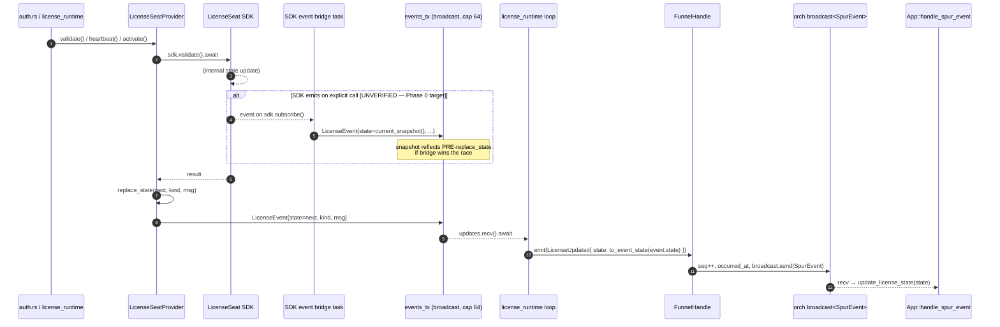
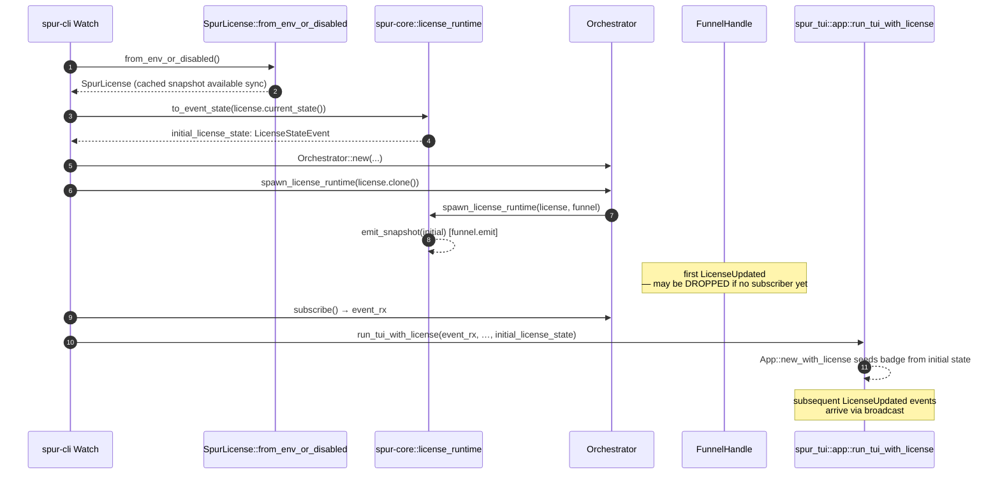

# SPUR Licensing Hardening — Design Spec

> **Posture:** the 2026-04-18 licensing plan (Tasks 1–5) has landed in `caeeccc`; Task 6 is unchecked and quality gaps remain. This spec defines a **verify-then-harden** follow-up — facts before fixes, tests before refactors, invariants before polish.

**Source plan:** [`docs/superpowers/plans/2026-04-18-spur-licensing-architecture.md`](/Volumes/Projects/spur/docs/superpowers/plans/2026-04-18-spur-licensing-architecture.md:1)

**Prior spec:** [`docs/superpowers/specs/2026-04-18-spur-licensing-architecture.md`](/Volumes/Projects/spur/docs/superpowers/specs/2026-04-18-spur-licensing-architecture.md:1) — **not rewritten.** Only reconciled if Phase 0 disproves assumptions.

---

## Goals

- Empirically confirm or retract the two suspected 🔴 defects (duplicate emission, heartbeat over-trigger) before committing fix direction.
- Unblock fake-provider testing across `spur-license`, `spur-core`, `spur-cli`, `spur-tui` with a single injection seam.
- Encode the licensing trust invariants as tests (property + example), not comments.
- Close the high-confidence gaps (cold-start plan hydration, missing runtime/CLI/TUI tests, Task 6 verification).
- Reconcile rollout documentation with the code that shipped.

## Non-goals

- Multi-provider rollout. The facade already separates LicenseSeat from the core; adding a second provider is deferred.
- Typed-state-machine refactor of `LicenseState`. No evidence the bag-of-fields model is broken.
- Self-hosted / enterprise tenant support.
- Trial UX.

---

## Architecture (as-shipped) with real-code mapping

### Diagram 1 — Component layers

```mermaid
flowchart TB
  subgraph spur_license["spur-license crate"]
    SL["SpurLicense<br/>(facade, Clone)"]
    LP["LicenseProvider trait<br/>async + Send+Sync"]
    LSP["LicenseSeatProvider<br/>(real adapter)"]
    DP["DisabledProvider<br/>(env-absent fallback)"]
    BR["spawn_sdk_event_bridge<br/>(detached tokio task)"]
    LSP -.spawns.-> BR
    SL --Arc<dyn>--> LP
    LP --impl--> LSP
    LP --impl--> DP
  end

  SDK["licenseseat = 0.5.3<br/>LicenseSeat::subscribe() + handlers"]
  LSP --owns--> SDK
  BR --rx.recv().await--> SDK

  subgraph spur_core["spur-core crate"]
    LR["license_runtime::spawn_license_runtime"]
    Orch["Orchestrator::spawn_license_runtime"]
    Funnel["FunnelHandle<br/>(mpsc → stamp → broadcast)"]
  end
  SL --owned by--> LR
  LR --emit LicenseUpdated--> Funnel
  Orch --delegates--> LR

  subgraph spur_acp["spur-acp crate"]
    LSE["LicenseStateEvent + mirror enums"]
    SEB["SpurEventBody::LicenseUpdated"]
  end
  Funnel --stamps seq, broadcasts--> SEB

  subgraph spur_tui["spur-tui crate"]
    App["App::handle_spur_event"]
    Badge["LicenseBadge + status bar"]
  end
  subgraph spur_cli["spur-cli crate"]
    Watch["main.rs Watch path"]
    Auth["commands::auth"]
  end

  SEB --subscribe--> App
  App --projection--> Badge
  Watch --spawn + hydrate--> LR
  Watch --initial snapshot--> App
  Auth --direct facade call--> SL
```

**Double-evaluation — Diagram 1 → code mapping**

| Node / edge | Real-code citation | Match? |
|---|---|---|
| `SpurLicense` (Clone, Arc<dyn>) | `crates/spur-license/src/lib.rs:177-226` | ✅ |
| `LicenseProvider trait (Send+Sync, async)` | `crates/spur-license/src/provider.rs:22-33` | ✅ |
| `LicenseSeatProvider` | `crates/spur-license/src/licenseseat.rs:48-83` | ✅ |
| `DisabledProvider` | `crates/spur-license/src/licenseseat.rs:269-325` | ✅ |
| `spawn_sdk_event_bridge` detached task | `crates/spur-license/src/licenseseat.rs:96-117` | ✅ |
| `license_runtime::spawn_license_runtime` | `crates/spur-core/src/license_runtime.rs:12-77` | ✅ |
| `Orchestrator::spawn_license_runtime` delegates | `crates/spur-core/src/orchestrator.rs:483-485` | ✅ |
| `FunnelHandle::emit` (mpsc → stamped broadcast) | `crates/spur-core/src/event_funnel.rs:22-63` | ✅ |
| `SpurEventBody::LicenseUpdated { state }` | `crates/spur-acp/src/domain/events.rs:384-386` | ✅ |
| `LicenseStateEvent` mirror + sub-enums | `crates/spur-acp/src/domain/events.rs:181-229` | ✅ |
| `App::handle_spur_event` LicenseUpdated arm | `crates/spur-tui/src/app.rs:711-713` | ✅ |
| Watch path hydration + runtime spawn | `crates/spur-cli/src/main.rs:452-478, 622-630` | ✅ |
| `commands::auth` direct facade (no runtime) | `crates/spur-cli/src/commands/auth.rs:22-80` | ✅ |

**Findings during verification:** no mismatches. One omission: the diagram elides the `std::sync::RwLock<LicenseState>` inside `LicenseSeatProvider` (`licenseseat.rs:51`). Not load-bearing for the architecture view; documented inline below.

---

### Diagram 2 — Emission paths (THE HOTSPOT for suspected 🔴 C9)



**Double-evaluation — Diagram 2 → code mapping**

| Arrow / step | Real-code citation | Match? / Note |
|---|---|---|
| 2 `self.sdk.validate().await` | `licenseseat.rs:186-188` (validate), `:238` (heartbeat), `:167-170` (activate), `:259-262` (deactivate) | ✅ |
| 4–6 Bridge path `rx = sdk.subscribe(); tx.send(LicenseEvent{state=snapshot})` | `licenseseat.rs:96-117` | ✅ code exists; 🟡 **whether SDK emits on explicit call is unverified — Phase 0 target** |
| 8 `replace_state(next, kind, msg)` inside handler | `licenseseat.rs:85-94` called from `:179, :225, :245, :264` | ✅ |
| 9 `tx.send(LicenseEvent{...})` inside `replace_state` | `licenseseat.rs:89-93` | ✅ |
| 10 `updates.recv().await` | `license_runtime.rs:24, 65-73` | ✅ |
| 11 `emit_snapshot(funnel, event.state)` | `license_runtime.rs:67, 91-95` | ✅ |
| 12 Funnel mpsc → seq stamp → broadcast.send | `event_funnel.rs:48-60` | ✅ |
| 13 TUI `handle_spur_event` match `LicenseUpdated` | `app.rs:711-713` | ✅ |

**Verification finding — the C9 claim, restated honestly:** the diagram shows TWO arrows into `events_tx` per explicit handler call (step 5 and step 9). Code-reading confirms both exist. **What cannot be confirmed from the SPUR source alone is whether the SDK's own `validate()` / `heartbeat()` / `activate()` / `deactivate()` methods synchronously emit through `sdk.subscribe()`.** If they do, every explicit handler call duplicates. If only autonomous SDK timers emit, there is no duplication. **Phase 0 exists precisely to resolve this.**

Additional verification note: `license_runtime.rs:44, 61` uses `rand::random::<f64>()`; confirmed `rand = "0.8"` declared in `crates/spur-core/Cargo.toml:10`. Diagram would need an extra node if we depicted jitter; omitted intentionally to keep the hotspot clear.

---

### Diagram 3 — LicenseStatus state machine (as-implemented)

```mermaid
stateDiagram-v2
  [*] --> Inactive: no cached license<br/>(LicenseState::inactive)
  [*] --> ConfigError: env vars missing or partial<br/>(DisabledProvider)
  [*] --> Active: cached license present on startup<br/>(active_cached, plan=Unknown 🟠 G2)

  ConfigError --> Active: activate(key) succeeds<br/>[only if provider is not DisabledProvider]
  Inactive --> Active: activate(key) succeeds<br/>(LicenseEventKind::Activated)

  Active --> Active: validate() ok<br/>(active_validated, plan filled)
  Active --> Degraded: validate() / heartbeat() Err<br/>(license_runtime::degraded_from<br/>or LSP::degrade_current)
  Active --> Invalid: validate() ok but valid=false<br/>(licenseseat.rs:214-222)

  Degraded --> Active: heartbeat() ok<br/>(licenseseat.rs:240-244)
  Degraded --> Invalid: next validate() confirms invalid
  Degraded --> Degraded: repeated transient failures

  Active --> Inactive: deactivate()<br/>(LicenseEventKind::Deactivated)
  Degraded --> Inactive: deactivate()
  Invalid --> Inactive: deactivate()

  note right of Degraded
    is_active() returns TRUE here.
    Gating logic treats Degraded as licensed.
  end note
```

**Double-evaluation — Diagram 3 → code mapping**

| Transition | Real-code citation | Match? |
|---|---|---|
| `Inactive` initial from no-cache | `licenseseat.rs:68-72` (sdk.current_license().is_none()) | ✅ |
| `ConfigError` initial from DisabledProvider | `licenseseat.rs:274-282`, `lib.rs:106-111` | ✅ |
| `Active` initial from cache | `licenseseat.rs:68-72` + `lib.rs:113-124` | ✅ **with G2 caveat: `plan = Plan::Unknown` on this path** |
| `activate(key) → Active` | `licenseseat.rs:165-181` | ✅ |
| `Active → Degraded` via runtime | `license_runtime.rs:37-38, 55-57, 83-89` | ✅ |
| `Active → Degraded` via heartbeat handler | `licenseseat.rs:248-254` (`degrade_current`) | ✅ |
| `Active → Invalid` from valid=false | `licenseseat.rs:214-222` | ✅ |
| `Degraded → Active` on successful heartbeat | `licenseseat.rs:240-244` | ✅ |
| `is_active()` TRUE for Degraded | `lib.rs:139-141` | ✅ |
| `deactivate → Inactive` | `licenseseat.rs:258-266` | ✅ |

**Verification finding — real inconsistency surfaced by diagramming:**

1. **🟠 G2 re-confirmed.** The startup-from-cache `Active` transition lands at `plan = Plan::Unknown` because `active_cached()` hardcodes it (`lib.rs:116-118`). The diagram's "plan=Unknown" annotation matches code; the code itself is the defect.
2. **🟡 D5 re-confirmed.** The diagram does not show an `Invalid → Invalid (status_text clobbered)` self-loop, but `license_runtime.rs:83-89` (`degraded_from`) DOES overwrite `status_text` on any subsequent failure regardless of prior status. The state enum doesn't change, but the human-readable text does — a silent data loss for the prior Invalid reason. Worth encoding as "Invalid → Invalid (reason rewritten)" if we were fully modeling text, but the enum-level state machine is correct.
3. **🟡 Runtime emits `Inactive` banner during shutdown path (deactivate)** — `licenseseat.rs:263`: `LicenseState::inactive("License deactivated")`. Diagram subsumes this into `Degraded/Active/Invalid → Inactive` edges.

No false edges. Every edge has a concrete call site.

---

### Diagram 4 — Cold-start sequence (Watch path)



**Double-evaluation — Diagram 4 → code mapping**

| Step | Real-code citation | Match? |
|---|---|---|
| 1 `SpurLicense::from_env_or_disabled()` | `main.rs:452` | ✅ |
| 2 `to_event_state(license.current_state())` sync path | `main.rs:453-454`, `license_runtime.rs:97-133` | ✅ |
| 5 `Orchestrator::new(…)` before license spawn | `main.rs:471` | ✅ |
| 6 `orch.spawn_license_runtime(license.clone())` | `main.rs:477` | ✅ |
| 7 delegation into core | `orchestrator.rs:483-485` | ✅ |
| 8 initial emit_snapshot | `license_runtime.rs:14` (before select loop) | ✅ |
| 9 `orch.subscribe()` AFTER runtime spawn | `main.rs:478` | ✅ **drop-hazard for step 8's emission — real** |
| 10 `run_tui_with_license(…, initial_license_state)` | `main.rs:622-630`, `app.rs:1663-1672` | ✅ |
| 11 `App::new_with_license` seeds state & badge | `app.rs:195-268` | ✅ |

**Verification finding — ordering hazard made concrete by the diagram:**

Step 8 (initial emit via the funnel's mpsc → broadcast) executes **before** step 9 (`orch.subscribe()`). The funnel broadcast has no retention; receivers that do not exist at send time never see the event. The initial `LicenseUpdated` is effectively **dropped on the TUI path**. In practice this is masked because step 10 passes `initial_license_state` synchronously, so the TUI is correctly seeded from the cached snapshot regardless. But the invariant is subtle: **the TUI's first license state comes from `App::new_with_license`, not from the event stream.** Any consumer that subscribes AFTER `spawn_license_runtime` (e.g. an external JSONL replay sink attached mid-process, or a future "headless watcher") will miss the initial snapshot.

This is not currently a bug, but it's a load-bearing assumption that deserves a doc-comment or a mandatory "re-emit current snapshot on first subscriber" helper — see Phase 2 note below. The diagram made this explicit in a way the source did not.

---

### Diagram 5 — Phase plan and gates

```mermaid
flowchart LR
  P0["Phase 0 — Fact-Finding Spike<br/>~2h"]
  P1["Phase 1 — Test Infrastructure<br/>~1d"]
  P2["Phase 2 — Confirmed Fixes<br/>~0.5d"]
  P3["Phase 3 — Polish + Rollout Docs<br/>~0.5d"]

  P0 -->|C9 confirmed?| G1{{"Dedup fix scope"}}
  P0 -->|D1 confirmed?| G2{{"Heartbeat policy<br/>shape"}}
  P0 -->|Plan/features on cache?| G3{{"G2 cold-start<br/>hydration feasible"}}

  G1 --> P1
  G2 --> P1
  G3 --> P1

  P1 --> P2
  P2 --> P3

  subgraph P0_out["Phase 0 outputs"]
    direction TB
    R["docs/rca/2026-04-19-licenseseat-emission-audit.md<br/>tracing test binary"]
  end
  P0 -.-> P0_out

  subgraph P1_out["Phase 1 outputs"]
    direction TB
    FP["spur-license::test_support::FakeProvider"]
    FPF["SpurLicense::from_provider(Arc<dyn>)"]
    PT["proptest: never Active→Invalid on network-error"]
  end
  P1 -.-> P1_out

  subgraph P2_out["Phase 2 outputs (gated on P0)"]
    direction TB
    C9F["C9 dedup fix<br/>(direction depends on P0)"]
    D1F["LicenseProvider::requires_heartbeat()<br/>(direction depends on P0)"]
    G2F["active_cached() hydrates plan + features<br/>from sdk.current_license()"]
    E2E3["runtime + TUI + CLI tests using FakeProvider"]
  end
  P2 -.-> P2_out

  subgraph P3_out["Phase 3 outputs"]
    direction TB
    D5["D5 preserve prior Invalid text"]
    D3["D3 initial validate after 30s jitter"]
    H5["--format json on spur auth status"]
    T6["Plan Task 6 checkboxes filled with cargo output"]
    RN["docs/superpowers/plans/…-hardening.md rollout notes"]
  end
  P3 -.-> P3_out
```



**Double-evaluation — Diagram 5 vs. repository state**

| Node | Path or artifact reference | Exists today? |
|---|---|---|
| `docs/rca/2026-04-19-licenseseat-emission-audit.md` | new in Phase 0 | ❌ (target) |
| `spur-license::test_support::FakeProvider` | new in Phase 1 | ❌ (target); `LicenseProvider` trait already exists at `provider.rs:22-33` |
| `SpurLicense::from_provider(Arc<dyn LicenseProvider>)` | new public constructor in `lib.rs` | ❌ (target); current private path `Arc<dyn LicenseProvider>` already wraps the facade at `lib.rs:178-180` |
| proptest harness | new; needs `proptest` dep in `spur-license/Cargo.toml` dev-deps | ❌ (target) |
| C9 dedup fix site | to edit in `licenseseat.rs:85-117` | ⏳ |
| `LicenseProvider::requires_heartbeat()` | to add in `provider.rs:22-33`; gate in `license_runtime.rs:48, 79-81` | ⏳ |
| G2 hydration | to edit in `lib.rs:113-124` + `licenseseat.rs:68-72` | ⏳ |
| runtime/TUI/CLI fake-provider tests | to add under existing test files | ⏳ |
| `--format json` on auth status | to edit `auth.rs:25-30, 70-80` | ⏳ |
| rollout notes | to create alongside the new plan | ❌ (target) |

All Phase-0 / Phase-1 *seams* already exist in the codebase; no greenfield plumbing is required. The trait is in place, the Arc<dyn> is in place, the funnel is in place. This is a **hardening** spec, not a reshape.

---

## Phases in detail

### Phase 0 — Fact-Finding Spike (~2h)

**Purpose:** replace inference with evidence before any fix lands.

Tasks:
- Read `licenseseat 0.5.3` source for:
  - Behavior of `LicenseSeat::subscribe()` during `validate()` / `heartbeat()` / `activate()` / `deactivate()` — does the SDK emit through its own channel on explicit handler calls, or only from autonomous timers?
  - Heartbeat policy: which binding modes actually require it per the server contract?
  - `current_license()` payload shape: is `plan_key` and entitlement data available pre-validate?
- Add a one-shot tracing test (gated behind a new feature or `#[ignore]` with explicit env guard) that:
  - Installs a `tracing_subscriber::fmt` collector.
  - Wraps a single `activate → validate → heartbeat → deactivate` cycle with a FakeHttp mock or a live tenant.
  - Asserts the *count* of `events_tx.send` calls per cycle, per handler.
- Output findings to `docs/rca/2026-04-19-licenseseat-emission-audit.md`.

Decision gates:
- **C9 confirmed** (SDK emits on explicit calls) → Phase 2 removes the bridge, or records a de-dup sentinel and drops bridge emissions whose `kind` arrives within <N ms of a `replace_state` emission of the same kind.
- **C9 retracted** (SDK only emits autonomously) → Phase 2 scope shrinks; bridge stays, no fix needed. Document why.
- **D1 confirmed** (NodeLocked doesn't need heartbeat) → Phase 2 adds `LicenseProvider::requires_heartbeat()`.
- **D1 retracted** (all modes need it) → keep current gate, document the reason.
- **Cached plan available** → enables G2 fix in Phase 2.

### Phase 1 — Test Infrastructure (~1d)

Changes:
- `spur-license/src/lib.rs`: add `pub fn from_provider(p: Arc<dyn LicenseProvider>) -> Self`. Trivial wrapper; no behavior change for existing call sites.
- `spur-license/src/test_support.rs` (new): `FakeProvider` implementing `LicenseProvider` with:
  - `tokio::sync::watch<LicenseState>` for test-driven state transitions.
  - Script-replay API for queued validate/heartbeat outcomes.
  - `inject_event(LicenseEventKind)` to exercise the subscription path.
- `spur-license/Cargo.toml` dev-dep: `proptest = "1"`.
- `spur-license/tests/invariants.rs` (new): proptest asserting `Active → Invalid` is impossible via any sequence of network-error-only `validate()` / `heartbeat()` failures. Additional property: any state is idempotent under `current_state()` re-read.
- Expose `pub mod test_support` behind `#[cfg(any(test, feature = "test-support"))]` and gate the feature so downstream crates (`spur-core`, `spur-cli`, `spur-tui`) can use it in their dev-deps without bloating release binaries.

### Phase 2 — Confirmed Fixes + High-Confidence Gaps (~0.5d)

Conditional on Phase 0 outcomes:
- **C9 fix** (only if confirmed): preferred direction is "bridge stays, handlers suppress their own `replace_state` broadcast when the SDK subscription channel is known to re-emit that kind; otherwise bridge is the single writer." Concrete implementation TBD after Phase 0.
- **D1 fix** (only if confirmed): add `fn requires_heartbeat(&self) -> bool` to the `LicenseProvider` trait with a default returning `false`; `LicenseSeatProvider` overrides per binding mode; `license_runtime::should_heartbeat` delegates.
- **G2 fix** (no gate; high confidence): in `LicenseSeatProvider::new`, call `sdk.current_license()`, extract `plan_key` + `active_entitlements` when available, build the initial `LicenseState` via a richer helper than `active_cached()`.

Always-applied in Phase 2:
- Add runtime tests using `FakeProvider`: Active→Degraded→Active, Active→Invalid via revocation, bridge subscription propagation.
- Add TUI tests: first render with Active-cached, Active→Invalid transition after event.
- Add CLI tests for configured happy-path using `SpurLicense::from_provider(FakeProvider)` via a test-only subcommand constructor.

### Phase 3 — Polish and Rollout Docs (~0.5d)

- **D5** — `license_runtime::degraded_from` only overwrites `status_text` when prior status was `Active` or `Degraded`.
- **D3** — runtime sleeps for `min(validate_interval, 30s) ± 10%` on first tick, full interval thereafter.
- **H5** — `spur auth status --format json` emits a stable schema (`LicenseStateEvent`-shaped).
- Fill every checkbox in Task 6 of the original plan with actual `cargo check --workspace`, `cargo test --workspace`, `cargo clippy --workspace -- -D warnings`, `cargo fmt --all --check` output. Commit the evidence alongside the notes.
- Create `docs/superpowers/plans/2026-04-19-licensing-hardening.md` (the execution plan) with rollout notes covering:
  - LicenseSeat cache path configurability (based on Phase 0 findings).
  - Background refresh is TUI-only; non-TUI commands use `auth refresh` on demand.
  - Air-gapped activation workflow.
  - Known-deferred items: B3 constructor split, C2 parking_lot, H1 error-string sanitization, typed state machine, multi-provider support, trial UX.

---

## Invariants to preserve (and to encode as tests in Phase 1)

1. **Single-seam emission.** All `SpurEventBody::LicenseUpdated` emissions flow through `FunnelHandle::emit`. No licensing code subscribes to or creates a parallel broadcast.
   - Test: code-search invariant in CI (`grep` deny-list) + runtime assertion.
2. **Cached state is authoritative.** `validate()` / `heartbeat()` network errors MUST NOT transition `Active → Invalid`. Only a provider-authoritative `valid=false` response can.
   - Test: Phase 1 proptest.
3. **Monotonic seq ordering.** License events carry `seq` stamped by the funnel; subscribers see strictly increasing `seq` across all SpurEvent variants.
   - Already covered by `event_funnel::tests::funnel_stamps_monotonic_seq`.
4. **Cold-start first frame latency.** TUI's initial license state comes from `to_event_state(license.current_state())` synchronously, not via event subscribe.
   - Test: assertion in existing `license_status_render.rs` that `App::new_with_license` renders without any `SpurEvent` delivered.
5. **No secrets in status output.** `spur auth status` output fields are restricted to the `LicenseStateEvent` schema; provider error strings are not forwarded verbatim once H1 lands (Phase 3 follow-up).

---

## Exit criteria

- Phase 0 RCA committed; C9 and D1 confirmed or retracted with evidence.
- `FakeProvider` + `from_provider` constructor merged; proptest green.
- Confirmed 🔴 fixes merged with direct regression tests.
- G2 hydration merged with a cold-start test.
- Missing runtime/TUI/CLI tests merged using `FakeProvider`.
- Plan Task 6 checkboxes marked with captured command output.
- Rollout notes committed to the new execution plan.

## Deferred

- Typed state-machine refactor of `LicenseState`.
- `parking_lot::RwLock` migration.
- Constructor/background-start split (`SpurLicense::new` + `start_background`).
- Error-string sanitization taxonomy.
- Second provider (self-hosted / enterprise).
- Trial UX, floating-seat lease policies.
