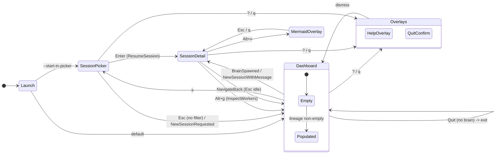
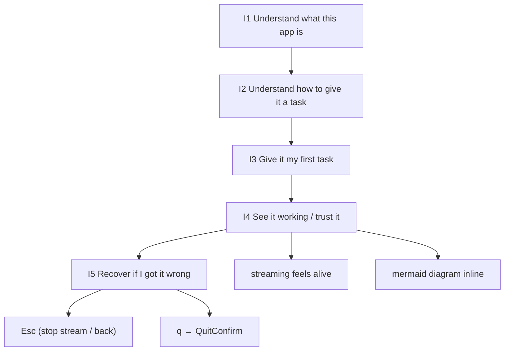
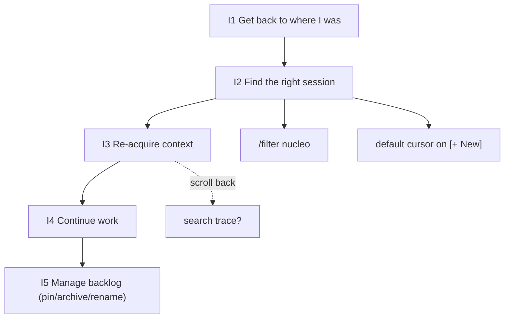
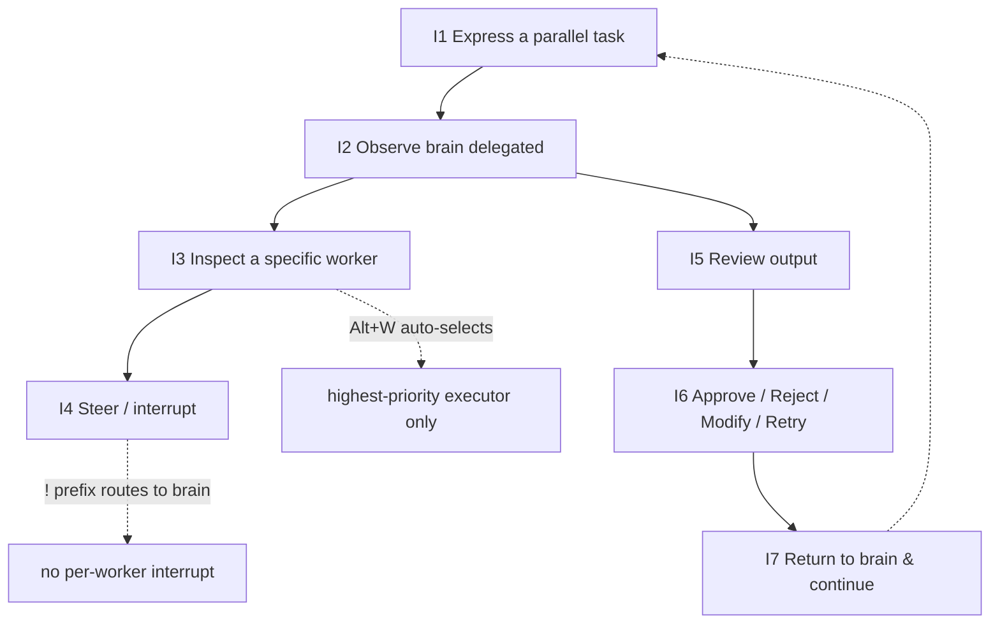

# spur-tui User Journey Audit (Hybrid)

_Date: 2026-04-19_
_Scope: `crates/spur-tui` — current state (HEAD = `87dd0d9`)_
_Personas covered: P1 first-time user · P2 returning power user · P3 orchestrator (delegate + review)_

---

## 1. Context & Scope

This is a **hybrid audit** (format C): for each step in each persona's journey, we map

> **user intent** (first-principles) → **current TUI state & code** (file:line) → **keybinding** → **gap score** → **MCTS-suggested improvement**

The document is descriptive of the TUI as it exists today; the improvement column is a prioritised roadmap input, not an implementation plan. Corresponding implementation plans should be spun off from Section 8 as separate specs.

### Non-goals

- Not a redesign of spur's agent model (brain/worker/review flow is treated as fixed).
- Not a review of the ACP / spur-core / spur-mcp layers — only the TUI-visible consequences of those layers.
- Not a keyboard-accessibility audit (screen-reader / reduced-motion / colour-blindness) — deferred.

---

## 2. Methodology

### Multi-round MCTS-style simulation

For each persona, an **intent graph** was constructed from first principles: nodes are user goals, edges are UI affordances the user must traverse. Each node was expanded with 2–3 branches (happy · friction · adversarial) and the current TUI's support was scored. Higher-uncertainty / lower-score nodes were drilled deeper (UCB-analogue). Four rounds in total — one per persona plus a cross-persona synthesis.

### Scoring rubric

| Score | Meaning |
|---|---|
| **0** | Blocker — the user cannot complete the intent |
| **1** | Friction — completable only with out-of-band knowledge or multiple retries |
| **2** | Acceptable — a patient user finds the path; affordance exists but is not optimal |
| **3** | Delightful — intent maps cleanly to a discoverable affordance |

Per-persona **avg score** is reported as a rough north-star for where to invest.

---

## 3. Global TUI State Machine

App-level view/overlay model is defined in `crates/spur-tui/src/action.rs:144-151` (`ViewId`) plus two boolean overlays on `App` (`app.rs:144`, `app.rs:146`). Key dispatch is a **priority chain** (`app.rs:355`):



**Dispatch priority chain** (`app.rs:355-427`):

```
QuitConfirm (app.rs:358-375)
    → HelpOverlay    (app.rs:377-387)
    → MermaidOverlay (app.rs:407-427)
    → View           (Dashboard | SessionPicker | SessionDetail)
```

Event loop (`app.rs:1685-1722`): `tokio::select!` over crossterm events, `broadcast::Receiver<SpurEvent>`, 33 ms tick, permission-request channel. Drain caps: 8 `SpurEvent`s/frame (`DRAIN_CAP_PER_FRAME`, `app.rs:1743`). Single `terminal.draw` per frame when `dirty` (`app.rs:1779`).

---

## 4. Persona 1 — First-time User

### 4.1 Situation

Fresh checkout, no `.spur/` metadata. User runs `spur` without flags. Goal: evaluate whether the tool can help with a real coding task.

### 4.2 Intent graph



### 4.3 Per-intent audit

| Intent | Current TUI | Keybinding | Score | Gap / MCTS suggestion |
|---|---|---|---|---|
| **I1** Understand the app | Centered splash "SPUR / Multi-agent orchestrator / Type a task below to start / Press [s] to browse sessions" on empty Dashboard (`dashboard.rs:363-428`). Help overlay lists keybindings only, no concepts (`help_overlay.rs:34-178`). | `?` opens help | **1** | User perceives chat-in-terminal; brain/worker/review concept invisible until first delegation fires. **Suggest:** first-run conceptual tour (one-shot overlay triggered on empty metadata store); enrich splash with an example prompt that showcases parallelism. |
| **I2** How to input | Inline hint line at bottom of empty bar: `[/] command · [@] mention · [!] interrupt · [Alt+I] vim · [Alt+Enter] newline · ? for help` (`dashboard.rs:183`). | — | **2** | Hint is discoverable; affordances listed are real. Minor: "interrupt" is unexplained. |
| **I2-b** Typing `/` to explore commands | Dashboard input bar is **not** wired to a completion popup (verified: `popup_open` / `CompletionPopup` absent in `dashboard.rs`; popup logic lives in `session_detail.rs:629-634, 986-1015`). User sees a plain `/` character with no list. | `/` | **1** | **HIGH-leverage gap.** Lift `CompletionPopup` + `refresh_popup` into a shared component (e.g. `ChatInput`) used by both Dashboard and SessionDetail. This is the single cheapest durable win in this audit. |
| **I3** Give the first task | Plain text + Enter dispatches `Action::NewSessionWithMessage` (`dashboard.rs:785-787`) → orchestrator spawns brain → `SpurEventBody::BrainSpawned` → `ViewId::SessionDetail` (`app.rs:656-658`). | `Enter` | **3** | Works seamlessly. |
| **I4** See it working | Markdown streams via `flush_now` every tick (`session_detail.rs:1568`). Auto-follow via `ScrollAnchor::Following` (`react_trace/types.rs:135-137`). `BrainStatus` enum (Idle/Thinking/Streaming/Ready/Error) shown in status bar (`app.rs:89-96`, `status_bar.rs:88-189`). | — | **2** | Status pill is small; first-timers may still wonder "is it stuck?" after a long Thinking phase. **Suggest:** heartbeat dot + "thinking since 3s ago" micro-timer on status bar when BrainStatus = Thinking > 2s. |
| **I4-b** Mermaid inline | Inline token `[📊 mermaid #N · press Alt-v to view]` rendered by `markdown_stream.rs:381`. Full render is async via `Action::MermaidRenderRequest` (`session_detail.rs:1413-1423`). | `Alt+v` | **3** | Strong affordance, self-documenting. |
| **I5** Recover | `Esc` while streaming stops stream; `Esc` idle → `NavigateBack` to Dashboard (`status_bar.rs:59-62` hint). `q` → `Action::Quit` → if brain attached, `QuitConfirm` dialog (`app.rs:760-762`). Dialog confirms on `y`/`Y`/`Enter`, else dismisses (`app.rs:361-370`). Draft is force-flushed before quit (`app.rs:364-366`). | `Esc`, `q`, then `y/Enter` | **2** | `Esc`-as-stream-stop is non-obvious to first-timers; status-bar hint `[Esc]stop` exists only in streaming state. Acceptable. |

**P1 avg score: ~2.0.** Top three gaps, in leverage order:

1. **Dashboard command-popup parity** (I2-b). Fix: share `ChatInput` component across Dashboard + SessionDetail.
2. **Conceptual onboarding** (I1). Fix: first-run overlay + richer splash example.
3. **Thinking-phase timer** (I4). Fix: micro-timer in status bar.

---

## 5. Persona 2 — Returning Power User

### 5.1 Situation

User has 20+ sessions in `.spur/session_metadata.json`. They closed the TUI mid-task yesterday (draft preserved). They want to continue.

### 5.2 Intent graph



### 5.3 Per-intent audit

| Intent | Current TUI | Keybinding | Score | Gap / MCTS suggestion |
|---|---|---|---|---|
| **I1** Resume last session on launch | No one-keystroke resume. `--start-in-picker` opens picker (`app.rs:227-230, 292-295`). Bare `spur` → Dashboard. `ResumeBanner` exists (`resume_banner.rs:13-18, 31-36`) but only shows AFTER a `BrainSpawned` event and **does not consume keys** — the `[s] picker · [n] new · [Esc] dismiss` line is display-only (`resume_banner.rs:51`). | `--start-in-picker` flag OR press `s` | **1** | **HIGH-leverage gap.** On launch without flag and with `last_active_session_id` fresh (<24 h), present a modal banner that consumes `y` → resume / `n` → dashboard / `Esc` → dashboard. Alternatively default to auto-resume and show an undo toast. |
| **I2** Find the right session | Picker sort: pinned first, then `updated_at` desc (`session_picker.rs:225-241`). With filter, nucleo fuzzy on `title + cwd + session_id` (`session_picker.rs:243-265`). **Default cursor = row 0 = virtual `[+ New session]`** (`session_picker.rs:163-181`) — requires one extra key-down to reach most-recent. | `j/k` nav, `/` search, `Enter` resume | **2** | **Trivial win:** set default cursor to the first real-session row (index 1 if `[+ New]` is virtual row 0). |
| **I2-b** Content-search across sessions | Not supported. Filter is metadata-only. | — | **1** | **Deferred.** Would require indexing trace text. Out of scope for a single-spec fix. |
| **I3** Re-acquire context | `SessionDetailView` opens at `ScrollAnchor::Following` → bottom of trace. Header: `Dashboard > <agent> (role) elapsed $cost` (`session_detail.rs:1666-1673`). Draft is restored in input bar from metadata (`session_detail.rs:234-239`) — **excellent** for "what was I typing?". | — | **2** | Draft restoration is the star of this flow (score 3). Overall 2 because no trace search / outline — see I3-b. |
| **I3-b** Jump to a past decision | `j`/`k` scroll 1 line when input empty (`session_detail.rs:1074-1081`); `PageUp/Down` (`session_detail.rs:1104-1109`); `g`/`G` top/bottom (`session_detail.rs:859-864`); `Ctrl+O` collapse/expand Observe entries (`session_detail.rs:879`). No find-as-you-type in trace. | `g`/`G`, `PageUp/Dn`, `Ctrl+O` | **1** | **MEDIUM suggestion:** add `Ctrl+F` find-as-you-type in trace; or an outline overlay (`Alt+o`) listing user turns + executor spawns as a jump-list. |
| **I4** Continue work | Draft present → Enter sends. History navigation: `Ctrl+P` prev / `Ctrl+N` next (`input_bar.rs:219-225`, `1184-1218`); `Ctrl+R` / `Alt+R` fuzzy history search popup (`session_detail.rs:977-983`). Ring cap 100 (`input_history.rs:9`). | `Ctrl+P/N`, `Ctrl+R` | **3** | Strong. |
| **I5** Manage backlog | Picker: `p` pin (`session_picker.rs:996-998`), `d` archive (`:999-1001`), `a` show-archived (`:1002`), `Shift+R` inline rename (`:1004-1017`), `r` refresh (`:1003`). Draft-switch confirm banner if you navigate away with unsaved draft (`session_picker.rs:791-810`). | `p`, `d`, `a`, `R`, `r` | **3** | Solid. Deferred: multi-select (`v` mark, batched op). |

**P2 avg score: ~2.1.** Top three gaps:

1. **Auto-resume-last on launch** (I1).
2. **Default picker cursor on most-recent** (I2).
3. **In-trace find / outline** (I3-b).

---

## 6. Persona 3 — Orchestrator (Delegate + Review)

### 6.1 Situation

User is in an active brain session. They ask for work that warrants parallelism ("refactor these 4 modules and write benchmarks per module"). The brain decides whether to delegate; delegation is **never user-typed** — it is driven by the brain LLM calling `spur-mcp`'s `delegate_to_worker` tool. The TUI is a downstream observer of `SpurEventBody::DelegationRequested` / `DelegationDispatched` / `ExecutorReviewRequested`.

### 6.2 Intent graph



### 6.3 Per-intent audit

| Intent | Current TUI | Keybinding | Score | Gap / MCTS suggestion |
|---|---|---|---|---|
| **I1** Express parallel task | Plain text input. No affordance hinting "you can ask for multiple things." No `/delegate` or `/parallel` slash-command (registry lookup `submit_router.rs:45-120`). | `Enter` | **1** | **Conceptual cliff.** User must already know spur orchestrates. **Suggest:** empty-state example ("Try: 'Add caching to the 3 hot endpoints and benchmark each'"); optional `/parallel <task>` slash-command that injects a system-prompt nudge to the brain. |
| **I2** Observe delegation | On `DelegationRequested`: inline `TraceKind::Delegate` entry (`session_detail.rs:1340-1353`); `DelegationDispatched` attaches `executor_id` (`session_detail.rs:1364-1366`). Workers panel appears between trace and input bar when `active > 0`, height `2 + min(active, 5)` (`workers_panel.rs:34-44`). Status bar shows `running` count (`session_detail.rs:1734-1752`). Inline executor card upgrades as phase changes (`inline_executor_card.rs:20-68`). | — | **3** | Multi-channel signalling (inline + panel + status). Strong. |
| **I3** Inspect a specific worker | `Alt+W` → `Action::InspectWorkers` → `app.rs:957-963` auto-selects highest-priority executor (`AwaitingReview=3 > Running=2 > other=1`), focuses Dashboard Agents panel, `NavigateTo(Dashboard)`. **Workers panel is display-only** (`workers_panel.rs:112-153`) — no selection state, no per-row keybinding. | `Alt+W` | **1** | **HIGH-leverage gap.** Make workers_panel rows selectable: `Alt+D` expands panel, then `j/k` navigate within it, `Enter` jumps to the selected worker's sub-session view. Also add `Alt+1..5` quick-jump shortcuts (ghost-numbered on each panel row). |
| **I4** Steer / interrupt | `!` prefix on submitted text flags `interrupt=true` (`input_bar.rs:1015-1039`), routed to **brain** session only. No per-worker interrupt surface. | `!` prefix | **2** | **MEDIUM suggestion:** when a worker row is selected in the workers panel, `!` or `i` sends an interrupt targeted at that worker's session. Requires worker-scoped input context or a prompt modal. |
| **I5** Review output | On `ExecutorReviewRequested` (`app.rs:721`), lineage transitions to `LifecycleState::AwaitingReview`; inline card upgrades to attention-state layout with diff stats + CTA (`inline_executor_card.rs:44-49`). `pending_review` count rises in status bar (`session_detail.rs:1734-1752`). Review surface is **on Dashboard** `DetailTab::Review` (not SessionDetail). `r` on Dashboard jumps to next pending review (`dashboard.rs:720`). | `r` (Dashboard) or `Alt+W` | **2** | `r` is a genuinely good affordance. Mixed score because the review surface lives on a different view than the brain session — constant Dashboard ⇄ SessionDetail churn for reviewers. See S1 in Section 7. |
| **I6** Approve / Reject / Modify / Retry | `review_card::decision_for_key`: `a` approve, `d` reject, `m` modify, `R` retry (`review_submission.rs`; `review_card.rs`). `attempt_n` read from `lineage.node.pending_review.attempt_n` (not defaulted). | `a` / `d` / `m` / `R` | **2** | `d` collides cognitively with picker-`d` (archive). Note-entry UX for reject/modify/retry is not documented in this audit (file surface not explored); **suggest** clarifying spec in a follow-up. |
| **I7** Return to brain | After review submit, `Esc` → `NavigateBack` → if session exists, Dashboard → SessionDetail (`app.rs:806-808`). Breadcrumb is only `Dashboard > <agent> (role)` in SessionDetail header. | `Esc` | **2** | **Suggest:** breadcrumb shows "← review · worker-2 (approved)" after a review trip, so the user sees evidence of the completed round-trip. |

**P3 avg score: ~1.9.** Top three gaps:

1. **Workers panel not selectable** (I3). Blocks targeted inspection.
2. **No worker-scoped interrupt** (I4). Forces navigation before steering.
3. **Delegation invisible as an intent primitive** (I1). Conceptual, not mechanical — but high strategic value.

---

## 7. Cross-Journey Systemic Findings

**S1. Two-pane split exacts a churn tax on reviewers (P3).** Dashboard owns agents_tree + issues + activity_log + detail_pane (review surface); SessionDetail owns trace + workers_panel + input. P3 continually flips between views. **Speculative fix:** pin-a-worker split inside SessionDetail (brain trace left, selected-worker trace right). High cost — defer to a separate spec.

**S2. Keybinding collisions across views increase cognitive load.** `d` = reject-review AND picker-archive. `r` = refresh-sessions (picker), next-pending-review (dashboard), and inline rename is `Shift+R`. Help overlay is hand-written (`help_overlay.rs:34-178`) and feature-gated for mermaid/issues — it is not a source-of-truth. **Suggest:** a central `KeyMap` struct generated from `Action` enum, rendered both by the dispatcher and the help overlay; adds compile-time guarantees and keeps help output in sync.

**S3. Command/mention popup parity between Dashboard and SessionDetail is missing.** Verified: `popup_open`, `refresh_popup`, `CompletionPopup` references absent in `dashboard.rs`. Users who learn `/` and `@` on SessionDetail will be silently punished on Dashboard. **Suggest:** extract shared `ChatInput` component.

**S4. Auto-resume is a half-feature.** `metadata_store.last_active_session_id` exists; `ResumeBanner` exists; but the banner renders only **after** `BrainSpawned` and does not consume keys (`resume_banner.rs:51`). There is no launch-time resume prompt. **Suggest:** implement a proper launch prompt (see P2-I1).

**S5. No in-trace search.** P2 and P3 both need this (decision-point jump, delegation-origin lookup). React-trace scroll is anchor-based (`react_trace/types.rs:135-137`) but flat. **Suggest:** `Ctrl+F` find, or an outline overlay of turn boundaries.

**S6. Delegation is invisible as a user-expressible primitive.** P3's mental model ("spur will do many things at once") has no keybinding or slash-command surface. The LLM decides — great for capability, bad for predictability. **Suggest:** `/parallel <task>` slash-command that injects an orchestration nudge into the brain prompt; purely optional, but makes the primitive visible.

**S7. Single-stream display is insufficient for multi-agent sessions.** SessionDetail trace serialises events from multiple workers inline. A **swim-lane view** — one track per executor, time-aligned — would pay off once a session has 3+ parallel workers. The `[` / `]` cycling metaphor from `MermaidOverlay` (`app.rs:410`, `mermaid_viewer.rs:74-96`) could be reused for lanes.

---

## 8. Prioritised Backlog

| Priority | Item | Affects | Leverage | Effort |
|---|---|---|---|---|
| **P-HIGH** | Command/mention popup on Dashboard input (S3) | P1, P3 | High | Low |
| **P-HIGH** | Launch-time auto-resume prompt (S4) | P2 | High | Low-Med |
| **P-HIGH** | Workers panel selectable + Enter-to-jump + `Alt+1..5` (P3-I3) | P3 | High | Medium |
| **P-MED** | Default picker cursor on most-recent session (P2-I2) | P2 | Medium | Trivial |
| **P-MED** | First-run conceptual onboarding overlay (P1-I1, P3-I1) | P1, P3 | Medium | Medium |
| **P-MED** | In-trace find / outline overlay (S5) | P2, P3 | Medium | Medium |
| **P-MED** | Thinking-phase micro-timer on status bar (P1-I4) | P1 | Low-Med | Low |
| **P-LOW** | Central `KeyMap` source-of-truth (S2) | All | Low (user) / High (maintainers) | High |
| **P-LOW** | Worker-scoped interrupt (P3-I4) | P3 | Medium | Medium |
| **P-LOW** | `/parallel` slash-command nudge (S6) | P3 | Speculative | Low |
| **DEFER** | Pin-a-worker split-screen (S1) | P3 | High | Very High |
| **DEFER** | Swim-lane multi-agent view (S7) | P3 | Medium | Very High |
| **DEFER** | Session content-search (P2-I2-b) | P2 | Medium | High |
| **DEFER** | Picker multi-select batch ops (P2-I5) | P2 | Low | Low-Med |

The three **P-HIGH** items are the recommended starting point for a follow-up implementation plan.

---

## 9. Appendix — Consolidated Keybinding Matrix

### 9.1 Dispatch priority chain (`app.rs:355-427`)

| Priority | State gate | Keys consumed |
|---|---|---|
| 1 | `quit_confirm_visible` | `y/Y/Enter` confirm; else dismiss |
| 2 | `help_visible` | `?` / `Esc` dismiss; else swallow |
| 3 | `current_view == MermaidOverlay` | `[` / `]` cycle; else forward to `MermaidViewerView::handle_key` |
| 4 | View-level | Dashboard · SessionPicker · SessionDetail |

### 9.2 Dashboard (`dashboard.rs`)

| Key | Action | Line |
|---|---|---|
| `Tab` | Cycle focus Agents → Issues → Log | `952-970` |
| `Enter` (Agents) | `FocusNode` | `920-924` |
| `Enter` (Issues) | Open issue detail overlay | `910-918` |
| `j` / `k` | Nav rows / scroll log | `685-700` |
| `r` | Jump to next pending review | `720` |
| `s` | Open session picker | `744`, `900-903` |
| `q` | `Action::Quit` | `742`, `892-895` |
| `?` | `Action::ShowHelp` | `743`, `896-899` |
| `Esc` | Unfocus / close overlay / `NavigateBack` | `972-983` |
| `←` / `→` | Cycle detail-pane tabs (node focused) | `538-547` |
| `Alt+I` | Toggle vim mode | `563-566` |
| `Ctrl+P` / `Ctrl+N` | Input history prev/next | `554-561` |
| `W` (Issues) | Work on selected issue | `703-718` |
| `I` (Agents, focused) | Open linked issue | `645-667` |
| `o/w/b/d` (issue detail) | Set issue status | `issue_detail_pane.rs:172-191` |

Empty-input hint line: `[/] command · [@] mention · [!] interrupt · [Alt+I] vim · [Alt+Enter] newline · ? for help` (`dashboard.rs:183`).

### 9.3 SessionPicker (`session_picker.rs`)

| Key | Action | Line |
|---|---|---|
| `j` / `↓` | Cursor down | `918-935` |
| `k` / `↑` | Cursor up | `918-935` |
| `Enter` | Resume / NavigateTo / NewSession (row 0) | `938-985` |
| `n` | `NewSessionRequested` | `937` |
| `/` | Focus search box | `914` |
| `Esc` (search) | Defocus search, keep filter | `891-897` |
| `Esc` (list + filter) | Clear filter | `988-991` |
| `Esc` (list, no filter) | `NavigateTo(Dashboard)` | `993` |
| `p` | `ToggleSessionPin` | `996-998` |
| `d` | `ToggleSessionArchive` | `999-1001` |
| `a` | `ToggleShowArchived` | `1002` |
| `r` | `RefreshSessions` | `1003` |
| `Shift+P` | Toggle preview pane | `849` |
| `Shift+R` | Inline rename mode | `1004-1017` |

Draft-switch confirm banner (`session_picker.rs:791-810`): `y`/`Enter` commits, anything else cancels.

### 9.4 SessionDetail (`session_detail.rs`)

Layout: header · ReactTrace · WorkersPanel · InputBar · StatusBar (`session_detail.rs:1666-1673`). Optional: resume banner / auth error banner on top.

| Key | Action | Line |
|---|---|---|
| `Enter` (non-popup) | Submit → `submit_router::route` | `1031-1050` |
| `Esc` (streaming) | Stop stream | status-bar hint |
| `Esc` (idle) | `NavigateBack` | via `Action::NavigateBack` |
| `j` (empty bar) | Scroll down 1 | `1074-1081` |
| `k` (empty bar) | Scroll up 1 | `1074-1081` |
| `g` (empty bar) | Scroll to top | `859`, `1082-1095` |
| `G` (empty bar) | Scroll to bottom | `864`, `1082-1095` |
| `PageUp` / `PageDown` | Page scroll | `1104-1109`, `react_trace/mod.rs:475-480` |
| `Ctrl+O` | Collapse/expand Observe entries | `879` |
| `Alt+v` | Open `MermaidOverlay` (when picker available) | `895-901` |
| `Alt+m` | `TogglePlanMode` | `action.rs:71` |
| `Alt+d` | Toggle workers panel | `830-833` |
| `Alt+g` | `InspectWorkers` → Dashboard | `825-827`, `app.rs:957-963` |
| `Ctrl+R` / `Alt+R` | Fuzzy history search popup | `977-983` |
| `Alt+I` | Toggle vim mode | via `Action::ToggleVimMode` |

### 9.5 InputBar — Emacs mode (`input_bar.rs:186-293`)

| Key | Action | Line |
|---|---|---|
| `Char(c)` | Insert; replaces protected range if inside | `275-278` |
| `Backspace` | Delete or atomic-delete protected range | `205-206` |
| `Delete` | Delete or atomic-delete protected range | `209-210` |
| `←` / `→` | Move; skip atoms atomically | `197-202` |
| `↑` / `↓` | Visual-line up/down (sticky goal column) | `189-195` |
| `Home` / `End` | Line head / end | `290-293` |
| `Enter` | Submit | `284-286` |
| `Alt+Enter` / `Ctrl+J` | Insert newline | `279-283`, `214-217` |
| `Ctrl+U` | Delete to line start | `228-236` |
| `Ctrl+K` | Delete to line end | `238-249` |
| `Ctrl+W` | Delete previous word | `251-274` |
| `Ctrl+P` / `Ctrl+N` | History prev / next | `219-225`, `1184-1218` |

### 9.6 InputBar — Vim modes (`input_bar.rs:296-670`)

Normal: `h j k l`, `w e b`, `0 ^ $`, `gg G`, `i a A I`, `o O`, `v V`, `d c y` (operator), `dd cc yy`, `D C`, `x`, `p`, `Ctrl+d/u/f/b/e/y`. Insert: `Esc` → Normal; `Ctrl+C` → Normal. Modes tagged in input-bar title (` VIM·NORMAL ` / ` VIM·INSERT `) with coloured border (`input_bar.rs:1256-1259`).

### 9.7 Completion popup (`session_detail.rs:986-1015`)

| Key | Action | Line |
|---|---|---|
| `↑` / `↓` | Select prev / next row | `989-994` |
| `Esc` | Dismiss popup | `997-1000` |
| `Enter` | Accept (no submit — writes token back) | `1002-1004` |
| `Tab` | Accept | `1005-1007` |
| `Ctrl+C` | Dismiss | `1008-1011` |

Trigger detection: `/` or `@` via `completion_trigger::detect` (`completion_trigger.rs:34-64`). Accept writes `{canonical_form} ` into the buffer for slash, or inserts a protected-range atom for mention (`session_detail.rs:722-741`).

### 9.8 MermaidOverlay (`mermaid_viewer.rs`, `app.rs:407-427`)

| Key | Action | Line |
|---|---|---|
| `[` / `]` | Cycle among ready diagrams | `app.rs:410`, `mermaid_viewer.rs:74-96` |
| `Esc` / `q` | `NavigateBack` → SessionDetail | `mermaid_viewer.rs:106`, `app.rs:793-796` |

No pan/zoom — viewer renders a static `StatefulImage` (ratatui-image protocol).

### 9.9 Review card (`review_card.rs`)

| Key | Decision |
|---|---|
| `a` | Approve |
| `d` | Reject (with reason) |
| `m` | Modify |
| `R` | Retry |

`attempt_n` is read from `lineage.node.pending_review.attempt_n` (`review_submission.rs:61`).

### 9.10 Quit / Help overlays

| Overlay | Trigger | Confirm | Dismiss |
|---|---|---|---|
| QuitConfirm | `Action::Quit` with brain attached (`app.rs:760-762`) | `y` / `Y` / `Enter` (`app.rs:361`) | any other key (`app.rs:368-370`) — draft force-flushed before quit (`app.rs:364-366`) |
| HelpOverlay | `?` or `/help` slash-command (`spur_local.rs:15`, `dashboard.rs:743`) | — | `?` / `Esc` (`app.rs:380-382`), swallow all else |

---

_End of audit._
