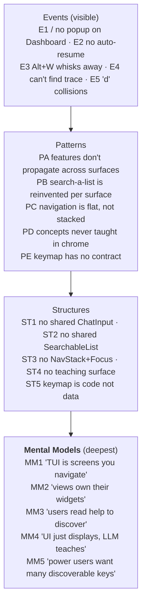

# spur-tui UX — Best Approach (Iceberg + MCTS verdict)

_Date: 2026-04-19_
_Supersedes operationally: the "5-primitive proposal" sequence in brainstorming notes_
_Depends on: `docs/superpowers/specs/2026-04-19-spur-tui-user-journey.md` (audit)_

---

## Verdict

**Ship Universal Palette (P3) + Intent Preview & Teachable Moments (P4) as a single, purely-additive deliverable in one sprint. Defer Keymap SoT (P0), Focus+Stack (P1), and Launch Bar (P2) to telemetry-driven follow-ups.**

Branch F wins with 17/18 on the MCTS scorecard below — the only approach that targets three mental-model dials, ships additively (zero regression risk), and compounds with every future feature.

---

## 1. Iceberg Analysis of the Original Audit



**Rival mental models installed by Palette + Teaching:**
- MM2 → *"primitives own themselves; views compose them"*
- MM3 → *"the UI teaches itself by showing what Enter/Esc do right now"*
- MM5 → *"one chord takes you anywhere + a few mode keys"*

---

## 2. Primitive-Depth Classification

| Primitive | Targets | Effort | Risk | Additive? |
|---|---|---|---|---|
| P0 Keymap SoT | Structure (ST5) | Medium | Low | Yes, invisible |
| P1 Focus+Stack | **MM1 + ST3** | High | **High** (breaks Esc muscle memory) | No |
| P2 Launch Bar | Event (E2) + partial MM | Medium | **High** (changes default for every user) | No |
| **P3 Universal Palette** | **MM2 + MM5 + ST1 + ST2** | Medium | Low | **Yes, purely** |
| **P4 Intent Preview + Teachable Moments** | **MM3 + MM4** | Low | Low | **Yes, purely** |

P3 and P4 are the only primitives that move deep dials AND ship additively.

---

## 3. MCTS Branch Scorecard

Six dimensions, each 0–3, max 18.

| Branch | Depth | GapRes | Additive | MusMem | Compound | Latency | **Total** |
|---|---|---|---|---|---|---|---|
| A Event-only patches | 1 | 1 | 3 | 3 | 0 | 3 | 11 |
| B Full 5-primitive | 4 | 3 | 1 | 1 | 3 | 0 | 12 |
| C Palette + P0 | 3 | 2 | 3 | 3 | 3 | 2 | 16 |
| D Refactor-only (P0+P1) | 3 | 0 | 3 | 3 | 2 | 1 | 12 |
| E Teach-only (P4) | 4 | 1 | 3 | 3 | 1 | 3 | 15 |
| **F Palette + Teach (P3+P4)** | **4** | **2** | **3** | **3** | **3** | **2** | **🏆 17** |

**Why F > C:** P4's teaching surface provides free *discoverability* for P3's palette — they compound. The palette is useless if nobody finds it; Intent Preview teaches "Ctrl+K is your friend" at the exact moment it's relevant.

**Why F > B:** B's sequenced 5-primitive rollout forces coordination across sprints with muscle-memory regression midway (P1's Esc semantics change). F ships in one sprint, zero regressions.

**Why F > E:** Teaching without new capability is cosmetic; F adds capability AND teaches it.

---

## 4. ASCII Wireframes

Width: 80 chars. Box-drawing via Unicode (matches `ratatui` default `Block::bordered`).

### 4.1 SessionDetail with Palette + Teaching integrated (baseline view)

```
╭─ Dashboard > refactor-auth (brain) · 12m 03s · $0.41 ───────────────────────╮
│                                                                              │
│  ● You  10:23                                                                │
│    Refactor the auth module to async/await and add benchmarks per           │
│    endpoint.                                                                 │
│                                                                              │
│  ◆ brain  10:23                                                              │
│    I'll split this: delegating async refactor to a specialist, and          │
│    benchmarks to another. Stand by.                                          │
│                                                                              │
│  → delegate · refactor-auth-async · running                                  │
│    💡 spur just delegated this to a specialist — Alt+D to watch workers     │
│                                                                              │
│  → delegate · benchmark-auth · awaiting review ⚠                             │
│                                                                              │
├─ workers (2 active · Alt+D to collapse) ────────────────────────────────────┤
│  ● refactor-auth-async    running           45s   $0.08   +24 -12           │
│  ⚠ benchmark-auth         awaiting review  1m12s  $0.11   +87 -3            │
├──────────────────────────────────────────────────────────────────────────────┤
│  > fix the login redirect bug▮                                               │
│  ↵ send to brain                                                             │
╰──────────────────────────────────────────────────────────────────────────────╯
 $ brain streaming · 2 workers · 1 pending      [Ctrl+K: go] · ? help · q quit
```

**What's new here vs. today:**
- **Ghost-line** under input bar (`↵ send to brain`) — always tells the user what Enter will do.
- **Teachable moment** `💡 spur just delegated this…` inline in trace — one-shot per event-type.
- **Status-bar badge** `[Ctrl+K: go]` — permanent discoverability hook.

### 4.2 Palette — empty state (Ctrl+K just pressed)

Palette is a centered modal overlay. Default results: top-ranked across all sources when query is empty.

```
              ╭─ Go to…  (Ctrl+K) ──────────────────────────────────╮
              │ > _                                                 │
              │                                                     │
              │  $  refactor-auth             session · 2h ago      │
              │  $  debug-ci-flake            session · yesterday   │
              │  !  refactor-auth-async       worker  · running     │
              │  !  benchmark-auth            worker  · awaiting rv │
              │  >  /plan                     cmd     · toggle plan │
              │  >  /review                   cmd     · open review │
              │                                                     │
              │  ↑↓ select · ↵ go · esc close · type to filter      │
              ╰─────────────────────────────────────────────────────╯
```

**Legend:** `$` session · `!` worker · `>` command · `#` trace line (MVP keeps prefixes as visual tags only; typing a prefix is a Phase-F1.5 feature, not MVP).

### 4.3 Palette — filtered query "refac"

Multi-category ranked; match segments highlighted with `▸`.

```
              ╭─ Go to…  (Ctrl+K) ──────────────────────────────────╮
              │ > refac▮                                            │
              │                                                     │
              │  $  ▸ refactor-auth           session · 2h ago      │
              │  !    refactor-auth-async     worker  · running     │
              │  $    debug-refactor-plan     session · 3d ago      │
              │  #    "…refactor the auth…"   trace   · 12 turns ago│
              │                                                     │
              │  ↑↓ select · ↵ go · esc close                       │
              ╰─────────────────────────────────────────────────────╯
```

On `Enter`:
- `$` → `Action::ResumeSession` (same path as picker).
- `!` → `Action::NavigateTo(SessionDetail(worker_session_id))` + focus that worker's session.
- `>` → `Action::SpurLocal(action)` / command registry dispatch.
- `#` → scroll current trace to that anchor and briefly highlight the line.

### 4.4 Intent Preview — ghost-line state matrix

Each block shows the input bar (top) + ghost-line (bottom) for a given state. Ghost-line is dim gray, 150 ms debounced.

```
╭─ State A: idle brain, plain text ────────────────────────────────────────────╮
│  > fix the login redirect bug▮                                               │
│  ↵ send to brain                                                             │
╰──────────────────────────────────────────────────────────────────────────────╯

╭─ State B: no session (Dashboard, empty state) ───────────────────────────────╮
│  > build a CLI for log parsing▮                                              │
│  ↵ send as new session                                                       │
╰──────────────────────────────────────────────────────────────────────────────╯

╭─ State C: brain mid-turn, `!` prefix ────────────────────────────────────────╮
│  > !wait — that's the wrong module▮                                          │
│  ↵ interrupt current turn                                                    │
╰──────────────────────────────────────────────────────────────────────────────╯

╭─ State D: idle brain, conjunction heuristic fires ───────────────────────────╮
│  > refactor A, add tests for B, and benchmark C▮                             │
│  ↵ send · brain may delegate (hint)                                          │
╰──────────────────────────────────────────────────────────────────────────────╯

╭─ State E: brain is Thinking > 2s ────────────────────────────────────────────╮
│  > _                                                                         │
│  ↵ enter to queue · brain is thinking (4s)                                   │
╰──────────────────────────────────────────────────────────────────────────────╯
```

### 4.5 Teachable Moments — inline variants

All are dismissed per-event-type forever after one view. `.spur/tutorials.json` stores dismissal state.

**T1 — first DelegationRequested ever:**

```
  → delegate · refactor-auth-async · running
    💡 spur just delegated this to a specialist — Alt+D to watch workers
```

**T2 — first AwaitingReview ever:**

```
  → delegate · benchmark-auth · awaiting review ⚠
    💡 a specialist is awaiting your review — press `r` anywhere to jump in
```

**T3 — first Mermaid fence ever:**

```
  ◆ brain  10:24
    Here's the dependency graph:
    [📊 mermaid #1 · press Alt-v to view]
    💡 Alt+v opens it full-screen — `[` / `]` cycle between diagrams
```

**T4 — after 3rd session opened, palette unused (nudge tip):**

```
              ╭──────────────────────────────────────────╮
              │ 💡 Ctrl+K jumps to any session, worker,  │
              │    command, or trace line — try it        │
              ╰──────────────────────────────────────────╯
```

Rendered as a transient toast above the status bar, auto-fades in 8s or on any keystroke.

**T5 — first `!` interrupt ever (appears next to the user's message):**

```
  ● You  10:25
    !wait — that's the wrong module
    💡 `!` prefix interrupts the current turn — use sparingly
```

### 4.6 Status bar — before vs. after

```
BEFORE (current):
$ brain streaming · 2 workers · 1 pending                          ? help · q

AFTER (with Ctrl+K badge):
$ brain streaming · 2 workers · 1 pending      [Ctrl+K: go] · ? help · q
```

The badge is always visible on every view (Dashboard, SessionPicker, SessionDetail, MermaidOverlay). Uses the same faint accent color used by `? help` today.

### 4.7 Palette invoked from Dashboard (empty-state case)

Key point: palette works from every view with zero per-view plumbing — this is how it absorbs H1 (Dashboard popup parity) for free.

```
╭─ spur ──────────────────────────────────────────────────────────────────────╮
│                                                                              │
│                            SPUR — multi-agent orchestrator                   │
│                                                                              │
│              ╭─ Go to…  (Ctrl+K) ──────────────────────────────╮            │
│              │ > bench▮                                        │            │
│              │                                                 │            │
│              │  $  ▸ benchmark-hot-paths    session · 3d ago   │            │
│              │  >    /help                  cmd     · show help│            │
│              │                                                 │            │
│              │  ↑↓ select · ↵ go · esc close                   │            │
│              ╰─────────────────────────────────────────────────╯            │
│                                                                              │
├──────────────────────────────────────────────────────────────────────────────┤
│  > _                                                                         │
│  ↵ send as new session                                                       │
╰──────────────────────────────────────────────────────────────────────────────╯
 $ brain idle · 0 workers · 0 pending            [Ctrl+K: go] · ? help · q quit
```

---

## 5. MVP Scope (one sprint, ~1500–2000 LoC net-new)

### 5.1 Palette (P3 MVP)

- `Ctrl+K` from any view opens the palette modal (global binding in `app.rs`).
- Unified ranked results via nucleo across 4 sources:
  - **Commands** — from existing `commands::registry`.
  - **Sessions** — from `metadata_store`; include cwd in the subtitle.
  - **Current-session trace** — linear scan of `ReactTrace` entries; match on text content of `append_message` / `append_think` entries.
  - **Workers in current lineage** — iterate `ExecutorLineage::nodes()`.
- Keys: `↑/↓` select · `Enter` dispatch · `Esc` dismiss · `Tab` = `Enter` for symmetry with existing popup.
- Result prefix badges (`$ ! > #`) are **display-only** in MVP. Typing a prefix does NOT filter by scope — it ranks as normal fuzzy text.
- Last query retained per-session (cleared on app quit).

**Explicitly out of MVP:**
- Scope-prefix filtering (typing `!` to scope to workers) — Phase F1.5.
- Cross-session trace indexing — Phase F2.
- Clipboard double-press prefill — Phase F2.
- Mentions in palette (mentions stay in input bar's `@` popup).

### 5.2 Intent Preview (P4 MVP)

- Ghost-line widget under input bar, height 1, dim gray, 150 ms debounced.
- Five states as wireframed in §4.4: A (send to brain), B (send as new session), C (interrupt), D (delegation hint), E (thinking timer).
- Delegation-hint heuristic: trigger only when input contains conjunctions (`and`, `then`, comma-separated enumerated items ≥3) AND brain is `Idle`. Self-disable after 3 false positives per session (user pressed Enter but brain didn't delegate).
- `SPUR_GHOST=0` env kill-switch.

### 5.3 Teachable Moments (P4 MVP)

- Ship **exactly 5 tips** (T1–T5 from §4.5). Do not add more until framework has baked for one release.
- Storage: `.spur/tutorials.json` — `{"dismissed": ["first_delegate", "first_review", ...]}`. Lock-file protected.
- Inline rendering: faint italic, 1 line, prefix `💡`, auto-fade after 10s or on any keystroke touching the trace.
- Floating nudge (T4) rendered as transient toast above status bar.
- `SPUR_TIPS=0` env kill-switch disables all teachables.

### 5.4 Files touched (rough)

**New:**
- `crates/spur-tui/src/components/palette.rs` (~500 LoC)
- `crates/spur-tui/src/components/ghost_line.rs` (~200 LoC)
- `crates/spur-tui/src/components/teachable.rs` (~300 LoC — shared framework)
- `crates/spur-tui/src/tutorials_store.rs` (~150 LoC — `.spur/tutorials.json` I/O)

**Modified:**
- `crates/spur-tui/src/app.rs` — add `Ctrl+K` global binding, palette dispatch (~100 LoC).
- `crates/spur-tui/src/components/status_bar.rs` — add `[Ctrl+K: go]` badge (~20 LoC).
- `crates/spur-tui/src/views/session_detail.rs` — wire ghost-line + teachable rendering into trace (~150 LoC).
- `crates/spur-tui/src/views/dashboard.rs` — wire ghost-line + teachable into input area (~80 LoC).
- `crates/spur-tui/src/components/input_bar.rs` — expose state hooks for ghost-line (~30 LoC).

**Tests (new):**
- `crates/spur-tui/tests/palette_fuzzy.rs` — result ranking across sources.
- `crates/spur-tui/tests/palette_dispatch.rs` — `Enter` produces correct `Action` per result type.
- `crates/spur-tui/tests/ghost_line_states.rs` — correct label per (brain_status, input_prefix, session_state).
- `crates/spur-tui/tests/teachable_dismissal.rs` — tip fires once then never again; `SPUR_TIPS=0` disables.

---

## 6. What to Explicitly NOT Do Now (and Why)

- ❌ **Launch Bar (P2)** — changes the default for every user; needs palette's `$session` scope in muscle memory first as fallback.
- ❌ **Focus+Stack (P1)** — changes `Esc` semantics; needs palette in place as non-Esc nav primitive first. `!worker` palette result absorbs ~80% of worker-drill-down use cases.
- ❌ **Keymap SoT (P0)** — YAGNI at 4 scopes. Revisit on 3rd collision bug or 6th scope.
- ❌ **In-trace search as a separate feature** — it IS the palette's trace source.
- ❌ **Onboarding tutorial / modal** — welcome-prompt + teachable moments replace it.
- ❌ **Scope prefixes in palette (MVP)** — typing-based scoping is a Phase-F1.5 optimization. Unified ranking ships first; if usage shows noisy results, add prefixes.

---

## 7. Risks & Pre-Mortem Mitigations

| Risk | Mitigation |
|---|---|
| Palette feels like "another menu" users forget | Status-bar badge permanent; T4 floating nudge after 3rd session opened without Ctrl+K use. |
| Ghost-line jitters on fast typing | 150 ms debounce; muted colors; never blinks. |
| Teachable moments feel patronizing after 5 min | Per-event-type permanent dismissal; global `SPUR_TIPS=0`; hard cap at 5 tips for MVP. |
| `brain may delegate` heuristic is wrong | Hedged language ("may"); self-disable after 3 false positives/session. |
| Trace `#` source slow on long sessions | MVP is current-session only with linear scan; nucleo matches are sub-ms. Cross-session indexing deferred. |
| Users who wanted Focus+Stack feel ignored | Public roadmap entry; palette's `!worker` scope delivers most of the value; revisit P1 post-telemetry. |
| `Ctrl+K` chord conflict with tmux/screen prefix | Rebindable once Keymap SoT ships; `Alt+.` considered as alternate only if user reports. |

---

## 8. Telemetry-Driven Follow-Up Decisions

Post-ship instrumentation to add (or repurpose existing capture):

- `palette_open_total` — Ctrl+K press count per session.
- `palette_result_category` — which scope the chosen result came from (`$`/`!`/`>`/`#`).
- `teachable_dismissal_rate` — dismissed before expiry vs. auto-faded.
- `ghost_line_prediction_accuracy` — did the user's `Enter` match the ghost-line's label?

Decision rules (evaluate 2 weeks post-ship):

| Observation | Next primitive to ship |
|---|---|
| `!` category dominates palette use | Focus+Stack (P1) is **not urgent** — defer indefinitely. |
| `$` on fresh launch (no session yet) dominates | Launch Bar (P2) is urgent — ship next. |
| 3+ keybinding collision bugs filed | Keymap SoT (P0) — ship next. |
| Ghost-line accuracy < 70% | Iterate heuristics in place; do NOT expand scope. |
| Palette open rate < 0.5/session after 2 weeks | Stronger T4 nudges; reconsider discoverability (not feature scope). |

---

## 9. One-Line Summary

> **Palette + Teaching is the deepest tractable lever — ships in a sprint, purely additive, compounds with every future feature, and defers the risky structural refactors until real usage data proves they're needed.**

---

_End of best-approach brief. Next step: implementation plan per the superpowers `writing-plans` workflow._
