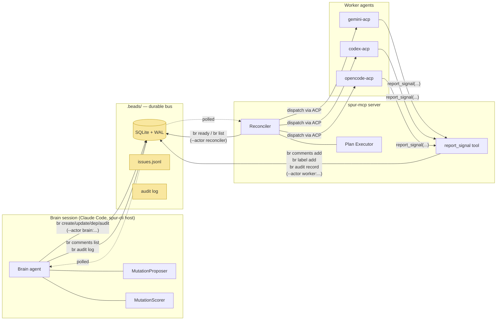
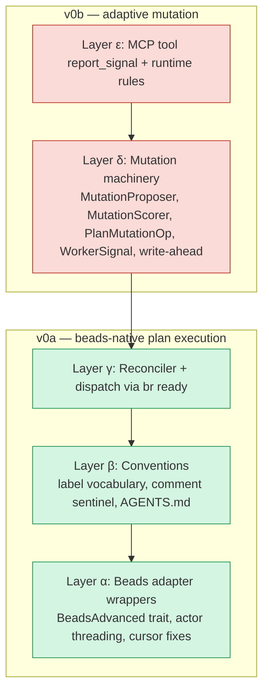
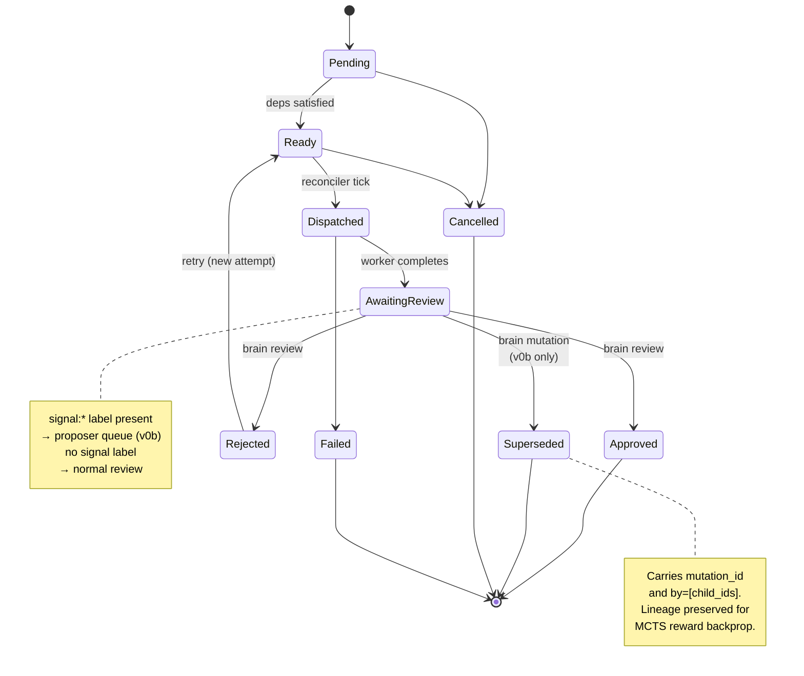
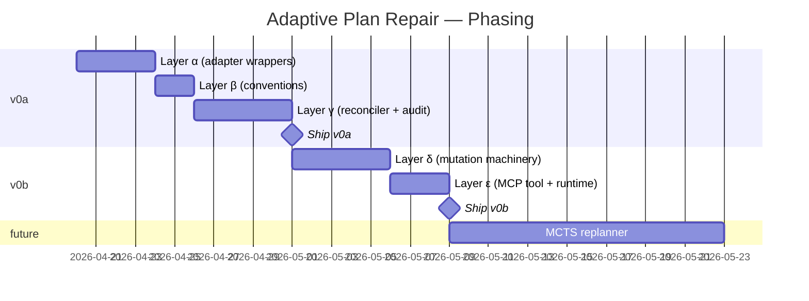

# Adaptive Plan Repair — Design

**Status:** design (rev 4, 2026-04-21)
**Date:** 2026-04-20
**Revised:** 2026-04-21

## Revision Notes

This section documents the reconciliations between the original design and the shipped v0a.2/v0a.3 implementation.

### v0a.2 Reconciliations (2026-04-21)

**(a) Audit transport: `[[spur-audit v1]]` sentinel, NOT `br audit record`**

The design specified `br audit record` as the primary audit transport. This proved empirically unsuitable — beads drops the `data` field on persist and provides no CLI to query interactions.

Shipped: audit entries are now encoded as `[[spur-audit v1]]` sentinel comments on beads issues, parsed via `crates/spur-mcp/src/plan/audit_sentinel.rs`. The JSON schema in §Information Flow → "Audit entry schema" still applies, but it's embedded in a comment body, not passed via `--data`.

**(b) v0a reconciler is observation-only**

The design described G1/G2 dispatch by the reconciler. In v0a.2/v0a.3, the reconciler observes/parity-checks beads state only — it does NOT dispatch ACP work. Dispatch lands in v0b.

**(c) `BeadsAdvanced::audit_record`/`audit_log` removed**

The design specified `BeadsAdvanced::audit_record` / `audit_log` methods. These were removed; the sentinel parser/encoder at `crates/spur-mcp/src/plan/audit_sentinel.rs` is now the audit surface.

**(d) Cursor path production-wiring (F2) and actor threading (A4)**

The design proposed fixes F1 (cursor race) and A4 (actor threading). These are implemented and verified live in v0a.2/v0a.3.

### v0a.3 Reconciliations (2026-04-21)

**(e) Reconciler spawn at server startup**

The design proposed G1 (reconciler task spawned on MCP server start). v0a.3 ships this: `Reconciler::run` is spawned via `tokio::spawn` when the server starts, gated by a `mcp.reconciler.enabled` config flag (default: true for beads backends, false for github).

### v0b Reconciliations (2026-04-21)

**(f) Beads compresses SPUR's PlanTaskStatus vocabulary.**

The design's state-machine sketch (§PlanTaskStatus state machine) treats SPUR's nine variants as if beads round-trips them. Beads does not: it persists a compressed vocabulary (`{open, closed, blocked}`). SPUR terminals (`Approved`, `Failed`, `Cancelled`, `Superseded`) all project to `closed` on write; the inverse projection is lossy. Two latent bugs shipped in early v0b because predicates matched on SPUR-vocab strings against beads-persisted status, which beads never emits — all such matches were dead code. Fixed in `fix(spur-mcp): align signal terminal-gate + watcher filter with beads vocabulary` (`e69052e`). The authoritative read is `PmService::closed_status()`; finer distinctions come from labels (`spur:superseded-by:<child>`) and audit sentinels. This is formalized as **I5** below.

**(g) Label-length cap is asymmetric.**

`br 0.1.14` enforces a 50-character label-length cap at `br create --label`, but NOT at `br label add`. Constructors whose output feeds `IssueCreate.labels` must use the compact (hyphen-free) UUID suffix (32 chars) to stay under the cap: `spur:mutation-id:<compact>` = 41 chars, safe. Constructors used only via `IssueUpdate.add_labels` (`signal_processed_label` = 54 chars) are not constrained. Pinned by `tests/labels_br_round_trip.rs::br_create_enforces_50_char_cap_but_label_add_does_not`.

**(h) Audit sentinel variants for mutation lifecycle.**

v0b ships `AuditSentinelKind` variants for the full mutation lifecycle: `Signal`, `MutationPlan`, `MutationCommit`, `MutationInvariantViolation`, `LateSignal`. All variants are `#[non_exhaustive]` (forward-compat). See `crates/spur-mcp/src/plan/audit_sentinel.rs`.

**(i) PlanTaskStatus gained `Superseded`.**

`PlanTaskStatus::Superseded { mutation_id, by }` is the in-memory representation of a task replaced by a mutation batch. Cascaded through approve, counter, and JSON serialization match arms (see `crates/spur-mcp/src/plan/mod.rs`). Folds into `Cancelled` for outcome counting (no productive outcome). Persisted to beads as `closed` + `spur:superseded-by:<child>` labels (one per child — beads labels are a set, not a CSV).

**(j) Labels consolidated on shared constructors.**

Early v0b introduced executor-private `persisted_mutation_label` / `persisted_signal_processed_label` helpers duplicated across three test files. Consolidated in `refactor(spur-mcp): unify mutation/signal-processed labels via shared constructors`. Canonical form is `spur:mutation-id:<compact-uuid>` / `spur:signal-processed:<compact-uuid>`; the pre-`spur:` form (`mutation-id:<uuid>`) was never written in practice and has been removed. `superseded-by` is emitted one label per child (not CSV), consistent with beads' set-valued label semantics.

### rev 4 Reconciliations (2026-04-21)

Rev 4 is an honesty pass. A staff-level invariant-enforcement review
(codex-acp, delegation `173069c6`) plus a brain spec-vs-code drift review
(13 forward drifts + 3 backward drifts) surfaced that rev 3 prose under-
promised on some invariants and over-promised on others. Rev 4 aligns the
spec to shipped reality; it does not redesign v0b.

**(k) I1 is partially enforced — orphan resolution on restart is v0c.**

Rev 3 stated I1 as "Brain MUST emit write-ahead … AND restart-path brain MUST resolve every orphan `mutation-plan`." Shipped v0b enforces the first half (see `mutation_executor::apply_mutation` emitting `MutationPlan` before any destructive op at `crates/spur-mcp/src/plan/mutation_executor.rs:43-53`). The restart-path orphan resolution is NOT shipped — no code walks the audit log at server startup to reconcile orphan mutations. If a brain crashes mid-`apply_mutation`, the parent remains labelled with `spur:mutation-id:<X>` and in an indeterminate ops-partially-applied state forever. Tracked as **G7** in §Known Correctness Gaps. I1's invariant statement is updated below to reflect this split.

**(l) I3 enforcement is split across handler + watcher.**

Rev 3 implied the terminal-gate in `handle_report_signal` alone enforced I3. In reality: (a) the handler's `get_issue` + status check is a fast-path informing the late-vs-non-late decision at call time; (b) the `SignalWatcher::tick_once` filter (`signal_watcher.rs:73-81`) is the authoritative enforcement at consumption — it re-checks `issue.status != closed_status()` before any proposer invocation. A TOCTOU window in the handler (task closes between the terminal check and subsequent writes) cannot trigger a late proposer call because the watcher re-gates. Rev 4 documents this split explicitly; `server.rs` also reorders the non-late path to emit the audit sentinel FIRST so partial failures are auditable (`685fdc4`).

**(m) Same-process retry suppression (G4 same-process variant).**

Rev 3 documented G4 (cross-restart retry loop) but missed the in-process variant: `SignalWatcher::tick_once` previously inserted `signal_id` into its in-memory `seen: HashSet<Uuid>` BEFORE invoking `apply_mutation`. On apply failure (transient PM error, rollback after cycle, etc.) the set was never cleared, suppressing retry of that signal for the lifetime of the brain process — not just across restarts. Fixed in `685fdc4`: `seen` is now inserted only on a decisive outcome (successful apply OR no proposer candidates); apply failures leave `seen` untouched so the next tick retries. G4 text below is updated to cover both variants.

**(n) G2 mechanics corrected.**

Rev 3 described G2 as a race "until the reconciler closes it." The reconciler is read-only (`crates/spur-mcp/src/plan/reconciler.rs:109-114`); rejection explicitly writes beads `open` status via `update_issue` and never writes a rejection-marker label. The hazard is real — a signal on a rejected-but-still-`open` task reaches the watcher — but the mechanism is "no durable marker distinguishes rejected from any other open task," not "reconciler race." Rev 4 rewrites G2.

**(o) New gaps from review: G5 scan-limit, G6 rollback-compensation audit, G7 orphan resolution.**

Three additional live gaps documented in §Known Correctness Gaps:
- **G5**: `ISSUE_SCAN_LIMIT = 10_000` in `mutation_executor.rs:17` silently truncates scans used by `downstream_issue_ids` and rollback. `685fdc4` adds a saturation warning log; pagination is the real fix, deferred.
- **G6**: Rollback failure surfaces honestly as `anyhow::bail!` but the `MutationInvariantViolation` sentinel payload does not record which compensation ops ran, so recovery requires live-state inspection.
- **G7**: I1 orphan resolution missing (see rev note (k)).

**(p) Stance-C interface refactor.**

Rev 3 spec §Interfaces duplicated Rust type definitions (`BeadsAdvanced` trait, `ReadyFilter`, `AuditRecordInput`, `AuditEntryType`, `PlanMutationOp`, `DepRewirePolicy`, etc.) that drifted from shipped code across 13 forward drifts (brain review). Rev 4 adopts "Stance C" — spec owns JSON schemas + contracts + invariants; signatures are delegated to code modules with a one-line summary + file citation. This is the pattern §Label vocabulary already uses and is the only structural way to prevent recurrence. Spec prose is updated in the §Interfaces section accordingly.

---

Original design follows below.
**Reference specs:**
- `docs/superpowers/specs/2026-04-19-brain-worker-integration-invariants.md`
- `docs/superpowers/specs/2026-04-20-async-first-delegate-migration-design.md`
- `docs/superpowers/specs/2026-04-15-brain-delegation-framework-design.md` (if present)

**Area:** `spur-pm` adapter surface · `spur-mcp` plan executor + reconciler · brain-side proposer/scorer · worker-facing MCP tool · AGENTS.md conventions

**Anchor files:**
`crates/spur-pm/src/beads.rs`, `crates/spur-pm/src/adapter.rs`, `crates/spur-pm/src/service.rs`, `crates/spur-pm/src/types.rs`, `crates/spur-mcp/src/plan.rs`, `crates/spur-mcp/src/server.rs`, `crates/spur-mcp/src/tools.rs`, `.beads/config.yaml`

**Delivery:** two phases — v0a (beads-native plan execution infrastructure) ships first, v0b (adaptive mutation on top of v0a) ships second. Both phases are scoped in this spec; each phase gets its own writing-plans cycle.

---

## Summary

SPUR today dispatches agent plans as frozen DAGs. Once `submit_plan` runs, the shape of remaining work is never re-optimized from what earlier stages discover. This spec describes the machinery — grounded in the existing beads CLI surface — that lets a brain repair a running plan's topology based on typed runtime signals from workers, persisted durably, with full audit breadcrumbs for a future MCTS-backed replanner. The architecture treats beads as the distributed communication bus: brain, worker, and MCP-server reconciler never talk directly; they all talk to beads. Per industry survey (2026 Q2), no existing LLM agent system provides durable-PM-backed runtime plan mutation; LangGraph does it in-memory, Temporal fakes it with `ContinueAsNew`, Airflow resolves at parse-time. SPUR v0 is the first.

---

## Goals and Non-Goals

### v0a goals (Phase 1 — beads-native plan execution)
- Extend `BeadsAdapter` to expose the missing `br` primitives used by the rest of the system: `ready`, `comments list/add`, `audit record/log`, `dep cycles`, `dep remove`.
- Thread `--actor` attribution through every beads call so every mutation is attributable to `brain:<session_id>` / `worker:<agent>` / `reconciler`.
- Replace the ad-hoc "is this task dispatchable" logic in the plan executor with `br ready` queries.
- Emit `br audit record` entries for every plan-affecting action (submit, dispatch, completion, approval, rejection).
- Fix two bugs discovered in `crates/spur-pm/src/beads.rs`: the `last_poll` cursor race (`beads.rs:513`) and the in-memory-only cursor (`beads.rs:149`).
- Publish the SPUR signal convention into `AGENTS.md` via `br agents --update`.

### v0b goals (Phase 2 — adaptive mutation on top of v0a)
- `WorkerSignal` typed enum; v0 variant `ScopeDrift`. One new MCP tool `report_signal` as the only new MCP surface.
- `PlanMutationOp` enum; v0 variant `SplitTask` with `DepRewirePolicy`.
- `MutationProposer` + `MutationScorer` trait seam where a future MCTS replanner slots in without callsite changes. v0 ships trivial impls.
- Brain-side write-ahead mutation protocol using `br audit record type=mutation-plan` / `type=mutation-commit`.
- Post-mutation invariant check via `br dep cycles`.

### Non-goals (explicit)
- **MCTS replanner itself.** Only the trait seam and breadcrumb schema ship; no search implementation.
- **Mid-task interrupt.** Adaptation happens at stage barriers only (`AwaitingReview`).
- **Multi-brain-session coordination.** Single brain per `.beads/` enforced by pidfile.
- **GitHub-backend parity for adaptive ops.** Adaptive mutation is beads-only in v0; GitHub adapter gracefully returns unsupported.
- **Mutation ops other than `SplitTask`.** Retarget, Coalesce, SpawnDep are named in the Generalization Map but not implemented.
- **Signal kinds other than `ScopeDrift`.** Other kinds are named in the Generalization Map but not implemented.

---

## Grounding

Verified against current code and live `br` binary (Darwin 25.1.0, repo `/Volumes/Projects/spur`):

| Claim | Evidence |
|---|---|
| `.beads/` exists with SQLite + WAL + Dolt versioning + `config.yaml`. | `.beads/` directory listing: `beads.db`, `beads.db-wal`, `beads.db-shm`, `config.yaml`, `dolt/`, `issues.jsonl`, `last-touched`, `metadata.json`. |
| `br` binary is installed. | `br --help` returns usage. |
| `BeadsAdapter::run_br` invokes the CLI per call with `--json`. | `crates/spur-pm/src/beads.rs:191-208`. |
| `IssueTracker` trait exposes only `get_issue`, `list_issues`, `create_issue`, `update_issue`, `add_dependency`, `poll`. | `crates/spur-pm/src/adapter.rs:6-15`. |
| `IssueUpdate` already carries `comment`, `add_labels`, `remove_labels`, `status`, `priority`, `assignee`. | `crates/spur-pm/src/types.rs:104-113`. |
| `IssueCreate.parent` already exists for parent-child relations. | `crates/spur-pm/src/types.rs:92-93`. |
| `br ready` lists unblocked-not-deferred issues with `--assignee`, `--label`, `--label-any`, `--priority`, `--type`, `--sort` filters. | `br ready --help` output. |
| `br comments add` / `br comments list <id>` are first-class subcommands. | `br comments --help` output. |
| `br audit record/label/log/summary` is an append-only JSONL audit system designed for agent interactions. | `br audit --help` output. |
| `br dep cycles` reports dependency cycles. | `br dep --help` output. |
| `--actor <ACTOR>` is a global flag accepted on every subcommand. | `br --help` output. |
| `br agents --update` manages AGENTS.md workflow instructions. | `br agents --help` output. |
| `BeadsAdapter::poll` historically used `last_poll: Mutex<Option<DateTime<Utc>>>` with `Utc::now()` cursor-write (race). **Fixed in v0a:** cursor is now `max(updated_at)` over the returned set; disk backing optional via `connect_with_actor(.., cursor_path)`. | `crates/spur-pm/src/beads.rs` (current cursor logic at ~`:461-468`; disk save at `save_cursor`). |
| `spur-mcp::plan` already carries a DAG executor with `PlanTask { depends_on }`, `PlanTaskStatus { Pending, Ready, Dispatched, AwaitingReview, Approved, Rejected, Failed, Cancelled }`, `AttemptRecord` history, and `review_task(approve/request_changes)`. | `crates/spur-mcp/src/plan.rs` (~3299 lines; structure confirmed). |
| `PmService::analyzer()` already exposes a beads-only extension (`BvAdapter`) via `Option<&BvAdapter>`. Precedent for the proposed `PmService::advanced() -> Option<&dyn BeadsAdvanced>`. | `crates/spur-pm/src/service.rs:163-165`. |

---

## Mental Models

These assumptions drive the whole design. Rejecting any of them collapses corresponding sections. They are named here so reviewers can challenge assumptions, not just artifacts.

**MM1 — Agent processes can crash; the system converges via level-triggered reconciliation.**
Drives write-ahead, pidfile, disk-backed cursor, audit breadcrumbs. Claude Code sessions crash (OOM, kill, network). MCP servers restart. Workers are spawned per task and die anyway. The guarantee is *eventual convergence to the plan-implied terminal state via idempotent reconcile tick over a durable event log* — NOT Temporal/DBOS-style durable-workflow replay. Brain decisions are not replayed; only state is projected and the brain re-decides with whatever signals exist at restart. Remove this machinery and we tolerate silent plan loss.

**MM2 — Plan structure is first-class mutable state (vs. cancel-and-resubmit).**
Drives `PlanMutationOp`, `SplitTask`, `DepRewirePolicy`, `Superseded` state. Alternative: "brain cancels remaining plan, submits a new plan." Simpler, but loses lineage — MCTS backprop requires the causal link between a triggering signal and the resulting subgraph; cancel-and-resubmit severs it.

**MM3 — Workers emit typed signals (vs. brain infers from summary text).**
Drives `WorkerSignal` enum, `report_signal` MCP tool, sentinel comment format. Alternative: LLM-based signal classifier over unstructured output. Typed is deterministic, cheap, reliably dedupable by `signal_id`. Worker prompts carry more coupling in exchange.

**MM4 — Adaptation happens at stage barriers, not mid-task.**
Drives `AwaitingReview` as the mutation window; workers run to completion before brain acts. Matches Spark AQE (re-optimizes between stages, not inside). Mid-task interrupt is a larger v1 design.

**MM5 — MCTS is on the roadmap; front-load breadcrumbs now.**
Drives unconditional `br audit record` emission across v0a, trait-based `MutationProposer`/`MutationScorer` in v0b, non_exhaustive enums throughout. Breadcrumb cost is near-zero (one CLI call per action); absence would create permanent data-quality debt in the future.

### Alternatives considered (documented rejections)

- **Cancel-and-resubmit instead of in-place mutation** (challenges MM2). Rejected — breaks MCTS lineage.
- **Mid-task worker interrupt** (challenges MM4). Deferred — v1 scope.
- **LLM-based signal inference** (challenges MM3). Deferred — `SignalClassifier` is a future `#[non_exhaustive]` variant consumer.
- **Direct MCP RPC for mutations (`mutate_plan` tool)** (challenges P5). Rejected — creates a second store (in-memory executor state) that diverges from beads under crash.

---

## Principles

Five postures drive every concrete choice. The spec's artifacts are instances of these principles; the principles themselves are the commitment.

- **P1 — Prefer beads primitives over custom code.** If `br` exposes a subcommand for it, wrap it — don't reimplement. `br ready`, `br audit`, `br dep cycles`, `br agents` all replace machinery we would otherwise build.
- **P2 — Additive-only, non-breaking extensions.** No modification to existing trait method signatures; no breaking changes to existing MCP tools; new capabilities live in new traits (`BeadsAdvanced`), new enum variants under `#[non_exhaustive]`, new MCP tools.
- **P3 — Make illegal states unrepresentable.** Typestate where feasible; `#[non_exhaustive]` enums; pidfile-enforced single-brain; status transitions gated by explicit rules; post-mutation invariants checked.
- **P4 — Instrument now, analyze later.** Every plan-affecting action emits a structured `br audit record` unconditionally. The consumer (MCTS replanner, dashboards, post-mortems) does not exist yet; the data must.
- **P5 — Bus-only coordination.** Brain, worker, and reconciler communicate exclusively through beads. No direct brain↔worker RPC. No in-memory authoritative state. Beads is the single source of truth; in-memory `PlanState` is a **materialized view** of it — refreshable from source, never authoritative.

---

## Architecture

### System context



**Invariant:** no arrow bypasses `.beads/`. Every cross-actor communication lands in beads first.

### Layer stack



Green = v0a (ships first, standalone value). Red = v0b (requires v0a).

### End-to-end sequence (happy path, v0a+v0b)

Reflects shipped v0b.1 reality: beads status is compressed to `{open, closed, blocked}` (I5); audit records are `[[spur-audit v1]]` sentinel comments, not `br audit record` (rev note (a)); finer state distinctions live in labels.

```mermaid
sequenceDiagram
    participant B as Brain
    participant D as .beads/ (via br)
    participant R as Reconciler
    participant W as Worker (gemini-acp)

    B->>D: br create epic bd-101 --label spur:plan-id:P1
    B->>D: br create task bd-102 --parent bd-101 --label spur:plan-task-id:T1 --label spur:agent:gemini-acp
    B->>D: br create task bd-103 --parent bd-101 --label spur:plan-task-id:T2
    B->>D: br dep add bd-103 bd-102
    B->>D: br comments add bd-101 "[[spur-audit v1]] {kind: PlanSubmit, ...}"

    Note over R: reconciler tick (every 3s, adaptive)
    R->>D: br ready --label-any spur:plan-task-id:T1
    D-->>R: [bd-102]
    R->>D: br label add bd-102 delegation-id:del-A
    R->>D: br comments add bd-102 "[[spur-audit v1]] {kind: Dispatch, ...}"
    R->>W: ACP dispatch bd-102

    W-->>R: (mid-task) report_signal(bd-102, ScopeDrift{...})
    Note over R: non-late path: audit FIRST, then operational writes<br/>(I3 fast-path; see §report_signal)
    R->>D: br comments add bd-102 "[[spur-audit v1]] {kind: Signal, ...}"
    R->>D: br comments add bd-102 "[[spur-signal v1]] {signal_id: sig-U1, ...}"
    R->>D: br label add bd-102 signal:scope-drift

    W-->>R: ACP completion
    Note over R: v0c will write labels::READY_FOR_REVIEW here<br/>(G1 fix — not shipped in v0b)
    R->>D: br comments add bd-102 "[[spur-audit v1]] {kind: Completion, ...}"

    Note over R: signal watcher tick
    R->>D: br list (filter: status != closed, label signal:*, no spur:signal-processed:*)
    D-->>R: [bd-102 open, signal:scope-drift]
    R->>D: br comments list bd-102
    D-->>R: [..., [[spur-signal v1]] body, ...]
    Note over R: dedupe by signal_id (in-memory seen set);<br/>invoke proposer + scorer (brain-side)

    B->>D: br comments add bd-102 "[[spur-audit v1]] {kind: MutationPlan, mutation_id: mut-V, ...}"
    B->>D: br create bd-201 --parent bd-102 -l spur:mutation-id:<compact-uuid>
    B->>D: br create bd-202 --parent bd-102 -l spur:mutation-id:<compact-uuid>
    B->>D: br dep add bd-202 bd-201
    B->>D: br dep remove bd-103 bd-102
    B->>D: br dep add bd-103 bd-202
    B->>D: br update bd-102 --status closed
    B->>D: br label add bd-102 spur:superseded-by:bd-201
    B->>D: br label add bd-102 spur:superseded-by:bd-202
    B->>D: br dep cycles
    D-->>B: (no cycles)
    B->>D: br comments add bd-102 "[[spur-audit v1]] {kind: MutationCommit, mutation_id: mut-V, ...}"
    B->>D: br label add bd-102 spur:signal-processed:<compact-uuid>

    Note over R: next tick — bd-201 is ready
    R->>D: br ready ...
    D-->>R: [bd-201]
    R->>W: ACP dispatch bd-201
```

SPUR's nine-state `PlanTaskStatus` (Dispatched, AwaitingReview, Approved,
Superseded, etc.) is in-memory only; the beads column only sees
`open | closed | blocked`. Distinctions are recovered from labels and
audit sentinels per I5.

### PlanTaskStatus state machine



### Mutation write-ahead flow (v0b)

Reflects shipped transport: audit records are `[[spur-audit v1]]` sentinel comments on the trigger task. See `crates/spur-mcp/src/plan/mutation_executor.rs::apply_mutation`.

```mermaid
flowchart TD
    S[Signal observed by brain<br/>via SignalWatcher] --> P[MutationProposer.propose]
    P --> C{candidates empty?}
    C -->|yes| NoOp[seen.insert; no-op<br/>STOP]
    C -->|no| Sc[MutationScorer.score → pick highest]
    Sc --> WA[add_comment [[spur-audit v1]]<br/>kind=MutationPlan<br/>mutation_id=mut-V]
    WA --> Ex[Execute batch ops:<br/>create children ×N with spur:mutation-id:mut-V label<br/>dep add/remove per DepRewirePolicy<br/>update parent --status closed<br/>label spur:superseded-by:child per child]
    Ex --> Inv[adv.dep_cycles<br/>+ fallback parse for br stderr format]
    Inv --> Cycle{cycles found?}
    Cycle -->|yes| Rb[rollback_mutation: reverse ops<br/>add_comment [[spur-audit v1]]<br/>kind=MutationInvariantViolation<br/>STOP]
    Cycle -->|no| CM[add_comment [[spur-audit v1]]<br/>kind=MutationCommit<br/>mutation_id=mut-V]
    CM --> PL[label parent spur:signal-processed:mut-V]
    PL --> Done[Done]
    Rb --> Retry[Signal retried on next tick<br/>G4 same-process: fixed 685fdc4<br/>G4 cross-restart: v0c scope]

    classDef audit fill:#fdebd0,stroke:#b9770e
    class WA,CM,Rb audit
    classDef gap fill:#fadbd8,stroke:#c0392b
    class Retry gap
```

**Crash-recovery rule:** on brain restart, walk `br audit log` for every plan-epic; any orphan `mutation-plan` (no matching `mutation-commit` or `mutation-invariant-violation` by the same `mutation_id`) is resolved per Invariant I1's orphan-resolution rule — complete OR cancel, never two orphans concurrent. Every op in a batch is designed idempotent: `br create` is not intrinsically idempotent, but mutation-id labels let us detect already-created children; `br dep add/remove` is idempotent; `br update --status` is idempotent. Replay therefore converges.

### Concept peers

For readers placing this design against known systems:

| My term | LangGraph | Temporal / DBOS | Kubernetes | HTN literature |
|---|---|---|---|---|
| Plan | `StateGraph` | Workflow* | Custom Resource | Plan / task network |
| Task | Node | Activity | Pod | Method |
| Brain session | (runtime host) | Worker | Controller | Planner |
| Reconciler tick | (n/a; in-memory) | (n/a) | Reconcile loop | Monitor |
| Plan mutation (via beads edits) | `Send` + `update_state` | (no analog; `ContinueAsNew` is a workaround) | `Apply` manifest | Plan repair |
| `mutation-plan` / `mutation-commit` pair | (n/a) | (n/a) | Finalizer | Commit / abort |
| `WorkerSignal` | (via `interrupt`) | Signal | Event | Observation |
| `SplitTask` | `Send` fanout | (n/a) | (n/a) | Task decomposition |
| `br audit` event log | Checkpointer | History log | etcd audit | Plan trace |
| Durability guarantee | In-memory | Deterministic replay | State reconciliation | (n/a) |

\* Temporal's "workflow" implies deterministic replay. SPUR's plan does NOT — the brain is an LLM. Named explicitly to prevent misreading.

---

## Invariants

The four load-bearing rules. Each has a test spec (see Test Plan).

**I1 — Write-ahead before any destructive op (+ orphan resolution on restart; partial enforcement).**

Brain MUST emit an `[[spur-audit v1]]` sentinel of kind `MutationPlan` before executing any op of batch X. Any op executed without a preceding `MutationPlan` sentinel is a bug. The `MutationPlan` / `MutationCommit` pair is a **Kubernetes-style finalizer**: the reconciler should treat any `MutationPlan` without a matching `MutationCommit` (or `MutationInvariantViolation`) as an in-flight mutation to either complete or cancel; parent tasks bearing `spur:mutation-id:<X>` labels without a matching commit sentinel are held from terminal-status transitions.

**Enforcement status (v0b ship):**
- **Write-ahead half — ENFORCED.** `mutation_executor::apply_mutation` emits `MutationPlan` via `audit_encode` + `add_comment` before the op loop (`crates/spur-mcp/src/plan/mutation_executor.rs:43-53`). Integration test `tests/mutation_write_ahead.rs` verifies.
- **Restart orphan-resolution half — NOT SHIPPED.** No code walks the audit log on server startup to reconcile orphan `MutationPlan` sentinels. If the brain crashes between `MutationPlan` emission and `MutationCommit`, the parent remains in a partially-applied indeterminate state — tracked as **G7** in §Known Correctness Gaps. The hold-from-terminal behavior is also unenforced (no code checks `spur:mutation-id:` labels at status transitions).

**Durability contract:** sentinel comments are durable-on-return only because beads runs in default SQLite WAL mode (`.beads/beads.db-wal` confirms). SPUR v0 requires this mode. `br --no-db` (JSONL-only) is NOT supported; the WAL guarantee I1 depends on does not hold.

**Orphan-resolution rule (restart path, v0c target):** on brain startup, for every orphan `MutationPlan` (no matching `MutationCommit` or `MutationInvariantViolation` by the same `mutation_id`), brain MUST either (a) complete it by executing remaining ops and emitting `MutationCommit`, OR (b) emit a `MutationCancelled` sentinel before starting any new mutation on the same parent. INVARIANT: no parent task ever has two orphan `MutationPlan` sentinels with different `mutation_id`s concurrently. The `MutationCancelled` variant does not yet exist in `AuditSentinelKind` — adding it is part of the G7 fix.

Enforcement (target): unit test asserts the brain-side mutation helper always emits the sentinel first (shipped — `tests/mutation_write_ahead.rs`); integration test simulates crash between `MutationPlan` and first op, verifies restart completes or cancels before any new mutation (**v0c**); integration test simulates two competing `MutationPlan` sentinels on the same parent and asserts the cancel path fires (**v0c**).

**I2 — Post-mutation acyclicity.**
After committing any mutation batch, brain MUST call `br dep cycles`. If a cycle exists, brain MUST emit `type=mutation-invariant-violation` and run the compensating rollback encoded in the mutation-plan record. Enforcement: integration test inserts a SplitTask whose `DepRewirePolicy::Explicit` creates a cycle; asserts rollback completes and state is equivalent to pre-mutation. (Note: `br dep cycles` is first-class — we rely on beads' native detector, not a reimplementation.)

**I3 — Late-signal safety (split enforcement: handler fast-path + watcher re-gate).**

A signal arriving on a task whose beads status is terminal (via `PmService::closed_status()`) MUST NOT trigger the proposer. Per I5, the gate compares against the beads-persisted value, not SPUR-vocab strings.

**Enforcement (shipped v0b):** authoritative enforcement is in **`SignalWatcher::tick_once`** (`crates/spur-mcp/src/plan/signal_watcher.rs:73-81`), which re-checks `issue.status != closed_status()` at consumption time before any proposer invocation. `handle_report_signal` (`crates/spur-mcp/src/server.rs:475`) also checks at recording time and routes to the late-arrival path (`signal:late-arrival` label + `LateSignal` audit sentinel, NO `[[spur-signal v1]]` comment) when terminal — this is a **fast-path**, not the authoritative gate.

**TOCTOU note:** the handler's initial `get_issue` check and the subsequent operational writes are NOT transactional (beads has no transactions). If a task transitions to closed between the check and the writes, the handler records a non-late signal on a now-closed task. This is safe because the watcher's status-at-tick-time re-check at consumption catches it (proposer is never invoked). Commit `685fdc4` additionally reorders the non-late path to emit the audit sentinel first, so partial failures are at least auditable.

Enforcement tests: `tests/signal_late_arrival.rs` (handler-side terminal gate via `br close`), `tests/report_signal_tool.rs` (open-task + terminal-task fixtures).

**I4 — Single brain session per `.beads/`.**
At most one brain session holds the pidfile `.beads/.spur-brain.pid` at any time. Any brain startup MUST acquire the pidfile or refuse to start. Enforcement: unit test with a stale pidfile (process absent) — startup should take the pidfile. Second unit test with a live pidfile (process present) — startup should refuse with a specific error.

**I5 — Vocabulary compression (beads status is lossy).**
Beads persists a compressed status vocabulary — `{open, closed, blocked}` — into which SPUR's nine-state `PlanTaskStatus` projects on write. `Approved`, `Failed`, `Cancelled`, and `Superseded` all project to `closed`; the inverse mapping is NOT recoverable from `issue.status` alone. Any predicate that classifies task lifecycle state MUST read beads status via `PmService::closed_status()` and recover finer distinctions from labels (`spur:superseded-by:<child>`, `spur:signal-processed:<mutation_id>`, `signal:late-arrival`) and audit sentinels (`[[spur-audit v1]]` JSON bodies). Predicates that match on SPUR-`PlanTaskStatus` string variants (`"awaiting_review"`, `"approved"`, `"failed"`, `"cancelled"`, `"superseded"`) against beads-persisted status are dead code and MUST be removed; beads never emits those strings. Enforcement: integration tests `tests/report_signal_tool.rs` and `tests/signal_late_arrival.rs` use `br close` (the production terminal-transition path) and assert against `pm.closed_status()`, not SPUR-vocab literals.

---

## Information Flow

This is the highest-leverage surface in the design (per iceberg Level 6 analysis). Every future analysis tool — MCTS replanner, dashboards, post-mortem tooling — depends on these schemas. They are versioned and must be forward-compatible.

### Vocabulary compression: SPUR has 9 states; beads has 3

Before anything else, recognize that **beads persists a compressed status vocabulary** — `{open, closed, blocked}` — while SPUR's `PlanTaskStatus` has nine variants (`Pending`, `Dispatched`, `AwaitingReview`, `Reviewing`, `Approved`, `Rejected`, `Failed`, `Cancelled`, `Superseded`). The projection is lossy: `br show` never returns `"awaiting_review"` or `"approved"`; it returns `"open"` or `"closed"`. Bridge via labels + audit sentinels, not status strings. See **I5** above.

Concretely:
- **Status column** (authoritative for terminal/non-terminal check): `PmService::closed_status()` returns the beads value that means "no further work." Compare against this — never against SPUR-vocab strings.
- **Finer distinctions** (approved vs. failed vs. superseded): recovered from labels (`spur:superseded-by:<child>`, `spur:signal-processed:<mutation_id>`, `signal:late-arrival`) and audit sentinels (`[[spur-audit v1]]` JSON bodies: `MutationCommit`, `MutationInvariantViolation`, `LateSignal`, `Signal`, `MutationPlan`).
- **In-memory PlanTaskStatus**: reconstructed from beads status + labels + sentinels when the brain materializes `PlanState`. The nine-variant enum is a brain-side concept; beads never sees it as a string.

### Operational reads vs. analytical reads

beads offers two orthogonal read paths. Naming them separately prevents confusion:

- **Operational reads** (authoritative for dispatch, mutation, and invariant decisions): the state store — `br list`, `br show`, `br ready`, `br dep tree`. This is what the reconciler projects into the `PlanState` materialized view. Any operational decision must read this path.
- **Analytical reads** (authoritative for causal history and reward attribution): the event log — `[[spur-audit v1]]` sentinel comments, parsed via `crates/spur-mcp/src/plan/audit_sentinel.rs`. MCTS replanner, dashboards, post-mortems consume this. Analytical reads MUST NOT drive operational behavior.

When the two disagree — e.g., an audit sentinel shows a `mutation-commit` but `br list` shows the parent still open — the **state store wins**; the reconciler converges it on the next tick. This is the Datomic / Kafka-materialized-view pattern: dual representation, one authority per purpose.

### Audit entry schema (v0b, via `[[spur-audit v1]]` sentinel comments)

Every plan-affecting action emits one structured record, encoded as a
comment body starting with the sentinel prefix `[[spur-audit v1]]`
followed by a JSON object. Revision note (a) documents why `br audit
record` was rejected as the transport. Encoder / parser:
`crates/spur-mcp/src/plan/audit_sentinel.rs`.

The envelope wraps the payload via serde's tag/content pattern. Adding a
new variant is a non-breaking extension — see `AuditSentinelKind::Unknown`
for the forward-compat deserialization guarantee.

```
[[spur-audit v1]]
{
  "kind": "Signal | MutationPlan | MutationCommit | MutationInvariantViolation | LateSignal | Dispatch | Completion | Approval | Rejection | PlanSubmit | OrphanDepDetected | Unknown",
  /* kind-specific fields inlined at the top level */
}
```

Attribution (`actor`, `timestamp`, `issue_id`) is recovered from the
surrounding beads comment metadata — not duplicated in the JSON payload.

Per-kind payload fields (authoritative in `audit_sentinel.rs`; shown here
for schema review):

| `kind` | Payload fields |
|---|---|
| `PlanSubmit` | `{ plan_id, epic_issue_id, task_ids }` |
| `Dispatch` | `{ delegation_id, worker, attempt }` |
| `Completion` | `{ delegation_id, worker_branch, diff_summary }` |
| `Approval` | `{ delegation_id }` |
| `Rejection` | `{ delegation_id, feedback }` |
| `Signal` | `{ signal_id, kind, severity, reason }` (mirrors `[[spur-signal v1]]` comment payload) |
| `MutationPlan` | `{ mutation_id, op, trigger_signal_id, trigger_task_id }` |
| `MutationCommit` | `{ mutation_id, children_created: [...] }` |
| `MutationInvariantViolation` | `{ mutation_id, violation, rollback_status }` (see G6 for payload gap) |
| `LateSignal` | `{ signal_id, terminal_status }` |
| `OrphanDepDetected` | `{ orphan_task_id, missing_dep }` |
| `Unknown` | `{ kind: String, raw: serde_json::Value }` — forward-compat capture |

### Signal schema (v0b, via `[[spur-signal v1]]` comment + `signal:*` label)

Brain MUST NOT rely solely on labels; labels are summary, comment is authoritative.

**Label form:** `signal:<kind>` (detectable) plus optional `signal:<kind>:<bucket>` (e.g., `signal:scope-drift:high`).

**Comment form:**

    [[spur-signal v1]]
    {
      "signal_id": "<uuid-v4>",
      "kind": "scope_drift",
      "severity": 0.82,
      "reason": "auth refactor pulls in 4 new subsystems",
      "estimated_subtasks": 3
    }

`signal_id` MUST be a UUID-v4 generated by the worker (or by the MCP server inside `report_signal`). Brain dedupes by `signal_id` across polls.

Adding a new signal kind is a non-breaking additive change; `WorkerSignal` enum is `#[non_exhaustive]`.

### Label vocabulary

Canonical forms, as shipped. Constructors in `crates/spur-mcp/src/plan/labels.rs`
are the single source of truth — callers MUST NOT format these by hand.

| Label | Purpose | Set by | Path |
|---|---|---|---|
| `spur:plan-id:<id>` | plan scope marker | brain at plan submit | create |
| `spur:plan-task-id:<id>` | task scope marker | brain at plan submit | create |
| `spur:plan-complete` | epic fully persisted (all children + deps created) | server on epic creation | label-add |
| `spur:agent:<name>` | worker agent assignment | brain at plan submit | create |
| `spur:source-issue:<id>` | source issue reference | server at plan submit | create |
| `delegation-id:<id>` | ACP delegation link | reconciler on dispatch | label-add |
| `signal:<kind>` | signal present (fast filter) | `report_signal` | label-add |
| `signal:<kind>:<bucket>` | severity bucket (optional) | `report_signal` | label-add |
| `signal:late-arrival` | signal arrived after terminal (see I3/I5) | brain signal handler | label-add |
| `spur:mutation-id:<compact-uuid>` | created as part of a mutation batch | brain mutation executor | **create** (compact required — 41 chars, under 50-char cap) |
| `spur:superseded-by:<child-id>` | parent task split marker — one label per child (beads labels are a set) | brain on mutation commit | label-add |
| `spur:signal-processed:<compact-uuid>` | proposer consumed this task's signal | brain mutation executor | label-add (54 chars — label-add-only; would exceed `br create` cap) |
| `ready-for-review` | explicit review-ready marker | **NOT YET WIRED** — defined as a constant, no writers (see §Known Correctness Gaps G1) | label-add (future) |

**Length-cap note (br 0.1.14):** `br create --label` enforces a 50-character
cap; `br label add` does not. The `create` / `label-add` column above
documents the path each label uses. Changing a constructor from label-add to
create-path requires verifying the output stays ≤50 chars.

---

## Interfaces

Per rev 4 Stance C: this section owns contracts, method semantics, and
JSON schemas. Rust signatures live in code and are not duplicated here —
follow the file citations for authoritative definitions. The §Label
vocabulary section uses the same pattern.

### `BeadsAdvanced` trait — v0a

Beads-only extension. Exposed via `PmService::advanced() -> Option<&dyn BeadsAdvanced>`, parallel to the existing `PmService::analyzer()` pattern. `GitHubAdapter` does not implement.

**Authoritative definition:** `crates/spur-pm/src/advanced.rs`.

| Method | Purpose | Backing CLI |
|---|---|---|
| `list_ready(filter: ReadyFilter)` | Unblocked-not-deferred issues matching filter | `br ready --label ... --assignee ... --limit ...` |
| `list_comments(issue_id)` | All comments for an issue, chronological | `br comments list <id>` |
| `add_comment(issue_id, body)` | Append a comment (used as audit sentinel transport) | `br comments add <id> <body>` |
| `remove_dependency(issue_id, depends_on_id)` | Remove a dep edge | `br dep remove <issue_id> <depends_on_id>` |
| `dep_cycles()` | All cycles in the current dep graph; empty when acyclic | `br dep cycles` |

**Removed since design inception:** `audit_record` + `audit_log` methods + `AuditRecordInput` / `AuditEntryType` / `AuditEntry` types. Rev note (a) explains: beads drops the `data` field on persist; we switched to `[[spur-audit v1]]` sentinel comments. The audit surface now lives in `crates/spur-mcp/src/plan/audit_sentinel.rs` as the `AuditSentinelKind` enum.

**`ReadyFilter` shape (authoritative in code):** `crates/spur-pm/src/advanced.rs`. Fields include `assignee`, `labels_all`, `labels_any`, `issue_type`, `priorities: Vec<i32>` (set-membership over priority values), `limit`. Derives `Default`.

### `AuditSentinelKind` — v0b (replaces removed `AuditEntryType`)

**Authoritative definition:** `crates/spur-mcp/src/plan/audit_sentinel.rs`.

The enum is `#[non_exhaustive]` at the enum level (external consumers must use `_ =>` catch-all). Variants:

| Variant | Emitted by | Role |
|---|---|---|
| `PlanSubmit` | brain at plan submit | plan-creation breadcrumb |
| `Dispatch` | reconciler on worker dispatch | worker-handoff record |
| `Completion` | reconciler on worker completion | worker-return record |
| `Approval` | brain on review approval | brain-decision record |
| `Rejection` | brain on review rejection | brain-decision record |
| `Signal` | `report_signal` handler (non-late path) | signal recording, paired with `[[spur-signal v1]]` operational comment |
| `MutationPlan` | `apply_mutation` write-ahead (I1) | finalizer open |
| `MutationCommit` | `apply_mutation` on success | finalizer close |
| `MutationInvariantViolation` | `apply_mutation` on cycle detection (I2) | rollback audit (see G6 for payload gap) |
| `LateSignal` | `report_signal` handler (late path, I3) | terminal-task signal record |
| `OrphanDepDetected` | reconciler on missing-dep observation | triage breadcrumb |
| `Unknown { kind, raw }` | deserialization fallback (forward-compat) | strong guarantee: old readers round-trip new sentinel kinds via raw JSON capture |

Comment format is `[[spur-audit v1]]\n<json>` where `<json>` carries the variant tag + payload per `serde(tag = "kind")`. Encoder: `audit_sentinel::encode_comment`. Parser: `audit_sentinel::parse_comment`.

### Actor threading (v0a, additive)

**Authoritative:** `crates/spur-pm/src/beads.rs` — `BeadsAdapter::connect_with_actor(repo_root, default_actor, cursor_path)` and private `run_br_as(args, actor_override)`. The existing `BeadsAdapter::connect` delegates to `connect_with_actor(..., None, None)`, preserving behavior. Every `run_br` call appends `--actor <actor>` when set.

### Cursor fixes (v0a, additive + bugfix)

**Authoritative:** `crates/spur-pm/src/beads.rs:461-468` for F1; `crates/spur-pm/src/beads.rs` `save_cursor` / `connect_with_actor` for F2.

- **F1 (race, shipped):** cursor is set from `max(updated_at)` over the returned set (not `Utc::now()`), eliminating the gap-between-fetch-and-cursor-write race.
- **F2 (disk-backed restart, shipped):** `connect_with_actor` accepts `cursor_path: Option<PathBuf>`; if set, cursor is read on connect and flushed via `save_cursor` after each `poll` — best-effort (errors logged, not fatal).

### MCP tool `report_signal` — v0b

**Authoritative handler:** `crates/spur-mcp/src/server.rs::handle_report_signal` (~line 447).

- **Tool name:** `report_signal`
- **Arguments:** `{ task_id: string, signal: WorkerSignal }`
- **Returns:** `{ recorded: bool, signal_id: string, late: bool }`

**Behavior (shipped in v0b.1):**

1. Fetch task via `PmService::get_issue(task_id)`.
2. Check `issue.status == pm.closed_status()` (per I5; see also I3 split enforcement).
3. **Late path (terminal task):**
   - Emit `[[spur-audit v1]]` sentinel of kind `LateSignal { signal_id, terminal_status }` via `adv.add_comment`.
   - Add label `signal:late-arrival` via `update_issue`.
   - Return `{ recorded: true, late: true }`. No `[[spur-signal v1]]` operational comment is emitted (by design — the proposer must never see a late signal).
4. **Non-late path (open task):**
   - Emit `[[spur-audit v1]]` sentinel of kind `Signal { signal_id, kind, severity, reason }` FIRST (audit-before-operational-writes; makes partial failures auditable; see I3 TOCTOU note).
   - Emit `[[spur-signal v1]]\n<json>` operational comment via `adv.add_comment` (this is what the brain-side proposer consumes).
   - Add label `signal:<kind>` via `update_issue`.
   - Return `{ recorded: true, late: false }`.

**Two-comment emission rationale:** operational reads (proposer consumers) use `[[spur-signal v1]]`; analytical reads (MCTS, dashboards) use `[[spur-audit v1]]`. Splitting the two surfaces lets each evolve independently — see §Operational reads vs. analytical reads and the rev 4 "Stance C" discussion.

### `WorkerSignal` — v0b

**Authoritative definition:** `crates/spur-mcp/src/plan/signals.rs`. `#[non_exhaustive]` at enum level. Variants tagged via `serde(tag = "kind", rename_all = "snake_case")`.

| Variant | Fields | Purpose |
|---|---|---|
| `ScopeDrift` | `signal_id: Uuid`, `severity: f32`, `reason: String`, `estimated_subtasks: Option<u8>` | Worker detects the task's scope is larger than the plan anticipated |

Future variants (named in §Generalization Map but not shipped): `SkewDetected`, `ConfidenceDrop`, `CostOverrun`, `DependencyDiscovered`. Adding them is a non-breaking extension.

### `PlanMutationOp` + `DepRewirePolicy` — v0b

**Authoritative definitions:** `crates/spur-mcp/src/plan/mutation.rs`. Both `#[non_exhaustive]` at enum level.

| `PlanMutationOp` variant | Fields | Purpose |
|---|---|---|
| `SplitTask` | `parent: String` (beads issue ID), `children: Vec<TaskDraft>`, `dep_rewire: DepRewirePolicy` | Replace parent with a subplan of `children` wired per `dep_rewire` |

Note: fields use `String` for issue IDs (not a typed `TaskId` newtype — SPUR uses `String` workspace-wide). `children` are `TaskDraft` (title + description + assignee + priority), not the richer in-memory `PlanTask` — a proposer authors mutations, not complete plan nodes.

| `DepRewirePolicy` variant | Fields | Semantics |
|---|---|---|
| `Pipeline` | `tail_index: usize` | Children form a sequential chain; original downstream rewires to `children[tail_index]` |
| `Barrier` | — | Children are parallel; original downstream waits on ALL to complete |
| `Explicit` | `edges: Vec<(usize, String)>` | Caller supplies `(child_index, downstream_task_id)` pairs |

Note: `Pipeline.tail_index` and `Explicit.edges[].0` are indices into the `children` array, not task IDs — at propose-time, children do not yet have IDs. The executor resolves indices to IDs at apply-time.

**`MutationBatch`:** `crates/spur-mcp/src/plan/mutation.rs`. Fields: `mutation_id: Uuid`, `trigger_signal_id: Option<Uuid>`, `trigger_task_id: String`, `ops: Vec<PlanMutationOp>`.

**`TaskDraft`:** `crates/spur-mcp/src/plan/mutation.rs`. Fields: `title`, `description`, `assignee: Option<String>`, `priority: Option<i32>`.

### `MutationProposer` + `MutationScorer` — v0b trait seam

**Authoritative definitions:** `crates/spur-mcp/src/plan/proposers.rs`. Both `#[async_trait]`.

- `MutationProposer::propose(state: &PlanState, signal: &WorkerSignal, triggering_task: &str) -> Vec<MutationBatch>`.
- `MutationScorer::score(state: &PlanState, batch: &MutationBatch) -> f32`.

**v0b impls (same module):**
- `ScopeDriftSplitProposer { severity_threshold: f32 }` (default 0.5) — `ScopeDrift` signals above threshold produce one `SplitTask` with `estimated_subtasks.unwrap_or(2)` children.
- `TrivialScorer` — returns 1.0 for any non-empty batch, 0.0 for empty.

**v1 substitution target:** MCTS replanner ships as alternate impls; `SignalWatcher<P, S>` callsite at `crates/spur-mcp/src/plan/signal_watcher.rs` is unchanged. Note: `stub_plan_state()` at `signal_watcher.rs:158` is a placeholder `PlanState` — real MCTS proposers will require brain-side `PlanState` projection plumbing.

---

## Artifacts by layer

### Layer α — Beads adapter wrappers (v0a)

- A1. `BeadsAdvanced` trait definition in `crates/spur-pm/src/adapter.rs` (alongside `IssueTracker`, `PrService`).
- A2. `BeadsAdapter` impls `BeadsAdvanced` with all listed methods wired to `run_br`.
- A3. `PmService::advanced() -> Option<&dyn BeadsAdvanced>` in `crates/spur-pm/src/service.rs` (pattern copied from `analyzer()`).
- A4. `connect_with_actor` + `run_br_as` actor threading.
- A5. Cursor fixes F1 (race) and F2 (disk backing) in `beads.rs` `poll()`.

### Layer β — Conventions (v0a)

- B1. Label vocabulary defined in a new module `crates/spur-mcp/src/plan/labels.rs` — constants or typed newtype wrappers.
- B2. Comment sentinel format documented; parser in `crates/spur-mcp/src/plan/signals.rs` (brain uses it in v0b; defined in v0a so format is stable before consumption).
- B3. AGENTS.md entry for SPUR signal protocol — published via `br agents --update` during v0a installation.

### Layer γ — Reconciler + dispatch (v0a)

- G1. Reconciler task in `crates/spur-mcp/src/plan.rs` (new module `reconciler.rs`). `tokio::spawn`'d on MCP server startup; ticks every 3s with adaptive backoff to 30s on idle; fast-forwards on local mutation trigger. Scoped per `plan_id`.
- G2. Dispatch path uses `br ready --label plan-task:<plan_id>` instead of current in-memory blocked-resolution.
- G3. Every plan-affecting state transition (submit, dispatch, completion, approval, rejection) emits `br audit record` via `BeadsAdvanced`.
- G4. Cursor persistence plumbing — each consumer (reconciler, brain-side signal watcher) gets its own cursor file path.

### Layer δ — Mutation machinery (v0b)

- D1. `WorkerSignal`, `PlanMutationOp`, `DepRewirePolicy`, `MutationBatch` types in `crates/spur-mcp/src/plan/mutation.rs`.
- D2. `MutationProposer` + `MutationScorer` traits in `crates/spur-mcp/src/plan/proposers.rs`.
- D3. v0 impls `ScopeDriftSplitProposer` + `TrivialScorer` in the same module.
- D4. Brain-side mutation executor: given a `MutationBatch`, performs write-ahead (I1), then ordered beads ops, then invariant check (I2), then commit record. Lives in a new module `crates/spur-mcp/src/plan/mutation_executor.rs`.
- D5. `Superseded` variant added to `PlanTaskStatus`. Existing match arms grow.

### Layer ε — MCP surface + runtime rules (v0b)

- E1. `report_signal` MCP tool in `crates/spur-mcp/src/tools.rs` + handler in `server.rs`.
- E2. Pidfile acquisition `.beads/.spur-brain.pid` at brain startup; wired into the brain session init. Ownership between `spur-cli` and `spur-mcp` is resolved in Open Question Q1.
- E3. Late-signal rule implementation inside `report_signal` handler.
- E4. Brain-side signal watcher: `SignalWatcher<P, S>` at `crates/spur-mcp/src/plan/signal_watcher.rs`. Ticks every 3s by default. Filters open issues (`issue.status != pm.closed_status()`, per I5) carrying any `signal:*` label and not already labelled `spur:signal-processed:*`, parses `[[spur-signal v1]]` sentinel comments, dedupes `signal_id` via an in-memory `seen` set (marked only on decisive outcome — see G4 same-process fix), invokes `MutationProposer::propose` + `MutationScorer::score`, applies the highest-scored batch via `mutation_executor::apply_mutation`. G1 (mid-dispatch signals) + G3 (multi-signal-per-tick) + G4 (cross-restart retry) are live gaps documented in §Known Correctness Gaps.

---

## Test Plan

Invariant tests first (highest leverage — they encode I1–I4). Feature tests second.

### Invariant tests

- **T-I1 (write-ahead).** Unit: brain mutation helper with a mocked audit sink; assert `mutation-plan` record is emitted before any op. Integration: simulate brain crash after `mutation-plan` record but before first op; restart, assert replay reproduces the batch and ends with `mutation-commit`.
- **T-I2 (acyclicity).** Integration: construct a plan, apply a `SplitTask` with `DepRewirePolicy::Explicit` that creates a cycle; assert brain runs compensating rollback and the final graph equals the pre-mutation graph.
- **T-I3 (late signal).** Unit: for each terminal status (Approved, Failed, Cancelled, Superseded), feed a signal event into the brain handler; assert no proposer invocation, correct label/audit record.
- **T-I4 (single brain).** Unit: with a stale pidfile (no process at the recorded PID), brain startup takes the file. Unit: with a live pidfile, startup returns a specific error (`BrainAlreadyRunning`).

### Feature tests

- **T-F1 (v0a dispatch).** Integration: submit a 3-task plan with deps; assert `br ready` returns only the root; assert reconciler dispatches only the root; then approve root and assert next-ready is returned.
- **T-F2 (v0a audit coverage).** Integration: run T-F1 to completion; assert `br audit log <epic>` contains `plan-submit`; per task `dispatch` → `completion` → `approval`.
- **T-F3 (v0a cursor race regression).** Unit: set last_poll to T; insert two issues with updated_at=T and T+1μs respectively; call poll and assert both are returned; call poll again and assert none are returned.
- **T-F4 (v0a cursor disk).** Integration: start adapter with cursor_path; poll once; stop adapter; start new adapter with same cursor_path; poll; assert no flood of IssueCreated.
- **T-F5 (v0b signal happy path).** Integration: dispatch task; worker calls `report_signal(ScopeDrift)`; assert `signal:scope-drift` label, sentinel comment with signal_id, audit record with type=signal.
- **T-F6 (v0b split happy path).** Integration: T-F5 + brain proposer; assert parent becomes Superseded, children exist, dep rewire correct, mutation-plan+mutation-commit records present, cycle check ran.
- **T-F7 (v0b signal dedup).** Unit: worker calls `report_signal` twice with same signal_id; brain signal watcher dedupes and only proposes once.

---

## Scope and Phasing



Durations are relative sizing only (not commitments). v0a ships with standalone observability value (`br audit` trails, actor attribution, `br ready` dispatch). v0b ships adaptive mutation on top.

---

## Generalization Map

How v0 variants grow without breaking callers.

### Mutation-op taxonomy (HTN plan-repair literature mapping)

Future `PlanMutationOp` variants map to established HTN primitives. Citing the literature lets reviewers place each variant in the space of known repair operations:

| v0 / future op | HTN primitive | Literature reference |
|---|---|---|
| `SplitTask` (v0) | Task decomposition | Nau et al. — SHOP/SHOPFixer |
| `RetargetWorker` (future) | Task substitution | Goldman & Kuter — IPyHOPPER |
| `CoalesceTasks` (future) | Plan reduction | Kambhampati plan-space planning |
| `SpawnDepTask` (future) | Plan elaboration | Nau et al. — conditional refinement |

### Artifact growth

| v0 artifact | How it generalizes |
|---|---|
| `PlanMutationOp::SplitTask` | Add `RetargetWorker { task_id, new_agent }`, `CoalesceTasks { task_ids, new_task }`, `SpawnDepTask { after, new_task }` as new variants. Consumers match on variant (`#[non_exhaustive]` forces `_ =>` branch — non-breaking). |
| `WorkerSignal::ScopeDrift` | Add `SkewDetected { task_ids, imbalance }`, `ConfidenceDrop { before, after }`, `CostOverrun { budget, actual }`, `DependencyDiscovered { blocked_by }` as new variants. |
| `AuditEntryType::Signal / MutationPlan / ...` | Add new variants for future op classes; existing consumers ignore unknown via serde passthrough. |
| Hardcoded `ScopeDriftSplitProposer` | Replaced by MCTS proposer that impls the same trait. Callsite unchanged. |
| `TrivialScorer` | Replaced by `BvScoredScorer` (uses `bv` graph analyzer to score mutation candidates) or MCTS rollout-based scorer. |
| Pidfile single-brain | Multi-brain coordination via beads-level advisory lock or dolt branch per session — future spec. |
| Pull-based reconciler | File-tail on `.beads/issues.jsonl` or future `br watch` subcommand — future work, orthogonal to rest of design. |

---

## Iceberg framework acknowledgment

This design was developed through successive MCTS-style and iceberg-framework evaluations. The artifact list below appears flat, but it is organized by leverage:

- **Highest-leverage artifacts** (Information Flow, Invariants): full schemas, enforced by tests. These are the parts that, if wrong, create permanent data-quality or correctness debt.
- **Medium-leverage artifacts** (Interfaces, State machine): Rust sketches, extension points documented. These parts are tunable post-ship.
- **Lowest-leverage artifacts** (Parameters — tick cadence, poll limit, severity thresholds): listed with defaults and explicit "tune post-ship" notes.

The five mental models in §Mental Models are the ultimate leverage points — rejecting any of them collapses the design. They are named so reviewers can disagree at the level where disagreement is cheapest.

---

## Open Questions

- **Q1.** Where does the pidfile logic live? Candidate homes: `spur-cli` entry point (brain session init), or `spur-mcp` server (which always runs with a brain). Resolve during writing-plans for v0b Layer ε.
- **Q2.** Does `br agents --update` accept an idempotent "upsert if changed" flag? If not, v0a installer must diff before writing. Verify against `br` version installed on user systems.
- **Q3.** Signal retention policy: how long do `signal:*` labels persist on a task after mutation? Proposal: keep for audit; add `signal:processed:<mutation_id>` after proposer consumes, so historical filtering remains possible without reprocessing.
- **Q4.** Reconciler ownership: single reconciler instance per MCP server, or per-plan scoped? v0 assumes single instance filtering by `plan-task:*` label. Multi-plan concurrency is future work.

---

## Known Correctness Gaps (as of v0b.1 ship)

These are live behavioral gaps in shipped v0b code, surfaced by:
- Staff spec-vs-code drift review (brain, 13 forward + 3 backward drifts)
- Staff invariant-enforcement review (codex-acp, delegation `173069c6`)

They are distinct from Future Work (which enumerates orthogonal extensions).
Fixing them is v0c scope unless noted.

**G1 — SignalWatcher lacks a "worker finished" marker.**
`SignalWatcher::tick_once` filters `issue.status != pm.closed_status()` + requires a `signal:*` label + requires no `spur:signal-processed:*` label. There is no durable backend marker distinguishing a task that has been *dispatched* (worker running) from one that has *finished and is awaiting review*. The `labels::READY_FOR_REVIEW` constant exists (`crates/spur-mcp/src/plan/labels.rs:48`) but **has zero writers today**. Consequence: signals on mid-dispatch tasks are processed by the watcher, producing a mutation while the worker is still generating output on the parent task (violates MM4: brain and worker never concurrently mutate the same task). Fix direction: either (a) reconciler writes `ready-for-review` on worker completion and watcher filters `labels.contains(READY_FOR_REVIEW)`, or (b) watcher reads task dispatch state via a separate mechanism (e.g., delegation-id label presence + in-memory dispatch set).

**G2 — Rejected tasks remain eligible for signal processing (corrected from rev 3).**
A task the brain has decided to reject is written with beads status `open` via `update_issue` in the rejection path (`crates/spur-mcp/src/plan/mod.rs:1548-1552, 1600-1603`); no durable marker distinguishes "rejected-and-retry-eligible" from "never-dispatched-open." The reconciler is read-only (`crates/spur-mcp/src/plan/reconciler.rs:109-114`), so it does not close the task — **the prior rev-3 description of a "reconciler close race" was wrong; there is no race, just a missing marker.** Under the current watcher filter, a signal on a rejected task is proposed and applied, bypassing the brain's rejection decision. Fix direction: write a `spur:rejected` label on rejection, extend the watcher filter to skip it.

**G3 — Multi-signal-per-tick: watcher checks `spur:signal-processed:*` only once per issue.**
In `signal_watcher.rs::tick_once`, the `spur:signal-processed:*` filter at the top of the issue loop runs once *before* the inner comments loop (`signal_watcher.rs:91-99`). If an issue has N valid signal comments, the first one triggers an `apply_mutation` that writes `spur:signal-processed:<M1>`, but the remaining N-1 comments are still processed in the same tick — producing N mutations back-to-back on the same (now-closed-after-first-split) parent. The in-memory `seen: HashSet<Uuid>` dedupe is per-signal-id, not per-task, and does not stop this. Fix direction: break the inner loop after a successful `apply_mutation`, OR re-check the label set between comments, OR switch from issue-labeled to comment-marker-based processed detection.

**G4 — Retry loop after failed apply (cross-restart + same-process; same-process variant fixed in v0b.1).**
Two variants of the same root cause: a failed `apply_mutation` leaves the triggering signal re-eligible.

- **Cross-restart variant (unfixed, v0c scope):** On `apply_mutation` failure (e.g., cycle detected → rollback), the `MutationInvariantViolation` audit sentinel is written but the triggering signal comment is NOT marked processed (there's no mutation-id to key the label against — the mutation never committed). On next brain restart, the watcher sees the signal-bearing task, the signal is in-memory-unseen, and a fresh proposer invocation fires — reproducing the same cycle if the proposer is deterministic for that state. Fix direction: write a signal-scoped marker (e.g., `spur:signal-tried:<signal_id>`) on rollback, and extend the watcher to skip signals already attempted + failed.
- **Same-process variant (fixed in `685fdc4`):** The watcher's in-memory `seen: HashSet<Uuid>` was previously inserted BEFORE `apply_mutation`; on failure, the signal was suppressed for the process lifetime. Fixed by moving the insert to after a decisive outcome (successful apply or no proposer candidates). Transient PM errors now retry on subsequent ticks as intended.

**G5 — `ISSUE_SCAN_LIMIT = 10_000` silent truncation (warn-only in v0b.1).**

`mutation_executor::list_all_issue_ids` passes `limit: Some(10_000)` to `list_issues` and is called from `downstream_issue_ids` (dependency scan) and `rollback_mutation` (compensation cleanup). At saturation, dependency rewrites and rollback compensations may miss issues. `685fdc4` logs a warning when the limit saturates; the real fix is pagination (iterate until the cursor signals end-of-stream). Deferred to v0c. Plans with <10k active issues are safe.

**G6 — Rollback compensation audit payload does not record which ops ran.**

On `apply_mutation` failure, `rollback_mutation` attempts to reverse executed ops (remove child deps, restore parent status, clear superseded-by labels). If rollback itself fails, `mutation_executor.rs:152-170` emits a `MutationInvariantViolation` sentinel with `rollback_status: "failed: <err>"` — honest about the failure, but the payload does not enumerate which compensations succeeded and which didn't. Live-state inspection is the only recovery path. Fix direction: extend `MutationInvariantViolation` payload with `rollback_ops_succeeded: Vec<String>` / `rollback_ops_failed: Vec<(String, String)>`; consumers gain a structured recovery trail.

**G7 — I1 orphan resolution on restart is missing (architectural).**

I1 specifies that on brain startup, orphan `MutationPlan` sentinels (no matching `MutationCommit` / `MutationInvariantViolation`) must be completed or cancelled. Shipped v0b does not implement this. If a brain crashes between write-ahead and commit, the parent task remains in a partially-applied indeterminate state: `spur:mutation-id:<X>` label present, children may or may not exist, downstream deps may or may not be rewired. Fix direction requires (a) a new `AuditSentinelKind::MutationCancelled` variant, (b) startup-path audit-log scan keyed by `mutation_id`, (c) restore-or-cancel logic that reuses `rollback_mutation` for the cancel branch. Size estimate: ~200 LOC + integration test. This is the largest v0c deliverable.

---

## Future Work

- **MCTS replanner** (the whole reason for the trait seam and breadcrumb schema). Consumes `br audit log` history to train a value network / execute UCB1 rollouts over candidate `MutationBatch`es.
- **Mid-task interrupt.** Permits urgent signals (e.g., `CostOverrun`) to terminate a running worker and trigger immediate re-planning. Requires ACP-level cancellation plumbing.
- **Multi-brain coordination.** Remove the single-brain pidfile; introduce per-session dolt branches for offline MCTS rollouts that merge back on commit.
- **GitHub-backend adaptive parity.** Via Issues/Projects v2 beta; or via a small server-side audit mirror stored in repo metadata.
- **Event-driven reconciler.** File-tail on `issues.jsonl` or future `br watch`; replaces polling for near-zero latency.
- **SignalClassifier** (LLM-based). Challenges MM3 by inferring signals from unstructured summaries; `#[non_exhaustive]` makes this additive.
