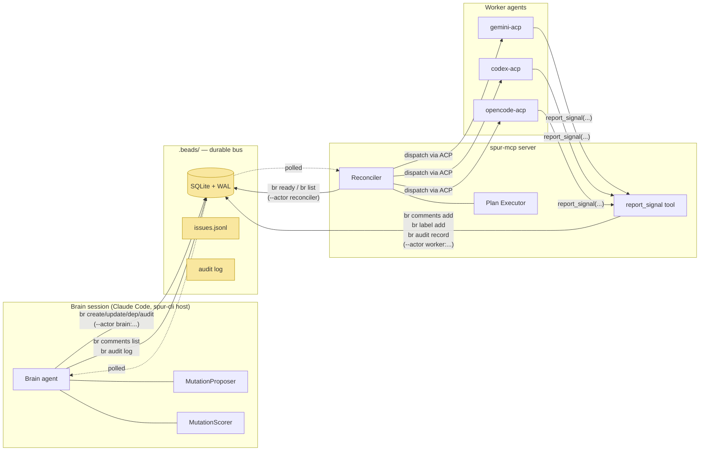
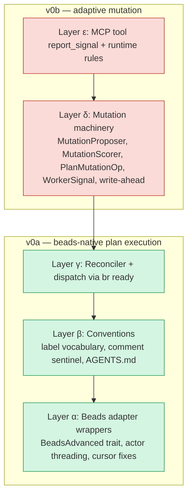
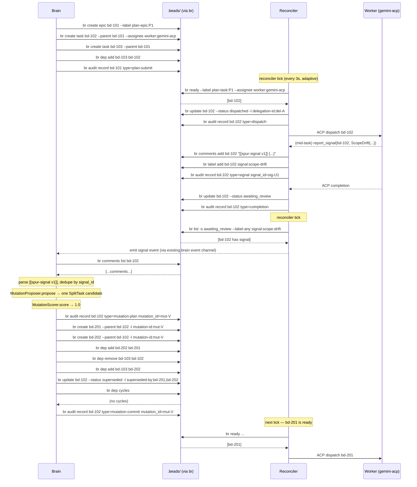
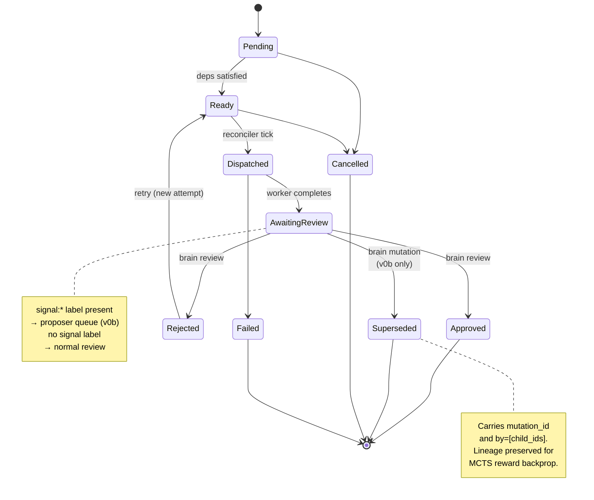
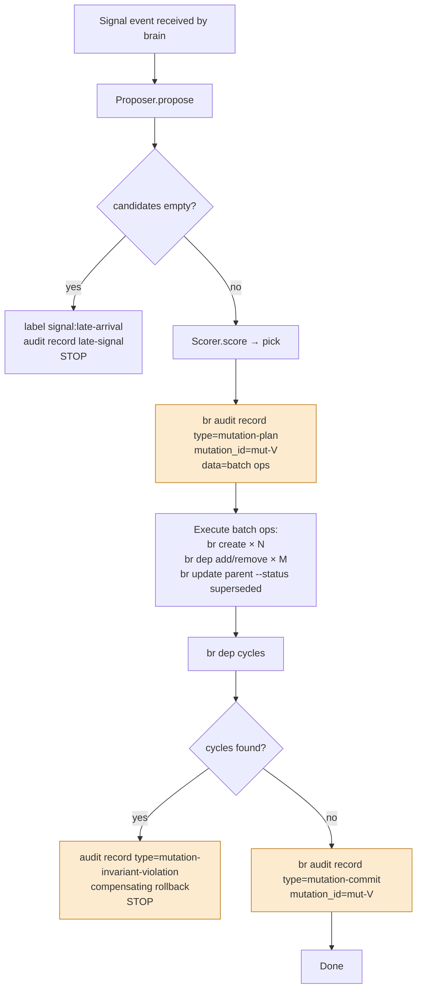
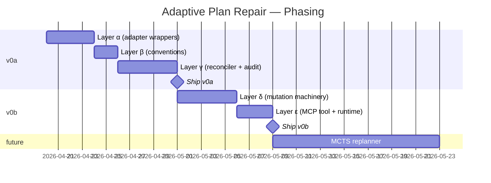

# Adaptive Plan Repair — Design

**Status:** design (rev 1, 2026-04-20)
**Date:** 2026-04-20
**Reference specs:**
- `docs/superpowers/specs/2026-04-19-brain-worker-integration-invariants.md`
- `docs/superpowers/specs/2026-04-20-async-first-delegate-migration-design.md`
- `docs/superpowers/specs/2026-04-15-brain-delegation-framework-design.md` (if present)

**Area:** `spur-pm` adapter surface · `spur-mcp` plan executor + reconciler · brain-side proposer/scorer · worker-facing MCP tool · AGENTS.md conventions

**Anchor files:**
`crates/spur-pm/src/beads.rs`, `crates/spur-pm/src/adapter.rs`, `crates/spur-pm/src/service.rs`, `crates/spur-pm/src/types.rs`, `crates/spur-mcp/src/plan.rs`, `crates/spur-mcp/src/server.rs`, `crates/spur-mcp/src/tools.rs`, `.beads/config.yaml`

**Delivery:** two phases — v0a (beads-native plan execution infrastructure) ships first, v0b (adaptive mutation on top of v0a) ships second. Both phases are scoped in this spec; each phase gets its own writing-plans cycle.

---

## Summary

SPUR today dispatches agent plans as frozen DAGs. Once `submit_plan` runs, the shape of remaining work is never re-optimized from what earlier stages discover. This spec describes the machinery — grounded in the existing beads CLI surface — that lets a brain repair a running plan's topology based on typed runtime signals from workers, persisted durably, with full audit breadcrumbs for a future MCTS-backed replanner. The architecture treats beads as the distributed communication bus: brain, worker, and MCP-server reconciler never talk directly; they all talk to beads. Per industry survey (2026 Q2), no existing LLM agent system provides durable-PM-backed runtime plan mutation; LangGraph does it in-memory, Temporal fakes it with `ContinueAsNew`, Airflow resolves at parse-time. SPUR v0 is the first.

---

## Goals and Non-Goals

### v0a goals (Phase 1 — beads-native plan execution)
- Extend `BeadsAdapter` to expose the missing `br` primitives used by the rest of the system: `ready`, `comments list/add`, `audit record/log`, `dep cycles`, `dep remove`.
- Thread `--actor` attribution through every beads call so every mutation is attributable to `brain:<session_id>` / `worker:<agent>` / `reconciler`.
- Replace the ad-hoc "is this task dispatchable" logic in the plan executor with `br ready` queries.
- Emit `br audit record` entries for every plan-affecting action (submit, dispatch, completion, approval, rejection).
- Fix two bugs discovered in `crates/spur-pm/src/beads.rs`: the `last_poll` cursor race (`beads.rs:513`) and the in-memory-only cursor (`beads.rs:149`).
- Publish the SPUR signal convention into `AGENTS.md` via `br agents --update`.

### v0b goals (Phase 2 — adaptive mutation on top of v0a)
- `WorkerSignal` typed enum; v0 variant `ScopeDrift`. One new MCP tool `report_signal` as the only new MCP surface.
- `PlanMutationOp` enum; v0 variant `SplitTask` with `DepRewirePolicy`.
- `MutationProposer` + `MutationScorer` trait seam where a future MCTS replanner slots in without callsite changes. v0 ships trivial impls.
- Brain-side write-ahead mutation protocol using `br audit record type=mutation-plan` / `type=mutation-commit`.
- Post-mutation invariant check via `br dep cycles`.

### Non-goals (explicit)
- **MCTS replanner itself.** Only the trait seam and breadcrumb schema ship; no search implementation.
- **Mid-task interrupt.** Adaptation happens at stage barriers only (`AwaitingReview`).
- **Multi-brain-session coordination.** Single brain per `.beads/` enforced by pidfile.
- **GitHub-backend parity for adaptive ops.** Adaptive mutation is beads-only in v0; GitHub adapter gracefully returns unsupported.
- **Mutation ops other than `SplitTask`.** Retarget, Coalesce, SpawnDep are named in the Generalization Map but not implemented.
- **Signal kinds other than `ScopeDrift`.** Other kinds are named in the Generalization Map but not implemented.

---

## Grounding

Verified against current code and live `br` binary (Darwin 25.1.0, repo `/Volumes/Projects/spur`):

| Claim | Evidence |
|---|---|
| `.beads/` exists with SQLite + WAL + Dolt versioning + `config.yaml`. | `.beads/` directory listing: `beads.db`, `beads.db-wal`, `beads.db-shm`, `config.yaml`, `dolt/`, `issues.jsonl`, `last-touched`, `metadata.json`. |
| `br` binary is installed. | `br --help` returns usage. |
| `BeadsAdapter::run_br` invokes the CLI per call with `--json`. | `crates/spur-pm/src/beads.rs:191-208`. |
| `IssueTracker` trait exposes only `get_issue`, `list_issues`, `create_issue`, `update_issue`, `add_dependency`, `poll`. | `crates/spur-pm/src/adapter.rs:6-15`. |
| `IssueUpdate` already carries `comment`, `add_labels`, `remove_labels`, `status`, `priority`, `assignee`. | `crates/spur-pm/src/types.rs:104-113`. |
| `IssueCreate.parent` already exists for parent-child relations. | `crates/spur-pm/src/types.rs:92-93`. |
| `br ready` lists unblocked-not-deferred issues with `--assignee`, `--label`, `--label-any`, `--priority`, `--type`, `--sort` filters. | `br ready --help` output. |
| `br comments add` / `br comments list <id>` are first-class subcommands. | `br comments --help` output. |
| `br audit record/label/log/summary` is an append-only JSONL audit system designed for agent interactions. | `br audit --help` output. |
| `br dep cycles` reports dependency cycles. | `br dep --help` output. |
| `--actor <ACTOR>` is a global flag accepted on every subcommand. | `br --help` output. |
| `br agents --update` manages AGENTS.md workflow instructions. | `br agents --help` output. |
| `BeadsAdapter::poll` uses `last_poll: Mutex<Option<DateTime<Utc>>>`, compares `updated_at >= last_poll` client-side, sets cursor to `Utc::now()`. **Cursor race:** events with `updated_at` between fetch and cursor-write can be missed on subsequent polls. | `crates/spur-pm/src/beads.rs:149`, `465-514`, specifically `513`. |
| `spur-mcp::plan` already carries a DAG executor with `PlanTask { depends_on }`, `PlanTaskStatus { Pending, Ready, Dispatched, AwaitingReview, Approved, Rejected, Failed, Cancelled }`, `AttemptRecord` history, and `review_task(approve/request_changes)`. | `crates/spur-mcp/src/plan.rs` (~3299 lines; structure confirmed). |
| `PmService::analyzer()` already exposes a beads-only extension (`BvAdapter`) via `Option<&BvAdapter>`. Precedent for the proposed `PmService::advanced() -> Option<&dyn BeadsAdvanced>`. | `crates/spur-pm/src/service.rs:163-165`. |

---

## Mental Models

These assumptions drive the whole design. Rejecting any of them collapses corresponding sections. They are named here so reviewers can challenge assumptions, not just artifacts.

**MM1 — Agent processes can crash; the system converges via level-triggered reconciliation.**
Drives write-ahead, pidfile, disk-backed cursor, audit breadcrumbs. Claude Code sessions crash (OOM, kill, network). MCP servers restart. Workers are spawned per task and die anyway. The guarantee is *eventual convergence to the plan-implied terminal state via idempotent reconcile tick over a durable event log* — NOT Temporal/DBOS-style durable-workflow replay. Brain decisions are not replayed; only state is projected and the brain re-decides with whatever signals exist at restart. Remove this machinery and we tolerate silent plan loss.

**MM2 — Plan structure is first-class mutable state (vs. cancel-and-resubmit).**
Drives `PlanMutationOp`, `SplitTask`, `DepRewirePolicy`, `Superseded` state. Alternative: "brain cancels remaining plan, submits a new plan." Simpler, but loses lineage — MCTS backprop requires the causal link between a triggering signal and the resulting subgraph; cancel-and-resubmit severs it.

**MM3 — Workers emit typed signals (vs. brain infers from summary text).**
Drives `WorkerSignal` enum, `report_signal` MCP tool, sentinel comment format. Alternative: LLM-based signal classifier over unstructured output. Typed is deterministic, cheap, reliably dedupable by `signal_id`. Worker prompts carry more coupling in exchange.

**MM4 — Adaptation happens at stage barriers, not mid-task.**
Drives `AwaitingReview` as the mutation window; workers run to completion before brain acts. Matches Spark AQE (re-optimizes between stages, not inside). Mid-task interrupt is a larger v1 design.

**MM5 — MCTS is on the roadmap; front-load breadcrumbs now.**
Drives unconditional `br audit record` emission across v0a, trait-based `MutationProposer`/`MutationScorer` in v0b, non_exhaustive enums throughout. Breadcrumb cost is near-zero (one CLI call per action); absence would create permanent data-quality debt in the future.

### Alternatives considered (documented rejections)

- **Cancel-and-resubmit instead of in-place mutation** (challenges MM2). Rejected — breaks MCTS lineage.
- **Mid-task worker interrupt** (challenges MM4). Deferred — v1 scope.
- **LLM-based signal inference** (challenges MM3). Deferred — `SignalClassifier` is a future `#[non_exhaustive]` variant consumer.
- **Direct MCP RPC for mutations (`mutate_plan` tool)** (challenges P5). Rejected — creates a second store (in-memory executor state) that diverges from beads under crash.

---

## Principles

Five postures drive every concrete choice. The spec's artifacts are instances of these principles; the principles themselves are the commitment.

- **P1 — Prefer beads primitives over custom code.** If `br` exposes a subcommand for it, wrap it — don't reimplement. `br ready`, `br audit`, `br dep cycles`, `br agents` all replace machinery we would otherwise build.
- **P2 — Additive-only, non-breaking extensions.** No modification to existing trait method signatures; no breaking changes to existing MCP tools; new capabilities live in new traits (`BeadsAdvanced`), new enum variants under `#[non_exhaustive]`, new MCP tools.
- **P3 — Make illegal states unrepresentable.** Typestate where feasible; `#[non_exhaustive]` enums; pidfile-enforced single-brain; status transitions gated by explicit rules; post-mutation invariants checked.
- **P4 — Instrument now, analyze later.** Every plan-affecting action emits a structured `br audit record` unconditionally. The consumer (MCTS replanner, dashboards, post-mortems) does not exist yet; the data must.
- **P5 — Bus-only coordination.** Brain, worker, and reconciler communicate exclusively through beads. No direct brain↔worker RPC. No in-memory authoritative state. Beads is the single source of truth; in-memory `PlanState` is a **materialized view** of it — refreshable from source, never authoritative.

---

## Architecture

### System context



**Invariant:** no arrow bypasses `.beads/`. Every cross-actor communication lands in beads first.

### Layer stack



Green = v0a (ships first, standalone value). Red = v0b (requires v0a).

### End-to-end sequence (happy path, v0a+v0b)



### PlanTaskStatus state machine



### Mutation write-ahead flow (v0b)



**Crash-recovery rule:** on brain restart, walk `br audit log` for every plan-epic; any orphan `mutation-plan` (no matching `mutation-commit` or `mutation-invariant-violation` by the same `mutation_id`) is resolved per Invariant I1's orphan-resolution rule — complete OR cancel, never two orphans concurrent. Every op in a batch is designed idempotent: `br create` is not intrinsically idempotent, but mutation-id labels let us detect already-created children; `br dep add/remove` is idempotent; `br update --status` is idempotent. Replay therefore converges.

### Concept peers

For readers placing this design against known systems:

| My term | LangGraph | Temporal / DBOS | Kubernetes | HTN literature |
|---|---|---|---|---|
| Plan | `StateGraph` | Workflow* | Custom Resource | Plan / task network |
| Task | Node | Activity | Pod | Method |
| Brain session | (runtime host) | Worker | Controller | Planner |
| Reconciler tick | (n/a; in-memory) | (n/a) | Reconcile loop | Monitor |
| Plan mutation (via beads edits) | `Send` + `update_state` | (no analog; `ContinueAsNew` is a workaround) | `Apply` manifest | Plan repair |
| `mutation-plan` / `mutation-commit` pair | (n/a) | (n/a) | Finalizer | Commit / abort |
| `WorkerSignal` | (via `interrupt`) | Signal | Event | Observation |
| `SplitTask` | `Send` fanout | (n/a) | (n/a) | Task decomposition |
| `br audit` event log | Checkpointer | History log | etcd audit | Plan trace |
| Durability guarantee | In-memory | Deterministic replay | State reconciliation | (n/a) |

\* Temporal's "workflow" implies deterministic replay. SPUR's plan does NOT — the brain is an LLM. Named explicitly to prevent misreading.

---

## Invariants

The four load-bearing rules. Each has a test spec (see Test Plan).

**I1 — Write-ahead before any destructive op, with unique-orphan resolution on restart.**
Brain MUST emit `br audit record type=mutation-plan mutation_id=X data=<batch>` before executing any op of batch X. Any op executed without a preceding mutation-plan record is a bug. The `mutation-plan`/`mutation-commit` pair is a **Kubernetes-style finalizer**: the reconciler treats any `mutation-plan` without a matching `mutation-commit` (or `mutation-invariant-violation`) as an in-flight mutation to either complete or cancel; parent tasks bearing `mutation-id:<X>` labels without a matching commit are held from terminal-status transitions.

**Durability contract:** `br audit record` is durable-on-return only because beads runs in default SQLite WAL mode (`.beads/beads.db-wal` confirms). SPUR v0 requires this mode. `br --no-db` (JSONL-only) is NOT supported; the WAL guarantee I1 depends on does not hold.

**Orphan-resolution rule (restart path):** on brain startup, for every orphan `mutation-plan` (no matching `mutation-commit` or `mutation-invariant-violation` by the same `mutation_id`), brain MUST either (a) complete it by executing remaining ops and emitting `mutation-commit`, OR (b) emit `type=mutation-cancelled mutation_id=<X>` before starting any new mutation on the same parent. INVARIANT: no parent task ever has two orphan `mutation-plan` records with different `mutation_id`s.

Enforcement: unit test asserts the brain-side mutation helper always emits the audit record first; integration test simulates crash between mutation-plan and first op, verifies restart completes or cancels before any new mutation; integration test simulates two competing mutation-plans on the same parent and asserts the cancel path fires.

**I2 — Post-mutation acyclicity.**
After committing any mutation batch, brain MUST call `br dep cycles`. If a cycle exists, brain MUST emit `type=mutation-invariant-violation` and run the compensating rollback encoded in the mutation-plan record. Enforcement: integration test inserts a SplitTask whose `DepRewirePolicy::Explicit` creates a cycle; asserts rollback completes and state is equivalent to pre-mutation. (Note: `br dep cycles` is first-class — we rely on beads' native detector, not a reimplementation.)

**I3 — Late-signal safety.**
A signal arriving on a task whose status is a terminal (`Approved`, `Failed`, `Cancelled`, `Superseded`) MUST NOT trigger the proposer. The signal MUST be recorded with `signal:late-arrival` label + `br audit record type=late-signal` and ignored for plan purposes. Enforcement: unit test against the signal-event handler with a fixture in each terminal state.

**I4 — Single brain session per `.beads/`.**
At most one brain session holds the pidfile `.beads/.spur-brain.pid` at any time. Any brain startup MUST acquire the pidfile or refuse to start. Enforcement: unit test with a stale pidfile (process absent) — startup should take the pidfile. Second unit test with a live pidfile (process present) — startup should refuse with a specific error.

---

## Information Flow

This is the highest-leverage surface in the design (per iceberg Level 6 analysis). Every future analysis tool — MCTS replanner, dashboards, post-mortem tooling — depends on these schemas. They are versioned and must be forward-compatible.

### Operational reads vs. analytical reads

beads offers two orthogonal read paths. Naming them separately prevents confusion:

- **Operational reads** (authoritative for dispatch, mutation, and invariant decisions): the state store — `br list`, `br show`, `br ready`, `br dep tree`. This is what the reconciler projects into the `PlanState` materialized view. Any operational decision must read this path.
- **Analytical reads** (authoritative for causal history and reward attribution): the event log — `br audit log`. MCTS replanner, dashboards, post-mortems consume this. Analytical reads MUST NOT drive operational behavior.

When the two disagree — e.g., `br audit log` shows a `mutation-commit` but `br list` shows the parent still `awaiting_review` — the **state store wins**; the reconciler converges it on the next tick. This is the Datomic / Kafka-materialized-view pattern: dual representation, one authority per purpose.

### Audit entry schema (v0a, via `br audit record`)

Every plan-affecting action emits one structured record. The `type` field is a closed vocabulary in v0; adding a new type is a non-breaking extension.

```json
{
  "id": "audit-uuid",
  "issue_id": "bd-102",
  "type": "plan-submit | dispatch | completion | approval | rejection | signal | mutation-plan | mutation-commit | mutation-invariant-violation | late-signal | orphan-dep-detected",
  "actor": "brain:S1 | worker:gemini-acp | reconciler",
  "timestamp": "2026-04-20T12:34:56.789Z",
  "data": { /* type-specific, see below */ }
}
```

Per-type `data` payloads:

| `type` | `data` fields |
|---|---|
| `plan-submit` | `{ plan_id, epic_issue_id, task_ids }` |
| `dispatch` | `{ delegation_id, worker, attempt }` |
| `completion` | `{ delegation_id, worker_branch, diff_summary }` |
| `approval` | `{ delegation_id }` |
| `rejection` | `{ delegation_id, feedback }` |
| `signal` | `{ signal_id, kind, severity, reason }` (mirrors comment payload) |
| `mutation-plan` | `{ mutation_id, op: "split", batch: { ops: [...] }, trigger_signal_id, trigger_task_id }` |
| `mutation-commit` | `{ mutation_id, applied_ops: [...], children_created: [...] }` |
| `mutation-invariant-violation` | `{ mutation_id, violation: "cycle" \| ..., rollback_status }` |
| `late-signal` | `{ signal_id, terminal_status }` |
| `orphan-dep-detected` | `{ orphan_task_id, missing_dep }` |

### Signal schema (v0b, via `[[spur-signal v1]]` comment + `signal:*` label)

Brain MUST NOT rely solely on labels; labels are summary, comment is authoritative.

**Label form:** `signal:<kind>` (detectable) plus optional `signal:<kind>:<bucket>` (e.g., `signal:scope-drift:high`).

**Comment form:**

    [[spur-signal v1]]
    {
      "signal_id": "<uuid-v4>",
      "kind": "scope_drift",
      "severity": 0.82,
      "reason": "auth refactor pulls in 4 new subsystems",
      "estimated_subtasks": 3
    }

`signal_id` MUST be a UUID-v4 generated by the worker (or by the MCP server inside `report_signal`). Brain dedupes by `signal_id` across polls.

Adding a new signal kind is a non-breaking additive change; `WorkerSignal` enum is `#[non_exhaustive]`.

### Label vocabulary

| Label | Purpose | Set by |
|---|---|---|
| `plan-epic:<id>` | marks epic issues | brain at plan submit |
| `plan-task:<id>` | marks child tasks of a plan | brain at plan submit |
| `delegation-id:<id>` | links a task to its ACP delegation | reconciler on dispatch |
| `signal:<kind>` | signal present (fast filter) | `report_signal` |
| `signal:<kind>:<bucket>` | severity bucket (optional) | `report_signal` |
| `signal:late-arrival` | signal arrived after terminal | brain signal handler |
| `mutation-id:<uuid>` | created as part of a mutation batch | brain mutation executor |
| `superseded-by:<csv-ids>` | list of child task IDs that supersede this task | brain on mutation commit |
| `ready-for-review` | explicit review-ready marker (redundant with `awaiting_review` status but queryable via label-any) | reconciler on completion |

---

## Interfaces

### `BeadsAdvanced` trait — v0a

Beads-only extension. Exposed via `PmService::advanced() -> Option<&dyn BeadsAdvanced>`, parallel to the existing `PmService::analyzer()` pattern. `GitHubAdapter` does not implement.

```rust
#[async_trait::async_trait]
pub trait BeadsAdvanced: Send + Sync {
    /// `br ready --label ... --assignee ... --limit ...`
    async fn list_ready(&self, filter: ReadyFilter) -> anyhow::Result<Vec<IssueSummary>>;

    /// `br comments list <id>`
    async fn list_comments(&self, issue_id: &str) -> anyhow::Result<Vec<Comment>>;

    /// `br comments add <id> <body>`
    async fn add_comment(&self, issue_id: &str, body: &str) -> anyhow::Result<CommentId>;

    /// `br audit record <issue_id> --type <ty> --data <json>`
    async fn audit_record(
        &self,
        issue_id: &str,
        entry: AuditRecordInput,
    ) -> anyhow::Result<AuditId>;

    /// `br audit log <issue_id>` — returns chronological records
    async fn audit_log(&self, issue_id: &str) -> anyhow::Result<Vec<AuditEntry>>;

    /// `br dep remove <issue_id> <depends_on_id>`
    async fn remove_dependency(
        &self,
        issue_id: &str,
        depends_on_id: &str,
    ) -> anyhow::Result<()>;

    /// `br dep cycles` — returns empty when acyclic
    async fn dep_cycles(&self) -> anyhow::Result<Vec<DependencyCycle>>;
}

#[derive(Debug, Clone, Default)]
pub struct ReadyFilter {
    pub assignee: Option<String>,
    pub labels_all: Vec<String>,
    pub labels_any: Vec<String>,
    pub issue_type: Option<String>,
    pub priority_min: Option<i32>,
    pub priority_max: Option<i32>,
    pub limit: Option<usize>,
}

pub struct AuditRecordInput {
    pub entry_type: AuditEntryType,
    pub data: serde_json::Value,
}

#[derive(Debug, Clone, serde::Serialize, serde::Deserialize)]
#[non_exhaustive]
#[serde(rename_all = "kebab-case")]
pub enum AuditEntryType {
    PlanSubmit,
    Dispatch,
    Completion,
    Approval,
    Rejection,
    Signal,
    MutationPlan,
    MutationCommit,
    MutationInvariantViolation,
    LateSignal,
    OrphanDepDetected,
}

pub struct AuditEntry {
    pub id: AuditId,
    pub issue_id: String,
    pub entry_type: AuditEntryType,
    pub actor: String,
    pub timestamp: chrono::DateTime<chrono::Utc>,
    pub data: serde_json::Value,
}

pub struct Comment {
    pub id: CommentId,
    pub body: String,
    pub actor: String,
    pub created_at: chrono::DateTime<chrono::Utc>,
}

pub struct DependencyCycle {
    pub issues: Vec<String>, // cycle members in order
}

pub type AuditId = String;
pub type CommentId = String;
```

### Actor threading (v0a, additive)

`BeadsAdapter` acquires an optional `default_actor` field at construction. Every `run_br` call appends `--actor <actor>` when set. A per-call override is available via a new internal method.

```rust
impl BeadsAdapter {
    pub async fn connect_with_actor(
        repo_root: &Path,
        default_actor: Option<String>,
        cursor_path: Option<PathBuf>,  // see "Cursor fixes"
    ) -> anyhow::Result<Self> { /* ... */ }

    async fn run_br_as(
        &self,
        args: Vec<String>,
        actor: Option<&str>,
    ) -> anyhow::Result<String> { /* appends --actor when Some */ }
}
```

Existing `BeadsAdapter::connect` remains and delegates to `connect_with_actor(..., None, None)` to preserve behavior.

### Cursor fixes (v0a, additive + bugfix)

Two issues with the current `poll()` implementation at `crates/spur-pm/src/beads.rs:465-514`:

1. **F1 (race):** line 513 sets `last_poll = Utc::now()` but filter is `updated_at >= last_poll`. Writes with `updated_at` between the fetch and the cursor-write are never returned on subsequent polls. **Fix:** track `max(updated_at)` from the returned set and use that as the cursor.
2. **F2 (lossy restart):** `last_poll: Mutex<Option<DateTime<Utc>>>` is in-memory only; adapter restart re-triggers the first-poll path and flood-emits all open issues as `IssueCreated`. **Fix:** optional `cursor_path: Option<PathBuf>` ctor arg; if set, read on connect and flush after each poll.

Both fixes are additive: default behavior (no cursor_path) preserves current semantics; the race fix is pure improvement.

### MCP tool `report_signal` — v0b

Only new MCP surface. Workers call; server translates to three beads CLI calls. Brain never calls this tool.

```
Tool name:      report_signal
Arguments:      { task_id: string, signal: WorkerSignal }
Returns:        { recorded: bool, signal_id: string, late: bool }

Behavior:
  1. Fetch task via BeadsAdvanced::get_issue(task_id)
  2. If status is terminal (Approved, Failed, Cancelled, Superseded):
     - Add label `signal:late-arrival`
     - Emit AuditRecordInput { type: LateSignal, ... }
     - Return { recorded: true, late: true }
  3. Otherwise:
     - Add label `signal:<kind>` (and optional severity bucket)
     - Add comment `[[spur-signal v1]]\n{...}` with signal_id
     - Emit AuditRecordInput { type: Signal, ... }
     - Return { recorded: true, late: false }
```

### `WorkerSignal` / `PlanMutationOp` / traits — v0b

```rust
#[non_exhaustive]
#[derive(Debug, Clone, serde::Serialize, serde::Deserialize)]
#[serde(tag = "kind", rename_all = "snake_case")]
pub enum WorkerSignal {
    ScopeDrift {
        signal_id: uuid::Uuid,
        severity: f32,
        reason: String,
        estimated_subtasks: Option<u8>,
    },
    // future: SkewDetected, ConfidenceDrop, CostOverrun, DependencyDiscovered, ...
}

#[non_exhaustive]
#[derive(Debug, Clone, serde::Serialize, serde::Deserialize)]
pub enum PlanMutationOp {
    SplitTask {
        parent: TaskId,
        children: Vec<PlanTask>,
        dep_rewire: DepRewirePolicy,
    },
    // future: RetargetWorker, CoalesceTasks, SpawnDepTask, ...
}

#[non_exhaustive]
#[derive(Debug, Clone, serde::Serialize, serde::Deserialize)]
pub enum DepRewirePolicy {
    /// Children form a sequential chain; original downstream rewires to the chain's `tail`.
    /// (Pipeline-stage / Unix-pipe tradition.)
    Pipeline { tail: TaskId },
    /// Children are parallel; original downstream waits for all to complete before proceeding.
    /// (OpenMP / MPI / rayon `join` barrier tradition.)
    Barrier,
    /// Caller supplies explicit edges between children and original downstream.
    Explicit { edges: Vec<(TaskId, TaskId)> },
}

pub struct MutationBatch {
    pub mutation_id: uuid::Uuid,
    pub ops: Vec<PlanMutationOp>,
    pub trigger_signal_id: Option<uuid::Uuid>,
    pub trigger_task_id: TaskId,
}

#[async_trait::async_trait]
pub trait MutationProposer: Send + Sync {
    async fn propose(
        &self,
        state: &PlanState,
        signal: &WorkerSignal,
        triggering_task: TaskId,
    ) -> Vec<MutationBatch>;
}

#[async_trait::async_trait]
pub trait MutationScorer: Send + Sync {
    async fn score(&self, state: &PlanState, batch: &MutationBatch) -> f32;
}
```

**v0b impls:** `ScopeDriftSplitProposer` (hardcoded: any `ScopeDrift` with severity ≥ 0.5 produces one `SplitTask` with `children.len() == signal.estimated_subtasks.unwrap_or(2)`); `TrivialScorer` (returns 1.0).

**v1 substitution:** MCTS replanner ships as alternate impls of these traits; callsite in the brain is unchanged.

---

## Artifacts by layer

### Layer α — Beads adapter wrappers (v0a)

- A1. `BeadsAdvanced` trait definition in `crates/spur-pm/src/adapter.rs` (alongside `IssueTracker`, `PrService`).
- A2. `BeadsAdapter` impls `BeadsAdvanced` with all listed methods wired to `run_br`.
- A3. `PmService::advanced() -> Option<&dyn BeadsAdvanced>` in `crates/spur-pm/src/service.rs` (pattern copied from `analyzer()`).
- A4. `connect_with_actor` + `run_br_as` actor threading.
- A5. Cursor fixes F1 (race) and F2 (disk backing) in `beads.rs` `poll()`.

### Layer β — Conventions (v0a)

- B1. Label vocabulary defined in a new module `crates/spur-mcp/src/plan/labels.rs` — constants or typed newtype wrappers.
- B2. Comment sentinel format documented; parser in `crates/spur-mcp/src/plan/signals.rs` (brain uses it in v0b; defined in v0a so format is stable before consumption).
- B3. AGENTS.md entry for SPUR signal protocol — published via `br agents --update` during v0a installation.

### Layer γ — Reconciler + dispatch (v0a)

- G1. Reconciler task in `crates/spur-mcp/src/plan.rs` (new module `reconciler.rs`). `tokio::spawn`'d on MCP server startup; ticks every 3s with adaptive backoff to 30s on idle; fast-forwards on local mutation trigger. Scoped per `plan_id`.
- G2. Dispatch path uses `br ready --label plan-task:<plan_id>` instead of current in-memory blocked-resolution.
- G3. Every plan-affecting state transition (submit, dispatch, completion, approval, rejection) emits `br audit record` via `BeadsAdvanced`.
- G4. Cursor persistence plumbing — each consumer (reconciler, brain-side signal watcher) gets its own cursor file path.

### Layer δ — Mutation machinery (v0b)

- D1. `WorkerSignal`, `PlanMutationOp`, `DepRewirePolicy`, `MutationBatch` types in `crates/spur-mcp/src/plan/mutation.rs`.
- D2. `MutationProposer` + `MutationScorer` traits in `crates/spur-mcp/src/plan/proposers.rs`.
- D3. v0 impls `ScopeDriftSplitProposer` + `TrivialScorer` in the same module.
- D4. Brain-side mutation executor: given a `MutationBatch`, performs write-ahead (I1), then ordered beads ops, then invariant check (I2), then commit record. Lives in a new module `crates/spur-mcp/src/plan/mutation_executor.rs`.
- D5. `Superseded` variant added to `PlanTaskStatus`. Existing match arms grow.

### Layer ε — MCP surface + runtime rules (v0b)

- E1. `report_signal` MCP tool in `crates/spur-mcp/src/tools.rs` + handler in `server.rs`.
- E2. Pidfile acquisition `.beads/.spur-brain.pid` at brain startup; wired into the brain session init. Ownership between `spur-cli` and `spur-mcp` is resolved in Open Question Q1.
- E3. Late-signal rule implementation inside `report_signal` handler.
- E4. Brain-side signal watcher: polls `br list -s awaiting_review --label-any signal:*`, dedupes signal_id via local cache + `br audit log`, invokes proposer on new signals.

---

## Test Plan

Invariant tests first (highest leverage — they encode I1–I4). Feature tests second.

### Invariant tests

- **T-I1 (write-ahead).** Unit: brain mutation helper with a mocked audit sink; assert `mutation-plan` record is emitted before any op. Integration: simulate brain crash after `mutation-plan` record but before first op; restart, assert replay reproduces the batch and ends with `mutation-commit`.
- **T-I2 (acyclicity).** Integration: construct a plan, apply a `SplitTask` with `DepRewirePolicy::Explicit` that creates a cycle; assert brain runs compensating rollback and the final graph equals the pre-mutation graph.
- **T-I3 (late signal).** Unit: for each terminal status (Approved, Failed, Cancelled, Superseded), feed a signal event into the brain handler; assert no proposer invocation, correct label/audit record.
- **T-I4 (single brain).** Unit: with a stale pidfile (no process at the recorded PID), brain startup takes the file. Unit: with a live pidfile, startup returns a specific error (`BrainAlreadyRunning`).

### Feature tests

- **T-F1 (v0a dispatch).** Integration: submit a 3-task plan with deps; assert `br ready` returns only the root; assert reconciler dispatches only the root; then approve root and assert next-ready is returned.
- **T-F2 (v0a audit coverage).** Integration: run T-F1 to completion; assert `br audit log <epic>` contains `plan-submit`; per task `dispatch` → `completion` → `approval`.
- **T-F3 (v0a cursor race regression).** Unit: set last_poll to T; insert two issues with updated_at=T and T+1μs respectively; call poll and assert both are returned; call poll again and assert none are returned.
- **T-F4 (v0a cursor disk).** Integration: start adapter with cursor_path; poll once; stop adapter; start new adapter with same cursor_path; poll; assert no flood of IssueCreated.
- **T-F5 (v0b signal happy path).** Integration: dispatch task; worker calls `report_signal(ScopeDrift)`; assert `signal:scope-drift` label, sentinel comment with signal_id, audit record with type=signal.
- **T-F6 (v0b split happy path).** Integration: T-F5 + brain proposer; assert parent becomes Superseded, children exist, dep rewire correct, mutation-plan+mutation-commit records present, cycle check ran.
- **T-F7 (v0b signal dedup).** Unit: worker calls `report_signal` twice with same signal_id; brain signal watcher dedupes and only proposes once.

---

## Scope and Phasing



Durations are relative sizing only (not commitments). v0a ships with standalone observability value (`br audit` trails, actor attribution, `br ready` dispatch). v0b ships adaptive mutation on top.

---

## Generalization Map

How v0 variants grow without breaking callers.

### Mutation-op taxonomy (HTN plan-repair literature mapping)

Future `PlanMutationOp` variants map to established HTN primitives. Citing the literature lets reviewers place each variant in the space of known repair operations:

| v0 / future op | HTN primitive | Literature reference |
|---|---|---|
| `SplitTask` (v0) | Task decomposition | Nau et al. — SHOP/SHOPFixer |
| `RetargetWorker` (future) | Task substitution | Goldman & Kuter — IPyHOPPER |
| `CoalesceTasks` (future) | Plan reduction | Kambhampati plan-space planning |
| `SpawnDepTask` (future) | Plan elaboration | Nau et al. — conditional refinement |

### Artifact growth

| v0 artifact | How it generalizes |
|---|---|
| `PlanMutationOp::SplitTask` | Add `RetargetWorker { task_id, new_agent }`, `CoalesceTasks { task_ids, new_task }`, `SpawnDepTask { after, new_task }` as new variants. Consumers match on variant (`#[non_exhaustive]` forces `_ =>` branch — non-breaking). |
| `WorkerSignal::ScopeDrift` | Add `SkewDetected { task_ids, imbalance }`, `ConfidenceDrop { before, after }`, `CostOverrun { budget, actual }`, `DependencyDiscovered { blocked_by }` as new variants. |
| `AuditEntryType::Signal / MutationPlan / ...` | Add new variants for future op classes; existing consumers ignore unknown via serde passthrough. |
| Hardcoded `ScopeDriftSplitProposer` | Replaced by MCTS proposer that impls the same trait. Callsite unchanged. |
| `TrivialScorer` | Replaced by `BvScoredScorer` (uses `bv` graph analyzer to score mutation candidates) or MCTS rollout-based scorer. |
| Pidfile single-brain | Multi-brain coordination via beads-level advisory lock or dolt branch per session — future spec. |
| Pull-based reconciler | File-tail on `.beads/issues.jsonl` or future `br watch` subcommand — future work, orthogonal to rest of design. |

---

## Iceberg framework acknowledgment

This design was developed through successive MCTS-style and iceberg-framework evaluations. The artifact list below appears flat, but it is organized by leverage:

- **Highest-leverage artifacts** (Information Flow, Invariants): full schemas, enforced by tests. These are the parts that, if wrong, create permanent data-quality or correctness debt.
- **Medium-leverage artifacts** (Interfaces, State machine): Rust sketches, extension points documented. These parts are tunable post-ship.
- **Lowest-leverage artifacts** (Parameters — tick cadence, poll limit, severity thresholds): listed with defaults and explicit "tune post-ship" notes.

The five mental models in §Mental Models are the ultimate leverage points — rejecting any of them collapses the design. They are named so reviewers can disagree at the level where disagreement is cheapest.

---

## Open Questions

- **Q1.** Where does the pidfile logic live? Candidate homes: `spur-cli` entry point (brain session init), or `spur-mcp` server (which always runs with a brain). Resolve during writing-plans for v0b Layer ε.
- **Q2.** Does `br agents --update` accept an idempotent "upsert if changed" flag? If not, v0a installer must diff before writing. Verify against `br` version installed on user systems.
- **Q3.** Signal retention policy: how long do `signal:*` labels persist on a task after mutation? Proposal: keep for audit; add `signal:processed:<mutation_id>` after proposer consumes, so historical filtering remains possible without reprocessing.
- **Q4.** Reconciler ownership: single reconciler instance per MCP server, or per-plan scoped? v0 assumes single instance filtering by `plan-task:*` label. Multi-plan concurrency is future work.

---

## Future Work

- **MCTS replanner** (the whole reason for the trait seam and breadcrumb schema). Consumes `br audit log` history to train a value network / execute UCB1 rollouts over candidate `MutationBatch`es.
- **Mid-task interrupt.** Permits urgent signals (e.g., `CostOverrun`) to terminate a running worker and trigger immediate re-planning. Requires ACP-level cancellation plumbing.
- **Multi-brain coordination.** Remove the single-brain pidfile; introduce per-session dolt branches for offline MCTS rollouts that merge back on commit.
- **GitHub-backend adaptive parity.** Via Issues/Projects v2 beta; or via a small server-side audit mirror stored in repo metadata.
- **Event-driven reconciler.** File-tail on `issues.jsonl` or future `br watch`; replaces polling for near-zero latency.
- **SignalClassifier** (LLM-based). Challenges MM3 by inferring signals from unstructured summaries; `#[non_exhaustive]` makes this additive.
