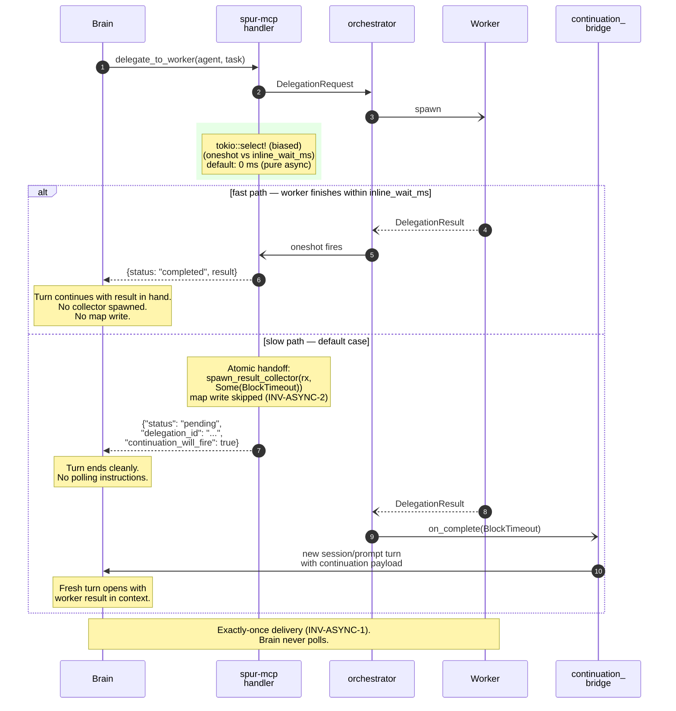

# Async-First Delegate Migration — Design

**Status:** design (rev 1, 2026-04-20)
**Date:** 2026-04-20
**Reference specs:**
- `docs/superpowers/specs/2026-04-19-brain-async-continuation-design.md` (complementary — defines the three-lane architecture and `ContinuationSource::BlockTimeout` semantics)
- `docs/superpowers/specs/2026-04-19-brain-worker-integration-invariants.md`
- `docs/superpowers/specs/2026-04-15-brain-delegation-framework-design.md`
- ACP Prompt Turn: <https://agentclientprotocol.com/protocol/prompt-turn>

**Area:** `spur-mcp` delegation handlers · `spur-core` result-collector plumbing · brain skill descriptions (`.spur/skills/brain-delegation-*/`)
**Anchor files:**
`crates/spur-mcp/src/server.rs`, `crates/spur-mcp/src/tools.rs`, `crates/spur-core/src/orchestrator.rs`, `crates/spur-core/src/continuation_bridge.rs`, `crates/spur-acp/src/domain/continuation.rs`

---

## Grounding

Verified against current code:

| Claim | Evidence |
|---|---|
| Both sync and async MCP handlers construct identical `DelegationRequest`s and push into the same orchestrator channel. | `crates/spur-mcp/src/server.rs:805-821` (sync), `server.rs:2095-2110` (async), `crates/spur-core/src/orchestrator.rs:2675` (single consumer) |
| Sync handler passes `detached = None` to the result collector. | `server.rs:836` |
| Sync handler polls `completed_delegations` every 250 ms bounded by `DELEGATION_BLOCK_TIMEOUT = 90s`. | `server.rs:33`, `server.rs:840-886` |
| `spawn_result_collector` **always** writes to `completed_delegations` regardless of whether a `DetachedCompletionHandle` is passed. | `server.rs:600` (confirmed via opencode-acp review artifact `refs/spur/artifacts/19bed652-…`) |
| `delegate_parallel` also passes `detached = None` (same pathology as sync `delegate_to_worker`). | `server.rs:931` |
| `ContinuationSource::BlockTimeout` enum variant exists but is never constructed. | `crates/spur-acp/src/domain/continuation.rs:16` |
| Sync handler timeout returns a free-form text blob containing the delegation id. | `server.rs:878-883` |
| Tool descriptions reference the timeout behavior verbatim and are part of the brain's `tools/list` response. | `crates/spur-mcp/src/tools.rs:59`, `tools.rs:227` |
| Continuation bridge already drains `on_complete` payloads into brain re-prompt turns. | `crates/spur-core/src/continuation_bridge.rs` |
| Graceful-shutdown path waits on `task_tracker`, and result-collectors are tracker-registered. | `server.rs:584` (spawn), `server.rs:647-650` (shutdown) |
| `DelegationGuard` in the orchestrator fires `DelegationCompleted(Failed)` if the executor task is dropped, guaranteeing `tx.send` runs even on panic. | `orchestrator.rs:2728` |

Verified against the 2026-04-19 continuation spec:

- Detached completion occupies the **Continuation lane** (not the Tool lane).
- The orchestrator's `run_interactive` loop is the single turn arbiter; `spur-mcp` only **reports** completion.
- `ContinuationSource::BlockTimeout` was explicitly designed for sync delegation that overruns its MCP block window. **The code path that emits it does not exist yet.**

---

## Problem

Sync `delegate_to_worker` is a degraded async delegate in all but name:

1. Mean worker wall-time ≫ 90 s (review gates default to 1800 s per `orchestrator.rs:3181`). The 90 s inline window is a *fiction* for anything non-trivial.
2. On timeout, the brain receives a human-readable sentence containing a `delegation_id` and instructions to poll. The continuation bridge is NEVER wired for this path. The brain pays a polling tax on nearly every delegation.
3. `delegate_parallel` has the identical pathology with a batch timeout rather than per-task.
4. The `BlockTimeout` continuation source exists but is dead code — the 2026-04-19 continuation spec anticipated this exact wiring; the implementation was never completed.

The consequence is a measurable productivity regression: brain context is consumed on repeated polling responses (~1 response per 90 s), brain skills embed polling instructions (`.spur/skills/brain-delegation-*/SKILL.md`), and the tool descriptions themselves instruct polling (`tools.rs:59`, `tools.rs:227`).

### Before — current sync `delegate_to_worker` flow

```mermaid
sequenceDiagram
    autonumber
    participant Brain
    participant MCP as spur-mcp<br/>handler
    participant Orch as orchestrator
    participant Worker

    Brain->>MCP: delegate_to_worker(agent, task)
    MCP->>Orch: DelegationRequest<br/>(detached = None, server.rs:836)
    Orch-)Worker: spawn

    rect rgb(255, 230, 230)
        Note over MCP: Polling loop<br/>server.rs:840-886<br/>250 ms × up to 360 iterations
        loop every 250 ms, bounded by 90 s
            MCP->>MCP: lock completed_delegations<br/>→ still empty
        end
    end

    Note over MCP: 90 s elapsed<br/>(DELEGATION_BLOCK_TIMEOUT, server.rs:33)
    MCP-->>Brain: free-form text:<br/>"Delegation still running<br/>(exceeded 90 s). Call<br/>check_delegation_status..."

    rect rgb(255, 230, 230)
        Note over Brain: Brain polls manually<br/>across multiple turns
        loop N brain turns
            Brain->>MCP: check_delegation_status(id)
            MCP-->>Brain: {"status":"running"}
        end
    end

    Worker--)Orch: DelegationResult via oneshot
    Orch-)MCP: collector writes completed_delegations<br/>(server.rs:600) — NO continuation fired
    Brain->>MCP: check_delegation_status(id)
    MCP-->>Brain: DelegationResult

    Note over Brain,Worker: Brain context burned on<br/>"still running" responses;<br/>BlockTimeout continuation is dead code.
```

## Goals

1. **Brains never poll.** Every delegation completion reaches the brain exactly once, either inline or via a continuation turn.
2. **Zero brain-side migration on tool names.** `delegate_to_worker` keeps its name; only the semantics tighten.
3. **Preserve ACP truthfulness.** Detached completion stays on the Continuation lane per the 2026-04-19 spec; it does not masquerade as user input or tool result.
4. **Strict rollback safety.** Each phase is additive and independently revertable.
5. **Observability first.** Every phase ships with telemetry to measure whether brains actually stopped polling.

## Non-goals

- Rewriting the continuation bridge (already shipped; this spec only wires a new source into it).
- Full `delegate_parallel` redesign in Phase 1 (scheduled for Phase 2; sketched here).
- Changing ACP semantics.
- Removing `check_delegation_status` (stays as a debugging / TUI affordance).
- Introducing `loom`-based concurrency tests (orthogonal; called out as optional in risk register).

## Executive Summary

Retire the polling-based sync path in four phases, each strictly additive:

- **Phase 1a** — Pass `Some(DetachedCompletionHandle { source_kind: BlockTimeout })` into `spawn_result_collector` for both `delegate_to_worker` and `delegate_parallel` timeout paths. Continuations fire; existing polling still works. No brain-visible change required.
- **Phase 1b** — Update tool descriptions (`tools.rs`) and brain skills (`.spur/skills/brain-delegation-*/`) atomically to say *"you will be re-prompted; do not poll."* Emit telemetry on `check_delegation_status` / `wait_delegation` calls to measure migration.
- **Phase 1c** — Rewrite the sync handlers using `tokio::select!` for atomic inline-wait → detached-collector handoff. Introduce `delegation.inline_wait_ms` config (default **0** initially; retune empirically). Refactor `spawn_result_collector` to skip `completed_delegations` writes when a detached handle is present.
- **Phase 2** — Purpose-built `delegate_parallel` redesign: per-task collectors, per-task continuations, partial-result aggregation preserving the `Value::Array` response shape.
- **Phase 3** — Deprecate `delegate_async` and `wait_delegation`. Their semantics are now covered by `delegate_to_worker` + continuation.
- **Phase 4** — Remove deprecated tools; introduce typed `DelegationId` newtype; reduce `completed_delegations` to a TTL-bounded debug buffer.

### After — Phase 1c end-state flow



---

## Phase ramp

```mermaid
flowchart LR
    P0[Current<br/>sync polls 90 s<br/>detached = None] --> P1a
    P1a[Phase 1a<br/>wire BlockTimeout<br/>strictly additive]
    P1a --> P1b
    P1b[Phase 1b<br/>descriptions<br/>+ brain skills<br/>+ telemetry]
    P1b --> P1c
    P1c[Phase 1c<br/>tokio::select!<br/>+ collector refactor<br/>inline_wait_ms = 0]
    P1c --> P2
    P2[Phase 2<br/>delegate_parallel<br/>per-task collectors]
    P2 --> P3
    P3[Phase 3<br/>deprecate<br/>delegate_async<br/>+ wait_delegation]
    P3 --> P4
    P4[Phase 4<br/>remove deprecated<br/>+ typed DelegationId]

    style P0 fill:#fee,stroke:#c88,color:#000
    style P1a fill:#ffe,stroke:#cc8,color:#000
    style P1b fill:#ffe,stroke:#cc8,color:#000
    style P1c fill:#efe,stroke:#8c8,color:#000
    style P2 fill:#efe,stroke:#8c8,color:#000
    style P3 fill:#eef,stroke:#88c,color:#000
    style P4 fill:#eef,stroke:#88c,color:#000
```



Each arrow is a deployable, independently revertable change. Red = pathological present. Yellow = additive fixes still backwards-compatible. Green = engine rewrite + parallel redesign. Blue = deprecation + removal.

---

## Decision Table

Branches considered during first-principles analysis (see "Appendix A — MCTS rollout" in supplementary notes):

| # | Branch | Cognitive-simplicity | Rust-invariant-preservation | Migration-cost | Continuation-reuse | Failure-modes | Score |
|---|---|---|---|---|---|---|---|
| A | Delete sync, async-only | +2 | +1 | −2 | +2 | +2 | +5 |
| **B** | **Sync name retained, semantics become async-with-inline-prefix + BlockTimeout continuation fallback** | **0** | **+1** | **+2** | **+2** | **+1** | **+6** |
| C | Single tool with `wait_ms` parameter | +1 | +1 | −1 | +2 | +1 | +4 |
| D | Minimal bolt-on (register continuation alongside polling with no handler rewrite) | −1 | 0 | +2 | +1 | 0 | +2 |

**Winner: Branch B.** Selected because it preserves the `delegate_to_worker` tool name (zero brain-migration cost), strictly upgrades semantics, and routes every delegation through the already-shipped continuation bridge. Branch A is the long-term destination; this spec reaches it through B's gradient, not a step function.

---

## Detailed Design

### Phase 1a — Additive BlockTimeout wiring

**Change sites:**
- `crates/spur-mcp/src/server.rs:830-837` (`handle_delegate_to_worker`): replace `None` with `Some(DetachedCompletionHandle { ctx: Arc::clone(&self.continuation_ctx), source_kind: DetachedSourceKind::BlockTimeout })`.
- `crates/spur-mcp/src/server.rs:925-932` (`handle_delegate_parallel`): same change applied per-task.

**Behavior after change:**
- Polling loop is unchanged (still 250 ms × 90 s).
- On timeout, handler returns the same free-form text as before (Phase 1b will change this).
- When the worker later completes, the result collector invokes `(h.ctx.on_complete)(cont, ...)` → continuation bridge → brain re-prompt.
- Brain that polls (old behavior) still succeeds.
- Brain that waits for continuation (new behavior) also succeeds.
- Both paths surface the result to the brain via `completed_delegations` + continuation; **the current code writes to the map and fires the continuation without deduplication**. Phase 1a depends on Phase 1c to remove the map write for detached paths; until Phase 1c ships, Phase 1a is safe because the map is only read on explicit `check_delegation_status` / `wait_delegation` calls — no polling from the handler that spawned the collector.

**Backwards compatibility:** full. This phase is a superset of current behavior.

### Phase 1b — Description + skill migration

**Change sites:**
- `crates/spur-mcp/src/tools.rs:56-62` (`delegate_to_worker_def`) — description becomes: *"Delegate a task to a worker agent. Returns inline if the worker finishes within the inline-wait window (configurable; defaults 0 ms). Otherwise returns a `delegation_id` and the brain is automatically re-prompted when the worker completes. Do not poll."*
- `crates/spur-mcp/src/tools.rs:64-70` (`delegate_parallel_def`) — analogous wording.
- `crates/spur-mcp/src/tools.rs:224-239` (`wait_delegation_def`) — marked `[deprecated]` per Phase 3.
- `crates/spur-mcp/src/tools.rs:241-256` (`check_delegation_status_def`) — reworded as debugging-only.
- `.spur/skills/brain-delegation-*/SKILL.md` (all brain harness SKILL files) — remove polling language; add "you will be re-prompted" language.

**Telemetry added:**
- Emit `SpurEventBody::ToolInvocation { name: "check_delegation_status", … }` on every call.
- 7-day target: ≥ 50 % reduction in post-timeout `check_delegation_status` volume.

**Atomicity:** the description change and the skill change ship in the same commit. `tests/tool_schema_stability.rs` is updated in the same commit.

### Phase 1c — `select!` refactor + map-write elimination

**Target shape of `handle_delegate_to_worker`:**

```
let (tx, mut rx) = oneshot::channel();
// build & send DelegationRequest ... (unchanged)

let inline_wait = self.config.delegation.inline_wait_ms;      // new config
tokio::select! {
    biased;
    r = &mut rx => {
        // Fast path: inline return. No collector spawn.
        // active_delegations drained here too.
        ...
    }
    _ = tokio::time::sleep(Duration::from_millis(inline_wait)) => {
        // Slow path: atomic handoff.
        Self::spawn_result_collector(
            &self.task_tracker,
            request_id.clone(),
            rx,                      // moved
            Arc::clone(&self.active_delegations),
            Arc::clone(&self.completed_delegations),
            Some(DetachedCompletionHandle {
                ctx: Arc::clone(&self.continuation_ctx),
                source_kind: DetachedSourceKind::BlockTimeout,
            }),
        );
        // Return structured pending response (see response shape below).
    }
}
```

**`spawn_result_collector` refactor:**
When `detached.is_some()`, the collector SKIPS the `completed_delegations` write. The continuation bridge becomes the sole delivery channel. This is the optimization my first draft claimed came "for free" from Branch B — it does not; it requires this explicit refactor. Documented here per the opencode-acp review's correction.

**Response shape for pending returns:**
```json
{
  "content": [{
    "type": "text",
    "text": "{\"status\":\"pending\",\"delegation_id\":\"…\",\"continuation_will_fire\":true}"
  }]
}
```
Additive alongside a human-readable sentence for brains that pattern-match legacy strings. The machine-parseable JSON is the canonical payload.

**Config:**
```toml
[delegation]
inline_wait_ms = 0     # Phase 1c default. Retune via telemetry.
```

### Phase 2 — `delegate_parallel` redesign

Sketch only — full spec deferred.

- Per-task `(tx, rx)` + per-task `spawn_result_collector` with its own detached handle.
- No batch timeout. Each task has its own inline-wait window; the handler returns as soon as the FIRST task finishes OR the inline window expires, whichever comes first, with partial results aggregated into `Value::Array` of `{status, delegation_id?, result?}` elements.
- A dedicated `ContinuationSource::ParallelBatchComplete` variant fires when the LAST pending task in a parallel batch lands, enabling a "batch done" prompt to the brain if desired.
- Preserves the `N-input → N-output array` response-shape invariant (see INV-ASYNC-6).

### Phase 3 — Deprecate `delegate_async` + `wait_delegation`

- Tool descriptions gain a `[DEPRECATED]` prefix pointing at `delegate_to_worker`.
- Handlers remain functional for two releases.
- Telemetry counts call volume to drive removal timing.

### Phase 4 — Removal + typed `DelegationId`

- Drop `delegate_async_def` and `wait_delegation_def` from `tools_list()` (`tools.rs:616`).
- Delete their handlers.
- Introduce `DelegationId(String)` newtype (today's UUIDs) in `crates/spur-acp/src/domain/delegation.rs`. Propagate through `DelegationRequest`, `BrainContinuation`, and ReviewSink.
- `completed_delegations` becomes TTL-bounded (default 60 s) and read-only from `check_delegation_status` debug calls.

---

## Invariants

Each invariant is named; tests reference the ID.

- **INV-ASYNC-1 — Exactly-once delivery.** For any given `delegation_id`, the brain receives the result through **exactly one** of: (a) inline MCP response, (b) continuation turn. Never zero, never both.
- **INV-ASYNC-2 — Source-kind-gated map-write elimination (Phase 1c, rev 2).** When `spawn_result_collector` is called with `detached = Some(h)` AND `h.source_kind == BlockTimeout`, it MUST NOT write to `completed_delegations`. For `detached = Some(AsyncRequested)` the map write is PRESERVED so legacy `handle_wait_delegation` callers continue to observe results until Phase 3 retires them. **Rev 2 correction**: an earlier draft of this invariant elided the source-kind distinction and, when implemented faithfully, silently broke `wait_delegation` (caught in Phase 1c code review). The `AsyncRequested` arm retires together with `wait_delegation` in Phase 3.
- **INV-ASYNC-3 — Cancel-during-handoff reachability.** A `cancel_delegation` RPC for id X MUST reach the orchestrator's cancellation-control token regardless of whether X is currently in the inline-wait window, mid-handoff, or already in the detached collector.
- **INV-ASYNC-4 — Shutdown boundedness.** `task_tracker.close()` MUST complete within a bounded time even with N in-flight detached collectors. No mutex guards held across `.await` inside collectors.
- **INV-ASYNC-5 — Description/behavior sync.** A schema-stability test MUST fail if `tools.rs` descriptions contradict handler behavior documented in this spec.
- **INV-ASYNC-6 — Parallel response-shape stability.** `delegate_parallel` with N input tasks MUST return a `Value::Array` of length N. Elements may be either completed results or `{status: "pending", delegation_id: …}` placeholders.
- **INV-ASYNC-7 — `clippy::await_holding_lock` clean.** Collector closures MUST pass lint. CI-gated.

## Test Matrix

| Invariant | Test file (new/extend) | Phase gate | Notes |
|---|---|---|---|
| INV-ASYNC-1 | `crates/spur-core/tests/continuation_integration.rs` (extend) `test_no_double_delivery_on_block_timeout` | 1a | Fast worker completion just as inline window expires. |
| INV-ASYNC-2 | `crates/spur-mcp/tests/result_collector_map_policy.rs` (new) | 1c | Asserts `completed_delegations` empty after detached completion. |
| INV-ASYNC-3 | `crates/spur-core/tests/cancellation.rs` (extend) `test_cancel_during_inline_to_detached_handoff` | 1c | Deterministic ordering test via `tokio::time::pause()`. |
| INV-ASYNC-4 | `crates/spur-core/tests/orchestrator_shutdown.rs` (new) `test_shutdown_bounded_with_pending_collectors` | 1a | Asserts `task_tracker.close()` returns within 2 s. |
| INV-ASYNC-5 | `crates/spur-mcp/tests/tool_schema_stability.rs` (extend) | 1b | Snapshot-style schema test; manual review on snapshot diff. |
| INV-ASYNC-6 | `crates/spur-mcp/tests/parallel_response_shape.rs` (new) | 2 | Length-invariant test; mixed completed/pending arrays. |
| INV-ASYNC-7 | CI lint gate (`cargo clippy -- -D clippy::await_holding_lock`) | 1c | Added to workspace `clippy.toml` if not already present. |

---

## Risk Register

| ID | Description | P × Impact | Mitigation |
|---|---|---|---|
| R1 | Double-delivery: brain receives continuation for result it got inline. | HIGH × HIGH | INV-ASYNC-1 test; select!-correctness review; Phase 1c collector refactor removes the two-path fanout. |
| R2 | Cancel arriving during handoff is lost. | MED × HIGH | INV-ASYNC-3 test; `handle_cancel_delegation` consults cancellation-control token (already authoritative) regardless of map state. |
| R3 | Brain prompt / skill drift: continuation fires but brain still polls. | MED × MED | Phase 1b atomicity + telemetry gate. |
| R4 | Shutdown hang on stuck detached collector. | LOW × HIGH | Existing `DelegationGuard` (`orchestrator.rs:2728`) fires `DelegationCompleted(Failed)` on drop; INV-ASYNC-4 test pins boundedness. |
| R5 | `completed_delegations` memory growth. | LOW × MED | Existing `evict_stale_completions`; Phase 1c eliminates writes for detached paths entirely. |
| R6 | `delegate_parallel` batch shape surprises brains in Phase 2. | LOW × LOW | INV-ASYNC-6 test. |

Optional future hardening: `loom`-based concurrency test for INV-ASYNC-3. Out of scope for initial Phase 1.

---

## Exit Criteria

**Phase 1a:**
- ✓ `BlockTimeout` detached handle wired in both sync handler and parallel handler.
- ✓ INV-ASYNC-1 and INV-ASYNC-4 tests merged and green.
- ✓ Manual smoke: delegation exceeding inline window produces exactly one `DelegationCompleted` + one continuation event per TUI event log.

**Phase 1b:**
- ✓ `tools.rs` descriptions and `.spur/skills/brain-delegation-*/SKILL.md` updated in a single commit.
- ✓ `tool_schema_stability.rs` snapshot regenerated and reviewed.
- ✓ Telemetry deployed; 7-day post-deploy check: polling-call volume reduced ≥ 50 % vs. 7-day pre-deploy baseline.

**Phase 1c:**
- ✓ `tokio::select!` handler rewrite merged.
- ✓ `spawn_result_collector` refactored: skips `completed_delegations` on detached path.
- ✓ INV-ASYNC-1 through INV-ASYNC-4 green.
- ✓ `inline_wait_ms` config knob shipping with default `0`.
- ✓ CI lint: `clippy::await_holding_lock` clean.

**Phase 2:**
- ✓ `handle_delegate_parallel` rewrite merged.
- ✓ INV-ASYNC-6 test green.
- ✓ `ContinuationSource::ParallelBatchComplete` landed (if needed per design).

**Phase 3:**
- ✓ Deprecation prefixes added.
- ✓ Telemetry on deprecated-tool invocations.

**Phase 4:**
- ✓ Tools removed from `tools_list()`.
- ✓ Typed `DelegationId` propagated through request/response types (closes INV-1 hinted at `continuation.rs:44`).
- ✓ `completed_delegations` reduced to TTL-bounded debug buffer.

---

## Open questions

- **Default for `delegation.inline_wait_ms`.** Ship Phase 1c with `0` (pure async-first, correctness by construction). After 2–4 weeks of telemetry on worker completion p50/p95, retune. Candidate retuned default: whatever makes ≥ 30 % of delegations complete inline without regressing brain turn latency at p95.
- **`ContinuationSource::ParallelBatchComplete`** — whether to add a distinct source or reuse `BlockTimeout` for the last task of a batch. Defer to Phase 2 spec.

---

## Relationship to existing specs

- This spec is **complementary** to `2026-04-19-brain-async-continuation-design.md`, which defines the Continuation lane, the scheduler, and the `BrainContinuation` payload model. That spec answers *"where do continuations land?"*; this spec answers *"how does the MCP sync handler start producing them?"*.
- No conflict with `2026-04-19-brain-worker-integration-invariants.md` — the 5 hard-won invariants (broadcast sizing, TUI drain cap, append_message walkback, `SpurEvent.seq`, ACP trailing notification grace) are untouched. The `select!` handler rewrite preserves emit-order: `DelegationCompleted` is emitted from `handle_delegations` (`orchestrator.rs:2797`) **before** the continuation payload reaches the bridge.
- Supersedes no prior spec.

---

## Provenance

This spec integrates an adversarial review from worker agent `opencode-acp` (artifact `refs/spur/artifacts/19bed652-e819-4b34-a83f-e64e0ba05d5a`, delegation id `2331ed0a-e339-4695-97e5-1e44d2b7eeed`, completed 2026-04-20). Key corrections folded in:

1. `spawn_result_collector` unconditionally writes to `completed_delegations`; Branch B's "map-write elimination" is not free and requires the explicit Phase 1c collector refactor.
2. `delegate_parallel` has identical pathology at `server.rs:931` and cannot be addressed by the sync-handler fix alone — hence Phase 2.
3. Tool descriptions are themselves part of the response-shape blast radius; Phase 1b must migrate them atomically with skill files.
4. Shutdown + cancel-during-handoff are non-trivial races requiring pinned invariants (INV-ASYNC-3, INV-ASYNC-4).
5. A two-step Phase 1 (additive wiring → skill/description migration → `select!` rewrite) is safer than a one-shot rewrite.
