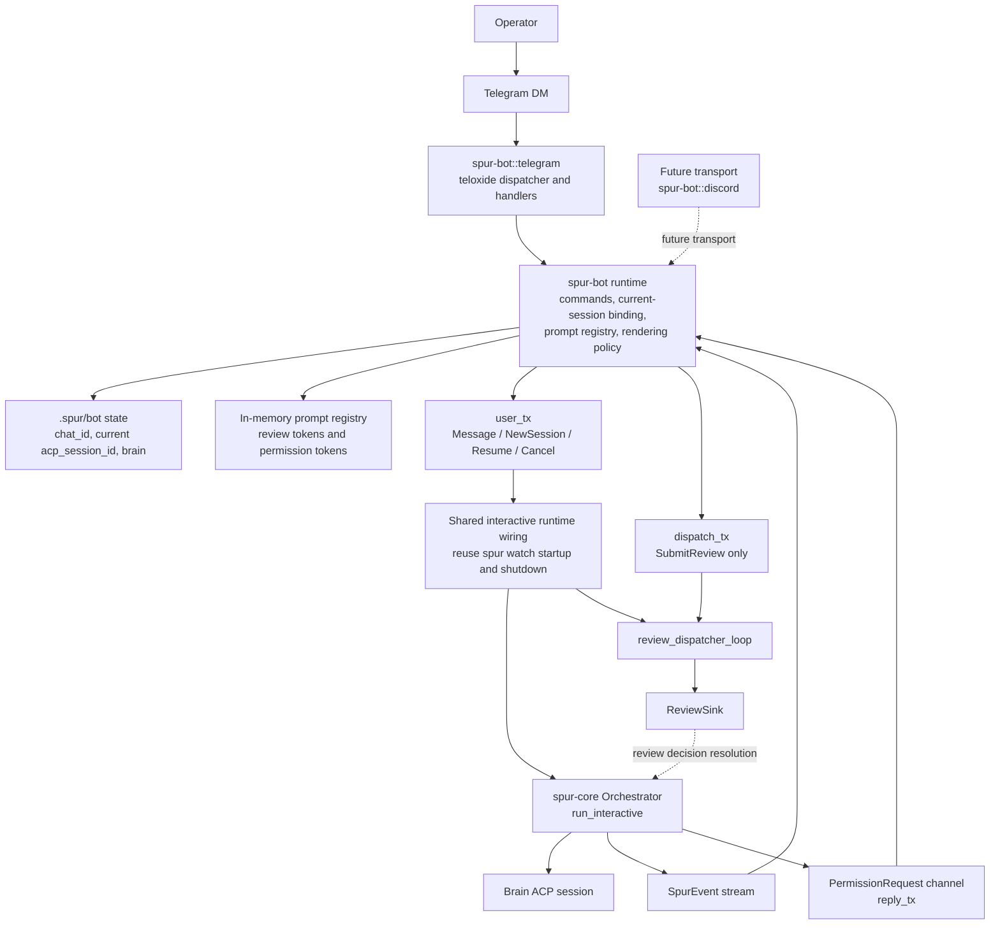
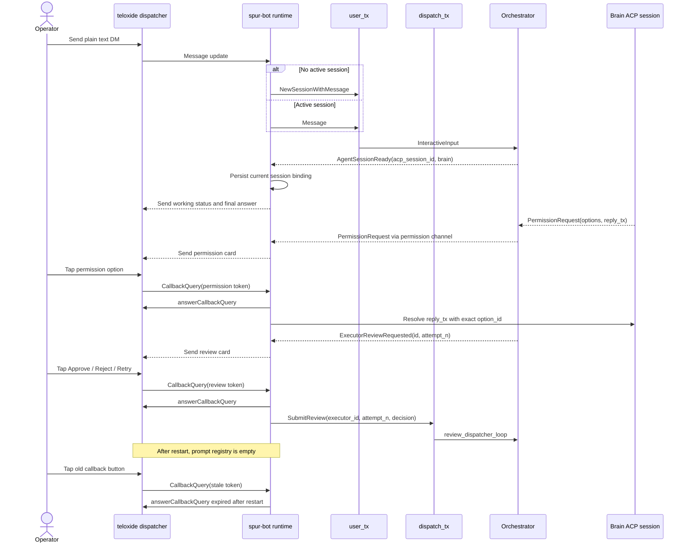

# SPUR Bot Frontend Design

**Date:** 2026-04-22
**Status:** Approved
**Scope:** `spur-bot`, `spur-cli`, shared interactive runtime wiring
**Supersedes:** `docs/superpowers/plans/2026-04-14-spur-telegram-bot.md`

---

## Problem Statement

The existing Telegram plan treats Telegram as a narrow replacement for
`spur watch`. That is the wrong abstraction for the intended product.

The product goal is:

- Telegram should be another interface for the SPUR system
- the operator should be able to chat with the brain agent from Telegram
- the implementation should leave room for future bot transports such as
  Discord

The current plan fails that goal in three ways:

1. It centers the design on a Telegram-only crate instead of a reusable
   bot frontend layer.
2. It duplicates interactive runtime wiring instead of reusing the
   existing `spur watch` path.
3. It assumes broader UI scope than needed for v1, which makes the
   architecture larger and less defensible.

---

## Product Goal

Deliver a **brain-first bot frontend** for SPUR with these properties:

- one authorized operator
- one private bot chat as the control surface
- plain-text chat with the brain agent
- sticky current-session semantics
- session list and resume support
- review actions in chat: `Approve`, `Reject`, `Retry`
- permission prompts in chat using the exact ACP options
- lightweight progress updates, not full raw streaming traces
- automatic current-session restore on process restart
- reusable crate boundaries so Discord can be added later

This v1 is intentionally **not** full TUI parity. It is a production-capable
brain interface with review and permission gating.

---

## Non-Goals

The following are explicitly out of scope for v1:

- multi-user bot operation
- shared group chat as the primary control surface
- forum-topic or supergroup executor routing
- full raw thought/tool/output streaming
- full TUI feature parity
- persistent review/permission prompts across restart
- generalized cross-platform UI abstraction for every future bot feature

These can be layered later without invalidating the v1 model.

---

## Approved Decisions

### Operator Model

V1 is **single-user first**.

- exactly one authorized operator
- exactly one private chat is bound to the running bot instance
- that private chat is the sole target for proactive messages

This keeps routing, persistence, and restart behavior simple enough to
ship while still making Telegram a real SPUR interface.

### Scope

V1 is **brain-first**.

Included:

- brain chat
- current session management
- session listing and resume
- lightweight progress and state notifications
- review prompts with `Approve`, `Reject`, `Retry`
- permission prompts with exact ACP options

Deferred:

- executor detail parity
- PM-heavy workflows
- transport-specific multi-surface routing

### Review and Permission Surface

Review and permission prompts live in the **same private DM** as brain chat.

This avoids introducing supergroup/forum dependencies in v1 and keeps the
bot usable end-to-end with the smallest operational setup.

### Session Behavior

Plain text should behave like a natural chat client:

- if there is no current session, plain text starts a new session
- if there is a current session, plain text sends to that session
- `/new` clears the current session pointer
- `/resume <id>` switches the current session

### Turn Rendering

V1 should show:

- final answer
- lightweight progress updates
- explicit review prompts
- explicit permission prompts

V1 should not show:

- raw thought chunks
- full tool-call traces
- raw tool outputs by default

### Restart Behavior

The sticky current session should survive process restart.

- the bot persists the current ACP session id and brain name
- the bot restores that session automatically on startup
- if restore fails, the bot clears the current-session pointer and falls
  back to “next plain message starts a new session”

---

## Architecture

### Layering

The architecture should be split into four layers:

1. **`spur-core`**
   The source of truth for orchestration, sessions, reviews, permissions,
   continuations, and event emission.

2. **Shared interactive runtime wiring**
   The existing `spur watch` startup and shutdown wiring should be reused,
   not cloned. This includes orchestrator construction, continuation
   overflow setup, permission channels, review dispatcher setup, and
   graceful shutdown.

3. **`spur-bot`**
   A reusable bot frontend crate that owns bot-facing runtime behavior:
   current-session routing, persisted bot state, prompt lifecycle,
   callback token registry, and platform-neutral command semantics.

4. **`spur-bot::<transport>`**
   Transport-specific adapters. In v1, `spur-bot::telegram` is the first
   concrete implementation. Future transports such as Discord should plug
   into the same `spur-bot` runtime model.

### Mermaid Architecture Diagram

The following diagram is the authoritative high-level architecture for v1.
It shows both the shared runtime boundary and the transport-specific pieces.



### Mermaid Interaction Diagram

The following sequence diagram defines the detailed v1 interactive flow for
plain chat, permission prompts, review prompts, and restart-safe stale
callbacks.



### Crate Shape

Recommended initial structure:

```text
crates/spur-bot/
  src/
    lib.rs
    runtime.rs
    state.rs
    commands.rs
    telegram/
      mod.rs
      config.rs
      dispatcher.rs
      render.rs
      format.rs
```

Responsibilities:

- `runtime.rs`
  Shared bot runtime behavior: current-session state machine, callback
  token ownership, restart handling, command dispatch helpers.
- `state.rs`
  Durable and in-memory state types.
- `commands.rs`
  Platform-agnostic command semantics.
- `telegram/config.rs`
  Telegram-specific configuration.
- `telegram/dispatcher.rs`
  Telegram update intake and routing.
- `telegram/render.rs`
  Telegram DM rendering.
- `telegram/format.rs`
  Telegram-safe text splitting and formatting helpers.

### Rust Telegram Framework Choice

`spur-bot::telegram` should use **`teloxide`** as its Telegram transport
framework.

Why this is the best fit for the approved v1 scope:

- it already supports both long polling and webhooks
- it provides typed command parsing, callback-query handling, inline
  keyboard helpers, dispatcher routing, and request throttling
- it fits the current workspace well because SPUR already uses `tokio`,
  and webhook support can later align with the existing Rust HTTP stack
- its same-chat sequential update handling is a good match for the
  single-operator DM model in v1

The approved transport mode for v1 is **long polling**.

This keeps deployment simple for the first bot transport while still
allowing a later webhook mode if operational needs change.

#### Framework Boundary

`teloxide` should be used only for transport concerns:

- receiving Telegram updates
- parsing commands
- handling callback queries
- sending and editing Telegram messages
- rate-limit-aware request execution
- dispatcher routing and dependency injection for transport handlers

`teloxide` must **not** own SPUR session state, prompt lifecycle, review
state, permission state, or bot persistence.

Those remain inside `spur-bot` runtime code so the bot behavior stays
transport-neutral and can later support Discord without duplicating core
logic.

#### Explicit Non-Choice

Do not build v1 on top of `teloxide` dialogue storage/state machines.

That means:

- do not use `teloxide::dispatching::dialogue::Dialogue`
- do not use `dialogue::enter(...)`
- do not use `InMemStorage`, `SqliteStorage`, `RedisStorage`, or other
  teloxide dialogue storage backends for SPUR runtime state

The approved design already has a SPUR-owned runtime model:

- sticky current session
- persisted bot state under `.spur/bot/`
- review and permission prompt lifecycle
- restart-aware stale callback handling

Replacing those with transport-owned dialogue state would split the source
of truth and make future multi-transport support harder.

`teloxide` should therefore be used with dispatcher handlers and explicit
shared dependencies, not as a dialogue-owned state machine. The bot runtime
remains the only source of truth for current session binding, prompt
lifecycle, and restart behavior.

---

## Runtime Contract

### Principle

`spur-bot` must not become a second orchestrator.

It should be a frontend over the same interactive SPUR runtime contract
already used by `spur watch`.

That means the bot path must reuse:

- orchestrator construction
- license/runtime startup where applicable
- `review_dispatcher_loop`
- permission channel setup
- continuation overflow buffer setup
- `set_continuation_tx(...)`
- orchestrator shutdown behavior

The bot transport should add only:

- transport startup
- bot-facing state persistence
- chat/update routing
- rendering

### Why This Matters

If Telegram gets its own shortened runtime path, the codebase will drift:

- bug fixes will land in TUI but not bots
- review/permission/session semantics will diverge
- Discord support later will repeat the same mistake

The correct design is a shared interactive backbone with multiple
frontends.

---

## Session Model

### Single Sticky Current Session

The bot maintains one sticky current session pointer.

Fields:

- current ACP session id
- current brain name

Behavior:

- plain text with no current session =>
  `InteractiveInput::NewSessionWithMessage`
- plain text with a current session =>
  `InteractiveInput::Message`
- `/new` clears the pointer
- `/resume <id>` switches the pointer on successful restore
- a newly created session becomes current when `AgentSessionReady` arrives

### Binding States

The transport/runtime boundary should model current-session binding as an
explicit transient state machine:

- `NoSession`
- `RestorePending { acp_session_id, brain }`
- `Active { acp_session_id, brain }`

This is intentionally small. It is enough to keep startup restore,
plain-text routing, and transport rendering coherent without importing
Telegram-specific concepts into `spur-core`.

The key invariant is:

- inbound Telegram messages may request a new or resumed session
- only SPUR runtime events may confirm that the current binding is live

In particular, the current ACP session binding must be committed only when
`AgentSessionReady` arrives from the shared runtime. The Telegram handler
that sent `NewSessionWithMessage` or `ResumeSession` must not persist or
finalize the binding on its own.

### Startup Restore

On startup:

1. initialize the shared interactive runtime
2. load persisted bot state
3. if a current session exists, immediately enqueue `ResumeSession`
4. if restore succeeds, mark that session current and notify the operator
5. if restore fails, clear the persisted pointer and notify the operator

This preserves chat continuity across bot restarts without persisting
ephemeral UI artifacts.

Restore notifications should be explicit service messages, not silent state
changes. The operator should always be able to tell whether startup resumed
the prior session or fell back to “no current session”.

---

## Persistent and Ephemeral State

### Persistent State

Persistent bot state should live in a transport-neutral path under
`.spur/bot/`.

Recommended v1 payload:

- schema version
- bound operator private `chat_id`
- current ACP session id
- current brain name

This should be small, explicit, and forward-compatible.

### Ephemeral State

The following must remain memory-only:

- active “working” message id
- pending review prompt tokens
- pending permission prompt tokens
- in-flight progress/render accumulators

These are transport-local interaction details, not durable product state.

Ephemeral prompt state also includes non-rehydratable handles from the SPUR
runtime:

- permission `reply_tx` oneshot channels
- pending review routing slots keyed by executor id and attempt number

Those values are valid only for the current process lifetime, so they must
never be persisted through teloxide storage or local bot state files.

### Restart Invariant

After restart, old inline buttons must be treated as stale.

- callback tokens are regenerated per process lifetime
- old button clicks return a clean “expired after restart” response
- no attempt is made to rehydrate old review or permission prompts
- the previous process's working-status message is orphaned and must not be
  edited after restart

Stale callbacks should always acknowledge the button press. They may emit
one compact service message in chat when needed, but repeated stale clicks
must not create repeated chat noise.

### Callback Token Requirements

Interactive Telegram buttons must use compact opaque callback tokens owned by
`spur-bot`.

Rules:

- tokens must be generated with process-scoped uniqueness
- tokens must not embed raw ACP option ids, executor ids, or chat ids
- tokens must resolve through in-memory prompt state only
- token misses are treated as stale callbacks, not as recoverable prompt
  state

---

## Command Surface

V1 command set:

- `/start`
- `/help`
- `/new`
- `/sessions`
- `/resume <id>`
- `/current`
- `/cancel`

Semantics:

- `/start` and `/help`
  Show current behavior, current session summary, and available commands.
- `/new`
  Clear the current-session pointer. The next plain message starts a new
  session.
- `/sessions`
  List resumable ACP sessions.
- `/resume <id>`
  Load the specified ACP session and make it current.
- `/current`
  Show the currently bound ACP session id and brain name.
- `/cancel`
  If a turn is in flight for the current session, submit
  `CancelStream` for that session.

Plain text remains the primary interaction model. Commands are control
operations, not the default way to chat.

### Command Response Style

Control commands should return short, self-identifying responses.

Rules:

- every command response should clearly say whether a current session is
  now set, cleared, restored, or unchanged
- `/new` should explicitly say that the next plain message starts a fresh
  session
- `/resume <id>` should confirm the bound session and brain on success
- `/current` should produce a useful response even when no current session
  exists
- `/cancel` should distinguish between “cancel requested” and “no turn is
  currently running”

`/sessions` needs special treatment because it is the operator's only
session-switching browser in v1.

The list should:

- mark the current session explicitly
- show only a compact top slice of resumable sessions
- present enough metadata to choose safely without flooding the chat
- end with a concrete resume hint such as `/resume <full-id>`

---

## Rendering Model

### Brain Responses

The Telegram DM should feel like a chat client, not a trace console.

For each turn:

- show a compact working/progress state
- emit lightweight milestone updates only when useful
- emit a durable final answer after the working state completes

The turn-level rendering policy should be explicit:

- each turn gets at most one active working status message
- milestone updates edit that working message in place
- the final answer is emitted as a new durable answer message
- the working message is then removed or collapsed into a compact terminal
  status, but it is not reused as the final answer body

Meaningful v1 milestones include:

- brain connected
- session restored
- tool running
- review requested
- permission requested
- turn completed
- turn cancelled
- error

### Message Hierarchy

The DM should have a clear hierarchy so operators can skim it safely.

1. **Durable answer messages**
   The assistant's final answer for a turn. These are the most important
   messages and should read cleanly when revisited later.

2. **Ephemeral status messages**
   Working, restoring, cancelling, and lightweight progress state. These
   should be edited in place when possible instead of creating a trail of
   near-duplicate updates.

3. **Action cards**
   Review and permission prompts. These should be visually self-contained,
   include the minimum context needed for a safe decision, and become
   terminal after one action.

4. **Control responses**
   `/new`, `/current`, `/sessions`, `/resume`, `/cancel`, `/help`. These
   should be concise and should always make the next likely action obvious.

The key rule is:

- **final answers accumulate**
- **status updates collapse**
- **action cards terminate cleanly**

This prevents the DM from turning into a noisy event log.

### Interaction Flow

The v1 DM flow should feel like a disciplined operator console:

- idle state teaches the operator that plain text is the default way to
  talk to SPUR
- once a current session exists, command responses and action cards should
  mention that session compactly
- there should be at most one active “working” status per turn
- review and permission prompts should interrupt the flow clearly, but
  they should not drown the chat in surrounding status noise
- when an action card resolves, the terminal state should remain visible
  in the message history without leaving live buttons behind

### Review Prompts

When `ExecutorReviewRequested` arrives:

- create a short-lived prompt record keyed by an opaque bot token
- render a concise summary in DM
- include enough executor context for a safe decision:
  executor/task label, short summary, and diff stats when available
- show buttons for `Approve`, `Reject`, `Retry`
- keep button labels short and action-first
- on click, route the exact review decision through the review-dispatch
  channel that feeds `review_dispatcher_loop`, not through the main
  `run_interactive` input channel
- once terminal, edit the message and remove the keyboard

If the prompt is stale, superseded, or lost during restart, the callback
must still be answered cleanly.

### Permission Prompts

When ACP emits a permission request:

- store the exact ACP option ids in a short-lived prompt record
- render one button per option
- include the tool or operation name prominently so the operator knows
  what is being approved
- visible labels may be shortened for readability
- do not truncate the action verb out of a visible option label
- callback payloads must use compact opaque bot tokens
- every button click must call `answerCallbackQuery` before any potentially
  slow SPUR-side work
- clicking a button resolves the stored `reply_tx` with the exact ACP
  `option_id`

This preserves ACP correctness while keeping Telegram callback payloads
small and transport-safe.

Permission prompts are intentionally ephemeral. Because they hold a live ACP
`reply_tx` oneshot sender, they cannot survive process restart. Any
pre-restart permission callback must therefore be treated as stale.

### ASCII Wireframes

The spec should define the canonical v1 chat states up front so transport
rendering has something concrete to target.

#### 1. Fresh DM, No Current Session

```text
+--------------------------------------------------+
| SPUR Bot                                         |
| No current session                               |
|                                                  |
| Send a plain message to start a new session.     |
|                                                  |
| Commands                                          |
| /new      clear current session                  |
| /sessions list resumable sessions                |
| /resume   bind an existing session               |
| /current  show active session                    |
| /cancel   cancel in-flight turn                  |
+--------------------------------------------------+
| You: Investigate why the review loop stalled     |
+--------------------------------------------------+
```

Purpose:

- teaches the operator that plain text is the primary interaction
- makes the “no current session” state explicit

#### 2. Active Session, Turn In Progress

```text
+--------------------------------------------------+
| Current: claude-code-acp · acp_7f31c2ab          |
| Status: Working                                  |
|                                                  |
| Investigating review loop stall...               |
| Tool running: get_plan_status                    |
|                                                  |
| /cancel                                          |
+--------------------------------------------------+
| You: Investigate why the review loop stalled     |
| Bot: I found two likely causes...                |
+--------------------------------------------------+
```

Purpose:

- keeps one visible current-session anchor
- shows lightweight progress without raw trace spam
- exposes the interrupt path in the same visual frame

#### 3. Session Browser in Chat

```text
+--------------------------------------------------+
| Sessions                                         |
|                                                  |
| * acp_7f31c2ab  claude-code-acp  current         |
|   acp_1d992e10  claude-code-acp  "auth fix"      |
|   acp_0c44bb83  kiro             "spec pass"     |
|                                                  |
| Use: /resume <full-session-id>                   |
+--------------------------------------------------+
```

Purpose:

- makes the current session easy to spot
- keeps the list compact enough for DM use

#### 4. Review Request Card

```text
+--------------------------------------------------+
| Review Required                                  |
| Session: acp_7f31c2ab                            |
| Executor: exec_42 · claude-code                  |
| Summary: tighten retry guard in review loop      |
| Diff: 3 files, +42 -11                           |
|                                                  |
| [ Approve ]  [ Reject ]  [ Retry ]               |
+--------------------------------------------------+
```

Terminal state after click:

```text
+--------------------------------------------------+
| Review Required                                  |
| Session: acp_7f31c2ab                            |
| Executor: exec_42 · claude-code                  |
| Decision: Approved                               |
+--------------------------------------------------+
```

Purpose:

- makes approval context explicit
- leaves a clean audit trail in chat after action

#### 5. Permission Prompt Card

```text
+--------------------------------------------------+
| Permission Request                               |
| Session: acp_7f31c2ab                            |
| Tool: exec_command                               |
| Action: run `git commit -m ...`                  |
|                                                  |
| [ allow_once ] [ allow_always ] [ deny ]         |
+--------------------------------------------------+
```

Terminal state after click:

```text
+--------------------------------------------------+
| Permission Request                               |
| Session: acp_7f31c2ab                            |
| Tool: exec_command                               |
| Selected: allow_once                             |
+--------------------------------------------------+
```

Purpose:

- keeps the tool name and action visible at decision time
- preserves the exact ACP option mapping internally while presenting a
  readable control surface

---

## Telegram Transport

### Transport Responsibilities

`spur-bot::telegram` should own:

- bot token/config loading
- Telegram update intake
- authorized private-chat filtering
- operator chat binding
- Telegram-specific formatting and message splitting
- callback query acknowledgement and keyboard editing

It should not own:

- session semantics
- review semantics
- permission semantics
- persistent bot routing rules

Those belong in `spur-bot` runtime code.

### Telegram-Specific Constraints

The Telegram adapter must respect Bot API constraints:

- callback payloads must be compact and opaque
- message rendering must use Telegram-safe formatting logic
- message splitting must be character-safe and formatting-aware
- callback queries must always be answered, including stale ones

These are adapter concerns, not `spur-core` concerns.

---

## Future Discord Support

This design intentionally prepares for future transports without forcing
broad abstractions too early.

The reusable contract for future transports is narrow:

- command dispatch
- current-session routing
- review prompt lifecycle
- permission prompt lifecycle
- progress notification policy
- durable bot state

Discord should be able to reuse this runtime behavior while providing a
different transport adapter for events, messages, buttons, and formatting.

V1 should not attempt to solve every Telegram/Discord UI mismatch.

---

## Testing Strategy

### Unit Tests

Add targeted tests for shared bot runtime behavior:

1. first plain message with no current session =>
   `NewSessionWithMessage`
2. plain message with current session =>
   `Message`
3. `/new` clears the current-session pointer
4. `/resume <id>` updates current session on success
5. startup restore attempts `ResumeSession`
6. failed startup restore clears persisted current session
7. stale callback tokens are rejected cleanly
8. review prompt transitions become terminal after one decision
9. permission prompt returns the exact ACP option id

### Telegram Adapter Tests

Add targeted tests for:

- callback token encoding/decoding
- stale callback handling
- Telegram-safe message splitting
- command parsing
- update filtering for private authorized chat only

### Manual Smoke

V1 should include a manual smoke checklist:

1. start bot with no persisted current session
2. send first DM, confirm new session starts
3. send another DM, confirm same session is reused
4. run `/sessions`
5. run `/resume <id>`
6. restart bot, confirm current session auto-restores
7. trigger a review prompt, exercise all three review actions
8. trigger a permission prompt, confirm exact ACP options are returned
9. click a pre-restart button and confirm clean stale-response behavior

---

## Implementation Notes

The next implementation plan should follow these principles:

- create `spur-bot`, not `spur-telegram`
- implement Telegram as `spur-bot::telegram`
- keep the runtime transport-neutral but narrow
- reuse the existing interactive runtime wiring from `spur watch`
- do not add forum-topic or shared-group complexity in v1
- do not aim for full TUI parity in the first plan

The right first milestone is:

> one operator, one DM, one current session, brain chat plus review and
> permission gating, with automatic restore after restart

That is the smallest design that still qualifies as “another interface
for the SPUR system.”
