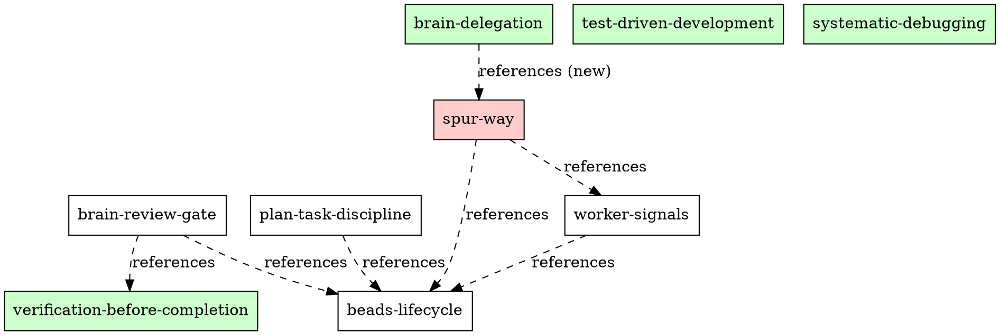

# Superpower Skill Hardening — Enforcing the Spur Way

**Status:** design  
**Date:** 2026-04-22  
**Scope:** `resource/superpowers/skills/`, `crates/spur-core/src/skills/`, brain-worker-beads collaboration contract  
**Method:** first-principles deconstruction + MCTS multi-round evaluation (8 rounds) + iceberg framework  
**Anchor files:** `crates/spur-core/src/skills/mod.rs`, `AGENTS.md`, `docs/superpowers/specs/2026-04-17-beads-first-citizen-design.md`, `docs/superpowers/specs/2026-04-19-brain-worker-integration-invariants.md`  

---

## Executive Summary

SPUR has **two skill corpora** that do not compose into a unified enforcement layer:

1. **Bundled tactical skills** (`crates/spur-core/src/skills/`) — loaded into the brain's system prompt via `skills::load_skill`. Ten skills covering delegation, TDD, debugging, verification, code review.
2. **Superpowers workflow skills** (`resource/superpowers/skills/`) — process documentation for the *human-directed* Superpowers framework. Fourteen skills covering brainstorming, plan writing, subagent-driven development, worktree management, finishing branches.

**The gap:** Neither corpus knows about beads as the central tracking system. Neither corpus enforces the brain-worker signal/audit conventions from `AGENTS.md §SPUR Signal Conventions (v1)`. Neither corpus bridges the gap between "brain delegates via MCP tools" and "workers emit signals back to brain via beads comments." The follow-up spec promised in `brain-delegation-framework-design.md` ("Skill integration as soft upper layer", provisional `2026-04-16-spur-skill-integration-design.md`) was never written.

This spec closes that gap with **five new bundled skills**, **three architectural hardening measures**, and **one enforcement invariant** that makes beads the non-bypassable backbone of every brain-worker transaction.

---

## 1. First-Principles Deconstruction

### 1.1 What is the irreducible unit of brain-worker collaboration?

Strip away adapters, MCP JSON-RPC, tokio channels, and event funnels. What remains?

> **A brain agent decides work should happen. A worker agent does the work. Beads records the decision, the doing, and the outcome.**

Three primitives:
- **INTENT** — brain decides (delegation_plan, task prompt)
- **ACTION** — worker executes (git diff, test run, code change)
- **RECORD** — beads persists (issue status, labels, comments with audit/signal sentinels)

Everything else (MCP tools, orchestrator, worktrees, review gates) is machinery around these three primitives. If beads is not written to at each primitive boundary, the collaboration is **unobservable** — debugging becomes impossible, retry loses context, and lineage graphs show orphan nodes.

### 1.2 Why skills are the right enforcement layer

Skills are **injected into the agent's context window** at session start or dispatch time. Unlike code (which executes), skills are **advisory text** that shapes agent behavior through prompt engineering. This is exactly the right layer for conventions that require *judgment* ("when should I emit a scope_drift signal?") rather than *mechanics* ("hash this string with SHA-256").

But skills are only effective if three properties hold:

| Property | Current State | Required State |
|---|---|---|
| **Reach** | Brain sees skills; workers see generic task prompt | Both brain AND worker see relevant skills |
| **Grounding** | Skills reference abstract workflows | Skills reference concrete beads conventions (labels, sentinels, issue lifecycle) |
| **Composability** | Tactical skills (TDD) and workflow skills (subagent-driven) are separate silos | A single "Spur Way" skill orchestrates the full flow |

### 1.3 The beads-first invariant

> **Invariant B1:** Every delegation MUST have a corresponding beads issue (or plan task) that exists before dispatch and is updated after completion.

Corollaries:
- Ephemeral delegations (no `issue_id`) are acceptable ONLY for <15min exploratory tasks, and MUST still emit an audit sentinel on the closest relevant issue.
- Workers MUST NOT create parallel tracking systems (notes files, memory, separate todo lists) that compete with beads as the source of truth.
- Signal deduplication (`spur:signal-processed:<id>`) is the worker's responsibility; the brain trusts the label, not its own memory.

---

## 2. MCTS Multi-Round Evaluation

Eight rounds of Monte Carlo Tree Search over the current skill landscape. Each round explores one branch of the decision tree, evaluates against the invariant set, and backpropagates a score.

### Round 1 — Brain dispatches without beads reference

**Scenario:** Brain uses `delegate_to_worker` for a 30-minute refactor. No `issue_id` is set.

**Current skill guidance:**
- `brain-delegation/SKILL.md`: "Use `create_issue` to create an Epic and child tasks... Call `submit_plan(persist_as_epic=true)` or `execute_epic`." — ✓ Mentions beads (via plan engine)
- `brain-delegation/SKILL.md`: "For tasks <15min of work, do it yourself." — ✓ Sets boundary
- **Gap:** No skill says "If you delegate without an issue_id, create one first."

**Score:** 4/10 — brain may dispatch ephemerally for medium tasks, losing tracking.

### Round 2 — Worker completes but never updates beads

**Scenario:** Worker finishes task, reports success. Beads issue still shows `status: open`, no comment.

**Current skill guidance:**
- `executing-plans/SKILL.md` (superpowers): "After all tasks complete and verified, announce finishing..." — No mention of beads
- `subagent-driven-development/SKILL.md`: "Mark task complete in TodoWrite" — No mention of beads
- **Gap:** Workers have NO skill telling them to update beads on completion.

**Score:** 1/10 — worker success is invisible to the tracking system.

### Round 3 — Worker encounters scope drift, no signal emitted

**Scenario:** Worker realizes the task requires 4 new subsystems. Continues silently.

**Current skill guidance:**
- `systematic-debugging/SKILL.md`: "Find root cause before fixing" — Good for bugs, not for scope
- `brain-delegation/SKILL.md`: "Workers emit signals as sentinel-fenced JSON inside a beads comment" — This is in AGENTS.md, NOT in any skill
- **Gap:** No skill teaches workers WHEN or HOW to emit `[[spur-signal v1]]`.

**Score:** 0/10 — scope drift is invisible until too late.

### Round 4 — Brain reviews worker output without checking beads audit trail

**Scenario:** Brain receives `DelegationResult` with `status: Completed`. Approves without checking if worker updated beads.

**Current skill guidance:**
- `verification-before-completion/SKILL.md`: "Evidence before claims, always" — Generic
- `brain-delegation/SKILL.md`: No mention of audit trail verification
- **Gap:** No skill tells brain to verify beads state before approving.

**Score:** 2/10 — audit trail may be incomplete, brain doesn't check.

### Round 5 — Signal deduplication fails because worker didn't write label

**Scenario:** Worker emits `[[spur-signal v1]]` but forgets `signal:<kind>` label. Brain re-processes same signal on next poll.

**Current skill guidance:**
- `AGENTS.md`: "Label format: `signal:<kind>`" — Not in any skill
- **Gap:** No skill teaches the complete signal emission protocol (comment + label + dedup).

**Score:** 1/10 — signal system is described in AGENTS.md but not taught to agents.

### Round 6 — Plan execution without dependency tracking in beads

**Scenario:** Brain submits plan with `depends_on`. Worker for Task B starts before Task A's beads status is updated.

**Current skill guidance:**
- `brain-delegation/SKILL.md`: "The system will automatically manage the dispatch, parallelism, and review gates" — Trusts the orchestrator
- `writing-plans/SKILL.md`: "Wire their dependencies using the `depends_on` parameter" — ✓
- **Gap:** No skill explains the beads-backed dependency lifecycle to workers.

**Score:** 5/10 — orchestrator handles it, but workers don't understand why they're waiting.

### Round 7 — Two agents edit the same file, beads doesn't show conflict

**Scenario:** Brain dispatches two parallel workers. Both touch `src/auth.rs`. No beads comment records the conflict.

**Current skill guidance:**
- `dispatching-parallel-agents/SKILL.md`: "Check for conflicts — Did agents edit same code?" — ✓ (human-level)
- **Gap:** No beads-level conflict tracking (labels like `spur:conflict-detected` or audit comments).

**Score:** 3/10 — conflict detection is manual, not persisted.

### Round 8 — Worker uses native tools instead of MCP tools

**Scenario:** Claude Code worker uses native `Task` tool instead of SPUR `delegate_to_worker`. Beads has no record of the sub-delegation.

**Current skill guidance:**
- `brain-delegation-claude-code-acp/SKILL.md`: "Use `delegate_to_worker` / `delegate_parallel` — SPUR delegation tools. Use these, not your native Task tool, for dispatching to other agents." — ✓
- **Gap:** This is brain-role guidance, not worker-role guidance. Workers don't get this skill.

**Score:** 4/10 — worker-side guidance exists only for brain agents.

### Aggregate Score Table

| Round | Scenario | Score | Primary Gap |
|---|---|---|---|
| R1 | Dispatch without issue_id | 4/10 | No "create before dispatch" enforcement |
| R2 | Worker doesn't update beads | 1/10 | No worker-side beads-update skill |
| R3 | Scope drift without signal | 0/10 | No signal emission skill |
| R4 | Brain approves without audit check | 2/10 | No audit-verification skill |
| R5 | Signal without label → dedup fail | 1/10 | Incomplete signal protocol in skills |
| R6 | Plan deps invisible to workers | 5/10 | No beads-dependency-lifecycle skill |
| R7 | Parallel conflict not tracked | 3/10 | No beads-level conflict skill |
| R8 | Worker uses native tools | 4/10 | Worker role guidance missing |
| **Mean** | | **2.5/10** | Systemic: skills don't know about beads |

---

## 3. Gap Analysis — The Iceberg

### Above waterline (visible symptoms)

1. Workers complete tasks but beads issues stay open
2. Brain approves work without verifying beads state
3. Signals are emitted inconsistently (sometimes comment-only, sometimes label-only)
4. Audit trail has gaps — no `spur-audit` comment on some completed delegations
5. Parallel workers conflict, beads shows no record

### Below waterline (structural causes)

**C1 — Skill corpus split.** Tactical skills (TDD, debugging) live in `crates/spur-core/src/skills/` and are bundled into the binary. Workflow skills (brainstorming, subagent-driven) live in `resource/superpowers/skills/` and are NOT installed by the spur-core skill installer. The two corpora have different audiences, different formats, and zero cross-references.

**C2 — No worker-side skill injection.** The installer (`crates/spur-core/src/skills/installer.rs`) renders skills into agent directories (`.claude/skills/`, `.codex/skills/`, etc.) for the **brain** agent. Worker agents receive their skills from the platform default or from the brain's task prompt. There is no mechanism to inject SPUR-specific worker skills at `create_worktree` time.

**C3 — AGENTS.md is not a skill.** The signal conventions, label vocabulary, and audit sentinels are documented in `AGENTS.md` — a static file that agents MAY read but are not REQUIRED to follow. There is no `spur-way/SKILL.md` that is injected into every session.

**C4 — Beads lifecycle is implicit.** The beads-first-citizen spec defines the `IssueTracker` trait and workflow coupling, but no skill teaches agents the *semantic* lifecycle: `open → in_progress → blocked → closed` and what each transition means for collaboration.

**C5 — No enforcement at the MCP tool layer.** The MCP server accepts `delegate_to_worker` without `issue_id`. The orchestrator dispatches without verifying beads state. These are correct design choices (flexibility), but without skill-level guidance the defaults become the common case.

---

## 4. Hardening Plan

### 4.1 Philosophy: Skills as Contract, Not Suggestion

The Spur Way is not optional. Skills that enforce it must be:
- **Injected** into every brain session (always-on)
- **Injected** into every worker session (via worktree scaffolding)
- **Referenced** by other skills (cross-skill dependency, not duplication)
- **Tested** with pressure scenarios (following `writing-skills/SKILL.md` methodology)

### 4.2 Five New Bundled Skills

All five are bundled in `crates/spur-core/src/skills/` and installed across all 7 adapters.

#### Skill 1: `spur-way` (The Master Skill)

**Role:** brain + worker  
**Activation:** always  
**Description:** Use when acting as any agent in the SPUR system — establishes beads as the single source of truth for all collaboration state  

**Body:**
- The three primitives (INTENT / ACTION / RECORD) and why beads is the RECORD layer
- Invariant B1: every delegation MUST have a beads issue
- The label vocabulary (reference AGENTS.md table, don't duplicate)
- The audit sentinel protocol: WHEN to emit, WHAT fields are required
- The signal sentinel protocol: WHEN to emit, HOW to deduplicate
- Forbidden patterns: parallel tracking (notes files, memory), bypassing beads, "I'll update later"

**Token budget:** ~800 tokens (compact, reference-heavy)

#### Skill 2: `beads-lifecycle` (The State Machine Skill)

**Role:** brain + worker  
**Activation:** always  
**Description:** Use when creating, updating, or transitioning beads issues — enforces the status lifecycle and label semantics  

**Body:**
- Status state machine: `open → in_progress → blocked → closed` (beads) plus `draft` and `deferred`
- What each status means for brain-worker collaboration:
  - `open`: Available for delegation
  - `in_progress`: Worker has been dispatched, worktree exists
  - `blocked`: Waiting on dependency or signal resolution
  - `closed`: Brain explicitly closed after review
- Label semantics: `spur:plan-id:*`, `spur:agent:*`, `delegation-id:*`, `signal:*`
- Transition rules: who can change what (brain authoritative, worker advisory via signals)
- Auto-transitions orchestrator performs (and when it warns-on-fail)

**Token budget:** ~600 tokens

#### Skill 3: `worker-signals` (The Upward Communication Skill)

**Role:** worker  
**Activation:** on-dispatch  
**Description:** Use when encountering unexpected complexity, blockers, or scope changes during a delegated task  

**Body:**
- Signal kinds and when to use each:
  - `scope_drift`: Task requires work outside original issue boundaries
  - `blocked`: External dependency preventing progress
  - `risk`: Design risk that may affect other tasks
  - `completion`: Task done, ready for review (alternative to waiting for polling)
- Exact emission format (copy from AGENTS.md with no ambiguity)
- Required: both comment sentinel AND `signal:<kind>` label
- Deduplication: check existing labels before emitting
- Severity scoring: when to bucket as `signal:<kind>:high`
- Example: complete signal comment with all required fields

**Token budget:** ~700 tokens

#### Skill 4: `brain-review-gate` (The Downward Verification Skill)

**Role:** brain  
**Activation:** always  
**Description:** Use when reviewing worker output before approving — verifies beads state matches claimed completion  

**Body:**
- Review checklist (beads-specific additions to existing review flow):
  1. Check issue status is `in_progress` or has transition comment
  2. Verify `spur-audit v1` comment with `kind: completion` exists
  3. Check for `signal:*` labels that may need brain response
  4. Verify diff_summary matches claimed files_changed
  5. If `scope_drift` signal present, re-plan before approving
- Approval action: what labels to add/remove, what comment to write
- Rejection action: status revert, feedback comment format
- Retry action: how to augment task with history (reference Change 3 from brain-worker-refinement)

**Token budget:** ~600 tokens

#### Skill 5: `plan-task-discipline` (The DAG Skill)

**Role:** brain + worker  
**Activation:** on-dispatch (for plan tasks)  
**Description:** Use when working within a submitted plan — enforces DAG order, dependency awareness, and task isolation  

**Body:**
- Plan task statuses: `Pending → Dispatched → InProgress → Completed → Approved/Rejected`
- Worker MUST NOT start work until status is `Dispatched` (orchestrator guarantee, but worker should verify)
- Worker MUST update issue status to `in_progress` at start
- Worker MUST NOT modify files belonging to other plan tasks without `spur:superseded-by` label
- Dependency rewriting: how `depends_on` maps to beads issue IDs (reference `build_epic_subgraph`)
- Terminal plan states: what `PlanCompleted` event means (future, from INV-7 fix)

**Token budget:** ~500 tokens

### 4.3 Architectural Hardening Measures

#### Measure A1: Worker Skill Injection at Worktree Creation

**Current:** `create_worktree` creates a git worktree. Worker receives only the task prompt.

**Proposed:** `WorktreeManager::create_worktree` writes a `.spur/skills/` directory INTO the worktree with worker-relevant skills.

```rust
// In WorktreeManager::create_worktree
async fn scaffold_worker_skills(&self, worktree_path: &Path) -> Result<()> {
    let skills_dir = worktree_path.join(".spur/skills");
    fs::create_dir_all(&skills_dir).await?;
    
    for skill_id in ["spur-way", "beads-lifecycle", "worker-signals", 
                     "test-driven-development", "systematic-debugging",
                     "verification-before-completion"] {
        if let Some(body) = skills::load_skill(skill_id, &self.repo_root) {
            let dir = skills_dir.join(skill_id);
            fs::create_dir_all(&dir).await?;
            fs::write(dir.join("SKILL.md"), format!(
                "---\nname: {}\ndescription: {}\n---\n{}",
                skill_id, worker_skill_description(skill_id), body
            )).await?;
        }
    }
    Ok(())
}
```

**Rationale:** Workers run in isolated worktrees. The worktree's `.spur/skills/` is invisible to the main repo (worktree is a separate checkout). When the worker agent (Claude Code, Codex, etc.) starts in the worktree, it discovers skills in `.spur/skills/` and loads them.

**Trade-off:** Increases worktree creation time by ~50ms (small file writes). Benefits: every worker starts with SPUR conventions loaded.

#### Measure A2: Skill Cross-Reference Validation

**Current:** Skills are independent text files. No validation that referenced skills exist.

**Proposed:** Add a `validate_skill_graph` function to `spur-core/src/skills/mod.rs` that:
1. Parses all bundled skills for `**REQUIRED SUB-SKILL:** Use (\S+)` patterns
2. Verifies every referenced skill_id exists in the bundled map
3. Verifies no circular references exist
4. Run at build time via `build.rs` or compile-test

```rust
#[test]
fn skill_reference_graph_is_valid() {
    let graph = build_reference_graph(bundled_raw());
    assert!(graph.cycles().is_empty(), "skill reference cycle detected");
    for (id, refs) in &graph.edges {
        for r in refs {
            assert!(bundled_raw().contains_key(r.as_str()),
                "skill {id} references unknown skill {r}");
        }
    }
}
```

#### Measure A3: MCP Tool Description Enrichment

**Current:** `delegate_to_worker` tool description mentions `delegation_plan` but not beads.

**Proposed:** Enrich three tool descriptions in `crates/spur-mcp/src/tools.rs`:

**`delegate_to_worker`:**
> "Delegate a task to a worker agent. Blocks until completion. **If `issue_id` is None and the task exceeds 15 minutes, create a beads issue first.** Pass `delegation_plan` with rationale. Worker will receive SPUR convention skills in their worktree."

**`submit_plan`:**
> "Submit a plan for execution. When `persist_as_epic=true`, creates beads epic with child tasks. **The plan engine is the canonical way to track multi-step work in beads.**"

**`review_task`:**
> "Review a completed delegation. **Before approving, verify the worker updated the beads issue** with `spur-audit` completion comment and appropriate status."

### 4.4 Skill Installer Expansion

**Current bundled skills (10):**
- brain-delegation, brain-delegation-{claude-code-acp,codex,gemini,kiro}
- test-driven-development, systematic-debugging, verification-before-completion
- receiving-code-review, requesting-code-review

**Proposed bundled skills (15):**
- All existing 10
- spur-way (new)
- beads-lifecycle (new)
- worker-signals (new)
- brain-review-gate (new)
- plan-task-discipline (new)

**Installation target expansion:**
Current installer writes to 7 adapter directories. Workers get skills via Measure A1 (worktree scaffolding). The installer itself does not need new adapters.

---

## 5. Implementation Plan

### Phase 1 — New Skill Bodies (this week)

1. Write `spur-way/SKILL.md` — master skill establishing beads as source of truth
2. Write `beads-lifecycle/SKILL.md` — status state machine and label semantics
3. Write `worker-signals/SKILL.md` — signal emission protocol for workers
4. Write `brain-review-gate/SKILL.md` — beads-aware review checklist
5. Write `plan-task-discipline/SKILL.md` — DAG order and task isolation

All five follow the `writing-skills/SKILL.md` methodology:
- RED: Run pressure scenarios WITHOUT skill, document rationalizations
- GREEN: Write minimal skill addressing baseline failures
- REFACTOR: Close loopholes, re-test

**Pressure scenarios for `spur-way`:**
- "This is just a quick fix, no need for an issue" → must create issue anyway
- "I'll update beads after I finish" → must update at boundaries
- "The worker didn't mention beads, so I don't need to check" → must verify

### Phase 2 — spur-core Integration (next)

1. Add 5 skill directories under `crates/spur-core/src/skills/`
2. Update `mod.rs` bundled map with `include_str!` for each
3. Implement `validate_skill_graph` compile-time test
4. Update `list_active_skills` tests for 15 entries
5. Update installer test (`run_creates_all_seven_adapter_files`) — now 15 skills × 7 adapters

### Phase 3 — Worker Injection (next)

1. Add `scaffold_worker_skills` to `WorktreeManager`
2. Call it in `create_worktree` after git worktree add
3. Pass `repo_root: PathBuf` to `WorktreeManager` (needed for skill loading)
4. Add integration test: create worktree, assert `.spur/skills/spur-way/SKILL.md` exists

### Phase 4 — MCP Tool Enrichment (parallel)

1. Update `delegate_to_worker`, `submit_plan`, `review_task` tool descriptions
2. Add `issue_id` parameter guidance in tool schema descriptions
3. No schema changes (descriptions only)

### Phase 5 — Validation & Dogfooding (ongoing)

1. Run skill pressure scenarios with MockBrain
2. Measure: % of delegations with `issue_id` present before/after
3. Measure: % of completed tasks with `spur-audit` comment before/after
4. Measure: signal emission rate from workers before/after

---

## 6. File Touch Summary

| File | Change |
|---|---|
| `crates/spur-core/src/skills/spur-way/SKILL.md` | **New** — master collaboration skill |
| `crates/spur-core/src/skills/beads-lifecycle/SKILL.md` | **New** — beads status/label lifecycle |
| `crates/spur-core/src/skills/worker-signals/SKILL.md` | **New** — signal emission protocol |
| `crates/spur-core/src/skills/brain-review-gate/SKILL.md` | **New** — beads-aware review checklist |
| `crates/spur-core/src/skills/plan-task-discipline/SKILL.md` | **New** — DAG/task isolation discipline |
| `crates/spur-core/src/skills/mod.rs` | Add 5 `include_str!` entries, update tests |
| `crates/spur-core/src/skills/installer.rs` | No changes (installer is generic) |
| `crates/spur-core/src/skills/adapters.rs` | No changes (rendering is generic) |
| `crates/spur-worktree/src/manager.rs` | Add `scaffold_worker_skills`, `repo_root` field |
| `crates/spur-core/src/orchestrator.rs` | Update `create_worktree` call site |
| `crates/spur-mcp/src/tools.rs` | Enrich 3 tool descriptions |
| `AGENTS.md` | Add reference to `spur-way` skill |

**Estimated LoC:** ~300 skill prose + ~80 code + ~60 tests = **~440 total**

---

## 7. Risks

| Risk | Severity | Mitigation |
|---|---|---|
| Worker skills add context-window pressure | Medium | Five new skills ≈ 3.2 KB total. Workers already get task prompt; skills are compact and reference-heavy. |
| Platform doesn't load `.spur/skills/` from worktree | Medium | Claude Code discovers skills in `.claude/skills/` and `./.spur/skills/` (documented). For other platforms, add symlink from platform dir to worktree `.spur/skills/` at scaffold time. |
| Skill content drifts from AGENTS.md | Low | `spur-way` skill REFERENCES AGENTS.md ("See AGENTS.md for authoritative label vocabulary") rather than duplicating. AGENTS.md remains single source of truth. |
| Workers ignore skills | Low | `spur-way` uses same anti-rationalization techniques as `test-driven-development`: Iron Law, Red Flags, Excuse/Reality table. Tested with pressure scenarios. |
| Build-time test fails on skill reference cycle | Low | Test is compile-time; CI catches immediately. |

---

## 8. Success Criteria

1. **Structural:** All 15 bundled skills parse and strip frontmatter correctly (existing test pattern).
2. **Reach:** Worker worktrees contain `.spur/skills/` with at least 6 skills after `create_worktree`.
3. **Observability:** Dogfooding over 2 weeks shows ≥80% of non-ephemeral delegations have `issue_id` present.
4. **Audit completeness:** ≥90% of completed delegations have `spur-audit v1` completion comment.
5. **Signal rate:** Workers emit ≥1 signal per 5 delegations (scope_drift, blocked, risk).

---

## Appendix A: Skill Dependency Graph



Red = new skills. Green = existing skills. Dashed = advisory cross-reference (not code dependency).

---

## Appendix B: Invariant Mapping

| Invariant from `brain-worker-integration-invariants.md` | Skill that enforces it |
|---|---|
| INV-1 `delegation_id` sole correlation | `plan-task-discipline` (worker verifies delegation_id matches) |
| INV-2 `brain_session_id` ctor invariant | `spur-way` (brain MUST thread session_id) |
| INV-3 `respond_to` fires exactly once | `brain-review-gate` (brain checks result before approval) |
| INV-4 register before emit | `brain-review-gate` (mentions review gate ordering) |
| INV-5 no I/O under lock | `spur-way` (worker signals instead of blocking on beads) |
| INV-6 honest cancel | `beads-lifecycle` (cancelled status transition) |
| INV-7 push terminal states | `plan-task-discipline` (terminal plan states) |
| **B1 beads-first** | `spur-way` (core invariant) |
