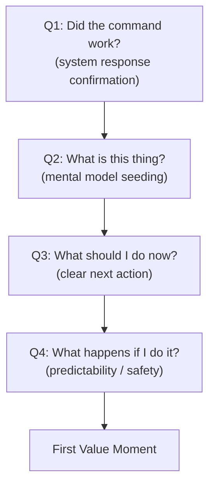
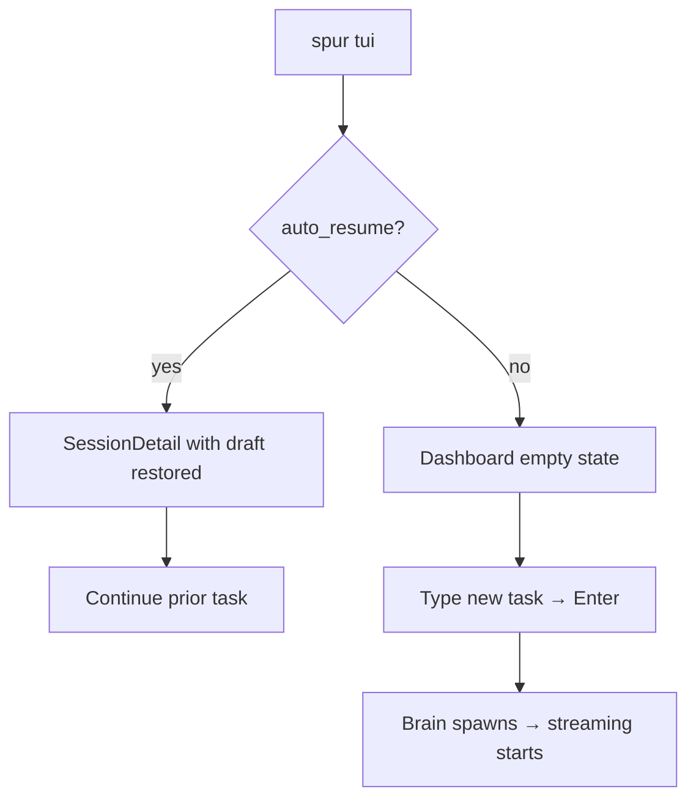
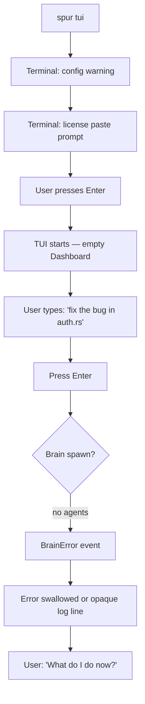
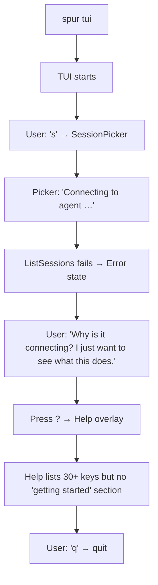

# SPUR TUI Bootstrap UX — First-Principles Audit with MCTS Evaluation

> **Author:** L9 Rust Staff Engineer perspective  
> **Date:** 2026-04-24  
> **Scope:** `crates/spur-cli` + `crates/spur-tui` — the first 30 seconds of user contact  
> **Grounded at:** HEAD `87dd0d9`  
> **Supersedes / extends:** `2026-04-19-spur-tui-user-journey.md` §4.1 (P1 bootstrap), `2026-04-19-community-default-onboarding-design.md`

---

## 1. First-Principles Framing

### The Bootstrap Theorem

> **A user's willingness to forgive friction is inversely proportional to their accumulated trust.** At bootstrap, trust = 0. Therefore, every millisecond of confusion is paid for with compound interest.

### Intent Graph (First-Principles Deconstruction)

A user who types `spur tui` has **already decided** to try the tool. They have crossed the motivation threshold. The bootstrap step must answer four questions in order:



**Current SPUR violates Q2→Q3 on first contact.** The empty Dashboard answers Q1 (screen appears) but answers Q2 with jargon ("multi-agent orchestrator") and Q3 with an underspecified prompt ("Type a task below" — but *what kind of task?*). Q4 is violated because the user cannot predict what will happen when they type and press Enter.

---

## 2. Current State — Code-Grounded Trace

### 2.1 Execution Path: `spur tui` → First Frame

```
main.rs:467   Commands::Tui { brain, sessions, dashboard, profile, duration }
main.rs:499   load_config() → warn!("failed to load config.toml") if missing
main.rs:507   SpurLicense::from_env_or_disabled() → CommunityProvider if no env vars
main.rs:508   onboarding::maybe_prompt_first_run()   ← BLOCKING TERMINAL PROMPT (pre-TUI)
main.rs:511   to_event_state(license.current_state())
main.rs:515   PmService::try_new()                   ← optional, may fail silently
main.rs:537   Orchestrator::new(repo_root, config, ...)
main.rs:549   InteractiveFrontendHost::spawn(orch, brain)
main.rs:586   SessionMetadataStore::load()             ← landing decision input
main.rs:595   auto_resume logic                        ← may silently skip
main.rs:633   spur_tui::app::run_tui_with_license()    ← TUI STARTS HERE
  tui.rs:13     enable_raw_mode(); EnterAlternateScreen; Clear
  app.rs:2297   App::new_with_license(...)
  app.rs:272    if start_in_picker → SessionPicker::new() else Dashboard::new()
  app.rs:2887   terminal.draw(|f| app.render(f))       ← FIRST FRAME
```

### 2.2 The Pre-TUI Chasm

**Critical finding:** Three user-visible interactions happen *before* `tui::setup()` clears the screen:

| Step | Output | User Perception |
|---|---|---|
| `load_config()` fail | `[spur] warning: failed to load config.toml: …; using defaults` | "Something is wrong already" |
| `maybe_prompt_first_run()` | `spur is running on the Community tier (free). Paste a license key…` | "I thought this was a TUI? Why am I at a terminal prompt?" |
| `PmService::try_new()` fail | (silent, logged only) | — |

**The chasm:** The user invoked `spur tui` expecting a fullscreen TUI. Instead they get terminal text, a blocking stdin read, and THEN the screen clears. This is a **mode violation** — the tool promised a TUI but delivered a CLI interaction first.

### 2.3 The First Frame (Dashboard Empty State)

`dashboard.rs:445-514` — rendered when `node_count == 0`:

```
┌─ spur ──────────────────────────────────────────────────────────────┐
│                                                                     │
│                              SPUR                                   │
│                                                                     │
│                         Multi-agent orchestrator                    │
│                                                                     │
│                      Type a task below to start                     │
│                                                                     │
│                    Press [s] to browse sessions                     │
│                                                                     │
├─────────────────────────────────────────────────────────────────────┤
│  > _                                                                │
│                                                                     │
└─────────────────────────────────────────────────────────────────────┘
 $ idle · 0 running · 0 pending · $0.00 · 0m 00s          ? help · q quit
```

**What's missing:**
- No example prompt showing what SPUR is good at
- No indication that agents need to be configured first (`spur init`)
- `[s]` suggestion is meaningless when there are zero sessions
- The term "multi-agent orchestrator" is accurate but not informative to a newcomer
- No visual distinction between "this tool is ready" and "this tool needs setup"

### 2.4 The Silent Failure Path (No Config → No Agents → BrainError)

When `SpurConfig::default()` is used, `AgentsConfig::entries = []` (`config/mod.rs:454-457`). Default brain = `"claude-code"` (`config/mod.rs:418-419`).

User journey to first failure:
1. Type task → `Enter`
2. `Action::NewSessionWithMessage` → `UserInput::NewSessionWithMessage`
3. `orchestrator.rs:1110` → `InteractiveInput::NewSessionWithMessage`
4. `orchestrator.rs:1524` → `spawn_brain_session(None, ...)`
5. `orchestrator.rs:2006` → `registry.get("claude-code")` → `None`
6. `orchestrator.rs:1543-1556` → `SpurEventBody::BrainError { message: "Brain agent 'claude-code' not found in registry" }`

**How this renders:** The TUI receives `BrainError` via `handle_spur_event()`. Tracing the handler in `app.rs`:
- `BrainError` is NOT in the top-level `match &event.body` block (`app.rs:932-1100` range)
- It falls through to view forwarding
- `DashboardView` does not handle `BrainError` specifically in the code shown
- The error likely appears as a generic log entry or is silently dropped from the user's perspective

**Result:** The user typed a task, pressed Enter, and… nothing visibly happens. Or an opaque error appears in the activity log. They do not know they need to run `spur init`.

---

## 3. MCTS Evaluation — Three-Round Expansion

### Methodology

For each bootstrap persona, we expand an intent tree with MCTS-style branching:
- **Happy:** User has optimal preconditions
- **Friction:** User has realistic but suboptimal preconditions
- **Adversarial:** User is confused or misinformed

Each leaf is scored 0–3:
- **0** = Blocker — cannot complete without external help
- **1** = Friction — completable with retries or out-of-band knowledge
- **2** = Acceptable — patient user succeeds
- **3** = Delightful — intent maps cleanly to discoverable affordance

### Round 1: Happy Path — User ran `spur init`, has agents, has prior sessions



| Node | Current State | Score | Rationale |
|---|---|---|---|
| auto_resume | Metadata-driven, brain-mismatch guard exists (`main.rs:599-606`) | **3** | Safe, correct, transparent in logs |
| SessionDetail restore | Draft restored from metadata; history replayed | **3** | Excellent — user lands exactly where they left off |
| Dashboard → new task | Empty state → type → Enter | **2** | Works, but empty state doesn't suggest *what* to type |
| **Happy path avg** | | **2.7** | Strong for returning users; weak for new-task context |

### Round 2: Friction Path — First-time user, no `.spur/`, no config, no agents



| Node | Current State | Score | Rationale |
|---|---|---|---|
| Config warning | stderr warning only; no CTA | **1** | User sees "warning" but no guidance toward `spur init` |
| License prompt | Pre-TUI blocking prompt; breaks TUI contract | **1** | Jarring mode switch; okay for power users, bad for first-timers |
| Empty Dashboard | No setup-needed signal; no `spur init` nudge | **0** | **BLOCKER:** User cannot discover that agents need configuration |
| Task dispatch | Fails silently or opaquely | **0** | **BLOCKER:** User takes the suggested action (type task) and it fails |
| Recovery path | No in-app path to fix the problem | **0** | **BLOCKER:** User must quit, read docs, or guess `spur init` |
| **Friction path avg** | | **0.4** | Critical failure for the most important persona |

### Round 3: Adversarial Path — User is a developer who skimmed the README



| Node | Current State | Score | Rationale |
|---|---|---|---|
| `s` on empty | Opens picker even when no sessions exist | **1** | Picker then shows connection error; user learns nothing |
| Help on first contact | Comprehensive keymap but no conceptual intro | **1** | Help assumes user already understands brain/worker/review |
| Quit path | `q` → confirmation if brain attached; otherwise exits | **3** | Clean exit, draft preserved |
| **Adversarial path avg** | | **1.7** | User leaves with negative impression; no value delivered |

---

## 4. Synthesis — Scored Gap Matrix

### 4.1 Bootstrap-Specific Gaps (not covered by prior UX audits)

| # | Gap | Severity | Persona | Root Cause | Fix Strategy |
|---|---|---|---|---|---|
| B1 | **Pre-TUI terminal prompt violates mode contract** | 🔴 Critical | P1 | `maybe_prompt_first_run()` runs before `tui::setup()` | Move onboarding into TUI chrome or use a pre-flight TUI frame |
| B2 | **No config → no agents → silent failure chain** | 🔴 Critical | P1 | Default config has empty agents; error not surfaced in empty state | Detect empty registry in TUI; render setup-nudge instead of task prompt |
| B3 | **Empty state doesn't teach the tool's value prop** | 🟡 High | P1, P2 | Splash is brand-first, not use-case-first | Add rotating example prompts; explain "brain delegates to workers" in one line |
| B4 | **`[s] browse sessions` shown when zero sessions exist** | 🟡 High | P1 | Empty-state copy is static | Conditional hints: no sessions → suggest `spur init`; has sessions → suggest `[s]` |
| B5 | **No progressive setup guidance inside TUI** | 🟡 High | P1 | `spur init` is a separate CLI command; TUI doesn't know about it | Banner or inline hint: "No agents found — run `spur init` to set up" |
| B6 | **Config warning is stderr-only; no TUI integration** | 🟢 Medium | P1 | `eprintln!` in main.rs | Surface config status in status bar or initial banner |
| B7 | **Input bar hint doesn't explain what SPUR does** | 🟢 Medium | P1 | Hint shows keybindings, not concepts | Contextual ghost-line: "Try: 'Refactor auth module and add tests'" |

### 4.2 Cross-Reference to Prior Audit

The `2026-04-19-spur-tui-user-journey.md` audit identified:
- **P1-I1** (Conceptual onboarding) — overlaps with B3, B5
- **P1-I2-b** (Dashboard popup parity) — independent of bootstrap
- **P2-I1** (Auto-resume) — works correctly, not a bootstrap issue
- **S3** (ChatInput parity) — independent of bootstrap

**This audit adds:** B1, B2, B4, B5, B6, B7 are **bootstrap-specific** and were not fully explored in the prior audit because that audit assumed the user could successfully send a first message.

---

## 5. Recommended Improvements (Bootstrap-Scoped)

### 5.1 Immediate: Setup-Nudge Empty State (B2 + B4 + B5)

**When:** `node_count == 0` AND `config.agents.entries.is_empty()` (or registry is empty).

**Replace the current empty state with:**

```
┌─ spur ──────────────────────────────────────────────────────────────┐
│                                                                     │
│                              SPUR                                   │
│                                                                     │
│      Ask for anything — SPUR breaks it into tasks and delegates     │
│            to specialist agents, then reviews the results.          │
│                                                                     │
│   ┌─────────────────────────────────────────────────────────────┐  │
│   │  ⚠ No agents configured. Run this in another terminal:      │  │
│   │                                                             │  │
│   │     spur init                                               │  │
│   │                                                             │  │
│   │  Then restart `spur tui` to begin.                          │  │
│   └─────────────────────────────────────────────────────────────┘  │
│                                                                     │
│   Examples of what you can ask (after setup):                       │
│   • "Refactor the auth module to async/await and add benchmarks"   │
│   • "Find and fix the flaky test in ci/"                           │
│   • "Add a /health endpoint with proper error handling"            │
│                                                                     │
├─────────────────────────────────────────────────────────────────────┤
│  > _                                                                │
│  [input disabled — setup required]                                  │
└─────────────────────────────────────────────────────────────────────┘
```

**Implementation:**
- Pass `config.agents.entries.len()` (or a `registry_is_empty` flag) into `App`
- In `DashboardView::render_with_lineage`, branch empty state on `agents_configured`
- If unconfigured: disable input bar (or show disabled styling), render setup banner
- This requires `App` to know agent config state — add a bool to `App` or `ViewContext`

### 5.2 Short-term: TUI-Integrated Onboarding (B1 + B6)

**Move `maybe_prompt_first_run()` into the TUI's first frame instead of a pre-TUI terminal prompt.**

**Why:** The terminal prompt is acceptable for a CLI tool, but `spur tui` is explicitly a TUI. A pre-TUI prompt is like a web app showing an `alert()` before the DOM loads.

**Design:**
- Remove `onboarding::maybe_prompt_first_run()` from `main.rs`
- On first TUI frame, if `marker_exists() == false` AND `license.is_community_default()`, render a transient banner:
  ```
  ╭─ Welcome ───────────────────────────────────────────────────────╮
  │  SPUR Community (free). Paste a license key to unlock Pro,     │
  │  or press Enter to continue.                                    │
  │                                                                 │
  │  > _                                                            │
  ╰─────────────────────────────────────────────────────────────────╯
  ```
- This is a lightweight inline prompt, not a modal. It consumes only the input bar area.
- On Enter: dismiss banner, write marker, continue
- On paste: attempt activation, show result inline, dismiss

**Alternative (simpler):** Keep the terminal prompt but add a 1-line spinner: "Setting up SPUR for first use…" before the prompt, so the user understands this is intentional, not a bug.

### 5.3 Medium-term: Example-Rich Empty State (B3 + B7)

**When:** Agents ARE configured, but no sessions exist yet (fresh start with valid config).

**Replace static splash with rotating examples:**

```
┌─ spur ──────────────────────────────────────────────────────────────┐
│                                                                     │
│                              SPUR                                   │
│                                                                     │
│   Type a task below. SPUR breaks it into steps and delegates        │
│   to specialist agents — you review before anything merges.         │
│                                                                     │
│   Try asking:                                                       │
│   → "Refactor auth to async/await and benchmark each endpoint"     │
│   → "Add input validation to all API handlers"                      │
│   → "Find the memory leak in the worker pool"                       │
│                                                                     │
│   [Press Tab to cycle examples]                                     │
│                                                                     │
├─────────────────────────────────────────────────────────────────────┤
│  > _                                                                │
│  ↵ send to brain · brain may delegate to workers                  │
└─────────────────────────────────────────────────────────────────────┘
```

**Implementation:**
- Add `example_prompts: Vec<String>` to `DashboardView`
- Rotate every 8s or on `Tab` press when input is empty
- Ghost-line (from P4 in `2026-04-19-spur-tui-ux-best-approach.md`) explains what Enter does

### 5.4 Conditional Hint System (B4)

**Logic for empty-state hints:**

```rust
enum EmptyStateVariant {
    /// No agents configured — show setup nudge
    SetupRequired,
    /// Agents configured, no sessions, no prior metadata
    FirstTimeReady,
    /// Agents configured, has archived sessions only
    AllSessionsArchived,
    /// Agents configured, has prior sessions
    WelcomeBack,
}
```

This replaces the single static empty state with context-aware guidance.

---

## 6. Prioritization

| Priority | Item | Gaps | Effort | Risk |
|---|---|---|---|---|
| **P0** | Setup-nudge empty state (5.1) | B2, B4, B5 | Low (~100 LoC) | Zero — purely additive branch |
| **P0** | Pre-TUI prompt polish (5.2 alt) | B1 | Trivial (~5 LoC) | Zero — copy change only |
| **P1** | TUI-integrated onboarding (5.2) | B1, B6 | Medium (~200 LoC) | Low — replaces terminal prompt with TUI frame |
| **P1** | Example-rich empty state (5.3) | B3, B7 | Low (~80 LoC) | Zero — additive |
| **P2** | Conditional hint system (5.4) | B4 | Low (~60 LoC) | Zero — refactor of existing branch |

**Recommended sprint scope:** P0 + P1 (example-rich empty state) = ~2 days, zero regression risk.

---

## 7. Verification Criteria

1. **First-run, no config:** `spur tui` renders setup-nudge empty state with `spur init` CTA. Input bar is visually disabled.
2. **First-run, config exists, no sessions:** `spur tui` renders example-rich empty state with rotating prompts.
3. **Returning user, last session <24h:** Auto-resume works; no empty state shown.
4. **All paths:** `cargo test --workspace` passes; no change to existing keybindings.
5. **Regression check:** Existing `SessionPicker` loading state, `HelpOverlay`, and `QuitConfirm` are untouched.

---

## 8. Open Questions

1. **Should we auto-detect `spur init` need from registry emptiness or from config file absence?** Registry emptiness is more accurate (user might have config with commented-out agents).
2. **Should the setup nudge auto-run `spur init` on `i` keypress from within TUI?** Requires TUI to shell out; doable but adds complexity. Defer to P2.
3. **How many example prompts?** Suggest 5–7, stored in `SpurConfig` so projects can customize.

---

_End of audit. Recommended next step: `writing-plans` skill to convert P0+P1 into a beads-backed implementation plan._
