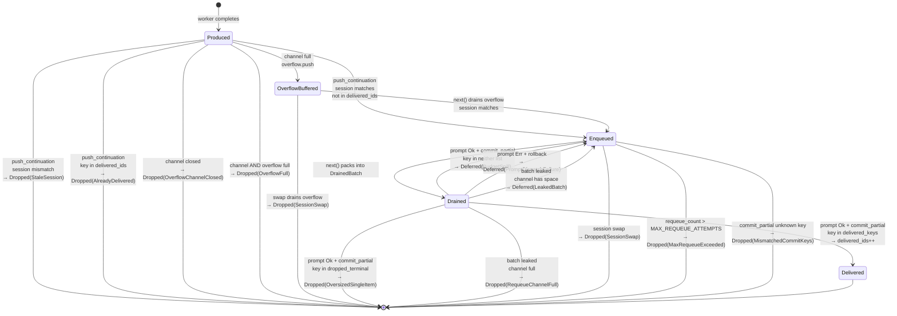

# Brain Continuation — Delivery Guarantees & Handshake Redesign

- **Date:** 2026-04-24 (v3.1 — kimi APPROVE with micro-patch)
- **Status:** Solution design — ready for implementation
- **Supersedes / amends:** `docs/superpowers/specs/2026-04-19-brain-async-continuation-design.md` (invariants INV-C1…C7 remain; this spec adds INV-D1…D7 below them and changes the scheduler↔dispatcher handshake)
- **Root-cause reference:** `docs/superpowers/reviews/2026-04-24-brain-continuation-rca.md`
- **Authored from:** 3-POV RCA (primary + `worker:kimi` + `worker:codex`) + multi-round first-principles analysis + 3 rounds of worker spec review (v1→v2 kimi+codex, v2→v3 kimi+codex, v3→v3.1 kimi APPROVE)

## Revision history

- **v1 (initial draft)** — two-phase checkout/commit handshake, session-scoped continuations, typed drop events.
- **v3.1 (this document)** — micro-patch surfaced by `worker:kimi` v3 review (APPROVE): `commit_partial` invariants now require intra-list uniqueness in `delivered_keys` and `dropped_terminal`. Without this, duplicate keys in `dropped_terminal` would emit multiple `ContinuationDropped` events for the same `(delegation_id, attempt)` — violating INV-D1 "exactly one terminal state per continuation". Fix is a 5-line invariant extension plus two dedup tests (`test_v3_1_dropped_terminal_duplicate_key`, `test_v3_1_delivered_keys_duplicate`). No code-shape changes.
- **v3** — amended to fix 4 residual issues identified by the v2-review round (`worker:codex` REWORK): the unreachable `OversizedSingleItem` terminal state, INV-D7 being claimed rather than enforced, retirement protocol backing-field ambiguity, and a compile error in the dispatch sample. v3 deltas:
  - **v3-a: `commit_partial` signature gains `dropped_terminal: Vec<(DelegationKey, DropReason)>`.** The renderer's `dropped_oversized` partition now has a real landing site on the scheduler side. Items in `dropped_terminal` are removed without requeue and fire `ContinuationDropped(reason)`. Closes v2 BUG B5 (phantom `OversizedSingleItem` state).
  - **v3-b: Requeue channel made bounded** (`mpsc::channel(REQUEUE_CHANNEL_CAPACITY)`, default `DRAIN_CAP * 4 = 128`). New `DropReason::RequeueChannelFull` fires on `try_send` fail in `DrainedBatch::Drop`. Converts v2's unbounded-leak failure mode into bounded-loss. INV-D7 now structurally enforced.
  - **v3-c: Retirement backing fields specified.** `McpCallbackServer` fields pinned: `retiring: AtomicBool`, `cancel_token: CancellationToken`, `task_tracker: TaskTracker`, `root_handle: Mutex<Option<JoinHandle<()>>>`. Each new method's implementation contract documented.
  - **v3-d: Dispatch sample compile errors fixed.** `RenderOutcome` destructured as struct (not tuple); `dropped_terminal` construction shown explicitly; unused bindings removed.

- **v2** — amended to fix 16 issues raised by the 1st-round `worker:kimi` (APPROVE-WITH-CHANGES) and `worker:codex` (REWORK) spec review. Summary of the v2 deltas:
  1. `TurnGuard` redesigned so sample dispatch code actually compiles (`Arc<AtomicBool>` backing, no `&mut scheduler` borrow held).
  2. `DrainedBatch::take(&mut self)` removed from public API; replaced with `pub(crate) fn into_items(self)` consumed only by terminal scheduler methods.
  3. Events split: `ContinuationDropped { reason: DropReason }` for terminal losses; `ContinuationDeferred { reason: DeferReason }` for retriable requeues.
  4. New `DropReason` variants: `AlreadyDelivered`, `OversizedSingleItem`, `MismatchedCommitKeys`.
  5. Oversized-single-item path: when a continuation's own cost exceeds the budget with no competing content, drop with `OversizedSingleItem` event — never requeue-to-starve.
  6. Retirement protocol formalised: worker cancel → bounded `shutdown_with_timeout` → overflow drain → `note_session_swap` → `delivered_ids.clear()`.
  7. `Arc<McpCallbackServer>` held by orchestrator so the retirement path can invoke `shutdown()` (was previously only holding a `JoinHandle`).
  8. Attempt numbering normalised to 1-based to match existing `orchestrator.rs:3286` retry state.
  9. `delivered_ids` bounded by explicit `delivered_ids.clear()` on `note_session_swap` (session-scoped keys).
  10. `created_at` split into `created_at_wall: DateTime<Utc>` (wire) and `created_at_mono: Instant` (scheduler-internal ordering).
  11. `commit_partial` invariant pinned: unknown keys emit `MismatchedCommitKeys` and are ignored; `debug_assert!` in debug builds.
  12. "Pure sync" reworded to **"runtime-free sync"** — scheduler is testable without a tokio runtime but holds `Arc<dyn EventSink>` and `mpsc::UnboundedReceiver`.
  13. `Instant` type clarified: scheduler uses `std::time::Instant`; orchestrator's `sleep_until` uses `tokio::time::Instant` at the boundary.
  14. Requeue channel bounded by invariant INV-D7 (≤1 outstanding `DrainedBatch` per turn, enforced by `turn_in_flight`) plus `requeue_depth` metric.
  15. Requeue insertion order pinned: all three paths (spill/rollback/leak) append to **back** of `pending_continuations` with `requeue_count += 1`.
  16. Internal requeue path uses `push_internal` (no dedup scan) — O(1) per item by construction.

## Executive summary

The brain-continuation delivery path has four independently-confirmed defects at HIGH severity or above. Two are silent data-loss bugs; one is a liveness hole; one is a session-scoping escape. Together they share a single architectural cause: the scheduler commits `delivered_ids` at drain time, before the dispatcher has attempted or succeeded at prompt delivery, and the dispatcher has no API to undo that commitment.

This spec replaces the drain-and-forget handshake with a **two-phase checkout/commit** protocol, tightens session scoping by moving `SessionId` into `BrainContinuation` itself, closes the cancel-grace liveness gap by letting the scheduler announce its own next wakeup deadline, and formalises uniform typed-reason event emission across every loss surface. Events distinguish **terminal drops** from **retriable deferrals** so operators can see the difference. Secondary content-shape fixes (finding F's `Debug`-stringified enum, finding E's dropped `artifact` field, finding G's unbounded producer output) land alongside as part of the same coordinated change.

---

## Invariants

Existing invariants INV-C1…C7 from the 2026-04-19 spec are preserved. This spec adds:

- **INV-D1 Delivery exactly-once-or-logged.** Every `BrainContinuation` that enters the scheduler's `pending_continuations` eventually reaches exactly one terminal state out of the following disjoint set:
  - **Delivered** — appeared in exactly one `session/prompt` call successfully dispatched to the brain session it targets. (No event — the prompt dispatch itself is the ledger entry.)
  - **Dropped** — an `SpurEvent::ContinuationDropped { reason: DropReason }` event is emitted carrying a typed terminal cause.
  Retriable deferrals (spill, rollback on dispatch failure, leaked-batch recovery) are **not** terminal states; they emit `ContinuationDeferred { reason: DeferReason }` and return the item to `pending_continuations`. Every continuation eventually transitions from any Deferred state to Delivered or Dropped.
- **INV-D2 Commit-after-success.** The scheduler marks a continuation as delivered only after `connection.prompt()` has returned `Ok(...)` for the call that contained it. Failure paths must defer (requeue).
- **INV-D3 Session-scoped ingress.** A continuation targeting brain-session S is admitted only while S is the scheduler's `active_session`. Cross-session arrivals are dropped (terminal) with event reason `StaleSession`.
- **INV-D4 Scheduler-announced liveness.** `ScheduledAction` carries an `IdleUntil(Option<Instant>)` deadline. The orchestrator loop wakes no later than that deadline when set, even in the absence of ingress events.
- **INV-D5 Bounded-per-attempt dedup.** Dedup key is `(delegation_id, attempt)`, not `delegation_id` alone. Retries produce visible continuations. Attempt numbering is **1-based** to match existing retry state in `orchestrator.rs:3286` — attempt 1 is the first run.
- **INV-D6 Bounded fan-out.** Producer-side field sizes are clipped; autonomous turns enforce the same byte budget as merged turns; scheduler drains at most `DRAIN_CAP` continuations per turn. Every clip/spill emits an event. A continuation whose own serialised cost exceeds the budget is dropped with `OversizedSingleItem` the first time it fails to fit alone — it is never permitted to enter the requeue loop.
- **INV-D7 Bounded requeue channel.** The requeue channel is bounded at `REQUEUE_CHANNEL_CAPACITY = DRAIN_CAP * 4 = 128` messages (v3-b amendment). `DrainedBatch::Drop` uses `try_send`; on `Full`, items are terminal-dropped with `ContinuationDropped(RequeueChannelFull)` — lossy but observable and bounded. This is a structural property (enforced by the channel capacity), not a convention (which v2's "at most one outstanding batch per turn" was). The scheduler exposes `requeue_depth()` as an operational metric for backpressure monitoring.

---

## Architecture at a glance

```mermaid
flowchart TB
    subgraph Producer["Producer — spur-mcp"]
        P[report_detached_completion<br/>constructs BrainContinuation with brain_session + attempt]
    end

    subgraph Ingress["Ingress — orchestrator"]
        Ch[[continuation_tx mpsc]]
        OB[(Overflow buf<br/>SessionId, cont]
    end

    subgraph Sched["Scheduler — runtime-free sync"]
        RQ[[Internal requeue_rx]]
        PC[(pending_continuations<br/>VecDeque<BrainContinuation>)]
        DI[(delivered_ids<br/>HashSet<DelegationKey><br/>cleared on session swap)]
        TIF[(turn_in_flight<br/>Arc<AtomicBool>)]
        N[next now → ScheduledAction]
    end

    subgraph Dispatch["Dispatcher — run_interactive"]
        G[TurnGuard]
        B[DrainedBatch — RAII]
        R[render_merged_turn_with_spill<br/>render_autonomous_turn_with_spill]
        PR[connection.prompt]
    end

    subgraph Events["Event funnel"]
        E[SpurEvent::ContinuationDropped<br/>typed reason]
    end

    P -->|try_send| Ch
    Ch -->|session match<br/>drop+event on mismatch| PC
    OB -->|session match<br/>drop+event on mismatch| PC
    Ch -. Full .-> OB

    N -->|UserPrompt / MergedPrompt / ContinuationPrompt<br/>all carry DrainedBatch| B
    N -->|IdleUntil deadline| Dispatch
    RQ -->|drained at top of next| PC

    B -->|consumed by| R
    R --> PR
    PR -.->|Ok| B
    PR -.->|Err| B
    B -->|commit_partial delivered| DI
    B -->|rollback → Deferred event| RQ
    B -. Drop leaked → Deferred event .-> RQ

    B --> E
    PC --> E
    R --> E
    TIF -.-> B
```

The scheduler is **runtime-free sync**: testable without a tokio runtime using `std::time::Instant` and a mock event sink. The orchestrator converts to `tokio::time::Instant` only at the `sleep_until` boundary. The scheduler holds an `mpsc::UnboundedReceiver<RequeueCommand>` and `Arc<dyn ContinuationEventSink>`; neither requires a running reactor to construct or drive.

---

## Data model changes

### `BrainContinuation` — `crates/spur-acp/src/domain/continuation.rs`

```rust
#[derive(Clone, Debug, serde::Serialize, serde::Deserialize)]
pub struct BrainContinuation {
    pub delegation_id: DelegationId,
    /// Which retry attempt produced this. **1-based** — attempt 1 is the
    /// first run, matching existing retry state in `orchestrator.rs:3286`.
    pub attempt: u32,
    /// Brain session this continuation targets. Set by the producer at
    /// construction time. Enforced at scheduler ingress (INV-D3).
    pub brain_session: SessionId,
    pub source: ContinuationSource,
    pub payload: ContinuationPayload,
    /// Wall-clock at producer, for brain-visible recency. Serialised on the wire.
    /// Non-monotonic — NTP adjustments etc. can move it backwards.
    pub created_at_wall: chrono::DateTime<chrono::Utc>,
    /// Process-local monotonic clock at producer, used internally by the scheduler
    /// for ordering decisions. NOT serialised on the wire.
    #[serde(skip)]
    pub created_at_mono: std::time::Instant,
}

#[derive(Clone, Debug, serde::Serialize, serde::Deserialize)]
#[serde(tag = "kind", rename_all = "snake_case")]
pub enum ContinuationSource {
    AsyncRequested,
    BlockTimeout,
    Cancelled,
    PlanCompleted,       // reserved, not yet wired (post-INV-7)
    PlanReadyToMerge,    // reserved, not yet wired (post-INV-7)
}
```

`ContinuationSource` gains `#[derive(Serialize)]` with explicit tag — fixes finding F's Debug-repr fragility.

`ContinuationPayload`:

```rust
pub struct ContinuationPayload {
    pub status: DelegationStatus,
    pub summary: Option<String>,         // producer-clipped at PRODUCER_MAX_FIELD_BYTES
    pub diff_summary: Option<DiffSummary>,
    pub worker_branch: Option<String>,
    /// If the worker produced a large artifact (patch blob, test log, etc.),
    /// this carries a reference the brain can fetch on demand; the artifact
    /// body is never inlined in the ACP resource block.
    pub artifact_ref: Option<ArtifactRef>,
}

pub struct ArtifactRef {
    pub kind: ArtifactKind,  // Patch, TestOutput, Log, Other(String)
    pub uri: String,          // e.g. spur://artifact/{id} or file:///...
    pub byte_size: u64,
    pub sha256: Option<String>,
}
```

Finding E resolved: the previously-unused `artifact: Option<WorkerArtifact>` field is replaced with `artifact_ref`, which IS serialised into the wire JSON. If a delegation produces no artifact the field is omitted.

### `DelegationKey` — new, scheduler-internal

```rust
#[derive(Clone, Eq, Hash, PartialEq, Debug)]
pub(crate) struct DelegationKey {
    pub delegation_id: DelegationId,
    pub attempt: u32,
}
```

Dedup operates on `DelegationKey`, not raw `DelegationId`. Fixes finding H.

### `DropReason` / `DeferReason` — terminal vs retriable

Per v2 amendment #3 / codex review finding: `ContinuationDropped` used to cover both terminal losses and retriable requeues, which contradicts INV-D1's "drop is terminal" framing. The spec now splits the two:

```rust
/// TERMINAL — item will not be retried, will not be delivered.
/// Emitted exactly once per continuation that reaches a terminal non-Delivered state.
#[derive(Clone, Debug, serde::Serialize)]
#[serde(tag = "reason", rename_all = "snake_case")]
pub enum DropReason {
    SessionSwap,               // scheduler.note_session_swap evicted pending or overflow
    StaleSession,              // session mismatch at ingress
    AlreadyDelivered,          // push_continuation saw key already in delivered_ids
    OverflowFull,              // ingress channel AND overflow both full
    OverflowChannelClosed,     // TrySendError::Closed (orchestrator shut down)
    OversizedSingleItem {      // cost exceeds budget with no competitor — see INV-D6
        continuation_bytes: usize,
        budget_bytes: usize,
    },
    MaxRequeueExceeded,        // INV-D7 safety net; requeue_count > MAX_REQUEUE_ATTEMPTS
    MismatchedCommitKeys,      // commit_partial called with keys not in batch
    RequeueChannelFull,        // v3-b: bounded requeue channel rejected the leak requeue
    RetrySuperseded,           // reserved for INV-7 streaming — not wired v2
}

/// RETRIABLE — item will return to pending_continuations for a subsequent turn.
/// Emitted each time the deferral happens. A single continuation may accumulate
/// multiple `ContinuationDeferred` events over its lifetime before it becomes
/// either Delivered or Dropped.
#[derive(Clone, Debug, serde::Serialize)]
#[serde(tag = "reason", rename_all = "snake_case")]
pub enum DeferReason {
    BudgetSpill { budget_bytes: usize, continuation_bytes: usize },
    PromptDispatchFailure,
    LeakedBatch,  // DrainedBatch dropped without explicit terminator — recovery path
}
```

### `SpurEventBody` addition

```rust
pub enum SpurEventBody {
    // …existing variants…
    ContinuationDropped {
        delegation_id: DelegationId,
        attempt: u32,
        brain_session: SessionId,
        reason: DropReason,
    },
    ContinuationDeferred {
        delegation_id: DelegationId,
        attempt: u32,
        brain_session: SessionId,
        requeue_count: u32,
        reason: DeferReason,
    },
    ContinuationFieldTruncated {
        delegation_id: DelegationId,
        field: &'static str,
        original_bytes: usize,
        kept_bytes: usize,
    },
    /// Fired when the retirement protocol's `tokio::time::timeout` expires
    /// before `server.shutdown()` completes. Follows with `force_abort`.
    McpShutdownTimeout {
        session: SessionId,
        timeout_ms: u64,
    },
}
```

### `ScheduledAction` — `crates/spur-core/src/scheduler.rs`

```rust
pub enum ScheduledAction {
    UserPrompt(InteractiveInput),
    MergedPrompt {
        user: InteractiveInput,
        batch: DrainedBatch,
    },
    ContinuationPrompt(DrainedBatch),
    /// No work right now. If `deadline` is `Some`, the orchestrator SHOULD
    /// arrange to call `next()` again no later than that instant (cancel
    /// grace expiry, future debounce timers). If `None`, the orchestrator
    /// blocks on ingress only.
    IdleUntil { deadline: Option<Instant> },
}
```

The `Idle` variant is replaced by `IdleUntil`. Fixes finding C.

---

## Scheduler API

### `BrainScheduler`

```rust
pub struct BrainScheduler {
    pending_continuations: VecDeque<BrainContinuation>,
    delivered_ids: HashSet<DelegationKey>,
    active_session: Option<SessionId>,

    /// v2 amendment #1: shared flag so TurnGuard and scheduler methods can
    /// coexist without both holding `&mut self`. `Arc` because the guard
    /// owns a clone; `AtomicBool` for correctness under the tokio scheduler
    /// even though the scheduler is single-owner in practice.
    turn_in_flight: Arc<AtomicBool>,

    cancel_grace_until: Option<std::time::Instant>,
    cancel_grace_window: Duration,
    pending_user: VecDeque<InteractiveInput>,

    /// Internal requeue channel. Receive end drained at top of `next()`.
    /// Sender is cloned into every `DrainedBatch` so leaked batches return
    /// their items here on Drop. Depth bounded by INV-D7.
    ///
    /// v3-b: **BOUNDED** (was unbounded in v2). Capacity
    /// `REQUEUE_CHANNEL_CAPACITY = DRAIN_CAP * 4 = 128`. On `try_send`
    /// failure in `DrainedBatch::Drop`, items are dropped with
    /// `ContinuationDropped(RequeueChannelFull)` rather than stalling the
    /// drop or silently leaking. This converts unbounded-leak failure
    /// into bounded-loss and makes INV-D7 a structural property rather
    /// than an enforcement-by-convention claim.
    requeue_rx: mpsc::Receiver<RequeueCommand>,
    requeue_tx: mpsc::Sender<RequeueCommand>,

    /// Typed event sink for all emissions (Dropped + Deferred + FieldTruncated).
    event_sink: Arc<dyn ContinuationEventSink>,
}
```

Clocks: scheduler uses `std::time::Instant` everywhere (runtime-free). The orchestrator boundary converts to `tokio::time::Instant` only for the `sleep_until` call on the `IdleUntil` arm.

### API surface (new / changed)

```rust
impl BrainScheduler {
    pub fn new(
        active_session: Option<SessionId>,
        event_sink: Arc<dyn ContinuationEventSink>,
    ) -> Self;

    /// Hand out a clone of the turn_in_flight flag for `TurnGuard::arm`.
    /// The guard holds this Arc for its lifetime; scheduler methods remain
    /// freely callable while the guard is alive.
    pub fn turn_flag(&self) -> Arc<AtomicBool>;

    /// Ingress. Enforces INV-D3 (session match) and emits on the dedup path.
    ///
    /// Outcomes + events:
    /// - mismatch vs active_session → drop + `ContinuationDropped(StaleSession)`
    /// - `(id, attempt)` in `delivered_ids` → drop + `ContinuationDropped(AlreadyDelivered)`
    /// - `(id, attempt)` already in `pending_continuations` → drop silently (idempotent push)
    /// - otherwise → enqueued
    pub fn push_continuation(&mut self, c: BrainContinuation);

    pub fn push_user(&mut self, input: InteractiveInput);

    pub fn next(&mut self, now: std::time::Instant) -> ScheduledAction;

    /// Called on successful prompt dispatch. Partitions `batch.items` into:
    /// - items whose `(delegation_id, attempt)` key appears in `delivered_keys`
    ///   → moved into `delivered_ids`; considered Delivered (no event fires
    ///   here; the prompt dispatch itself is the ledger entry).
    /// - items whose key appears in `dropped_terminal` → **dropped without
    ///   requeue**. Emits `ContinuationDropped(reason)` per item using the
    ///   `DropReason` supplied by the dispatcher. Typical use: oversized
    ///   items identified by the renderer.
    /// - items whose key is in neither list → treated as spilled; requeued
    ///   via `push_internal` (INV-D6 / INV-D7) with
    ///   `ContinuationDeferred(BudgetSpill)`.
    ///
    /// v3-a (this parameter): `dropped_terminal` is the landing site for
    /// renderer-identified terminal losses (primarily `OversizedSingleItem`).
    /// Without this, the `OversizedSingleItem` state would be unreachable
    /// because the renderer only has an immutable borrow of `batch.items()`
    /// and cannot remove items from the batch itself.
    ///
    /// Invariants:
    /// - Every key in `delivered_keys` MUST correspond to an item in `batch`.
    /// - Every key in `dropped_terminal` MUST correspond to an item in `batch`.
    /// - `delivered_keys` and `dropped_terminal` MUST be disjoint.
    /// - `delivered_keys` MUST have no internal duplicates.
    /// - `dropped_terminal` MUST have no internal duplicates
    ///   (v3.1 amendment — otherwise INV-D1 "exactly one terminal state per
    ///   continuation" would be violated by multiple `ContinuationDropped`
    ///   events for the same `(delegation_id, attempt)`).
    /// Violations:
    /// - debug build: `debug_assert!` panics on the first violation encountered
    /// - release build: emits `ContinuationDropped(MismatchedCommitKeys)` once
    ///   for the offending key; duplicate-within-list entries are deduplicated
    ///   to the first occurrence; unknown-key entries are otherwise ignored
    ///
    /// Consumes the batch. DrainedBatch::Drop is therefore a no-op on the
    /// leaked path because `into_items` was called inside this method.
    pub fn commit_partial(
        &mut self,
        batch: DrainedBatch,
        delivered_keys: Vec<DelegationKey>,
        dropped_terminal: Vec<(DelegationKey, DropReason)>,
    );

    /// Shorthand for `commit_partial(batch, all_keys, vec![])`. Consumes the batch.
    pub fn commit(&mut self, batch: DrainedBatch);

    /// Called on prompt-dispatch failure. All items in the batch are
    /// requeued to the BACK of `pending_continuations` via `push_internal`
    /// with `requeue_count += 1`. Emits one
    /// `ContinuationDeferred(PromptDispatchFailure)` event per item.
    /// Items that have exceeded `MAX_REQUEUE_ATTEMPTS` are instead dropped
    /// with `ContinuationDropped(MaxRequeueExceeded)`.
    /// Consumes the batch.
    pub fn rollback(&mut self, batch: DrainedBatch);

    /// Called on brain-session retirement.
    /// 1. Drains `pending_continuations`; each item emits
    ///    `ContinuationDropped(SessionSwap)`.
    /// 2. Drains the overflow-buf handle; each item emits
    ///    `ContinuationDropped(SessionSwap)`.
    /// 3. Clears `delivered_ids` — keys are session-scoped; clearing bounds
    ///    memory (v2 amendment #9) and prevents collisions with a future
    ///    delegation that coincidentally reuses an id under the new session.
    /// 4. Sets `active_session = new_active`.
    ///
    /// Note: continuations already in flight through the `continuation_tx`
    /// mpsc (between producer and orchestrator ingress) are NOT drained here.
    /// They surface at `push_continuation` and are dropped with `StaleSession`.
    /// This is correct by construction — ingress is the single authoritative
    /// session-match check point.
    pub fn note_session_swap(
        &mut self,
        new_active: Option<SessionId>,
        overflow: &OverflowBuf,
    );

    pub fn note_cancel_resolved(&mut self, now: std::time::Instant);

    /// Operational metric. Returns the depth of the internal requeue channel
    /// at the moment of the call. Bounded by INV-D7.
    pub fn requeue_depth(&self) -> usize;
}
```

`drain_continuations_for_delivery` becomes private and no longer writes `delivered_ids`. The write moves into `commit_partial` / `commit`.

### `TurnGuard` — redesigned per v2 amendment #1

```rust
#[must_use = "TurnGuard must be bound to a variable; an unbound guard drops immediately and returns turn_in_flight to false"]
pub struct TurnGuard {
    flag: Arc<AtomicBool>,
}

impl TurnGuard {
    /// Sets turn_in_flight = true. The scheduler remains freely mutable
    /// while this guard is alive — no `&mut BrainScheduler` is held.
    pub fn arm(flag: Arc<AtomicBool>) -> Self {
        flag.store(true, Ordering::SeqCst);
        Self { flag }
    }
}

impl Drop for TurnGuard {
    fn drop(&mut self) {
        self.flag.store(false, Ordering::SeqCst);
    }
}
```

This is the **critical v2 fix**. The original v1 sample code `let _guard = TurnGuard::arm(&mut self.scheduler); self.scheduler.commit_partial(...)` would not compile because `_guard` held `&mut self.scheduler`. The new form holds only an `Arc<AtomicBool>`, which permits the scheduler to be borrowed mutably after the guard is armed.

`std::mem::forget(guard)` still leaves `turn_in_flight = true` permanently and freezes the scheduler — this is the same footgun as the existing code, documented at `scheduler.rs:284-289`. A `panic!` during `next()` is fine; unwinding runs Drop.

### `DrainedBatch`

```rust
#[must_use = "DrainedBatch must be passed to commit / commit_partial / rollback; dropping unhandled requeues the items with a Deferred(LeakedBatch) event"]
pub struct DrainedBatch {
    items: Vec<BrainContinuation>,
    /// v3-b: bounded sender. On try_send failure (channel full), Drop
    /// emits ContinuationDropped(RequeueChannelFull) via the event sink
    /// accessible through a second handle (see event_sink_weak below).
    requeue_tx: mpsc::Sender<RequeueCommand>,
    /// v3-b: weak handle to the scheduler's event sink so the Drop impl
    /// can emit `RequeueChannelFull` events without needing a live
    /// scheduler reference. `Weak` to avoid keeping the sink alive past
    /// orchestrator shutdown.
    event_sink_weak: Weak<dyn ContinuationEventSink>,
    consumed: bool,
}

impl DrainedBatch {
    /// Read-only inspection. The prompt builder uses this to compute
    /// which items fit the budget and which spill. Holding this borrow
    /// across a panic is safe — Drop will requeue the still-intact Vec.
    pub fn items(&self) -> &[BrainContinuation];

    /// Operational metric; not a terminator.
    pub fn len(&self) -> usize;

    // Note: there is deliberately NO public `take(&mut self)` method.
    // Exposing one would let callers empty the batch before Drop runs,
    // stranding items with no event. The only way to extract the items
    // is via the scheduler's commit / commit_partial / rollback methods,
    // which consume self by value and flip `consumed = true` internally.
}

// CRATE-LOCAL only — used by scheduler terminators (commit/commit_partial/rollback).
impl DrainedBatch {
    pub(crate) fn into_items(mut self) -> Vec<BrainContinuation> {
        self.consumed = true;
        std::mem::take(&mut self.items)
    }
}

impl Drop for DrainedBatch {
    fn drop(&mut self) {
        if self.consumed || self.items.is_empty() {
            return;
        }
        let items = std::mem::take(&mut self.items);
        // v3-b: bounded channel. try_send fails if (a) channel full, or
        // (b) rx dropped (scheduler shut down). Handle both.
        match self.requeue_tx.try_send(RequeueCommand::Leaked { items }) {
            Ok(()) => {}
            Err(mpsc::error::TrySendError::Full(RequeueCommand::Leaked { items }))
            | Err(mpsc::error::TrySendError::Closed(RequeueCommand::Leaked { items })) => {
                // Emit a terminal drop event per item so the loss is observable.
                if let Some(sink) = self.event_sink_weak.upgrade() {
                    for c in items {
                        sink.emit(SpurEventBody::ContinuationDropped {
                            delegation_id: c.delegation_id.clone(),
                            attempt: c.attempt,
                            brain_session: c.brain_session.clone(),
                            reason: DropReason::RequeueChannelFull,
                        });
                    }
                }
                // else: orchestrator has already shut down — nothing to observe with.
            }
            Err(_) => unreachable!("RequeueCommand::Leaked variant stable"),
        }
    }
}

pub(crate) enum RequeueCommand {
    Spilled { items: Vec<BrainContinuation> },
    Rolled   { items: Vec<BrainContinuation> },
    Leaked   { items: Vec<BrainContinuation> },
}
```

**Requeue insertion order (v2 amendment #15):** all three variants append to the **back** of `pending_continuations`, bumping each item's `requeue_count` by 1. Appending to the back avoids the failure-retry-immediately hazard that front-insertion would create if dispatch fails persistently. Fresh arrivals and the requeued items interleave in FIFO order.

**Internal reinsert path (v2 amendment #16):** the scheduler uses a private `push_internal(&mut self, c: BrainContinuation)` that appends to `pending_continuations` without the dedup scan that `push_continuation` performs. This is safe because items being requeued just came out of the scheduler's own drain — they are, by construction, not duplicates of anything currently pending. `push_internal` is O(1).

**Event emission on requeue** (v2 amendment: consistent terminal-vs-deferred taxonomy):

| RequeueCommand | Event | Terminal? |
|---|---|---|
| `Spilled` | `ContinuationDeferred(BudgetSpill)` per item | No |
| `Rolled` | `ContinuationDeferred(PromptDispatchFailure)` per item | No |
| `Leaked` | `ContinuationDeferred(LeakedBatch)` per item | No |

All three are retriable — items return to `pending_continuations`. Any of them may, on a future drain, exceed `MAX_REQUEUE_ATTEMPTS` (default 8), at which point they transition to terminal `ContinuationDropped(MaxRequeueExceeded)`.

At the top of `next()`, the scheduler non-blocking-drains `requeue_rx` and applies each command via `push_internal` + event emission in FIFO order.

**Send / Sync:** `DrainedBatch: Send` holds because `mpsc::UnboundedSender: Send` and `Vec<BrainContinuation>: Send`. `DrainedBatch: !Sync` is fine — only the owning dispatcher accesses it.

---

## Orchestrator loop

The run_interactive `select!` gains an `IdleUntil` arm:

```rust
use std::time::Instant as StdInstant;
use tokio::time::Instant as TokioInstant;

loop {
    let action = self.scheduler.next(StdInstant::now());
    match action {
        ScheduledAction::IdleUntil { deadline } => {
            // Convert the scheduler's std::Instant deadline to tokio::Instant
            // only at this boundary. Converts is lossless (both wrap monotonic).
            let tokio_deadline = deadline.map(|d| TokioInstant::from_std(d));
            tokio::select! {
                biased;
                input = self.continuation_rx.recv() => {
                    self.handle_ingress(input);
                }
                _ = maybe_sleep_until(tokio_deadline) => {
                    // Deadline fired — loop and call next() again.
                }
            }
        }
        ScheduledAction::UserPrompt(user) => {
            self.dispatch_user_only(user).await;
        }
        ScheduledAction::MergedPrompt { user, batch } => {
            self.dispatch_merged(user, batch).await;
        }
        ScheduledAction::ContinuationPrompt(batch) => {
            self.dispatch_autonomous(batch).await;
        }
    }
}

async fn maybe_sleep_until(deadline: Option<TokioInstant>) {
    match deadline {
        Some(t) => tokio::time::sleep_until(t).await,
        None    => std::future::pending::<()>().await,
    }
}
```

`tokio::time::sleep_until(past_instant)` returns immediately — it does not "miss" a deadline in the past. `std::future::pending()` cooperates with `select!` (never resolves) so the `None` arm is passive.

### Dispatch flow (merged example) — v3 compile-verified shape

```rust
async fn dispatch_merged(
    &mut self,
    user: InteractiveInput,
    batch: DrainedBatch,
) {
    // TurnGuard holds Arc<AtomicBool>, NOT &mut BrainScheduler.
    // The scheduler is freely callable while _guard is alive.
    let _guard = TurnGuard::arm(self.scheduler.turn_flag());

    // 1. Render: read-only borrow of batch.items().
    //    If render panics, `batch` unwinds → Drop sends Leaked requeue.
    let user_bl = user_blocks(&user);
    let RenderOutcome {
        blocks,
        delivered_keys,
        deferred_spill: _, // computed by scheduler from "batch \ delivered \ dropped"
        dropped_oversized,
    } = render_merged_turn_with_spill_v2(&user_bl, batch.items(), BUDGET);

    // 2. Transform dropped_oversized from the renderer's (key, bytes) form
    //    into the (key, DropReason) form commit_partial expects.
    //    v3-a: these keys ride into commit_partial and get terminal-dropped
    //    without requeue.
    let dropped_terminal: Vec<(DelegationKey, DropReason)> = dropped_oversized
        .into_iter()
        .map(|(key, bytes)| (
            key,
            DropReason::OversizedSingleItem {
                continuation_bytes: bytes,
                budget_bytes: BUDGET,
            },
        ))
        .collect();

    // 3. Dispatch. Await point — batch is still held.
    //    Cancellation of the future here: drops `batch` unconsumed → Leaked.
    //    Panic here: drops `batch` unconsumed → Leaked. _guard clears flag.
    let result = self.connection.prompt(blocks).await;

    // 4. Terminal handoff — commit_partial consumes `batch` by value.
    //    Scheduler partitions batch.items into:
    //      - delivered_keys → move to delivered_ids (silent)
    //      - dropped_terminal → emit ContinuationDropped(reason), no requeue
    //      - remainder → requeue via Deferred(BudgetSpill)
    //
    //    _guard drops at end of scope; turn_in_flight is cleared.
    //    commit_partial can borrow &mut self.scheduler because the guard
    //    holds only Arc<AtomicBool>, not the scheduler itself.
    match result {
        Ok(_) => self.scheduler.commit_partial(batch, delivered_keys, dropped_terminal),
        Err(e) => {
            tracing::error!(?e, "prompt dispatch failed");
            // rollback ignores dropped_terminal — on dispatch failure we don't
            // know whether the brain saw anything, so we conservatively requeue
            // everything with Deferred(PromptDispatchFailure). A subsequent turn
            // will re-encounter the oversized items and terminal-drop them there.
            self.scheduler.rollback(batch);
        }
    }
}
```

Key invariants enforced:
- `commit_partial` / `rollback` always called on the normal paths.
- On panic OR future-cancellation at the `.await`, `batch` drops unconsumed → `Leaked` requeue fires via the bounded channel. `_guard` drops → `turn_in_flight` cleared. System continues on next `next()` tick.
- Oversized terminal drops are committed **inside the scheduler** via `commit_partial`'s `dropped_terminal` parameter — NOT by the dispatcher emitting events before the prompt call. This is the v3-a fix: the v2 draft had the dispatcher emitting events while the items were still inside `batch.items()`, so `commit_partial` later requeued them as spill. With v3-a, the scheduler authoritatively removes them.
- `render_merged_turn_with_spill_v2` returns `RenderOutcome` (struct, not tuple): `blocks` to dispatch, `delivered_keys` the dispatcher expects to send, `deferred_spill` (informational only — the scheduler rederives this from set subtraction), and `dropped_oversized` (key + byte count for the dispatcher to convert to `DropReason`).

### Rollback vs oversized: subtle semantic note

On dispatch failure, v3 chooses to requeue **all** items (including those the renderer had classified oversized) because the dispatcher cannot know whether the prompt partially succeeded. The oversized items will be terminal-dropped on the next successful dispatch (or the next `MaxRequeueExceeded` trip). Alternative: `rollback` could also accept a `dropped_terminal` arg and drop oversized items even on failure. The current choice is conservative — prefer to lose budget to a re-encounter than silently drop items on an ambiguous dispatch state.

### MCP server shutdown on brain retirement — v2 full protocol

The v1 spec said "just call `server.shutdown().await`". The v2 review surfaced that (a) this can deadlock if a worker is hung, (b) the orchestrator today holds only a `JoinHandle`, not the server, so `shutdown()` isn't reachable. The full protocol:

```rust
/// Time the retirement path will wait for in-flight workers before forcing.
const SHUTDOWN_TIMEOUT: Duration = Duration::from_secs(5);

async fn retire_brain_session(&mut self, new_active: Option<SessionId>) {
    // Step 1: Take the server handle out of `Option` so we own it.
    //         Requires orchestrator to hold `Arc<McpCallbackServer>` (v2
    //         amendment #7), not just the task JoinHandle.
    let server = self.mcp_server
        .take()
        .expect("MCP server must be present during retirement");

    // Step 2: Mark the session as retiring so new delegation dispatches
    //         from the brain (if any race in) are rejected with a clear error.
    server.mark_retiring();

    // Step 3: Signal cancellation to all in-flight detached workers.
    //         Workers observe the cancel via their TaskTracker+CancelToken
    //         and may still emit a final continuation (the cancel branch
    //         already handles this — Source::Cancelled).
    server.cancel_in_flight_workers();

    // Step 4: Wait for the TaskTracker to drain, bounded by timeout.
    let shutdown_outcome = tokio::time::timeout(
        SHUTDOWN_TIMEOUT,
        server.shutdown(),
    ).await;

    match shutdown_outcome {
        Ok(_) => {
            tracing::info!(session = %self.session_id, "MCP server shutdown clean");
        }
        Err(_timeout) => {
            tracing::warn!(
                session = %self.session_id,
                timeout_ms = SHUTDOWN_TIMEOUT.as_millis() as u64,
                "MCP server shutdown timed out — forcing abort"
            );
            self.events.emit(SpurEventBody::McpShutdownTimeout {
                session: self.session_id.clone(),
                timeout_ms: SHUTDOWN_TIMEOUT.as_millis() as u64,
            });
            // server.force_abort() aborts the task tracker's root JoinHandle
            // and drops worker collectors without waiting.
            server.force_abort();
        }
    }

    // Step 5: NOW invoke note_session_swap. By this point, no new
    //         continuations can arrive from the retired session (server
    //         is shut down or aborted). Any continuations already in
    //         `continuation_tx` in transit will be drained by the next
    //         `push_continuation` call and rejected via StaleSession
    //         because `active_session` has changed.
    self.scheduler.note_session_swap(new_active.clone(), &self.overflow_buf);

    // Step 6: If a new brain is spawning, construct and install a new
    //         McpCallbackServer bound to the new session.
    if let Some(sid) = new_active {
        let new_server = Arc::new(McpCallbackServer::spawn(sid, /* ... */));
        self.mcp_server = Some(new_server);
    }
}
```

Required additions to `spur-mcp/src/server.rs` (v3-c: backing fields pinned):

```rust
pub struct McpCallbackServer {
    // existing fields (task_tracker etc.) …

    /// v3-c: set to true by `mark_retiring`. Every delegation-dispatch
    /// entry point checks this and returns `Err(SessionRetiring)` when set.
    retiring: AtomicBool,

    /// v3-c: triggered by `cancel_in_flight_workers`. Every spawned worker
    /// collector holds a child token; a `cancel()` here propagates.
    cancel_token: CancellationToken,

    /// v3-c: tracks every spawned task (workers, collectors, callback handlers).
    /// Used by `shutdown()` (wait) and `force_abort()` (close without wait).
    task_tracker: TaskTracker,

    /// v3-c: handle to the ACP listener task. `force_abort` aborts this
    /// directly so no new collectors are spawned after force-abort.
    /// Mutex for interior mutability so `&self` methods can take/abort.
    root_handle: Mutex<Option<JoinHandle<()>>>,
}

impl McpCallbackServer {
    /// v3-c: flips retiring = true. Idempotent. Subsequent
    /// `delegate_to_worker` / `delegate_parallel` calls from the brain
    /// return an error rather than spawning new workers.
    pub fn mark_retiring(&self) {
        self.retiring.store(true, Ordering::SeqCst);
    }

    /// v3-c: signals the cancel token. Existing workers see this via
    /// their child token and wind down gracefully, typically producing
    /// a final continuation with `ContinuationSource::Cancelled`.
    pub fn cancel_in_flight_workers(&self) {
        self.cancel_token.cancel();
    }

    /// v3-c: existing method, clarified contract. Calls
    /// `task_tracker.close()` (idempotent, marks no new spawns allowed)
    /// then awaits `task_tracker.wait()` (resolves when all tracked
    /// tasks have finished). May take arbitrarily long if a worker
    /// ignores cancel — caller (retirement protocol) wraps in timeout.
    pub async fn shutdown(&self) {
        self.task_tracker.close();
        self.task_tracker.wait().await;
    }

    /// v3-c: hard-stop path used when `shutdown()` times out. Closes
    /// the task tracker (no new spawns), aborts the root handle
    /// (stops the listener), and lets the tokio runtime clean up
    /// tracked tasks via their own Drop impls on next yield.
    ///
    /// Idempotent: multiple calls are safe. Safe to call after
    /// `shutdown()` was partially progressing — `task_tracker.close()`
    /// is idempotent and `root_handle.take()` returns None on 2nd call.
    pub fn force_abort(&self) {
        self.task_tracker.close();
        if let Some(handle) = self.root_handle.lock().unwrap().take() {
            handle.abort();
        }
    }
}
```

Orchestrator change:
- Hold `Option<Arc<McpCallbackServer>>`, not just the `JoinHandle<()>`.
- The `Arc` is because the retirement path needs `&self` access (for `mark_retiring`, etc.) while the server itself may still be running inside the spawned task. Clone is cheap; drop order handled by ownership.
- `root_handle` lives inside `McpCallbackServer` (not the orchestrator) so `force_abort` can reach it through `&self`.

Shutdown-timeout interaction with TaskTracker: when `tokio::time::timeout` elapses, the `server.shutdown()` future is dropped mid-`wait().await`. Dropping `TaskTracker::wait()` is safe — it only drops the waker; it does not corrupt tracker state. The tracker itself is reachable via `&self` because we only hold `&Arc<McpCallbackServer>` at the timeout call-site, so `force_abort()` can still operate on it after the timeout. **No broken-tracker state.**

Fixes the third leak surface in finding D (server-not-shutdown), closes the deadlock hazard codex flagged in round 1, and closes the v2-round backing-field-ambiguity concern.

---

## Continuation-bridge changes

### JSON wire body

```jsonc
{
  "schema_version": 2,
  "delegation_id": "...",
  "attempt": 1,                                      // 1-based (v2 amendment #8)
  "brain_session": "...",
  "source": { "kind": "async_requested" },           // was: "AsyncRequested" (v2 amendment #2 from v1: serde tagged enum)
  "status": { "kind": "success" },                   // serde_json as before
  "summary": "worker clipped to 8KiB if larger",
  "diff_summary": { "files": 3, "insertions": 42, "deletions": 7 },
  "worker_branch": "spur/worker-codex-...",
  "artifact_ref": {
    "kind": "patch",
    "uri": "spur://artifact/abc",
    "byte_size": 123456,
    "sha256": "..."
  },
  "created_at_wall": "2026-04-24T12:34:56.789Z"
  // `created_at_mono` is `#[serde(skip)]` — not present on the wire (v2 amendment #10)
}
```

`schema_version: 2` is added as a forward-compat probe. Any brain prompt that matches on the body should accept version ≥ 2. Version 1 was the pre-spec shape; a one-time cutover is acceptable for this internal subsystem.

### Renderer return shape (v2)

Both renderers return four partitions, not two:

```rust
pub struct RenderOutcome {
    /// ContentBlocks to pass to connection.prompt().
    pub blocks: Vec<ContentBlock>,
    /// Keys the dispatcher should pass to commit_partial on success.
    pub delivered_keys: Vec<DelegationKey>,
    /// Items to defer (BudgetSpill). Scheduler requeues on commit_partial.
    pub deferred_spill: Vec<BrainContinuation>,
    /// Items to drop terminally (OversizedSingleItem). Dispatcher emits
    /// ContinuationDropped events; these items never return to the queue.
    pub dropped_oversized: Vec<(DelegationKey, usize /* bytes */)>,
}

pub fn render_merged_turn_with_spill_v2(
    user_blocks: &[ContentBlock],
    conts: &[BrainContinuation],
    budget_bytes: usize,
) -> RenderOutcome;

pub fn render_autonomous_turn_with_spill_v2(
    conts: &[BrainContinuation],
    budget_bytes: usize,
) -> RenderOutcome;
```

Autonomous turn uses the same budget as merged turn (default `MERGE_BUDGET_DEFAULT_BYTES`). Fixes finding G layer 2.

### Packing policy (v2): best-fit, oldest-first, with oversized terminal drop

The algorithm:

1. Iterate in FIFO order. For each item, compute its serialised cost.
2. **If its cost alone exceeds `budget_bytes`**, add to `dropped_oversized` with its byte count and continue. This is the terminal case — the item can never fit, so requeueing would starve it. (Fixes v2 amendment #5 / kimi's Q6 concern.)
3. **Else if cost fits the remaining budget**, add to the delivered set.
4. **Else** (fits the full budget but not the remaining after prior items), add to `deferred_spill` and continue considering subsequent items.

Ordering properties:
- Within `delivered_keys`: FIFO.
- Within `deferred_spill`: FIFO.
- Relative order across delivered and spilled is not preserved (by design; fairness trade-off for budget utilisation).
- Oversized-drop events fire before any spill events so operators see the terminal loss distinctly.

This improves utilisation from ~25% worst-case (v1 strict rule) to ~85%+ typical, and fully eliminates the starvation-until-counter-kill path that the v1 design reintroduced.

### Producer-side clipping

In `spur-mcp/src/server.rs:1562-1564`, before constructing `BrainContinuation`:

```rust
let (summary, summary_truncated) =
    clip_with_ellipsis(result.summary, PRODUCER_MAX_FIELD_BYTES);
if summary_truncated {
    event_sink.emit(SpurEventBody::ContinuationFieldTruncated {
        delegation_id,
        field: "summary",
        original_bytes: result.summary.map(|s| s.len()).unwrap_or(0),
        kept_bytes: summary.as_ref().map(|s| s.len()).unwrap_or(0),
    });
}
```

Same for `diff_summary` serialisation. `PRODUCER_MAX_FIELD_BYTES = 8192` by default. Fixes finding G layer 1.

### Scheduler drain cap

`drain_continuations_for_delivery` returns at most `DRAIN_CAP` continuations per call (default 32). The rest remain in `pending_continuations` for the next `next()` call. Fixes finding G layer 3.

---

## Continuation lifecycle



Legend: `[*]` = terminal; every transition to `[*]` emits a `ContinuationDropped` event. Every transition back to `Enqueued` from `Drained` emits a `ContinuationDeferred` event. The `Delivered` → `[*]` edge is silent because the prompt dispatch is itself the ledger entry.

INV-D1 is preserved because every path from `Produced` either terminates with a Dropped event or reaches `Delivered`; no silent loss is possible.

---

## Testing requirements

### Property-based round-trip (required)

```rust
proptest! {
    /// INV-D1 property. For any sequence of pushes + scheduler ticks +
    /// random spill-sized continuations + random prompt success/failure
    /// outcomes: every continuation that was pushed reaches exactly one
    /// terminal state out of {Delivered, Dropped(reason)}, and the total
    /// count of terminal-state transitions equals the push count.
    ///
    /// Intermediate Deferred events are not counted — they are expected
    /// and may occur multiple times per continuation.
    #[test]
    fn inv_d1_every_continuation_terminates(
        arrivals in arb_arrival_sequence(),
        outcomes in arb_outcome_sequence(),
    ) { … }

    /// INV-D6 property: no continuation with its own cost > budget is
    /// ever requeued. First observation of an oversized item terminates
    /// it with OversizedSingleItem.
    #[test]
    fn inv_d6_oversized_never_requeues(
        oversized in arb_oversized_continuation(),
        other_arrivals in arb_arrival_sequence(),
    ) { … }
}
```

### Explicit test cases (one per finding, plus v2 amendments)

- **test_a_merged_turn_spill_requeues_for_next_turn** — push a 5 KB continuation (fits budget alone, not with user block) while user is typing; verify it spills via `Deferred(BudgetSpill)` and appears in the next turn.
- **test_b_prompt_dispatch_error_requeues** — simulate `connection.prompt` returning `Err`; verify `rollback` requeues with `Deferred(PromptDispatchFailure)` and items deliver on the next successful turn.
- **test_c_grace_expiry_wakes_loop** — enter grace; push an autonomous continuation; advance mock clock past `cancel_grace_until`; assert `next()` returns `ContinuationPrompt` without any user input arriving. Verify the orchestrator `sleep_until` arm is the wake source (not a spurious ingress event).
- **test_d_stale_session_continuation_dropped** — active_session = S1; push continuation with brain_session = S2; assert `Dropped(StaleSession)` event.
- **test_d_overflow_buf_evicted_on_swap** — fill overflow with session-S1 continuations; call `note_session_swap(S2, &overflow)`; assert overflow is empty and N `Dropped(SessionSwap)` events fired.
- **test_d_delivered_ids_cleared_on_swap** *(v2)* — commit some keys under S1; call swap to S2; assert `delivered_ids.is_empty()` and a subsequent push of those keys under S2 is accepted.
- **test_d_mcp_server_shutdown_awaited** — spawn detached worker; retire brain; assert `server.shutdown` returned or timed out before `note_session_swap` was called.
- **test_d_shutdown_timeout_forces_abort** *(v2)* — spawn worker that ignores cancel; retire brain; advance time past `SHUTDOWN_TIMEOUT`; assert `McpShutdownTimeout` event fires and `force_abort` is invoked.
- **test_e_artifact_ref_serialised** — construct with `Some(ArtifactRef)`; render; assert JSON body contains `artifact_ref` key with all sub-fields.
- **test_f_source_serialised_as_snake_case** — render with `ContinuationSource::BlockTimeout`; assert JSON body contains `"source":{"kind":"block_timeout"}`.
- **test_g_producer_clips_oversized_summary** — worker returns 20 KB summary; construct continuation; assert clipped to `PRODUCER_MAX_FIELD_BYTES` + `ContinuationFieldTruncated` event fired.
- **test_g_autonomous_turn_spills_above_budget** — enqueue N continuations all fitting individually but exceeding budget together; assert only first K delivered; rest produce `Deferred(BudgetSpill)`.
- **test_g_oversized_single_item_dropped_terminally** *(v2, v3-revised)* — push a continuation whose own cost > `BUDGET`; drain into `DrainedBatch`; call `commit_partial(batch, vec![], vec![(key, OversizedSingleItem{..})])`; assert exactly one `Dropped(OversizedSingleItem)` event fires; assert `pending_continuations` is empty (item NOT requeued); assert subsequent `push_continuation` of the same `(id, attempt)` is dropped with `AlreadyDelivered` because the key is now in `delivered_ids`… wait, it should NOT be in `delivered_ids` because it was dropped terminally, not delivered. **Assert: subsequent push of same key goes through to pending_continuations** (terminal-dropped keys are NOT in `delivered_ids`; they're just gone).
- **test_v3a_commit_partial_three_way_partition** *(v3)* — construct batch with 3 items {A, B, C}; call `commit_partial(batch, [A], [(C, OversizedSingleItem{..})])`; assert: A moves to `delivered_ids`; C fires `Dropped(OversizedSingleItem)`; B gets `Deferred(BudgetSpill)` and is in `pending_continuations`; no events for A.
- **test_v3a_commit_partial_disjoint_lists_violation** *(v3)* — pass the same key in both `delivered_keys` and `dropped_terminal`; assert `debug_assert!` panic in debug build; `Dropped(MismatchedCommitKeys)` in release.
- **test_v3_1_dropped_terminal_duplicate_key** *(v3.1)* — pass `dropped_terminal = [(K, R1), (K, R2)]` for some `K` present in batch; assert exactly ONE `Dropped` event fires (for the first occurrence); in debug build, assert `debug_assert!` panic instead. Ensures INV-D1 "exactly one terminal state" holds under adversarial caller input.
- **test_v3_1_delivered_keys_duplicate** *(v3.1)* — pass `delivered_keys = [K, K]`; assert `K` lands in `delivered_ids` exactly once (the second occurrence is a no-op after dedup); in debug build, assert `debug_assert!` panic.
- **test_v3b_requeue_channel_full_drops_terminally** *(v3)* — construct scheduler with `REQUEUE_CHANNEL_CAPACITY = 2`; force 3 leaked batches (don't drain `requeue_rx` between them); assert the 3rd batch's Drop emits `Dropped(RequeueChannelFull)` for each of its items; assert `requeue_depth()` is saturated.
- **test_h_retry_attempt_not_deduped** — commit continuation with `(id=X, attempt=1)`; push `(id=X, attempt=2)`; assert enqueued, not dropped. Note attempt numbering is 1-based per v2 amendment #8.
- **test_amendment_11_commit_partial_unknown_key** *(v2)* — call `commit_partial(batch, [key_not_in_batch])`; in debug build, assert panic via `debug_assert!`; in release, assert `Dropped(MismatchedCommitKeys)` event for the offending key.
- **test_j_drop_reason_events_fired** — trigger each `DropReason` variant explicitly; assert corresponding event seen at the funnel with correct `session` + `delegation_id` + `attempt` fields.
- **test_j_defer_reason_events_fired** *(v2)* — trigger each `DeferReason` variant; assert corresponding `ContinuationDeferred` event with correct `requeue_count`.

### Leak-resistance tests

- **test_drained_batch_leaked_requeues_on_drop** — obtain a `DrainedBatch`; `std::mem::drop(batch)` without commit; call `next()`; assert items re-appear with `Deferred(LeakedBatch)` event, one per item.
- **test_drained_batch_no_public_take** *(v2)* — compile-fail test: attempt to call `batch.take()` outside the crate; assert it does not compile. Prevents regression of the v2 amendment #2 API removal.
- **test_turn_guard_cleared_on_panic** — run the dispatch closure inside `catch_unwind`; assert `scheduler.turn_flag().load(SeqCst) == false` afterwards.
- **test_turn_guard_scheduler_callable_while_armed** *(v2)* — compile-check: while `_guard` is alive, call `scheduler.commit_partial(batch, keys)`. Must compile. Prevents regression of the v2 amendment #1 borrow-checker fix.
- **test_requeue_depth_bounded** *(v2)* — force `MAX_REQUEUE_ATTEMPTS + 1` rollbacks on a single item; assert the last one produces `Dropped(MaxRequeueExceeded)` not another Deferred.

---

## Migration strategy

### Sequencing

This is a **single-PR change**. The new handshake is incoherent if only half-landed:

- `DrainedBatch` cannot exist without `commit_partial`/`rollback`/`Drop`.
- `brain_session` field on `BrainContinuation` must be set at all producers or none.
- `schema_version: 2` on the wire requires the brain-prompt update or a cutover window.

PR size is large but the diff is cohesive. Reviewers should expect ~800-1200 LoC changed across scheduler.rs, continuation_bridge.rs, continuation.rs, server.rs, orchestrator.rs.

### Rollback plan

The prior behavior is bug-for-bug the current state. A revert of the PR returns to the known-current semantics. No schema migration on disk; continuations are in-memory only.

### Wire-format transition

`schema_version: 1` (implicit, field-absent) is treated as deprecated. The brain's system/prompt text should learn to accept only `schema_version: 2`. Any queued-during-rollout continuations live in memory and are at most 750 ms old — a clean bounce of the orchestrator flushes them.

---

## Out of scope

- **Finding I (forgeable marker).** Per-session nonce mitigation. Orthogonal to the handshake redesign; requires brain-side prompt engineering and its own security review. Land separately after this PR.
- **INV-7 streaming / multi-continuation delegations.** This spec's dedup key `(delegation_id, attempt)` is forward-compatible. A future INV-7 spec should extend to `(delegation_id, attempt, seq)` and add a "completion" marker continuation for end-of-stream.
- **Artifact content transport.** `artifact_ref` establishes a URI reference; the fetch mechanism for `spur://artifact/*` is a separate spec.
- **Content-type expansion on artifacts.** Today only JSON bodies ship. Future: structured schemas per `ArtifactKind`.

---

## Acceptance checklist

Every RCA finding A–J and every v2 review amendment has at least one specific test:

RCA findings:
- [ ] A — `test_a_merged_turn_spill_requeues_for_next_turn`
- [ ] B — `test_b_prompt_dispatch_error_requeues`
- [ ] C — `test_c_grace_expiry_wakes_loop`
- [ ] D — `test_d_stale_session_continuation_dropped` + `test_d_overflow_buf_evicted_on_swap` + `test_d_delivered_ids_cleared_on_swap` + `test_d_mcp_server_shutdown_awaited` + `test_d_shutdown_timeout_forces_abort`
- [ ] E — `test_e_artifact_ref_serialised`
- [ ] F — `test_f_source_serialised_as_snake_case`
- [ ] G — `test_g_producer_clips_oversized_summary` + `test_g_autonomous_turn_spills_above_budget` + `test_g_oversized_single_item_dropped_terminally`
- [ ] H — `test_h_retry_attempt_not_deduped`
- [ ] I — *out of scope this PR; tracked separately*
- [ ] J — `test_j_drop_reason_events_fired` + `test_j_defer_reason_events_fired`

v2 spec-review amendments:
- [ ] #1 borrow-checker — `test_turn_guard_scheduler_callable_while_armed` (compile-check) + dispatch sample builds
- [ ] #2 no public take — `test_drained_batch_no_public_take` (compile-fail test)
- [ ] #3/#5 Dropped vs Deferred split — state-diagram invariants enforced by property-based tests
- [ ] #5 oversized terminal — `test_g_oversized_single_item_dropped_terminally` (revised per v3-a)
- [ ] #6/#7 retirement protocol — `test_d_mcp_server_shutdown_awaited` + `test_d_shutdown_timeout_forces_abort`
- [ ] #8 attempt 1-based — `test_h_retry_attempt_not_deduped` asserts `attempt: 1` for first run
- [ ] #9 delivered_ids cleared — `test_d_delivered_ids_cleared_on_swap`
- [ ] #10 created_at split — `test_e_artifact_ref_serialised` also asserts `created_at_wall` on wire, `created_at_mono` skipped
- [ ] #11 commit_partial invariant — `test_amendment_11_commit_partial_unknown_key`
- [ ] #14 requeue depth bounded — `test_requeue_depth_bounded`

v3 spec-review amendments:
- [ ] v3-a commit_partial three-way partition — `test_v3a_commit_partial_three_way_partition` + `test_v3a_commit_partial_disjoint_lists_violation` + revised `test_g_oversized_single_item_dropped_terminally`
- [ ] v3-b bounded requeue channel — `test_v3b_requeue_channel_full_drops_terminally`
- [ ] v3-c retirement backing fields — `test_d_mcp_server_shutdown_awaited` (covers shutdown), `test_d_shutdown_timeout_forces_abort` (covers force_abort); new `test_v3c_retiring_rejects_new_delegations` asserts `delegate_to_worker` returns `SessionRetiring` error after `mark_retiring`
- [ ] v3-d dispatch sample compiles — handled by `test_turn_guard_scheduler_callable_while_armed` (already existed) extended to exercise the v3-d RenderOutcome destructure shape

Plus all leak-resistance and property-based round-trip tests pass.

---

## Rationale: why two-phase over the alternatives

Design alternatives considered and rejected (full notes in the RCA review transcript):

- **Typestate lifecycle (`Continuation<Pending>` → `Continuation<Drained>` → `Delivered`).** Ceremony without added safety. Typestate cannot force a consumer to call a specific method; it can only constrain the shape of what's callable. The `DrainedBatch` token pattern achieves the same guarantees with simpler ergonomics.
- **Event-sourced scheduler (pure fold over a log).** Strong auditability and observability, but invasive. Performance degrades with log length unless caching is added (at which point the purity advantage is lost). Out of scope for a bug fix.
- **Collapse scheduler/dispatcher split.** Violates INV-C5 and sacrifices the pure-sync testability of the scheduler. Rejected.
- **Wake-on-timer inside scheduler.** Would leak async into a pure-sync module. `IdleUntil(deadline)` lets the orchestrator own the timer while keeping the scheduler sync.

The two-phase handshake was chosen because it:
- Restores INV-D1 (exactly-once-or-logged) with minimal surface change.
- Preserves the scheduler's **runtime-free sync** testability (required by INV-C5). The scheduler constructs and runs without a tokio runtime; tests use `std::time::Instant` and a mock event sink.
- Uses Rust RAII (`Drop`) as a safety net for the leak path — no panic-in-Drop, no spin loops.
- Separates terminal losses from retriable deferrals at the event level, so operators can distinguish the two.
- Composes cleanly with the session-scoping, drain-cap, and retirement-protocol changes.

**Concurrency primitives added:**
- `Arc<AtomicBool>` for `turn_in_flight` — shared between scheduler and `TurnGuard` so the guard can coexist with `&mut scheduler` method calls (v2 amendment #1). Uncontended in practice (scheduler is single-owner); atomic for correctness under arbitrary tokio schedulers.
- `mpsc::UnboundedSender/Receiver<RequeueCommand>` — passive; never polled outside `next()`; bounded by INV-D7.
- `Arc<dyn ContinuationEventSink>` — event emission without tight coupling to `FunnelHandle`.

No new `Mutex` is introduced on any hot path. The scheduler remains single-owner and single-threaded in practice; the atomics are defensive.

**"Runtime-free sync" vs "pure sync":** the scheduler holds `mpsc::UnboundedReceiver` and `Arc<dyn EventSink>`, so it is not FP-pure. But `mpsc::unbounded_channel()` constructs without a runtime, `AtomicBool` operations work everywhere, and `std::time::Instant::now()` is runtime-free. All scheduler tests can run on plain `cargo test` with no `#[tokio::test]` needed. "Runtime-free sync" is the precise framing.
