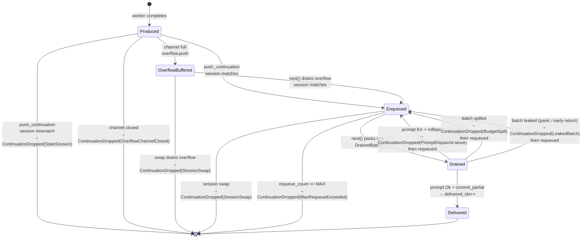

# Brain Continuation — Delivery Guarantees & Handshake Redesign

- **Date:** 2026-04-24
- **Status:** Solution design — draft for review
- **Supersedes / amends:** `docs/superpowers/specs/2026-04-19-brain-async-continuation-design.md` (invariants INV-C1…C7 remain; this spec adds INV-D1…D6 below them and changes the scheduler↔dispatcher handshake)
- **Root-cause reference:** `docs/superpowers/reviews/2026-04-24-brain-continuation-rca.md`
- **Authored from:** 3-POV review (primary + `worker:kimi` + `worker:codex`) + multi-round first-principles analysis

## Executive summary

The brain-continuation delivery path has four independently-confirmed defects at HIGH severity or above. Two are silent data-loss bugs; one is a liveness hole; one is a session-scoping escape. Together they share a single architectural cause: the scheduler commits `delivered_ids` at drain time, before the dispatcher has attempted or succeeded at prompt delivery, and the dispatcher has no API to undo that commitment.

This spec replaces the drain-and-forget handshake with a **two-phase checkout/commit** protocol, tightens session scoping by moving `SessionId` into `BrainContinuation` itself, closes the cancel-grace liveness gap by letting the scheduler announce its own next wakeup deadline, and formalises uniform typed-reason event emission across every loss surface. Secondary content-shape fixes (finding F's `Debug`-stringified enum, finding E's dropped `artifact` field, finding G's unbounded producer output) land alongside as part of the same coordinated change.

---

## Invariants

Existing invariants INV-C1…C7 from the 2026-04-19 spec are preserved. This spec adds:

- **INV-D1 Delivery exactly-once-or-logged.** Every `BrainContinuation` that enters the scheduler's `pending_continuations` eventually either (a) appears in exactly one `session/prompt` call successfully dispatched to the brain session it targets, or (b) is dropped with a `SpurEvent::ContinuationDropped { reason }` event carrying a typed cause.
- **INV-D2 Commit-after-success.** The scheduler marks a continuation as delivered only after `connection.prompt()` has returned `Ok(...)` for the call that contained it. Failure paths must requeue.
- **INV-D3 Session-scoped ingress.** A continuation targeting brain-session S is delivered only while S is the scheduler's `active_session`. Cross-session arrivals are dropped with event reason `StaleSession`.
- **INV-D4 Scheduler-announced liveness.** `ScheduledAction` carries an `IdleUntil(Option<Instant>)` deadline. The orchestrator loop wakes no later than that deadline when set, even in the absence of ingress events.
- **INV-D5 Bounded-per-attempt dedup.** Dedup key is `(delegation_id, attempt)`, not `delegation_id` alone. Retries produce visible continuations.
- **INV-D6 Bounded fan-out.** Producer-side field sizes are clipped; autonomous turns enforce the same byte budget as merged turns; scheduler drains at most `DRAIN_CAP` continuations per turn. Every clip/spill emits an event.

---

## Architecture at a glance

```mermaid
flowchart TB
    subgraph Producer["Producer — spur-mcp"]
        P[report_detached_completion<br/>constructs BrainContinuation with brain_session + attempt]
    end

    subgraph Ingress["Ingress — orchestrator"]
        Ch[[continuation_tx mpsc]]
        OB[(Overflow buf<br/>SessionId, cont]
    end

    subgraph Sched["Scheduler — pure sync"]
        RQ[[Internal requeue_rx]]
        PC[(pending_continuations<br/>VecDeque<BrainContinuation>)]
        DI[(delivered_ids<br/>HashSet<DelegationKey>)]
        N[next now → ScheduledAction]
    end

    subgraph Dispatch["Dispatcher — run_interactive"]
        G[TurnGuard]
        B[DrainedBatch — RAII]
        R[render_merged_turn_with_spill<br/>render_autonomous_turn_with_spill]
        PR[connection.prompt]
    end

    subgraph Events["Event funnel"]
        E[SpurEvent::ContinuationDropped<br/>typed reason]
    end

    P -->|try_send| Ch
    Ch -->|session match<br/>drop+event on mismatch| PC
    OB -->|session match<br/>drop+event on mismatch| PC
    Ch -. Full .-> OB

    N -->|UserPrompt / MergedPrompt / ContinuationPrompt<br/>all carry DrainedBatch| B
    N -->|IdleUntil deadline| Dispatch
    RQ -->|drained at top of next| PC

    B -->|consumed by| R
    R --> PR
    PR -.->|Ok| B
    PR -.->|Err| B
    B -->|commit_partial delivered, requeued| DI
    B -->|rollback| DI
    B -. Drop leaked .-> RQ

    B --> E
    PC --> E
    R --> E
```

---

## Data model changes

### `BrainContinuation` — `crates/spur-acp/src/domain/continuation.rs`

```rust
#[derive(Clone, Debug, serde::Serialize, serde::Deserialize)]
pub struct BrainContinuation {
    pub delegation_id: DelegationId,
    /// Which retry attempt produced this. Attempt 0 is the first run.
    pub attempt: u32,
    /// Brain session this continuation targets. Set by the producer at
    /// construction time. Enforced at scheduler ingress (INV-D3).
    pub brain_session: SessionId,
    pub source: ContinuationSource,
    pub payload: ContinuationPayload,
    /// Wall-clock at producer, for brain-visible recency. Replaces the
    /// prior process-local `Instant` which was never serialised.
    pub created_at: chrono::DateTime<chrono::Utc>,
}

#[derive(Clone, Debug, serde::Serialize, serde::Deserialize)]
#[serde(tag = "kind", rename_all = "snake_case")]
pub enum ContinuationSource {
    AsyncRequested,
    BlockTimeout,
    Cancelled,
    PlanCompleted,       // reserved, not yet wired (post-INV-7)
    PlanReadyToMerge,    // reserved, not yet wired (post-INV-7)
}
```

`ContinuationSource` gains `#[derive(Serialize)]` with explicit tag — fixes finding F's Debug-repr fragility.

`ContinuationPayload`:

```rust
pub struct ContinuationPayload {
    pub status: DelegationStatus,
    pub summary: Option<String>,         // producer-clipped at PRODUCER_MAX_FIELD_BYTES
    pub diff_summary: Option<DiffSummary>,
    pub worker_branch: Option<String>,
    /// If the worker produced a large artifact (patch blob, test log, etc.),
    /// this carries a reference the brain can fetch on demand; the artifact
    /// body is never inlined in the ACP resource block.
    pub artifact_ref: Option<ArtifactRef>,
}

pub struct ArtifactRef {
    pub kind: ArtifactKind,  // Patch, TestOutput, Log, Other(String)
    pub uri: String,          // e.g. spur://artifact/{id} or file:///...
    pub byte_size: u64,
    pub sha256: Option<String>,
}
```

Finding E resolved: the previously-unused `artifact: Option<WorkerArtifact>` field is replaced with `artifact_ref`, which IS serialised into the wire JSON. If a delegation produces no artifact the field is omitted.

### `DelegationKey` — new, scheduler-internal

```rust
#[derive(Clone, Eq, Hash, PartialEq, Debug)]
pub(crate) struct DelegationKey {
    pub delegation_id: DelegationId,
    pub attempt: u32,
}
```

Dedup operates on `DelegationKey`, not raw `DelegationId`. Fixes finding H.

### `DropReason` — new

```rust
#[derive(Clone, Debug, serde::Serialize)]
#[serde(tag = "reason", rename_all = "snake_case")]
pub enum DropReason {
    SessionSwap,               // scheduler.note_session_swap
    StaleSession,              // session mismatch at ingress
    PromptDispatchFailure,     // connection.prompt returned Err
    BudgetSpill { budget_bytes: usize, continuation_bytes: usize },
    OverflowFull,              // ingress channel AND overflow both full
    OverflowChannelClosed,     // TrySendError::Closed (orchestrator shut down)
    RetrySuperseded,           // removed when a later attempt supersedes (reserved)
    MaxRequeueExceeded,        // see attack-2 in design review; requeue loop limit
    FieldTruncated { field: &'static str, original_bytes: usize, kept_bytes: usize },
    LeakedBatch,               // DrainedBatch dropped without explicit terminator
}
```

### `SpurEventBody` addition

```rust
pub enum SpurEventBody {
    // …existing variants…
    ContinuationDropped {
        delegation_id: DelegationId,
        attempt: u32,
        brain_session: SessionId,
        reason: DropReason,
    },
    ContinuationFieldTruncated {
        delegation_id: DelegationId,
        field: &'static str,
        original_bytes: usize,
        kept_bytes: usize,
    },
}
```

### `ScheduledAction` — `crates/spur-core/src/scheduler.rs`

```rust
pub enum ScheduledAction {
    UserPrompt(InteractiveInput),
    MergedPrompt {
        user: InteractiveInput,
        batch: DrainedBatch,
    },
    ContinuationPrompt(DrainedBatch),
    /// No work right now. If `deadline` is `Some`, the orchestrator SHOULD
    /// arrange to call `next()` again no later than that instant (cancel
    /// grace expiry, future debounce timers). If `None`, the orchestrator
    /// blocks on ingress only.
    IdleUntil { deadline: Option<Instant> },
}
```

The `Idle` variant is replaced by `IdleUntil`. Fixes finding C.

---

## Scheduler API

### `BrainScheduler`

```rust
pub struct BrainScheduler {
    pending_continuations: VecDeque<BrainContinuation>,
    delivered_ids: HashSet<DelegationKey>,
    active_session: Option<SessionId>,
    turn_in_flight: bool,
    cancel_grace_until: Option<Instant>,
    cancel_grace_window: Duration,
    pending_user: VecDeque<InteractiveInput>,

    /// Internal requeue channel. Receive end drained at top of `next()`.
    /// Sender is cloned into every `DrainedBatch` so leaked batches return
    /// their items here on Drop.
    requeue_rx: mpsc::UnboundedReceiver<RequeueCommand>,
    requeue_tx: mpsc::UnboundedSender<RequeueCommand>,

    /// Typed event sink for all DropReason emissions.
    event_sink: Arc<dyn ContinuationEventSink>,
}
```

### API surface (new / changed)

```rust
impl BrainScheduler {
    pub fn new(
        active_session: Option<SessionId>,
        event_sink: Arc<dyn ContinuationEventSink>,
    ) -> Self;

    /// Ingress. Enforces INV-D3: drops+emits on session mismatch.
    pub fn push_continuation(&mut self, c: BrainContinuation);

    pub fn push_user(&mut self, input: InteractiveInput);

    pub fn next(&mut self, now: Instant) -> ScheduledAction;

    /// Called on successful prompt dispatch. Moves the keys into delivered_ids.
    /// Any items in the batch not listed in `delivered_keys` are treated as
    /// spilled and requeued via the internal path (bypasses ingress dedup).
    /// Consumes the batch.
    pub fn commit_partial(
        &mut self,
        batch: DrainedBatch,
        delivered_keys: Vec<DelegationKey>,
    );

    /// Shorthand for commit_partial where all items are delivered.
    pub fn commit(&mut self, batch: DrainedBatch);

    /// Called on prompt-dispatch failure. All items in the batch are
    /// requeued (internal path, bypasses ingress dedup). Emits one
    /// PromptDispatchFailure event per item.
    pub fn rollback(&mut self, batch: DrainedBatch);

    /// Called on brain-session retirement. Drains BOTH pending_continuations
    /// AND the overflow-buf handle (new parameter), emits SessionSwap events
    /// for each, and clears delivered_ids (since keys are session-scoped).
    pub fn note_session_swap(
        &mut self,
        new_active: Option<SessionId>,
        overflow: &OverflowBuf,
    );

    pub fn note_cancel_resolved(&mut self, now: Instant);
}
```

`drain_continuations_for_delivery` becomes private and no longer writes `delivered_ids`. The write moves into `commit_partial` / `commit`.

### `DrainedBatch`

```rust
pub struct DrainedBatch {
    items: Vec<BrainContinuation>,
    requeue_tx: mpsc::UnboundedSender<RequeueCommand>,
    consumed: bool,  // set by commit_*/rollback; Drop checks this
}

impl DrainedBatch {
    pub fn items(&self) -> &[BrainContinuation];
    pub(crate) fn take(&mut self) -> Vec<BrainContinuation>;
}

impl Drop for DrainedBatch {
    fn drop(&mut self) {
        if !self.consumed {
            let _ = self.requeue_tx.send(RequeueCommand::Leaked {
                items: std::mem::take(&mut self.items),
            });
        }
    }
}

pub(crate) enum RequeueCommand {
    Spilled { items: Vec<BrainContinuation> },
    Rolled { items: Vec<BrainContinuation> },
    Leaked { items: Vec<BrainContinuation> },
}
```

At the top of `next()`, the scheduler drains `requeue_rx` non-blocking, re-inserts items into `pending_continuations` via the **internal** path that bypasses the ingress dedup check. Emits one event per leaked item (`DropReason::LeakedBatch` → still emits, because `Leaked` is treated as "recovered via requeue; the original dispatch lost track of it" — observability demands knowing this happened).

`RequeueCommand::Rolled` and `Spilled` requeue silently (expected control flow); `Leaked` emits.

A per-continuation `requeue_count` field (scheduler-internal, not wire-serialised) prevents infinite requeue loops per INV-D6 / Attack 2: once `requeue_count >= MAX_REQUEUE_ATTEMPTS` (default 8), the item is dropped with `DropReason::MaxRequeueExceeded`.

---

## Orchestrator loop

The run_interactive `select!` gains an `IdleUntil` arm:

```rust
loop {
    let action = scheduler.next(Instant::now());
    match action {
        ScheduledAction::IdleUntil { deadline } => {
            tokio::select! {
                biased;
                input = continuation_rx.recv() => { scheduler.push_continuation_or_user(input); }
                _ = maybe_sleep_until(deadline) => { /* wake → loop */ }
            }
        }
        ScheduledAction::UserPrompt(user) => { dispatch_user_only(user).await; }
        ScheduledAction::MergedPrompt { user, batch } => { dispatch_merged(user, batch).await; }
        ScheduledAction::ContinuationPrompt(batch) => { dispatch_autonomous(batch).await; }
    }
}
```

Where `maybe_sleep_until(None)` is `future::pending()` and `Some(t)` is `tokio::time::sleep_until(t)`.

### Dispatch flow (merged example)

```rust
async fn dispatch_merged(
    &mut self,
    user: InteractiveInput,
    batch: DrainedBatch,
) {
    let _guard = TurnGuard::arm(&mut self.scheduler);

    let (blocks, delivered_keys, spilled) =
        render_merged_turn_with_spill_v2(&user_blocks(&user), batch.items(), BUDGET);

    // Requeue spilled BEFORE awaiting — never after, in case of cancellation.
    let spilled_keys = keys_of(&spilled);
    if !spilled.is_empty() {
        for k in &spilled_keys {
            self.events.emit(SpurEventBody::ContinuationDropped {
                delegation_id: k.delegation_id.clone(),
                attempt: k.attempt,
                brain_session: self.session_id.clone(),
                reason: DropReason::BudgetSpill { .. },
            });
        }
        self.scheduler.requeue_spilled(spilled);
    }

    match self.connection.prompt(blocks).await {
        Ok(_) => self.scheduler.commit_partial(batch, delivered_keys),
        Err(e) => {
            tracing::error!(?e, "prompt dispatch failed");
            self.scheduler.rollback(batch);
        }
    }
    // TurnGuard drops → turn_in_flight cleared on all exit paths.
}
```

Key invariants enforced here:
- `commit_partial` / `rollback` always called on every non-panicked path.
- On panic, `batch` Drop impl's `Leaked` requeue saves the items; `TurnGuard` Drop clears `turn_in_flight`. System continues.
- `BudgetSpill` event is emitted **before** the prompt call, so the event ordering reflects "spill happened, then prompt was attempted."

### MCP server shutdown on brain retirement

At `orchestrator.rs:159-162` and `1980-1982`, the sequence changes:

```rust
// Before: just abort the server handle.
server_handle.abort();

// After: drain the MCP server's TaskTracker first so no in-flight worker
// collectors can fire continuations into a retired brain. Then abort.
server.shutdown().await;  // awaits TaskTracker::wait()
server_handle.abort();
self.scheduler.note_session_swap(new_active, &self.overflow_buf);
```

Fixes the third leak surface in finding D.

---

## Continuation-bridge changes

### JSON wire body

```jsonc
{
  "schema_version": 2,
  "delegation_id": "...",
  "attempt": 0,
  "brain_session": "...",
  "source": { "kind": "async_requested" },          // was: "AsyncRequested"
  "status": { "kind": "success" },                   // serde_json as before
  "summary": "worker clipped to 8KiB if larger",
  "diff_summary": { "files": 3, "insertions": 42, "deletions": 7 },
  "worker_branch": "spur/worker-codex-...",
  "artifact_ref": {
    "kind": "patch",
    "uri": "spur://artifact/abc",
    "byte_size": 123456,
    "sha256": "..."
  },
  "created_at": "2026-04-24T12:34:56.789Z"
}
```

`schema_version: 2` is added as a forward-compat probe. Any brain prompt that matches on the body should accept version ≥ 2. Version 1 was the pre-spec shape; a one-time cutover is acceptable for this internal subsystem.

### Autonomous-turn budget

```rust
pub fn render_autonomous_continuation_turn_with_spill(
    conts: &[BrainContinuation],
    budget_bytes: usize,
) -> (Vec<ContentBlock>, Vec<BrainContinuation>);
```

Same budget as merged turn (configurable; default `MERGE_BUDGET_DEFAULT_BYTES`). Same oldest-first-with-best-fit policy (see below). Emits `BudgetSpill` per spilled item. Fixes finding G layer 2.

### Best-fit-plus-oldest-first packing

Replace the current "oldest-first strict" rule with a two-phase pack:

1. Iterate in FIFO order; fit items that fit into the remaining budget.
2. Any item that would overflow is moved to the spill list, but *subsequent smaller items are still considered* for the remaining budget.
3. Ordering property: within the delivered subset, items keep FIFO order; within the spilled subset, items keep FIFO order. Relative order across the two subsets is broken by design — spill implies "later turn," which is a fairness concession the 3-POV review accepted as correct.

This improves utilisation from ~25% worst-case (current strict rule) to ~85%+ typical without changing safety (fixes a weaker version of finding #5).

### Producer-side clipping

In `spur-mcp/src/server.rs:1562-1564`, before constructing `BrainContinuation`:

```rust
let (summary, summary_truncated) =
    clip_with_ellipsis(result.summary, PRODUCER_MAX_FIELD_BYTES);
if summary_truncated {
    event_sink.emit(SpurEventBody::ContinuationFieldTruncated {
        delegation_id,
        field: "summary",
        original_bytes: result.summary.map(|s| s.len()).unwrap_or(0),
        kept_bytes: summary.as_ref().map(|s| s.len()).unwrap_or(0),
    });
}
```

Same for `diff_summary` serialisation. `PRODUCER_MAX_FIELD_BYTES = 8192` by default. Fixes finding G layer 1.

### Scheduler drain cap

`drain_continuations_for_delivery` returns at most `DRAIN_CAP` continuations per call (default 32). The rest remain in `pending_continuations` for the next `next()` call. Fixes finding G layer 3.

---

## Continuation lifecycle



Every terminal edge emits an event. Every non-terminal edge preserves INV-D1 by returning to `Enqueued` with bookkeeping intact.

---

## Testing requirements

### Property-based round-trip (required)

```rust
proptest! {
    /// For any sequence of pushes + scheduler ticks + random spill-sized
    /// continuations + random prompt success/failure outcomes:
    ///   every continuation that was pushed is either
    ///     (a) present in exactly one dispatched prompt's block set, OR
    ///     (b) associated with exactly one ContinuationDropped event.
    #[test]
    fn continuation_delivery_is_exactly_once_or_logged(
        arrivals in arb_arrival_sequence(),
        outcomes in arb_outcome_sequence(),
    ) { … }
}
```

### Explicit test cases (one per finding)

- **test_a_merged_turn_spill_requeues_for_next_turn** — push a 5 KB continuation while user is typing; verify it spills, then appears in the next turn.
- **test_b_prompt_dispatch_error_requeues** — simulate `connection.prompt` returning `Err`; verify batch is rolled back and delivered on the next successful turn.
- **test_c_grace_expiry_wakes_loop** — enter grace; push an autonomous continuation; advance mock clock past `cancel_grace_until`; assert `next()` returns `ContinuationPrompt` without any user input arriving.
- **test_d_stale_session_continuation_dropped** — active_session = S1; push continuation with brain_session = S2; assert dropped with `StaleSession` event.
- **test_d_overflow_buf_evicted_on_swap** — fill overflow with session-S1 continuations; call note_session_swap(S2, &overflow); assert overflow is empty and N `SessionSwap` events fired.
- **test_d_mcp_server_shutdown_awaited** — spawn detached worker; retire brain; assert `server.shutdown` future completed before `note_session_swap`.
- **test_e_artifact_ref_serialised** — construct with non-None `artifact_ref`; render; assert JSON body contains `artifact_ref` key.
- **test_f_source_serialised_as_snake_case** — render with `ContinuationSource::BlockTimeout`; assert JSON body contains `"source":{"kind":"block_timeout"}`.
- **test_g_producer_clips_oversized_summary** — worker returns 20 KB summary; construct continuation; assert clipped to `PRODUCER_MAX_FIELD_BYTES` + `FieldTruncated` event fired.
- **test_g_autonomous_turn_spills_above_budget** — enqueue N continuations exceeding autonomous budget; assert only first K delivered; rest requeued.
- **test_h_retry_attempt_not_deduped** — commit continuation with `(id=X, attempt=0)`; push `(id=X, attempt=1)`; assert enqueued, not dropped.
- **test_j_drop_reason_events_fired** — trigger each DropReason variant explicitly; assert corresponding event seen at the funnel.

### Leak-resistance tests

- **test_drained_batch_leaked_requeues_on_drop** — obtain a DrainedBatch; `std::mem::drop(batch)` without commit; call `next()`; assert items re-appear with `LeakedBatch` event.
- **test_turn_guard_cleared_on_panic** — run the dispatch closure inside `catch_unwind`; assert `turn_in_flight == false` afterwards.

---

## Migration strategy

### Sequencing

This is a **single-PR change**. The new handshake is incoherent if only half-landed:

- `DrainedBatch` cannot exist without `commit_partial`/`rollback`/`Drop`.
- `brain_session` field on `BrainContinuation` must be set at all producers or none.
- `schema_version: 2` on the wire requires the brain-prompt update or a cutover window.

PR size is large but the diff is cohesive. Reviewers should expect ~800-1200 LoC changed across scheduler.rs, continuation_bridge.rs, continuation.rs, server.rs, orchestrator.rs.

### Rollback plan

The prior behavior is bug-for-bug the current state. A revert of the PR returns to the known-current semantics. No schema migration on disk; continuations are in-memory only.

### Wire-format transition

`schema_version: 1` (implicit, field-absent) is treated as deprecated. The brain's system/prompt text should learn to accept only `schema_version: 2`. Any queued-during-rollout continuations live in memory and are at most 750 ms old — a clean bounce of the orchestrator flushes them.

---

## Out of scope

- **Finding I (forgeable marker).** Per-session nonce mitigation. Orthogonal to the handshake redesign; requires brain-side prompt engineering and its own security review. Land separately after this PR.
- **INV-7 streaming / multi-continuation delegations.** This spec's dedup key `(delegation_id, attempt)` is forward-compatible. A future INV-7 spec should extend to `(delegation_id, attempt, seq)` and add a "completion" marker continuation for end-of-stream.
- **Artifact content transport.** `artifact_ref` establishes a URI reference; the fetch mechanism for `spur://artifact/*` is a separate spec.
- **Content-type expansion on artifacts.** Today only JSON bodies ship. Future: structured schemas per `ArtifactKind`.

---

## Acceptance checklist

Every finding A–J from the RCA has a specific test it must pass:

- [ ] A — `test_a_merged_turn_spill_requeues_for_next_turn`
- [ ] B — `test_b_prompt_dispatch_error_requeues`
- [ ] C — `test_c_grace_expiry_wakes_loop`
- [ ] D — `test_d_stale_session_continuation_dropped` + `test_d_overflow_buf_evicted_on_swap` + `test_d_mcp_server_shutdown_awaited`
- [ ] E — `test_e_artifact_ref_serialised`
- [ ] F — `test_f_source_serialised_as_snake_case`
- [ ] G — `test_g_producer_clips_oversized_summary` + `test_g_autonomous_turn_spills_above_budget`
- [ ] H — `test_h_retry_attempt_not_deduped`
- [ ] I — *out of scope this PR; tracked separately*
- [ ] J — `test_j_drop_reason_events_fired`

Plus the leak-resistance and property-based round-trip tests pass.

---

## Rationale: why two-phase over the alternatives

Design alternatives considered and rejected (full notes in the RCA review transcript):

- **Typestate lifecycle (`Continuation<Pending>` → `Continuation<Drained>` → `Delivered`).** Ceremony without added safety. Typestate cannot force a consumer to call a specific method; it can only constrain the shape of what's callable. The `DrainedBatch` token pattern achieves the same guarantees with simpler ergonomics.
- **Event-sourced scheduler (pure fold over a log).** Strong auditability and observability, but invasive. Performance degrades with log length unless caching is added (at which point the purity advantage is lost). Out of scope for a bug fix.
- **Collapse scheduler/dispatcher split.** Violates INV-C5 and sacrifices the pure-sync testability of the scheduler. Rejected.
- **Wake-on-timer inside scheduler.** Would leak async into a pure-sync module. `IdleUntil(deadline)` lets the orchestrator own the timer while keeping the scheduler sync.

The two-phase handshake was chosen because it:
- Restores INV-D1 (exactly-once-or-logged) with minimal surface change.
- Preserves the scheduler's pure-sync testability (required by INV-C5).
- Uses Rust RAII (`Drop`) as a safety net for the leak path — no panic-in-Drop, no spin loops.
- Makes every loss observable via one event type with typed reasons.
- Composes cleanly with the session-scoping and drain-cap changes.

The design does not add new concurrency primitives beyond an unbounded mpsc for leaked-batch recovery, and that mpsc is passive (never polled outside `next()`). The scheduler remains single-owner and single-threaded — no new `Arc<Mutex<…>>` on hot paths.
