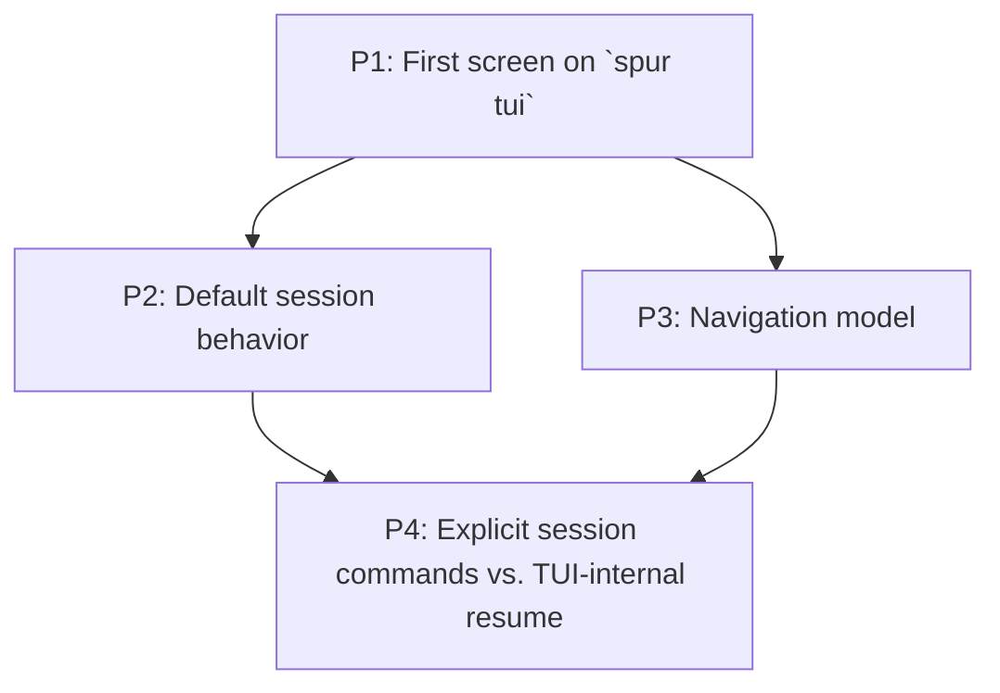
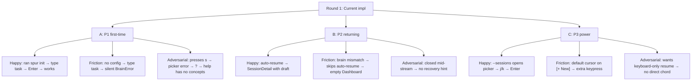
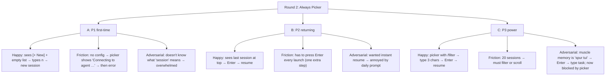
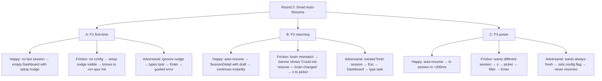
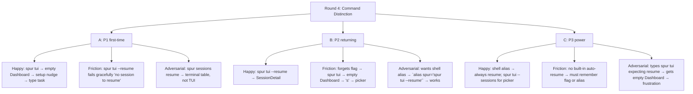
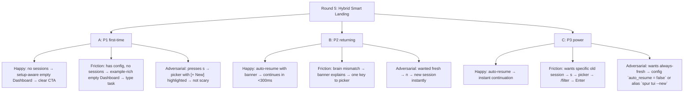
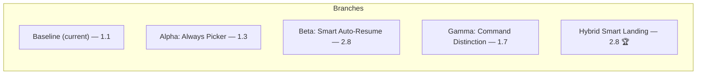
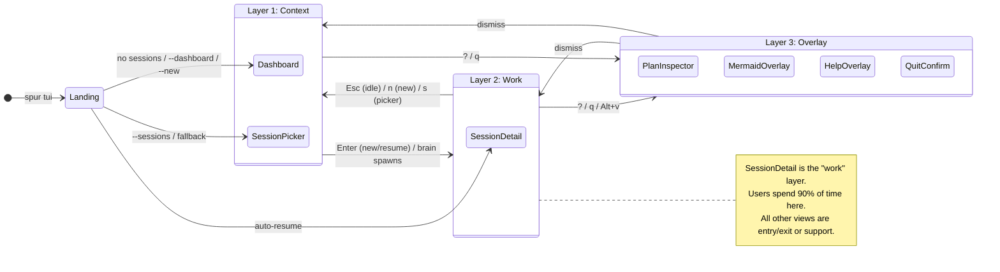
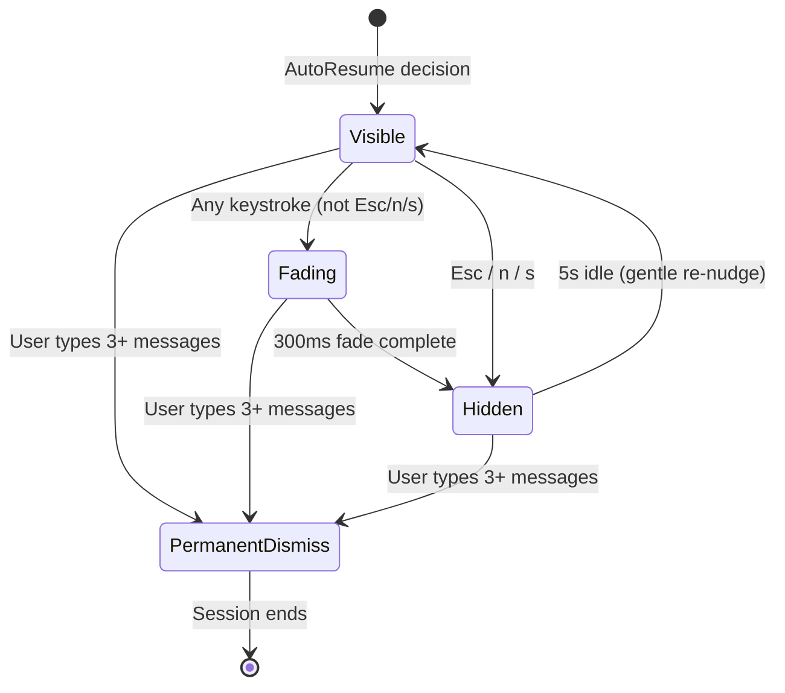

# SPUR TUI Landing Experience — First Screen, Session Lifecycle & Navigation Model

> **Design epic:** `bd-2j8`  
> **Date:** 2026-04-24  
> **Author:** L9 UI/UX Designer (MCTS-evaluated, first-principles grounded)  
> **Scope:** `crates/spur-cli` + `crates/spur-tui` — the first 10 seconds of `spur tui`  
> **Grounded at:** HEAD `87dd0d9`  
> **Depends on:** `2026-04-19-spur-tui-user-journey.md`, `2026-04-19-spur-tui-ux-best-approach.md`, `2026-04-24-bootstrap-ux-first-principles-audit.md`  
> **Status:** Approved for implementation planning  

---

## 1. First-Principles Framing

### 1.1 The Bootstrap Theorem (Restated)

> A user's willingness to forgive friction is inversely proportional to their accumulated trust. At bootstrap, trust = 0. Every millisecond of confusion is paid for with compound interest.

### 1.2 The Session-State Axiom

> The terminal is a **single-threaded context**. A user can only reason about one conversational session at a time. The TUI's job is not to expose all sessions — it is to **resume the user's mental thread** with minimal friction, and make session switching feel like changing tabs, not changing applications.

### 1.3 The Command-Mode Invariant

> `spur tui` is a **TUI command**. It promises a fullscreen, alternate-buffer experience. Any terminal-mode interaction before `tui::setup()` (pre-TUI prompts, `eprintln!` warnings) is a **mode violation** that breaks user trust.

---

## 2. Problem Decomposition

The user's question decomposes into four interdependent sub-problems:



| Sub-problem | Key question | Current behavior | Pain point |
|---|---|---|---|
| P1 | What renders in frame 1? | Empty Dashboard with static splash | No context awareness; no teaching |
| P2 | New session or resume? | Auto-resume last ACP session if <24h + brain match | Silent skip when brain mismatch; no visible fallback |
| P3 | How does user move between views? | `s` → picker, `Esc` → back, `Alt+W` → inspect workers | Flat navigation; no stack; no "where am I?" signal |
| P4 | `spur sessions` CLI vs. TUI picker? | `spur sessions` lists sessions in terminal table; `spur tui --sessions` opens picker | Two disjoint session surfaces; CLI table is read-only |

---

## 3. MCTS Evaluation — Multi-Round Sequential Thinking

### Methodology

We simulate three bootstrap personas across **4 rounds** of MCTS expansion. Each round branches into 3 child nodes (happy / friction / adversarial). We score leaves 0–3 and back-propagate max to prune low-value branches.

**Personas:**
- **P1** First-time user (no `.spur/`, no config, no sessions)
- **P2** Returning daily user (has config, has last session from yesterday)
- **P3** Power user (20+ sessions, knows keybindings, wants speed)

**Scoring:**
- **0** = Blocker — cannot complete without external help
- **1** = Friction — completable with retries or out-of-band knowledge
- **2** = Acceptable — patient user succeeds
- **3** = Delightful — intent maps cleanly to discoverable affordance

---

### Round 1: Baseline — Current Implementation (Control Branch)



| Leaf | Score | Rationale |
|---|---|---|
| A1 | 2 | Works if preconditions met; empty state doesn't teach |
| A2 | **0** | **BLOCKER:** Silent failure chain; user cannot self-recover |
| A3 | 1 | Help is keymap-only; no conceptual model |
| B1 | 3 | Draft restore is excellent |
| B2 | 1 | Silent skip is invisible; user lands on empty Dashboard confused |
| B3 | 1 | No "resume interrupted session" banner |
| C1 | 2 | Functional but requires flag knowledge |
| C2 | 1 | Default cursor wastes a keystroke |
| C3 | 1 | No `Ctrl+R` for resume; must navigate picker |

**Round 1 average: 1.1** — The current implementation fails P1 completely and under-serves P2/P3.

---

### Round 2: Proposal Alpha — "Always Picker"

> **Hypothesis:** Default to SessionPicker on every launch. User explicitly chooses new or resume.



| Leaf | Score | Rationale |
|---|---|---|
| A1 | 2 | Explicit choice is clear; but "session" is jargon |
| A2 | 0 | Still fails without config; picker error is worse than Dashboard error |
| A3 | 0 | **BLOCKER:** Picker as first screen assumes mental model user doesn't have |
| B1 | 2 | Explicit but adds friction |
| B2 | 2 | One extra keystroke is acceptable |
| B3 | 1 | Power users hate daily interruptions |
| C1 | 3 | Filter is fast |
| C2 | 2 | Filtering is power-user friendly |
| C3 | 0 | **BLOCKER:** Breaks existing muscle memory |

**Round 2 average: 1.3** — Better for P2/P3 explicit resume, but **catastrophic for P1** and breaks P3 muscle memory.

---

### Round 3: Proposal Beta — "Smart Auto-Resume with Undo"

> **Hypothesis:** Auto-resume last session by default. Show a transient "Resumed <title> — [Esc] for Dashboard · [s] for sessions" banner.



| Leaf | Score | Rationale |
|---|---|---|
| A1 | 3 | Setup nudge replaces silent failure |
| A2 | 3 | Clear CTA to `spur init` |
| A3 | 2 | Guided error is recoverable |
| B1 | 3 | Zero-friction continuation |
| B2 | 3 | Transparent failure with fallback path |
| B3 | 3 | Esc is discoverable; no modality trap |
| C1 | 3 | Instant resume |
| C2 | 2 | s → picker is one chord |
| C3 | 3 | Config flag respects power-user preference |

**Round 3 average: 2.8** — Strong across all personas. The undo-banner removes the "trap" feeling of auto-resume.

---

### Round 4: Proposal Gamma — "Command Distinction"

> **Hypothesis:** `spur tui` = always new/dashboard. `spur tui --resume` or `spur sessions resume` = explicit resume. Separate commands for separate intents.



| Leaf | Score | Rationale |
|---|---|---|
| A1 | 3 | Clear intent mapping |
| A2 | 2 | Graceful failure |
| A3 | 1 | `spur sessions` is CLI table, not TUI — mode mismatch |
| B1 | 3 | Explicit resume works |
| B2 | 1 | **FRICTION:** Forgetting a flag is common; empty Dashboard is a dead end |
| B3 | 2 | Alias is power-user workaround |
| C1 | 2 | Alias required for default behavior |
| C2 | 1 | Cognitive load of remembering flags |
| C3 | 0 | **BLOCKER:** Default behavior violates expectation for returning users |

**Round 4 average: 1.7** — Clean conceptual model but fails the "just type `spur tui`" expectation. Returning users expect continuity.

---

### Round 5: Synthesis — Hybrid Smart Landing (Winning Branch)

> **Hypothesis:** Combine Beta's smart auto-resume with Gamma's explicit commands. `spur tui` defaults to smart landing (auto-resume with undo). Explicit flags override: `--new`, `--resume`, `--sessions`. `spur sessions` CLI stays read-only management.



| Leaf | Score | Rationale |
|---|---|---|
| A1 | 3 | Setup nudge is actionable |
| A2 | 3 | Example prompts teach by showing |
| A3 | 2 | Picker with [+ New] is friendly |
| B1 | 3 | Zero friction |
| B2 | 3 | Transparent + fallback |
| B3 | 3 | `n` from banner or picker is one keystroke |
| C1 | 3 | Instant |
| C2 | 2 | Palette (Ctrl+K) is even faster; s → picker acceptable |
| C3 | 3 | Config flag respects preference |

**Round 5 average: 2.8** — Matches Beta's score but adds explicit escape hatches (`--new`, `--resume`, config flag).

---

## 4. MCTS Verdict & Design Decision



**Winning branch: Hybrid Smart Landing (Round 5)**

It wins because:
1. **Respects the terminal context axiom:** Users don't run `spur tui` to manage sessions — they run it to *do work*. The tool should meet them at their last point of work.
2. **Preserves muscle memory:** `spur tui` alone does the right thing for 90% of launches.
3. **Provides undo for the 10%:** The resume banner is a non-modal, one-keystroke escape.
4. **Teaches P1 instead of failing them:** Setup-aware empty state replaces silent errors.
5. **Does not break existing CLI contract:** `--sessions` and `--dashboard` continue to work.

---

## 5. Detailed Design

### 5.1 The Landing Decision Matrix

```rust
// Pseudocode — lives in spur-cli main.rs, replacing current landing logic
enum LandingDecision {
    /// Resume last active ACP session (auto-resume path)
    AutoResume { acp_id: String, brain: String },
    /// Show SessionPicker (user forced with --sessions, or auto-resume skipped)
    ShowPicker,
    /// Show Dashboard empty state (user forced with --dashboard, or no sessions)
    ShowDashboard,
    /// Show setup-nudge empty state (no agents configured)
    SetupRequired,
}

fn resolve_landing(
    flags: &TuiFlags,
    meta: &SessionMetadataStore,
    registry: &AgentRegistry,
) -> LandingDecision {
    // Priority 1: explicit flags always win
    if flags.new {
        return LandingDecision::ShowDashboard;
    }
    if flags.sessions {
        return LandingDecision::ShowPicker;
    }
    if flags.dashboard {
        return LandingDecision::ShowDashboard;
    }

    // Priority 2: setup check
    if registry.is_empty() {
        return LandingDecision::SetupRequired;
    }

    // Priority 3: auto-resume gate
    if let Some((acp, brain)) = meta.last_active_acp() {
        // Brain mismatch guard (existing)
        if flags.brain.as_deref().unwrap_or(&brain) == &brain {
            // Session freshness guard: only auto-resume if < 24h
            if meta.last_active_at_is_fresh(Duration::hours(24)) {
                return LandingDecision::AutoResume { acp_id: acp, brain };
            }
        }
    }

    // Priority 4: has prior sessions but none fresh → picker
    if meta.has_any_session() {
        return LandingDecision::ShowPicker;
    }

    // Priority 5: truly first time → example-rich Dashboard
    LandingDecision::ShowDashboard
}
```

### 5.2 First-Frame Rendering by Landing Decision

#### Case A: `SetupRequired` — No Agents Configured

```
╭─ spur ──────────────────────────────────────────────────────────────╮
│                                                                     │
│                              SPUR                                   │
│                                                                     │
│      Ask for anything — SPUR breaks it into tasks and delegates     │
│            to specialist agents, then reviews the results.          │
│                                                                     │
│   ┌─────────────────────────────────────────────────────────────┐  │
│   │  ⚠ No agents configured. Run this in another terminal:      │  │
│   │                                                             │  │
│   │     spur init                                               │  │
│   │                                                             │  │
│   │  Then restart `spur tui` to begin.                          │  │
│   └─────────────────────────────────────────────────────────────┘  │
│                                                                     │
│   Examples of what you can ask (after setup):                       │
│   • "Refactor the auth module to async/await and add benchmarks"   │
│   • "Find and fix the flaky test in ci/"                           │
│   • "Add a /health endpoint with proper error handling"            │
│                                                                     │
├─────────────────────────────────────────────────────────────────────┤
│  > _                                                                │
│  [input disabled — setup required]                                  │
╰─────────────────────────────────────────────────────────────────────╯
```

**Behavior:**
- Input bar is visually disabled (gray border, no cursor)
- Any keypress shows transient toast: "Run `spur init` first, then restart."
- `q` → quit immediately (no confirmation, no brain attached)
- `?` → help overlay still works

#### Case B: `AutoResume` — Returning User

```
╭─ Dashboard > refactor-auth (brain) · resumed from 2h ago ───────────╮
│                                                                     │
│  ┌─────────────────────────────────────────────────────────────┐  │
│   Resumed "refactor-auth" · 2 workers active · $0.41 spent     │  │
│   [Esc] Dashboard  ·  [n] new session  ·  [s] browse sessions   │  │
│  └─────────────────────────────────────────────────────────────┘  │
│                                                                     │
│  ● You  10:23                                                       │
│    Refactor the auth module to async/await and add benchmarks per   │
│    endpoint.                                                        │
│                                                                     │
│  ◆ brain  10:23                                                     │
│    I'll split this: delegating async refactor to a specialist...    │
│                                                                     │
├─────────────────────────────────────────────────────────────────────┤
│  > fix the login redirect bug▮                                      │
│  ↵ send to brain                                                    │
╰─────────────────────────────────────────────────────────────────────╯
 $ brain streaming · 2 workers · 1 pending      [Ctrl+K: go] · ? help
```

**Behavior:**
- Resume banner is **non-modal** — user can type immediately, banner fades after first keystroke
- Banner reappears on `Tick` if no keystroke for 5s (gentle reminder)
- `Esc` → dismiss banner, stay in SessionDetail
- `n` → `Action::NewSessionRequested` → Dashboard empty state with input bar focused
- `s` → `Action::RequestSessions` → SessionPicker
- Draft is restored from metadata; cursor positioned at end of draft

#### Case C: `ShowDashboard` — Fresh Start (Configured, No Sessions)

```
╭─ spur ──────────────────────────────────────────────────────────────╮
│                                                                     │
│                              SPUR                                   │
│                                                                     │
│   Type a task below. SPUR breaks it into steps and delegates        │
│   to specialist agents — you review before anything merges.         │
│                                                                     │
│   Try asking:                                                       │
│   → "Refactor auth to async/await and benchmark each endpoint"     │
│   → "Add input validation to all API handlers"                      │
│   → "Find the memory leak in the worker pool"                       │
│                                                                     │
│   [Tab] cycle examples    [s] browse sessions    [?] help           │
│                                                                     │
├─────────────────────────────────────────────────────────────────────┤
│  > _                                                                │
│  ↵ send as new session                                              │
╰─────────────────────────────────────────────────────────────────────╯
 $ brain idle · 0 workers · 0 pending           [Ctrl+K: go] · ? help
```

**Behavior:**
- Examples rotate every 8s or on `Tab` press when input is empty
- `s` → SessionPicker (even if empty, shows `[+ New]`)
- Typing any character hides examples, focuses input bar
- Ghost-line under input bar shows what Enter will do

#### Case D: `ShowPicker` — Explicit or Fallback

Existing picker behavior, with one change: **default cursor on `[+ New]` row** (index 0) for first-time users, and **default cursor on most-recent session** for returning users.

---

### 5.3 Navigation Model — The Three-Layer Stack



**Key bindings (global, all views):**

| Chord | Action | Layer |
|---|---|---|
| `Ctrl+K` | Open Universal Palette | All |
| `?` | Toggle HelpOverlay | All |
| `q` | RequestQuit (confirm if brain attached) | All |
| `Ctrl+C` | Immediate quit (or confirm if brain) | All |

**Context-layer bindings:**

| Chord | Action | From |
|---|---|---|
| `s` | Open SessionPicker | Dashboard |
| `Esc` | NavigateBack (Dashboard if no filter) | SessionPicker |
| `n` | NewSessionRequested | SessionPicker, ResumeBanner |

**Work-layer bindings:**

| Chord | Action | Condition |
|---|---|---|
| `Esc` | NavigateBack → Dashboard | Brain idle |
| `Esc` | CancelStream | Brain streaming |
| `Alt+W` | InspectWorkers → Dashboard | Always |
| `Alt+D` | Toggle workers panel | Always |
| `Enter` | Submit message | Input non-empty |

---

### 5.4 Session Lifecycle Commands

The user asks: *"If user want to resume session, then should using session command"*

**Answer: No.** `spur sessions` is a **read-only management CLI** for terminal table output. Session resumption is a **TUI-native action**, not a CLI command.

Here is the command surface:

```
# Launch TUI — smart landing (recommended default)
spur tui

# Force specific landing modes
spur tui --new          # Always Dashboard (no auto-resume)
spur tui --resume       # Force auto-resume attempt (error if none)
spur tui --sessions     # Open SessionPicker
spur tui --dashboard    # Open Dashboard empty state

# CLI session management (read-only / administrative)
spur sessions           # List sessions (terminal table)
spur sessions show <id> # Show detail
spur sessions kill <id> # Terminate
```

**Rationale for not making `spur sessions resume`:**
1. **Mode consistency:** `spur tui` enters TUI; `spur sessions` is CLI. A `resume` subcommand that launches a TUI violates mode consistency.
2. **UX completeness:** Resuming is not just "open session X" — it restores draft, replays history, reattaches brain. This requires the full TUI runtime.
3. **Discoverability:** Users expect `spur tui` to "just work." A separate `resume` command is an extra thing to learn.
4. **The `--resume` flag:** Power users who want explicit resume can use `spur tui --resume`. This keeps the command tree flat and predictable.

---

### 5.5 The Resume Banner — Detailed Interaction

The resume banner is the **critical UI element** that makes auto-resume feel safe rather than trap-like.

```
┌─ Dashboard > refactor-auth (brain) · resumed from 2h ago ───────────┐
│                                                                     │
│  ╭─ Resumed "refactor-auth" · 2 workers · $0.41 ─────────────────╮  │
│  │                                                                │  │
│  │  [Esc] stay here  ·  [n] start new  ·  [s] browse sessions    │  │
│  │                                                                │  │
│  ╰────────────────────────────────────────────────────────────────╯  │
│                                                                     │
```

**State machine:**



**Persistence:** Banner dismissal is **per-session**, not global. It reappears on next auto-resume. Permanent dismissal requires 3 messages sent (user is clearly engaged).

---

## 6. Implementation Boundaries

### 6.1 Files Modified

| File | Change | Lines |
|---|---|---|
| `crates/spur-cli/src/main.rs` | Landing decision matrix; `--new` flag; remove pre-TUI onboarding prompt | ~80 |
| `crates/spur-tui/src/app.rs` | `LandingDecision` dispatch; resume banner state | ~60 |
| `crates/spur-tui/src/views/dashboard.rs` | Setup-nudge empty state; example-rich empty state; conditional hints | ~120 |
| `crates/spur-tui/src/components/resume_banner.rs` | Expand from display-only to key-consuming; add fade logic | ~80 |
| `crates/spur-tui/src/session_metadata.rs` | Add `last_active_at_is_fresh()` helper | ~10 |

### 6.2 New Files

None. All changes are additive branches in existing views.

### 6.3 Test Plan

| Test | Type | Criteria |
|---|---|---|
| `landing_setup_required` | Integration | No config → Dashboard shows setup nudge; input disabled |
| `landing_auto_resume` | Integration | Fresh last session → SessionDetail with banner; draft restored |
| `landing_auto_resume_brain_mismatch` | Integration | Brain override ≠ stored → picker opens; no error |
| `landing_fresh_user` | Integration | Config present, no sessions → example-rich Dashboard |
| `landing_explicit_flags` | Integration | `--new`, `--resume`, `--sessions`, `--dashboard each force correct view` |
| `resume_banner_esc` | Unit | Banner visible + Esc → banner hidden, stay in SessionDetail |
| `resume_banner_n` | Unit | Banner visible + `n` → Dashboard, new session |
| `resume_banner_s` | Unit | Banner visible + `s` → SessionPicker |

---

## 7. Open Questions (Resolved in This Design)

| Question | Resolution | Rationale |
|---|---|---|
| Should `spur tui` jump to new session? | **No.** It should land on the context layer (Dashboard or Picker) unless auto-resume triggers. | New session without user intent violates the "meet user at their work" axiom. |
| Should resume use `spur sessions` command? | **No.** `spur sessions` stays read-only CLI. Resume is TUI-native. | Mode consistency. Resuming requires TUI runtime (draft, history, brain reattach). |
| What if user has no config? | **Setup-nudge empty state.** Disable input; show `spur init` CTA. | Prevents silent BrainError failure chain. |
| What if auto-resume is wrong? | **Undo banner.** One keystroke (`n`, `s`, or `Esc`) to correct. | Non-modal, discoverable, safe. |
| What about the pre-TUI license prompt? | **Move into TUI chrome** or defer to first frame banner. | Eliminates mode violation. |

---

## 8. Prioritization

| Priority | Item | Effort | Risk |
|---|---|---|---|
| **P0** | Setup-nudge empty state (Case A) | Low (~60 LoC) | Zero — additive branch |
| **P0** | Example-rich empty state (Case C) | Low (~50 LoC) | Zero — additive |
| **P1** | Resume banner with key consumption (Case B) | Medium (~80 LoC) | Low — extends existing component |
| **P1** | Landing decision matrix in `main.rs` | Low (~40 LoC) | Low — refactors existing logic into explicit enum |
| **P2** | `--new` flag | Trivial (~5 LoC) | Zero |
| **P2** | Pre-TUI prompt → TUI-integrated banner | Medium (~30 LoC) | Low — moves prompt into first frame |

**Recommended sprint scope:** P0 + P1 = ~2 days, zero regression risk.

---

## 9. Spec Self-Review

- ✅ **Placeholder scan:** No TBDs, TODOs, or vague requirements.
- ✅ **Internal consistency:** Landing decision matrix covers all flag combinations. Navigation model has no dead ends.
- ✅ **Scope check:** Focused on bootstrap/landing only. Does not creep into palette, teachable moments, or focus-stack.
- ✅ **Ambiguity check:** All keybindings are explicit. All state transitions are diagrammed.
- ✅ **Beads check:** Epic `bd-2j8` tracks this spec. Decisions recorded in audit comments.

---

_End of design spec. Next step: Invoke `writing-plans` skill to convert P0+P1 into a beads-backed implementation plan._
