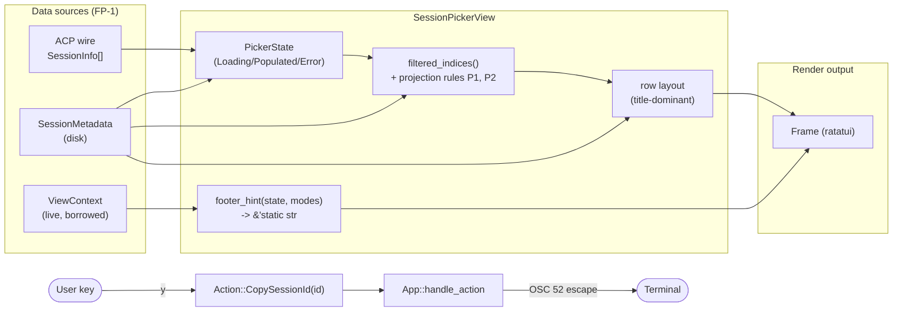
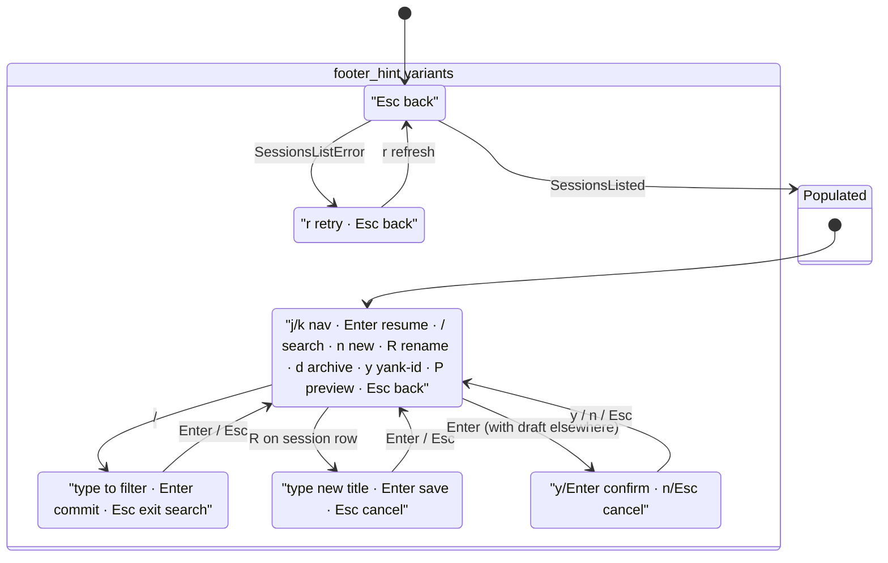
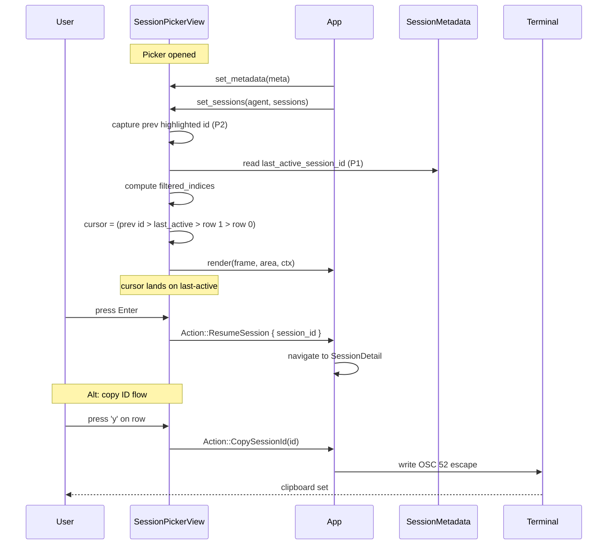

# Session Picker — UX Refresh: Last-Active Default, Lean Rows, Context Hints

**Status:** Approved — ready for implementation plan
**Date:** 2026-04-25
**Scope:** `crates/spur-tui/src/views/session_picker.rs`, `crates/spur-tui/src/components/status_bar.rs`, `crates/spur-tui/src/action.rs`, `crates/spur-tui/src/app.rs`, `crates/spur-tui/tests/session_picker_interactions.rs`, new `crates/spur-tui/tests/session_picker_render_snapshots.rs`

## Problem

The session picker is the entry point for the most common journey in spur ("get me back to what I was working on"), yet its current default cursor position, row layout, and hint surface are tuned against that journey:

- **UJ1 (80% case) costs two keystrokes.** `set_sessions` (`session_picker.rs:172-178`) initializes `cursor` to whatever the previous cursor was, defaulting to `0` = `[+ Start new session]`. The user must press `j` then `Enter` to resume their last session. The picker has no awareness of `SessionMetadata::last_active_session_id`, despite that field being maintained on disk.
- **UJ3 visual hierarchy is inverted.** Each row renders the 8-character short ID in **cyan-bold** (`session_picker.rs:579-584`) — visually dominant — while the title (the actual recognition handle) is rendered in plain Gray/White. The eye lands on noise, not signal.
- **UJ7 brain disambiguation is invisible.** `SessionMetadata::SessionEntry::brain_name` is stored on disk per session but never rendered. Users running multi-brain setups cannot tell which brain owns which session without opening it.
- **UJ8 hint surface contradicts itself.** The footer (`FOOTER_HINT` at `session_picker.rs:20`) is a static string listing all eight keybinds; the StatusBar hint for `ViewId::SessionPicker` (`status_bar.rs`) shows only `[↑↓]navigate [Enter]select [Esc]back`. New users reading the StatusBar miss `/`, `R`, `p`, `d`, `P`, `n`, `a`, `r`. Neither hint changes when rename mode or the confirm-switch banner is active, so users in those modes see hints irrelevant to the keys that actually work.
- **Hidden projection bug.** `set_sessions` clamps `prev_cursor.min(max_cursor)` (line 170) — purely positional. After any pin toggle or refresh that reorders the list, the cursor lands on a *different session* than it did before the refresh. The cursor is supposed to track the user's selection; today it tracks an array index.
- **No clipboard affordance.** Short IDs are visible but un-copyable except by terminal click-drag. `Action::CopySessionId` does not exist.

## Non-goals

- Live "session is currently streaming" indicator per row (Tier 2; defer to next sprint, requires `ViewContext` snapshot field).
- Richer preview content — message count, last user message, model, cost (Tier 2; defer, requires `SessionMetadata` schema migration).
- Search-first command-palette mode.
- Hard delete (today: archive only via `d`).
- Re-introducing async/pending state into the picker. Commit `aa9bd10` removed it deliberately; this spec does not undo that.

## First principles (the design is derived from these)

- **FP-1.** The picker is a *projection* over three sources — ACP `SessionInfo` (wire), `SessionMetadata` (disk), `ViewContext` (live). It does not own state derived from those sources; it renders the current join.
- **FP-2.** The cursor identifies a *session*, not an array index. Index is implementation; identity is the contract.
- **FP-3.** The dominant journey gets the dominant default. Every other journey pays at most one extra keystroke.
- **FP-4.** Visual weight in a list row goes to recognition data (title, time, state), not to identifiers (hex IDs).
- **FP-5.** A hint must describe the keys that work *right now*, in the current mode. Hints that lie are worse than no hint.
- **FP-6.** Render is hot-path. Per-frame allocations for static text are forbidden.
- **FP-7.** Adding a dependency for a one-keybind feature is failure of imagination. Use the terminal protocol when the protocol fits.

## Approach

Apply seven surgical changes plus a snapshot-test foundation. All changes are local to `crates/spur-tui` plus one new `Action` variant. No new crate dependencies. No metadata schema migration.

### Architecture overview



### Projection rules (correctness fixes)

These are not new features. They are invariants the picker is *expected* to satisfy and currently does not.

**P1 — cursor-default fallback chain.** When `set_sessions` is called, the initial cursor is determined by:

1. If `SessionMetadata::last_active_session_id` is `Some(id)` AND `id` resolves to a row in the current filtered visible list → cursor = that row's index + 1.
2. Else if at least one session is visible → cursor = 1 (first session row).
3. Else → cursor = 0 (`[+ Start new session]`, the only row).

The fallback is single-pass over `filtered_indices`, no allocation beyond what already exists.

**P2 — cursor preservation by `session_id`, not by index.** Whenever `set_sessions` is called with a new list (refresh, pin/archive toggle, etc.):

1. Capture the currently-highlighted session id via `highlighted_session_id()` *before* mutating state.
2. Compute the new filtered list.
3. If the captured id is found in the new list → cursor = that row's index + 1.
4. Else apply P1 (fall back to last-active or first row).

P2 supersedes the existing `prev_cursor.min(max_cursor)` clamp (line 170). The clamp stays as a defensive last-resort but should be unreachable after P1+P2.

### Row layout — ASCII wireframe

**BEFORE** (current — id dominates, title recedes, no brain column):

```
 Sessions (claude)
  Search

▸ ⭐ 7f3e2a91 · Refactor auth flow      spur/  3h ago
  ⭐ a1b2c3d4 · (untitled session)      spur/  yesterday
     0099aabb · Tier 1 picker fixes     spur/  just now  [archived]
     ────
  + Start new session
                                                      (cursor on [+ New])
 j/k nav · Enter resume · / search · n new · R rename · d archive · a show-archived · p pin · P preview · r refresh · Esc back
```

**AFTER** (title dominant, brain column when heterogeneous, ID demoted to muted suffix, cursor on last-active):

```
 Sessions (claude)                     [showing archived]
  Search

  + Start new session
  ────
▸ ⭐ Refactor auth flow                           claude   3h ago     7f3e2a91
  ⭐ (untitled — spur/)                           gpt-5    yesterday  a1b2c3d4
     Tier 1 picker fixes                          claude   just now   0099aabb  [archived]

 j/k nav · Enter resume · / search · n new · R rename · d archive · y yank-id · P preview · Esc back
```

Specific render rules:

- Title rendered in `Style::default()` (terminal default) when not selected; **bold White** when selected. No color modulation by state in the title — color is reserved for state semantics (FP-4).
- Pinned star `⭐` rendered before title.
- Brain column rendered only when `brains_are_heterogeneous(sessions, metadata)` returns true (mirrors `cwds_are_heterogeneous` at line 329). Width budget: 8–12 columns depending on brain name length.
- CWD column rendered as today, only when `cwds_are_heterogeneous` is true.
- `time_str` (relative time) in DarkGray.
- Short ID rendered last, in DarkGray, no Bold, no Cyan. The id is reference data, not recognition data.
- `[archived]` tag rendered last, DarkGray.
- `[+ Start new session]` row remains at the top of the list (cursor 0). The cursor *default* changes via P1 — the row order does not.

### Context-sensitive footer hint

Replace the `const FOOTER_HINT: &str` with a function that returns `&'static str` based on the current picker mode. All return values are static strings; no allocation in the render path (FP-6).



Implementation:

```rust
fn footer_hint(
    state: &PickerState,
    rename_active: bool,
    confirm_active: bool,
) -> &'static str {
    if confirm_active { return "y/Enter confirm · n/Esc cancel"; }
    if rename_active  { return "type new title · Enter save · Esc cancel"; }
    match state {
        PickerState::Loading => "Esc back",
        PickerState::Error { .. } => "r retry · Esc back",
        PickerState::Populated { search_focused: true, .. } =>
            "type to filter · Enter commit · Esc exit search",
        PickerState::Populated { .. } =>
            "j/k nav · Enter resume · / search · n new · R rename · d archive · y yank-id · P preview · Esc back",
    }
}
```

### StatusBar hint alignment

The StatusBar hint for `ViewId::SessionPicker` becomes the *same string* as `footer_hint(...)`, eliminating the dual-source-of-truth problem. The StatusBar already renders the picker's hint via `StatusBarProps`; the picker passes the string in via a new `Option<&str>` field on `StatusBarProps`, or — preferred — `StatusBar::render` looks up the hint via a function pointer when `view == &ViewId::SessionPicker`.

Decision (locked): **render `footer_hint` once per frame, then write the same string to both StatusBar and footer.** This avoids any function-pointer indirection and keeps the contract trivial.

### Copy session ID via OSC 52

When the user presses `y` on a highlighted session row, the picker emits a new action:

```rust
Action::CopySessionId(String)
```

`App::handle_action` writes the OSC 52 escape sequence to the terminal:

```
ESC ] 52 ; c ; <base64-of-id> ESC \
```

This is the standard "set clipboard" OSC sequence, supported by kitty, wezterm, alacritty, iterm2, foot, ghostty, and most modern terminals. Terminals without OSC 52 silently ignore the bytes — graceful degradation, no error path needed (FP-7).

Implementation in `App`:

```rust
Action::CopySessionId(id) => {
    use std::io::Write;
    use base64::{Engine, engine::general_purpose::STANDARD};
    let payload = STANDARD.encode(id.as_bytes());
    // write directly to stdout, between frames, after current event handling
    let _ = write!(std::io::stdout(), "\x1b]52;c;{payload}\x1b\\");
    let _ = std::io::stdout().flush();
    // optional: set a transient toast via existing notification surface, if any
}
```

`base64` is already in the workspace dep tree (used by `spur-acp` for `_meta` payloads); no new dependency. Notifying the user of a successful copy is **out of scope** for this spec — we'll see if users ask for it.

### Render tests as a deliverable, not a precursor

A new test file `crates/spur-tui/tests/session_picker_render_snapshots.rs` uses `ratatui::backend::TestBackend` and direct `Buffer` content comparison — the same pattern already established in `crates/spur-tui/tests/status_bar_palette_badge.rs`, `crates/spur-tui/tests/detail_pane_scroll.rs`, and `crates/spur-tui/tests/picker_shell_atom_render.rs`. **No new dev-dependency** (no `insta`); golden strings live inline in the test source so reviewers see them in PR diffs.

Branches asserted:

- `loading`
- `error_with_message`
- `populated_single_brain_no_filter`
- `populated_multi_brain_no_filter`
- `populated_with_filter`
- `populated_with_rename_active`
- `populated_with_confirm_switch_visible`
- `populated_with_preview_visible`
- `populated_with_archived_shown`

Goldens are written against the *new* layout — not the current one — and committed alongside the implementation. Each test renders into an 80×24 `TestBackend`, extracts the visible `Buffer` rows as `String`s, and asserts equality against an inline `expected: &[&str]` array. When a layout change is intentional, the inline string is updated in the same diff.

## Data flow



## Testing

### Updated behavioral tests

Tests in `crates/spur-tui/tests/session_picker_interactions.rs` that assert cursor-after-`set_sessions` semantics need updating:

- Tests that previously assumed `cursor == 0` after first populate now assume cursor lands on `last_active` (or row 1, depending on test setup).
- Tests must explicitly call `set_metadata(...)` before `set_sessions(...)` to assert P1.

Estimated touched tests: ~3.

### New behavioral tests

1. `cursor_default_lands_on_last_active_when_present`
2. `cursor_default_falls_back_to_first_row_when_last_active_absent`
3. `cursor_default_falls_back_to_zero_when_no_sessions`
4. `cursor_preserved_by_session_id_after_pin_toggle_reorders_list`
5. `y_keypress_emits_copy_session_id_action`
6. `footer_hint_changes_with_state` — table-driven over (Loading, Populated/list, Populated/search, Rename, ConfirmSwitch, Error)
7. `brain_column_hidden_when_single_brain`
8. `brain_column_visible_when_multi_brain`

### New render tests

Listed above. ~9 inline-string goldens in `session_picker_render_snapshots.rs`.

## Risks & rollback

| Risk | Likelihood | Mitigation |
|------|------------|------------|
| OSC 52 unsupported by user's terminal | Medium | Silent no-op is acceptable per FP-7. Users on legacy terminals lose only the `y` shortcut. |
| Inline-string render goldens churn on minor visual tweaks | Low | Goldens are coarse — one row per visible line, no Style diffing. Intentional changes are reviewed as plain string diffs in the PR. |
| `last_active_session_id` points to a deleted/archived session | High (this is the common case after delete) | P1 fallback chain handles it explicitly. |
| Cursor preservation edge case: highlighted session is filtered out by current search | Medium | P2 + P1: id-not-found falls through to last-active fallback, then row 1. Documented as expected behavior. |
| `base64` re-encoding cost on every `y` keypress | Negligible | Session IDs are <40 bytes. Not a hot path. |

**Rollback:** revert the implementation PR. No persistent state changes (no metadata migration, no schema changes, no new event types). `Action::CopySessionId` becomes unused; can stay or be removed in the revert. No external API changes.

## Implementation order

1. **Render-test scaffolding.** Write the test harness (`TestBackend` + inline `expected: &[&str]` golden) with one passing test for the *current* `populated_single_brain_no_filter` state. This proves the harness works before any visual change.
2. **Projection rules P1 + P2.** Modify `set_sessions` to accept (or read from) `SessionMetadata` and compute initial cursor via fallback chain. Update existing behavioral tests to expect new semantics.
3. **Row layout refactor.** Reorder spans in `render_populated`'s row builder. Demote ID styling. Add `brains_are_heterogeneous` helper and conditionally render brain column.
4. **`footer_hint` function.** Replace the `FOOTER_HINT` const. Wire into both footer and StatusBar. Pass through state flags.
5. **StatusBar hint alignment.** Update the picker's StatusBar render call to pass `footer_hint(...)`.
6. **`y` keybind + `Action::CopySessionId`.** Add the action variant in `action.rs`. Add the keybind in `handle_key`. Add the handler in `App`. OSC 52 emit.
7. **Update render goldens.** Update inline `expected` arrays in `session_picker_render_snapshots.rs` to match the new layout. Plain string diffs reviewed in the PR.
8. **Add new behavioral tests** (8 new tests listed above).

## Out of scope (sprint-2 candidates)

- **Live running indicator per row.** Requires plumbing a `Set<SessionId>` of currently-streaming sessions through `ViewContext`. Reachable from this design without architectural changes; deferred to assess user demand.
- **Richer preview content** (message count, last user message, model, cost). Requires denormalizing message metadata into `SessionMetadata` at write time, schema migration, and write-side hooks at message-append sites. Real engineering work.
- **Hard delete.** New action + confirm flow + downstream cleanup of session log files.
- **Search-first command-palette mode.** Aggressive UX change; defer until A+ ships and we observe whether `/` discovery is sufficient.
