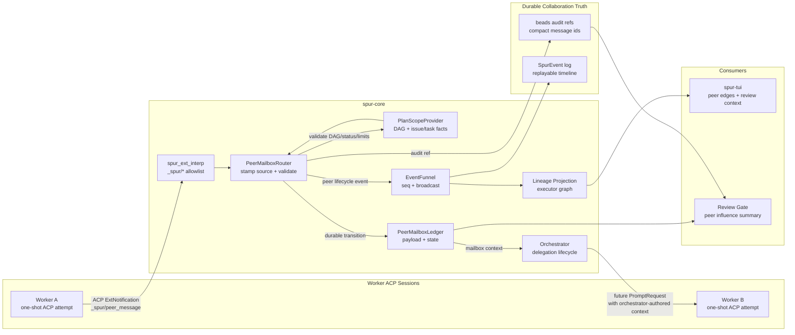
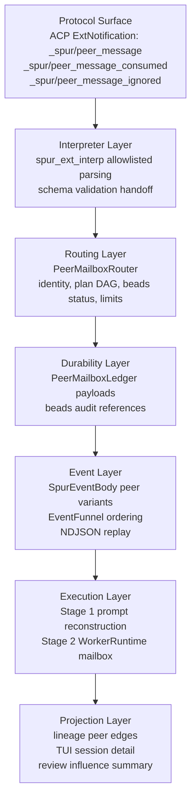
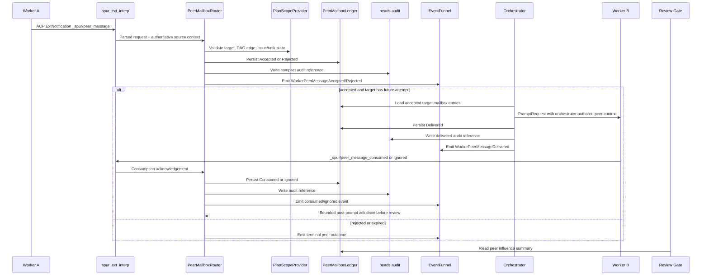
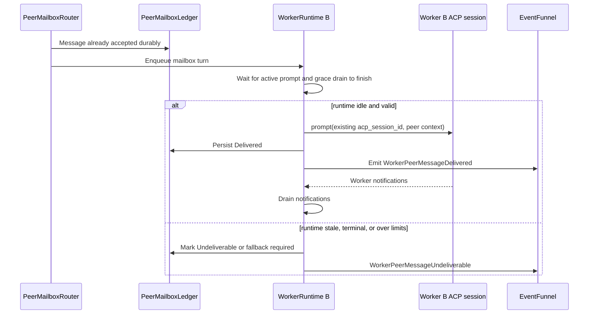

# Worker Peer Mailbox Design

Date: 2026-04-25

## Summary

SPUR should support peer communication between workers in two stages.

Stage 1 ships a durable peer mailbox without relying on long-lived worker ACP
sessions. Workers can request communication, but SPUR remains the authority:
it validates the request, records the message, emits observable events, and
injects relevant mailbox context into later worker prompts.

Stage 2 may add stateful `WorkerRuntime` handles that keep worker ACP sessions
alive across turns. The live runtime is only an execution cache. Durable truth
remains beads audit records, the peer mailbox ledger, and the event stream.

This preserves SPUR's existing control plane: ACP is how SPUR controls agent
sessions, MCP remains brain-facing in v1, and workers do not receive general
MCP tools.

## Current Code Grounding

The design fits the current codebase by adding a peer path beside existing
worker observability instead of replacing the delegation lifecycle.

| Area | Current boundary | Peer mailbox implication |
|---|---|---|
| Worker attempt lifecycle | `crates/spur-core/src/orchestrator.rs` owns `run_one_worker_attempt`, including worktree creation, ACP session creation, prompt drain, shutdown, diff collection, and review handoff. | Stage 1 must keep this one-shot path intact. Peer mailbox context is injected into prompts before `PromptRequest` construction; it does not keep the worker connection alive. |
| Worker `_spur/*` notifications | `crates/spur-core/src/spur_ext_interp.rs` currently accepts `_spur/heartbeat`, `_spur/progress_milestone`, and `_spur/file_touched`; unknown methods are ignored. | Add allowlisted `_spur/peer_message`, `_spur/peer_message_consumed`, and `_spur/peer_message_ignored` parsing. Do not add a generic `_spur/*` passthrough. |
| Event contract | `crates/spur-acp/src/domain/events.rs` defines `SpurEventBody` worker variants such as `WorkerHeartbeat`, `WorkerProgress`, `WorkerNotification`, and `WorkerFileTouched`. | Add peer lifecycle variants with serde round-trip tests before TUI or lineage consumers rely on them. |
| Event ordering | `crates/spur-core/src/event_funnel.rs` stamps all emitted `SpurEventBody` values with monotonic sequence numbers. | Peer events should flow through the same funnel after durable writes, so replay and live execution tell the same story. |
| Review payloads | `crates/spur-acp/src/domain/events.rs` carries `ReviewPayload` inside `ExecutorReviewRequested`. | Peer influence must be attached to review either by extending `ReviewPayload` with peer summary fields or by emitting a prior peer summary event that review/TUI consume deterministically. |
| Lineage projection | `crates/spur-core/src/lineage` projects executor state from `SpurEventBody`. | Peer messages should become edges between executor nodes, not primary task status. |
| TUI rendering | `crates/spur-tui/src/views/dashboard.rs` and `crates/spur-tui/src/views/session_detail.rs` render executor state from lineage and event projections. | Show peer edges and terminal peer outcomes without changing beads-driven task status. |
| Plan and beads persistence | `crates/spur-mcp/src/plan` and `crates/spur-pm` already handle beads-backed plan state, audits, and labels. | Beads stores compact audit references; the peer ledger stores payloads. Stage 1 should avoid moving brain-facing MCP authority to workers. |

## Architecture Diagram



Stage 1 keeps workers as one-shot ACP attempts. The peer mailbox is durable
between attempts, so a target worker can receive relevant peer context even if
there is no live target session at message time.

## Layer Diagram



The critical boundary is between layers 4 and 6: durable mailbox state is
authoritative; prompt delivery is an execution effect that can be retried,
reconstructed, or marked undeliverable.

## Component Boundaries

Stage 1 should introduce small components rather than growing
`orchestrator.rs` further. Crate placement follows the existing layer order
(wire types in `spur-acp`, orchestration logic in `spur-core`):

- `PeerMessageEnvelope` and ledger-state enums in `spur-acp`, alongside
  `SpurEventBody`, with serde round-trip tests for wire compatibility.
  Placing them in `spur-core` would invert the dependency direction.
- `PeerMailboxLedger` in `spur-core`, behind an `#[async_trait]` trait so the
  storage backing can change later. v1 may be in-memory + event-log-backed;
  decide persistence backing before adding cross-process replay TTL.
- `PeerMailboxRouter` in `spur-core`, responsible for validation, state
  transitions, audit references, and event emission.
- `PlanScopeProvider` is a **new abstraction** — it does not exist in the
  current codebase. v1 implementation is the **snapshot pattern**, not live
  access: the router takes a brief read-lock on the existing
  `Arc<Mutex<PlanState>>` (`crates/spur-mcp/src/plan/mod.rs`), constructs an
  immutable `PlanScopeSnapshot` containing only the DAG edges, issue/task
  mapping, supersession state, plan version, and task status relevant to the
  current peer message, then drops the lock before validation. This avoids
  serializing peer traffic through the global plan mutex. A trait can be
  introduced later if multiple snapshot sources emerge. The router must not
  inspect labels ad hoc inside `run_one_worker_attempt`.
- `PeerPromptContextBuilder` in `spur-core`, responsible only for turning
  accepted mailbox entries into bounded orchestrator-authored prompt context.
  Enforces the per-`(message_id, target_prompt_id)` injection idempotence
  defined under "Delivery Guarantees" below. `target_prompt_id` is an
  orchestrator-generated identifier for each specific prompt build, not the
  delegation id; this key survives Stage 2 where one delegation contains many
  prompts/turns.
- Lineage adapter changes under `crates/spur-core/src/lineage`, projecting
  peer messages as edges between executor nodes (`ExecutorNode` / `Attempt`
  in `lineage/types.rs`).
- TUI changes under `crates/spur-tui/src/views/session_detail.rs` and related
  dashboard components, rendering peer edges and terminal peer outcomes.

Stage 2 may add `WorkerRuntime` only after these components exist. Its mailbox
driver should call the same router and ledger APIs rather than creating a
separate live-session path. Stage 2 introduces a dedicated `WorkerRuntimePhase`
distinct from the existing `LifecycleState`
(`Spawning, Running, AwaitingReview, Resuming, Succeeded, Failed, Cancelled`
at `crates/spur-acp/src/domain/events.rs`). The two enums describe orthogonal
concerns: `LifecycleState` tracks executor/review status; `WorkerRuntimePhase`
tracks live ACP-session lifecycle (e.g., `Idle`, `RunningTurn`, `Draining`,
`Retiring`) — these have no equivalent in `LifecycleState`.

## First Principles

Workers should not communicate directly. SPUR owns worktree isolation,
delegation lifecycle, review gates, lineage, cost, and audit state. Therefore
peer communication must be mediated by SPUR even when it feels conversational
to workers.

The system must also survive process death. If a live ACP worker session is
lost, SPUR should be able to reconstruct the collaboration record from durable
state or explicitly mark the peer context unavailable. A worker's conversation
memory cannot become the source of truth.

Receivers are LLMs, not idempotent services. A peer message redelivered into
a retried worker attempt can cause double side effects (file edits, PR
comments, tool calls). SPUR therefore enforces injection idempotence at the
prompt-builder layer rather than relying on receiver-side deduplication. The
delivery guarantee is at-least-once at the transport layer and at-most-once
per `(message_id, target_prompt_id)` pair at the injection layer, where
`target_prompt_id` identifies a single concrete prompt build (Stage 1: one
prompt per attempt; Stage 2: one prompt per turn within a `WorkerRuntime`).
See "Delivery Guarantees" below.

## Approved Direction

Build Option 1 first: durable peer mailbox without stateful worker sessions.
Then progress toward Option 2: stateful worker runtimes backed by the same
durable mailbox protocol.

Rejected for v1:

- Direct worker-to-worker transport.
- General MCP tools exposed to workers.
- Peer messages stored only in runtime memory or only in `SpurEvent`.

## Stage 1: Durable Peer Mailbox

Stage 1 keeps the current one-shot worker execution model. A worker may emit a
structured ACP extension notification such as `_spur/peer_message`. The
orchestrator validates the request, writes durable state, and later injects
accepted mailbox context into prompts for the target worker.

The stage 1 flow is:



Stage 1 proves the collaboration semantics before SPUR takes on the extra risk
of keeping worker ACP sessions alive.

### Stage 1 Orchestrator Integration

`run_one_worker_attempt` in `crates/spur-core/src/orchestrator.rs` is a single
linear unit (~450 lines) covering setup, prompt construction, prompt dispatch,
notification drain, shutdown, and diff collection. Stage 1 must not break this
atomic-unit property; it adds two narrow hooks:

1. **Pre-prompt injection hook**, called immediately before `PromptRequest`
   construction. The hook:
   - Loads accepted-but-not-yet-delivered mailbox entries for the current
     `target_delegation_id` from `PeerMailboxLedger`.
   - Filters by injection-idempotence: skips entries already recorded as
     delivered to this `delegation_id` (see "Delivery Guarantees").
   - Hands them to `PeerPromptContextBuilder`, which produces bounded
     orchestrator-authored context plus a `Vec<MessageId>` of entries that
     were actually included.
2. **Post-dispatch ledger transition**, called immediately after the
   `PromptRequest` send returns `Ok`. For each `MessageId` actually injected,
   the orchestrator persists `Delivered`, writes the beads audit reference,
   and emits `WorkerPeerMessageDelivered` (with `injected_chars`).

Failure mode: if the prompt send returns `Ok` but the `Delivered` ledger
write fails (disk full, lock poisoning, etc.), the worker has the context
but the ledger does not record it. v1 handles this conservatively:

- The orchestrator emits `WorkerPeerMessageAuditFailed` for each affected
  message (existing variant; consistent with the audit-failed rule in
  "Durable State").
- The next prompt build for the same target task will re-inject these
  messages unless the per-`(message_id, target_prompt_id)` injection record
  was itself written successfully. The injection record write is therefore
  the authoritative idempotence boundary, not the `Delivered` ledger
  transition.
- This makes the injection-record write the smallest required atomicity
  unit; the ledger and beads writes can fail-and-retry without causing
  double-injection.
- A new `target_prompt_id` is generated at every prompt build, including
  retries within the same delegation. Stage 1 produces one `target_prompt_id`
  per `run_one_worker_attempt` invocation; Stage 2 produces one per
  `WorkerRuntime` turn. This keeps the idempotence key stable across the
  Stage 1 → Stage 2 transition.

The post-prompt acknowledgement drain (see "Review Behavior") attaches at
the existing notification-drain point in `run_one_worker_attempt` rather
than introducing a new control-flow branch.

### Startup Reconciliation

A process crash can leave the ledger and beads in inconsistent states:

- **Ledger transition written, beads write never reached.** The audit-failed
  event was never emitted because the process died.
- **Injection record written, `Delivered_inflight` never resolved.** The
  prompt was dispatched but the `Delivered` transition was lost mid-write.
- **Guard still resident in memory.** Stranded entries the in-process
  reconciler never drained.

On orchestrator startup, before any prompt dispatch, the system runs a
**Startup Reconciliation** pass:

1. Scan the ledger for entries in non-terminal states (`Accepted`, `Queued`,
   `Delivered_inflight`).
2. For each entry, consult beads for the corresponding audit reference:
   - If the audit reference is missing for a transition that should have
     written one, emit `WorkerPeerMessageAuditFailed` (idempotent by
     `message_id` plus transition kind).
   - If `Delivered_inflight` is older than the configured drain quiet
     window, force-resolve to `Delivered` if the injection record was
     written, else fall back to `Queued`.
3. Wrap every loaded non-terminal entry in a fresh `PeerMessageGuard`
   *before* any `run_one_worker_attempt` is allowed to start. This guarantees
   that a crash during reconciliation cannot leave entries unprotected.
4. Drain any entries left in the previous run's stranded-message mpsc by
   reading from the durable backing store, if any. v1 in-memory ledger has
   no durable mpsc spillover, so this step is a no-op until persistence
   backing lands.

The reconciliation pass is bounded in time and emits a single
`WorkerPeerMailboxReconciled` summary event with counts per resolution
kind, so operators can see the recovery shape on every restart.

Stranded-message safety. The orchestrator wraps every accepted-but-not-yet-
terminal peer message in a `PeerMessageGuard` RAII handle, mirroring the
existing `DelegationGuard` pattern (`crates/spur-core/src/orchestrator.rs`).
Async-Drop is intentionally avoided — performing async ledger writes in
`Drop` is unsafe (the runtime may be shutting down, leading to silent
failures or task panics).

The guard exposes two paths:

1. **`async fn finalize(self, outcome: TerminalOutcome)`** — the normal
   path. Called explicitly from every code path that resolves the message,
   including `Consumed`, `Ignored`, `Expired`, `Dropped`, `Undeliverable`.
   Performs the full async ledger transition, beads write, and event
   emission. Consumes the guard so no `Drop` runs.
2. **Sync-only `Drop` impl** — fires only when the guard is dropped
   *without* `finalize` having been called (panic, early return, task
   abort). It performs:
   - A non-blocking enqueue of an `Undeliverable` transition onto a
     dedicated unbounded mpsc drained by a long-lived reconciler task
     (separate from the EventFunnel, so it survives runtime shutdown
     differently).
   - A `tracing::error!` log noting the missed `finalize`.
   - No async work, no blocking writes, no `block_on`.

  The reconciler task drains the mpsc and applies the transitions when the
  runtime is healthy; if the runtime has fully shut down, the entries are
  recovered on next startup by the startup reconciliation pass (see
  "Startup Reconciliation" below).

Guard scope. The guard is constructed by the router immediately after the
ledger `Accepted` write succeeds (not by the orchestrator). This closes the
window where a router-side panic between ledger-persist and event emission
could leave a durable message with no guard. The guard is then transferred
to the orchestrator when injection begins, and to the consumer-acker when
delivery completes. Each transfer is a move, not a copy; at most one guard
exists per message at any time.

The audit-failed rule covers ledger-write failures during normal operation;
`PeerMessageGuard` covers task-death and panic failures; the startup
reconciler (below) covers process-death failures.

## Stage 2: Stateful WorkerRuntime

Stage 2 may promote delivery into live ACP sessions. A `WorkerRuntime` owns one
worker connection, one ACP protocol session, one worktree, and one serialized
mailbox driver.

The runtime is not durable truth. It is a cache of execution capability.

Required state includes:

- `executor_id`
- SPUR worker session id
- ACP protocol session id
- delegation id
- issue id
- plan task id
- worktree path
- lifecycle phase
- mailbox queue

Required lifecycle phases include at least:

- `Starting`
- `RunningTurn`
- `Draining`
- `Idle`
- `AwaitingReview`
- `ReviewedTerminal`
- `Retiring`
- `Failed`

Only one prompt may be active for a worker runtime at a time. A peer turn cannot
enter the ACP session until the active prompt has completed and notification
grace draining has finished.

If a runtime is unavailable, stale, terminal, over TTL, or over turn limits,
SPUR falls back to the stage 1 behavior: durable mailbox context is
reconstructed into a future one-shot prompt, or the message is marked
undeliverable with an auditable reason.



## Peer Message Envelope

Peer messages target logical work, not raw sessions or paths.

Minimum worker request envelope:

```json
{
  "schema": "spur-peer-message/v1",
  "message_id": "<uuid-v4>",
  "target_delegation_id": "<delegation-id>",
  "target_issue_id": "<beads-id>",
  "target_plan_task_id": "<task-id>",
  "kind": "question",
  "body": "Short worker-authored message",
  "sequence": 1
}
```

The router stamps source identity from orchestrator context, not from worker
payload. Source delegation, source issue, source plan task, worktree path,
executor id, ACP session id, and agent name are authoritative only when derived
from the active worker attempt context.

Persisted ledger envelope:

```json
{
  "schema": "spur-peer-message/v1",
  "message_id": "<uuid-v4>",
  "source_delegation_id": "<delegation-id>",
  "target_delegation_id": "<delegation-id>",
  "source_issue_id": "<beads-id>",
  "target_issue_id": "<beads-id>",
  "source_plan_task_id": "<task-id>",
  "target_plan_task_id": "<task-id>",
  "source_executor_id": "<executor-id>",
  "plan_version": "<plan-version>",
  "kind": "question",
  "body": "Short worker-authored message",
  "sequence": 1
}
```

`sequence` is monotonic per `(source_delegation_id, target_delegation_id)`
pair. Gap detection is left to the router: a gap above the next expected
sequence transitions the message to `Dropped` with reason `sequence_gap` for
v1 (no out-of-order buffering).

`plan_version` is set by the router from the `PlanScopeSnapshot` at acceptance
time and is used by supersession/carry-forward logic (see "Validation" and
"Durable State"). It is not authored by the worker.

Deferred for v1: a `causal_parent_id` field referencing a prior message was
considered but removed. The single `sequence` field is sufficient for
question/answer/handoff patterns. Reintroduce only when a concrete use case
demands cross-message dependency edges.

Allowed `kind` values for v1:

- `question`
- `answer`
- `handoff`
- `warning`
- `constraint`

The orchestrator wraps delivered content as orchestrator-authored context. It
must not pass raw worker text as an instruction with authority over the target
worker.

## Validation

The orchestrator accepts a peer message only if all checks pass against a
single `PlanScopeSnapshot` taken at the start of validation:

- Source and target delegations exist.
- Source and target issues exist.
- Source and target are in the same approved plan scope or explicitly allowed
  by the brain.
- The plan DAG permits the communication. Same lineage is not enough.
- Neither task is superseded at acceptance time.
- Source and target lifecycle phases allow peer communication.
- Message id has not already been accepted.
- Per-`(source_delegation_id, target_delegation_id)` sequence is monotonic or
  idempotently replayed.
- Body size is below the configured limit, and the projected total injection
  size for the target stays within the bound defined under "Safety Limits".
- Source worker is not terminal, cancelled, or retired.
- Target can receive now or can receive later through durable mailbox replay.

If validation fails, SPUR records a rejected peer event and, when appropriate,
a beads audit reference.

In-flight supersession (after acceptance):

- If the target task is superseded while messages are queued for it, those
  messages transition to `Undeliverable` with reason `target_superseded`.
- If the target task is retried (a new attempt of the same task, not
  superseded), queued messages are carried forward only when the source has
  not itself been superseded and the source's recorded `plan_version` matches
  the current plan version. Otherwise the queued message transitions to
  `Dropped` with reason `plan_version_changed`.
- Mailbox entries are keyed by `(target_plan_task_id, plan_version)` for
  carry-forward purposes; `delegation_id` alone is insufficient because
  retries get new delegation ids.

## Delivery Guarantees

v1 chooses **at-least-once delivery at the transport layer** and
**at-most-once injection per `(message_id, target_prompt_id)` pair**.
Exactly-once is intentionally not targeted: in distributed systems, duplicates
are fixable; data loss is not.

Two layers of idempotence:

1. **Ledger transition idempotence by `(message_id, transition_kind)`.**
   Replays of the same ACP notification or restart-time recovery may re-apply
   a transition; the ledger returns the existing state and must not duplicate
   beads audit references or peer lifecycle events.
2. **Injection idempotence by `(message_id, target_prompt_id)`.** The
   `PeerPromptContextBuilder` records each successful delivery against a
   specific `target_prompt_id` — an orchestrator-generated identifier scoped
   to one concrete prompt build. A given `(message_id, target_prompt_id)`
   pair is injected at most once. Stage 1 generates one `target_prompt_id`
   per `run_one_worker_attempt` invocation; Stage 2 generates one per
   `WorkerRuntime` turn. A new prompt build (Stage 1 retry, Stage 2 next
   turn) is a fresh injection boundary; carry-forward rules in "Validation"
   decide whether the message follows.

The injection record is the authoritative idempotence boundary — *not* the
`Delivered` ledger transition. The ledger uses an explicit
`Delivered_inflight` state to capture the window between "injection record
written, prompt dispatched" and "Delivered transition committed". On
recovery, an entry stuck in `Delivered_inflight` for longer than the
configured drain quiet window is forced to `Delivered` if its injection
record was written, or back to `Queued` if not. This eliminates the
ambiguity between "Delivered write failed after prompt sent" and "not yet
injected".

This separation is necessary because the receiver is an LLM, not an
idempotent service: re-injecting a `handoff` or `constraint` message into
the same prompt build can cause double side effects within a single turn.

Deduplication window: v1 keeps the per-`message_id` accepted-transition record
in the in-memory ledger for the lifetime of the process. A persistent
deduplication TTL is intentionally deferred until persistence backing is
chosen — adding TTL semantics before that is over-engineered.

## Durable State

The peer mailbox ledger stores payload detail. Beads remains the collaboration
truth by storing compact audit references for state transitions.

Ledger states:

- `Accepted`
- `Rejected`
- `Queued`
- `Delivered_inflight` — injection record written and prompt dispatched, but
  `Delivered` transition not yet committed; resolved by recovery sweep
- `Delivered`
- `Consumed`
- `Ignored`
- `Expired`
- `Dropped`
- `Undeliverable`

Beads audit references should include:

- peer send accepted
- peer send rejected
- peer delivered
- peer consumed
- peer ignored
- peer expired
- peer dropped
- peer undeliverable

The audit record may reference compact message and turn ids rather than storing
full payload text. The ledger stores full payloads and delivery metadata.

Durability and emission rule:

1. Persist the ledger transition.
2. Write or attempt the compact beads audit reference.
3. Emit the corresponding `SpurEventBody` through `EventFunnel`.

If the ledger transition succeeds but beads audit fails, SPUR must persist an
audit-failed marker in the ledger and emit an explicit degraded peer event or
error outcome. It must not emit a normal audited transition that did not happen.

All ledger transitions are idempotent by `message_id` plus transition kind.
Replays may return the existing state, but they must not duplicate beads audit
references or peer lifecycle events.

Beads audit label format. Beads `br create --label` enforces a 50-character
cap on label values; `br label add` does not. Peer audit references would
exceed 50 characters when combined with a 32-hex compact UUID, so the
implementation must follow the existing precedent in
`crates/spur-mcp/src/plan/labels.rs` (`signal_processed_label` is 54 chars
and uses the `br label add` path). Suggested label shape:
`spur:peer:{compact_uuid}` (28 chars) for the message-id reference, attached
via `br label add` after issue creation. Label grammar is the existing
`[A-Za-z0-9_:-]+`. Add the constructors next to existing label helpers.

## Events

Add explicit peer lifecycle events so TUI, lineage, replay, and review can tell
the same story:

- `WorkerPeerMessageAccepted`
- `WorkerPeerMessageRejected`
- `WorkerPeerMessageQueued`
- `WorkerPeerMessageDelivered` (carries `injected_chars: u32` for cost
  attribution; see "Cost Behavior")
- `WorkerPeerMessageConsumed`
- `WorkerPeerMessageIgnored`
- `WorkerPeerMessageExpired`
- `WorkerPeerMessageDropped`
- `WorkerPeerMessageUndeliverable`
- `WorkerPeerMessageAuditFailed`
- `WorkerPeerMailboxReconciled` — emitted once per startup reconciliation
  pass, carrying counts per resolution kind (audit-failed emitted, inflight
  forced to delivered, inflight reverted to queued, guards re-wrapped)

Event ordering:

- `WorkerPeerMessageAccepted` or `WorkerPeerMessageRejected` is emitted after
  durable validation state is written.
- `WorkerPeerMessageQueued` is emitted before prompt reconstruction includes
  the message.
- `WorkerPeerMessageDelivered` is emitted after the target prompt has been
  built with the message context and the delivered ledger transition is written.
- `WorkerPeerMessageConsumed` or `WorkerPeerMessageIgnored` is emitted before
  the target worker can reach review.
- `WorkerPeerMessageExpired`, `WorkerPeerMessageDropped`, and
  `WorkerPeerMessageUndeliverable` are terminal for that message.
- `WorkerPeerMessageAuditFailed` is emitted only for a ledger transition whose
  beads audit reference failed. It is not a normal delivery/consumption state.

Every new event variant needs round-trip serialization tests. Replay
forward-compatibility: ten new `WorkerPeerMessage*` variants are introduced.
Replay code that loads NDJSON event logs from older builds must tolerate the
absence of these variants, and replay code on older builds reading new logs
must tolerate unknown variants without panicking. Adopt
`#[serde(other)]` on the variant enum (or an equivalent unknown-variant
fallthrough) and add an explicit replay-compat test that round-trips a log
with both old-only and new-only variants.

## Review Behavior

Review must surface peer influence. A worker result should include:

- inbound peer messages consumed
- inbound peer messages ignored
- outbound peer messages emitted
- undelivered peer messages that may affect completeness
- whether any peer input came from unreviewed work

Approval should require all inbound peer messages to be consumed or explicitly
ignored. Messages from unreviewed source work are advisory unless the brain
promotes them.

Acknowledgements arrive through the extension notification consumer, which
flows through `EventFunnel` (`crates/spur-core/src/event_funnel.rs`).
v1 uses a **forced-terminal-timeout drain** as the authoritative barrier
before review proceeds:

- After the worker prompt completes, the orchestrator opens a fixed quiet
  window (configurable; default 2 seconds) for peer-ack notifications
  scoped to the active delegation.
- Observing a `_spur/peer_message_consumed` / `_spur/peer_message_ignored`
  for the active delegation resets the quiet window once.
- When the quiet window elapses without further peer-ack events, the drain
  is complete. Any inbound peer messages still in non-terminal state are
  forced to `Ignored`, `Expired`, `Dropped`, or `Undeliverable` with a
  durable reason before review can proceed.
- `ExecutorReviewRequested` is emitted only after the drain completes.

The funnel's monotonic seq is used opportunistically as a fast-path: if the
orchestrator has already observed acks for every delivered message before
the quiet window starts, the drain resolves immediately. The seq watermark
is **not** a precondition for drain completion — relying on global seq
advancement deadlocks when the active delegation is the only emitter (no
other event sources push the funnel forward), so the timeout is the
authoritative barrier and the seq watermark is only an optimization.

Late acknowledgements that arrive after a message has reached a terminal
state are **idempotent no-ops**: the router observes the existing terminal
state and does not transition. This handles raw bytes still in flight in
the ACP stdio buffer or kernel pipe at drain-timeout, which the seq
watermark cannot capture. Late acks may be recorded as a debug-level log
entry but must not flip terminal state or emit a duplicate lifecycle event.

The peer influence summary should be available to `ExecutorReviewRequested`.
Implementation may either extend `ReviewPayload` with peer summary fields or
emit a peer review summary event immediately before the review request, as long
as replay reconstructs the same review context.

## Cost Behavior

Peer communication has two cost surfaces, which must remain separable in
review:

1. **Injection bytes (Stage 1 and Stage 2).** Each accepted peer message
   injected into a prompt adds bytes to the target's context. v1 attributes
   these bytes by carrying `injected_chars: u32` directly on the
   `WorkerPeerMessageDelivered` event. Lineage projection sums these per
   delegation into a `peer_injected_chars` metric available to review.
   `CostUpdate` is **not** extended — peer cost is first-class, not a turn
   annotation, and the existing per-turn cost stream stays clean.
2. **Live peer-turn cost (Stage 2 only).** When a peer message becomes its
   own ACP turn inside a `WorkerRuntime`, the turn produces standard
   `CostUpdate` events tagged with `peer_message_id`, `target_delegation_id`,
   `source_delegation_id`, `turn_type = peer`, and `agent`. Idle/runtime
   accounting flows through the same path.

Token-level conversion (chars → tokens) is intentionally not committed to in
v1, because it would force a tokenizer dependency. Lineage may approximate
token counts at projection time when a tokenizer is already available for the
target agent; otherwise it reports chars only.

## UI and Lineage

The TUI should show peer communication as collapsible lineage edges rather
than as primary task status. Task status remains driven by beads lifecycle and
delegation lifecycle.

Minimum UI states:

- sent
- accepted
- delivered
- consumed
- ignored
- rejected
- expired
- dropped
- undeliverable

Rejected, expired, and dropped messages must not look like silent stalls.

## Safety Limits

V1 should ship behind a feature flag with conservative limits:

- max peer message size (per-message body byte cap)
- max pending mailbox depth per target
- max messages per source delegation
- max fanout of one message
- idle TTL for stage 2 runtimes
- max turns per stage 2 runtime
- explicit downgrade behavior when the feature is disabled

The aggregate prompt-bloat bound must be expressed as a fraction of the
target agent's context window, not as an absolute byte cap, because target
agents range from ~32k (small Codex/Kimi profiles) to ~200k+ (Claude). A
flat percentage is unsafe: 5% of 32k is 1,600 chars, which collapses to
~200 chars per message at `max_pending_mailbox_depth = 8` — too tight for
practical handoffs.

v1 uses a **tiered bound**:

| Target context window | Aggregate peer-context budget |
|---|---|
| < 64k | 10% of context window |
| 64k–128k | 7% of context window |
| ≥ 128k | 5% of context window |

In addition, `max_peer_message_size` must satisfy
`max_peer_message_size ≤ aggregate_budget / max_pending_mailbox_depth`,
so even at full mailbox depth a single message body fits within the
per-message slice. If the configured `max_peer_message_size` exceeds this
derived ceiling, the router uses the smaller of the two.

The router rejects acceptance with reason `target_capacity_exhausted` when
the projected total would exceed the aggregate bound; the rejection is
recorded durably, not silently.

No peer message is silently discarded. Drops, expirations, and truncations are
durable outcomes.

Backpressure boundary. The `PeerMailboxRouter` enforces all per-source and
per-target limits at the validation step, **before** any event is enqueued
on the `EventFunnel` mpsc (`crates/spur-core/src/event_funnel.rs`). The
funnel's `mpsc::unbounded` inbound is therefore protected from runaway peer
traffic by upstream rejection: a misbehaving worker cannot grow the funnel
queue by spamming peer messages, because messages over the per-source cap
are rejected with reason `source_quota_exceeded` and produce a single
`WorkerPeerMessageRejected` event rather than feeding a flood downstream.
This preserves the existing event-pipeline backpressure profile.

## Migration Path

1. Add the durable peer envelope, validation model, ledger, audit references,
   and events.
2. Inject accepted mailbox context into one-shot worker prompts.
3. Add review summaries and TUI lineage edges.
4. Add fallback prompt reconstruction from the ledger.
5. Only then add stateful `WorkerRuntime` delivery.
6. Keep one-shot fallback permanently available.

## V1 Defaults

- Ledger ownership starts in `spur-core` because peer routing is an
  orchestrator concern. If the implementation grows beyond routing and replay,
  it can be extracted later behind a small trait.
- Beads audit references are required for review-relevant transitions:
  accepted, rejected, delivered, consumed, ignored, expired, dropped, and
  undeliverable.
- Default routing is allowed only for direct plan DAG edges and brain-approved
  explicit peer edges. Sibling tasks under the same epic are not enough by
  themselves.
- Stage 1 requires explicit target acknowledgement through
  `_spur/peer_message_consumed` or `_spur/peer_message_ignored`. Prompt
  completion alone does not imply consumption.

## Acceptance Criteria

- Worker peer communication works without long-lived worker sessions.
- Durable state can reconstruct every accepted, delivered, consumed, rejected,
  expired, dropped, or undeliverable peer message.
- Beads contains compact audit references for review-relevant peer state,
  using label values that satisfy beads' grammar and the 50-char `br create`
  cap (or use `br label add` for longer labels, per existing precedent in
  `crates/spur-mcp/src/plan/labels.rs`).
- No worker can target raw ACP session ids, worktree paths, or peer process
  internals.
- Peer messages are visible in lineage and review context.
- One-shot worker execution remains available when peer communication is
  disabled or when a stateful runtime cannot be trusted.
- Stage 2 cannot make live ACP session memory the source of truth.
- Each peer message is injected at most once per `(message_id,
  target_prompt_id)` pair, even under retry or replay; this key remains
  stable across the Stage 1 → Stage 2 transition.
- Total injected peer context per target prompt does not exceed the tiered
  aggregate budget defined under "Safety Limits" (10% under 64k context,
  7% at 64k–128k, 5% at ≥128k), and `max_peer_message_size` never exceeds
  `aggregate_budget / max_pending_mailbox_depth`.
- `ExecutorReviewRequested` is never emitted before the forced-terminal-
  timeout drain completes; late acks after a terminal state are recorded as
  no-ops without flipping state or emitting duplicate events.
- All new `WorkerPeerMessage*` event variants round-trip serialize and
  tolerate unknown-variant logs in both forward and backward replay tests.
- `PeerMessageGuard::Drop` performs no async work and no blocking writes;
  every successful resolution path calls `finalize().await` before drop.
- Startup reconciliation runs before any `run_one_worker_attempt` and emits
  exactly one `WorkerPeerMailboxReconciled` event with per-kind counts.
- No `Delivered_inflight` entry persists across two consecutive startup
  reconciliations.
