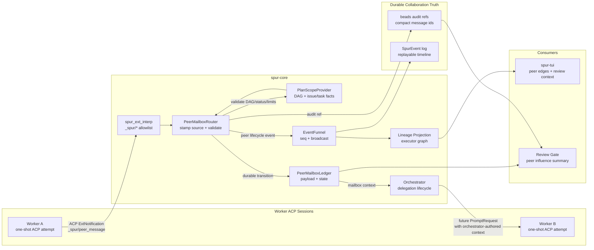
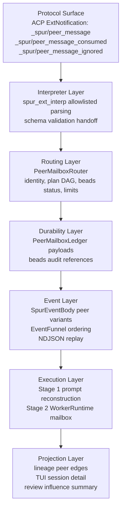
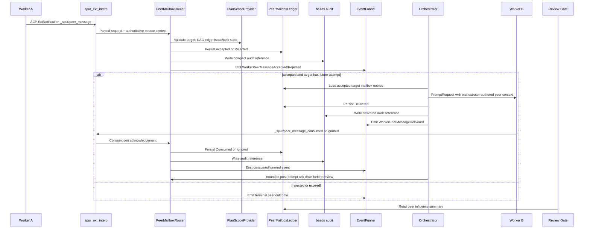
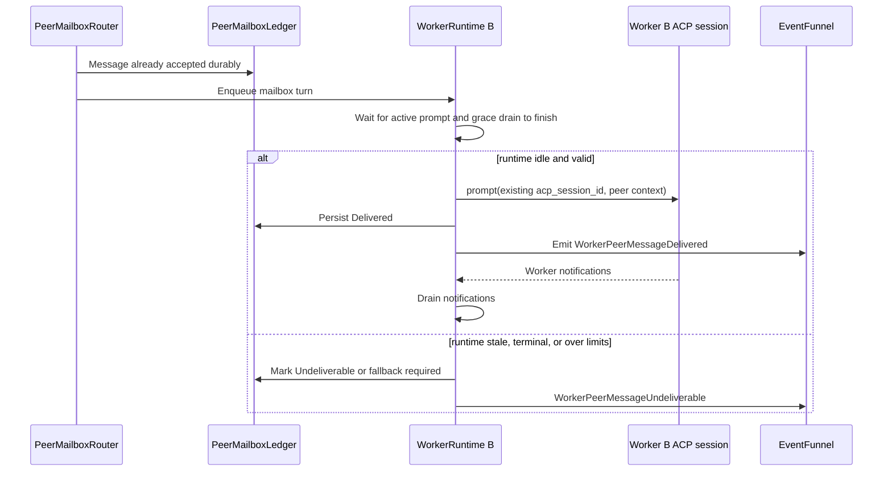

# Worker Peer Mailbox Design

Date: 2026-04-25

## Summary

SPUR should support peer communication between workers in two stages.

Stage 1 ships a durable peer mailbox without relying on long-lived worker ACP
sessions. Workers can request communication, but SPUR remains the authority:
it validates the request, records the message, emits observable events, and
injects relevant mailbox context into later worker prompts.

Stage 2 may add stateful `WorkerRuntime` handles that keep worker ACP sessions
alive across turns. The live runtime is only an execution cache. Durable truth
remains beads audit records, the peer mailbox ledger, and the event stream.

This preserves SPUR's existing control plane: ACP is how SPUR controls agent
sessions, MCP remains brain-facing in v1, and workers do not receive general
MCP tools.

## Current Code Grounding

The design fits the current codebase by adding a peer path beside existing
worker observability instead of replacing the delegation lifecycle.

| Area | Current boundary | Peer mailbox implication |
|---|---|---|
| Worker attempt lifecycle | `crates/spur-core/src/orchestrator.rs` owns `run_one_worker_attempt`, including worktree creation, ACP session creation, prompt drain, shutdown, diff collection, and review handoff. | Stage 1 must keep this one-shot path intact. Peer mailbox context is injected into prompts before `PromptRequest` construction; it does not keep the worker connection alive. |
| Worker `_spur/*` notifications | `crates/spur-core/src/spur_ext_interp.rs` currently accepts `_spur/heartbeat`, `_spur/progress_milestone`, and `_spur/file_touched`; unknown methods are ignored. | Add allowlisted `_spur/peer_message`, `_spur/peer_message_consumed`, and `_spur/peer_message_ignored` parsing. Do not add a generic `_spur/*` passthrough. |
| Event contract | `crates/spur-acp/src/domain/events.rs` defines `SpurEventBody` worker variants such as `WorkerHeartbeat`, `WorkerProgress`, `WorkerNotification`, and `WorkerFileTouched`. | Add peer lifecycle variants with serde round-trip tests before TUI or lineage consumers rely on them. |
| Event ordering | `crates/spur-core/src/event_funnel.rs` stamps all emitted `SpurEventBody` values with monotonic sequence numbers. | Peer events should flow through the same funnel after durable writes, so replay and live execution tell the same story. |
| Review payloads | `crates/spur-acp/src/domain/events.rs` carries `ReviewPayload` inside `ExecutorReviewRequested`. | Peer influence must be attached to review either by extending `ReviewPayload` with peer summary fields or by emitting a prior peer summary event that review/TUI consume deterministically. |
| Lineage projection | `crates/spur-core/src/lineage` projects executor state from `SpurEventBody`. | Peer messages should become edges between executor nodes, not primary task status. |
| TUI rendering | `crates/spur-tui/src/views/dashboard.rs` and `crates/spur-tui/src/views/session_detail.rs` render executor state from lineage and event projections. | Show peer edges and terminal peer outcomes without changing beads-driven task status. |
| Plan and beads persistence | `crates/spur-mcp/src/plan` and `crates/spur-pm` already handle beads-backed plan state, audits, and labels. | Beads stores compact audit references; the peer ledger stores payloads. Stage 1 should avoid moving brain-facing MCP authority to workers. |

## Architecture Diagram



Stage 1 keeps workers as one-shot ACP attempts. The peer mailbox is durable
between attempts, so a target worker can receive relevant peer context even if
there is no live target session at message time.

## Layer Diagram



The critical boundary is between layers 4 and 6: durable mailbox state is
authoritative; prompt delivery is an execution effect that can be retried,
reconstructed, or marked undeliverable.

## Component Boundaries

Stage 1 should introduce small components rather than growing
`orchestrator.rs` further:

- `PeerMessageEnvelope` in `spur-acp` or a narrow `spur-core` module, with
  serde tests for wire compatibility.
- `PeerMailboxLedger` in `spur-core`, initially file-backed or event-log-backed
  behind a trait so storage can move later.
- `PeerMailboxRouter` in `spur-core`, responsible for validation, state
  transitions, audit references, and event emission.
- `PlanScopeProvider` as a narrow trait or snapshot input to the router,
  exposing plan DAG edges, issue/task mapping, supersession state, and task
  status. The router should not inspect labels ad hoc inside
  `run_one_worker_attempt`.
- `PeerPromptContextBuilder` in `spur-core`, responsible only for turning
  accepted mailbox entries into bounded orchestrator-authored prompt context.
- Lineage adapter changes under `crates/spur-core/src/lineage`, projecting
  peer messages as edges between executor nodes.
- TUI changes under `crates/spur-tui/src/views/session_detail.rs` and related
  dashboard components, rendering peer edges and terminal peer outcomes.

Stage 2 may add `WorkerRuntime` only after these components exist. Its mailbox
driver should call the same router and ledger APIs rather than creating a
separate live-session path. Stage 2 should introduce a dedicated
`WorkerRuntimePhase` instead of overloading the existing executor
`LifecycleState`, which is oriented around executor/review status.

## First Principles

Workers should not communicate directly. SPUR owns worktree isolation,
delegation lifecycle, review gates, lineage, cost, and audit state. Therefore
peer communication must be mediated by SPUR even when it feels conversational
to workers.

The system must also survive process death. If a live ACP worker session is
lost, SPUR should be able to reconstruct the collaboration record from durable
state or explicitly mark the peer context unavailable. A worker's conversation
memory cannot become the source of truth.

## Approved Direction

Build Option 1 first: durable peer mailbox without stateful worker sessions.
Then progress toward Option 2: stateful worker runtimes backed by the same
durable mailbox protocol.

Rejected for v1:

- Direct worker-to-worker transport.
- General MCP tools exposed to workers.
- Peer messages stored only in runtime memory or only in `SpurEvent`.

## Stage 1: Durable Peer Mailbox

Stage 1 keeps the current one-shot worker execution model. A worker may emit a
structured ACP extension notification such as `_spur/peer_message`. The
orchestrator validates the request, writes durable state, and later injects
accepted mailbox context into prompts for the target worker.

The stage 1 flow is:



Stage 1 proves the collaboration semantics before SPUR takes on the extra risk
of keeping worker ACP sessions alive.

## Stage 2: Stateful WorkerRuntime

Stage 2 may promote delivery into live ACP sessions. A `WorkerRuntime` owns one
worker connection, one ACP protocol session, one worktree, and one serialized
mailbox driver.

The runtime is not durable truth. It is a cache of execution capability.

Required state includes:

- `executor_id`
- SPUR worker session id
- ACP protocol session id
- delegation id
- issue id
- plan task id
- worktree path
- lifecycle phase
- mailbox queue

Required lifecycle phases include at least:

- `Starting`
- `RunningTurn`
- `Draining`
- `Idle`
- `AwaitingReview`
- `ReviewedTerminal`
- `Retiring`
- `Failed`

Only one prompt may be active for a worker runtime at a time. A peer turn cannot
enter the ACP session until the active prompt has completed and notification
grace draining has finished.

If a runtime is unavailable, stale, terminal, over TTL, or over turn limits,
SPUR falls back to the stage 1 behavior: durable mailbox context is
reconstructed into a future one-shot prompt, or the message is marked
undeliverable with an auditable reason.



## Peer Message Envelope

Peer messages target logical work, not raw sessions or paths.

Minimum worker request envelope:

```json
{
  "schema": "spur-peer-message/v1",
  "message_id": "<uuid-v4>",
  "target_delegation_id": "<delegation-id>",
  "target_issue_id": "<beads-id>",
  "target_plan_task_id": "<task-id>",
  "kind": "question",
  "body": "Short worker-authored message",
  "causal_parent_id": null,
  "sequence": 1
}
```

The router stamps source identity from orchestrator context, not from worker
payload. Source delegation, source issue, source plan task, worktree path,
executor id, ACP session id, and agent name are authoritative only when derived
from the active worker attempt context.

Persisted ledger envelope:

```json
{
  "schema": "spur-peer-message/v1",
  "message_id": "<uuid-v4>",
  "source_delegation_id": "<delegation-id>",
  "target_delegation_id": "<delegation-id>",
  "source_issue_id": "<beads-id>",
  "target_issue_id": "<beads-id>",
  "source_plan_task_id": "<task-id>",
  "target_plan_task_id": "<task-id>",
  "source_executor_id": "<executor-id>",
  "kind": "question",
  "body": "Short worker-authored message",
  "causal_parent_id": null,
  "sequence": 1
}
```

Allowed `kind` values for v1:

- `question`
- `answer`
- `handoff`
- `warning`
- `constraint`

The orchestrator wraps delivered content as orchestrator-authored context. It
must not pass raw worker text as an instruction with authority over the target
worker.

## Validation

The orchestrator accepts a peer message only if all checks pass:

- Source and target delegations exist.
- Source and target issues exist.
- Source and target are in the same approved plan scope or explicitly allowed
  by the brain.
- The plan DAG permits the communication. Same lineage is not enough.
- Neither task is superseded.
- Source and target lifecycle phases allow peer communication.
- Message id has not already been accepted.
- Per-source sequence is monotonic or idempotently replayed.
- Body size is below the configured limit.
- Source worker is not terminal, cancelled, or retired.
- Target can receive now or can receive later through durable mailbox replay.

If validation fails, SPUR records a rejected peer event and, when appropriate,
a beads audit reference.

## Durable State

The peer mailbox ledger stores payload detail. Beads remains the collaboration
truth by storing compact audit references for state transitions.

Ledger states:

- `Accepted`
- `Rejected`
- `Queued`
- `Delivered`
- `Consumed`
- `Ignored`
- `Expired`
- `Dropped`
- `Undeliverable`

Beads audit references should include:

- peer send accepted
- peer send rejected
- peer delivered
- peer consumed
- peer ignored
- peer expired
- peer dropped
- peer undeliverable

The audit record may reference compact message and turn ids rather than storing
full payload text. The ledger stores full payloads and delivery metadata.

Durability and emission rule:

1. Persist the ledger transition.
2. Write or attempt the compact beads audit reference.
3. Emit the corresponding `SpurEventBody` through `EventFunnel`.

If the ledger transition succeeds but beads audit fails, SPUR must persist an
audit-failed marker in the ledger and emit an explicit degraded peer event or
error outcome. It must not emit a normal audited transition that did not happen.

All ledger transitions are idempotent by `message_id` plus transition kind.
Replays may return the existing state, but they must not duplicate beads audit
references or peer lifecycle events.

## Events

Add explicit peer lifecycle events so TUI, lineage, replay, and review can tell
the same story:

- `WorkerPeerMessageAccepted`
- `WorkerPeerMessageRejected`
- `WorkerPeerMessageQueued`
- `WorkerPeerMessageDelivered`
- `WorkerPeerMessageConsumed`
- `WorkerPeerMessageIgnored`
- `WorkerPeerMessageExpired`
- `WorkerPeerMessageDropped`
- `WorkerPeerMessageUndeliverable`
- `WorkerPeerMessageAuditFailed`

Event ordering:

- `WorkerPeerMessageAccepted` or `WorkerPeerMessageRejected` is emitted after
  durable validation state is written.
- `WorkerPeerMessageQueued` is emitted before prompt reconstruction includes
  the message.
- `WorkerPeerMessageDelivered` is emitted after the target prompt has been
  built with the message context and the delivered ledger transition is written.
- `WorkerPeerMessageConsumed` or `WorkerPeerMessageIgnored` is emitted before
  the target worker can reach review.
- `WorkerPeerMessageExpired`, `WorkerPeerMessageDropped`, and
  `WorkerPeerMessageUndeliverable` are terminal for that message.
- `WorkerPeerMessageAuditFailed` is emitted only for a ledger transition whose
  beads audit reference failed. It is not a normal delivery/consumption state.

Every new event variant needs round-trip serialization tests.

## Review Behavior

Review must surface peer influence. A worker result should include:

- inbound peer messages consumed
- inbound peer messages ignored
- outbound peer messages emitted
- undelivered peer messages that may affect completeness
- whether any peer input came from unreviewed work

Approval should require all inbound peer messages to be consumed or explicitly
ignored. Messages from unreviewed source work are advisory unless the brain
promotes them.

Because acknowledgements arrive through the extension notification consumer, v1
requires a bounded post-prompt acknowledgement drain before review is requested.
If delivered inbound messages remain unacknowledged after that drain, the router
must record them as `Ignored`, `Expired`, `Dropped`, or `Undeliverable` with a
durable reason before review can proceed.

The peer influence summary should be available to `ExecutorReviewRequested`.
Implementation may either extend `ReviewPayload` with peer summary fields or
emit a peer review summary event immediately before the review request, as long
as replay reconstructs the same review context.

## Cost Behavior

Peer mailbox turns must be attributable. Costs should be tagged by:

- target delegation
- source delegation
- peer message id
- turn type
- agent

Stage 1 mostly affects prompt reconstruction cost. Stage 2 adds live
peer-turn cost and idle/runtime accounting.

## UI and Lineage

The TUI should show peer communication as collapsible lineage edges rather
than as primary task status. Task status remains driven by beads lifecycle and
delegation lifecycle.

Minimum UI states:

- sent
- accepted
- delivered
- consumed
- ignored
- rejected
- expired
- dropped
- undeliverable

Rejected, expired, and dropped messages must not look like silent stalls.

## Safety Limits

V1 should ship behind a feature flag with conservative limits:

- max peer message size
- max pending mailbox depth per target
- max messages per source delegation
- max fanout of one message
- idle TTL for stage 2 runtimes
- max turns per stage 2 runtime
- explicit downgrade behavior when the feature is disabled

No peer message is silently discarded. Drops, expirations, and truncations are
durable outcomes.

## Migration Path

1. Add the durable peer envelope, validation model, ledger, audit references,
   and events.
2. Inject accepted mailbox context into one-shot worker prompts.
3. Add review summaries and TUI lineage edges.
4. Add fallback prompt reconstruction from the ledger.
5. Only then add stateful `WorkerRuntime` delivery.
6. Keep one-shot fallback permanently available.

## V1 Defaults

- Ledger ownership starts in `spur-core` because peer routing is an
  orchestrator concern. If the implementation grows beyond routing and replay,
  it can be extracted later behind a small trait.
- Beads audit references are required for review-relevant transitions:
  accepted, rejected, delivered, consumed, ignored, expired, dropped, and
  undeliverable.
- Default routing is allowed only for direct plan DAG edges and brain-approved
  explicit peer edges. Sibling tasks under the same epic are not enough by
  themselves.
- Stage 1 requires explicit target acknowledgement through
  `_spur/peer_message_consumed` or `_spur/peer_message_ignored`. Prompt
  completion alone does not imply consumption.

## Acceptance Criteria

- Worker peer communication works without long-lived worker sessions.
- Durable state can reconstruct every accepted, delivered, consumed, rejected,
  expired, dropped, or undeliverable peer message.
- Beads contains compact audit references for review-relevant peer state.
- No worker can target raw ACP session ids, worktree paths, or peer process
  internals.
- Peer messages are visible in lineage and review context.
- One-shot worker execution remains available when peer communication is
  disabled or when a stateful runtime cannot be trusted.
- Stage 2 cannot make live ACP session memory the source of truth.
