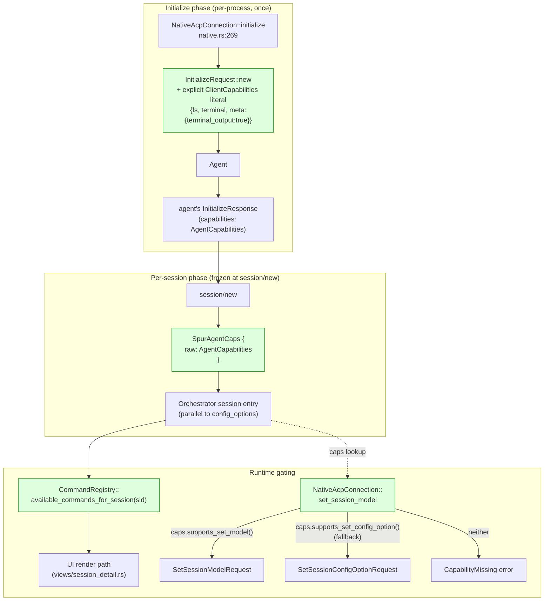

# Capability-aware spur — M8 + M9 + M10 design

**Status:** design approved (MCTS-grounded), pending implementation plan
**Date:** 2026-04-27
**Owners:** Kevin Truong (kevin.truong.ds@gmail.com)
**Predecessor:** `2026-04-27-acp-first-arg-pickers-v2-design.md` — PR-2/PR-3 shipped; this spec supersedes that spec's PR-4 build sequence.
**Background:** the v2 spec's Appendix A compatibility matrix surfaced 5 gaps ranked above the originally-planned typed git-ref picker. After a 12-round MCTS evaluation (Round-1 first principles → Round-12 synthesis), this spec captures the staff-engineer recommendation: pivot to capability-aware initialization first, fold the original PR-4 in last.

---

## 1. Goal

Make spur-acp's relationship with each connected ACP agent **capability-driven instead of capability-blind**. Today spur:

- Sends `InitializeRequest::new(ProtocolVersion::LATEST)` with implicit SDK defaults — never builds a `ClientCapabilities` literal.
- Discards the agent's `InitializeResponse.capabilities` — never reads what the agent claims to support.
- Dispatches `set_config_option`, `set_session_mode`, etc. unconditionally, getting `method_not_found` errors on agents that don't implement them.

The fix is a small, explicit, frozen-per-session capability cache that the UI consults before rendering or dispatching. This single mechanism closes 4 of 6 user-felt issues from the v2 grounding pass:

1. **Codex terminal output recovery** — set `clientCapabilities.meta["terminal_output"]=true` so codex tunnels terminal data through tool-call meta, then fill the existing `adapter/codex.rs` stub to extract it.
2. **Gemini gateway auth** — set request `_meta["api-key"]` / `_meta["gateway"]` on `authenticate()`.
3. **`/model` and `/effort` graceful degradation** — gate UI on advertised capability instead of dispatching and watching it 404.
4. **`set_model` proper wiring** — dispatch `SetSessionModelRequest` (the dedicated method) when advertised; fall back to `set_session_config_option` only when the agent advertises only the legacy method.

Three sequenced pieces:
- **M8** — `SpurAgentCaps` cache + explicit `ClientCapabilities` literal + `set_session_model` method + auth `_meta` plumbing
- **M9** — fill `adapter/codex.rs` for terminal tunneling + new `adapter/opencode.rs` for `rawOutput`
- **M10** — typed `GitRefQuerySource` (renames v2 PR-4); gated on M8 + M9 + codex-acp upstream Track-1 merge

## 2. Non-goals

- Dynamic mid-session capability renegotiation. ACP 0.12 has no protocol affordance for it. If a future protocol revision adds one, the cache becomes mutable; for now it's frozen at session-create.
- Probing capabilities by sending speculative RPCs. Capability inspection is wire-discovered from `InitializeResponse`, not behaviorally inferred.
- A "feature flag" abstraction layer. The SDK already gives us `AgentCapabilities`; spur newtype-wraps it for stability, no more.
- Forking the SDK. SDK 0.11.1's `ClientCapabilities` is `#[non_exhaustive]` but constructible via `Default::default()` + field assignment.
- Surfacing capability mismatches as user-visible diagnostics in M8. Greyed-out widgets with hover hints suffice; full UX work deferred.
- Rewriting the auth dialog UI. M8.5 ships a minimal request-`_meta` plumbing; full auth UX is a separate spec.

## 3. Background

Three sources ground this spec:

1. **v2 spec Appendix A — compatibility matrix.** Per-agent walk of every ACP RPC and notification variant; identifies the 5 cross-agent gaps and 3 incompatible terminal representations.
2. **v2 spec Appendix B — grounding sources.** File:line citations for every spur-side claim and source URLs for each upstream agent.
3. **MCTS evaluation (12 rounds, sequentialthinking).** Expanded 15 candidate moves (M1-M15), pruned via 7-axis scoring (user-felt impact, first-principles alignment, reversibility, complexity, compounding value, time-to-payoff, test-vs-prod drift). M8 dominates.

The control-plane axiom (mechanism in spur, policy at agent edge / on the wire) is the meta-principle; capability awareness is its concrete manifestation in the initialization phase.

## 4. Design decisions (Q1-Q6)

| # | Question | Choice |
|---|---|---|
| Q1 | Where does `SpurAgentCaps` live? | On the orchestrator session entry, parallel to `config_options`. **Not** on `AgentConnection` (transport shouldn't carry session state). UI reads via the same `OrchestratorClient` it already uses for `config_options`. |
| Q2 | Newtype-wrap `AgentCapabilities` or expose it directly? | **Newtype.** Gives spur a stable internal API even if the SDK reorganizes. Cost is trivial wrapper functions. |
| Q3 | How does the UI gate? | **Filter at the registry boundary.** `CommandRegistry::available_commands_for_session(sid)` consults capabilities and omits commands the session can't execute. UI just renders what comes back. Aligns with v2's "registry IS the binding table" thesis. |
| Q4 | `set_model` fallback strategy: try-and-see (runtime probe) or capability-gated (deterministic)? | **State-gated.** `AgentCapabilities` does NOT advertise `session/set_model` / `set_mode` / `set_config_option` as bool flags in 0.12.0 (these are protocol-stable methods). Spur derives support from the `NewSessionResponse` payload: non-empty `modes` ⇒ `set_mode` usable; `Some(models)` ⇒ `set_model` usable; non-empty `config_options` ⇒ `set_config_option` usable. Fall back from `set_model` to `set_config_option` only if `models` is None and `config_options` includes a model knob. No runtime probes. |
| Q5 | Where do `_meta` setters live (request side)? | `NativeAcpConnection::authenticate(method_id, meta: Option<serde_json::Value>)` extends signature; UI auth dialog plumbs it through. Symmetric with how spur reads inbound `_meta` in `adapter/claude.rs:174`. |
| Q6 | What happens when capabilities arrive late? | Initialize and session-create complete before any user-facing RPC; spur already awaits both. UI gates render with `caps = None` only between session/new submission and response, ~100ms; render disabled state during that window. |

The Q1-Q6 decisions follow from one meta-principle: **capability discovery is wire-truth; capability assumption is a bug**.

## 5. Architecture

### 5.1 Data flow



Green nodes are M8's net-new code surface.

### 5.2 Touchpoints (4 layers; smallest possible diff)

1. **`crates/spur-acp/src/spur_agent_caps.rs`** *(new)* — newtype `SpurAgentCaps { raw: AgentCapabilities }` + read accessors. ~80 LOC.
2. **`crates/spur-acp/src/connection/native.rs`** — extend `initialize` to build explicit `ClientCapabilities` literal; capture `InitializeResponse.capabilities`; new `set_session_model` method with capability-gated fallback; extend `authenticate` signature to accept `Option<serde_json::Value>` request meta. ~120 LOC delta.
3. **`crates/spur-core/src/orchestrator.rs`** — store `SpurAgentCaps` in session entry; getter for spur-tui consumption. ~40 LOC delta.
4. **`crates/spur-tui/src/commands/registry.rs`** — `available_commands_for_session(sid)` filter; gates `/model`, `/effort`, `/mode` on capability presence. ~50 LOC delta.
5. **`crates/spur-tui/src/views/session_detail.rs`** — render greyed-out hint for capability-gated unavailable commands. ~30 LOC delta.

Total M8: ~320 LOC delta + tests.

### 5.3 What M8 does NOT touch

| Layer | Reason |
|---|---|
| `Cargo.toml` | No new deps. SDK already provides `AgentCapabilities`. |
| `crates/spur-tui/src/components/` | Picker components unchanged; only the registry filter feeds them. |
| `crates/spur-acp/src/adapter/{claude,codex,kiro}.rs` | M9 territory; M8 doesn't fill the codex stub. |
| `crates/spur-tui/src/commands/spur_local.rs` | Spur-local meta commands unchanged. |
| **v1 `ConfigOptionQuerySource`** | Reused unchanged for `set_config_option` fallback path. |

## 6. Types & signatures

### 6.1 `spur-acp` capability newtype

The cache wraps **two** wire facts: (a) the agent's `AgentCapabilities` from `InitializeResponse` (announces protocol features like `load_session`, prompt/mcp capabilities, list/fork/resume, `_meta` extensions) and (b) the `NewSessionResponse`'s `modes` / `models` / `config_options` fields. The latter are required because **the SDK 0.12.0 schema does not advertise `session/set_mode` / `session/set_model` / `session/set_config_option` as bool flags on `AgentCapabilities`** — these methods are protocol-stable, and the only reliable signal that a given session can use them is whether the agent populated the corresponding state in the session-create response.

```rust
// crates/spur-acp/src/spur_agent_caps.rs (NEW)

use agent_client_protocol::{
    AgentCapabilities, NewSessionResponse, SessionConfigOption, SessionModelState, SessionModeState,
};
use serde_json::Value;

/// What the agent told us during `initialize` + `session/new`. Captured ONCE
/// per session at session-create and frozen for the session lifetime.
/// Mid-session capability changes are not in ACP 0.12; if a future protocol
/// revision adds them, the cache becomes mutable.
#[derive(Debug, Clone)]
pub struct SpurAgentCaps {
    /// The verbatim `AgentCapabilities` from `InitializeResponse`. Don't
    /// re-derive its fields — read them. Future protocol additions land here
    /// for free.
    pub agent: AgentCapabilities,
    /// The `modes` slot from `NewSessionResponse` (or `LoadSessionResponse`).
    /// `Some(state)` with non-empty `available_modes` ⇒ `session/set_mode`
    /// is usable. `None` or empty ⇒ no modes to switch between.
    pub modes: Option<SessionModeState>,
    /// The `models` slot. `Some(_)` ⇒ `session/set_model` is usable.
    pub models: Option<SessionModelState>,
    /// The `configOptions` slot. Non-empty ⇒ `session/set_config_option` is usable.
    pub config_options: Vec<SessionConfigOption>,
}

impl SpurAgentCaps {
    /// Build from the two relevant responses. `new_session` may be either the
    /// `NewSessionResponse` (fresh session) or `LoadSessionResponse` (replay).
    pub fn new(initialize: &agent_client_protocol::InitializeResponse, new_session: &NewSessionResponse) -> Self {
        Self {
            agent: initialize.agent_capabilities.clone(),
            modes: new_session.modes.clone(),
            models: new_session.models.clone(),
            config_options: new_session.config_options.clone().unwrap_or_default(),
        }
    }

    /// `session/set_mode` is usable when the session has modes to switch between.
    pub fn supports_set_mode(&self) -> bool {
        self.modes.as_ref().is_some_and(|m| !m.available_modes.is_empty())
    }

    /// `session/set_model` is usable when the session has any model state.
    pub fn supports_set_model(&self) -> bool {
        self.models.is_some()
    }

    /// `session/set_config_option` is usable when the session advertises
    /// non-empty config_options.
    pub fn supports_set_config_option(&self) -> bool {
        !self.config_options.is_empty()
    }

    /// `session/load` is announced explicitly on `AgentCapabilities`.
    pub fn supports_load_session(&self) -> bool { self.agent.load_session }

    /// Probe vendor `_meta` extension key (e.g. `"terminal_output"`).
    /// Returns false for missing keys, non-bool values, or absent meta.
    pub fn meta_capability(&self, key: &str) -> bool {
        self.agent.meta.as_ref()
            .and_then(|m| m.get(key))
            .and_then(Value::as_bool)
            .unwrap_or(false)
    }
}
```

Why the SDK doesn't gate set_* on `AgentCapabilities`: per ACP 0.12.0, these methods are stable and all conformant agents must implement them. In practice, agents that don't populate the corresponding state fields (e.g. gemini-cli emits `models` but `configOptions: None`) signal "nothing to set" via empty state — exactly what the UI needs to gate on. **Don't probe-and-cache method-not-found**; the wire signal is the populated state.

### 6.2 `spur-acp` initialize extension

The SDK 0.12.0 `ClientCapabilities` is `#[non_exhaustive]` with a builder. `terminal` is `bool` (not a struct). `fs` is `FileSystemCapabilities` (note the full name; not `FsCapabilities`).

```rust
// crates/spur-acp/src/connection/native.rs::initialize (extended)

use agent_client_protocol::{ClientCapabilities, FileSystemCapabilities};
use serde_json::json;

let caps = ClientCapabilities::new()
    .fs(FileSystemCapabilities::new()
        .read_text_file(true)
        .write_text_file(true))
    .terminal(true)  // bool — declares spur supports all `terminal/*` RPCs
    .meta(json!({
        "terminal_output": true,  // unlocks codex's tool-call.meta tunneling
    }));

let req = InitializeRequest::new(ProtocolVersion::LATEST)
    .client_capabilities(caps);

let init_response = self.client.initialize(req).await?;
// `SpurAgentCaps` is built later in `session/new` once we have both responses.
```

The cache is constructed *after* `session/new` (or `session/load`) returns — see §6.1 — because it needs the response's `modes` / `models` / `config_options` to compute `supports_set_*`.

### 6.3 `set_session_model` with state-derived fallback

ACP 0.12.0 stabilized `session/set_model` as the canonical method (see SDK constant `SESSION_SET_MODEL_METHOD_NAME = "session/set_model"`). Older agents that only emit a `models` slot but no `configOptions` (gemini-cli, kimi) get the dedicated method directly. Agents that only populate `configOptions` for the model knob (codex 0.12) take the fallback path. The decision is **driven by the session's advertised state**, not by trial-and-error.

```rust
// crates/spur-acp/src/connection/native.rs (NEW method)

pub async fn set_session_model(
    &self,
    session_id: SessionId,
    model_id: ModelId,
) -> Result<(), AcpError> {
    let caps = self.spur_agent_caps(&session_id)?;

    if caps.supports_set_model() {
        // Agent populated `models` in session/new — use the dedicated method.
        self.client
            .set_session_model(SetSessionModelRequest::new(session_id, model_id))
            .await
    } else if caps.supports_set_config_option() {
        // Agent populated `configOptions` instead — switch model via the
        // generic config-option channel (codex 0.12 pattern).
        self.set_session_config_option(
            session_id,
            ConfigId::model(),
            Value::ValueId(model_id),
        )
        .await
    } else {
        // Neither advertised — agent doesn't expose model switching.
        Err(AcpError::CapabilityMissing("set_model"))
    }
}
```

The fallback is a **deterministic compile-time decision per session** based on the session-create response, not a runtime "try A, on error try B" probe.

### 6.4 `authenticate` extension for request `_meta`

```rust
// crates/spur-acp/src/connection/native.rs::authenticate (signature change)

pub async fn authenticate(
    &self,
    method_id: AuthMethodId,
    meta: Option<serde_json::Value>,  // NEW
) -> Result<(), AcpError> {
    let mut req = AuthenticateRequest::new(method_id);
    if let Some(m) = meta {
        req = req.meta(m);
    }
    self.client.authenticate(req).await
}
```

UI auth dialog passes `Some(json!({"api-key": user_input}))` for gemini's USE_GEMINI method, `Some(json!({"gateway": {...}}))` for the gateway method, etc.

### 6.5 Registry filter

```rust
// crates/spur-tui/src/commands/registry.rs (NEW method)

impl CommandRegistry {
    /// Return the commands available for this session, filtered by the
    /// session's advertised capabilities. Commands that require an
    /// unsupported RPC are omitted.
    pub fn available_commands_for_session(
        &self,
        sid: &SessionId,
        caps: &SpurAgentCaps,
    ) -> Vec<&CommandEntry> {
        self.entries_for_session(sid)
            .filter(|e| match e.dispatch {
                Dispatch::SetSessionModel { .. } => caps.supports_set_model() || caps.supports_set_config_option(),
                Dispatch::SetSessionMode { .. } => caps.supports_set_mode(),
                Dispatch::SetConfigOption { .. } => caps.supports_set_config_option(),
                Dispatch::PromptText { .. } => true,
                // ... per-dispatch capability gating
            })
            .collect()
    }
}
```

## 7. Wire path examples

### 7.1 Codex terminal output recovery (M8 + M9)

```
1. spur-acp initialize sends ClientCapabilities{ meta:{"terminal_output":true} }.
2. codex's InitializeResponse advertises its standard agentCapabilities.
3. session/new completes; SpurAgentCaps cached.
4. User runs a tool that triggers a terminal command.
5. codex emits ToolCallUpdate with tc.meta = {"terminal_info":{...}, "terminal_output":"$ ls\nfoo bar\n"}.
6. NativeAcpConnection broadcasts the SessionNotification (unchanged).
7. dispatch_session_update reaches the ToolCallUpdate arm.
8. Existing per-vendor adapter dispatch (adapter/codex.rs — STUB today, FILLED in M9)
   extracts tc.meta.terminal_* and pushes a TerminalSnapshot to the trace store.
9. spur-tui terminal viewer renders the snapshot.
```

Without M8, step 1 doesn't include the gate, so codex never tunnels in step 5. Without M9, step 8's adapter stub returns default and the data is lost.

### 7.2 Gemini-cli `/model` graceful degradation (M8 only)

```
1. spur-acp initialize → SpurAgentCaps { supports_set_config_option: false }.
2. session/new completes.
3. CommandRegistry::available_commands_for_session(gemini_session, caps) filters
   out the synthesized /model command because dispatch requires set_config_option.
4. UI renders the command palette without /model. Hover hint on grayed-out region:
   "model switching not supported by gemini-cli".
5. User cannot dispatch a 404 — the command isn't in the palette.
```

### 7.3 Claude `set_model` direct dispatch (M8 only)

```
1. spur-acp initialize → SpurAgentCaps { supports_set_model: true }.
2. User opens /model picker (rendered because caps allow it).
3. User picks "claude-sonnet-4-7".
4. NativeAcpConnection::set_session_model checks caps.supports_set_model() → true.
5. Dispatches SetSessionModelRequest directly. No round-trip via set_config_option.
6. Claude responds OK; emits subsequent ConfigOptionUpdate or current_mode_update push.
```

### 7.4 Gemini gateway auth (M8.5)

```
1. User opens auth dialog for gemini-cli session.
2. Picks "GATEWAY" method; UI captures base_url + headers.
3. UI calls authenticate(GATEWAY, Some(json!({"gateway":{"baseUrl":"...","headers":{...}}}))).
4. NativeAcpConnection::authenticate sets request meta.
5. Gemini reads request.meta.gateway, completes auth.
```

## 8. Error handling

| Class | Trigger | Catch site | Feedback |
|---|---|---|---|
| **C1** Agent advertises unknown capability | `agentCapabilities` has fields spur doesn't know | `SpurAgentCaps::new` | Stored verbatim in `raw`; ignored by spur. Forward-compatible. |
| **C2** Agent's InitializeResponse missing `capabilities` field | SDK's `Default::default()` returns falsy capabilities | `SpurAgentCaps::new` | Spur treats as "no capabilities" — all features disabled in UI. Conservative degradation. |
| **C3** `set_model` dispatched but agent rejects with method-specific error | Capability advertised but RPC fails | `set_session_model` propagates | Standard error path; UI surfaces. |
| **C4** Race: capability lookup before initialize completes | Edge case during session/new | UI shows disabled state until caps populate (~100ms) | Visual loading state; not an error. |
| **C5** `_meta` parsing failure on `meta_capability(key)` probe | Agent emits non-bool value | `serde_json::Value::as_bool` returns None | Treat as `false`; conservative. |

## 9. Concurrency & cache lifetime

- **`SpurAgentCaps` is immutable** after `session/new` returns. Store as `Arc<SpurAgentCaps>` on the session entry; clone the Arc into UI consumers.
- **No locking on read.** UI threads read the Arc via the orchestrator's existing snapshot getter pattern (parallel to `config_options`).
- **Cleanup on session close.** Drop the Arc when session entry is removed.
- **No cross-session sharing.** Each session has its own Arc.

## 10. Testing strategy

### 10.1 Unit tests

| Component | Tests |
|---|---|
| `SpurAgentCaps::supports_*` | One test per accessor; covers raw field permutations including missing fields |
| `SpurAgentCaps::meta_capability` | Boolean true; non-bool value returns false; missing key returns false |
| `set_session_model` | Capability-gated dispatch: set_model present → SetSessionModelRequest; absent + set_config_option present → fallback; neither → CapabilityMissing |
| `CommandRegistry::available_commands_for_session` | Per-dispatch gating: SetConfigOption only emitted if cap; SetSessionModel only if either cap |

### 10.2 Integration tests

| Scenario | Fixture |
|---|---|
| Codex session with terminal_output=true gate | New `crates/spur-acp/tests/data/codex_initialize_with_terminal_meta.json` |
| Claude session advertising unstable_setSessionModel | New `claude_initialize_unstable_setmodel.json` fixture |
| Gemini session with no set_config_option | New `gemini_initialize_no_setconfig.json` fixture |
| Auth with request `_meta` | Mock SDK call asserting request.meta == Some(json!({"api-key":"X"})) |

### 10.3 Wire fixtures to capture (M8 prerequisite)

Spur should ship reproducible captures of each agent's `InitializeResponse`. Today only codex 0.12 has a fixture (`codex_acp_0_12_new_session_response.json`). M8 plan should add wire probes for claude-code-acp, gemini-cli, kimi-cli (per Appendix A.4 of v2 spec).

### 10.4 Verification commands

```sh
cargo test -p spur-acp spur_agent_caps
cargo test -p spur-acp connection::native::set_session_model
cargo test -p spur-tui commands::registry::available_commands_for_session
cargo test --workspace
cargo clippy --workspace -- -D warnings
cargo fmt --check
```

## 11. Build sequence (replaces v2 §12 PR-4)

| Phase | Scope | Gate | LOC | Estimate |
|---|---|---|---|---|
| **M8.A** | `SpurAgentCaps` newtype + cache + initialize literal | none | ~150 | 1 wk |
| **M8.B** | `set_session_model` + capability-gated fallback | M8.A | ~80 | 0.5 wk |
| **M8.C** | Registry filter + UI gating | M8.A | ~80 | 0.5 wk |
| **M8.D** *(stretch)* | `authenticate` `_meta` plumbing | M8.A | ~50 | 0.5 wk |
| **M8.E** | `SessionInfoUpdate` arm (bundle) | M8.A | ~10 | 0.1 wk |
| **M9** | Fill `adapter/codex.rs` for `meta.terminal_*`; new `adapter/opencode.rs` for `rawOutput` | M8.A capability advertised; M8.E session_info handling | ~200 | 2 wk |
| **M10** | Typed `GitRefQuerySource` + `_meta` parser branch (renames v2 PR-4) | M9 + codex-acp Track-1 PR merged upstream | ~150 | gated |

**Critical path:** M8.A → M8.B → M8.C → M9 → M10. M8.D and M8.E are independent and can land in any order alongside M8.A-C.

## 12. Open questions

1. ~~Does the SDK 0.11.1's `ClientCapabilities` builder API allow field-by-field construction or require the SDK's typed `Default::default()` mutation pattern?~~ **Resolved (Wave 0).** SDK has builder pattern: `ClientCapabilities::new().fs(...).terminal(true).meta(...)`. `terminal` is `bool`, not a struct. Type is `FileSystemCapabilities`, not `FsCapabilities`. See §6.2 for the verified shape.
2. ~~Does `unstable_setSessionModel` resolve to `set_session_model` in the SDK transport layer?~~ **Resolved (Wave 0).** SDK 0.12.0 stabilized the method as `"session/set_model"` (`SESSION_SET_MODEL_METHOD_NAME`). `SetSessionModelRequest` is canonical. **However**, the SDK does NOT advertise `session/set_*` as bool flags on `AgentCapabilities` — these are protocol-stable methods with no capability gating field. Spur derives support from session state (see §4 Q4 + §6.1).
3. **Is `SessionInfoUpdate` worth a dedicated handler beyond the catch-all log fix?** Still pending. Probe codex 0.12 for what fields it actually sets. Action: extend `codex_0_12_wire_probe.rs` to capture a multi-turn session and inspect during M8.E.
4. **Should the UI's greyed-out hint be a tooltip, a footer line, or a popup?** UX call deferred to implementation. Default: tooltip on hover; footer hint when no command is hovered.

## 13. Future work (deferred)

- **Mid-session capability renegotiation.** Add when ACP protocol surfaces it.
- **Capability-aware feature flags.** A spur-side feature-gate that lights up only if the connected agent supports it. Pattern emerges naturally from registry filtering; no new abstraction needed.
- **Auth dialog UX rework.** M8.D ships minimal `_meta` plumbing; full UX for gemini gateway / kimi terminal-auth is a separate spec.
- **MCP server picker.** Unchanged from v2 §14.
- **Generic `Choice` typed hint.** Unchanged from v2 §14.

---

## Appendix A — MCTS evaluation rounds (summary)

The 12-round sequentialthinking trace evaluated 15 candidate moves and pruned via 7-axis scoring. Top 5:

| Move | Score | Verdict |
|---|---|---|
| **M8** (CAI + set_model + auth `_meta`) | 33+M7 = ~36/35 | **selected** |
| M3 (CAI alone) | 33/35 | dominated by M8 |
| M7 (set_model alone) | 28/35 | included in M8 |
| M4 (adapter pipeline) | 27/35 | becomes M9, gated on M8 |
| M1 (PR-4 with mock `_meta`) | 16/35 | becomes M10, gated on M9 + upstream |

Pruned (low score or null move): M2 (block PR-4), M5 (wait for upstream), M6 (file issues only), M11 (upstream-only), M12 (mid-session caps — YAGNI), M13 (test agent — bundle into M8), M14 (SDK fork — unnecessary), M15 (move adapters — couples renderer to schema).

## Appendix B — Cross-references

- v2 spec: `2026-04-27-acp-first-arg-pickers-v2-design.md`
- v2 plan (executed): `2026-04-27-acp-arg-pickers-v2-pr2-pr3.md`
- Compat matrix: v2 spec Appendix A
- Grounding sources: v2 spec Appendix B
- MCTS dispatch log: v2 spec Appendix B.4
