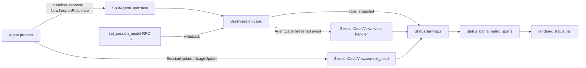

# Agent Model + Effort + Usage Surface — design

**Status:** design approved (dual review: codex + gemini, both APPROVE-WITH-AMENDMENTS, applied 2026-04-28), pending plan
**Date:** 2026-04-28
**Owner:** Kevin Truong (kevin.truong.ds@gmail.com)
**Predecessors:**
- `2026-04-27-acp-capability-aware-spur-design.md` — M8 SpurAgentCaps cache shipped
- `2026-04-27-spur-acp-capability-aware-m8.md` — M8 + M9 Bundle 1+2 plan executed; merged at `5cd1474b`
- `2026-04-27-m9-spur-acp-followups.md` — three M9 fast-follows; this spec consumes Item 1 (status surface) and adds usage parity

**Background:** M8 wired capability-driven initialize + dispatch. M9 hoisted `SessionInfoCache` to `BrainSession` and added `dispatch_set_session_model` + `Action::SetSessionModel`. The data is on `BrainSession.spur_agent_caps`; the TUI doesn't display it. User observation 2026-04-28: *"claude-code still doesn't see the usage/model/effort"* — confirmed by codex-grounded review (`crates/spur-tui/src/components/status_bar.rs:96-123`): no model/effort segments. Slash picker is the only current visibility.

**Wiring gap discovered during dual review** (`session_detail.rs:709`): `SessionDetailView::set_spur_agent_caps()` setter exists, but **NO production caller invokes it** — only the test at `crates/spur-tui/tests/session_detail_caps_filter.rs:59`. Caps live on `BrainSession.spur_agent_caps` (orchestrator side) but never reach `SessionDetailView`, so today every render reads `caps == None`. M10.1 must close this gap as Wave 0.

---

## 1. Goal

Surface the active **model**, **effort**, and **usage** of every spur-managed ACP session in the always-visible TUI status bar, with the same data that already arrives via M8/M9 plumbing — no new wire formats. After this work:

- Users see `model: gpt-5-codex effort: medium ctx 47%` in the status bar across codex, claude-code-acp, gemini-acp.
- `/model` and `/effort` slash commands update the status bar within one frame of the agent acknowledging.
- Legacy stream-json (`claude_events.rs`) gains `usage` parity with native `UsageUpdate` so non-ACP claude-code also surfaces token counts.

## 2. Non-goals

- **No new ACP wire variants.** Status segments read from `BrainSession.caps` + existing `SessionUpdate::UsageUpdate`. If an agent doesn't emit, the segment is hidden.
- **No upstream patches to `claude-code-acp`.** Native claude-code-acp emits no `UsageUpdate` — the usage segment for those sessions is documented as blank with a `--%` placeholder, not synthesized.
- **No mid-session capability renegotiation.** Caps are still frozen at session-create per M8 §2.
- **No UI dialog work.** Auth `_meta` UX is a separate spec (M9 Bundle 3 backlog).
- **No persistence of model history.** The status bar reflects the live current state; the cost trace already records per-turn cost separately.

## 3. Background — what exists post-M9 (`5cd1474b`)

Concrete ground (file:line on main as of merge commit):

| Producer (data source) | Consumer slot | Status |
|---|---|---|
| `InitializeResponse + NewSessionResponse` → `SpurAgentCaps::new` | `BrainSession.caps: Arc<SpurAgentCaps>` | ✅ M8 |
| `SpurAgentCaps.models.current_model_id` | unused | ❌ NEW (this spec) |
| `SpurAgentCaps.config_options[id="reasoning_effort"].value` | unused (only used to synthesize `/effort` slash entry; `crates/spur-acp/src/adapter/config_options.rs:46-49`) | ❌ NEW (this spec) |
| `SessionUpdate::UsageUpdate` → `SessionDetailView.context_used / context_size` | `StatusBarProps.context_used / context_size` → `usage_text` | ✅ pre-M8 |
| `SessionUpdate::CurrentModeUpdate` → `SessionDetailView.current_mode` | `StatusBarProps.current_mode` → `mode_text` | ✅ pre-M8 |
| `SetSessionModelRequest` Ok response → `BrainSession.caps.models.current_model_id` | unused (current code drops the wire response per `connection/native.rs:677-679` comment) | ❌ NEW (this spec) |
| `SetSessionConfigOptionRequest` Ok response → `BrainSession.caps.config_options` | unused (same drop pattern) | ❌ NEW (this spec, scoped to `effort`) |
| `claude_events.rs::ResultEvent` `usage` field | n/a — field doesn't exist on the struct (`crates/spur-acp/src/protocol/claude_events.rs:73-81`) | ❌ NEW (this spec) |

The five ❌ rows above are the work scope.

## 4. User-felt problem

When a user is inside `SessionDetailView`:

- They cannot tell which model is active without typing `/model`.
- They cannot tell which effort tier codex is on without typing `/effort`.
- After `/model gpt-5-codex` they see no confirmation in the status bar — only the next agent message reveals the change took effect.
- For native claude-code-acp sessions, usage% is silently blank (no upstream emit) — looks indistinguishable from a stalled session.

## 5. Design

### 5.1 Data plumbing (one new field, no protocol schema changes)

`SpurAgentCaps` already carries `agent` / `modes` / `models` / `config_options`. Add one new field — `agent_kind: AgentKind` — populated at construction site from the existing `AgentConfig.kind` (`crates/spur-acp/src/types.rs:163-177` defines `AgentKind { ClaudeStreamJson, ClaudeCodeAcp, CodexAcp, Kiro, Generic }`). This adds the agent identity needed for transport-aware policy without coupling `SpurAgentCaps` to `AgentConfig`.

```rust
pub struct SpurAgentCaps {
    pub agent: AgentCapabilities,
    pub modes: Option<SessionModeState>,
    pub models: Option<SessionModelState>,
    pub config_options: Vec<SessionConfigOption>,
    /// NEW: agent identity, propagated from `AgentConfig.kind`. Drives
    /// transport-aware policy (e.g. `usage_supported`) without leaking
    /// `AgentConfig` into the caps cache.
    pub agent_kind: AgentKind,
}
```

Add three lightweight accessors:

```rust
impl SpurAgentCaps {
    /// Display label for the active model. Resolves
    /// `models.current_model_id` (required ModelId per SDK
    /// `agent.rs:3256`) against `available_models[*].name`. Falls back
    /// to the raw id string if no `ModelInfo` entry matches. `None`
    /// when `models` is `None` (claude-code-acp may report `None`
    /// per SDK schema).
    pub fn current_model_label(&self) -> Option<String> {
        let m = self.models.as_ref()?;
        Some(
            m.available_models
                .iter()
                .find(|info| info.model_id == m.current_model_id)
                .map(|info| info.name.clone())
                .unwrap_or_else(|| m.current_model_id.0.to_string()),
        )
    }

    /// Display label for the active reasoning effort. Reads
    /// `config_options.iter().find(|o| o.id.0 == "reasoning_effort").value`
    /// and resolves to `Select.options[*].name` if the option is a Select.
    /// `None` when no `reasoning_effort` option is advertised
    /// (e.g. claude-code-acp).
    pub fn current_effort_label(&self) -> Option<String> { ... }

    /// Whether this agent is expected to emit `SessionUpdate::UsageUpdate`.
    /// Default `true`; explicit `false` only for `AgentKind::ClaudeCodeAcp`
    /// (verified upstream-blocked, see §3). Lives in
    /// `crates/spur-acp/src/agent_quirks.rs` to keep the core protocol
    /// module quirk-free.
    pub fn usage_supported(&self) -> bool {
        crate::agent_quirks::usage_emit_default(self.agent_kind)
    }
}
```

The `agent_quirks` module isolates per-agent allow/deny decisions from the protocol-pure `spur_agent_caps.rs` and `connection/native.rs` modules. New agent quirks land in `agent_quirks.rs`; protocol code stays generic.

### 5.2 Caps delivery and writeback

**Two distinct flows: (a) initial caps delivery to TUI, and (b) caps mutation on `/model`.**

#### 5.2.a — Initial delivery (M10.1 Wave 0)

Today `BrainSession.spur_agent_caps = Some(caps)` is set at `crates/spur-core/src/orchestrator.rs:292`, but the `SpurEventBody::AgentSessionReady` event (`crates/spur-acp/src/domain/events.rs:355-366`) does NOT carry caps. `SessionDetailView::set_spur_agent_caps()` exists (`session_detail.rs:709`) but is never called from production. Result: TUI's caps snapshot is always `None`.

Fix: extend `SpurEventBody::AgentSessionReady` payload with one field:

```rust
AgentSessionReady {
    session: SessionId,
    acp_session_id: String,
    brain: String,
    resumed: bool,
    cancel_mode: CancelMode,
    fs_unsafe: bool,
    /// NEW: caps snapshot at session-create. None for resumed-pre-M9
    /// sessions per M8 §F-3 permissive fallback.
    caps: Option<Arc<SpurAgentCaps>>,
}
```

TUI's `AgentSessionReady` handler at `crates/spur-tui/src/app.rs:1363` calls `view.set_spur_agent_caps(caps)`. Backwards-compatible (Option). Aligns with the existing event semantics ("session is ready, here's everything you need").

#### 5.2.b — Mutation writeback (M10.2)

On Ok response to `set_session_model`, the orchestrator clones-and-replaces `brain.spur_agent_caps`, then emits a NEW dedicated event:

```rust
/// Emitted when `BrainSession.spur_agent_caps` mutates after initial
/// delivery (e.g. successful `/model` dispatch). Distinct from
/// `CommandRegistryDirty` (which is scoped to `config_options`
/// changes) — see dual-review verdict 2026-04-28.
SessionCapsUpdated {
    session: SessionId,
    /// New caps snapshot. Consumers replace their cached Arc.
    caps: Arc<SpurAgentCaps>,
}
```

Why a NEW event, not `CommandRegistryDirty` reuse: codex's review flagged `CommandRegistryDirty`'s payload is narrowly scoped to `config_options` (`crates/spur-acp/src/domain/events.rs:565`), and gemini's review flagged the semantic-debt risk if TUI later optimizes render to the palette domain.

For `/effort`: the existing `replace_session_config_options` path at `orchestrator.rs:2414` continues to fire `CommandRegistryDirty`. The TUI handler for `CommandRegistryDirty` already updates the command_registry; it gains one extra responsibility — re-pull `caps` from the brain when the event arrives — so effort label refreshes alongside the registry. (Effort lives in `caps.config_options`, which `replace_session_config_options` already mutates.)

#### 5.2.c — Mutability mechanism

`BrainSession.spur_agent_caps: Option<Arc<SpurAgentCaps>>` (existing pattern at `orchestrator.rs:292`). Helpers (`replace_session_config_options`, new `replace_session_model`) take `&mut BrainSession` — the orchestrator's existing serialization (single-threaded interactive loop, `orchestrator.rs:1934-2887`) guarantees atomicity. NOT `Arc<RwLock<>>`, NOT `arc_swap::ArcSwap` — both are unjustified given the actual access pattern.

### 5.3 Status bar render (with truncation per gemini amendment)

Extend `StatusBarProps`:

```rust
pub struct StatusBarProps<'a> {
    // ... existing fields ...
    pub current_model_label: Option<&'a str>,    // NEW
    pub current_effort_label: Option<&'a str>,   // NEW
    pub usage_supported: bool,                   // NEW (drives placeholder)
}
```

Caller (`SessionDetailView`) computes labels via `caps.current_model_label()` + `caps.current_effort_label()` once per render, passes &str.

Render order in `metric_spans`:
```
[mode] <model> · <effort> · ctx <pct>%   reviews   alerts   license   flags
```

Compact form (when narrow):
```
[mode] <model> · <effort> · <pct>%
```

**Truncation strategy (gemini amendment):**

Long model names like `claude-3-5-sonnet-20241022` (24 chars) blow out 80-col terminals. Add a `truncate_model_label(label: &str, available: u16) -> Cow<'_, str>` helper applied at render time:

1. Prefer the human-friendly `available_models[*].name` (e.g. "Sonnet 4.5", "GPT-5 Codex") returned by the agent — already what `current_model_label()` resolves first.
2. If still over budget, drop common prefixes (`claude-`, `gpt-`) and date suffixes (`-20241022`).
3. Cap at 14 chars; suffix `…` when truncated.

Hide each segment when `None`. When `usage_supported == true` but `context_used == None`, render `--%` (data not yet arrived; user knows the agent emits but hasn't yet). When `usage_supported == false`, hide the usage segment entirely (cleaner than persistent `--%`).

### 5.4 Legacy stream-json usage parity (raw `claude-code` adapter)

`claude_events.rs::ResultEvent` has `total_cost_usd` but no `usage` field. claude-code's actual stream-json output includes:

```json
{
  "type": "result",
  "subtype": "success",
  "usage": {
    "input_tokens": 12345,
    "output_tokens": 678,
    "cache_creation_input_tokens": 0,
    "cache_read_input_tokens": 11000
  },
  "total_cost_usd": 0.034,
  ...
}
```

Add:
```rust
pub struct ResultEvent {
    // existing fields ...
    pub usage: Option<UsageData>,
    pub model: Option<String>,  // already on SystemEvent, mirror here for end-of-turn
}

pub struct UsageData {
    pub input_tokens: u64,
    pub output_tokens: u64,
    pub cache_creation_input_tokens: Option<u64>,
    pub cache_read_input_tokens: Option<u64>,
}
```

In `stream_json_adapter`, on `ClaudeEvent::Result(r)`, emit a synthetic `SessionUpdate::UsageUpdate { context: total_input, max_context: <lookup> }` matching the schema already consumed by `SessionDetailView` (`session_detail.rs:62-67`).

**Model→max_context source-of-truth (gemini amendment):**

Centralize in `spur-cost`, NOT a hand-rolled const map in `claude_events.rs`. Add to `spur-cost` public API:

```rust
// crates/spur-cost/src/pricing.rs (or sibling module)
/// Returns the maximum context window in tokens for `model_name`, if known.
/// `None` for unknown models — caller may emit raw token count instead of %.
pub fn max_context_for(model_name: &str) -> Option<u64>;
```

Reasons:
- Single source of truth for model metadata across the workspace. `spur-cost` already tracks per-model pricing tiers; max_context is the same domain.
- Avoids divergent truths if a model's window changes (e.g. Anthropic 1M context tier).
- Keeps `claude_events.rs` focused on wire decoding, not policy.

Initial coverage (~10-15 models): claude-3-5-sonnet, claude-4-sonnet, claude-4-opus, claude-haiku-*, gpt-5, gpt-5-codex, gemini-2.x families. Unknown returns `None`; legacy stream-json emits raw `input_tokens` instead of percentage in that case.

### 5.5 Data flow diagram



## 6. Wave breakdown — three independent ship-points

Each ship-point is a self-contained PR; later ship-points depend on earlier merges but ship independently to `main`.

### M10.1 — Status Surface (~300 LOC)

Closes the wiring gap and adds always-visible model/effort/usage segments. **Ships ~80% of user-felt value alone.**

- **Wave 0 — Wiring gap fix**: extend `SpurEventBody::AgentSessionReady` payload with `caps: Option<Arc<SpurAgentCaps>>`. Update orchestrator emit site (`crates/spur-acp/src/connection/native.rs:1046-equivalent`) to populate. TUI handler at `app.rs:1363` calls `view.set_spur_agent_caps(caps)`. ~30 LOC.
- **Wave A — Caps extension**: add `agent_kind: AgentKind` field to `SpurAgentCaps`; populate at construction site from `AgentConfig.kind`. ~30 LOC.
- **Wave B — Quirks module**: new `crates/spur-acp/src/agent_quirks.rs` with `usage_emit_default(AgentKind) -> bool` (default true; explicit false for `ClaudeCodeAcp`). ~25 LOC + tests.
- **Wave C — Accessors**: `current_model_label()`, `current_effort_label()`, `usage_supported()` on `SpurAgentCaps`. ~80 LOC + unit tests.
- **Wave D — TUI render**: extend `StatusBarProps` with three new fields; thread from `SessionDetailView` snapshot via accessors; render new segments in `metric_spans`; truncation helper at boundary. ~120 LOC + render-golden tests.
- **Wave E — Polish**: `--%` placeholder + hide-when-unsupported behaviour; compact-form width tests at 60/100/160 col. ~30 LOC.

Inter-wave order: 0 → A → B → C (in parallel with B is fine since C imports B's quirks but trait shape is small) → D → E.

### M10.2 — Model Reactivity (~120 LOC)

Adds writeback for `/model` so the status bar re-renders within the event loop instead of staying stale until next session.

- **Wave A — New event variant**: `SpurEventBody::SessionCapsUpdated { session, caps }`. ~10 LOC.
- **Wave B — Orchestrator helper**: `replace_session_model(&mut self, brain: &mut BrainSession, new_model_id: ModelId)` clones `caps`, mutates `models.current_model_id`, swaps the Arc, emits `SessionCapsUpdated`. ~50 LOC + tests.
- **Wave C — Wire into dispatch**: `dispatch_set_session_model` Ok arm calls `replace_session_model` before returning. ~20 LOC + integration test.
- **Wave D — TUI handler**: `app.rs` handles `SessionCapsUpdated` by calling `view.set_spur_agent_caps(Some(caps))`. ~10 LOC + test.
- **Wave E — `replace_session_config_options` symmetry**: ensure existing `CommandRegistryDirty` handler in TUI also re-pulls caps from brain (effort label refresh). ~15 LOC + test.

### M10.3 — Legacy Stream-JSON Usage Parity (~150 LOC)

Independent of M10.1/M10.2 — could ship in any order.

- **Wave A — Schema extension**: `claude_events.rs::ResultEvent.usage: Option<UsageData>` + `model: Option<String>`. `UsageData { input_tokens, output_tokens, cache_creation_input_tokens?, cache_read_input_tokens? }`. ~30 LOC.
- **Wave B — `spur-cost::max_context_for(&str) -> Option<u64>`** API + 10-15 model entries. ~40 LOC + table tests.
- **Wave C — Synthetic emit**: `stream_json_adapter` on `ClaudeEvent::Result(r)` emits `SessionUpdate::UsageUpdate { context_used, context_size }` using `max_context_for(r.model)`. ~30 LOC.
- **Wave D — Fixture replay test**: round-trip a captured `result` event with usage through `stream_json_adapter`, assert `UsageUpdate` arrives. ~50 LOC.

### Ship sequence

`M10.1 → main → M10.2 → main → M10.3 → main`. M10.3 may ship in parallel with M10.2 (different files, no merge conflict expected).

## 7. Test strategy

- **Unit (`spur-acp`)**: `SpurAgentCaps::current_model_label` resolves model_id → name; missing entry falls through to raw id. `current_effort_label` resolves Select-typed option. `usage_supported` is true for codex / gemini-cli / kimi, false for claude-code-acp.
- **Unit (`spur-core`)**: `dispatch_set_session_model` Ok arm clones caps with new `current_model_id` and emits `AgentCapsRefreshed`. Error arm leaves caps untouched.
- **Integration (`spur-tui`)**: render-golden test for status bar with each combination — full / compact / `--%` placeholder / hidden-when-unsupported.
- **Wire fixture (`spur-acp`)**: stream-json `ResultEvent` with `usage` field deserializes correctly; synthetic `UsageUpdate` matches expected `context_used / context_size`.
- **Manual smoke (Bundle 4 of M9 backlog, deferred)**: live agents — codex, gemini-cli, claude-code-acp, raw `claude-code` — confirm segments populate.

## 8. Risks + mitigations

| Risk | Mitigation |
|---|---|
| `Arc<SpurAgentCaps>` clone-replace introduces TOCTOU between read sites and writeback | All read sites do single `caps.clone()` per render frame; writeback is rare (only on /model or /effort dispatch). Acceptable. |
| `usage_supported()` allow-list rots when new agents are added | Default to `true` (assume supported); only explicit deny for `AgentKind::ClaudeCodeAcp`. Quirks live in `agent_quirks.rs`, isolated from protocol-pure code. |
| Stream-json `usage` field shape evolves | Use `serde(default)` on all sub-fields; missing keys produce zeroed `Option<u64>`. |
| Status bar overflow on narrow terminals (gemini amendment) | `truncate_model_label()` helper applies prefix-strip + char cap. Compact form drops segment labels, keeps values. Render-golden tests at 60/100/160 col. |
| `SessionCapsUpdated` event miss between dispatch and render | Event uses existing broadcast funnel; backpressure is on the funnel, not on this signal. View also re-pulls fresh on every render frame as belt-and-suspenders. |
| `CommandRegistryDirty` initial emit fires before `SpurAgentCaps::new` (codex amendment) | Initial emit at `orchestrator.rs:3535` happens before caps construction. M10.1 Wave 0 fixes by carrying caps in `AgentSessionReady` instead — no race with the registry-dirty emit. |
| Cost calculation drifts when model changes mid-session (gemini amendment, future risk) | Out of scope for M10. Track as M11 follow-up: `replace_session_model` should also signal `spur-cost` to recompute pricing tier for the active session. |
| Codex-acp emits a second `SessionInfoUpdate`-equivalent after `set_session_model` and our writeback contradicts it | No evidence today (no fixture). If observed, agent-emitted notification wins by re-applying writeback semantics on receipt — same `SessionCapsUpdated` path. |

## 9. Out of scope / future work

- **Auth `_meta` UX dialog** (gemini-gateway / kimi-terminal-auth) — separate spec.
- **claude-code-acp upstream usage emit** — would require a PR to `@zed-industries/claude-code-acp` to start emitting `UsageUpdate`. Track separately.
- **Per-turn usage history sparkline** — already partly in cost trace; extending into status bar is a UX decision for later.
- **Modes display beyond `current_mode`** — cycling through available modes via picker is post-M10.
- **M11: cost-recompute on model change** (gemini amendment) — when `/model` changes the active model, `spur-cost`'s in-memory pricing tier must rebind to the new model. Today cost is computed against initial-model pricing; mid-session model swap silently breaks. Out of M10 scope; track as M11.
- **Centralized `agent_quirks.rs` graduation** — if agent_quirks accumulates >5 entries, promote to a registry abstraction (TOML-driven? per-agent crate?). Today it's just `usage_emit_default` — keep simple.

## 10. Implementation invariants (apply to all M10 ship-points)

- **I1**. `replace_session_*` helpers take `&mut BrainSession`. The orchestrator's single-threaded interactive loop (`orchestrator.rs:1934-2887`) serializes them; cross-process races require the attach lock (degraded `no-flock` mode disables — flag in code review).
- **I2**. `SessionModelState.current_model_id` is REQUIRED `ModelId` per SDK 0.11.1 (`agent.rs:3256`), NOT `Option<ModelId>`. Accessors use `models.as_ref()?.<...>`, never `Option::flatten`.
- **I3**. Caps writeback is skipped when `brain.spur_agent_caps == None` (resumed-session permissive case from M8 §F-3). Helpers return early without emitting `SessionCapsUpdated`.
- **I4**. `usage_supported()` defaults TRUE for unknown agents; only explicit `AgentKind::ClaudeCodeAcp` returns false. Adding new known agents extends `agent_quirks.rs` only when their behaviour deviates from default-true.
- **I5**. Allow-list lives in `crates/spur-acp/src/agent_quirks.rs`. `crates/spur-tui` MUST NOT contain agent-name strings; transport-aware policy is a spur-acp concern.

## 10. Acceptance

- Status bar in `SessionDetailView` for codex shows `[mode] gpt-5-codex · medium · ctx 47%`.
- Status bar for claude-code-acp shows `[mode] sonnet-4-5` (no usage segment, no effort segment).
- After `/model gpt-5` typed and submitted, status bar updates within one frame to show new model id, before the next agent message.
- Render-golden tests cover all 4 segment combinations.
- All `cargo test -p spur-{acp,core,tui}` passes (excluding pre-existing palette_rerank_bench_smoke timing flake).
