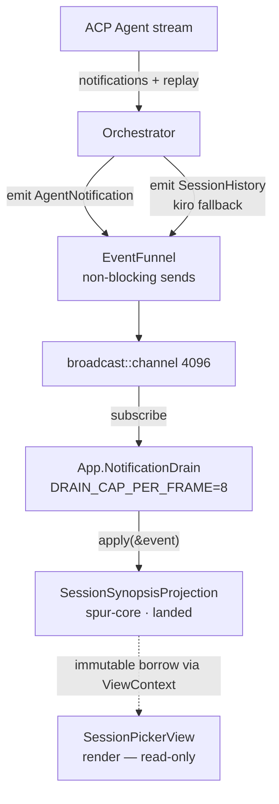
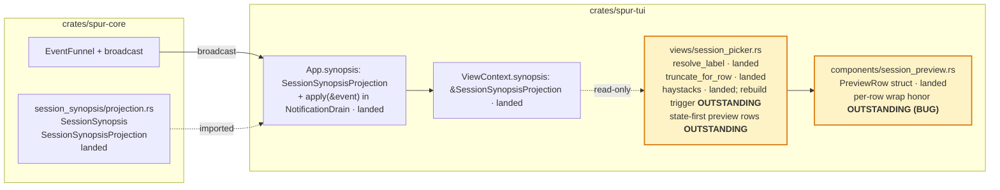

# Session Picker Recall Revamp — Design

Date: 2026-04-28 (revised 2026-04-29 post territory audit)
Status: Spec — remaining-work specification (core projection landed; render polish + two bugs outstanding)
Owner: TUI / Session UX
Scope: `spur-tui` render-side polish (preview composition, `PreviewRow.wrap` honor) + projection/picker bug fixes (haystack rebuild on synopsis update, `Lagged` resilience).
Pre-launch: SPUR has not shipped publicly; legacy session backfill is out of scope.

## Implementation status (as of 2026-04-29)

A four-reviewer map–territory audit (gemini, kimi, codex, Explore) found the
original "pre-implementation" framing was wrong: the core projection and most
plumbing have landed. Status:

| Item | Status | Location |
|---|---|---|
| `SessionSynopsisProjection` (data model + `apply` + `flush_pending` + `get`) | **Landed** | `crates/spur-core/src/session_synopsis/projection.rs:22,68,88` |
| Slash-command skip (live + history paths) | **Landed** | `projection.rs:125` (`first_non_slash`) |
| `ToolCallUpdate` flush trigger | **Landed** | `projection.rs:88` |
| `lib.rs` re-export of `SessionSynopsis` / `SessionSynopsisProjection` | **Landed** | `crates/spur-core/src/lib.rs:38` |
| App holds projection + applies on every event | **Landed** | `crates/spur-tui/src/app.rs:19, 332, 620, 2092` |
| `ViewContext.synopsis: &SessionSynopsisProjection` | **Landed** | `crates/spur-tui/src/views/mod.rs:135` |
| `resolve_label` with documented precedence | **Landed** | `crates/spur-tui/src/views/session_picker.rs:1218` |
| `truncate_for_row` | **Landed** | `session_picker.rs` (alongside `resolve_label`) |
| `PreviewRow { label, value, value_style, wrap }` + `From<(String,String)>` | **Landed (struct only)** | `crates/spur-tui/src/components/session_preview.rs:11-36` |
| `preview_height = 12` | **Landed** | `session_picker.rs:895` |
| `haystacks: Vec<String>` precomputed in `PickerState::Populated` | **Landed** (build path); see two bugs below | `session_picker.rs:101, 287` |
| **State-first preview composition** (last → draft → blank → first → blank → footer) | **Outstanding** | this spec |
| **`PreviewRow.wrap` honored by renderer** | **Outstanding (BUG)** | `session_preview.rs:56-88` ignores `row.wrap` and emits one `Line` per row |
| **Haystack rebuild on synopsis update** | **Outstanding (BUG)** | failing test at `session_picker.rs:2068` already documents the hole |
| **`Lagged` resilience for history replay** | **Outstanding** | producer side is non-blocking (`event_funnel.rs:34, 120`); future NDJSON replay closes |

Remaining specified scope: render-side polish + two bug fixes, ~80–120 LoC
across `session_picker.rs`, `session_preview.rs`, plus tests.

## Decided approach (post-codex stress-test, 2026-04-29)

After a five-pass review and L9 first-principles MCTS analysis (codex
stress-tested), both outstanding bugs converge on a single principle:

> **Compute derived view-state at the boundary that owns the budget.**
> Caches are correctness liabilities — only justify one with profiling
> evidence AND a written invalidation contract.

The fix is **deletion, not patching**:

- **Bug A (haystack stale)** → drop the haystack cache entirely.
  Compute haystacks on demand inside `filtered_indices`, which already
  fires per render (and twice when preview is visible). At ~500
  sessions × ~200 chars, on-demand cost is ~1–2ms per render — well
  under the 16ms frame budget. Eliminates the bug class: any future
  haystack input (cost, tags, brain id) is auto-fresh; rename-flow
  staleness (codex's wider-blast-radius finding) is fixed for free.

- **Bug B (`PreviewRow.wrap` dead)** → move wrap policy from data to
  picker. Replace `value: String + wrap: bool` with `value_lines:
  Vec<String>` (already-expanded). Add a `wrap_value(text, width,
  max_lines) -> Vec<String>` helper using both `unicode-segmentation`
  and `unicode-width` (mirror `input_bar_wrap.rs`). Renderer becomes
  dumb: `flat_map(build_lines_for_row).collect()` into `Paragraph` with
  no `.wrap(...)`. Delete the `wrap: bool` field.

Both changes also enable proper **visual-row accounting** — the picker
counts emitted `Line`s at compose time and validates against the
12-row preview budget. Today's silent clipping becomes a guaranteed
bound.

### Codex stress-test adjustments (locked-in)

1. **Per-render cost, not per-keystroke.** `filtered_indices` is called
   during render at `session_picker.rs:754–760` and again at `:970–976`
   when preview is visible. On-demand haystacks pay 1–2× per render.
2. **Free-function filter helper.** Reshape `filtered_indices` from
   `&self` method to a free function with signature
   `(sessions, pattern, &metadata, &synopsis, show_archived) -> Vec<usize>`
   to compose with split-borrow patterns at `handle_key:1349–1359`.
   Thread `&synopsis` through call sites that lack it today:
   `toggle_show_archived` (`:235–253`), App invocation
   (`app.rs:3010–3013`), `highlighted_session_id` (`:355–376`),
   `visible_session_count` / `visible_session_at` (`:498–532`).
3. **Width-aware wrapping.** `unicode-width` is already a TUI dep
   (`Cargo.toml:32–33`); `input_bar_wrap.rs:1–5, 100–105` is the
   canonical width-aware grapheme-walk pattern to mirror.
4. **Test inversion via App event pump.** The named test at
   `session_picker.rs:2068–2102` mutates a standalone projection and
   bypasses the App event path. Drive the inverted test through
   `App::handle_spur_event` (`app.rs:5573–5590`), or via the new
   synopsis-aware filter helper directly.

### Revised effort estimate

| Item | LoC |
|---|---|
| Drop cache + free-function `filtered_indices` + thread synopsis through call sites | ~50 |
| `wrap_value` helper (graphemes + width) + compose_preview rewrite | ~25 |
| Renderer simplification + delete `wrap` field | ~10 |
| Test inversion via App event pump (or synopsis-aware `visible_session_count`) | ~30 |
| New unit tests (`wrap_value` boundaries, on-demand fresh haystack) | ~30 |
| **Total** | **~145 LoC across 2 files + ~5 call-site updates in `app.rs`** |

### Beads

- `bd-evz7` — Epic: Session Picker Recall — derived-state simplification
- `bd-evz7.1` — Bug A: Drop haystack cache; compute on-demand
- `bd-evz7.2` — Bug B: Picker-owned wrap; dumb renderer; delete `PreviewRow.wrap`

### Architectural rule for `arch.md`

> **Compute derived view-state at the boundary that owns the budget.**
> When a view's display depends on data outside its event-handling
> surface, prefer per-render computation over cached state. Caches are
> correctness liabilities — only justify one with profiling evidence
> AND a written invalidation contract.

## Problem

The session picker (`crates/spur-tui/src/views/session_picker.rs`) lists
sessions by an agent-generated `title` (e.g. "Build fix"). These titles
carry weak semantic weight, so users returning to the picker struggle to
recall which session was about what. The current preview pane (toggled
with `P`) is dominated by administrative metadata that does not help recall.

The picker fails the canonical recall journey at two steps:

1. **Scan** — agent titles do not differentiate sessions in the same project.
2. **Probe** (press `P`) — preview surfaces admin metadata, not user intent
   or last activity.

## Goal

Replace weak agent-generated titles in the row with the user's first
message ("intent recall"), and invert the preview pane so the user's last
message and unsent draft ("state recall") become the dominant elements,
with metadata in a single muted footer.

The synopsis is a **derived projection** of the existing event stream —
matching `ExecutorLineage` and `PlanProjectionStore`. It holds no
persistent state of its own. For pre-launch this is acceptable; future
NDJSON replay (arch.md Tier 1 #2) rehydrates projections at startup.

## Non-goals

- No ACP protocol changes.
- No new event variants. Synopsis observes existing
  `SpurEventBody::AgentNotification` and `SpurEventBody::SessionHistory`.
- No new persistence file or `metadata.json` field.
- No AI-generated summaries.
- No legacy backfill, no NDJSON replay path.
- No mutation of `SessionMetadata` from the picker view.
- No 2nd-line snippet under the selected row (would break `visible_height`
  scroll math).

## Data tiers

| Tier | Source | Lifetime | Role in v1 |
|---|---|---|---|
| **Long-term** | ACP vendor session | Persistent in agent | On `load_session`, agent replays history → `AgentNotification(UserMessageChunk)` → projection |
| **Long-term (kiro fallback)** | `~/.kiro/sessions/cli/<id>.jsonl` | Persistent on disk | `load_brain_session` (`crates/spur-core/src/orchestrator.rs:2357`) reads from `read_session_history_from_disk` (`:4280`, returns `Vec<HistoryEntry>`) and emits `SpurEventBody::SessionHistory { session, entries }` → projection |
| **Mid-term** | `EventSink` NDJSON (128MB rotation) | Until rotation | Out of scope; future NDJSON replay populates projections at startup |
| **Short-term** | In-memory projection | Current TUI process | Authoritative for picker |

Sessions never observed in this TUI run, with no replay/live messages,
have no synopsis and fall through to the existing agent-title path. The
user can archive stale sessions via the existing `d` keybind.

## Decisions (locked)

| Question | Choice | Rationale |
|---|---|---|
| Where does enrichment go? | Hybrid: row label uses first-msg; preview pane carries last-msg + draft + first-msg | Row stays compact; preview becomes content-first |
| Data source | Live event projection (no persistence, no backfill) | Matches `ExecutorLineage` pattern |
| Row label precedence | `title_override` → first-msg → agent title → cwd | Manual rename wins; otherwise snippet beats agent auto-title |
| Per-row 2nd line for selected row | Rejected | Breaks `visible_height` math |
| Preview pane height | 12 rows when `P` is on (already in tree at `session_picker.rs:895`) | Fits last-msg + draft + first-msg + footer |
| Preview hierarchy | State on top (last-msg + draft), intent below (first-msg breadcrumb) | "Where I left off" is the dominant resume question |
| Projection crate | `spur-core` (types) + per-frontend instance | Mirrors `ExecutorLineage` and `PlanProjectionStore`, both `apply(&mut self, event: &SpurEvent)`; wired in `app.rs:19, 332, 620, 2092` |
| Truncation crate | TUI-side at render | Avoids adding `unicode-segmentation` dep to core |

## Architecture

### Data flow



The projection is a passive `apply(&mut self, event: &SpurEvent)` struct —
same shape as `ExecutorLineage::apply` (`spur-core/src/lineage/projection.rs:65`)
and `PlanProjectionStore::apply` (`spur-core/src/plan_projection/projection.rs:18`).
TUI's App holds an instance (`app.rs:332`) and feeds it from the existing
notification drain (`app.rs:2092`). No async tasks, no disk writes, no
broadcast subscription beyond what App already does.

### Component architecture



Files touched in remaining work:
- `crates/spur-tui/src/views/session_picker.rs` — state-first preview
  composition; trigger haystack rebuild on synopsis updates.
- `crates/spur-tui/src/components/session_preview.rs` — honor
  `PreviewRow.wrap` per row (currently ignored, see Risks).
- `crates/spur-core/src/session_synopsis/projection.rs` — only if the
  `Lagged` mitigation requires a per-session `Lagged` recovery path
  (see Risks); otherwise untouched.

Files already in tree (do NOT recreate):
- `crates/spur-core/src/session_synopsis/projection.rs` — landed.
- `crates/spur-core/src/lib.rs` — re-export landed.
- `crates/spur-tui/src/app.rs` — `synopsis` field + `apply` call landed.
- `crates/spur-tui/src/views/mod.rs` — `ViewContext.synopsis` landed.

`session_metadata.rs` is **untouched**.

## Data model (in `spur-core`)

The shape below documents the **landed** types in
`crates/spur-core/src/session_synopsis/projection.rs`. It is reproduced
here as a reference, not a build target.

```rust
// crates/spur-core/src/session_synopsis/projection.rs

use std::collections::HashMap;
use spur_acp::SessionId;

#[derive(Debug, Clone, Default)]
pub struct SessionSynopsis {
    /// First non-slash-command user message in this session, raw text.
    /// Truncation is applied at render time by consumers.
    pub first_user_msg: Option<String>,
    /// Most recent user message, raw text.
    pub last_user_msg: Option<String>,
}

#[derive(Debug, Default)]
pub struct SessionSynopsisProjection {
    by_session: HashMap<SessionId, SessionSynopsis>,
    /// Per-session pending-chunk accumulator. Buffered until a flush
    /// trigger fires (see "Accumulator state machine" below).
    pending: HashMap<SessionId, String>,
}

impl SessionSynopsisProjection {
    pub fn new() -> Self { Self::default() }

    /// Called by App's NotificationDrain for every SpurEvent.
    /// Mirrors `ExecutorLineage::apply` and `PlanProjectionStore::apply`.
    pub fn apply(&mut self, event: &spur_acp::SpurEvent) { /* landed */ }

    /// Read API for the picker. If a session has no committed synopsis
    /// but a non-empty pending buffer, returns a synthesized snapshot
    /// (commit-on-read fallback for abandoned turns); the pending fallback
    /// also applies the slash-command skip rule for `first_user_msg`.
    pub fn get(&self, id: &SessionId) -> Option<SessionSynopsis> { /* landed */ }
}
```

Storage rules (write-time):
- Empty / whitespace-only chunks are skipped.
- Messages whose first non-whitespace character is `/` are skipped from
  `first_user_msg` (commands like `/vim`, `/clear`). They still update
  `last_user_msg`.
- Raw text is stored without grapheme capping. Length-bounding the row
  label is a render-time concern; the projection trusts ACP's
  chunk sizing as a natural bound (chunk text is bounded by transport).

Cut from prior drafts:
- `last_msg_at` — redundant with `session.updated_at` (already shown as
  `relative_ts` in the row).
- `dirty_since_read` / `drain_dirty` — picker rebuilds haystacks
  targeted-per-session on synopsis-mutating events; no global
  dirty-flag plumbing.
- `backfilled_at` — no backfill in v1.

## Accumulator state machine

Multi-chunk user messages are reassembled into one logical message
before commit. The schema does not guarantee 1 chunk per message, even
though Claude Code's replay fixture shows that today.

```text
on event:
  match SpurEventBody:
    AgentNotification { session, notification }:
      match notification.update:
        UserMessageChunk(c):
          append c.text to pending[session]
        AgentMessageChunk | AgentThoughtChunk | ToolCall | ToolCallUpdate
          | Plan | AvailableCommandsUpdate | CurrentModeUpdate | ...:
          flush_pending(session)

    SessionHistory { session, entries }:
      // Kiro fallback path. entries: Vec<HistoryEntry { role, text }>.
      drop pending[session]  // history overrides any in-flight buffer
      let user_texts = entries.iter().filter(|e| e.role == "user").map(|e| e.text)
      let first_non_slash = user_texts.find(|t| !t.starts_with('/'))
      if let Some(first) = first_non_slash:
          if first_user_msg is None: set first_user_msg = first
      if let Some(last) = user_texts.last():
          set last_user_msg = last  // last_user_msg accepts slash commands

    TurnComplete { session }:
      flush_pending(session)

    BrainRetired { session, .. }
      | SessionCompleted { session, .. }
      | SessionAttachRejected { acp_session_id: session, .. }:
      flush_pending(session)

    _ : // ignore other variants

flush_pending(session):
  let buf = pending.remove(session).unwrap_or_default()
  let trimmed = buf.trim()
  if trimmed.is_empty(): return
  let s = by_session.entry(session).or_default()
  if !trimmed.starts_with('/') and s.first_user_msg.is_none():
      s.first_user_msg = Some(trimmed.to_owned())
  s.last_user_msg = Some(trimmed.to_owned())
```

**Commit-on-read fallback** (matches landed implementation in
`projection.rs:36–55`):

```text
get(id):
  let committed = by_session.get(id)
  let pending_trimmed = pending.get(id).map(trim).filter(non_empty)

  match (committed, pending_trimmed):
    (Some(c), _)        => Some(clone(c))           // committed wins
    (None, Some(p))     => Some(SessionSynopsis {
                             // slash-command skip applies to the fallback too
                             first_user_msg: if p.starts_with('/') { None }
                                             else { Some(p.to_owned()) },
                             last_user_msg:  Some(p.to_owned()),
                           })
    (None, None)        => None
```

This surfaces an abandoned pending buffer to the picker without
prematurely promoting it to the committed map (a later non-User event
will commit it properly via `flush_pending`). Differs from earlier
drafts: committed wins unconditionally when present, and the pending
fallback applies the slash-skip rule for `first_user_msg`.

## Row composition

`resolve_label` is **already implemented** at `session_picker.rs:1218` with
the precedence below. This section documents the locked behavior — no code
change is required for this section in the remaining-work scope.

```rust
fn resolve_label(
    session: &SessionInfo,
    entry: Option<&SessionEntry>,
    synopsis: Option<&SessionSynopsis>,
    show_cwd: bool,
    label_budget: usize,
) -> String {
    if let Some(t) = entry.and_then(|e| e.title_override.as_deref())
        .filter(|t| !t.is_empty())
    {
        return truncate_for_row(t, label_budget);
    }
    if let Some(snippet) = synopsis
        .and_then(|s| s.first_user_msg.as_deref())
        .filter(|s| !s.is_empty())
    {
        return truncate_for_row(snippet, label_budget);
    }
    if let Some(t) = session.title.as_deref().filter(|t| !t.is_empty()) {
        return truncate_for_row(t, label_budget);
    }
    if show_cwd {
        return format!("{}/", cwd_basename(&session.cwd));
    }
    "(untitled session)".to_string()
}
```

`label_budget` = `area.width − right_gutter_width − prefix_width`,
fallback static cap of 60 graphemes. `truncate_for_row` cuts at first
sentence punctuation (`. ? !`), newline, or `label_budget` graphemes
(via `unicode-segmentation`, already a TUI dep).

The list row stays one line.

## Preview pane

`PreviewContent` and `PreviewRow` are **already implemented** at
`session_preview.rs:11–36` with the shape below. `From<(String, String)>
for PreviewRow` already preserves existing call sites at `:18`.

```rust
pub struct PreviewRow {
    pub label: String,
    pub value: String,
    pub value_style: Option<Style>,
    pub wrap: bool,
}

pub struct PreviewContent {
    pub rows: Vec<PreviewRow>,
    pub placeholder: Option<String>,
}
```

Picker fills in **state-recall-first** order:

1. **Last** — `synopsis.last_user_msg`, single line.
2. **Draft** — `entry.draft`, yellow. Skipped if empty.
3. Blank separator.
4. **Intent** — `synopsis.first_user_msg`, wrapped, dim gray (no
   italic). Up to 3 wrapped lines. Skipped if absent.
5. Blank separator.
6. **Footer** — `cwd · brain · short_id`, dark gray.

Preview height: `preview_height = 12` is already in `render_populated()`
at `session_picker.rs:895`. When `P` is off, layout unchanged. If
terminal is shorter, ratatui clips the bottom — no graceful degradation
rules.

**Renderer bug — `PreviewRow.wrap` is dead.** The `wrap: bool` field
exists on `PreviewRow` (`session_preview.rs:11–16`) and the picker is
expected to set `wrap: true` for the Intent row. But
`SessionPreview::render` (`session_preview.rs:56–88`) maps each row to a
single `Line` and applies one paragraph-level `Wrap { trim: false }` —
it does not honor the per-row flag. Codex's deeper finding: the renderer
has **no visual-row accounting at all**, so neither the "Intent up to 3
lines" cap nor the 12-row total budget are enforceable today. A long
first message clips Last/Draft/footer.

**Decided fix** (see §Decided approach, tracked as `bd-evz7.2`):
move wrap policy from data to picker. Delete `PreviewRow.wrap`. Replace
`value: String` with `value_lines: Vec<String>` (already-expanded).
Picker uses a `wrap_value(text, width, max_lines)` helper (graphemes +
width, mirroring `input_bar_wrap.rs`) and supplies pre-wrapped lines
with explicit caps per row. Renderer becomes dumb: `flat_map` rows into
a flat `Vec<Line>`; no `.wrap(...)`.

## Filter / search

**1. Haystack widening — already landed.** Synopsis fields are included
in `build_haystack_for` and stored in `PickerState::Populated.haystacks`
at `session_picker.rs:101, 287`. Shape of the haystack string is
`format!("{label} {first} {last} {cwd} {id}")` — already in tree.

**2. Haystack rebuild on synopsis update — outstanding bug.** Today
haystacks are built once on `set_sessions()` (called when
`SessionsListed` arrives) and never rebuilt when the projection
mutates. The failing test at `session_picker.rs:2068`
(`haystack_cache_does_not_pick_up_late_synopsis_updates`) documents
this. Codex's wider-blast-radius finding: the same staleness applies
to **renamed titles** — `set_metadata` (`:214–216`) and rename flows
(`app.rs:2979–2987, 3588–3589`) mutate inputs without rebuilding the
cache. So a renamed session is also unsearchable until manual `r`
refresh.

**Decided fix** (see §Decided approach, tracked as `bd-evz7.1`):
**delete the haystack cache entirely.** Compute haystacks on demand
inside a free-function `filtered_indices` taking
`(sessions, pattern, &metadata, &synopsis, show_archived)`. Filter
fires per render (and twice when preview is visible); on-demand cost
is ~1–2ms at 500 sessions, well under the 16ms frame budget. This
eliminates the bug class — any future haystack input is auto-fresh.
No invalidation hooks, no event subscription, no interior mutability.

**Match-source hint** — cut from v1 (visible noise risk).

## Action / event additions

None.

## Performance & invariants

- Synchronous render: zero I/O.
- No async tasks. No disk writes.
- Single cache: the projection HashMap.
- Truncation at render time, not write time. Stored synopsis is the raw
  user text; rendering caps to `label_budget`.
- Visible-height math unchanged: rows are one line.
- Projection update cost: O(1) amortized, runs inside the existing
  ≤8/frame drain budget.
- Filter haystack: built on `set_sessions()`; targeted-per-session
  rebuild on synopsis-mutating events; never rebuilt per-render or per
  filter keystroke.

## Error handling

- Empty / whitespace user_message_chunk → skipped.
- Slash-command first message → skipped from `first_user_msg`; updates
  `last_user_msg`.
- `unicode-segmentation` panic on truncation → unit-test boundary cases.
- Render `label_budget < 1` → `truncate_for_row` returns `…` alone.
- `SessionHistory` with empty entries → no-op.
- `SessionHistory` with no `role == "user"` entries → no-op.
- Pending buffer with only whitespace → `flush_pending` no-ops (trim
  empty); buffer is dropped.

## Risks

| Risk | Likelihood | Impact | Mitigation |
|---|---|---|---|
| Long paste (stack trace) dominates row | Medium | Visible | Sentence-boundary cut + `label_budget` keeps row tight |
| Different agents stream `user_message_chunk` per character | Medium | Correctness | Accumulator commits on flush boundary; first/last_user_msg get whole assembled message |
| User changes mind, wants to "reset" synopsis | Low | UX | Existing `R` rename writes `title_override`, top precedence |
| Projection lost on TUI restart | Medium → Low (pre-launch) | UX | Acceptable v1: rows fall through to agent title until session is resumed (vendor replays history → projection populates). Future NDJSON replay (arch Tier 1 #2) closes |
| Sessions whose NDJSON has rotated and were never resumed | Low | UX | User archives via `d` |
| Filter widening blows nucleo budget on >500 sessions | Low | Perf | Haystacks precomputed; benchmark before merge |
| **Broadcast `Lagged` during history replay** | **High under fast replay** | **Correctness, user-visible** | Producer side is unthrottled: `EventFunnel` uses non-blocking mpsc + non-blocking broadcast (`event_funnel.rs:34, 120`); replay loop emits per-event at `orchestrator.rs:2341`; bus is `broadcast::channel(4096)` at `:1469`; receiver drains `DRAIN_CAP_PER_FRAME = 8` (`app.rs:4090`). Bound is stream-delivery rate vs ~480 ev/s drain @60fps. For sessions whose replay burst outpaces the drain, the first `user_message_chunk` lands in a Lagged window and `first_user_msg` stays None. Mitigations (pick one before plan-writing): (a) accept and document — fall through to agent title, NDJSON replay (Tier 1 #2) closes; (b) add a per-session `Lagged` recovery path in the projection (replay-aware re-subscribe); (c) chunk-aware throttle on the replay producer. |
| **`PreviewRow.wrap` field is set but ignored by renderer** | **High (deliverable gap)** | **UX — Intent uncapped; long first message clips Last/Draft/footer inside the 12-row pane** | Resolved by Decided approach: delete `wrap: bool`; picker pre-wraps via `wrap_value` helper; renderer becomes dumb. Tracked in `bd-evz7.2`. |
| **Haystack stale on synopsis / metadata / rename mutations** | **High (named-test gap, plus rename blast radius)** | **UX — search misses fresh sessions and renamed titles until manual `r` refresh** | Resolved by Decided approach: delete the cache; on-demand `filtered_indices` (free function with `&synopsis`, `&metadata` params). Tracked in `bd-evz7.1`. |
| Kiro session with no jsonl history file | Low | UX | `read_session_history_from_disk` returns empty Vec; no `SessionHistory` event emitted; row falls through to agent title |
| Mid-user-turn abandoned (no flush trigger fires) | Low | UX | `get()` commit-on-read fallback exposes the pending buffer as `last_user_msg` |

## Test surface

**Already in tree** (in `crates/spur-core/src/session_synopsis/projection.rs`,
~25 unit tests):
- `apply` cases: single-chunk, multi-chunk, slash-command skip, empty /
  whitespace chunk, assistant chunks no-op, `TurnComplete` /
  `BrainRetired` / `SessionCompleted` flush, `SessionHistory` user/
  assistant interleave + slash-skip, empty `SessionHistory`,
  non-relevant events ignored, commit-on-read fallback.
- `resolve_label` precedence (in `session_picker.rs` test module).

**New tests required for remaining work**:

Unit tests (in `spur-tui`):
- `SessionPreview::render` honors `PreviewRow.wrap`: a row with `wrap:
  true` and a long value produces multiple `Line`s capped at 3, while
  `wrap: false` rows stay single-line. Snapshot or programmatic check.
- Haystack rebuild on synopsis update: pump a synthetic
  `UserMessageChunk` for an existing session; assert the haystack for
  that `session_id` now contains the new text without a manual
  `set_sessions()` call. This converts
  `haystack_cache_does_not_pick_up_late_synopsis_updates` from a
  documented hole into a passing test.

Snapshot tests (insta):
- Preview render in state-first order: `last_user_msg` + draft + first
  (wrapped) + footer.
- Preview render: synopsis without draft; synopsis without first; empty
  synopsis (footer-only).

Integration test:
- Pump synthetic `SpurEvent`s
  (`UserMessageChunk × N + AgentMessageChunk + TurnComplete`; plus a
  `SessionHistory` scenario) through `App::handle_spur_event`; assert
  both labels and haystacks reflect projection state mid-stream, not
  only after a refresh.

Manual QA:
- 80×24, 120×40, 200×60 terminal sizes.
- Resume a Claude Code session and confirm `first_user_msg` populates
  from replay (verify whether `Lagged` is observed for long sessions).
- Resume a kiro session (with prior `~/.kiro/sessions/cli/<id>.jsonl`)
  and confirm `first_user_msg` populates from `SessionHistory`.
- Type filter input matching only the live synopsis text mid-session
  and confirm the matching session shows up without pressing `r`.

## Effort estimate

See §Decided approach for the locked-in totals. Revised after the
post-codex stress-test:

| Item | LoC |
|---|---|
| Drop cache + free-function `filtered_indices` + thread synopsis through call sites | ~50 |
| `wrap_value` helper (graphemes + width) + compose_preview rewrite | ~25 |
| Renderer simplification + delete `wrap` field | ~10 |
| Test inversion via App event pump (or synopsis-aware `visible_session_count`) | ~30 |
| New unit tests (`wrap_value` boundaries, on-demand fresh haystack) | ~30 |
| Optional: `Lagged` mitigation (per-session recovery or producer throttle) | ~30 |

Total (without Lagged mitigation): **~145 LoC** across 2 files
(`session_picker.rs`, `session_preview.rs`) + ~5 call-site updates in
`app.rs`. With Lagged mitigation: ~175 LoC.

Two parallel work-streams (`bd-evz7.1` haystack, `bd-evz7.2` wrap) that
share zero state — safe to dispatch concurrently.

## Open follow-ups (deferred to v2)

- **NDJSON replay on TUI startup** (arch Tier 1 #2) — rehydrates ALL
  projections including this one. Closes the Lagged-drops correctness
  gap.
- **Input-side `UserPromptSubmitted` event** with prompt blocks — would
  capture user intent before agent echo, eliminating dependence on
  broadcast delivery for live messages. `PromptDispatched` already
  exists at `crates/spur-acp/src/domain/events.rs:977` but does not
  carry prompt blocks; adding a new event variant is a separate
  event-contract change.
- **Bot integration** — `spur-bot` instantiates its own
  `SessionSynopsisProjection`. Type now lives in core, so this is
  unblocked but out of v1 scope.
- **Per-session cost in preview footer** (`spur-cost` integration).
- **AI-generated semantic summary** for very long sessions.
