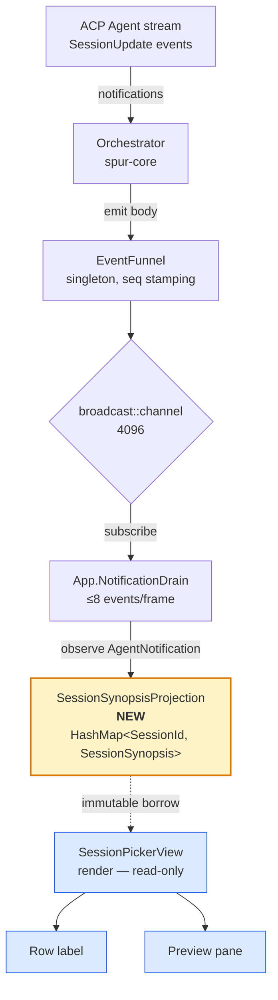
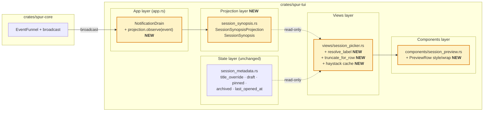
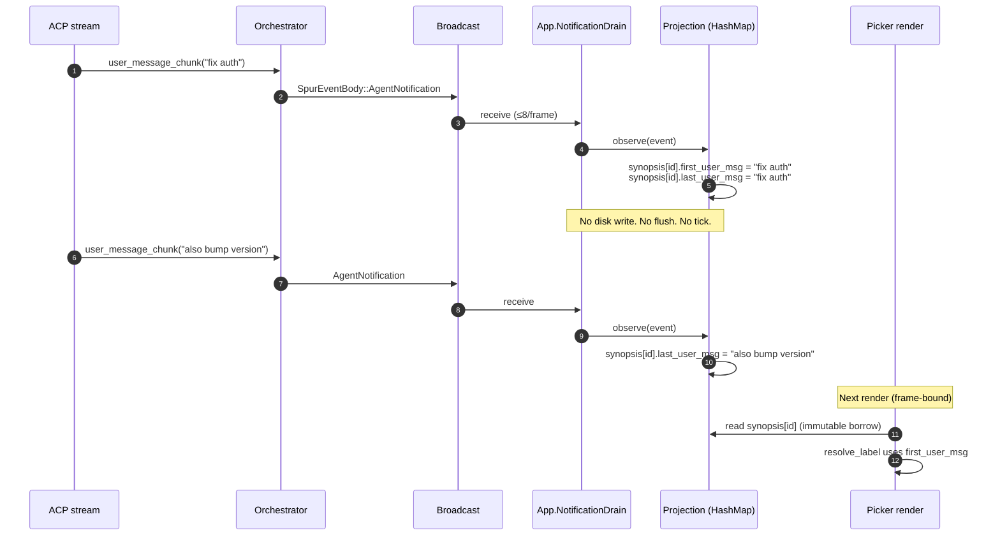

# Session Picker Recall Revamp — Design

Date: 2026-04-28
Status: Spec (pre-implementation)
Owner: TUI / Session UX
Scope: `crates/spur-tui` only — no ACP / brain / protocol changes
Pre-launch: SPUR has not shipped publicly; legacy session backfill is out of scope.

## Problem

The session picker (`crates/spur-tui/src/views/session_picker.rs`) lists
sessions by an agent-generated `title` (e.g. "Build fix"). These titles
carry weak semantic weight, so users returning to the picker struggle to
recall which session was about what. The current preview pane (toggled
with `P`) is dominated by administrative metadata — session ID, full CWD,
ISO timestamp, pinned/archived flags — that does not help recall.

The picker fails the canonical recall journey at two steps:

1. **Scan** — agent titles do not differentiate sessions in the same project.
2. **Probe** (press `P`) — the preview pane shows admin metadata, not the
   user's intent or last activity.

## Goal

Replace weak agent-generated titles in the row with the user's first
message to that session ("intent recall"), and invert the preview pane so
the user's last message and unsent draft ("state recall") become the
dominant elements, with metadata relegated to a single muted footer.

The synopsis is a **derived projection** of the existing event stream —
matching SPUR's `ExecutorLineage` and `PlanProjectionStore` patterns. It
holds no persistent state of its own.

## Non-goals

- No ACP protocol changes. `SessionInfo` stays as-is.
- No new persistence file. No additions to `metadata.json`.
- No AI-generated summaries. Snippets are verbatim slices of stored messages.
- No legacy backfill, no NDJSON replay path. Both come for free when the
  arch roadmap's Tier 1 #2 ("NDJSON replay on `Lagged`") lands.
- No mutation of `SessionMetadata`. The picker view stays read-only against
  metadata; the projection stays read-only to consumers.
- No 2nd-line snippet under the selected row (would break the existing
  `visible_height` scroll math; rejected during brainstorming).

## Data tiers

Synopsis recall has three potential data sources, each at a different
durability tier:

| Tier | Source | Lifetime | Role in v1 |
|---|---|---|---|
| **Long-term** | ACP vendor session (Claude Code / Codex / Kiro maintains its own history) | Persistent in agent | On resume, agent replays history → `AgentNotification` events → projection catches up |
| **Mid-term** | `EventSink` NDJSON files in `.spur/events/*.ndjson` (128MB rotation) | Until rotation prunes | Out of scope; future NDJSON replay (Tier 1 #2 in `docs/architecture.md`) populates projection at startup |
| **Short-term** | In-memory `SessionSynopsisProjection` in `spur-tui` | Current TUI process | Authoritative for the picker; populated by live broadcast |

For v1 the picker relies on tier-3 plus the on-resume replay from tier-1.
Sessions never resumed in the current TUI run, with no live messages,
have no synopsis and fall through to the existing agent-title path. The
user can archive stale sessions via the existing `d` keybind.

## Decisions (locked)

| Question | Choice | Rationale |
|---|---|---|
| Where does enrichment go? | Hybrid: row label uses first-msg; preview pane carries last-msg + draft + first-msg | Row stays compact; preview becomes content-first |
| Data source | Live event projection (no persistence, no backfill) | Matches `ExecutorLineage` pattern; future NDJSON replay is a free upgrade |
| Row label precedence | `title_override` → first-msg → agent title → cwd | Manual user rename wins; otherwise snippet beats agent auto-title |
| Per-row 2nd line for selected row | Rejected | Breaks `visible_height` math |
| Preview pane height | Grow from 8 to 12 rows when `P` is on | Fits last-msg + draft + first-msg + footer |
| Preview hierarchy | State on top (last-msg + draft), intent below (first-msg breadcrumb) | "Where I left off" is the dominant resume question |

## Architecture

### Data flow — projection pattern



The projection mirrors SPUR's existing pattern (architecture.md §4):

- `ExecutorLineage` — `HashMap<ExecutorId, Node>`, pure projection.
- `PlanProjectionStore` — cache + snapshot, subscribes to broadcast.
- **NEW `SessionSynopsisProjection`** — `HashMap<SessionId, SessionSynopsis>`,
  observed from `SpurEventBody::AgentNotification`.

The projection holds **no persistent state**. It rebuilds from the event
stream during the lifetime of a TUI process. When NDJSON replay
(arch roadmap Tier 1 #2) lands, this projection rehydrates at startup
for free.

### Component architecture



Files touched: 4 in `spur-tui` (`app.rs`, new `session_synopsis.rs`,
`views/session_picker.rs`, `components/session_preview.rs`). Zero
changes in `spur-acp` or `spur-core`. **`session_metadata.rs` is
untouched** — synopsis is not metadata.

### Projection update sequence



If the user resumes an old session, the agent replays its history; the
chunks flow through the same path and the projection catches up
naturally.

## Data model

New file: `crates/spur-tui/src/session_synopsis.rs`.

```rust
use std::collections::HashMap;
use spur_acp::SessionId;

#[derive(Debug, Clone, Default)]
pub struct SessionSynopsis {
    /// User's first non-slash-command message in this session, capped at
    /// 120 graphemes at write time. None = unknown.
    pub first_user_msg: Option<String>,
    /// Most recent USER message (not assistant), capped at 120 graphemes.
    pub last_user_msg: Option<String>,
    /// RFC 3339 timestamp of last_user_msg.
    pub last_msg_at: Option<String>,
}

#[derive(Debug, Default)]
pub struct SessionSynopsisProjection {
    by_session: HashMap<SessionId, SessionSynopsis>,
    /// Sessions that received a synopsis update since last picker read;
    /// the picker uses this to invalidate cached haystack entries.
    dirty_since_read: std::collections::HashSet<SessionId>,
}

impl SessionSynopsisProjection {
    /// Called by App's NotificationDrain for every SpurEvent.
    pub fn observe(&mut self, event: &spur_acp::SpurEvent) { /* ... */ }

    /// Read API for the picker.
    pub fn get(&self, id: &SessionId) -> Option<&SessionSynopsis> { /* ... */ }

    /// Drain the dirty set (picker calls on each render).
    pub fn drain_dirty(&mut self) -> Vec<SessionId> { /* ... */ }
}
```

Storage rules (write-time):
- 120-grapheme cap, measured via `unicode-segmentation`.
- Truncation cuts at first `.`, `?`, `!`, `\n`, or 120 graphemes —
  whichever first. Trailing `…` appended if cut.
- Empty / whitespace-only chunks are skipped.
- Messages whose first non-whitespace character is `/` are skipped from
  `first_user_msg` so commands like `/vim` or `/clear` never become a
  permanent row label. They still update `last_user_msg`.
- All timestamps are RFC 3339.

`SessionMetadata` / `SessionEntry` are **not modified**. Synopsis is
derived state and does not belong with persisted user-authored fields
(`title_override`, `draft`, `pinned`, `archived`, `last_opened_at`).

## Projection update path

The projection is a field on `App` (`crates/spur-tui/src/app.rs:222`-
adjacent struct). In `App::process_spur_event` (existing handler in the
neighborhood of `app.rs:1388-1393`), call `self.synopsis.observe(event)`
synchronously alongside the existing event-routing arms.

```text
fn observe(&mut self, event: &SpurEvent):
    let SpurEventBody::AgentNotification { session_id, notification } = event.body else: return
    let SessionUpdate::user_message_chunk { content } = notification.update else: return
    let text = content.text.trim()
    if text.is_empty(): return

    let s = self.by_session.entry(session_id).or_default()

    if !text.starts_with('/') and s.first_user_msg.is_none():
        s.first_user_msg = Some(truncate_120(text))
    s.last_user_msg = Some(truncate_120(text))
    s.last_msg_at   = Some(now_rfc3339())
    self.dirty_since_read.insert(session_id.clone())
```

Assistant chunks are ignored.

**No disk I/O. No flush. No tick. No coalescing.** Observation is O(1)
amortized HashMap update; runs inline with the existing notification
drain (capped at ≤8 events/frame per arch §2 channel summary).

## Row composition

Replace `resolved_title()` in `session_picker.rs` (line 521) with
`resolve_label()`. The picker accesses the projection through
`ViewContext` (existing pattern — see `views/mod.rs:115-124`).

```rust
fn resolve_label(
    session: &SessionInfo,
    entry: Option<&SessionEntry>,
    synopsis: Option<&SessionSynopsis>,
    show_cwd: bool,
    label_budget: usize,
) -> String {
    // 1. user-set rename wins
    if let Some(t) = entry.and_then(|e| e.title_override.as_deref())
        .filter(|t| !t.is_empty())
    {
        return truncate_for_row(t, label_budget);
    }
    // 2. first-user-msg from projection
    if let Some(snippet) = synopsis
        .and_then(|s| s.first_user_msg.as_deref())
        .filter(|s| !s.is_empty())
    {
        return truncate_for_row(snippet, label_budget);
    }
    // 3. agent-generated title
    if let Some(t) = session.title.as_deref().filter(|t| !t.is_empty()) {
        return truncate_for_row(t, label_budget);
    }
    // 4. cwd basename
    if show_cwd {
        return format!("{}/", cwd_basename(&session.cwd));
    }
    // 5. fallback
    "(untitled session)".to_string()
}
```

`label_budget` = `area.width − right_gutter_width − prefix_width`,
fallback static cap of 60 graphemes for ultrawide terminals.

`truncate_for_row` cuts at first sentence punctuation (`. ? !`),
newline, or `label_budget` graphemes.

The list row stays a single line.

## Preview pane

`PreviewContent` is **extended**, not replaced. Keep the existing
`rows: Vec<(String, String)>` and `placeholder: Option<String>`. Add an
optional per-row style modifier:

```rust
pub struct PreviewRow {
    pub label: String,
    pub value: String,
    pub value_style: Option<Style>,
    pub wrap: bool,
}

pub struct PreviewContent {
    pub rows: Vec<PreviewRow>,
    pub placeholder: Option<String>,
}
```

`From<(String, String)> for PreviewRow` preserves existing call sites.

The picker populates rows in **state-recall-first** order:

1. **Last** — value = `synopsis.last_user_msg`. Single line. Skipped if absent.
2. **Draft** — value = `entry.draft`, style `Color::Yellow`. Skipped if empty.
3. Blank separator.
4. **Intent** — value = `synopsis.first_user_msg`, wrapped, dim gray
   (no italic). Up to 3 wrapped lines. Skipped if absent.
5. Blank separator.
6. **Footer** — value = `cwd · brain · short_id`, dark gray.

No timestamp on the `Last` row — the row's relative_ts is already visible.

Preview height changes from 8 to 12 (`preview_height` constant in
`render_populated()` at line 802). When `P` is off, layout is unchanged.

If terminal is too short for 12 rows, ratatui clips the bottom. No
graceful-degradation rules.

## Filter / search

Two changes:

**1. Widen the haystack** to include synopsis:
```rust
let synopsis = ctx.synopsis_projection.get(&session.session_id);
let label = resolve_label(session, entry, synopsis, false, usize::MAX);
let first = synopsis.and_then(|s| s.first_user_msg.as_deref()).unwrap_or("");
let last  = synopsis.and_then(|s| s.last_user_msg.as_deref()).unwrap_or("");
let haystack = format!("{label} {first} {last} {cwd} {id}");
```

**2. Precompute and cache haystacks** on `set_sessions()` and on
projection updates. Add to `PickerState::Populated`:

```rust
PickerState::Populated {
    agent: String,
    sessions: Vec<SessionInfo>,
    haystacks: Vec<String>,   // NEW
    cursor: usize,
    search_focused: bool,
    filter: String,
}
```

`haystacks[i]` is built in `set_sessions()`. On each render, the picker
calls `synopsis_projection.drain_dirty()`; for each dirty id that
matches a visible session, rebuild that one haystack entry. This gives
us the perf win without coupling the projection to the picker.

`filtered_indices` reads `&haystacks[i]` instead of recomputing.

**Match-source hint:** when a filter is active and the query string
does not appear (case-insensitive substring) in the rendered row label,
append a dim suffix:

```
  > Build fix              codex  2h  019dce0e   ↳ "...auth refactor..."
```

## Action / event additions

None. The projection is read directly via `ViewContext`; no new actions
or messages.

## Performance & invariants

- **Synchronous render:** zero I/O on the render path.
- **No async tasks** introduced.
- **No disk writes** introduced.
- **Single cache layer:** the projection HashMap IS the cache.
- **Truncation at write time:** stored value capped at 120 graphemes.
- **Visible-height math unchanged:** all rows remain one line.
- **Projection update cost:** O(1) amortized HashMap insert per
  user_message_chunk, runs inside the existing ≤8/frame drain budget.
- **Filter haystack:** built once per `set_sessions()`, invalidated
  per-session via the projection's dirty set on render. `filtered_indices`
  is O(n) scoring instead of O(n × strlen).

## Error handling

- **Empty / whitespace-only `user_message_chunk`** — skip; no synopsis
  update.
- **First message is a slash command** — skip from `first_user_msg`;
  still update `last_user_msg`.
- **Unicode-segmentation panic on truncation** — `unicode-segmentation`
  is panic-safe; unit-test boundary cases.
- **Render-time budget < 1 grapheme** — `truncate_for_row` returns `…`
  alone.
- **`Lagged` on broadcast receiver** — App already logs warn on Lagged
  per arch Risk #9. Projection misses some events; `first_user_msg` may
  still be correct (it's the earliest user msg ever observed), but
  `last_user_msg` may be stale until the next chunk lands. Acceptable
  pre-launch; future NDJSON replay (Tier 1 #2) closes this gap.

## Risks

| Risk | Likelihood | Mitigation |
|---|---|---|
| First user message is a long paste (e.g., a stack trace) and dominates the row | Medium | 120-grapheme cap + sentence-boundary cut keeps the label tight |
| Different agents emit `user_message_chunk` differently (per character vs per message) | Low | Idempotent re-write of `last_user_msg` is harmless. Plan-writing must verify chunk-vs-message semantics from `crates/spur-acp` |
| User changes their mind about the first message and wants to "reset" the synopsis | Low | Existing `R` rename flow already overrides via `title_override`, which has top precedence |
| Projection lost on TUI restart | Medium → Low (pre-launch) | Acceptable for v1: rows fall through to agent title until the user resumes the session (vendor replays history → projection populates). Future: NDJSON replay (arch Tier 1 #2) rehydrates projection at startup |
| Sessions whose underlying NDJSON has rotated out and were never resumed | Low | Acceptable. User can archive via existing `d` keybind. Sessions reachable via ACP `session/list` still get a row, just without synopsis |
| Filter widening blows nucleo budget on large session lists | Low | Haystacks precomputed once per session; benchmark at 200 / 500 sessions before merge |
| Match-source hint adds visible noise on every filter | Medium | Only render when label substring miss; cap hint at one short fragment |
| Broadcast `Lagged` causes projection drift | Low (pre-launch) | Tier 1 #2 NDJSON replay is the canonical mitigation across all projections including this one. Until then, projection self-corrects on the next live chunk |

## Test surface

Unit tests:
- `resolve_label` precedence — 5 cases plus empty / whitespace.
- `truncate_for_row` — sentence boundary, char cap, ellipsis, unicode
  graphemes, budget < 1.
- `truncate_120` — same edge cases.
- `SessionSynopsisProjection::observe`:
  - First `user_message_chunk` populates both `first_user_msg` and
    `last_user_msg`.
  - Second chunk updates only `last_user_msg`.
  - Slash-command first message updates only `last_user_msg`.
  - Empty / whitespace chunk is skipped.
  - Assistant chunks are ignored.
  - Non-`AgentNotification` events are ignored.
  - Dirty set tracks updated session ids; `drain_dirty` empties it.
- Filter haystack includes synopsis fields when projection is non-empty.
- Match-source hint appears only on label substring miss.

Snapshot tests (insta):
- Row render: synopsis present, synopsis absent, `title_override` present.
- Preview render: full synopsis + draft, synopsis without draft, empty.

Integration test:
- Pump synthetic `SpurEvent`s through `App::process_spur_event` and
  assert the picker view's resolved labels reflect the projection.

Manual QA checklist (terminal sizes):
- 80×24 (minimum standard).
- 120×40 (normal).
- 200×60 (ultrawide) — confirm `label_budget` cap of 60.

## Effort estimate

| Phase | LoC | Files |
|---|---|---|
| `SessionSynopsis` + `SessionSynopsisProjection` + observe + tests | ~120 | NEW `session_synopsis.rs` |
| App wire-up (field + observe call in event drain) + ViewContext field | ~30 | `app.rs`, `views/mod.rs` |
| `resolve_label` + `truncate_for_row` + label_budget plumbing | ~80 | `session_picker.rs` |
| `PreviewContent` extension + new preview population | ~60 | `session_preview.rs`, `session_picker.rs` |
| Filter widening + haystack precompute + dirty-set invalidate | ~50 | `session_picker.rs` |
| Snapshot + integration tests | ~80 | `session_picker.rs` (`#[cfg(test)]`), new fixtures |

Total: ~420 LoC across 4 files (3 modified + 1 new). One implementation
plan, no parallel-task decomposition needed.

## Open follow-ups (out of scope)

- NDJSON replay on TUI startup to rehydrate projection (arch Tier 1 #2 —
  benefits all projections including this one; not picker-specific).
- Per-session cost in the preview footer (`spur-cost` integration).
- AI-generated semantic summary for very long sessions.
- Backfill for legacy sessions if/when post-launch demand materializes.
