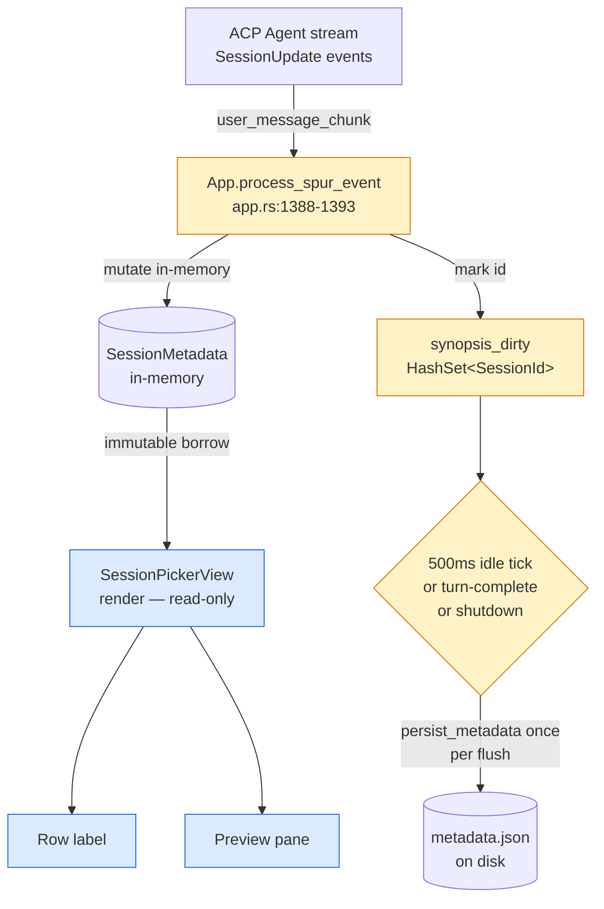
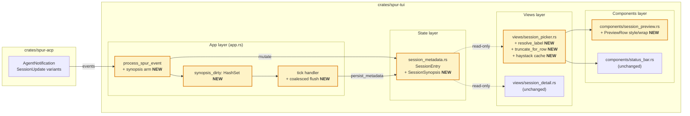
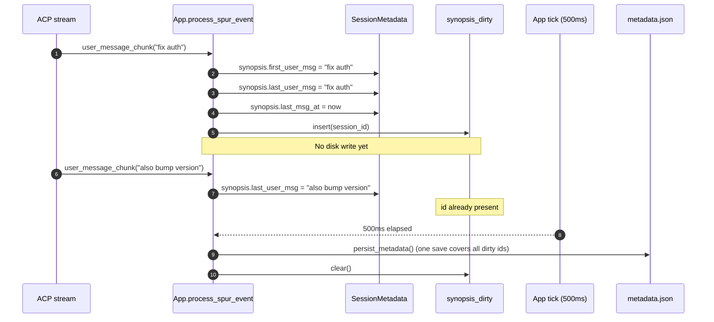

# Session Picker Recall Revamp — Design

Date: 2026-04-28
Status: Spec (pre-implementation)
Owner: TUI / Session UX
Scope: `crates/spur-tui` only — no ACP / brain / protocol changes
Pre-launch: SPUR has not shipped publicly; legacy session backfill is out of scope.

## Problem

The session picker (`crates/spur-tui/src/views/session_picker.rs`) lists
sessions by an agent-generated `title` (e.g. "Build fix"). These titles carry
weak semantic weight, so users returning to the picker struggle to recall
which session was about what. The current preview pane (toggled with `P`) is
dominated by administrative metadata — session ID, full CWD, ISO timestamp,
pinned/archived flags — that does not help recall. The only content signal in
the preview today is a `Draft` row, and only when unsent text exists.

The picker fails the canonical recall journey at two steps:

1. **Scan** — agent titles do not differentiate sessions in the same project.
2. **Probe** (press `P`) — the preview pane shows admin metadata, not the
   user's intent or last activity.

## Goal

Replace weak agent-generated titles in the row with the user's first message
to that session ("intent recall"), and invert the preview pane so the user's
last message and unsent draft ("state recall") become the dominant elements,
with metadata relegated to a single muted footer.

Both signals come from a single live-write path on the existing event router
— no async backfill, no disk I/O on render.

## Non-goals

- No ACP protocol changes. `SessionInfo` stays as-is.
- No new persistence file. Synopsis lives in the existing
  `.spur/sessions/metadata.json` store.
- No AI-generated summaries. Snippets are verbatim slices of stored messages.
- No legacy backfill. Pre-launch product; sessions without a synopsis fall
  through to the existing agent-title path. If post-launch demand arises,
  add a backfill in v2.
- No per-session cost rendering (future work).
- No 2nd-line snippet under the selected row (would break the existing
  `visible_height` scroll math; rejected during brainstorming).

## Decisions (locked)

| Question | Choice | Rationale |
|---|---|---|
| Where does enrichment go? | Hybrid: row label uses first-msg; preview pane carries last-msg + draft + first-msg | Row stays compact; preview becomes content-first |
| Data source | Live writes only (no backfill) | Pre-launch; legacy data is not a constraint |
| Row label precedence | `title_override` → first-msg → agent title → cwd | Manual user rename wins; otherwise snippet beats agent auto-title |
| Per-row 2nd line for selected row | Rejected | Breaks `visible_height` math |
| Preview pane height | Grow from 8 to 12 rows when `P` is on | Fits last-msg + draft + first-msg + footer |
| Preview hierarchy | State on top (last-msg + draft), intent below (first-msg breadcrumb) | "Where I left off" is the dominant resume question |

## Architecture

### Data flow



The picker view **never writes** metadata. All synopsis mutation flows
through App's existing `AgentNotification` handler. The picker holds an
immutable reference to `SessionMetadata` for rendering only.

Sessions with no live-write synopsis fall through to the existing
agent-title path.

### Component architecture

Boundaries between modules and which files change. NEW additions are
boxed; existing components shown for context.



Files touched: 4 in `spur-tui` (`app.rs`, `session_metadata.rs`,
`views/session_picker.rs`, `components/session_preview.rs`). Zero
changes in `spur-acp`.

### Live-write sequence

The coalesced-flush ordering, end-to-end:



If a turn-complete event (`stop_reason` set) arrives before the 500ms
tick, it short-circuits the wait and triggers the same flush.

## Data model

Add to `crates/spur-tui/src/session_metadata.rs`:

```rust
#[derive(Debug, Clone, Default, serde::Serialize, serde::Deserialize, PartialEq, Eq)]
#[serde(default)]
pub struct SessionSynopsis {
    /// User's first non-slash-command message in this session, capped at
    /// 120 graphemes at write time. None = unknown.
    pub first_user_msg: Option<String>,
    /// Most recent USER message (not assistant), capped at 120 graphemes.
    pub last_user_msg: Option<String>,
    /// RFC 3339 timestamp of last_user_msg (matches `last_opened_at` style).
    pub last_msg_at: Option<String>,
}

// In SessionEntry, add:
pub synopsis: Option<SessionSynopsis>,
```

Storage rules:
- Cap at 120 graphemes at WRITE time (not read time), measured via
  `unicode-segmentation`. Render trims further as needed.
- Truncation cuts at first `.`, `?`, `!`, `\n`, or 120 graphemes —
  whichever comes first. Trailing `…` appended if the cut shortened.
- Empty / whitespace-only messages are skipped (not stored).
- Messages whose first non-whitespace character is `/` are skipped from
  `first_user_msg` so commands like `/vim` or `/clear` never become a
  permanent row label. They still update `last_user_msg` (the user did
  type something).
- All timestamps are RFC 3339.

Not stored (cut during review):
- `msg_count` — trivia; would only feed an unused footer stat.
- `backfilled_at` — redundant; `synopsis.is_none()` is the gate, and
  v1 has no backfill.

## Live write path

Hook into App's existing `AgentNotification` handler (`app.rs:1388-1393`),
which already inspects ACP `SessionUpdate` events for status. Add a
synopsis-mutation arm:

```text
on AgentNotification with SessionUpdate::user_message_chunk:
  text = chunk.content.text trimmed
  if text is empty: return
  entry = metadata.sessions.entry(S).or_default()
  synopsis = entry.synopsis.get_or_insert_with(SessionSynopsis::default)

  if !text.starts_with('/') and synopsis.first_user_msg.is_none():
      synopsis.first_user_msg = Some(truncate_120(text))
  synopsis.last_user_msg = Some(truncate_120(text))
  synopsis.last_msg_at   = Some(now_rfc3339())

  app.synopsis_dirty.insert(S)   // marker, not a save
```

Assistant chunks are ignored.

**Coalesced flush.** The existing metadata save path is *immediate*
(`session_metadata.rs:373-379` performs a full-file JSON write + rename
via `persist_metadata`, `app.rs:815-828`). The only real debounce in the
codebase is for drafts, 500ms in `SessionDetailView`
(`session_detail.rs:551-573`).

To avoid one full-file save per `user_message_chunk` (which can fire
many times per second during streaming), synopsis mutations follow the
same coalescing pattern as drafts:

- Mutations are written in-memory immediately (so the picker reflects
  current state if the user opens it mid-turn).
- App tracks `synopsis_dirty: HashSet<SessionId>`.
- Flush triggers (any one fires `persist_metadata` once for all dirty
  ids):
  1. `SessionUpdate` with `stop_reason` set (turn complete).
  2. App tick observes `synopsis_dirty` non-empty and ≥ 500ms since the
     last write attempt for that session.
  3. App shutdown / cleanup path.

The 500ms timer reuses App's existing tick infrastructure
(`app.rs:2469-2477` for the draft pattern). No new tokio task or
timer primitive is introduced.

This matches codex's review prescription: "mutate in memory on
`AgentNotification`, flush on turn/interval, batch backfill results,
and perform one metadata save per batch."

## Row composition

Replace `resolved_title()` in `session_picker.rs` (line 521) with
`resolve_label()`:

```rust
fn resolve_label(
    session: &SessionInfo,
    entry: Option<&SessionEntry>,
    show_cwd: bool,
    label_budget: usize,   // computed from area.width
) -> String {
    // 1. user-set rename wins
    if let Some(t) = entry.and_then(|e| e.title_override.as_deref())
        .filter(|t| !t.is_empty())
    {
        return truncate_for_row(t, label_budget);
    }
    // 2. first-user-msg from synopsis
    if let Some(snippet) = entry
        .and_then(|e| e.synopsis.as_ref())
        .and_then(|s| s.first_user_msg.as_deref())
        .filter(|s| !s.is_empty())
    {
        return truncate_for_row(snippet, label_budget);
    }
    // 3. agent-generated title
    if let Some(t) = session.title.as_deref().filter(|t| !t.is_empty()) {
        return truncate_for_row(t, label_budget);
    }
    // 4. cwd basename
    if show_cwd {
        return format!("{}/", cwd_basename(&session.cwd));
    }
    // 5. fallback
    "(untitled session)".to_string()
}
```

`label_budget` is computed at the call site as
`area.width - right_gutter_width - prefix_width`, with a static fallback
cap of 60 graphemes for very wide terminals (avoids visually noisy rows on
ultrawide screens). On 80-col terminals with brain visible, the budget
typically resolves to ~45 — which is why a hard 70 was wrong.

`truncate_for_row` cuts at the first sentence punctuation (`. ? !`),
newline, or `label_budget` graphemes — whichever first. Adds `…` on cut.
Strips leading whitespace.

The list row stays a single line. Composition stays at line 786:

```
  > <label>                              <brain>  <relative_ts>  <short_id>
```

## Preview pane

`PreviewContent` is **extended**, not replaced. Keep the existing
`rows: Vec<(String, String)>` and `placeholder: Option<String>`. Add an
optional per-row style modifier so the renderer can highlight specific
rows without breaking existing call sites:

```rust
pub struct PreviewRow {
    pub label: String,
    pub value: String,
    pub value_style: Option<Style>,   // None = existing default
    pub wrap: bool,                   // wrap value across multiple lines
}

pub struct PreviewContent {
    pub rows: Vec<PreviewRow>,
    pub placeholder: Option<String>,
}
```

A `From<(String, String)> for PreviewRow` conversion preserves the existing
key-value call sites verbatim.

The picker populates `rows` in **state-recall-first** order, top to bottom:

1. **Last message** — label `"Last"`, value = `synopsis.last_user_msg`
   (single line, default style). Skipped if absent.
2. **Draft** — label `"Draft"`, value = `entry.draft` styled
   `Color::Yellow`. Skipped if empty.
3. **Blank separator row** (label `""`, value `""`).
4. **First message** — label `"Intent"`, value = `synopsis.first_user_msg`
   wrapped to pane width, dim gray (no italic — many terminals don't
   render it). Up to 3 wrapped lines. Skipped if absent.
5. **Blank separator row.**
6. **Footer** — label `""`, value `cwd · brain · short_id` in dark gray.

No timestamp on the `Last` row: the row's relative_ts is already visible
in the list view a few lines above.

Preview height changes from 8 to 12 (`preview_height` constant in
`render_populated()` at line 802). When `P` is off the layout is unchanged.

If the terminal is too short for 12 rows of preview, ratatui clips the
bottom (current behavior). No graceful-degradation rules — defer until
real terminal-size data shows it matters.

## Filter / search widening

`filtered_indices` (lines 318-382) currently builds the haystack inside
the filter loop on every call:
`format!("{title} {cwd} {id}")`.

Two changes here:

**1. Widen the haystack** to include synopsis content:
```rust
let label = resolve_label(session, entry, false, usize::MAX);
let first = entry.and_then(|e| e.synopsis.as_ref())
    .and_then(|s| s.first_user_msg.as_deref()).unwrap_or("");
let last = entry.and_then(|e| e.synopsis.as_ref())
    .and_then(|s| s.last_user_msg.as_deref()).unwrap_or("");
let haystack = format!("{label} {first} {last} {cwd} {id}");
```

Nucleo matcher and scoring stay identical.

**2. Precompute and cache haystacks** on `set_sessions()` so navigation
and re-render don't rebuild them. `filtered_indices` currently runs from
multiple paths (render at `session_picker.rs:659`, preview at
`session_picker.rs:858-860`, every j/k keypress). Caching collapses the
work from O(n × strlen) per call to O(strlen) once per session-list change.

Add to `PickerState::Populated`:

```rust
PickerState::Populated {
    agent: String,
    sessions: Vec<SessionInfo>,
    haystacks: Vec<String>,   // NEW: parallel to sessions, indexed by real_i
    cursor: usize,
    search_focused: bool,
    filter: String,
}
```

`haystacks[i]` is built once inside `set_sessions()` using the formula
above; rebuild also triggers when:
- a synopsis update lands for a visible session (App → Picker
  notification — see "Synopsis-update notification" below).
- the user issues a rename via `R` (existing path; rename already
  triggers a list refresh).

`filtered_indices` reads `&haystacks[i]` instead of recomputing.

### Synopsis-update notification

When App's coalesced flush completes, App must invalidate the picker's
`haystacks` cache for any updated session that's currently visible.
Lightweight path: App calls `picker.invalidate_haystack(session_id)`
when the picker view is the active view; the picker rebuilds just
that one entry on next render. No new Action variant; direct
view-method call from App's flush handler.

For sessions not currently visible in the picker (e.g. user is in
`SessionDetail` view), no invalidation is needed — when they later open
the picker, `set_sessions()` rebuilds all haystacks fresh.

**Match-source hint:** when a filter is active and the matched query string
does not appear (case-insensitive substring) in the rendered row label,
append a dim suffix to that row:

```
  > Build fix              codex  2h  019dce0e   ↳ "...auth refactor..."
```

The hint is computed at render time from the lowest-cost search-string
match against the synopsis fields. This prevents the "why does '/auth'
match a row labeled 'Build fix'?" confusion.

## Action / event additions

None. Live-write happens inside the existing event handler; no new actions
or message types needed.

## Performance & invariants

- **Synchronous render:** no I/O on the render path.
- **No async tasks** introduced; coalesced flush rides App's existing tick.
- **Single cache layer:** the `synopsis` field IS the cache.
- **Truncation at write time:** stored value capped at 120 graphemes.
- **Visible-height math unchanged:** all rows remain one line.
- **One save per coalesce window**, not per chunk. Worst case: an active
  session with continuous streaming generates 2 saves/sec (500ms window),
  not 50/sec.
- **Filter haystack precomputed:** built once in `set_sessions()`,
  invalidated per-session on synopsis flush. `filtered_indices` becomes
  O(n) scoring instead of O(n × strlen) per call, so adding ~240 chars
  per session no longer multiplies render cost on every j/k.

## Error handling

- **Empty / whitespace-only `user_message_chunk`** — skip; do not write a
  blank synopsis.
- **First message is a slash command** — skip from `first_user_msg`; still
  update `last_user_msg`.
- **Unicode-segmentation panic on truncation** — `unicode-segmentation` is
  panic-safe; unit-test boundary cases (empty string, single grapheme,
  combining characters at the cut point).
- **Metadata save failure** — already handled by existing save path; no new
  failure mode introduced.
- **Synopsis serialization** — `#[serde(default)]` ensures missing fields
  in older `metadata.json` files (none expected pre-launch, but defensive)
  load as `None`.
- **Render-time budget < 1 grapheme** — `truncate_for_row` returns `…`
  alone; layout stays sane.

## Risks

| Risk | Likelihood | Mitigation |
|---|---|---|
| First user message is a long paste (e.g., a stack trace) and dominates the row | Medium | 120-grapheme cap + sentence-boundary cut keeps the label tight |
| Different agents emit `user_message_chunk` differently (some chunked per character, some per message) | Low | Live-write writes idempotently — re-writing `last_user_msg` with the same first-message content is harmless. Plan-writing must pin the chunk-vs-message semantics from `crates/spur-acp` |
| User changes their mind about the first message and wants to "reset" the synopsis | Low | The existing `R` rename flow already overrides via `title_override`, which has top precedence |
| Preview becomes useless for sessions with no `user_message_chunk` ever (silent agents) | Low | Falls through to existing behavior — preview shows `cwd · brain · short_id` footer only |
| Match-source hint adds visible noise on every filter | Medium | Only render when label substring miss; cap hint at one short fragment |
| Filter widening blows nucleo budget on large session lists | Low | Haystacks now precomputed per-session in `PickerState::Populated.haystacks`; filter only pays nucleo scoring cost. Benchmark at 200 / 500 sessions before merge anyway |
| Haystack invalidation race — synopsis update lands while picker is filtering | Low | Invalidation is a pull-update on next render, not a mid-frame mutation. Worst case: one frame shows a stale match score, corrected on the next tick |
| Coalesced flush window misses an in-flight crash | Low | 500ms loss is acceptable for synopsis (worst case: row label reverts to agent title until next live message). Drafts already accept this trade-off |

## Test surface

Unit tests:
- `resolve_label` precedence — 5 cases plus empty-string and whitespace-only
  edge cases.
- `truncate_for_row` — sentence boundary cut, char cap, ellipsis behavior,
  unicode grapheme correctness, budget < 1 case.
- `truncate_120` — same edge cases.
- Filter haystack includes synopsis fields — `/auth` matches a session
  whose first-msg contains "auth".
- Match-source hint — appears only when label substring miss; absent when
  label contains the query.
- Live-write path:
  - First user message populates both `first_user_msg` and `last_user_msg`.
  - Second user message updates only `last_user_msg`.
  - Slash-command first message updates only `last_user_msg`.
  - Empty / whitespace-only message is skipped entirely.
  - Assistant messages are ignored (no synopsis change).

Snapshot tests (insta):
- Row render with: synopsis present, synopsis absent, `title_override`
  present.
- Preview render with: full synopsis + draft, synopsis without draft,
  empty synopsis, slash-command first-message scenario.

Manual QA checklist (terminal sizes):
- 80×24 (minimum standard): confirm row label fits without gutter wrap.
- 120×40 (normal): confirm `Intent` block wraps cleanly.
- 200×60 (ultrawide): confirm `label_budget` cap of 60 prevents
  over-long labels from looking sparse.

## Effort estimate

| Phase | LoC | Files touched |
|---|---|---|
| Data model + serde defaults | ~40 | `session_metadata.rs` |
| Live-write hook in App's `AgentNotification` handler + `synopsis_dirty` tracker + coalesced flush | ~80 | `app.rs` (`process_spur_event`, tick handler) |
| `resolve_label` + `truncate_for_row` + label_budget plumbing | ~80 | `session_picker.rs` |
| `PreviewContent` extension + new preview population | ~60 | `session_preview.rs`, `session_picker.rs` |
| Filter widening + haystack precompute + invalidate hook | ~50 | `session_picker.rs`, `app.rs` (invalidate call) |
| Match-source hint | ~20 | `session_picker.rs` |
| Tests (unit + snapshot) | ~250 | `session_picker.rs` (`#[cfg(test)]`), new fixtures |

Total: ~580 LoC across 4 files. One implementation plan, no
parallel-task decomposition needed.

## Open follow-ups (out of scope for this spec)

- Backfill for legacy sessions if/when the product launches and recall
  pain is observed for older sessions.
- Per-session cost in the preview footer (`spur-cost` integration).
- AI-generated semantic summary for very long sessions.
- "Recent activity" — last 3 user messages instead of just the most recent.
