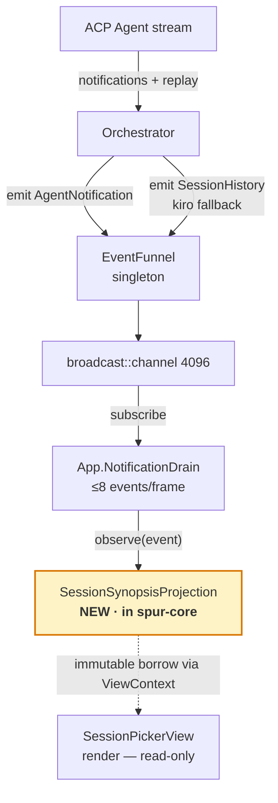
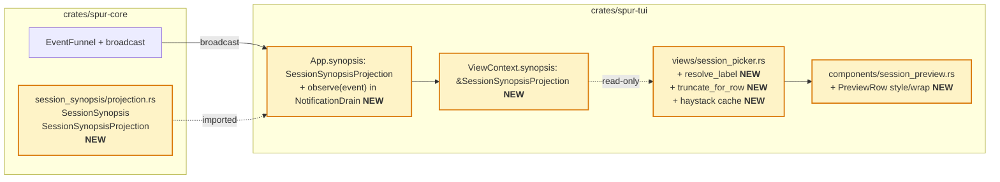

# Session Picker Recall Revamp — Design

Date: 2026-04-28
Status: Spec (pre-implementation, ready for plan-writing)
Owner: TUI / Session UX
Scope: `spur-core` (new projection module) + `spur-tui` (consumer wiring).
Pre-launch: SPUR has not shipped publicly; legacy session backfill is out of scope.

## Problem

The session picker (`crates/spur-tui/src/views/session_picker.rs`) lists
sessions by an agent-generated `title` (e.g. "Build fix"). These titles
carry weak semantic weight, so users returning to the picker struggle to
recall which session was about what. The current preview pane (toggled
with `P`) is dominated by administrative metadata that does not help recall.

The picker fails the canonical recall journey at two steps:

1. **Scan** — agent titles do not differentiate sessions in the same project.
2. **Probe** (press `P`) — preview surfaces admin metadata, not user intent
   or last activity.

## Goal

Replace weak agent-generated titles in the row with the user's first
message ("intent recall"), and invert the preview pane so the user's last
message and unsent draft ("state recall") become the dominant elements,
with metadata in a single muted footer.

The synopsis is a **derived projection** of the existing event stream —
matching `ExecutorLineage` and `PlanProjectionStore`. It holds no
persistent state of its own. For pre-launch this is acceptable; future
NDJSON replay (arch.md Tier 1 #2) rehydrates projections at startup.

## Non-goals

- No ACP protocol changes.
- No new event variants. Synopsis observes existing
  `SpurEventBody::AgentNotification` and `SpurEventBody::SessionHistory`.
- No new persistence file or `metadata.json` field.
- No AI-generated summaries.
- No legacy backfill, no NDJSON replay path.
- No mutation of `SessionMetadata` from the picker view.
- No 2nd-line snippet under the selected row (would break `visible_height`
  scroll math).

## Data tiers

| Tier | Source | Lifetime | Role in v1 |
|---|---|---|---|
| **Long-term** | ACP vendor session | Persistent in agent | On `load_session`, agent replays history → `AgentNotification(UserMessageChunk)` → projection |
| **Long-term (kiro fallback)** | `~/.kiro/sessions/cli/<id>.jsonl` | Persistent on disk | Orchestrator's `read_session_history_from_disk` (`orchestrator.rs:3944`) emits `SessionHistory { entries }` → projection |
| **Mid-term** | `EventSink` NDJSON (128MB rotation) | Until rotation | Out of scope; future NDJSON replay populates projections at startup |
| **Short-term** | In-memory projection | Current TUI process | Authoritative for picker |

Sessions never observed in this TUI run, with no replay/live messages,
have no synopsis and fall through to the existing agent-title path. The
user can archive stale sessions via the existing `d` keybind.

## Decisions (locked)

| Question | Choice | Rationale |
|---|---|---|
| Where does enrichment go? | Hybrid: row label uses first-msg; preview pane carries last-msg + draft + first-msg | Row stays compact; preview becomes content-first |
| Data source | Live event projection (no persistence, no backfill) | Matches `ExecutorLineage` pattern |
| Row label precedence | `title_override` → first-msg → agent title → cwd | Manual rename wins; otherwise snippet beats agent auto-title |
| Per-row 2nd line for selected row | Rejected | Breaks `visible_height` math |
| Preview pane height | 8 → 12 rows when `P` is on | Fits last-msg + draft + first-msg + footer |
| Preview hierarchy | State on top (last-msg + draft), intent below (first-msg breadcrumb) | "Where I left off" is the dominant resume question |
| Projection crate | `spur-core` (types) + per-frontend instance | Mirrors `ExecutorLineage` (`app.rs:14,205-207,359-360`) |
| Truncation crate | TUI-side at render | Avoids adding `unicode-segmentation` dep to core |

## Architecture

### Data flow



The projection is a passive `apply(&event)` struct — same shape as
`ExecutorLineage` (`spur-core/src/lineage/projection.rs`) and
`PlanProjectionStore` (`spur-core/src/plan_projection/projection.rs`).
TUI's App holds an instance and feeds it from the existing notification
drain. No async tasks, no disk writes, no broadcast subscription beyond
what App already does.

### Component architecture



Files touched:
- **NEW** `crates/spur-core/src/session_synopsis/projection.rs`
- `crates/spur-core/src/lib.rs` — re-export `SessionSynopsis`,
  `SessionSynopsisProjection`
- `crates/spur-tui/src/app.rs` — instantiate + observe wire-up
- `crates/spur-tui/src/views/mod.rs` — `ViewContext.synopsis`
- `crates/spur-tui/src/views/session_picker.rs` — consume + render +
  haystack
- `crates/spur-tui/src/components/session_preview.rs` — `PreviewRow`
  extension

`session_metadata.rs` is **untouched**.

## Data model (in `spur-core`)

```rust
// crates/spur-core/src/session_synopsis/projection.rs

use std::collections::HashMap;
use spur_acp::SessionId;

#[derive(Debug, Clone, Default)]
pub struct SessionSynopsis {
    /// First non-slash-command user message in this session, raw text.
    /// Truncation is applied at render time by consumers.
    pub first_user_msg: Option<String>,
    /// Most recent user message, raw text.
    pub last_user_msg: Option<String>,
}

#[derive(Debug, Default)]
pub struct SessionSynopsisProjection {
    by_session: HashMap<SessionId, SessionSynopsis>,
    /// Per-session pending-chunk accumulator. Buffered until a flush
    /// trigger fires (see "Accumulator state machine" below).
    pending: HashMap<SessionId, String>,
}

impl SessionSynopsisProjection {
    pub fn new() -> Self { Self::default() }

    /// Called by App's NotificationDrain for every SpurEvent.
    pub fn observe(&mut self, event: &spur_acp::SpurEvent) { /* ... */ }

    /// Read API for the picker. If a session has no committed
    /// `last_user_msg` but a non-empty pending buffer, returns a
    /// snapshot synopsis with the pending text exposed as
    /// last_user_msg (commit-on-read fallback for abandoned turns).
    pub fn get(&self, id: &SessionId) -> Option<SessionSynopsis> { /* ... */ }
}
```

Storage rules (write-time):
- Empty / whitespace-only chunks are skipped.
- Messages whose first non-whitespace character is `/` are skipped from
  `first_user_msg` (commands like `/vim`, `/clear`). They still update
  `last_user_msg`.
- Raw text is stored without grapheme capping. Length-bounding the row
  label is a render-time concern; the projection trusts ACP's
  chunk sizing as a natural bound (chunk text is bounded by transport).

Cut from prior drafts:
- `last_msg_at` — redundant with `session.updated_at` (already shown as
  `relative_ts` in the row).
- `dirty_since_read` / `drain_dirty` — replaced by lazy haystack rebuild
  on filter input change.
- `backfilled_at` — no backfill in v1.

## Accumulator state machine

Multi-chunk user messages are reassembled into one logical message
before commit. The schema does not guarantee 1 chunk per message, even
though Claude Code's replay fixture shows that today.

```text
on event:
  match SpurEventBody:
    AgentNotification { session, notification }:
      match notification.update:
        UserMessageChunk(c):
          append c.text to pending[session]
        AgentMessageChunk | AgentThoughtChunk | ToolCall | ToolCallUpdate
          | Plan | AvailableCommandsUpdate | CurrentModeUpdate | ...:
          flush_pending(session)

    SessionHistory { session, entries }:
      // Kiro fallback path. entries: Vec<HistoryEntry { role, text }>.
      drop pending[session]  // history overrides any in-flight buffer
      let user_entries = entries.iter().filter(|e| e.role == "user")
      if let Some(first) = user_entries.first():
          set first_user_msg if not already set
      if let Some(last) = user_entries.last():
          set last_user_msg

    TurnComplete { session }:
      flush_pending(session)

    BrainRetired { session, .. }
      | SessionCompleted { session, .. }
      | SessionAttachRejected { acp_session_id: session, .. }:
      flush_pending(session)

    _ : // ignore other variants

flush_pending(session):
  let buf = pending.remove(session).unwrap_or_default()
  let trimmed = buf.trim()
  if trimmed.is_empty(): return
  let s = by_session.entry(session).or_default()
  if !trimmed.starts_with('/') and s.first_user_msg.is_none():
      s.first_user_msg = Some(trimmed.to_owned())
  s.last_user_msg = Some(trimmed.to_owned())
```

**Commit-on-read fallback.** `get(id)` returns the synthesized synopsis:

```text
get(id):
  let committed = by_session.get(id).cloned().unwrap_or_default()
  if let Some(buf) = pending.get(id):
    let trimmed = buf.trim()
    if !trimmed.is_empty() and committed.last_user_msg.is_none():
      // abandoned mid-user-turn: surface the pending buffer
      return Some(SessionSynopsis {
        first_user_msg: committed.first_user_msg,
        last_user_msg: Some(trimmed.to_owned()),
      })
  if committed == SessionSynopsis::default(): None else Some(committed)
```

This keeps an abandoned pending buffer visible to the picker without
prematurely promoting it to the committed map (a later non-User event
will commit it properly via `flush_pending`).

## Row composition

Replace `resolved_title()` (`session_picker.rs:521`) with `resolve_label()`:

```rust
fn resolve_label(
    session: &SessionInfo,
    entry: Option<&SessionEntry>,
    synopsis: Option<&SessionSynopsis>,
    show_cwd: bool,
    label_budget: usize,
) -> String {
    if let Some(t) = entry.and_then(|e| e.title_override.as_deref())
        .filter(|t| !t.is_empty())
    {
        return truncate_for_row(t, label_budget);
    }
    if let Some(snippet) = synopsis
        .and_then(|s| s.first_user_msg.as_deref())
        .filter(|s| !s.is_empty())
    {
        return truncate_for_row(snippet, label_budget);
    }
    if let Some(t) = session.title.as_deref().filter(|t| !t.is_empty()) {
        return truncate_for_row(t, label_budget);
    }
    if show_cwd {
        return format!("{}/", cwd_basename(&session.cwd));
    }
    "(untitled session)".to_string()
}
```

`label_budget` = `area.width − right_gutter_width − prefix_width`,
fallback static cap of 60 graphemes. `truncate_for_row` cuts at first
sentence punctuation (`. ? !`), newline, or `label_budget` graphemes
(via `unicode-segmentation`, already a TUI dep).

The list row stays one line.

## Preview pane

Extend `PreviewContent` (do not replace):

```rust
pub struct PreviewRow {
    pub label: String,
    pub value: String,
    pub value_style: Option<Style>,
    pub wrap: bool,
}

pub struct PreviewContent {
    pub rows: Vec<PreviewRow>,
    pub placeholder: Option<String>,
}
```

`From<(String, String)> for PreviewRow` preserves existing call sites.

Picker fills in **state-recall-first** order:

1. **Last** — `synopsis.last_user_msg`, single line.
2. **Draft** — `entry.draft`, yellow. Skipped if empty.
3. Blank separator.
4. **Intent** — `synopsis.first_user_msg`, wrapped, dim gray (no
   italic). Up to 3 wrapped lines. Skipped if absent.
5. Blank separator.
6. **Footer** — `cwd · brain · short_id`, dark gray.

Preview height: 12 rows when `P` is on (constant in
`render_populated()` at line 802). When `P` is off, layout unchanged.
If terminal is shorter, ratatui clips the bottom — no graceful
degradation rules.

## Filter / search

Two changes:

**1. Widen haystack** to include synopsis fields:
```rust
let synopsis = ctx.synopsis.get(&session.session_id);
let label = resolve_label(session, entry, synopsis.as_ref(), false, usize::MAX);
let first = synopsis.as_ref().and_then(|s| s.first_user_msg.as_deref()).unwrap_or("");
let last  = synopsis.as_ref().and_then(|s| s.last_user_msg.as_deref()).unwrap_or("");
let haystack = format!("{label} {first} {last} {cwd} {id}");
```

**2. Lazy haystack rebuild.** Add `haystacks: Vec<String>` to
`PickerState::Populated`. Built on `set_sessions()`. Rebuilt on
filter-input change (cursor moves and re-renders without filter changes
do NOT rebuild). Live synopsis updates between filter rebuilds may not
reflect in the haystack until the next filter keystroke or list refresh
— acceptable; the row LABEL itself updates immediately because
`resolve_label` reads the projection at every render.

No `drain_dirty`, no per-render invalidation, no interior mutability.

**Match-source hint** — cut from v1 (visible noise risk).

## Action / event additions

None.

## Performance & invariants

- Synchronous render: zero I/O.
- No async tasks. No disk writes.
- Single cache: the projection HashMap.
- Truncation at render time, not write time. Stored synopsis is the raw
  user text; rendering caps to `label_budget`.
- Visible-height math unchanged: rows are one line.
- Projection update cost: O(1) amortized, runs inside the existing
  ≤8/frame drain budget.
- Filter haystack: rebuilt on `set_sessions()` and on filter-input
  change; not per-render.

## Error handling

- Empty / whitespace user_message_chunk → skipped.
- Slash-command first message → skipped from `first_user_msg`; updates
  `last_user_msg`.
- `unicode-segmentation` panic on truncation → unit-test boundary cases.
- Render `label_budget < 1` → `truncate_for_row` returns `…` alone.
- `SessionHistory` with empty entries → no-op.
- `SessionHistory` with no `role == "user"` entries → no-op.
- Pending buffer with only whitespace → `flush_pending` no-ops (trim
  empty); buffer is dropped.

## Risks

| Risk | Likelihood | Impact | Mitigation |
|---|---|---|---|
| Long paste (stack trace) dominates row | Medium | Visible | Sentence-boundary cut + `label_budget` keeps row tight |
| Different agents stream `user_message_chunk` per character | Medium | Correctness | Accumulator commits on flush boundary; first/last_user_msg get whole assembled message |
| User changes mind, wants to "reset" synopsis | Low | UX | Existing `R` rename writes `title_override`, top precedence |
| Projection lost on TUI restart | Medium → Low (pre-launch) | UX | Acceptable v1: rows fall through to agent title until session is resumed (vendor replays history → projection populates). Future NDJSON replay (arch Tier 1 #2) closes |
| Sessions whose NDJSON has rotated and were never resumed | Low | UX | User archives via `d` |
| Filter widening blows nucleo budget on >500 sessions | Low | Perf | Haystacks precomputed; benchmark before merge |
| **Broadcast `Lagged` drops the first `user_message_chunk`** | **Low (pre-launch), real** | **Correctness, user-visible** | **Known v1 degradation: if the first chunk is in a dropped Lagged window, `first_user_msg` stays None for that session in this TUI process; row falls back to agent title silently. NDJSON replay (Tier 1 #2) closes this. Document in release notes** |
| Kiro session with no jsonl history file | Low | UX | `read_session_history_from_disk` returns empty Vec; no `SessionHistory` event emitted; row falls through to agent title |
| Mid-user-turn abandoned (no flush trigger fires) | Low | UX | `get()` commit-on-read fallback exposes the pending buffer as `last_user_msg` |

## Test surface

Unit tests (in `spur-core`):
- `resolve_label` precedence — 5 cases plus empty / whitespace.
- `SessionSynopsisProjection::observe`:
  - Single-chunk live message: appends to pending; flushes on next
    `AgentMessageChunk`; populates first + last.
  - Multi-chunk live message: accumulates across chunks; flushes once
    on agent reply; first + last reflect the full assembled text.
  - Slash-command first message: skipped from `first_user_msg`; updates
    `last_user_msg`.
  - Empty / whitespace chunk: pending unchanged.
  - Assistant chunks: no-op.
  - `TurnComplete` flushes pending.
  - `BrainRetired` / `SessionCompleted` flush pending.
  - `SessionHistory` with `[user, assistant, user]` entries: first
    user → `first_user_msg`, last user → `last_user_msg`; assistant
    entries ignored. Pending buffer for the session is dropped.
  - `SessionHistory` with empty entries: no-op.
  - Non-`AgentNotification` / non-`SessionHistory` events: ignored.
  - Commit-on-read: pending non-empty + no committed last_user_msg →
    `get()` returns synthesized synopsis with pending exposed.

Unit tests (in `spur-tui`):
- `truncate_for_row` — sentence boundary, char cap, ellipsis, unicode,
  budget < 1.
- Filter haystack includes synopsis fields when projection has data.
- Haystack rebuilds on `set_sessions()` and filter input.

Snapshot tests (insta):
- Row render: synopsis present, synopsis absent, `title_override` set.
- Preview render: full synopsis + draft, synopsis without draft, empty.

Integration test:
- Pump synthetic `SpurEvent`s (UserMessageChunk + AgentMessageChunk +
  TurnComplete; plus a `SessionHistory` scenario) through
  `App::process_spur_event`; assert picker labels reflect the
  projection state.

Manual QA:
- 80×24, 120×40, 200×60 terminal sizes.
- Resume a Claude Code session and confirm `first_user_msg` populates
  from replay.
- Resume a kiro session (with prior `~/.kiro/sessions/cli/<id>.jsonl`)
  and confirm `first_user_msg` populates from `SessionHistory`.

## Effort estimate

| Phase | LoC | Files |
|---|---|---|
| `SessionSynopsis` + `SessionSynopsisProjection` + `observe` + `get` + state-machine tests | ~180 | NEW `spur-core/src/session_synopsis/projection.rs`, `spur-core/src/lib.rs` re-export |
| App wire-up (field + observe call) + `ViewContext.synopsis` field + 11+ construction-site updates | ~50 | `app.rs`, `views/mod.rs`, `lib.rs`, all `test_ctx()` defs |
| `resolve_label` + `truncate_for_row` + label_budget plumbing | ~80 | `views/session_picker.rs` |
| `PreviewRow` extension + state-first preview population | ~60 | `components/session_preview.rs`, `views/session_picker.rs` |
| Filter widening + lazy haystack rebuild | ~30 | `views/session_picker.rs` |
| Snapshot + integration tests | ~80 | `views/session_picker.rs` (`#[cfg(test)]`), new fixtures |

Total: ~480 LoC across 6 files (5 modified + 1 new). One implementation
plan, no parallel-task decomposition needed.

## Open follow-ups (deferred to v2)

- **NDJSON replay on TUI startup** (arch Tier 1 #2) — rehydrates ALL
  projections including this one. Closes the Lagged-drops correctness
  gap.
- **Input-side `UserPromptSubmitted` event** with prompt blocks — would
  capture user intent before agent echo, eliminating dependence on
  broadcast delivery for live messages. `PromptDispatched` already
  exists at `events.rs:947` but does not carry prompt blocks; adding a
  new event variant is a separate event-contract change.
- **Bot integration** — `spur-bot` instantiates its own
  `SessionSynopsisProjection`. Type now lives in core, so this is
  unblocked but out of v1 scope.
- **Per-session cost in preview footer** (`spur-cost` integration).
- **AI-generated semantic summary** for very long sessions.
