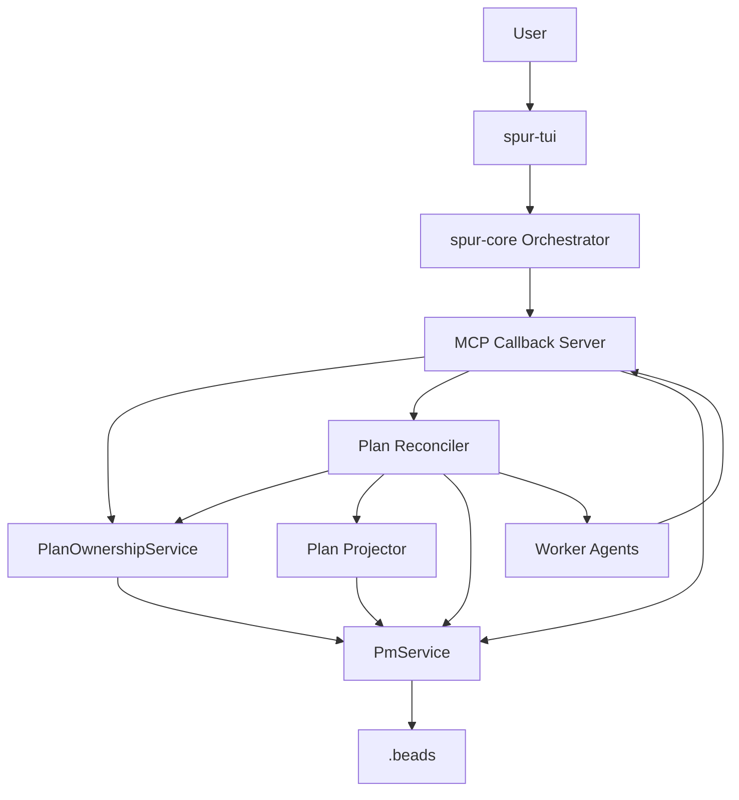
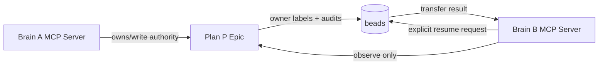
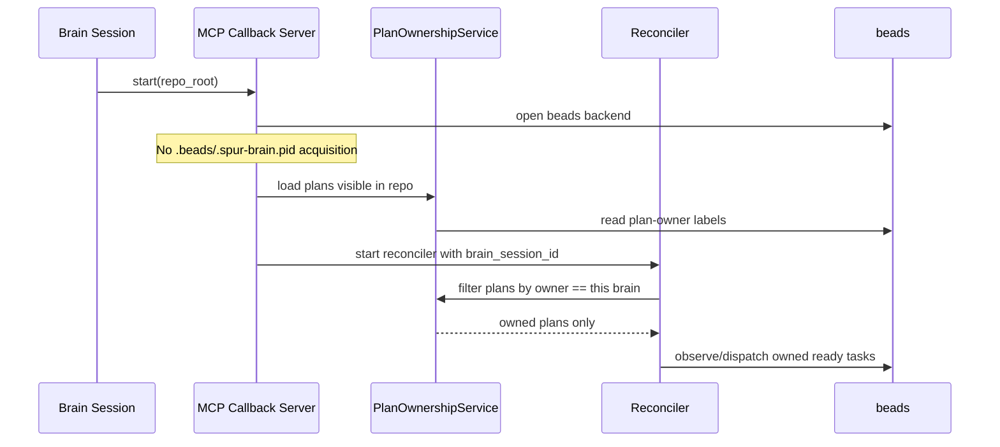
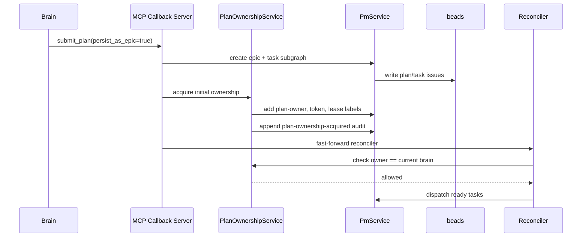
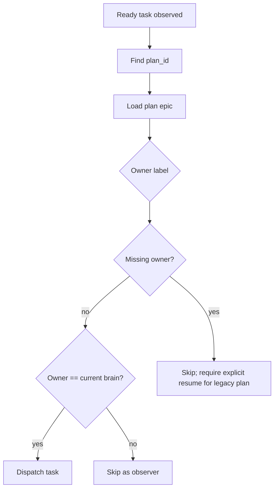
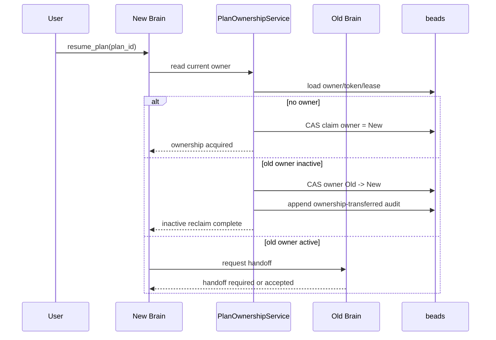
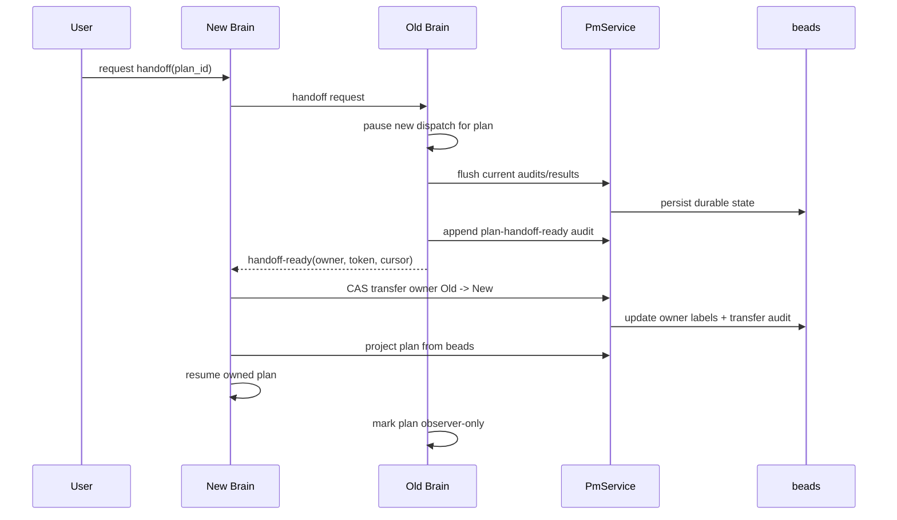
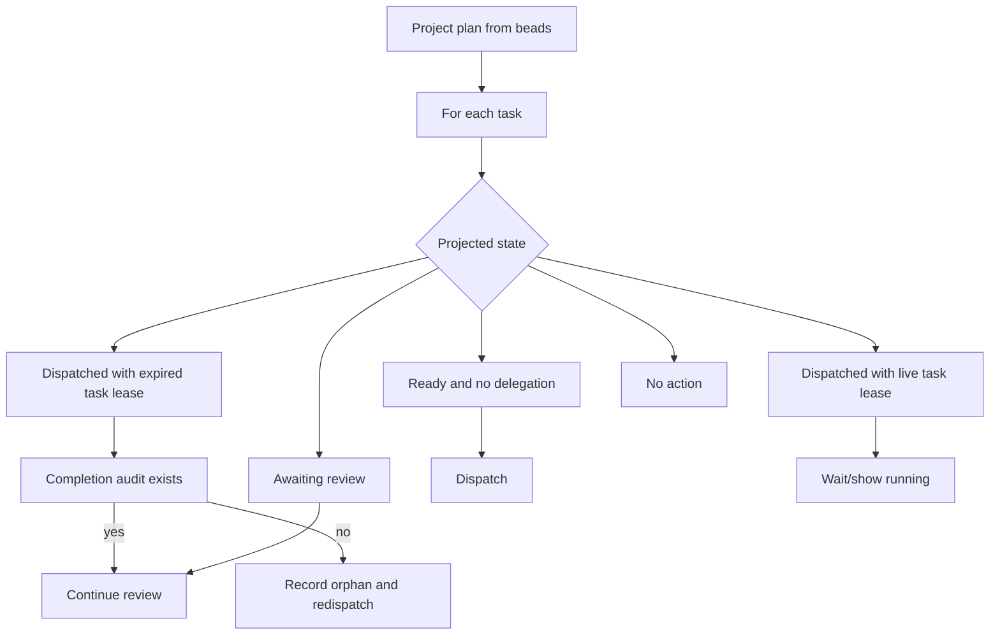

# Plan-Scoped Brain Ownership Design

Date: 2026-05-02

## Summary

SPUR currently uses `.beads/.spur-brain.pid` to enforce one brain session per
repository. That lock protects `.beads/` from concurrent brain writers, but it
also blocks legitimate workflows where multiple SPUR sessions open the same
repo. The first-principles correction is to move authority from repo scope to
plan scope:

```text
One plan has one writer brain session.
Other brain sessions may observe the plan.
Ownership transfers only through explicit user action.
```

This design replaces the global brain startup lock with plan-scoped ownership,
explicit resume/reclaim, and a later active handoff protocol. The MVP removes
the immediate single-brain startup blocker while preserving one writer per plan.

## Goals

- Allow multiple MCP callback servers / brain sessions to start for one
  `.beads/` repo.
- Preserve one authoritative writer per persisted plan.
- Make plan ownership visible and durable in beads.
- Support explicit user-driven resume/reclaim of a plan onto another brain
  session.
- Recover from owner crashes by projecting plan state from beads.
- Keep ordinary task scheduling simple: no autonomous per-task multi-brain
  scheduling in this design.

## Non-Goals

- Multiple brains dispatching tasks from the same plan at the same time.
- Automatic plan stealing by idle brain sessions.
- Full distributed locking for every task and signal transition.
- Cross-machine endpoint discovery in the MVP.
- Replacing existing dispatch attempt metadata such as `spur:delegation-id:*`
  and `spur:lease-expires-at:*`.

## First Principles

The global pidfile protects too much. The dangerous operation is not "opening a
repo"; it is making plan-affecting writes:

- dispatching a task
- updating completion/review state
- processing plan signals
- mutating the plan graph
- closing or merging the plan

Therefore the authority boundary should be the plan, not `.beads/`.

## End-State Invariants

| ID | Invariant | Enforcement |
|---|---|---|
| O1 | At most one brain owns a plan for writes. | `spur:plan-owner:*` plus ownership token CAS |
| O2 | Non-owner brains are observers for that plan. | Reconciler and tool write-path checks |
| O3 | Ownership transfer is explicit. | `resume_plan` / TUI action only |
| O4 | Stale owners cannot write after transfer. | Owner token fencing on write paths |
| O5 | Resume reconstructs from beads, not memory. | Projector + audit/delegation classification |
| O6 | Active owner transfer is cooperative unless user forces reclaim. | Handoff request, ready audit, timeout |

## Ownership Labels

Labels must stay within beads label grammar. Brain session UUIDs are normalized
by removing hyphens.

```text
spur:plan-owner:<compact_brain_session_id>
spur:plan-owner-token:<compact_token>
spur:plan-owner-lease-expires-at:<unix_ts>
```

Example:

```text
spur:plan-owner:550e8400e29b41d4a716446655440000
spur:plan-owner-token:7c6258f16a674f6aa9b45ea1ef59ff7a
spur:plan-owner-lease-expires-at:1777777777
```

Endpoint metadata should not be a label in the first version because URLs are
not label-safe. Store optional endpoint data in a sentinel audit comment or a
future structured beads metadata field.

## Audit Sentinels

Ownership changes must leave durable breadcrumbs.

```json
{
  "kind": "plan-ownership-acquired",
  "plan_id": "P",
  "owner": "brain-A",
  "token": "token-A",
  "reason": "submit_plan"
}
```

```json
{
  "kind": "plan-ownership-transferred",
  "plan_id": "P",
  "from": "brain-A",
  "to": "brain-B",
  "mode": "inactive-reclaim",
  "previous_token": "token-A",
  "new_token": "token-B"
}
```

```json
{
  "kind": "plan-handoff-ready",
  "plan_id": "P",
  "owner": "brain-A",
  "token": "token-A",
  "progress_cursor": "latest-durable-audit-or-journal-position"
}
```

## Component Architecture



### Components

| Component | Responsibility |
|---|---|
| `PlanOwnershipService` | Reads, claims, renews, transfers, and validates plan ownership |
| `McpCallbackServer` | Starts without repo-global brain pidfile; exposes ownership-aware tools |
| `Reconciler` | Dispatches only plans owned by its brain session |
| `Plan Projector` | Reconstructs plan state from beads for resume/reclaim |
| `PmService` / beads adapter | Persists owner labels, audit sentinels, and later CAS mutations |
| TUI | Shows owner state and offers resume/reclaim/handoff actions |

## Component Interaction Model



The ownership label is the write gate. A brain may have a live MCP server and
still be a non-owner for most plans in the repo.

## Startup Behavior

End state:



If a plan is owned by another live session, the new brain displays it as
observer-only.

## Submit Plan Flow



Submit-time ownership is not a transfer. It is initial acquisition by the brain
that created the plan.

## Reconciler Dispatch Gate

The reconciler must check plan ownership before dispatching or terminalizing.



MVP may temporarily allow owner-missing plans in a controlled migration mode,
but the end state should require explicit resume/claim for unowned legacy plans.

## Explicit Resume/Reclaim Flow



The user action is the trigger. Background brains do not automatically reclaim
plans they see.

## Active Handoff Flow



If the old owner does not respond by timeout, the TUI offers a user-visible
force reclaim. Force reclaim still writes an audit sentinel.

## Resume Classification

After ownership moves, the new owner reconstructs from beads.



Existing task metadata remains useful:

```text
spur:delegation-id:<delegation_id>
spur:lease-expires-at:<unix_ts>
```

Those labels support in-flight recovery inside an owned plan. They are not used
to let multiple brains schedule the same plan concurrently.

## CAS Requirement

Ownership transfer must be compare-and-set. Without CAS, two brain sessions can
both reclaim the same inactive plan.

Required end-state primitive:

```text
transfer_plan_owner(
  plan_id,
  expected_owner,
  expected_token,
  new_owner,
  new_token,
  new_lease_expires_at
)
```

The mutation succeeds only if the expected owner and token are still current.
Renewals are also token-fenced:

```text
renew_plan_owner(plan_id, owner, token, new_lease_expires_at)
```

## MVP Scope

The MVP intentionally does less than the end state.

### MVP In

1. Add plan-owner label helpers.
2. Persist plan owner for newly submitted persisted plans.
3. Make the reconciler skip plans owned by another brain.
4. Allow multiple MCP callback servers to start against one beads repo.
5. Add minimal observer state for non-owned plans.
6. Add minimal inactive `resume_plan` if existing liveness checks can be reused cheaply.

### MVP Out

1. Active handoff.
2. CAS-backed transfer.
3. Owner lease renewal.
4. Endpoint discovery.
5. Cross-machine active handoff.
6. Per-task multi-brain scheduling.

### MVP Safety Contract

```text
Multiple brains may run.
Only the plan owner dispatches a plan.
Ownership transfer is explicit.
MVP inactive reclaim may be limited to local/session-liveness evidence.
```

## Full Rollout Plan

### Phase 1: Ownership Metadata

- Add label constructors/parsers:
  - `plan_owner`
  - `parse_plan_owner`
  - `plan_owner_token`
  - `parse_plan_owner_token`
  - `plan_owner_lease_expires_at`
- Add audit sentinel variants:
  - `PlanOwnershipAcquired`
  - `PlanOwnershipTransferred`
  - `PlanHandoffReady`
- Tests:
  - labels are br-legal
  - audit comments round-trip

### Phase 2: Persist Owner on Submit

- `submit_plan(persist_as_epic=true)` writes owner metadata on the epic.
- Owner is the current `brain_session_id`.
- Tests:
  - persisted plan epic has owner label
  - owner audit is emitted

### Phase 3: Reconciler Ownership Gate

- Reconciler reads plan epic before dispatch.
- Owned by current brain: dispatch allowed.
- Owned by other brain: skip as observer.
- Missing owner: skip and require explicit resume, except optional migration mode.
- Tests:
  - owner can dispatch
  - non-owner cannot dispatch
  - missing-owner legacy plan is not silently dispatched by multiple brains

### Phase 4: Remove Startup Pidfile Gate

- MCP callback server no longer acquires `.beads/.spur-brain.pid` at startup.
- Keep community TUI singleton behavior separate if product tier still requires
  it, but do not use it as beads writer authority.
- Tests:
  - two callback servers start in one repo
  - they only dispatch their owned plans

### Phase 5: Inactive Resume/Reclaim

- Add `resume_plan(plan_id)` MCP tool or internal TUI command.
- If no owner, claim.
- If owner inactive, transfer.
- If owner active, return handoff-required.
- Tests:
  - unowned plan can be claimed explicitly
  - inactive owned plan transfers
  - active owned plan does not transfer automatically

### Phase 6: Owner Lease and CAS

- Add CAS backend operation for ownership transfer and renewal.
- Add owner lease heartbeat.
- Reject writes with stale owner token.
- Tests:
  - concurrent reclaims produce one winner
  - stale owner cannot renew after transfer
  - stale owner cannot dispatch/review after transfer

### Phase 7: Active Handoff

- Add handoff request/response path.
- Old owner pauses dispatch and writes `plan-handoff-ready`.
- New owner CAS-transfers and resumes.
- Tests:
  - active handoff succeeds
  - old owner becomes observer
  - handoff timeout permits force reclaim only with explicit user action

## Test Matrix

| Behavior | Test |
|---|---|
| Multiple servers start | `server_start_pidfile` replacement test |
| Owner label emitted | `submit_plan_persist` or new ownership test |
| Owner dispatches | reconciler integration test |
| Non-owner skips | reconciler integration test |
| Legacy unowned plan requires resume | projector/reconciler test |
| Inactive reclaim transfers | ownership service test |
| Active owner refuses MVP reclaim | ownership service test |
| CAS has one winner | backend test after Phase 6 |
| Stale owner fenced | reconciler/tool write-path tests after Phase 6 |

## Risks

| Risk | Mitigation |
|---|---|
| Owner labels are not atomic in MVP | Keep MVP transfer limited; add CAS before production-grade force reclaim |
| Legacy plans lack owner | Require explicit resume or controlled migration |
| Old worker completes after reclaim | Use existing delegation-id and completion audit classification |
| Active owner liveness is ambiguous | Lease expiry is authoritative in end state |
| User expects automatic takeover | TUI copy must make transfer explicit |

## Decision

Use plan-scoped brain ownership. Remove repo-global brain startup locking only
after the reconciler respects plan ownership. Defer full per-task multi-brain
scheduling. Build active handoff and CAS as follow-up hardening after the MVP.
