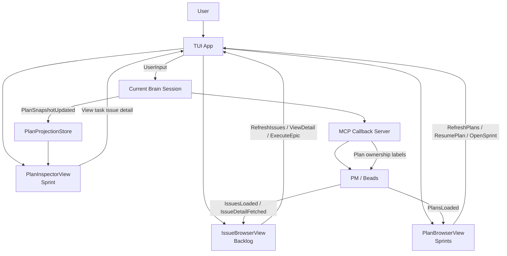
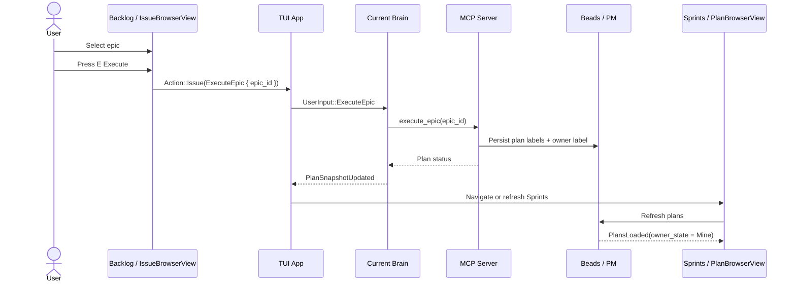
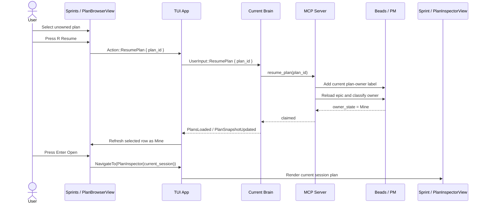
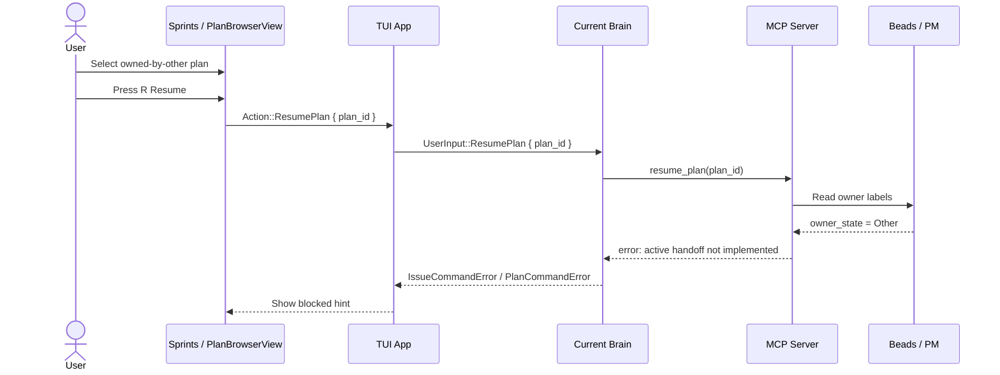
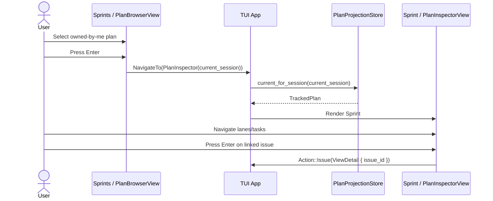
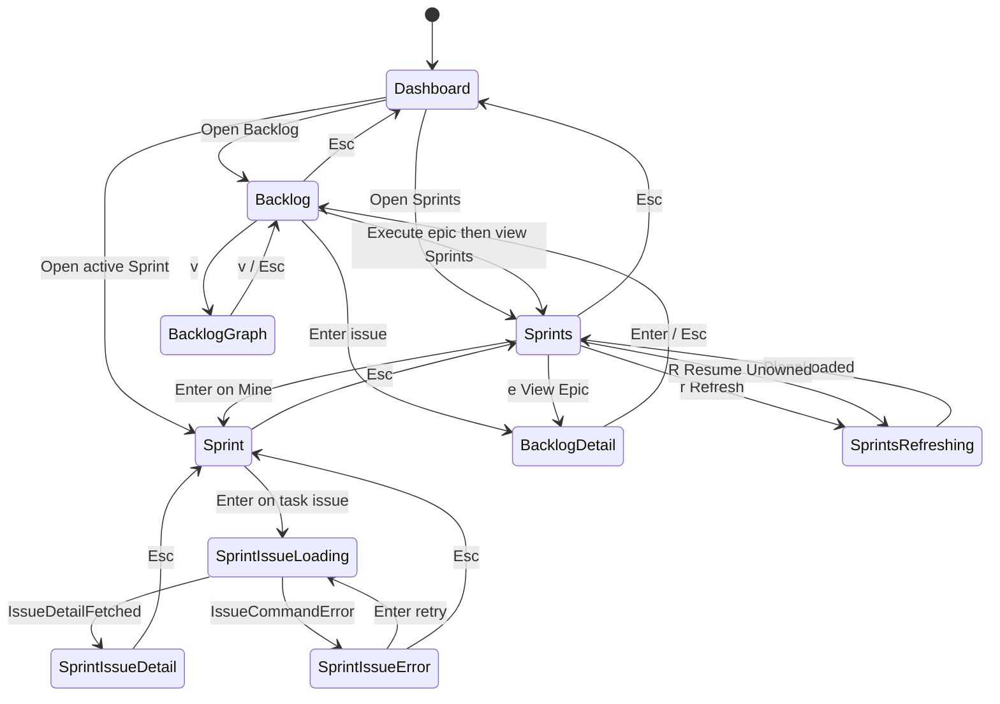
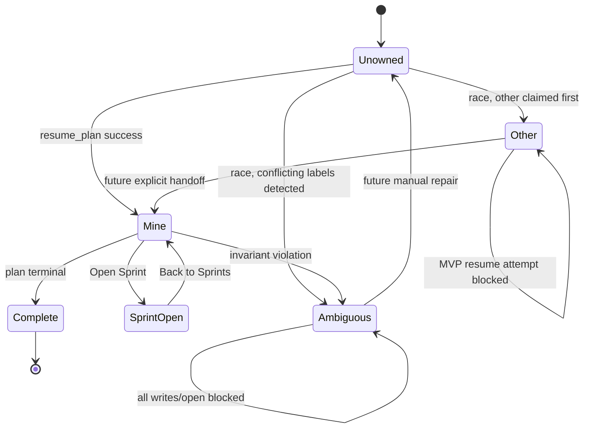
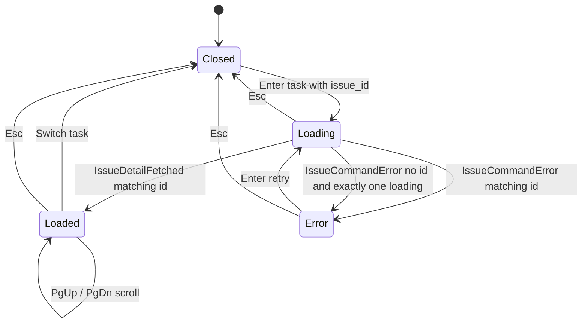

# TUI Backlog / Sprints / Sprint Navigation Design

Date: 2026-05-02

## Summary

SPUR should split issue browsing, plan ownership browsing, and active plan execution into three separate TUI surfaces:

- **Backlog**: repository issue inventory, implemented by `IssueBrowserView`.
- **Sprints**: persisted plan ownership/control plane, implemented by new `PlanBrowserView`.
- **Sprint**: current brain-owned plan execution cockpit, implemented by `PlanInspectorView`.

The first-principles boundary is write authority. Backlog can browse broad repository state. Sprints can browse durable plans and decide ownership actions. Sprint may only inspect and operate on the plan already assigned to the current brain session.

## Core Invariants

1. `PlanInspectorView` only shows the current brain session's active/owned plan.
2. `IssueBrowserView` remains issue-first and must not become a plan ownership browser.
3. `PlanBrowserView` is the only general persisted-plan browser.
4. A plan opens in `PlanInspectorView` only when ownership is confirmed as current brain.
5. `owned_by_other` and `ambiguous_owner` plans cannot open in `PlanInspectorView`.
6. MVP `resume_plan` may claim only unowned plans. Active handoff is explicitly deferred.

## Mental Model

```text
Backlog  = IssueBrowserView   = repository work inventory
Sprints  = PlanBrowserView    = persisted plan ownership/control
Sprint   = PlanInspectorView  = current brain-owned execution view
```

## Component Architecture



## View Responsibilities

### Backlog: `IssueBrowserView`

Backlog is repository-scoped. It answers "what work exists?"

Responsibilities:

- List PM issues and epics.
- Open issue detail.
- Open issue dependency graph.
- Start `execute_epic` from an epic.
- Navigate to Sprints after plan creation if appropriate.

Non-responsibilities:

- It does not decide plan ownership.
- It does not list persisted plans as first-class objects.
- It does not open `PlanInspectorView` directly from a raw epic.

### Sprints: `PlanBrowserView`

Sprints is ownership-scoped. It answers "which persisted plans exist and which can this brain own?"

Responsibilities:

- List persisted plan epics.
- Display ownership state.
- Display plan lifecycle/progress summary.
- Resume unowned plans.
- Open current-brain-owned plans into Sprint.
- Block owned-by-other and ambiguous plans.
- Link back to the source epic in Backlog.

### Sprint: `PlanInspectorView`

Sprint is execution-scoped. It answers "what is happening inside the current brain's assigned plan?"

Responsibilities:

- Show task DAG/stages for the current active plan.
- Show task execution and review state.
- Show linked issue detail for tasks.
- Handle task detail scrolling and issue-detail loading/error states.

Non-responsibilities:

- It does not browse all persisted plans.
- It does not reclaim ownership.
- It does not show plans not assigned to the current brain session.

## Data Contracts

### Backlog Issue Summary

```rust
struct IssueSummaryEvent {
    id: String,
    title: String,
    status: String,
    issue_type: Option<String>,
    priority: Option<i32>,
    assignee: Option<String>,
}
```

### Sprints Plan Summary

```rust
struct PlanSummaryEvent {
    plan_id: String,
    epic_id: String,
    title: String,
    owner_state: PlanOwnerStateEvent,
    lifecycle: PlanLifecycleEvent,
    counts: Option<PlanSummaryCountsEvent>,
    updated_at: Option<DateTime<Utc>>,
}

enum PlanOwnerStateEvent {
    Mine,
    Unowned,
    Other { owner: String },
    Ambiguous { owners: Vec<String> },
}

enum PlanLifecycleEvent {
    Pending,
    Running,
    AwaitingReview,
    Complete,
    Failed,
    Unknown,
}
```

### Sprint Active Plan

`PlanInspectorView` should continue to use:

```rust
ctx.plan_projection.current_for_session(&self.session_id)
```

This is the correct guardrail: no session plan projection means no active Sprint for this brain.

## ASCII Wireframes

### Backlog

```text
┌──────────────────────────── Backlog ────────────────────────────┐
│ Filter: open/all   Search: ____        r Refresh   E Execute     │
├───────┬──────────┬────────────┬───────────────┬─────────────────┤
│ Type  │ ID       │ Status     │ Priority      │ Title           │
├───────┼──────────┼────────────┼───────────────┼─────────────────┤
│ epic  │ bd-120   │ open       │ P1            │ Auth migration  │
│ task  │ bd-121   │ open       │ P2            │ Token cleanup   │
│ epic  │ bd-122   │ blocked    │ P2            │ TUI sprint flow │
└───────┴──────────┴────────────┴───────────────┴─────────────────┘
│ Enter detail   v graph   W work task   E execute epic   Esc back │
└──────────────────────────────────────────────────────────────────┘
```

### Backlog Issue Detail

```text
┌──────────── Backlog ────────────┬──────────── Issue Detail ──────┐
│ > epic bd-120 Auth migration    │ bd-120                         │
│   task bd-121 Token cleanup     │ Status: open   Priority: P1    │
│   epic bd-122 TUI sprint flow   │ Labels: spur:source-issue      │
│                                 │                                │
│                                 │ Description                    │
│                                 │ Implement auth migration...    │
└─────────────────────────────────┴────────────────────────────────┘
│ PgUp/PgDn scroll   Enter close detail   E execute epic            │
└───────────────────────────────────────────────────────────────────┘
```

### Sprints

```text
┌──────────────────────────── Sprints ─────────────────────────────┐
│ r Refresh   Enter Open   R Resume   b Backlog   Esc Dashboard     │
├──────────────┬──────────┬──────────────┬──────────┬──────────────┤
│ Plan         │ Epic     │ Owner        │ State    │ Progress     │
├──────────────┼──────────┼──────────────┼──────────┼──────────────┤
│ plan-a1      │ bd-120   │ mine         │ running  │ 2/7 done     │
│ plan-b2      │ bd-122   │ unowned      │ paused   │ 0/4 done     │
│ plan-c3      │ bd-130   │ other-brain  │ running  │ 1/5 done     │
│ plan-d4      │ bd-140   │ ambiguous    │ invalid  │ --           │
└──────────────┴──────────┴──────────────┴──────────┴──────────────┘
│ mine: Enter opens Sprint   unowned: R resumes   other: blocked    │
└───────────────────────────────────────────────────────────────────┘
```

### Sprints Detail

```text
┌────────────── Sprints ──────────────┬──────────── Plan Detail ────┐
│ > plan-a1  mine        running      │ Plan: plan-a1               │
│   plan-b2  unowned     paused       │ Epic: bd-120                │
│   plan-c3  other       running      │ Owner: current brain        │
│   plan-d4  ambiguous   invalid      │ Tasks: ready 2 running 1    │
│                                     │ Next: wait for review       │
└─────────────────────────────────────┴─────────────────────────────┘
│ Enter Open Sprint   R Resume   e View Epic   r Refresh            │
└───────────────────────────────────────────────────────────────────┘
```

### Sprint

```text
┌──────────────────────────── Sprint: plan-a1 ─────────────────────┐
│ Status running       Progress 2/7 reviewed       Next review task │
├──────── Ready ───────┬────── Running ──────┬──── Awaiting Review ─┤
│ > bd-121 Token clean │ bd-124 API update   │ bd-126 Tests         │
│   bd-122 Model sync  │                     │                      │
├──────────────────────┴─────────────────────┴──────────────────────┤
│ Task detail                                                        │
│ task: bd-121                                                       │
│ issue: bd-121                                                      │
│ status: ready                                                      │
│ agent: codex                                                       │
│                                                                    │
│ Issue                                                              │
│ title: Token cleanup                                               │
│ description: ...                                                   │
└────────────────────────────────────────────────────────────────────┘
│ h/l lane   j/k task   Enter issue detail   PgUp/PgDn scroll        │
│ Esc back to Sprints                                                │
└────────────────────────────────────────────────────────────────────┘
```

## User Journeys

### Journey 1: Create Sprint From Backlog



### Journey 2: Resume Unowned Sprint



### Journey 3: Block Active Handoff in MVP



### Journey 4: Inspect Current Sprint



## View State Transitions



## Ownership State Transitions



## Sprint Issue Detail State



## PlanBrowser MVP Behavior

### Row Actions

| Owner state | Enter | R Resume | e View Epic |
| --- | --- | --- | --- |
| `Mine` | Open Sprint | No-op / already owned hint | Backlog detail |
| `Unowned` | Hint: resume first | `resume_plan` | Backlog detail |
| `Other` | Blocked hint | Blocked hint | Backlog detail |
| `Ambiguous` | Blocked hint | Blocked hint | Backlog detail |

### Empty States

```text
No plans found.
Press b to open Backlog and execute an epic.
```

```text
No sprint owned by this brain.
Open Sprints to resume or Backlog to execute an epic.
```

## Required TUI Additions

```rust
enum ViewId {
    Dashboard,
    IssueBrowser,
    PlanBrowser,
    PlanInspector(SessionId),
    // ...
}

enum Action {
    RefreshPlans,
    ResumePlan { plan_id: String },
    NavigateTo(ViewId),
    // ...
}

enum UserInput {
    RefreshPlans,
    ResumePlan { plan_id: String },
    // ...
}
```

## Required Event Additions

```rust
enum SpurEventBody {
    PlansLoaded {
        plans: Vec<PlanSummaryEvent>,
    },
    PlanCommandError {
        operation: String,
        plan_id: Option<String>,
        error: String,
    },
    // ...
}
```

`PlanCommandError` can be deferred if the MVP reuses the existing command error surface, but a plan-specific error event is cleaner once PlanBrowser exists.

## Navigation Rules

Never allow:

```text
Backlog raw epic -> Sprint
Sprints owned-by-other -> Sprint
Sprints ambiguous -> Sprint
Sprint selecting arbitrary persisted plan
```

Only allow:

```text
Sprints Mine -> Sprint(current_session)
```

`PlanInspectorView` still guards with:

```rust
ctx.plan_projection.current_for_session(&self.session_id)
```

If there is no current projection, render:

```text
No active sprint for this brain session.
Open Sprints to resume or Backlog to execute an epic.
```

## MVP Implementation Order

1. Add `PlanSummaryEvent` and `PlansLoaded`.
2. Add `RefreshPlans` / `ResumePlan` user input bridge.
3. Add MCP/orchestrator plan listing from beads labels.
4. Add `PlanBrowserView` read-only list.
5. Add `ResumePlan` action for unowned rows.
6. Add `Open Sprint` action for `Mine` rows only.
7. Add route wiring and status-bar hints.
8. Add snapshot tests for all owner-state rows.
9. Add integration tests for resume/open blocked cases.

## Deferred Work

- Active owner handoff handshake.
- Manual ambiguous-owner repair UI.
- Multi-plan dashboard metrics.
- Plan search/filter.
- Plan detail graph visualization.
- Cross-brain live presence indicators.
