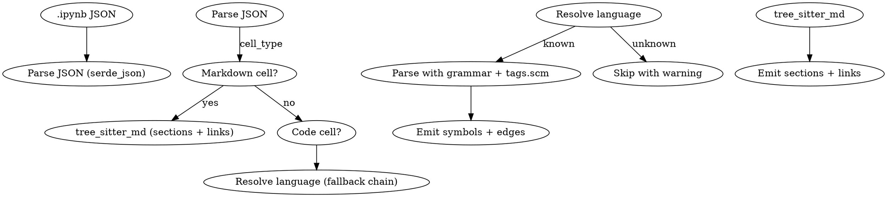

# spur-graph: Jupyter Notebook (.ipynb) Extraction Support

**Date:** 2026-06-10
**Status:** approved (plan)
**Upstream consumers:** spur-analyst (DuckDB graph index), knowledge-context-pack, code_* MCP tools

## Problem

`spur-graph` discovers source files by extension and routes each to a tree-sitter grammar for symbol extraction. `.ipynb` files are JSON containers holding multi-language cells — they don't match any tree-sitter grammar directly, so they're invisible to the code graph. Symbols defined inside notebook cells (functions, classes in Python cells; functions, classes in JavaScript cells; section headings in markdown cells) are absent from the analyst index, knowledge-context-pack retrieval, and code_* MCP tools.

## Cell Language Resolution

Jupyter nbformat 4 has **no native per-cell language field**. Code cells inherit the notebook-level kernel. The standard metadata fields are:

| Level | Field | Purpose |
|---|---|---|
| Notebook | `metadata.kernelspec.name` | Kernel name (e.g. `"python3"`) |
| Notebook | `metadata.language_info.name` | Language name (e.g. `"python"`) |
| Cell | *(none)* | Jupyter defines no standard per-cell language field |

SPUR notebooks add a custom field at `cell.metadata.spur.code_type` (namespaced per Jupyter's guidance: *"any custom metadata should use a sufficiently unique namespace"*).

The extraction fallback chain for each code cell:

```
1. cell.metadata.spur.code_type       ← SPUR custom (fast path)
2. cell.metadata.kernelspec.name      ← cell-level kernel override (SPUR polyglot)
3. root.metadata.kernelspec.name      ← standard notebook-level kernel
4. root.metadata.language_info.name   ← standard notebook-level language
```

Supported `code_type` values and their tree-sitter grammar mapping:

| code_type / kernelspec | Tree-sitter grammar | Language variant |
|---|---|---|
| `"python"` / `"python3"` | `tree_sitter_python` | Python |
| `"javascript"` | `tree_sitter_typescript::LANGUAGE_TSX` | JavaScript |
| `"rust"` / `"evcxr"` | `tree_sitter_rust` | Rust |
| `"go"` / `"gonb"` | `tree_sitter_go` | Go |
| `"julia"` / `"julia"` | `tree_sitter_julia` | Julia |
| `"r"` / `"ir"` | `tree_sitter_r` | R |
| *(fallback)* | skip cell with warning | — |

Markdown cells (`cell_type: "markdown"`) are extracted using the existing markdown tree-sitter grammar for section headings and links.

## Extraction Architecture

New file: `crates/spur-graph/src/extract/notebook.rs` (follows `markdown.rs` pattern):



Each extracted cell becomes a `Contains` child of the `.ipynb` file node. Symbol ranges are scoped to cell-relative byte offsets.

## Files Changed

| File | Change |
|---|---|
| `crates/spur-graph/src/extract/mod.rs` | Add `pub mod notebook;` |
| `crates/spur-graph/src/extract/notebook.rs` | New file: notebook extraction |
| `crates/spur-graph/src/extract/languages.rs` | Add `JupyterNotebook` variant, config, matcher, registry entry |
| `crates/spur-graph/src/extract/tree_sitter.rs` | Wire notebook extraction in `BytesExtractor::extract_graph_facts` + `symbol_query_policy` |
| `crates/spur-graph/queries/README.md` | Add JupyterNotebook coverage row |
| `crates/spur-graph/Cargo.toml` | Add `serde_json` (already present), no new deps needed |

## Gate Contract

- `Language::JupyterNotebook` must appear in the registry with `.ipynb` extension
- No `@definition.*` captures required (extraction is programmatic, not query-driven)
- Definition coverage: none (no tree-sitter grammar for the container itself)
- Relation coverage: `contains` only (cells are contained under the file node; per-cell edges are emitted by the delegated grammar)
- The gate `every_registered_language_satisfies_query_contract` must be updated to handle the language-family-as-container case

## Future Work (not in scope)

- **Cell-level graph nodes**: emit explicit cell container nodes (`NodeKind::Section`) between the file and per-cell symbols for cell-level navigation
- **Output extraction**: parse cell outputs for references to data artifacts
- **Incremental re-extraction**: track cell content hashes for notebook-level incremental rebuild

## Acceptance Criteria

1. `.ipynb` files are discovered by `build_facts`
2. Python code cells are extracted with the Python grammar
3. JavaScript code cells are extracted with the TSX grammar
4. Markdown cells produce section headings
5. Unknown-language code cells are skipped with a warning (not a crash)
6. The cell language fallback chain is exercised in order
7. Extracted symbols appear in the analyst index and code_* MCP tools
